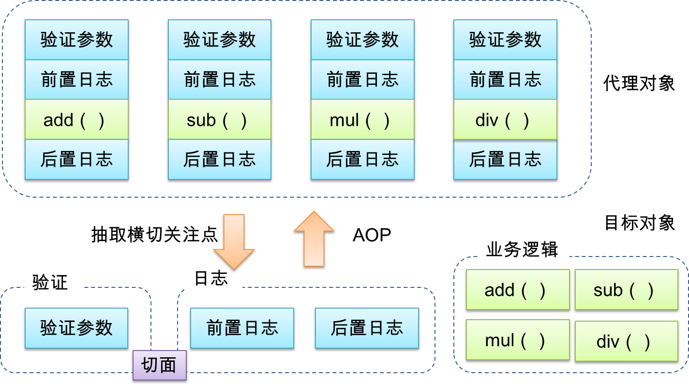

# 一、概述

## 1. AOP 是什么？

AOP（**A**spect **O**riented **P**rogramming，即面向切面编程）。AOP 是一种新的编程方式，是一种编程思想，是面向对象编程（OOP）的一种补充。它和OOP不同，OOP把系统看作多个对象的交互，AOP把系统分解为不同的关注点，或者称之为切面（`Aspect`）。

例如下面这个图就是一个AOP切面的模型图，是在某一个方法执行前后执行的一些操作，并且这些操作不会影响程序本身的运行。



AOP切面编程中有一些比较专业的术语，如下：

| 术语                  | 含义                                                         |
| :-------------------- | :----------------------------------------------------------- |
| 横切关注点            | 从每个方法中抽取出来的同一类非核心业务                       |
| 切面（`Aspect`）      | 封装横切关注点信息的类，每个关注点体现为一个通知方法。       |
| 通知（`Advice`）      | 切面必须要完成的各个具体工作                                 |
| 目标（`Target`）      | 被通知的对象                                                 |
| 代理（`Proxy`）       | 向目标对象应用通知之后创建的代理对象                         |
| 连接点（`Joinpoint`） | 横切关注点在程序代码中的具体体现，对应程序执行的某个特定位置。 |
| 切入点（`Pointcut`）  | 执行或找到连接点的一些方式                                   |

AOP 的主要作用是把一些跟核心业务逻辑模块无关的功能抽离出来，这些跟业务逻辑无关的功能通常包括日志统计、安全控制、异常处理等。把这些功能抽离出来之后， 再通过“动态织入”的方式掺入业务逻辑模块中。

**通知** 是切面的具体实现，分为 `before`（前置通知）、`after`（后置通知）、`around`（环绕通知）。

## 2. 为什么需要 AOP？

AOP 的好处首先是可以保持业务逻辑模块的纯净和高内聚性，其次是可以很方便地复用日志统计等功能模块。我们来看一种应用场景，我的同事之前写了函数用于输出当前的时间，而我现在的需求是输出当前天气之后再输出当前时间，下面有两种解决思路：

（1）传统解决办法： 拿同事的函数过来，找到他输出时间的代码，在这些代码之前加入输出当前天气的代码。

（2）装饰者模式（AOP）解决办法：拿同事的函数过来，不用看他的源码，直接给他的函数装饰一下，装饰的东西也就是输出当前天气的代码。

**两种方法都解决了问题，但是他们的出发点是完全不同的：**

（1）方法是改造原函数的内部，我们就需要去理解源代码，然后做修改，这种方式是以侵入源代码的形式进行的。

（2）方法是给原函数添加了一层外套，我们根本不用管原本函数的内部实现。

**现在又有了新的需求：在输出当前时间之前，先输出当前温度**

（1）方法，我们在第一个需求已经把同事的代码改的面目全非了，现在又要重新理解函数内部，并加以修改（删除输出当前天气的代码，然后加入输出当前温度的代码）。
（2）方法，同事原本的函数是没有变的，我们现在给同事的函数换一件套（输出当前温度）就可以了。

这样对比起来，是不是使用 AOP 的思想更容易呢？

# 二、实现

## 1. AOP with Prototype

通常，在 JavaScript 中实现 AOP，都是指把一个函数“动态织入”到另外一个函数之中，具体的实现技术有很多，下面我用扩展 `Function.prototype` 来做到这一点。请看下面代码：

```javascript
/**
 * 前置通知
 * @description 给方法加入前置切片函数，可以在执行方法之前执行一些操作,
 * @param {Function} callback 前置执行函数
 * @returns
 */
Function.prototype.before = function (callback) {
  // → 保存原函数引用
  var _that = this;
  return function () {
    // → 执行新函数，且保证 this 不被劫持，新函数接受的参数也会被原封不动地传入原函数，新函数在原函数之前执行
    callback.apply(this, arguments);
    // → 执行原函数并返回原函数的执行结果，并且保证 this 不被劫持
    return _that.apply(this, arguments);
  };
};

/**
 * 后置通知
 * @description 给方法加入后置切片函数，可以在执行方法之后执行一些操作
 * @param {Function} fun 后置函数
 * @returns
 */
Function.prototype.after = function (callback) {
  // → 保存原函数引用
  var _this = this;
  return function () {
    // → 执行原函数，并且保证 this 不被劫持
    var agent = _this.apply(_this, arguments);
    // → 执行新函数，且保证 this 不被劫持，新函数接受的参数也会被原封不动地传入原函数，新函数在原函数之前执行
    callback.apply(_this, arguments);
    // → 返回包含了原函数和新函数的"代理"函数
    return agent;
  };
};

/**
 * 环绕通知
 * @description 在方法执行前后分别执行
 * @param {*} beforeFn 前置函数
 * @param {*} afterFn  后置函数
 * @returns
 */
Function.prototype.around = function (beforeFn, afterFn) {
  var _that = this;
  return function () {
    return _that.before(beforeFn).after(afterFn).apply(this, arguments);
  };
};

// ———— 业务代码 ————
function logic() {
  console.log('service code...');
}

// → 1）测试前置通知
var logic1 = logic.before(function () {
  console.log('before');
});
logic1();
/*
before
service code...*/

// → 2）测试后置通知
var logic2 = logic.after(function () {
  console.log('after');
});
logic2();
/*
service code...
after */

// → 3）测试环绕通知
var logic3 = logic.around(
  function () {
    console.log('before');
  },
  function () {
    console.log('after');
  }
);
logic3();
/**
before
service code...
after */
```


