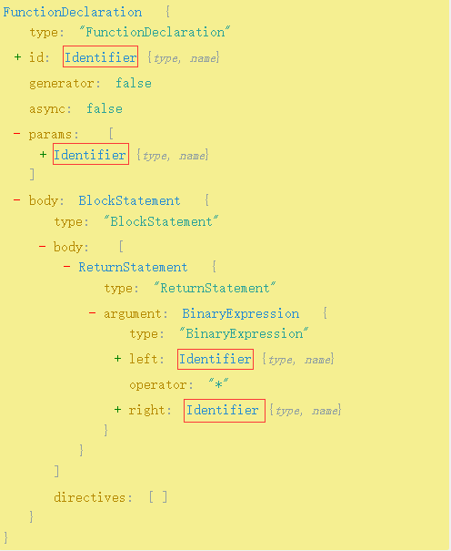
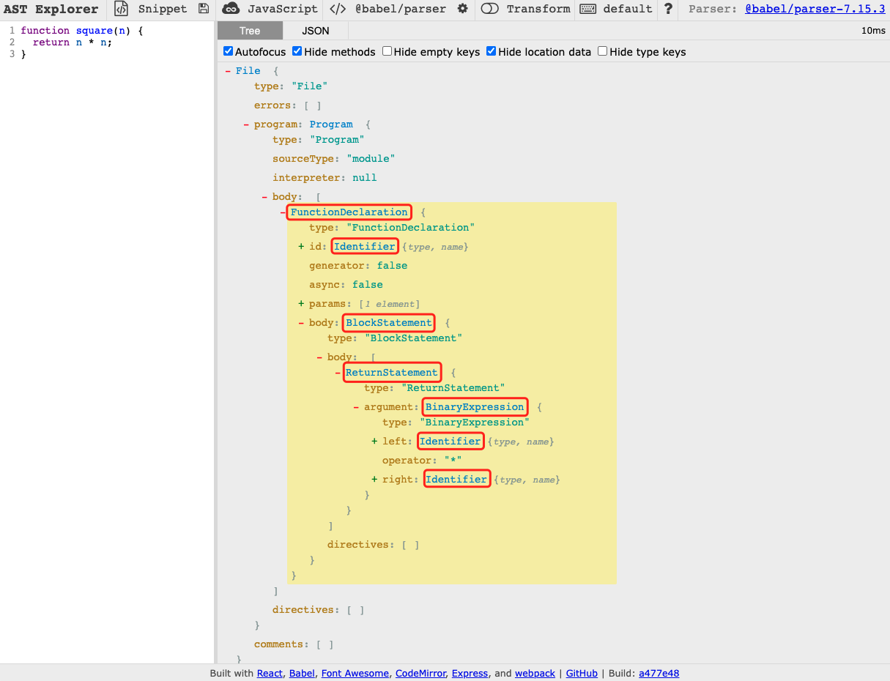

# 一、概述

## 1. 起源

[Babel >>](<https://www.babeljs.cn/>) 最开始叫 **6to5**，顾名思义就是 **es6** 转 **es5**，但是后来随着 ECMAScript 标准的演进，有了 es7、es8 等等， **6to5** 的名字已经不合适了，团队决定将它重命名为 **babel**。

babel 是 [巴别塔](https://baike.baidu.com/item/%E5%B7%B4%E5%88%AB%E5%A1%94/67557) 的意思，来自圣经中的典故：

> 当时人类联合起来兴建希望能通往天堂的高塔；为了阻止人类的计划，上帝让人类说不同的语言，使人类相互之间不能沟通，计划因此失败，人类自此各散东西，“**巴别塔**” 即由此得名。

## 2. 用途

- **① 语法转换**

  把代码中的 ESNext 、TypeScript 或者 Flow 的语法等等，转成基于目标环境支持的语法的实现。并且还可以把目标环境不支持的 API 进行 polyfill。

- **② 特定用途的代码转换**

  通过 Babel 提供的 API 可以完成代码到 AST 的解析、转换，以及目标代码的生成。 开发者可以用它来完成一些特定用途的转换，比如函数插桩（函数中自动插入一些代码，例如埋点代码）、自动国际化等。

- **③ 代码的静态分析**
  
  静态分析是在不需要执行代码的前提下对代码进行分析的处理过程 （执行代码的同时进行代码分析即是动态分析）。 静态分析的目的是多种多样的， 它可用于语法检查，编译，代码高亮，代码转换，优化，压缩等等场景。比如：
  
  - linter 工具就是分析 AST 的结构，对代码规范进行检查。
  - Api 文档自动生成工具，可以提取源码中的注释，然后生成文档。
  - Type checker 会根据从 AST 中提取的或者推导的类型信息，对 AST 进行类型是否一致的检查，从而减少运行时因类型导致的错误。
  - 压缩混淆工具，这个也是分析代码结构，进行删除死代码、变量名混淆、常量折叠等各种编译优化，生成体积更小、性能更优的代码
  - JavaScript 解释器，除了对 AST 进行各种信息的提取和检查以外，我们还可以直接解释执行 AST。

## 3. 转换工具

- **编译器**（`Compiler`）：高级语言 → 低级语言。
- **转译器**（`Transpiler`）：高级语言 → 高级语言。

高级语言：有很多用于描述逻辑的语言特性，比如分支、循环、函数、面向对象等，接近人的思维，可以让开发者快速的通过它来 表达各种逻辑。比如 Objective-C、JavaScript 等。

低级语言：与硬件和执行细节有关，会操作寄存器、内存，具体做内存与寄存器之间的复制，需要开发者理解熟悉计算机的工作原理，熟悉具体的执行细节。比如汇编语言、机器语言。

> 结论：`Babel`  就是一个  **`JavaScript Transpiler`**。

尽管 [官网 >>](https://www.babeljs.cn/) 标题介绍Babel 是一个 JavaScript 编译器，但侧重点在于 **下一代**。

## 4. 编译流程

Babel 的编译流程：首先把 **源码** 解析（`parse`）成 `AST`（*抽象语法树*），然后递归遍历 `AST` 并对齐进行增删改生成新的 AST，最后将新的 AST 生成 目标代码 / SourceMap。

简单理解，就是：`Parse` → `Transform` → `Generate`

# 二、AST - 抽象语法树

## 1. What's AST？


**抽象语法树**（**A**bstract **S**yntax **T**ree，AST），是源代码语法结构的一种抽象表示。它以 **树状** 的形式表现编程语言的语法结构，树上的每个节点都表示源代码中的一种结构。之所以说语法是“抽象”的，是因为这里的语法并不会表示出真实语法中出现的每个细节。比如，会省略掉一些无具体意义的分隔符如 `;`、`{}`  等等。

简单理解，就是把我们写的代码按照一定的规则转换成一种 **树形结构**。

## 2. 用途

AST在前端无处不在，我们熟悉的开发工具几乎全依赖于AST进行开发：比如我们常用的babel插件将 es6 → es5 、ts → js 、代码压缩、CSS预处理器、eslint等等，他们在我们的实际开发中都是必不可少的，而他们的底层原理其实也都是AST。。如果你想了解 JavaScript 编译执行（比如V8引擎的编译执行过程）的原理并掌握其精髓，那么你就必须得了解 AST。

## 3. AST 如何生成？

代码执行的第一步是读取代码文件中的 **字符流**，然后通过 **词法分析** 生成 `token`，之后再通过 **语法分析** 生成 AST，最后 **生成** 机器码执行。整个解析过程主要分为以下两个步骤：

- **词法分析**：将整个代码字符串分割成最小语法单元数组；
- **语法分析**：在分词基础上建立分析语法单元之间的关系；

### 3.1. 词法分析「分词」

词法分析，也称之为 **扫描**（`Scanner`） 或者 **令牌化**（`Token`），这一步主要是将字符流（`Char-Stream`）转换为令牌流（`Token-Stream`），简单来说就是在源代码的基础上进行分词。

比如把 **“我爱中国”**  这段字符串根据某种规则拆解成 **“我”**、**“爱”**、**“中国”** 三部分，这个过程就叫做 **分词**，其中各个部分又被称为 **词法单元** 或者叫 `Token`，对于代码来说，需要将代码片段识别为关键字、标识符、操作符、字面量等部分。

我们可以这么理解，词法分析就是把你的代码从 `string` 类型转换成了数组，数组的元素就是代码里的单词（词法单元），并且标记了每个单词的类型。比如下面这段代码：

```javascript
const a = 10;
```

词法分析器 **从左往右逐个字符扫描分析** 整个程序的字符串，当遇到不同的字符时，会驱使它迁移到不同的状态。在扫描字符的时候，遇到 `c` 字母，如果后面还有字符，将继续扫描，直到遇到空格，识别出 `const`，发现是一个关键字，将其生成词法单元 ` { type: 'Keyword', value: 'const' }`，然后接着扫描，以此类推，生成 `Token List`。

所以，这段程序会被分解成为下面这些词法单元：`let` 、`a`、`=`、`10`、 `;`，你可以在 [这里 >>](https://esprima.org/demo/parse.html?code=const%20a%20%3D%2010%3B%0A) 查看词法分析结果：

```javascript
[
  { type: 'Keyword',    value: 'const' },
  { type: 'Identifier', value: 'a'     },
  { type: 'Punctuator', value: '='     },
  { type: 'Numeric',    value: '10'    },
  { type: 'Punctuator', value: ';'     },
];
```

通过上面分解出来的词法分析结果，我们可以观察到，缺少一些比较关键的信息：

- 没有任何语法信息；

- 体现不了代码的执行顺序；

所以，需要进一步进行 **语法分析**。

### 3.2. 语法分析「解析」

语法分析会将词法分析出来的 **词法单元** 转化成有语法含义的 **抽象语法树结构（AST）**。同时，验证语法，语法如果有错的话，将抛出语法错误。

词法分析和语法分析不是完全独立的，而是交错进行的，也就是说，词法分析器不会在读取所有的词法记号后再使用语法分析器来处理。通常情况下，每取得一个词法记号，就将其送入语法分析器进行分析。


我们可以使用在线工具生成 AST：[AST explorer >>](https://astexplorer.net/) 或者 [Esprima.org >>](https://esprima.org/demo/parse.html)，这里主要简单介绍下 `AST explorer` 的使用：


比如这一段代码：

```javascript
function square(n) {
  return n * n;
}
```

经过转化，输出 **AST** 结构如下：


你会留意到 AST 的每一层都拥有相同的结构：

```javascript
{
    type: "FunctionDeclaration",
    id: {...},
    params: [...],
    body: {...}
}
```

```javascript
{
    type: "Identifier",
    name: ...
}
```

```javascript
{
    type: "BinaryExpression",
    operator: ...,
    left: {...},
    right: {...}
}
```

> 提示：出于简化的目的移除了某些属性。

这样的每一层结构，被称为 **节点**，每一个节点都包含 `type` 属性，用于表示节点类型，比如：*`FunctionDeclaration`*、*`Identifier`*、*`BinaryExpression`* 等等。除此之外，Babel 还为每个节点额外生成了一些属性，用于描述该节点在原始代码中的位置，比如： *`start`*、*`end`*、*`loc`*。

## 4. 节点类型

了解了AST结构的基本形状之后，接下来我们介绍AST节点类型，主要分为以下几个大类：**字面量**、**标志符**、**语句**、**声明**、**表达式**、**注释** 等等。

这里主要列举一些常用的类型，更多节点类型请参考 [@babel/types >>](https://www.babeljs.cn/docs/babel-types#aliases)

### 4.1. 字面量「[Literal >>](https://www.babeljs.cn/docs/babel-types#literal)」

| 类型名称         | 中文译名     | 描述                                      |
| ---------------- | ------------ | ----------------------------------------- |
| `StringLiteral`  | 字符型字面量 | 通常指字符串类型的字面量：`'Hello, AST!'` |
| `NumericLiteral` | 数值型字面量 | 通常指数字类型的字面量：`123`             |
| `BooleanLiteral` | 布尔型字面量 | 通常指布尔类型值：`true` / `false`        |
| `RegExpLiteral`  | 正则型字面量 | 通常指正则表达式：`/[0-9]/`               |
| `TemplatLiteral` | 模板型字面量 | 通常指模板字符串（`）                     |

*提示：这里主要展示常用的字面量类型，更多详情请参考[这里 >>](https://www.babeljs.cn/docs/babel-types#literal)*

### 4.2. 标志符「Identifier」

程序中所有的 变量名、函数名、对象键（`key`） 以及函数中的参数名，都属于标志符。

### 4.3. 语句「[Statement >>](https://www.babeljs.cn/docs/babel-types#statement)」

语句是能够独立执行的基本单位，常见的语句类型有：

| 类型名称              | 中文译名          | 描述                                      |
| --------------------- | ----------------- | ----------------------------------------- |
| `IfStatement`         | `If` 控制流语句   | 通常指 `if (true) {} else {}`             |
| `ForInStatement`      | `For-in` 循环语句 | 通常指 `for(let key in obj) {}`           |
| `SwitchStatement`     | `Switch` 语句     | 通常指 `switch`                           |
| `WhileStatement`      | `While` 循环语句  | 通常指 `while(true) {}`                   |
| `ForStatement`        | `For` 循环语句    | 通常指 `for(let i = 0; i < 10; i++) {}`   |
| `BreakStatement`      | 中断语句          | 通常指 `break`                            |
| `ContinueStatement`   | 持续语句          | 通常指 `continue`                         |
| `ReturnStatement`     | 返回语句          | 通常指 `return`                           |
| `BlockStatement`      | 块语句            | 包裹在 `{}` 内的语句                      |
| `ExpressionStatement` | 表达式语句        | 通常为调用一个函数，比如 `console.log(1)` |

### 4.4. 声明「[Declaration >>](https://www.babeljs.cn/docs/babel-types#declaration)」

声明语句是一种特殊的语句，它执行的逻辑是在作用域内声明一个 `变量`、函数、`class`、`import`、`export` 等。

| 类型名称                   | 中文译名         | 描述                              |
| -------------------------- | ---------------- | --------------------------------- |
| `VariableDeclaration`      | 变量声明         | `const a = 10;`                   |
| `FunctionDeclaration`      | 函数声明         | `function sum() {}`               |
| `ImportDeclaration`        | 模块引入声明     | `import { reactive } from 'vue;'` |
| `ExportDefaultDeclaration` | 模块默认导出声明 | `export default a = 10;`          |

### 4.5. 表达式「[Expression >>](https://www.babeljs.cn/docs/babel-types#expression)」

表达式的特点是执行完以后有返回值，这是和语句 (`statement`) 的区别

| 类型名称                  | 中文译名       | 描述                               |
| ------------------------- | -------------- | ---------------------------------- |
| `ArrayExpression`         | 数组表达式     | 通常指一个数组：`[1, 2, 3]`        |
| `ArrowFunctionExpression` | 箭头函数表达式 | `() => {}`                         |
| `AssignmentExpression`    | 赋值表达式     | 通常指为一个变量赋值，比如 `a = 1` |
| `BinaryExpression`        | 二元表达式     | `1 + 2`                            |
| `UnaryExpression`         | 一元表达式     | `-1`                               |
| `FunctionExpression`      | 函数表达式     | `function(){}`                     |

### 4.6. `Comment` & `Program`

| 类型名称       | 中文译名 | 描述             |
| -------------- | -------- | ---------------- |
| `Program`      | 程序主体 | 整段代码的主体   |
| `CommentBlock` | 块级注释 | `/* 块级注释 */` |
| `CommentLine`  | 单行注释 | `// 单行注释`    |

# 三、工作原理


Babel 的编译过程和大多数其他语言的编译器大致相同，可以分为 **三个阶段**：

📌：`解析(Parse)`  →  `转换(Transform)`  →  `生成(Generate)`。

## 1. 解析「Parser」

将代码字符串解析成抽象语法树（AST），每个 JavaScript 引擎（比如Chrome浏览器中的 `V8` 引擎）都有自己的AST解析器，而Babel是通过 [@babel/parser >>](https://www.babeljs.cn/docs/babel-parser) 实现的。解析过程有两个阶段：**词法分析** 和 **语法分析**，词法分析阶段把字符串形式的代码转换为**令牌**（tokens）流，令牌类似于AST中节点；而语法分析阶段则会把一个令牌流转换成 AST的形式，同时这个阶段会把令牌中的信息转换成AST的表述结构。

## 2. 转换「Transform」

对抽象语法树进行转换操作，转换步骤接收 AST 并对其进行遍历，在此过程中对节点进行添加、更新及移除等操作。 Babel通过 [@babel/traverse](https://www.babeljs.cn/docs/babel-traverse) 对其进行 **深度优先遍历**，维护AST树的整体状态，并且可完成对其的替换，删除或者增加节点，这个方法的参数为原始AST和自定义的转换规则，返回结果为转换后的AST。

## 3. 生成「Generator」

根据变换后的抽象语法树再生成代码字符串，同时还会创建 [源码映射（`source maps`）](https://www.html5rocks.com/en/tutorials/developertools/sourcemaps/)

代码生成其实很简单：深度优先遍历整个 AST，然后构建可以表示转换后代码的字符串。

Babel 通过 [@babel/generator](https://www.babeljs.cn/docs/babel-generator)  将AST转换成js代码，过程就是深度优先遍历整个AST，然后构建可以表示转换后代码的字符串。

# 四、Babel APIs

我们知道 Babel 的编译流程分为三步：`Parse` → `Transform` → `Generate`，每一步都暴露了一些 Api 出来：

- **解析阶段**：通过 `@babel/parser` 将源码转成 AST；
- **转换阶段**：通过 `@babel/traverse` 遍历AST，并调用 `visitor` 函数修改 AST，期间涉及到 AST 的判断、创建、修改等，这时候就需要 `@babel/types` 了，当需要批量创建 AST 的时候可以使用 `@babel/template` 来简化 AST 创建逻辑；
- **生成阶段**：通过 `@babel/generate` 将 AST 输出为目标代码字符串，同时生成 `sourcemap`；
- 中途遇到错误想打印代码位置的时候，使用 `@babel/code-frame` 包
- Babel 的整体功能通过 `@babel/core` 提供，基于上面的包完成 Babel 整体的编译流程，并实现插件功能。

## 1. [`@babel/parser`](https://www.babeljs.cn/docs/babel-parser)

`@babel/parser` （之前叫 `Babylon`）是基于 `acorn` 实现的，扩展了很多语法，可以支持 `ESNext`、`JSX`、`Flow`、`Typescript` 等语法的解析，其中 `JSX`、`Flow`、`Typescript`  这些非标准的语法的解析需要指定语法插件。示例如下：

```javascript
// → 导入模块
const parser = require('@babel/parser');

// → 定义一段代码字符串
const codeString = `function square(n) {
  return n * n;
}`;

// → 解析代码字符串
const ast = parser.parse(codeString, {
  sourceType: 'script', // module unambigious
  plugins: ['jsx', 'typescript'],
});

// → 输出ast
console.log(JSON.stringify(ast, null, 4));
```

## 2. [`@babel/traverse`](https://www.babeljs.cn/docs/babel-traverse)

遍历 AST，并在遍历过程中对 AST 节点进行增删改。遍历一个节点的过程是：`Enter` → `Traverse child node` → `Exit`

语法形式如下：

```javascript
require("@babel/traverse").default(ast, visitors)
```

- `ast`：抽象语法树AST
- `visitors`：访问者

示例代码：

```javascript
require("@babel/traverse").default(ast, {
  /** - 1.进入节点时调用（一般不用） */
  enter(path) {
    console.log('__enter__');
  },
  /** - 2.离开节点时调用（一般不用） */
  exit(path) {
    console.log('__exit__');
  },
  /** - 3.当遍历到指定节点类型时调用，比如这里是：FunctionDeclaration（函数声明）（建议方案） */
  FunctionDeclaration(path) {
    console.log('__FunctionDeclaration__');
  },
  /** - 4.你可以单独监听某个节点类型的进入或者离开 */
  FunctionDeclaration: {
    enter(path) {
      console.log('__FunctionDeclaration_enter_');
    },
    exit(path) {
      console.log('__FunctionDeclaration_exit_');
    },
  },
  /** - 5.当遍历到 FunctionDeclaration|ReturnStatement 节点时调用（这种方式会覆盖前面几种方式） */
  ['FunctionDeclaration|ReturnStatement'](path) {
    console.log('__FunctionDeclaration|ReturnStatement');
  },
});
```

> **提示**：一般来说不推荐使用全局触发，尽量以 **精确的方式定位** 到节点。

参数 `path`：表示两个节点之间 **连接** 的 **对象**，包含关于路径操作和路径相关的信息（ *后续在插件开发小节细说* ）

## 3. [`@babel/types`](https://www.babeljs.cn/docs/babel-types)

主要用来操作AST节点，比如创建、校验、转变等。比如这里将刚刚示例函数里面的标志符 `n` 变成 `x`，示例如下：

```javascript
// → 导入模块
const parser = require('@babel/parser');
const traverse = require('@babel/traverse');
const t = require('@babel/types');

// → 定义一段代码字符串
const codeString = `function square(n) {
  return n * n;
}`;

// → 解析代码字符串
const ast = parser.parse(codeString, {
  sourceType: 'script', // module unambigious
  plugins: ['jsx', 'typescript'],
});

// → 遍历节点
traverse.default(ast, {
  Identifier(path) {
    // 判断是否是 name 为 n 的标志符
    if (t.isIdentifier(path.node, { name: 'n' })) {
      path.node.name = 'x';
    }
  },
});

// → 输出ast
console.log(JSON.stringify(ast, null, 4));
```

> **提示**：关于 `@babel/types` 的更多用法请参考 API.

## 4. [`@babel/generator`](https://www.babeljs.cn/docs/babel-generator)

当我们对AST进行遍历操作之后，就可以通过 `@babel/generator` 将 AST 生成目标代码了，具体使用如下：

```javascript
const generator = require('@babel/generator');

// ...

// → 将AST输出为目标代码
const code = generator.default(ast).code;
console.log(code);
/**
 * → 输出结果
 * function square(x) {
 *    return x * x;
 * }
 */
```

## 5. [`@babel/core`](https://www.babeljs.cn/docs/babel-core)

`@babel/core` 包基于前面的包完成整个编译流程，从源码到目标代码，生成 `sourcemap`，其语法形式如下：

```javascript
// → 同步方法
transformSync(code, options); // => { code, map, ast }
transformFileSync(filename, options); // => { code, map, ast }
transformFromAstSync(parsedAst, sourceCode, options); // => { code, map, ast }
// → 异步方法
transformAsync('code();', options).then((result) => {});
transformFileAsync('filename.js', options).then((result) => {});
transformFromAstAsync(parsedAst, sourceCode, options).then((result) => {});
```

# 五、初探

## 1. 创建目录

创建一个基本的项目文件结构，并新建必要文件，如下所示：

```shell
$ mkdir -p hello-babel/src && cd hello-babel && touch src/app.js
```

> 注意：` package.json` 文件通过 `npm init -y` 指令自动生成。

## 2. 安装依赖

```shell
$ npm init -y
$ npm install --save-dev @babel/core @babel/cli @babel/preset-env
```

## 3. 配置文件

可以通过几种不同的方式来使用配置文件：

- `babel.config.json`：v7.8.0以上（建议使用）
- `babel.config.js`：旧版本
- `.babelrc`
- `package.json['babel']`

> **常用Options字段说明**

- `env`：定在不同环境下使用的配置。
- `plugins`：加载和使用的插件列表，插件名前的babel-plugin-可省略；plugin列表按从头到尾的顺序运行。
- `presets`：要加载和使用的preset列表，preset名前的babel-preset-可省略；presets列表的preset按从尾到头的**逆序**运行（为了兼容用户使用习惯）

> **配置文件的查找**

Babel 会从当前转译的文件所在目录下查找配置文件，如果没有找到，就顺着文档目录树一层层往上查找，一直到 `.babelrc` 文件存在或者带 `babel` 字段的 `package.json` 文件存在为止。

接下来，在根目录中创建 `babel.config.json` 配置文件，并将以下内容复制到此文件中：

```json
{
  "presets": [
    [
      "@babel/preset-env",
      {
        "targets": {
          "browsers": ["last 2 versions", "safari >= 7"]
        },
        "useBuiltIns": "usage",
        "corejs": "3.6.5"
      }
    ]
  ]
}
```

> 上述浏览器列表（`browsers`）仅用于示例。请根据你所需要支持的浏览器进行调整。参见 [此处](https://www.babeljs.cn/docs/babel-preset-env) 以了解 `@babel/preset-env` 可接受哪些参数。

## 4. 基本使用

通过上面的准备工作，我们现在就可以使用 Babel 进行编译转换了。在 `/src/app.js` 文件中写一个es6的箭头函数

```javascript
(function () {
  const hello = (name) => {
    console.log(`Hello, ${name}!`);
  };
  hello('Babel');
})();
```

然后使用Babel命令行工具进行编译

```shell
# -- 编译文件
$ ./node_modules/.bin/babel src/app.js --out-file lib/app.js -w -s
# -- 编译目录
$ ./node_modules/.bin/babel src --out-dir lib -w -s
```

解读：

- `-o`：将某个js文件编译成指定js文件

- `-d`：将某个目录下的js文件编译至指定目录

- `-w`：实时监听文件/自动编译

- `-s`：生成资源映射文件便于调试，它可以帮助你在浏览器开发者工具（目前只有google chrome浏览器支持该功能）的“Source”选项卡中找到编译前的源文件，方便开发者进行调试。

  但首先得确保你开发者工具的设置里的这一项是处于勾选状态：`右键检查` → `工具栏中选择更多(右上角三个竖着的小圆点)` →  `Setting` →  `Sources` →  `Enable JavaScript source maps.`

经过编译后生成的 `lib/app.js` 是这样的：

```javascript
(function () {
  var hello = function hello(name) {
    console.log("Hello, ".concat(name, "!"));
  };

  hello('Babel');
})();
```

## 5. Npm scripts

在 `package.json`  文件的 `scripts` 属性下，设置如下代码：

```json
"scripts": {
  "dev": "./node_modules/.bin/babel src --out-dir lib -w -s"
},
```

> 提示：`dev` 这个属性名是自定义的，其属性值则是要执行的指令。

内容配置完成之后，切换到命令行窗口输入：

 ```shell
$ npm run dev
 ```

这样即可执行指令进行编译。

# 六、插件开发基础

## 1. 语法结构

Babel 插件主要应用在转换（`Transform`）阶段，其本质就是一个函数，基本的语法结构如下：

```javascript
module.exports = ({ types: t }) => ({
  /** 插件名称 */
  name: 'babel-plugin-name',
  /** 访问者，插件核心代码主要在这里编辑 */
  visitor: {
    // → 访问指定节点类型时触发的钩子，这里是 Identifier 类型，当然也可以是其他任意节点类型
    Identifier(path, state) {
      // coding in here...
    },
  },
});
```

结构解读：

- `types`：[@babel/types >>](https://babel.docschina.org/docs/en/babel-types/) 工具库，主要用来操作AST节点，比如创建、校验、转变等。
- `name`：插件名称。
- `visitor`：Babel 采取递归的方式访问AST的每个节点。
- `Identifier`：标识符，节点类型，当遍历到类型为 `Identifier` 时该函数会被触发。
- `path`：路径，节点之间连接对象，包含操作节点的一些列属性和方法。
- `state`：状态，你可以通过 `state` 访问插件的配置项。

## 2. `Visitors`（访问者）

当我们谈及 **进入** 一个节点，实际上是说我们在 **访问** 它们， 之所以使用这样的术语是因为有一个 [**访问者模式（Visitor）>>**](https://en.wikipedia.org/wiki/Visitor_pattern) 的概念。

访问者是一个用于 AST 遍历的跨语言的模式。 简单的说它们就是一个 **对象**，定义了用于在一个树状结构中获取具体节点的方法。 这么说有些抽象所以让我们来看一个例子。

```javascript
const visitor = {
  Identifier(path) {
    console.log('Called!');
  },
};
traverse.default(ast, visitor);
```

这是一个简单的访问者，把它用于遍历中时，每当在树中遇见一个 `Identifier` 的时候会调用 `Identifier()` 方法。比如下面这一段代码。

```javascript
function square(n) {
  return n * n;
}
```

观察其AST结构，`Identifier` 类型的节点有4个：



所以  `Identifier()` 方法会被调用四次：


```
Called!
Called!
Called!
Called!
```

## 3. `Path`（路径）

AST 通常会有许多节点，我们可以通过 `path` 对象表示节点之间的关联关系，所以，`path` 是表示两个节点之间连接的 **对象**。通过这个对象提供的属性方法，我们可以 操作 AST 语法树。



上图中红色方框处表示对应节点的 path 类型。

### 2.1. 属性

- `path.state`：Babel 插件信息，可通过 `state.opts` 获取传入的 Options；
- `path.node`：当前遍历到的 node 节点，可通过它访问节点上的属性，对于 Ast 节点；
- `path.parent`：父级 node，无法进行替换；
- `path.parentPath`：父级 path，可进行替换；
- `path.scope`：作用域相关，可用于变量重命名，变量绑定关系检测等；
- `path.key`：获取路径所在容器的索引
- `path.listKey`：获取容器的 `key`
- `path.container`：获取路径的容器（包含所有同级节点的数组）
- `path.inList`：判断路径是否有同级节点

### 2.2. 方法

- `path.toString()`：当前路径所对应的源代码；
- `path.isXXX`：`XXX` 为节点类型，可以判断是否符合节点类型。比如我们需要判断路径是否为 `StringLiteral` 类型 → `path.isStringLiteral`；
- `path.get(key)`：获取子节点 path，例如：`path.get('body.0')` 可以理解为 `path.node.body[0]`这样的形式，让我们更加方便的拿到子路径，但是注意仅路径可以这样操作，访问属性是不允许的！
- `path.set(key)`：设置子节点 path;
- `path.remove()`：删除 path;
- `path.replaceWith()`：用AST节点替换该节点，如：`path.replaceWith({ type: 'NumericLiteral', value: 3 })`，创建节点可以使用 `@babel/types`，如果是多路径则使用 `relaceWithMultiple([AST...])`;
- `path.replaceWidthSourceString()`： 用字符串替换源码
- `path.find((path) => path.isObjectExpression())` ：向下搜寻节点
- `path.findParent()`：向父节点搜寻节点
- `path.getSibling()`、`path.getNextSibling()`、`path.getPrevSibling()`： 获取兄弟路径；
- `path.getFunctionParent()`： 向上获取最近的 Function 类型节点；
- `path.getStatementParent()`： 向上获取最近的 Statement 类型节点；
- `path.insertBefore()`：在之前插入兄弟节点
- `path.insertAfter()`： 在之后插入兄弟节点
- `path.pushContainer()`： 将AST push到节点属性里面
- `path.traverse()`： 递归的形式消除全局状态（[官网 >>](https://github.com/jamiebuilds/babel-handbook/blob/master/translations/en/plugin-handbook.md#toc-state) 例子已经不错了）
- `path.stop()`： 停止遍历
- `path.skip()`： 不往下遍历，跳过该节点

## 4. `State`（状态）

[状态 >>](https://github.com/jamiebuilds/babel-handbook/blob/master/translations/en/plugin-handbook.md#toc-state) 是抽象语法树AST转换的敌人，状态管理会不断牵扯你的精力，而且几乎所有你对状态的假设，总是会有一些未考虑到的语法最终证明你的假设是错误的。

考虑下列代码：

```javascript
function square(n) {
  return n * n;
}
```

让我们写一个把 `n` 重命名为 `x` 的访问者的快速实现.

```javascript
let paramName;
let visitor = {
  FunctionDeclaration(path) {
    const param = path.node.params[0];
    paramName = param.name;
    param.name = 'x';
  },

  Identifier(path) {
    if (path.node.name === paramName) {
      path.node.name = 'x';
    }
  },
}
```

对于下面这段代码：

```javascript
function square(n) {
  return n * n;
}
n;
```

上面定义的访问者 `visitor` 也许能工作，但它很容易被打破，比如这里转换之后的结果是：

```javascript
function square(n) {
  return n * n;
}
n;
```

可以看到，和函数同级别的 `n` 也被转换成了 `x`，更好的处理方式是使用递归：

```javascript
const updateParamNameVisitor = {
  Identifier(path) {
    if (path.node.name === this.paramName) {
      path.node.name = 'x';
    }
  },
};
const visitor = {
  FunctionDeclaration(path) {
    const param = path.node.params[0];
    paramName = param.name;
    param.name = 'x';
    path.traverse(updateParamNameVisitor, { paramName });
  },
};
traverse.default(ast, visitor);
```

输出结果：

```javascript
function square(x) {
  return x * x;
}

n;
```

达到预期，当然，这只是一个刻意编写的例子，不过它演示了如何从访问者中消除全局状态。

## 5. `Scope`（作用域）

 `JavaScript` 支持 [词法作用域 ](https://en.wikipedia.org/wiki/Scope_(computer_science)#Lexical_scoping_vs._dynamic_scoping)，当创建引用时，不管是通过变量、函数、类型、参数、模块导入还是标签等，它都属于当前作用域。

```javascript
// global scope
function scopeOne() {
  // scope 1
  function scopeTwo() {
    // scope 2
  }
}
```

1）更深的内部作用域代码可以使用外层作用域中的引用，比如在 `scope 2` 中，可以访问 `scope 1` 和 `global scope` 里面的引用。

2）内层作用域也可以创建和外层作用域同名的引用。比如在 `scope 1` 中定义了一个变量 `a`，在 `scope 2` 也可以定义一个同名的变量 `a`。

```javascript
function scopeOne() {
  const a = 1;
  const b = 2;
  function scopeTwo() {
    // → 访问外层作用域里面的变量
    console.log(a);
    // → 创建相同名称的变量
    const b = 3;
  }
}
```

当编写一个转换时，必须小心作用域。我们得确保在改变代码的各个部分时不会破坏已经存在的代码。

作用域可以被表示为如下形式：

```js
{
  path: NodePath,
  block: Node,
  parentBlock: Node,
  parent: Scope,
  bindings: { [name: string]: Binding }
}
```

**@Bindings（绑定）**

所有引用属于特定的作用域，引用和作用域的这种关系被称作：**绑定（binding）**，通过 `path.scope.bindings` 可以查看变量被绑定的情况。

相关API：

- `path.scope.hasBinding("n")` ：检查本地 `n` 变量是否被绑定（定义）。

- `path.scope.hasOwnBinding("n")` ： 检查自身作用域里面有没有绑定（定义）过 `n` 变量。

- `path.scope.generateUidIdentifier("uid")`: 生成一个当前作用域下肯定不存在的变量名称。

- `path.scope.rename("n", "x")`：重命名变量。

- `path.scope.parent.push`：(节点) 在父作用域里面插入一个节点

## 7. 插件开发流程（环境）

通常，我们在开发一个插件的时候可以这样做：

1）创建必要的项目文件，比如：

```shell
$ mkdir babel-plugin-xxx && cd babel-plugin-xxx && touch index.js && touch __test__.js
```

> - `index.js`：插件代码
> - `__test__.js`：测试代码

2）安装依赖

```shell
$ npm init -y && npm --save-dev install @babel/core @types/node
```

3）编写插件基础代码

```javascript
module.exports = ({ types: t }) => ({
  /** 插件名称 */
  name: 'babel-plugin-xxx',
  /** 访问者 */
  visitor: {
    // coding in here...
  },
});
```

4）编写测试代码

```javascript
// → 导入 transformSync
const { transformSync } = require('@babel/core');

// → 编写测试代码
const code = `var a = 10;`;

// → 调用插件处理code
const output = transformSync(code, {
  plugins: ['./index.js'],
});

// → 输出目标代码
console.log(output.code);
```

4）通过node运行

```shell
$ node __test__.js 
```

> **特别提示**：在插件开发的过程中，你应该随时打开 [AST explorer >>](https://astexplorer.net/) 查看你要处理的源代码的 AST 结构，这样便于你处理插件中的逻辑。

# 七、插件开发实战

## 1. babel-plugin-del-consolelogs

```js
module.exports = ({ types: t }) => {
  return {
    /** 插件名称 */
    name: 'babel-plugin-del-consolelogs',
    /** 访问者 */
    visitor: {
      CallExpression(path) {
        // → 生产环境下才处理注释清除
        if (process.env.NODE_ENV === 'production') {
          // → 获取父级AST节点
          const parentNode = path.parent;
          // → 筛选是否是打印语句
          const isConsoleStatement = t.isIdentifier(path.node.callee.object, {
            name: 'console',
          });
          // → 定义变量，记录是否执行清除动作，默认为true
          let shouldRemove = true;
          // → 判断是否是conosle语句
          if (isConsoleStatement) {
            // → 遍历前置注释
            if (parentNode.leadingComments) {
              parentNode.leadingComments.forEach((comment) => {
                // 判断注释内容是否是保留注释：@lg-noremove
                if (comment.value.trim() === '@lg-noremove') {
                  shouldRemove = false;
                }
              });
            }
            // → 遍历后置注释
            if (parentNode.trailingComments) {
              // 获取console所在行
              const consoleLine = parentNode.expression.loc.start.line;
              parentNode.trailingComments.forEach((comment) => {
                // 读取注释所在行
                const commentLine = comment.loc.start.line;
                // 判断注释内容是否是保留注释：@lg-noremove 并且是否和console语句在同一行
                if (
                  comment.value.trim() === '@lg-noremove' &&
                  consoleLine === commentLine
                ) {
                  shouldRemove = false;
                }
              });
            }
            // → 移除
            if (shouldRemove) {
              path.remove();
            }
          }
        }
      },
    },
  };
};
```