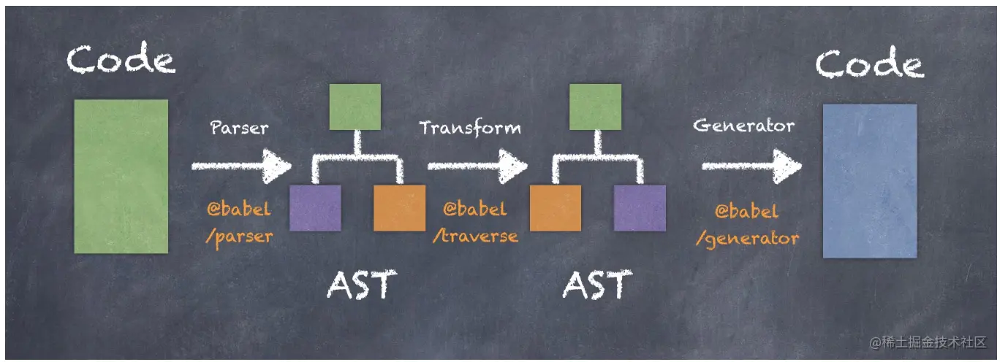

# 一、概述

[Babel >>](<https://www.babeljs.cn/>)  是一个 JavaScript 编译器（转换器），主要用于将 ECMAScript 2015+ 版本的代码转换为向后兼容的 JavaScript 语法，以便能够运行在当前和旧版本的浏览器或其他环境中。下面列出的是 Babel 能为你做的事情：

- 语法转换
- 通过 `Polyfill` 方式在目标环境中添加缺失的特性 （通过引入第三方 `polyfill` 模块，例如 [core-js](https://github.com/zloirock/core-js)）
- 源码转换 (`codemods`)

借助Babel，开发者可以提前用上新的 JavaScript 特性，这对生产力的提升大有帮助。实现Babel代码转换功能的核心，就是Babel插件（`plugin`）。

转换过程（初探）：`原始代码` — `[Babel Plugin]`   — `转换后的代码`

> 注意：Babel 并不是要把 ES6 转成 ES5，而是把比较少支持的特性转换成更多支持的写法，这样一来，写代码的人可以用到最新最先进的写法，将来整个用户客户端升级了，也无需修改代码，修改 babel 配置即可，所以 babel 转换哪些代码是可以配置的，一般用 `@babel/preset-env`，所以你要先看自己的配置，如果有必要，也可以手动添加一些插件。

# 二、初体验

**① 起步**

创建一个基本的项目文件结构，并新建必要文件，如下所示：

```ini
babel-demo
.
├── src
│   └── app.js  
└── package.json
```

> 注意：` package.json` 文件通过 `npm init -y` 指令自动生成。

**② 安装依赖**

```shell
$ npm init -y
$ npm install --save-dev @babel/core @babel/cli @babel/preset-env
```

**③ 配置文件**

在根目录中创建 `babel.config.json` 配置文件，并将以下内容复制到此文件中：

```json
{
  "presets": [
    [
      "@babel/preset-env",
      {
        "targets": {
          "browsers": ["last 2 versions", "safari >= 7"]
        },
        "useBuiltIns": "usage",
        "corejs": "3.6.5"
      }
    ]
  ]
}
```

> 上述浏览器列表（`browsers`）仅用于示例。请根据你所需要支持的浏览器进行调整。参见 [此处](https://www.babeljs.cn/docs/babel-preset-env) 以了解 `@babel/preset-env` 可接受哪些参数。

**④ 基本使用**

通过上面的准备工作，我们现在就可以使用 Babel 进行编译转换了。在 `/src/app.js` 文件中写一个es6的箭头函数

```javascript
(function () {
  const hello = (name) => {
    console.log(`Hello, ${name}!`);
  };
  hello('Babel');
})();
```

现在使用Babel命令行工具进行编译

```shell
# -- 编译文件
$ ./node_modules/.bin/babel src/app.js --out-file lib/app.js -w -s
# -- 编译目录
$ ./node_modules/.bin/babel src --out-dir lib -w -s
```

解读：

- `-o`：将某个js文件编译成指定js文件

- `-d`：将某个目录下的js文件编译至指定目录

- `-w`：实时监听文件/自动编译

- `-s`：生成资源映射文件便于调试，它可以帮助你在浏览器开发者工具（目前只有google chrome浏览器支持该功能）的“Source”选项卡中找到编译前的源文件，方便开发者进行调试。

  但首先得确保你开发者工具的设置里的这一项是处于勾选状态：`右键检查` → `工具栏中选择更多(右上角三个竖着的小圆点)` →  `Setting` →  `Sources` →  `Enable JavaScript source maps.`

经过编译后生成的 `lib/app.js` 是这样的：

```javascript
(function () {
  var hello = function hello(name) {
    console.log("Hello, ".concat(name, "!"));
  };

  hello('Babel');
})();
```

**⑤ 简化使用**

在 `package.json`  文件的 `scripts` 属性下，设置如下代码：

```json
"scripts": {
  "dev": "./node_modules/.bin/babel src --out-dir lib -w -s"
},
```

> 提示：`dev` 这个属性名是自定义的，其属性值则是要执行的指令。

内容配置完成之后，切换到命令行窗口输入：

 ```shell
$ npm run dev
 ```

这样即可执行指令进行编译。

# 三、Babel 包构成

**预设包**

- [@babel/preset-env](https://www.babeljs.cn/docs/babel-preset-env)
- [@babel/preset-react](https://www.babeljs.cn/docs/babel-preset-react)
- [@babel/preset-typescript](https://www.babeljs.cn/docs/babel-preset-typescript)

**集成包**

- [@babel/cli](https://www.babeljs.cn/docs/babel-cli)：Babel 命令行工具
- [@babel/polyfill](https://www.babeljs.cn/docs/babel-polyfill)：JS标准新增的原生对象和API的shim，实现上仅仅是core-js和regenerator-runtime两个包的封装
- [@babel/plugin-transform-runtime](https://www.babeljs.cn/docs/babel-plugin-transform-runtime)

**工具包**

- [@babel/core](https://www.babeljs.cn/docs/babel-core)：Babel 核心包，`babel-loader` 的核心依赖。
- [@babel/traverse](https://www.babeljs.cn/docs/babel-traverse)：用于对AST（抽象语法树，想了解的请自行查询编译原理）的遍历，主要给plugin用
- [@babel/generator](https://www.babeljs.cn/docs/babel-generator)：根据AST生成代码
- [@babel/types]()：用于检验、构建和改变AST树的节点
- [@babel/template](https://www.babeljs.cn/docs/babel-template)：辅助函数，用于从字符串形式的代码来构建AST树节点
- [@babel/runtime](https://www.babeljs.cn/docs/babel-runtime)：功能类似 `babel-polyfill`，一般用于 `library` 或 `plugin` 中，因为它不会污染全局作用域。

**辅助包**

- [@babel/helper-module-imports](https://www.babeljs.cn/docs/babel-helper-module-imports)
- [@babel/helper-compilation-targets](https://www.babeljs.cn/docs/babel-helper-compilation-targets)

# 四、配置文件

可以通过几种不同的方式来使用配置文件：

- `babel.config.json`：v7.8.0以上（建议使用）
- `babel.config.js`：旧版本
- `.babelrc`
- `package.json['babel']`

> **常用Options字段说明**

- `env`：定在不同环境下使用的配置。
- `plugins`：加载和使用的插件列表，插件名前的babel-plugin-可省略；plugin列表按从头到尾的顺序运行。
- `presets`：要加载和使用的preset列表，preset名前的babel-preset-可省略；presets列表的preset按从尾到头的**逆序**运行（为了兼容用户使用习惯）

> **配置文件的查找**

Babel 会从当前转译的文件所在目录下查找配置文件，如果没有找到，就顺着文档目录树一层层往上查找，一直到 `.babelrc` 文件存在或者带 `babel` 字段的 `package.json` 文件存在为止。

# 五、AST - 抽象语法树

## 1. What's AST？

在传统的编译语言的流程中，程序的一段源代码在执行之前会经历三个步骤，统称为"编译":

- **分词（词法分析）**
  这个过程会将由字符组成的字符串分解成有意义的代码块，这些代码块统称为 <u>词法单元</u>。比如：`let a = 1;` 这段程序通常会被分解成为下面这些词法单元：`let` 、`a`、`=`、`1`、 `;`，空格是否被当成词法单元，取决于空格在这门语言中的意义。

- **解析（语法分析）**
  这个过程是将词法单元流转换成一个由元素嵌套所组成的代表了程序语法结构的树，这个树被称为"**抽象语法树**"（abstract syntax code，AST）

- **代码生成**：将AST转换成可执行代码的过程被称为代码生成。

**抽象语法树**（abstract syntax code，AST）是源代码的抽象语法结构的树状表示，树上的每个节点都表示源代码中的一种结构，之所以说是抽象的，抽象表示把js代码进行了结构化的转化，转化为一种数据结构。这种数据结构其实就是一个大的json对象，json我们都熟悉，他就像一颗枝繁叶茂的树。有树根，有树干，有树枝，有树叶，无论多小多大，都是一棵完整的树。

简单理解，就是把我们写的代码按照一定的规则转换成一种树形结构。

## 2. 用途

AST的作用不仅仅是用来在JavaScript引擎的编译上，我们在实际的开发过程中也是经常使用的，比如我们常用的babel插件将 ES6转化成ES5、使用 UglifyJS来压缩代码 、css预处理器、开发WebPack插件、Vue-cli前端自动化工具等等，这些底层原理都是基于AST来实现的，AST能力十分强大， 能够帮助开发者理解JavaScript这门语言的精髓。

## 3. AST 结构

我们先来看一组简单的AST树状结构：

```javascript
let a = 1;
```

经过转化，输出如下AST树状结构：

```json
{
  "type": "Program",
  "body": [
    {
      "type": "VariableDeclaration",
      "declarations": [
        {
          "type": "VariableDeclarator",
          "id": {
            "type": "Identifier",
            "name": "a"
          },
          "init": {
            "type": "Literal",
            "value": 10,
            "raw": "10"
          }
        }
      ],
      "kind": "let"
    }
  ],
  "sourceType": "script"
}
```

可以看到，一个标准的 AST 结构可以理解为一个 `JSON` 对象，那我们就可以通过一些方法去解析和操作它。这里给大家推荐两个AST在线检测工具：

- [AST explorer >>](https://astexplorer.net/)
- [Esprima.org >>](https://esprima.org/demo/parse.html)

## 4. 编译过程

AST编译流程大致如下：

`AST 工具`  → `源代码` → `解析（scanner）` → `生成AST树（parser）` → `遍历AST树进行增删改查（traverse）` → `生成代码（generator）`

可以看到，AST工具会将源代码进行四个阶段的转换：

**@词法分析（`Scanner`）**

```javascript
const name = "Muzili";
```

假如有以上代码，在词法分析阶段，会先对整个代码进行扫描，生成tokens流，扫描过程如下：

1）通过条件判断这个字符是 `字母`、`/`、`空格`、`,`、`;` 等等。

2）如果是字母则会继续往下看如果还是字母或者数字，会继续这一过程直到不是为止，这个时候发现找到的这个字符串是 `const`，是一个 `Keyword`，并且下一个字符是一个 `空格`，就会生成 `{"type":"Keyword, "value":"const" }` 放入数组中。

3）接着继续向下找发现了一个字母 `name`（因为找到的上一个值是 `const`，这个时候如果他发现下一个字符不是字母可能直接就会报错返回）并且后面是空格，生成  ` { "type": "Identifier",  "value": "name" }` 放入数组中。

4）然后发现了一个 `=`，生成 `{"type": "Punctuator","value": "="}` 放入数组中。

5）接着发现了一个 `Muzili`，生成 ` {"type": "String","value": "\"Muzili\""}` 放入数组中。

6）最后发现了一个 `;`，生成 `{"type": "Punctuator","value": ";"}` 放入数组中。

解析如下：


**@生成AST树（`Parser`）**

这里我们使用 `esprima` 去生成，安装相关依赖:

```shell
$ npm install esprima --save
```

以如下代码为例：

```javascript
const name = "Muzili";
```

要得到其对应的AST，我们对其进行如下操作：

```javascript
const esprima = require("esprima");
const code = "const name = 'Muzili';";
const ast = esprima.parseScript(code);
console.log(ast);
```

运行结果如下：

```shell
$ node src/ast.js 
Script {
  type: 'Program',
  body: [
    VariableDeclaration {
      type: 'VariableDeclaration',
      declarations: [Array],
      kind: 'const'
    }
  ],
  sourceType: 'script'
}
```

这样我们就得到了一棵AST树。

**@遍历AST树，进行增删改查（`Traverse`）**

这里我们使用 `estraverse` 去完成，安装相关依赖：

```shell
$ npm install estraverse --save
```

还是使用刚刚的代码，我们将其更改为：`var job = '前端工程师';`

```javascript
const esprima = require("esprima");
const estraverse = require("estraverse");

// -- 源代码
const code = "const name = 'Muzili';";
// -- 词法分析
const ast = esprima.parseScript(code);
// -- 遍历AST树
estraverse.traverse(ast, {
  enter: function(node) {
    node.name = "job";
    node.value = "前端工程师";
    node.kind = "var";
  }
})
// -- 输出结果
console.log(ast);
```

运行结果如下：

```javascript
Script {
  type: 'Program',
  body: [
    VariableDeclaration {
      type: 'VariableDeclaration',
      declarations: [Array],
      kind: 'var',
      name: 'job',
      value: '前端工程师'
    }
  ],
  sourceType: 'script',
  name: 'job',
  value: '前端工程师',
  kind: 'var'
}
```

至此，我们就完成了对 AST 的遍历更新。

**@生成代码（`generator`）**

接下来，我们将更新后的 AST 转化成代码，我们使用 `escodegen` 去生成，安装依赖：

```shell
$ npm install escodegen --save
```

整体代码结构如下：

```javascript
const esprima = require("esprima");
const estraverse = require("estraverse");
const escodegen = require("escodegen");

// -- 源代码
const code = "const name = 'Muzili';";
// -- 词法分析
const ast = esprima.parseScript(code);
// -- 遍历AST树
estraverse.traverse(ast, {
  enter: function(node) {
    node.name = "job";
    node.value = "前端工程师";
    node.kind = "var";
  }
})
// -- 生成代码
const transformCode = escodegen.generate(ast);
// -- 输出结果
console.log(transformCode);
```

会得到如下结果：

```shell
$ node src/ast.js        
var job = '前端工程师';
```

这样一来，我们就完成了对一段简单代码的AST编译过程。

# 六、工作原理

相信了解了 AST 的编译过程之后，对于 Babel 的工作原理就更容易理解了。



Babel 插件就是作用于抽象语法树。

Babel 编译的过程分三个阶段：`解析(Parser)`  →  `转换(Transform)`  →  `生成(Generator)`。

**@解析（`Parser`）**

将代码解析成抽象语法树（AST），每个js引擎（比如Chrome浏览器中的V8引擎）都有自己的AST解析器，而Babel是通过 [babylon >>](https://github.com/babel/babylon) 实现的。解析过程有两个阶段：**词法分析** 和 **语法分析**，词法分析阶段把字符串形式的代码转换为**令牌**（tokens）流，令牌类似于AST中节点；而语法分析阶段则会把一个令牌流转换成 AST的形式，同时这个阶段会把令牌中的信息转换成AST的表述结构。

**@转换（`Transform`）**

转换步骤接收 AST 并对其进行遍历，在此过程中对节点进行添加、更新及移除等操作。 Babel通过 [@babel/traverse](https://www.babeljs.cn/docs/babel-traverse) 对其进行深度优先遍历，维护AST树的整体状态，并且可完成对其的替换，删除或者增加节点，这个方法的参数为原始AST和自定义的转换规则，返回结果为转换后的AST。

**@生成（`Generator`）**

**[代码生成](https://en.wikipedia.org/wiki/Code_generation_(compiler))** 步骤把最终（经过一系列转换之后）的 AST 转换成字符串形式的代码，同时还会创建 [源码映射（`source maps`）](https://www.html5rocks.com/en/tutorials/developertools/sourcemaps/)

代码生成其实很简单：深度优先遍历整个 AST，然后构建可以表示转换后代码的字符串。

Babel通过[@babel/generator](https://www.babeljs.cn/docs/babel-generator) 再转换成js代码，过程就是深度优先遍历整个AST，然后构建可以表示转换后代码的字符串。

# 七、Vue 中AST抽象语法树的运用

vue中AST主要运用在 **模板编译** 过程。我们先来看看 vue 模板编译的整体流程。

Vue2.x：`template(模板)` → `parse(模板基础编译)` → `optimize(优化AST)` → `generate(生成js字符串)` → `Render函数`

Vue3.x：`Template(模板)`  → `Parse(解析)` → `Transform(转换)` → `Generate(生成)` → `Render函数`

vue中的模板编译主要分为三个步骤：

1）解析器阶段：将 template 里面的代码解析成AST抽象语法树;

2）优化器阶段：将AST抽象语法树静态标签打上`tag`，防止重复渲染(优化了 `diff` 算法)；

3）代码生成器阶段：优化后的AST抽象语法树通过 `generate` 函数生成 `render` 函数字符串；

我们来看看vue源码的整体实现过程：

> 源码位置：`vue/dist/vue.global.js` → `rows：14975`

```javascript
function baseCompile(template, options = {}) {
  // -- baseParse：解析生成AST
  const ast = isString(template) ? baseParse(template, options) : template;
  // -- 对AST进行转换
  transform(
    ast,
    extend({}, options, { ··· })
  );
  // -- 生成可执行函数
  return generate(
    ast,
    extend({}, options, {
      prefixIdentifiers,
    })
  );
}
```

> 提示：这里只是简单列举出了 `vue3 - baseCompile` 方法中的核心代码，如果大家有兴趣，可以自行去阅读源码。

解析器要实现的功能就是将模板解析成 AST，我们这里主要来分析一下代码解析阶段，这里主要运用的是 `baseParse()` 这个函数，事实上，解析器内部也分为好几个解析器，比如 `HTML解析器`**、**`文本解析器` 以及 `过滤解析器`，其中最主要的就是HTML解析器。HTML解析器的作用就是解析HTML，它在解析HTML的过程中会不断触发各种钩子函数，我们来看看代码实现：

> 源码位置：`vue/dist/vue.global.js` → `rows：11713`

```javascript
function parseTag(context, type, parent) {
  // Tag open.
  const start = getCursor(context);
  const match = /^<\/?([a-z][^\t\r\n\f />]*)/i.exec(context.source);
  const tag = match[1];
  const ns = context.options.getNamespace(tag, parent);
  advanceBy(context, match[0].length);
  advanceSpaces(context);
  // save current state in case we need to re-parse attributes with v-pre
  const cursor = getCursor(context);
  const currentSource = context.source;
  // check <pre> tag
  if (context.options.isPreTag(tag)) {
    context.inPre = true;
  }
  // Attributes.
  let props = parseAttributes(context, type);
  // check v-pre
  if (
    type === 0 /* Start */ &&
    !context.inVPre &&
    props.some((p) => p.type === 7 /* DIRECTIVE */ && p.name === 'pre')
  ) {
    context.inVPre = true;
    // reset context
    extend(context, cursor);
    context.source = currentSource;
    // re-parse attrs and filter out v-pre itself
    props = parseAttributes(context, type).filter((p) => p.name !== 'v-pre');
  }
  // Tag close.
  let isSelfClosing = false;
  if (context.source.length === 0) {
    emitError(context, 9 /* EOF_IN_TAG */);
  } else {
    isSelfClosing = startsWith(context.source, '/>');
    if (type === 1 /* End */ && isSelfClosing) {
      emitError(context, 4 /* END_TAG_WITH_TRAILING_SOLIDUS */);
    }
    advanceBy(context, isSelfClosing ? 2 : 1);
  }
  if (type === 1 /* End */) {
    return;
  }
  let tagType = 0; /* ELEMENT */
  if (!context.inVPre) {
    if (tag === 'slot') {
      tagType = 2 /* SLOT */;
    } else if (tag === 'template') {
      if (
        props.some(
          (p) =>
            p.type === 7 /* DIRECTIVE */ && isSpecialTemplateDirective(p.name)
        )
      ) {
        tagType = 3 /* TEMPLATE */;
      }
    } else if (isComponent(tag, props, context)) {
      tagType = 1 /* COMPONENT */;
    }
  }
  return {
    type: 1 /* ELEMENT */,
    ns,
    tag,
    tagType,
    props,
    isSelfClosing,
    children: [],
    loc: getSelection(context, start),
    codegenNode: undefined, // to be created during transform phase
  };
}
```


# 八、插件

插件主要应用在转换阶段

## 1. 基本结构

典型的 Babel 插件结构，如下代码所示：

```javascript
// 这个types就是babel-types，在注册babel插件时解构就有它
module.exports = function ({ types: babelTypes }) {
  return {
    name: 'transfer-plugin',
    visitor: {
      Identifier(path, state) {
        // 插件内容
      },
    },
  };
};
```

需要关注的内容如下：

- `babelType`：`@babel/types` 工具库，主要用来操作AST节点，比如创建、校验、转变等。

- `path`：path 存储着AST节点信息以及一些节点操作方法。

  - 属性：

    - `node`：当前遍历到的node节点
    - `parent`：父级 AST 节点
    - `parentPath`：父级path
    - `scope`：作用域

  - 方法：

    - `get`：获取子节点
    - `findParent`：向父节点搜寻节点
    - `getSibling`： 获取兄弟路径
    - `getFunctionParent`： 获取包含该节点最近的父函数节点(查找的是function)
    - `getStatementParent`： 向上获取最近的statement类型节点
    - `relaceWith`：用AST节点替换该节点
    - `relaceWithMultiple`： 用多个AST节点替换节点
    - `replaceWidthSourceString`： 用源码解析后的AST节点替换节点
    - `insertBefore`：在之前插入兄弟节点
    - `insertAfter`： 在之后插入兄弟节点
    - `remove`：删除节点
    - `pushContainer`： 将AST push到节点属性里面
    - `stop`： 停止遍历
    - `skip`： 跳过此次遍历

    > 提示：更多属性与方法，请 [参考这里 >>](https://github.com/jamiebuilds/babel-handbook/blob/master/translations/zh-Hans/plugin-handbook.md#toc-babel-generator)

- `state`：状态，你可以通过 `state` 访问插件的配置项。

- `visitor`：Babel 采取递归的方式访问AST的每个节点，之所以叫做 `visitor`，只是因为有个类似的设计模式叫做 [访问者模式](https://en.wikipedia.org/wiki/Visitor_pattern)，不用在意背后的细节。

- `Identifier`：AST的每个节点，都有对应的节点类型，比如标识符（`Identifier`）、函数声明（`FunctionDeclaration`）等，可以在 `visitor` 上声明同名的属性，当Babel遍历到相应类型的节点，属性对应的方法就会被调用，传入的参数就是 `path`、`state`。

## 2. 简单实现

现在，我们开发一个插件，支持文本替换，替换文本通过配置项传入。

首先创建插件文件，编辑如下内容：

```javascript
// -- plugins/transfer-plugin.js
module.exports = function ({ types: babelTypes }) {
  return {
    name: 'transfer-plugin',
    visitor: {
      Identifier(path, state) {
        let name = path.node.name;
        if (state.opts[name]) {
          path.node.name = state.opts[name];
        }
      },
    },
  };
};
```

接下来，我们试试该插件是否能够成功转换，比如我需要将如下代码：

```javascript
(function () {
  const bad = true;
  const dead = true;
})();
```

中的 `bad` 替换成 `good`，然后将 `dead` 替换成 `alive`。

首先我们需要在配置文件中引用改插件并传入配置项，如下所示：

```javascript
{
  "presets": [
    [
      "@babel/preset-env",
      {
        "targets": {
          "browsers": ["last 2 versions", "safari >= 7"]
        },
        "useBuiltIns": "usage",
        "corejs": "3.6.5"
      }
    ]
  ],
  "plugins": [
    [
      "./plugins/transfer-plugin.js",
      {
        "bad": "good",
        "dead": "alive"
      }
    ]
  ]
}
```

执行编译指令：`npm run dev`，查看编译结果：

```javascript
(function () {
  var good = true;
  var alive = true;
})();
```

可以看到，`bad` 和 `dead` 成功转换成了 `good` 和 `alive`，怎么样，是不是很简单呢？

