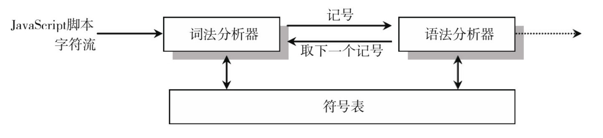

# 一、概述

## 1. 起源

[Babel >>](<https://www.babeljs.cn/>) 最开始叫 **6to5**，顾名思义是 **es6** 转 **es5**，但是后来随着 es 标准的演进，有了 es7、es8 等， **6to5** 的名字已经不合适了，所以改名为了 **babel**。

babel 是 [巴别塔](https://baike.baidu.com/item/%E5%B7%B4%E5%88%AB%E5%A1%94/67557) 的意思，来自圣经中的典故：

> 当时人类联合起来兴建希望能通往天堂的高塔；为了阻止人类的计划，上帝让人类说不同的语言，使人类相互之间不能沟通，计划因此失败，人类自此各散东西，“巴别塔”即由此得名。

## 2. 用途

- **语法转换**：把代码中的 `ESNext` 、`TypeScript` 或者 `Flow` 的语法等等，转成基于目标环境支持的语法的实现。并且还可以把目标环境不支持的 API 进行 `polyfill`。
- **特定用途的代码转换**：通过 Babel 提供的 API 可以完成代码到 AST 的解析、转换，以及目标代码的生成。 开发者可以用它来完成一些特定用途的转换，比如函数插桩（函数中自动插入一些代码，例如埋点代码）、自动国际化等。
- **代码的静态分析**：静态分析是在不需要执行代码的前提下对代码进行分析的处理过程 （执行代码的同时进行代码分析即是动态分析）。 静态分析的目的是多种多样的， 它可用于语法检查，编译，代码高亮，代码转换，优化，压缩等等场景。比如：
  - `linter` 工具就是分析 AST 的结构，对代码规范进行检查。
  - `Api` 文档自动生成工具，可以提取源码中的注释，然后生成文档。
  - `Type checker` 会根据从 AST 中提取的或者推导的类型信息，对 AST 进行类型是否一致的检查，从而减少运行时因类型导致的错误。
  - `压缩混淆工具`，这个也是分析代码结构，进行删除死代码、变量名混淆、常量折叠等各种编译优化，生成体积更小、性能更优的代码
  - `JS 解释器`，除了对 AST 进行各种信息的提取和检查以外，我们还可以直接解释执行 AST。

## 3. Compiler or Transpiler

- `编译器（Compiler）`：高级语言到低级语言的转换工具。
- `转译器（Transpiler）`：高级语言到高级语言的转换工具。

高级语言：有很多用于描述逻辑的语言特性，比如分支、循环、函数、面向对象等，接近人的思维，可以让开发者快速的通过它来 表达各种逻辑。比如 `Objective-C`、`JavaScript` 等。

低级语言：与硬件和执行细节有关，会操作寄存器、内存，具体做内存与寄存器之间的复制，需要开发者理解熟悉计算机的工作原理，熟悉具体的执行细节。比如汇编语言、机器语言。

> 结论：`Babel`  就是一个  **`JavaScript Transpiler`**。

尽管 [官网 >>](https://www.babeljs.cn/) 标题介绍Babel 是一个 JavaScript 编译器，但侧重点在于 **下一代**。

## 4. 编译流程

Babel 的编译流程：首先把 **源码** 解析（`parse`）成 `AST`，然后递归遍历 `AST` 并对齐进行增删改生成新的AST，最后将新的 AST 生成 目标代码 / SourceMap。

简单理解，就是：`Parse` → `Transform` → `Generate`

# 二、AST - 抽象语法树

## 1. What's AST？


**抽象语法树**（**A**bstract **S**yntax **T**ree，AST），是源代码语法结构的一种抽象表示。它以树状的形式表现编程语言的语法结构，树上的每个节点都表示源代码中的一种结构。之所以说语法是“抽象”的，是因为这里的语法并不会表示出真实语法中出现的每个细节。比如，会省略掉一些无具体意义的分隔符如 `;`、`{}`  等等。这种数据结构其实就是一个大的 `JSON` 对象，`JSON` 我们都熟悉，他就像一颗枝繁叶茂的树。有树根，有树干，有树枝，有树叶，无论多小多大，都是一棵完整的树。

简单理解，就是把我们写的代码按照一定的规则转换成一种 **树形结构**。

## 2. 用途

AST在前端无处不在，我们熟悉的开发工具几乎全依赖于AST进行开发：`Webpack`、`Babel`、`Eslint`、`Prettier`。如果你想了解 JavaScript 编译执行的原理，掌握其精髓，那么你就必须得了解 AST。

## 3. AST 如何生成？

js 执行的第一步是读取 js 文件中的字符流，然后通过词法分析生成 `token`，之后再通过语法分析( `Parser` )生成 AST，最后生成机器码执行。整个解析过程主要分为以下两个步骤：

- `词法分析`：将整个代码字符串分割成最小语法单元数组
- `语法分析`：在分词基础上建立分析语法单元之间的关系

### 3.1. 词法分析/分词

词法分析，也称之为 **扫描** 或者 **令牌化**，这一步主要是将字符流（`char stream`）转换为令牌流（`token stream`），简单来说就是在源代码的基础上进行分词。

比如把 “我爱中国” 拆解成 “我”、“爱”、“中国” 三部分，这个过程就叫做 **分词**，其中各个部分又被称为 **词法单元** 或者叫 `Token`。对于代码来说，需要将代码片段识别为关键字、标识符、操作符、字面量等部分。

我们可以这么理解，词法分析就是把你的代码从 `string` 类型转换成了数组，数组的元素就是代码里的单词（词法单元），然后对每个单词标记了类型。

词法分析器 **从左往右逐个字符扫描分析** 整个程序的字符串，当遇到不同的字符时，会驱使它迁移到不同的状态，比如下面这段代码：

```javascript
const a = 10;
```

在扫描字符的时候，遇到 `c` 字母，如果后面还有字符，将继续扫描，直到遇到空格，识别出 `const`，发现是一个关键字，将其生成词法单元 ` { type: 'Keyword', value: 'const' }`，然后接着扫描，以此类推，生成 `Token List`。

所以，这段程序会被分解成为下面这些词法单元：`let` 、`a`、`=`、`10`、 `;`，你可以在 [这里 >>](https://esprima.org/demo/parse.html?code=const%20a%20%3D%2010%3B%0A) 查看词法分析结果：

```javascript
[
  { type: 'Keyword', value: 'const' },
  { type: 'Identifier', value: 'a' },
  { type: 'Punctuator', value: '=' },
  { type: 'Numeric', value: '10' },
  { type: 'Punctuator', value: ';' },
];
```

通过上述分解出来的词法分析结果，我们可以观察到，缺少一些比较关键的信息：

1. 没有任何语法信息；
2. 体现不了代码的执行先顺序；

所以需要进一步进行语法分析。

### 3.2. 语法分析/解析

语法分析会将词法分析出来的 **词法单元** 转化成有语法含义的 **抽象语法树结构（AST）**。同时，验证语法，语法如果有错的话，抛出语法错误。

词法分析和语法分析不是完全独立的，而是交错进行的，也就是说，词法分析器不会在读取所有的词法记号后再使用语法分析器来处理。通常情况下，每取得一个词法记号，就将其送入语法分析器进行分析。



我们可以使用在线工具生成 AST：[AST explorer >>](https://astexplorer.net/) 或者 [Esprima.org >>](https://esprima.org/demo/parse.html)，这里主要简单介绍下 `AST explorer` 的使用：


比如这一段代码：

```javascript
function square(n) {
  return n * n;
}
```

经过转化，输出如下AST树状结构：


> 提示：这里只列举出核心部分 AST 示例。

你会留意到 AST 的每一层都拥有相同的结构：

```javascript
{
    type: "FunctionDeclaration",
    id: {...},
    params: [...],
    body: {...}
}
```

```javascript
{
    type: "Identifier",
    name: ...
}
```

```javascript
{
    type: "BinaryExpression",
    operator: ...,
    left: {...},
    right: {...}
}
```

> 提示：出于简化的目的移除了某些属性。

这样的每一层结构，被称为 **节点（`Node`）**，每一个节点都包含 `type` 属性，用于表示节点类型，比如：`FunctionDeclaration`、`Identifier`、`BinaryExpression` 等等。除此之外，Babel 还为每个节点额外生成了一些属性，用于描述该节点在原始代码中的位置，比如： `start`、`end`、`loc`。

## 4. 节点类型

AST节点类型主要分为以下几个大类：`字面量`、`标志符`、`语句`、`声明`、`表达式`、`注释` 等等。

这里主要列举一些常用的类型，更多节点类型请参考 [@babel/types >>](https://babeljs.io/docs/en/babel-types)

### 4.1. 字面量（`Literal`）

| 类型名称         | 中文译名     | 描述                                      |
| ---------------- | ------------ | ----------------------------------------- |
| `StringLiteral`  | 字符型字面量 | 通常指字符串类型的字面量：`'Hello, AST!'` |
| `NumericLiteral` | 数值型字面量 | 通常指数字类型的字面量：`123`             |
| `BooleanLiteral` | 布尔型字面量 | 布尔类型值：`true` / `false`              |
| `RegExpLiteral`  | 正则型字面量 | 正则表达式：`/[0-9]/`                     |
| `TemplatLiteral` | 模板型字面量 | 模板字符串（`）                           |
| `NullLiteral`    | 空值型字面量 | `null`                                    |

### 4.2. 标志符（`Identifier`）

程序中所有的 变量名、函数名、对象键（`key`） 以及函数中的参数名，都属于标志符（`Identifier`）。

### 4.3. 语句（`Statement`）

语句是能够独立执行的基本单位，常见的语句类型有：

| 类型名称              | 中文译名          | 描述                                      |
| --------------------- | ----------------- | ----------------------------------------- |
| `IfStatement`         | `If` 控制流语句   | 通常指 `if (true) {} else {}`             |
| `ForInStatement`      | `For-in` 循环语句 | 通常指 `for(let key in obj) {}`           |
| `SwitchStatement`     | `Switch` 语句     | 通常指 `switch`                           |
| `WhileStatement`      | `While` 循环语句  | 通常指 `while(true) {}`                   |
| `ForStatement`        | `For` 循环语句    | 通常指 `for(let i = 0; i < 10; i++) {}`   |
| `BreakStatement`      | 中断语句          | 通常指 `break`                            |
| `ContinueStatement`   | 持续语句          | 通常指 `continue`                         |
| `ReturnStatement`     | 返回语句          | 通常指 `return`                           |
| `BlockStatement`      | 块语句            | 包裹在 `{}` 内的语句                      |
| `ExpressionStatement` | 表达式语句        | 通常为调用一个函数，比如 `console.log(1)` |

### 4.4. 声明语句（`Declaration`）

声明语句是一种特殊的语句，它执行的逻辑是在作用域内声明一个 `变量`、函数、`class`、`import`、`export` 等。

| 类型名称                   | 中文译名         | 描述                              |
| -------------------------- | ---------------- | --------------------------------- |
| `VariableDeclaration`      | 变量声明         | `const a = 10;`                   |
| `FunctionDeclaration`      | 函数声明         | `function sum() {}`               |
| `ClassDeclaration`         | 类声明           | `class Tools {}`                  |
| `ImportDeclaration`        | 模块引入声明     | `import { reactive } from 'vue;'` |
| `ExportDefaultDeclaration` | 模块默认导出声明 | `export default a = 10;`          |
| `ExportNamedDeclaration`   | 模块命名导出声明 | `export { name };`                |
| `ExportAllDeclaration`     | 导出所有模块声明 | `export * from 'tools';`          |

### 4.5. 表达式（`Expression`）

表达式的特点是执行完以后有返回值，这是和语句 (`statement`) 的区别

| 类型名称                  | 中文译名       | 描述                               |
| ------------------------- | -------------- | ---------------------------------- |
| `ArrayExpression`         | 数组表达式     | 通常指一个数组：`[1, 2, 3]`        |
| `AssignmentExpression`    | 赋值表达式     | 通常指为一个变量赋值，比如 `a = 1` |
| `BinaryExpression`        | 二元表达式     | `1 + 2`                            |
| `UnaryExpression`         | 一元表达式     | `-1`                               |
| `FunctionExpression`      | 函数表达式     | `function(){}`                     |
| `ArrowFunctionExpression` | 箭头函数表达式 | `() => {}`                         |
| `ClassExpression`         | class 表达式   | `class {}`                         |
| `ThisExpression`          |     this 表达式           | `this`                             |

### 4.6. `Comment` & `Program`

| 类型名称       | 中文译名 | 描述             |
| -------------- | -------- | ---------------- |
| `Program`      | 程序主体 | 整段代码的主体   |
| `CommentBlock` | 块级注释 | `/* 块级注释 */` |
| `CommentLine`  | 单行注释 | `// 单行注释`    |

# 三、工作原理


Babel 的编译过程和大多数其他语言的编译器大致相同，可以分为 **三个阶段**：`解析(Parse)`  →  `转换(Transform)`  →  `生成(Generate)`。

## 1. 解析（`Parser`）

将代码字符串解析成抽象语法树（AST），每个 JavaScript 引擎（比如Chrome浏览器中的 `V8` 引擎）都有自己的AST解析器，而Babel是通过 [@babel/parser >>](https://www.babeljs.cn/docs/babel-parser) 实现的。解析过程有两个阶段：**词法分析** 和 **语法分析**，词法分析阶段把字符串形式的代码转换为**令牌**（tokens）流，令牌类似于AST中节点；而语法分析阶段则会把一个令牌流转换成 AST的形式，同时这个阶段会把令牌中的信息转换成AST的表述结构。

## 2. 转换（`Transform`）

对抽象语法树进行转换操作，转换步骤接收 AST 并对其进行遍历，在此过程中对节点进行添加、更新及移除等操作。 Babel通过 [@babel/traverse](https://www.babeljs.cn/docs/babel-traverse) 对其进行 **深度优先遍历**，维护AST树的整体状态，并且可完成对其的替换，删除或者增加节点，这个方法的参数为原始AST和自定义的转换规则，返回结果为转换后的AST。

## 3. 生成（`Generator`）

根据变换后的抽象语法树再生成代码字符串，同时还会创建 [源码映射（`source maps`）](https://www.html5rocks.com/en/tutorials/developertools/sourcemaps/)

代码生成其实很简单：深度优先遍历整个 AST，然后构建可以表示转换后代码的字符串。

Babel 通过 [@babel/generator](https://www.babeljs.cn/docs/babel-generator)  将AST转换成js代码，过程就是深度优先遍历整个AST，然后构建可以表示转换后代码的字符串。

# 四、Babel APIs

我们知道 Babel 的编译流程分为三步：`Parse` → `Transform` → `Generate`，每一步都暴露了一些 Api 出来：

- **解析阶段**：通过 `@babel/parser` 将源码转成 AST；
- **转换阶段**：通过 `@babel/traverse` 遍历AST，并调用 `visitor` 函数修改 AST，期间涉及到 AST 的判断、创建、修改等，这时候就需要 `@babel/types` 了，当需要批量创建 AST 的时候可以使用 `@babel/template` 来简化 AST 创建逻辑；
- **生成阶段**：通过 `@babel/generate` 将 AST 输出为目标代码字符串，同时生成 `sourcemap`；
- 中途遇到错误想打印代码位置的时候，使用 `@babel/code-frame` 包
- Babel 的整体功能通过 `@babel/core` 提供，基于上面的包完成 Babel 整体的编译流程，并实现插件功能。

## 1. [`@babel/parser`](https://www.babeljs.cn/docs/babel-parser)

`@babel/parser` （之前叫 `Babylon`）是基于 `acorn` 实现的，扩展了很多语法，可以支持 `ESNext`、`JSX`、`Flow`、`Typescript` 等语法的解析，其中 `JSX`、`Flow`、`Typescript`  这些非标准的语法的解析需要指定语法插件。示例如下：

```javascript
require('@babel/parser').parse('code', {
  sourceType: 'module', // script unambigious
  plugins: ['jsx', 'typescript'],
});
```

## 2. [`@babel/traverse`](https://www.babeljs.cn/docs/babel-traverse)

遍历 AST，并在遍历过程中对 AST 节点进行增删改。 `Visit` 一个节点的过程是：`调用 enter` → `遍历子节点` → `调用exit`

语法形式如下：

```javascript
// → 进入节点时调用
require('@babel/traverse').default(ast, {
  enter(path) {},
});
// → 离开节点时调用
require('@babel/traverse').default(ast, {
  exit(path) {},
});
// → 进入 FunctionDeclaration 节点时调用，如果外层不包裹 enter 或者 exit，默认为 enter
require('@babel/traverse').default(ast, {
  FunctionDeclaration(path) {},
});
// → 进入 'FunctionDeclaration|VariableDeclaration' 节点时调用
require('@babel/traverse').default(ast, {
  'FunctionDeclaration|VariableDeclaration'(path) {
    console.log(path);
  },
});
```

## 3. [`@babel/generator`](https://www.babeljs.cn/docs/babel-generator)

`@babel/generator` 将 AST 生成目标代码。

```
require('@babel/generator').default(ast).code;
```

# 四、实战 AST 的运用


# 五、初体验

**① 起步**

创建一个基本的项目文件结构，并新建必要文件，如下所示：

```ini
babel-demo
.
├── src
│   └── app.js  
└── package.json
```

> 注意：` package.json` 文件通过 `npm init -y` 指令自动生成。

**② 安装依赖**

```shell
$ npm init -y
$ npm install --save-dev @babel/core @babel/cli @babel/preset-env
```

**③ 配置文件**

在根目录中创建 `babel.config.json` 配置文件，并将以下内容复制到此文件中：

```json
{
  "presets": [
    [
      "@babel/preset-env",
      {
        "targets": {
          "browsers": ["last 2 versions", "safari >= 7"]
        },
        "useBuiltIns": "usage",
        "corejs": "3.6.5"
      }
    ]
  ]
}
```

> 上述浏览器列表（`browsers`）仅用于示例。请根据你所需要支持的浏览器进行调整。参见 [此处](https://www.babeljs.cn/docs/babel-preset-env) 以了解 `@babel/preset-env` 可接受哪些参数。

**④ 基本使用**

通过上面的准备工作，我们现在就可以使用 Babel 进行编译转换了。在 `/src/app.js` 文件中写一个es6的箭头函数

```javascript
(function () {
  const hello = (name) => {
    console.log(`Hello, ${name}!`);
  };
  hello('Babel');
})();
```

现在使用Babel命令行工具进行编译

```shell
# -- 编译文件
$ ./node_modules/.bin/babel src/app.js --out-file lib/app.js -w -s
# -- 编译目录
$ ./node_modules/.bin/babel src --out-dir lib -w -s
```

解读：

- `-o`：将某个js文件编译成指定js文件

- `-d`：将某个目录下的js文件编译至指定目录

- `-w`：实时监听文件/自动编译

- `-s`：生成资源映射文件便于调试，它可以帮助你在浏览器开发者工具（目前只有google chrome浏览器支持该功能）的“Source”选项卡中找到编译前的源文件，方便开发者进行调试。

  但首先得确保你开发者工具的设置里的这一项是处于勾选状态：`右键检查` → `工具栏中选择更多(右上角三个竖着的小圆点)` →  `Setting` →  `Sources` →  `Enable JavaScript source maps.`

经过编译后生成的 `lib/app.js` 是这样的：

```javascript
(function () {
  var hello = function hello(name) {
    console.log("Hello, ".concat(name, "!"));
  };

  hello('Babel');
})();
```

**⑤ 简化使用**

在 `package.json`  文件的 `scripts` 属性下，设置如下代码：

```json
"scripts": {
  "dev": "./node_modules/.bin/babel src --out-dir lib -w -s"
},
```

> 提示：`dev` 这个属性名是自定义的，其属性值则是要执行的指令。

内容配置完成之后，切换到命令行窗口输入：

 ```shell
$ npm run dev
 ```

这样即可执行指令进行编译。

# 六、配置文件

可以通过几种不同的方式来使用配置文件：

- `babel.config.json`：v7.8.0以上（建议使用）
- `babel.config.js`：旧版本
- `.babelrc`
- `package.json['babel']`

> **常用Options字段说明**

- `env`：定在不同环境下使用的配置。
- `plugins`：加载和使用的插件列表，插件名前的babel-plugin-可省略；plugin列表按从头到尾的顺序运行。
- `presets`：要加载和使用的preset列表，preset名前的babel-preset-可省略；presets列表的preset按从尾到头的**逆序**运行（为了兼容用户使用习惯）

> **配置文件的查找**

Babel 会从当前转译的文件所在目录下查找配置文件，如果没有找到，就顺着文档目录树一层层往上查找，一直到 `.babelrc` 文件存在或者带 `babel` 字段的 `package.json` 文件存在为止。

# 八、插件开发

## 1. 需求

之前在面试的过程中，有被问到过一个问题，就是：“打包项目的时候，如何清除项目中的 `console.log()`？”，其实在开发期间，我们通常会通过 `console.log` 在控制台输出一些信息进行调试，但是随着项目的积累，会存在很多的打印语句，而在生产环境是需要移除的。对于这个问题，总不能回答一个一个手动删除吧，那这轮面试基本上就有结果了，那么最好的方式就是，我们可以通过写一个Babel插件帮我们做这些事情，尽管现在已经有了类似的插件，但我认为你还是有必要知道起实现的原理，这里，我将带着大家一起去写一个去除 console.log 的插件 `babel-plugin-del-console`，帮助大家理解 Babel 插件开发流程，同时也希望大家可以举一反三，封装其他插件。

## 2. 准备

```shell
# 构建项目文件
$ mkdir babel-plugin-del-consolelogs && cd babel-plugin-del-consolelogs && npm init vite@latest example  -- --template vue-ts
# 创建项目文件
$ touch index.js
# 安装插件依赖
$ npm init -y && npm install @babel/core --save-dev
# 在Vscode中打开项目
$ code .
```


```javascript
// 这个types就是babel-types，在注册babel插件时解构就有它
module.exports = function ({ types: babelTypes }) {
  return {
    name: 'transfer-plugin',
    visitor: {
      Identifier(path, state) {
        // 插件内容
      },
    },
  };
};
```

