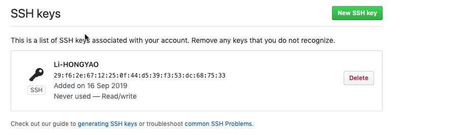
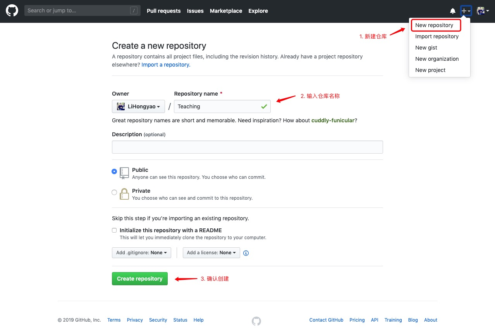
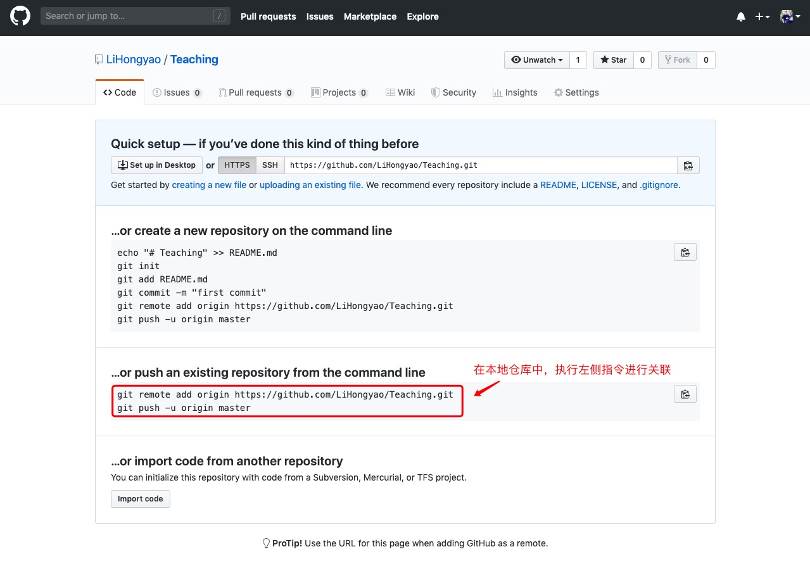
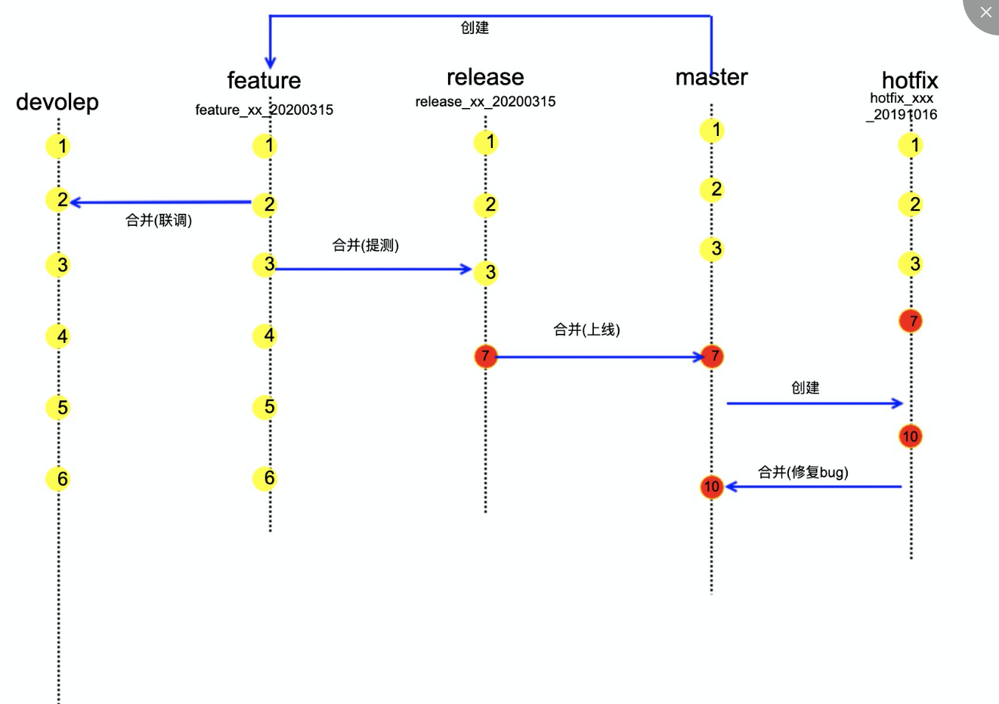
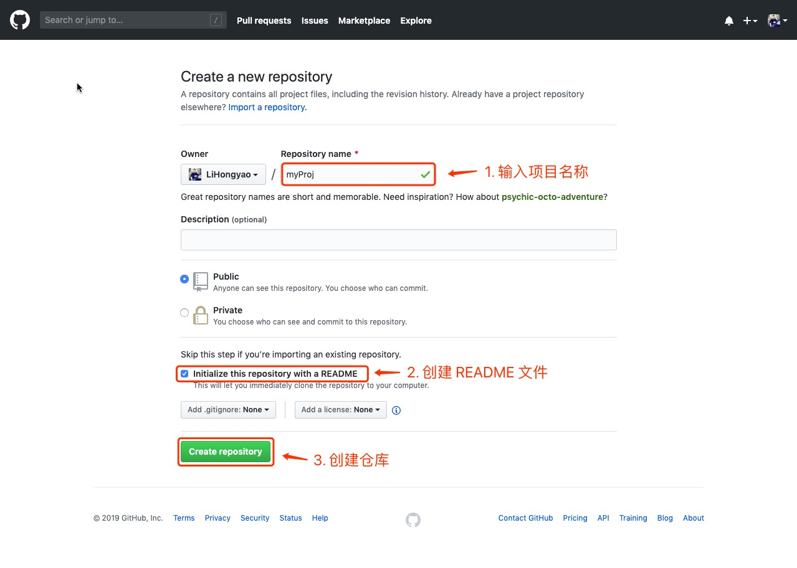
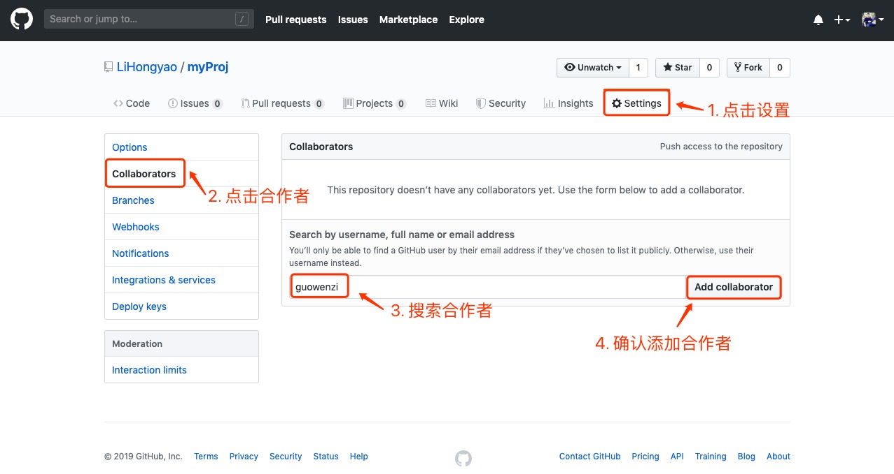
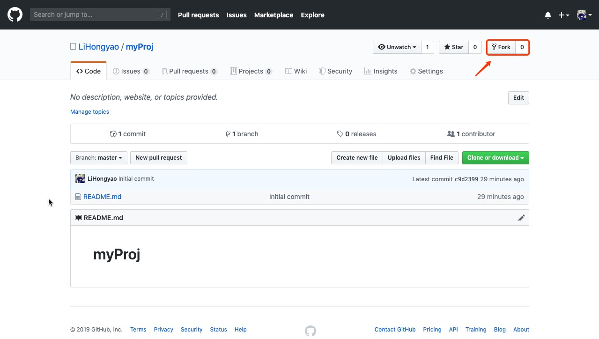
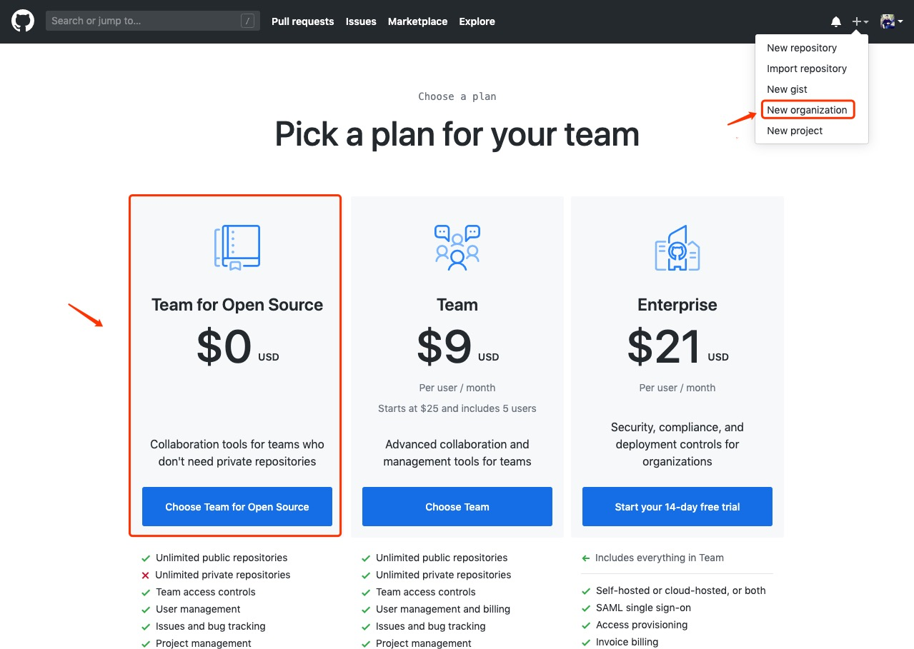
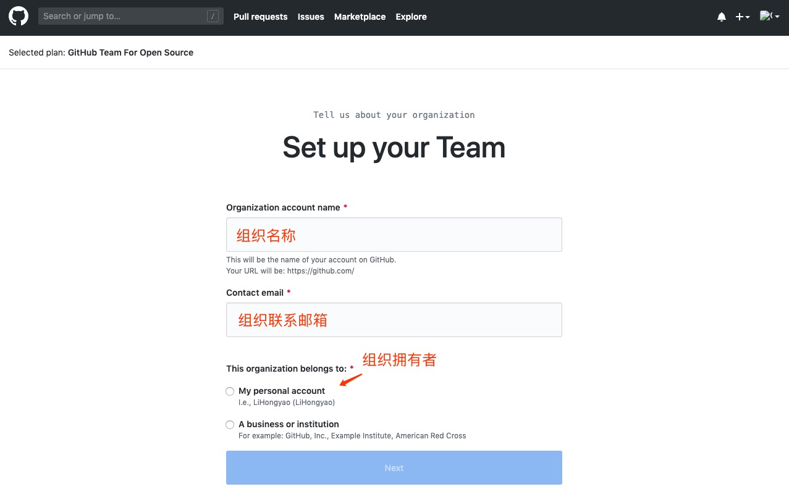

>  参考文献：
>
> 1. <https://git-scm.com/docs>
> 2. <http://www.bootcss.com/p/git-guide/>
> 3. <https://www.runoob.com/manual/github-git-cheat-sheet.pdf>

# 一、Git 概述

## 1、Git

Git是一个开源的 **分布式版本控制系统**，用于敏捷高效地处理任何或小或大的项目。

## 2、Git 诞生

Linus在1991年创建了开源的Linux，从此，Linux系统不断发展，已经成为最大的服务器系统软件了。

Linus虽然创建了Linux，但Linux的壮大是靠全世界热心的志愿者参与的，这么多人在世界各地为Linux编写代码，那Linux的代码是如何管理的呢？

事实是，在2002年以前，世界各地的志愿者把源代码文件通过diff的方式发给Linus，然后由Linus本人通过手工方式合并代码！

你也许会想，为什么Linus不把Linux代码放到版本控制系统里呢？不是有CVS、SVN这些免费的版本控制系统吗？因为Linus坚定地反对CVS和SVN，这些 <ins>集中式的版本控制系统不但速度慢，而且必须联网才能使用</ins> 。有一些商用的版本控制系统，虽然比CVS、SVN好用，但那是付费的，和Linux的开源精神不符。

不过，到了2002年，Linux系统已经发展了十年了，代码库之大让Linus很难继续通过手工方式管理了，社区的弟兄们也对这种方式表达了强烈不满，于是Linus选择了一个商业的版本控制系统BitKeeper，BitKeeper的东家BitMover公司出于人道主义精神，授权Linux社区免费使用这个版本控制系统。

安定团结的大好局面在2005年就被打破了，原因是Linux社区牛人聚集，不免沾染了一些梁山好汉的江湖习气。开发Samba的Andrew试图破解BitKeeper的协议（这么干的其实也不只他一个），被BitMover公司发现了（监控工作做得不错！），于是BitMover公司怒了，要收回Linux社区的免费使用权。

Linus可以向BitMover公司道个歉，保证以后严格管教弟兄们，嗯，这是不可能的。实际情况是这样的：

Linus花了两周时间自己用C写了一个分布式版本控制系统，这就是Git！一个月之内，Linux系统的源码已经由Git管理了！牛是怎么定义的呢？大家可以体会一下。

Git迅速成为最流行的分布式版本控制系统，尤其是2008年，GitHub网站上线了，它为开源项目免费提供Git存储，无数开源项目开始迁移至GitHub，包括jQuery，PHP，Ruby等等。

历史就是这么偶然，如果不是当年BitMover公司威胁Linux社区，可能现在我们就没有免费而超级好用的Git了。

2018年，微软以75亿美元的价格收购GitHub。

## 3、分布式 VS 集中式

- 集中式版本控制系统，其版本库是集中存放在中央服务器上的，当需要的时候可以从中央服务器取得最新的版本，然后修改完毕之后再上传到中央服务器，类比图书馆借书修改的过程，但是其最大的不便之处就是必须要联网。

- 分布式版本控制系统，每个人的电脑上都是一个完整的版本库，所以不需要联网。例如你修改了文件1，你的同事在他的电脑上也修改了文件1，那么你们俩只需要把各自的修改推送给对方，就可以互相看到修改了。实际使用分布式版本控制系统的时候，其通常有一台“中央服务器”，但是这个服务器只是为了方便大家“交换”修改。例如两个人不在同一个局域网，两台电脑互相访问不了，又或者另外一人的电脑没开机等情况。

# 二、Git 安装

Git 各平台安装包下载地址为：<http://git-scm.com/downloads>

下载安装即可，安装好之后，输入指令，查看 git 安装位置及其版本。

```shell
$ which git
/usr/bin/git
$ git --version
git version 2.30.1 (Apple Git-130)
```

> 提示：windows 下需将 <ins>which</ins> 替换成 <ins>where</ins>。

## 1、配置用户信息

配置个人的用户名称和电子邮件地址：

```shell
$ git config --global user.name  "Your Name"
$ git config --global user.email "email@example.com"
```

## 2、查看配置信息 

输入指令

```shell
$ git config --list
```

# 三、Git 工作流

你的本地仓库由 git 维护的三棵“树”组成。第一个是你的 工作目录，它持有实际文件；第二个是 缓存区（Index），它像个缓存区域，临时保存你的改动；最后是 HEAD，指向你最近一次提交后的结果。


# 四、Git 基本操作（指令） 

- `git init`：创建版本库
- `git add .`：提交至缓存区
- `git commit -m "说明信息"`：提交至版本库
- `git status`：查看工作区状态
- `git diff`：查看修改
- `git checkout -- <file>`：撤销修改
- `git reset HEAD <file>`：撤销暂存
- `git log --pretty=oneline  --abbrev-commit` ：查看历史版本
- `git reset --hard <commit-id>`：版本回退
- `git reflog`：查看命令历史
- `git rm <文件>`：删除文件
- `git gui`：可视化界面

> 提示：显示隐藏文件
>
> - macOS：cmd + shift + .
> - Windows：我的电脑 -> 查看 -> 隐藏的项目

# 五、远程仓库

<https://github.com/>

由于你的本地Git仓库和GitHub仓库之间的传输是通过SSH加密的，所以，需要一点设置：

**第1步：**创建SSH Key。在用户主目录下，看看有没有.ssh目录，如果有，再看看这个目录下有没有 ”id_rsa“ 和 ”id_rsa.pub“ 这两个文件，如果已经有了，可直接跳到下一步。如果没有，打开Shell（Windows下打开Git Bash），创建SSH Key：

```shell
$ ssh-keygen -t rsa -C "youremail@example.com"
```

你需要把邮件地址换成你自己的邮件地址，然后一路回车，使用默认值即可，由于这个Key也不是用于军事目的，所以也无需设置密码。

如果一切顺利的话，可以在用户主目录里找到 ”.ssh“ 目录，里面有 ”id_rsa“ 和 ”id_rsa.pub” 两个文件，这两个就是SSH Key的秘钥对， ”id_rsa“  是私钥，不能泄露出去， ”id_rsa.pub” 是公钥，可以放心地告诉任何人。

> 提示：
>
> 在windows系统下，如果出现 “ssh-keygen” 不是内部或外部命令，解决的办法是：
>
> 1. 首先找到 “ssh-keygen” 的安装目录，一般位于 “C:\Program Files\Git\usr\bin” 下。
> 2. 将该路径添加环境变量的Path字段中。

**第2步：**

登陆Github -> 点击右上角个人头像 -> 点击Settings进入设置页面 ->

点击SSH and GPG keys选项 -> 点击右上角New SSH key ->  

在添加面板中，

Title：设置SSH key 标题，可任意填写

Key：将  *”id_rsa.pub”*  文件内容拷贝至此

然后点击 Add SSH Key 就可以看到你创建的SSH Key了，如下图所示：



为什么GitHub需要SSH Key呢？因为GitHub需要识别出你推送的提交确实是你推送的，而不是别人冒充的，而Git支持SSH协议，所以，GitHub只要知道了你的公钥，就可以确认只有你自己才能推送。

当然，GitHub允许你添加多个Key。假定你有若干电脑，你一会儿在公司提交，一会儿在家里提交，只要把每台电脑的Key都添加到GitHub，就可以在每台电脑上往GitHub推送了。

最后友情提示，在GitHub上免费托管的Git仓库，任何人都可以看到喔（但只有你自己才能改）。所以，不要把敏感信息放进去。

如果你不想让别人看到Git库，有两个办法，一个是交点保护费，让GitHub把公开的仓库变成私有的，这样别人就看不见了（不可读更不可写）。另一个办法是自己动手，搭一个Git服务器，因为是你自己的Git服务器，所以别人也是看不见的。这个方法我们后面会讲到的，相当简单，公司内部开发必备。

确保你拥有一个GitHub账号后，我们就即将开始远程仓库的学习。 

## 1、添加远程库

首先，登陆GitHub，然后，在右上角找到点击 `+` 按钮，再选择 “New Repository”  创建一个新的仓库：



关联远程仓库：



```shell
# 关联远程仓库
$ git remote add origin https://github.com/LiHongyao/Teaching.git
# 推送远程仓库
$ git push -u origin master
```

推送成功后，可以立刻在GitHub页面中看到远程库的内容。从现在起，只要本地作了提交，就可以通过如下命令更新远程仓库：

```shell
$ git push origin master
```

**SSH 警告**

当你第一次使用Git的`clone`或者`push`命令连接GitHub时，会得到一个警告：

```shell
The authenticity of host 'github.com (xx.xx.xx.xx)' can't be established.
RSA key fingerprint is xx.xx.xx.xx.xx.
Are you sure you want to continue connecting (yes/no)?
```

这是因为Git使用SSH连接，而SSH连接在第一次验证GitHub服务器的Key时，需要你确认GitHub的Key的指纹信息是否真的来自GitHub的服务器，输入`yes`回车即可。

Git会输出一个警告，告诉你已经把GitHub的Key添加到本机的一个信任列表里了：

```
Warning: Permanently added 'github.com' (RSA) to the list of known hosts.
```

这个警告只会出现一次，后面的操作就不会有任何警告了。

如果你实在担心有人冒充GitHub服务器，输入`yes`前可以对照[GitHub的RSA Key的指纹信息](https://help.github.com/articles/what-are-github-s-ssh-key-fingerprints/)是否与SSH连接给出的一致。

## 2、克隆远程库

在终端通过如下指令即可克隆远程仓库：

```shell
$ git clone <仓库地址>
```

仓库地址有如下两种形式：

```
1. https://github.com/用户名/仓库名.git
2. git@github.com:用户名/仓库名.git
```

> 提示：用第2种地址形式比第1中速度更快。

当你从远程仓库克隆时，实际上Git自动把本地的`master`分支和远程的`master`分支对应起来了，并且，远程仓库的默认名称是`origin`。

要查看远程库的信息，用 `git remote`：

```shell
$ git remote
origin
```

或者，用 `git remote -v` 显示更详细的信息：

```shell
$ git remote -v
origin	git@github.com:LiHongyao/GITProj.git (fetch)
origin	git@github.com:LiHongyao/GITProj.git (push)
```

上面显示了可以抓取和推送的 `origin` 的地址。如果没有推送权限，就看不到push的地址。

# 六、分支管理



## 1. 分支分类

**# feature 分支：**

- 开发新需求时，以master为基础创建feature分支
- 分支命名: 以"feature/" 开头， 命名规则: feature/需求名\_创建日期(日期可选)_需求负责人姓名首字母缩写

**# dev 分支**

- dev分支为环境分支，以master为基础创建。主要用来部署dev环境进行联调
- 当需求变更需要部署到dev环境时，就将feature分支合并到dev分支上，然后部署dev分支
- 为了避免dev分支上存在"脏代码"(即最终没有上线的代码)，每隔一段时间重建一次(比如每个月从master拉一次)

**# release 分支**

release分支为预上线分支。

- 每次提测创建一个新release分支，以master为基础创建。命名以"release/" 开头，命名规则: release/提测内容\_日期(日期可选)_需求负责人姓名首字母缩写
- 将要提测内容对应的feature分支合并到这个release分支上面
- 同一时间可以存在多个release分支，它们可以在不同时刻上线。

> 提示：
>
> 如果测试过程中若存在bug需要修复，则开发在feature分支上进行bug修复，然后提个merge issue到release，然后由测试同学进行merge。
>
> 当测试完成之后，合并release分支到master分支，此时master为最新代码，用作上线。

**# master **

- master 为主分支，也是用于部署生产环境的分支，确保master分支稳定性
- master 分支一般由release以及hotfix分支合并，任何时间都不能直接修改代码

**# hotfix 分支**

- 分支命名: hotfix/开头的为修复分支，它的命名规则与 feature 分支类似
- 线上出现紧急问题时，需要及时修复，以master分支为基线，创建hotfix分支，修复完成后，需要合并到master分支和dev分支

## 2. 分支管理策略

在实际开发中，我们应该按照几个基本原则进行分支管理：

首先，`master` 分支应该是非常稳定的，也就是仅用来发布新版本，平时不能在上面干活；

那在哪干活呢？干活都在 `dev` 分支上，也就是说，`dev` 分支是不稳定的，到某个时候，比如1.0版本发布时，再把 `dev` 分支合并到 `master` 上，在 `master` 分支发布1.0版本；

你和你的小伙伴们每个人都在 `dev` 分支上干活，每个人都有自己的分支，时不时地往 `dev` 分支上合并就可以了。

所以，团队合作的分支看起来就像这样：


## 3. 分支图解                                                      

每次提交，Git都把它们串成一条时间线，这条时间线就是一个分支。截止到目前，只有一条时间线，在Git里，这个分支叫主分支，即 `master` 分支。`HEAD` 指向的就是当前分支。

一开始的时候，`master` 分支是一条线，Git用 `master`指向最新的提交，再用`HEAD`指向`master`，就能确定当前分支，以及当前分支的提交点：


每次提交，`master` 分支都会向前移动一步，这样，随着你不断提交，`master`分支的线也越来越长。

当我们创建新的分支，例如 `dev` 时，Git 新建了一个指针叫 `dev`，指向 `master` 相同的提交，再把 `HEAD` 指向 `dev`，就表示当前分支在 `dev` 上：


从现在开始，对工作区的修改和提交就是针对 `dev` 分支了，比如新提交一次后，`dev` 指针往前移动一步，而 `master` 指针不变：


假如我们在 `dev` 上的工作完成了，就可以把 `dev` 合并到 `master` 上。Git怎么合并呢？最简单的方法，就是直接把 `master` 指向 `dev` 的当前提交，就完成了合并.


合并完分支后，甚至可以删除`dev`分支。删除`dev`分支就是把`dev`指针给删掉，删掉后，我们就剩下了一条`master`分支：


## 4. 分支常用指令

- `git branch`：查看分支
- `git branch <name>`：创建分支
- `git checkout <name>`：切换分支
- `git checkout -b <name>`：创建并切换分支
- `git branch -d <name>`：删除分支
- `git branch -D <name>`：强行删除分支（用在分支还未合并就要删除的情况）
- `git merge <name>`：合并分支
- `git stash`：保存工作状态
- `git stash list`：查看保存的工作状态
- `git stash pop/apply`：恢复工作状态
- `git stash drop`：删除工作状态

## 5. 解决冲突

比如在 master 分支和 feature 分支上同时对某个文件进行了修改并且提交，如下所示：


那我们在合并分支的时候就会遇到冲突的情况，遇到冲突之后，直接到冲突的文件解决冲突，然后再次 add + commit即可，此时，合并之后的结构如下：


现在，`master` 分支和 `feature`分支变成了下图所示：


通过如下指令可以查看分支的合并情况：

```shell
$ git log --graph --abbrev-commit --pretty=oneline
```

合并分支时，可添加 `--no-ff` 参数保留分支信息：

```shell
$ git merge --no-ff -m "合并信息" <分支名>
```

# 七、标签管理

标签是版本库的一个快照，它是指向某个 commit 的指针，创建和删除标签都是瞬间完成的。  

- `  git tag [-a] <tagName> [-m <des>] [<commit id>]`：创建标签
- `git tag`：查看标签
- `git show <tagname>`：查看标签信息
- `git tag -d <tagname>`：删除标签
- `git push origin :refs/tags/<tagname>`：删除远程标签
- `git push origin <tagname>`：推送标签
- `git push origin --tags`：推送所有未推送到远程的本地标签

# 八、团队协作

## 1. **Collaborators**

首先组长在github上创建仓库：



然后添加项目合作者，如下所示：



添加成功后被邀请的合作者会收到GitHub发送的邀请邮件，该邮件会发送到受邀人的github注册邮箱中。合作者进入邮箱点击 View Invitation，接受邀请即可。

接下来合作者只需克隆主仓库至本地即可，这里使用SSH方式克隆:

```shell
$ git clone git@github.com:<用户名>/<仓库名>.git
# 比如
$ git clone git@github.com:LiHongyao/myProj.git
```

接下来进行正常开发即可...

## 2. Fork & Pull request

对于开源项目间的合作一般都会使用Fork & Pull request 的合作方式。A拥有一个开源 repo , B想参与该开源项目， 作为B，先要fork A开源项目的 repo 到自己账号的repo中，这样B便拥有了一个A开源项目的镜像repo。这样B可以正常的修改自己账号下的 A的开源项目镜像。并不会影响A 本身的开源repo, 如果哪天 B觉得 自己增加并完善了一个新功能, 或者fixed A repo 的某个bug, 就可以提一个pull request, 询问A是不是想要。




## 3. Organization & Team

点击创建组织：



设置组织信息：




## 4. 扩展

### 4.1.  解决冲突

```shell
# 拉取更新
$ git pull
```

如果 `git pull`  提示 *“no tracking information”*，则说明本地分支和远程分支的链接关系没有创建，用命令:

```shell
$ git branch --set-upstream 分支名 origin/分支名
```

### 4.2. 更新远程仓库

如果fork源仓库更新了内容，要更新fork之后的内容，操作如下：

1. 查看远程信息

```shell
$ git remote -v
```

2. 添加远程库

```shell
$ git remote add upstream https://github.com/xxx/xxx(fork源仓库地址)
```

3. 从fork源仓库同步更新代码

```shell
$ git fetch upstream
```

4. 合并到本地代码

```shell
$ git merge upstream/master
```

5. 更新并合并自己远程仓库的代码

```shell
$ git pull origin master
```

6. 向自己远程仓库推送刚才同步源仓库后的代码

```shell
$ git push origin master
```

# 九、扩展

## 1. 可视化工具

下载地址：<https://desktop.github.com/>

## 2. GitHub Pages

我们可以将 **静态网页** 部署到 Github page，然后通过在线链接直接访问，具体操作如下：

第1步：创建一个仓库，命名为：`用户名.github.io`，比如：lihongyao.github.io

第2步：将静态网页直接存入该仓库，比如：lihongyao.github.io/proj

第3步：浏览器输入地址：https://lihongyao.github.io/proj/index.html

## 3. 码云

<https://gitee.com/>

## 4. 取消跟踪

实际开发中，你可能不小心将一些缓存文件（比如umijs-cli构建时产生的 .umi 文件）提交至了远程仓库从而导致文件体积特别大，最终导致push-pull时特别慢。这个时候我们就需要取消git对该文件的最终啦。

1. 查看当前指定分支下最终的文件（非必须）：

   ```shell
   $ git ls-tree -r master --name-only
   ```

2. 删除指定文件，比如我这里.umi的文件路径位于 "/src/.umi"下，那么删除对该文件追踪的指令如下：

   ```shell
   $ git rm -r --cached /src/.umi
   ```

3. 提交修改

   ```shell
   $ git add .
   $ git commit -m '删除对.umi文件的追踪'
   ```

4. 提交至远程仓库

   ```shell
   $ git push origin master -f
   ```

   


# 十、常见问题

1. fatal: protocol error: bad pack header

   ```sh
   $ git config --global pack.windowMemory 256m
   ```

2. error: RPC failed; curl 56 OpenSSL SSL_read: Connection was reset, errno 10054

   ```markdown
   # 原因：被墙了
   # 解决：
   1. 获取ip
   访问
   https://fastly.net.ipaddress.com/github.global.ssl.fastly.net#ipinfo 
   获取cdn域名以及IP地址
   
   访问 
   https://github.com.ipaddress.com/#ipinfo
   获取cdn域名以及IP地址
   2. 将域名与获取的ip添加映射关系
   # fix git clone github project failed
   199.232.69.194 github.global.ssl.fastly.net
   140.82.114.4 github.com
   添加到 windows中的 C:\Windows\System32\drivers\etc\hosts 文件中；
   
   3. 然后cmd命令窗口中执行下列命令刷新dns
   ipconfig /flushdns
   ```

   
   
3. unable to access..., errno [502,10053]

   fatal: unable to access '': OpenSSL SSL_read: Connection was aborted, errno 10053

   fatal: unable to access '': The requested URL returned error: 502

   ```shell
   git config --global --unset http.proxy 
   git config --global --unset https.proxy
   ```

   由于网络原因，可能需要多次重试：git push 指令

4. fatal: unable to access 'https://github.com/xxx.git/': OpenSSL SSL_read: Connection was reset, errno 10054

   ```shell
   git config --global http.proxy 127.0.0.1:1080
   ```

5. fatal: The remote end hung up unexpectedly error: failed to push some refs to

   ```
   git push origin master
   ```

   

# # git 指令大全

| 指令                                                     | 描述                 |
| -------------------------------------------------------- | -------------------- |
| `git init`                                               | 创建版本库           |
| `git add .`                                              | 添加文件至版本库     |
| `git commit`                                             | 提交文件至版本库     |
| `git status`                                             | 查看工作区状态       |
| `git diff`                                               | 查看修改             |
| `git log [--pretty=oneline] [--graph] [--abbrev-commit]` | 查看版本             |
| `git reflog`                                             | 查看所有历史版本     |
| `git reset --hard [commitID]`                            | 切换至指定版本       |
| `git checkout -- <file>`                                 | 撤销修改             |
| `git reset HEAD <file>`                                  | 移出暂存区           |
| `git rm <file>`                                          | 删除文件             |
| `git remote add origin <url>`                            | 关联远程仓库         |
| `git push [-u] origin master`                            | 推送至远程仓库       |
| `git clone <url>`                                        | 克隆远程仓库         |
| `git branch <name>`                                      | 查看/创建分支        |
| `git checkout <name>`                                    | 切换分支             |
| `git checkout -b <name>`                                 | 创建并切换分支       |
| `git merge [--no-ff] <name>`                             | 合并分支             |
| `git branch -d <name>`                                   | 删除分支             |
| `git branch -D <name>`                                   | 删除未合并的分支     |
| `git stash`                                              | 存储工作现场         |
| `git stash list`                                         | 查看存储的工作现场   |
| `git stash pop`                                          | 恢复工作现场(无痕迹) |
| `git stash apply`                                        | 恢复工作现场(有痕迹) |
| `git stash drop`                                         | 删除工作现场         |
| `git remote -v`                                          | 查看远程库信息       |
| `git push origin <branch-name>`                          | 推送本地分支至远程库 |
| `git tag <tag-name>`                                     | 创建标签             |
| `git tag`                                                | 查看标签             |
| `git show <tag-name>`                                    | 查看指定标签信息     |
| `git tag -d <tag-name>`                                  | 删除本地指定标签     |
| `git push origin :refs/tags/<tagname>`                   | 删除指定远程标签     |
| `git push origin <tag-name>`                             | 推送指定标签至远程库 |
| `git push origin --tags`                                 | 推送所有标签至远程库 |
|                                                          |                      |


