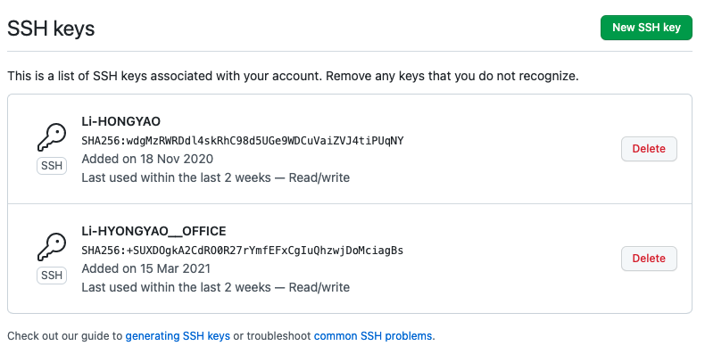
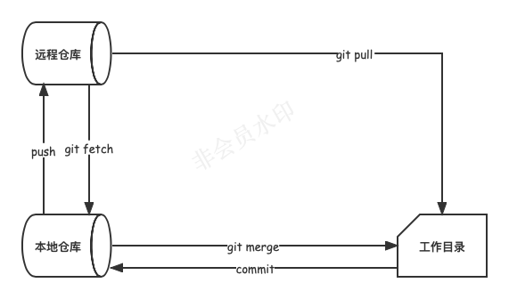

>  参考文献：
>
> 1. <https://git-scm.com/docs>
> 2. <http://www.bootcss.com/p/git-guide/>
> 3. <https://www.runoob.com/manual/github-git-cheat-sheet.pdf>

# 一、Git 概述

## 1. Git

Git是一种 **分布式版本控制系统**，用于跟踪和管理软件开发项目中的代码变更。它的设计目标是速度、数据完整性和支持分布式、非线性开发。

Git的核心思想是将代码仓库分为本地仓库和远程仓库。每个开发者都可以在本地拥有一个完整的代码仓库，可以在本地进行代码的修改、提交、分支管理和合并等操作，而不需要与中央服务器频繁通信。这使得Git在开发过程中更加灵活和高效。

Git使用 **快照**（snapshot）的方式记录代码的变更，而不是基于文件的差异。每次提交代码时，Git会生成一个新的快照，并记录该快照的相关信息，如作者、时间戳等。这样可以确保代码的完整性和一致性，并且可以方便地回溯到任意历史版本。

Git具有强大的分支管理功能，开发者可以轻松创建、切换、合并和删除分支。分支可以用于同时进行多个任务、实现不同的功能，或者进行实验性的代码修改，而不会对主线代码产生影响。这使得团队协作和并行开发变得更加容易和安全。

除了基本的版本控制功能，Git还提供了许多其他功能，如标签管理、远程仓库同步、代码提交历史查看等。它还支持各种工作流程和协作模式，如集中式工作流、分叉式工作流和拉取请求等，可以根据团队和项目的需求进行灵活配置。

Git已经成为目前最流行的版本控制系统之一，广泛应用于各种规模的软件开发项目。它的简单性、高效性和强大的功能使得开发者能够更好地管理和协作，提高开发效率和代码质量。

## 2. Git 诞生

Git是由Linus Torvalds（Linux内核创始人）于2005年创造的开源分布式版本控制系统。它的诞生源于Linus Torvalds对现有版本控制系统的不满和对开源社区的需求。

在早期的Linux内核开发中，使用的是一个名为BitKeeper的商业版本控制系统。然而，由于一些原因，BitKeeper的免费使用权被收回，这迫使Linux开发社区寻找一种新的版本控制系统来管理代码。

因此，Linus Torvalds决定自己开发一种全新的版本控制系统，它需要满足以下几个目标：分布式、高效、强大的分支管理、易于使用和开源。

在2005年，Linus发布了Git的初始版本，并将其作为Linux内核开发的版本控制系统。Git以其出色的性能和功能迅速受到广大开发者的欢迎，并逐渐在开源社区和商业项目中得到广泛应用。

Git的成功得益于其设计的优势，如快照式版本控制、分布式架构、强大的分支管理、高效的性能和灵活的工作流程支持。它为开发者提供了一种高效、可靠和灵活的代码管理解决方案，并对软件开发过程产生了深远的影响。

## 3. 分布式 VS 集中式

分布式版本控制系统（DVCS）和集中式版本控制系统（CVCS）是两种不同的版本控制系统模型，它们在数据存储和工作流程管理上有所不同。

1. 数据存储：
   - 集中式版本控制系统：CVCS的核心是一个中央服务器，所有的代码库和版本历史都存储在中央服务器上。开发者从中央服务器检出代码副本，并将更改提交到中央服务器。
   - 分布式版本控制系统：DVCS中，每个开发者都拥有完整的代码库和版本历史的副本。开发者可以在本地进行代码提交、分支操作等，不需要依赖中央服务器。
2. 工作流程管理：
   - 集中式版本控制系统：CVCS通常采用一种线性工作流程，开发者必须与中央服务器进行交互才能执行版本控制操作。这导致在没有网络连接或中央服务器故障时无法进行版本控制操作。
   - 分布式版本控制系统：DVCS允许开发者在本地进行版本控制操作，拥有更灵活的工作流程。开发者可以创建本地分支、提交更改、合并分支等操作，不受网络连接或中央服务器的限制。
3. 协作和合并：
   - 集中式版本控制系统：CVCS的协作和合并操作需要依赖中央服务器，开发者提交的更改必须经过中央服务器才能在其他开发者之间共享和合并。
   - 分布式版本控制系统：DVCS的协作和合并操作更加分散和灵活。开发者可以直接在本地进行合并操作，只需与其他开发者共享更改，而不依赖中央服务器的中介。

# 二、Git 安装

Git 各平台安装包下载地址为：<http://git-scm.com/downloads>

下载安装即可，安装好之后，输入指令，查看 git 安装位置及其版本。

```shell
$ which git
/usr/bin/git
$ git --version
git version 2.37.0 (Apple Git-136)
```

> 提示：windows 下需将 <ins>which</ins> 替换成 <ins>where</ins>。

Git 安装好之后，我们做一些简单的配置：

```shell
# 配置用户信息
$ git config --global user.name  "Your Name"
$ git config --global user.email "email@example.com"
# 彩色输出
$ git config --global color.ui true
# 显示历史记录时，只显示一行注释信息
$ git config --global format.pretty oneline
```

查看配置信息 ，输入指令

```shell
$ git config --list
```

# 三、Git 工作流


Git的工作流程包括以下几个主要步骤：

1. 初始化仓库：使用 `git init` 命令在项目目录中初始化一个新的Git仓库，或者使用 `git clone` 命令克隆一个已有的仓库到本地。
2. 添加和提交文件：使用 `git add` 命令将文件添加到暂存区，然后使用 `git commit` 命令将暂存区的文件提交到本地仓库。
3. 分支管理：使用 `git branch` 命令创建、切换和删除分支。分支可以用来同时进行多个任务、实验新功能或独立开发不同的功能。
4. 同步远程仓库：使用 `git remote` 命令添加远程仓库，并使用 `git push` 命令将本地仓库的提交推送到远程仓库。使用 `git fetch` 和 `git pull` 命令从远程仓库获取最新的更新。
5. 解决冲突：当多个人同时修改同一文件并提交到远程仓库时，可能会出现冲突。使用 `git diff` 命令查看冲突，手动解决冲突后使用 `git add` 和 `git commit` 提交解决方案。
6. 版本回退：使用 `git log` 命令查看提交历史，使用 `git checkout` 命令回退到特定的提交版本。
7. 标签管理：使用 `git tag` 命令创建和管理标签，标签可以用来标记重要的版本或里程碑。

# 四、远程仓库

## 1. 注册账号

远程仓库也就是 Github，首先你需要创建一个账号，[点击前往 >>](https://github.com/signup)

## 2. 配置SSH Key

由于你的本地Git仓库和GitHub仓库之间的传输是通过SSH加密的，所以，需要一点设置：

**第1步**：创建SSH Key。在用户主目录下，看看有没有 `.ssh` 目录，如果有，再看看这个目录下有没有 `id_rsa` 和 `id_rsa.pub` 这两个文件，如果已经有了，可直接跳到下一步。如果没有，打开 Shell（Windows下打开Git Bash），创建SSH Key：

```shell
$ ssh-keygen -t rsa -C "你的邮件地址"
```

然后一路回车，使用默认值即可，由于这个Key也不是用于军事目的，所以也无需设置密码。

如果一切顺利的话，可以在用户主目录里找到 `.ssh` 目录，里面有 `id_rsa` 和 `id_rsa.pub` 两个文件，这两个就是SSH Key的秘钥对。

其中，`id_rsa`  是私钥，不能泄露出去， `id_rsa.pub` 是公钥，可以放心地告诉任何人。

> 提示：
>
> 在windows系统下，如果出现 “ssh-keygen” 不是内部或外部命令，解决的办法是：
>
> 1. 首先找到 “ssh-keygen” 的安装目录，一般位于 “C:\Program Files\Git\usr\bin” 下。
> 2. 将该路径添加环境变量的Path字段中。
> 3. macOS 可以通过 `open ~/.ssh` 查看本地是否存在公钥和私钥文件。

**第2步**：

登录Github  → 点击右上角个人头像  →  Settings  → SSH and GPG keys  → New SSH Key

在添加面板中，

- `Title`：设置SSH key 标题，可任意填写

- `Key`：将  `id_rsa.pub`  文件内容拷贝至此

然后点击 Add SSH Key 就可以看到你创建的SSH Key了，如下图所示：



为什么GitHub需要SSH Key呢？因为GitHub需要识别出你推送的提交确实是你推送的，而不是别人冒充的，而Git支持SSH协议，所以，GitHub只要知道了你的公钥，就可以确认只有你自己才能推送。

当然，GitHub允许你添加多个Key。假定你有两台电脑，一台在公司，一台在家里，那你只需要把每台电脑的Key都添加到GitHub，就可以在家里或者在公司推送代码了。

确保你拥有一个GitHub账号后，我们就即将开始远程仓库的学习。 

## 3. 创建远程库

1）登陆GitHub，然后，在右上角找到点击 `+` 按钮，再选择 `New Repository`  创建一个新的仓库：


2）关联远程仓库：


```shell
# 关联远程仓库
$ git remote add origin https://github.com/LiHongyao/Teaching.git
# 推送远程仓库
$ git push -u origin master
```

3）推送成功后，可以立刻在GitHub页面中看到远程库的内容。从现在起，只要本地作了提交，就可以通过如下命令更新远程仓库：

```shell
$ git push origin master
```

**SSH 警告**

当你第一次使用Git的`clone`或者`push`命令连接GitHub时，会得到一个警告：

```shell
The authenticity of host 'github.com (xx.xx.xx.xx)' can't be established.
RSA key fingerprint is xx.xx.xx.xx.xx.
Are you sure you want to continue connecting (yes/no)?
```

这是因为Git使用SSH连接，而SSH连接在第一次验证GitHub服务器的Key时，需要你确认GitHub的Key的指纹信息是否真的来自GitHub的服务器，输入`yes`回车即可。

Git会输出一个警告，告诉你已经把GitHub的Key添加到本机的一个信任列表里了：

```
Warning: Permanently added 'github.com' (RSA) to the list of known hosts.
```

这个警告只会出现一次，后面的操作就不会有任何警告了。

如果你实在担心有人冒充GitHub服务器，输入`yes`前可以对照 [GitHub的RSA Key的指纹信息](https://help.github.com/articles/what-are-github-s-ssh-key-fingerprints/) 是否与SSH连接给出的一致。

## 4. 克隆远程库

在终端通过如下指令即可克隆远程仓库：

```shell
$ git clone <仓库地址>
```

Git仓库地址有以下几种形式：

1. HTTP(S)协议：通过HTTP(S)协议访问远程Git仓库。需要具有读取权限。 

   示例：`https://github.com/<username>/<repository>.git`

2. SSH协议：通过SSH协议访问远程Git仓库。需要在远程服务器上设置SSH密钥，并具有对应的读取权限。

    示例：`git@github.com:<username>/<repository>.git`

3. Git协议：使用Git协议访问远程Git仓库。通常使用默认的Git端口（9418）。 

   示例：`git://github.com/<username>/<repository>.git`

当你从远程仓库克隆时，实际上Git自动把本地的 `master` 分支和远程的 `master` 分支对应起来了，并且，远程仓库的默认名称是 `origin`。

要查看远程库的信息，用 `git remote -v`：

```shell
git remote -v
origin	https://github.com/LiHongyao/Blogs.git (fetch)
origin	https://github.com/LiHongyao/Blogs.git (push)
```

上面显示了可以抓取和推送的 `origin` 的地址。如果没有推送权限，就看不到push的地址。

# 五、分支管理


Git分支是指在版本控制系统Git中创建的、相互独立的开发路径。分支是用来在不同的开发任务之间切换、并行开发和合并代码的工具。

在Git中，分支可以理解为指向某个提交对象（commit）的指针。默认情况下，Git创建了一个名为"master"的主分支，它是代码仓库的默认分支。除了主分支，你还可以创建其他的分支来独立进行开发，每个分支都可以有自己的提交历史。

创建分支后，你可以在各个分支上进行独立的开发工作。每个分支都可以有不同的代码提交、修改和提交记录。这使得团队成员可以并行开发不同的功能，而不会相互影响或引入冲突。

在进行分支开发后，你可以将不同分支的工作合并到一起。通过合并操作，你可以将一个分支的修改应用到另一个分支上，以保持代码的同步和完整性。合并操作会自动将两个分支的提交历史进行整合，并解决可能出现的冲突。

除了常规的分支，Git还提供了特殊的分支类型，如标签（Tag）。标签是指向某个特定提交的不可变指针，常用于标记项目的版本或重要的里程碑。

总结来说，Git的分支概念允许开发者在不同的开发路径上独立工作，并提供了合并操作来整合不同分支的修改。这使得团队协作更加灵活，代码管理更加高效。

## 1. 分支分类

Git常用的分支分类包括以下几种：

1. 主分支（Main Branches）：
   - `master`：通常是主要的稳定分支，用于发布生产版本。
   - `develop`：开发主分支，用于集成各个功能分支的开发结果。
2. 功能分支（Feature Branches）：
   - 从`develop`分支创建，用于开发新功能或解决特定问题。一旦开发完成，通常会合并回`develop`分支。
3. 发布分支（Release Branches）：
   - 从`develop`分支创建，用于准备发布一个新的版本。在发布前进行最后的测试、Bug修复和版本号更新。一旦准备就绪，会合并到`master`分支和`develop`分支，并打上标签。
4. 热修复分支（Hotfix Branches）：
   - 用于紧急修复生产环境中的Bug。从`master`分支创建，修复完成后合并回`master`分支和`develop`分支，并打上标签。
5. 版本分支（Version Tags）：
   - 使用标签来标记发布的版本，方便快速定位和回溯特定的版本。

## 2. 分支管理策略

Git分支管理策略是指团队在协同开发过程中如何使用和管理Git分支的一套规则和约定。以下是几种常见的Git分支管理策略：

1. 主分支管理策略（Master Branch Only）：
   - 只使用主分支（通常是"master"或"main"）进行开发。
   - 所有的功能开发、Bug修复等工作直接在主分支上进行。
   - 适用于个人开发或小团队，简单直接。
2. 功能分支管理策略（Feature Branch Workflow）：
   - 每个功能或任务都在独立的分支上进行开发，称为功能分支。
   - 每个功能分支从主分支派生，完成后合并回主分支。
   - 适用于团队协作，每个功能独立开发，减少冲突和代码污染。
3. Git Flow管理策略（Git Flow Workflow）：
   - 基于分支的工作流，定义了一组具体的分支命名和合并规则。
   - 主要分支包括主分支（master）、开发分支（develop）、功能分支（feature）、发布分支（release）和修复分支（hotfix）等。
   - 适用于大型项目或长周期的软件开发，提供了更严格的分支管理和版本发布流程。
4. 委托合并管理策略（Pull Request Workflow）：
   - 每个开发者在自己的分支上开发，完成后通过Pull Request（PR）请求将代码合并到主分支。
   - 代码审查人员对PR请求进行审查和讨论，并最终决定是否合并到主分支。
   - 适用于开源项目或需要代码审查的团队，提高代码质量和团队协作效率。

以上仅是几种常见的Git分支管理策略，实际上，团队可以根据自身需求和开发流程制定适合自己的分支管理策略。关键是确保分支的清晰划分、合理的合并流程以及良好的协作沟通，以确保团队的代码管理和版本控制的高效性和可靠性。

## 3. 分支图解                                                      

每次提交，Git都把它们串成一条时间线，这条时间线就是一个分支。截止到目前，只有一条时间线，在Git里，这个分支叫主分支，即 `master` 分支。`HEAD` 指向的就是当前分支。

一开始的时候，`master` 分支是一条线，Git 用 `master`指向最新的提交，再用`HEAD`指向`master`，就能确定当前分支，以及当前分支的提交点：


每次提交，`master` 分支都会向前移动一步，这样，随着你不断提交，`master` 分支的线也越来越长。

当我们创建新的分支，例如 `dev` 时，Git 新建了一个指针叫 `dev`，指向 `master` 相同的提交，再把 `HEAD` 指向 `dev`，就表示当前分支在 `dev` 上：


从现在开始，对工作区的修改和提交就是针对 `dev` 分支了，比如新提交一次后，`dev` 指针往前移动一步，而 `master` 指针不变：


假如我们在 `dev` 上的工作完成了，就可以把 `dev` 合并到 `master` 上。Git怎么合并呢？最简单的方法，就是直接把 `master` 指向 `dev` 的当前提交，就完成了合并.


合并完分支后，甚至可以删除`dev`分支。删除`dev`分支就是把`dev`指针给删掉，删掉后，我们就剩下了一条`master`分支：


## 4. 解决冲突

比如在 master 分支和 feature 分支上同时对某个文件进行了修改并且提交，如下所示：


那我们在合并分支的时候就会遇到冲突的情况，遇到冲突之后，直接到冲突的文件中解决冲突，然后再次 `add` + `commit`即可，此时，合并之后的结构如下：


# 六、标签管理

Git 标签是用于给代码库中的特定提交打上有意义的标记，通常用于表示版本号、发布版本或重要的里程碑。

Git 标签管理的主要策略包括：

1. 版本标签：使用标签来表示软件的版本号。一般情况下，版本标签会和发布分支相关联，例如将一个稳定的发布分支打上版本标签，以便跟踪和记录软件的版本历史。
2. 里程碑标签：使用标签来标记项目中的重要里程碑。这些里程碑可以是关键功能的完成、重要的bug修复、重要事件的发生等。里程碑标签可以帮助团队成员追踪项目进展和重要事件的发生时间。
3. 发布标签：使用标签来标记正式发布的版本。发布标签通常与特定的版本号或发布日期相关联，用于标识可供用户下载和使用的软件版本。

Git 标签管理的优势包括：

- 标记重要版本和里程碑，方便跟踪和回溯软件的发展历程。
- 提供可靠的版本控制，确保发布版本的一致性和稳定性。
- 与分支管理结合使用，使版本控制更加灵活和可控。

在使用 Git 标签管理时，一些常用的指令包括：

- 创建标签：`git tag <tagname>`，创建一个轻量级标签。
- 创建带注释的标签：`git tag -a <tagname> -m "<message>"`，创建一个带有注释的标签。
- 列出标签：`git tag`，列出所有标签。
- 查看标签信息：`git show <tagname>`，查看指定标签的详细信息。
- 推送标签到远程仓库：`git push origin <tagname>`，将指定标签推送到远程仓库。
- 删除本地标签：`git tag -d <tagname>`，删除指定的本地标签。
- 删除远程标签：`git push origin --delete <tagname>`，删除指定的远程标签。

标签管理的策略可以根据团队的需求和项目的特点进行灵活调整，例如可以设定特定的命名规范、版本号规则、标签注释的格式等，以便更好地组织和管理标签信息。重要的是，团队成员应该遵循一致的标签管理策略，以确保标签的准确性和可维护性。

# 七、团队协作

## 1. **Collaborators**

给指定仓库添加协作者，流程大致如下：

项目负责人创建项目仓库  → 仓库：Settings → 左侧：Manage access → Add people

添加成功后被邀请的合作者会收到GitHub发送的邀请邮件，该邮件会发送到受邀人的 Github 注册邮箱中。合作者进入邮箱点击 `View Invitation`，接受邀请即可。

## 2. Fork & Pull request

对于开源项目间的合作一般都会使用 `Fork & Pull request` 的合作方式。

A拥有一个开源 repo , B想参与该开源项目， 作为B，先要 `fork` A开源项目的 repo 到自己账号的repo中，这样B便拥有了一个A开源项目的镜像repo。B可以正常的修改自己账号下的 A的开源项目镜像。并不会影响A 本身的开源repo, 如果哪天 B觉得 自己增加并完善了一个新功能，或者fixed A repo 的某个bug, 就可以提一个 `pull request`, 询问A是不是想要。

## 3. Organization & Team

我们可以通过创建组织的形式来实现团队协作，创建组织的流程如下：

登录GitHub点击 + → New organization → 选择Free（免费版本） → `填写组织信息` → 创建成功

在组织内，可以创建多个仓库，当然也可以添加组织成员。

# 八、Git 指令大全

## 1. 基础操作

| 指令                              | 描述                                 |
| --------------------------------- | ------------------------------------ |
| `git init`                        | 创建本地仓库                         |
| `git clone`                       | 克隆仓库                             |
| `git status`                      | 查看工作区状态                       |
| `git add [.][*][<filename>]`      | 提交修改至缓存区                     |
| `git commit -m "commit message"`  | 提交至版本库                         |
| `git rm --cached <file>...`       | 移除文件（暂存区）                   |
| `git restore <file>...`           | 撤销修改                             |
| `git diff`                        | 查看修改                             |
| `git log [--graph ]`              | 查看历史版本                         |
| `git reflog`                      | 查看命令历史                         |
| `git reset --hard <commit-id>`    | 版本回退，切换至指定 `id` 所在的版本 |


## 2. 标签管理

| 指令                                        | 描述                           |
| ------------------------------------------- | ------------------------------ |
| `git tag <tag_name> [commit_id] [-m <des>]` | 创建标签                       |
| `git tag`                                   | 查看标签                       |
| `git show <tag_name>`                       | 查看标签信息                   |
| `git tag -d <tag_name>`                     | 删除标签                       |
| `git push origin :refs/tags/<tag_name>`     | 删除远程标签                   |
| `git push origin <tag_name>`                | 推送标签                       |
| `git push origin --tags`                    | 推送所有未推送到远程的本地标签 |

## 3. 分支管理

| 指令                            | 描述                                           |
| ------------------------------- | ---------------------------------------------- |
| `git branch`                    | 查看分支                                       |
| `git branch <branch_name>`      | 创建分支                                       |
| `git checkout <branch_name>`    | 切换分支                                       |
| `git checkout -b <branch_name>` | 创建并切换分支                                 |
| `git branch -d <branch_name>`   | 删除分支                                       |
| `git branch -D <branch_name>`   | 强行删除分支（用在分支还未合并就要删除的情况） |
| `git merge <branch_name>`       | 合并分支                                       |
| `git stash`                     | 保存工作状态                                   |
| `git stash list`                | 查看保存的工作状态                             |
| `git stash pop/apply`           | 恢复工作状态                                   |
| `git stash drop`                | 删除工作状态                                   |

# 九、扩展

## 1. 可视化工具

下载地址：<https://desktop.github.com/>

## 2. GitHub Pages

[Github page](https://pages.github.com/) 是一个免费的静态网页托管服务，您可以使用 Gitee Pages 托管博客、项目官网等静态网页

具体操作如下：

第1步：创建一个仓库，命名为：`<username>.github.io`，比如：`zhangsan.github.io`

第2步：将静态网页直接放入该仓库，比如：`zhangsan.github.io/www`

第3步：浏览器输入地址：https://zhangsan.github.io/www/index.html

## 3. 码云

企业级 DevOps 研发管理平台，**国内版** Git，指令和 Git 一致。

访问链接：<https://gitee.com/>

当然，码云也提供 [Gitee Pages](https://help.gitee.com/services/gitee-pages/intro) 使得我们可以免费托管静态网页。

## 4. 取消跟踪

实际开发中，你可能不小心将 `node_modules` 或一些缓存文件提交至了远程仓库从而导致文件体积特别大，最终导致 `push/pull` 时特别慢。这个时候我们就需要取消Git对该文件的追踪啦。

1. 查看当前指定分支下追踪的文件（非必须）：

   ```shell
   $ git ls-tree -r master --name-only
   ```

2. 删除追踪文件：

   ```shell
   $ git rm -r --cached node_modules
   ```

3. 提交修改

   ```shell
   $ git add .
   $ git commit -m "删除对node_modules文件的追踪"
   ```

4. 提交至远程仓库

   ```shell
   $ git push origin master -f
   ```


## 5.  解决冲突

```shell
$ git pull
```

如果 `git pull`  提示 `no tracking information`，则说明本地分支和远程分支的链接关系没有创建，用命令:

```shell
$ git branch --set-upstream 分支名 origin/分支名
```

## 6. Fork

如果Fork源仓库更新了内容，要更新Fork之后的内容，操作如下：

1. 查看远程信息

```shell
$ git remote -v
```

2. 添加远程库

```shell
$ git remote add upstream https://github.com/xxx/xxx(fork源仓库地址)
```

3. 从fork源仓库同步更新代码

```shell
$ git fetch upstream
```

4. 合并到本地代码

```shell
$ git merge upstream/master
```

5. 更新并合并自己远程仓库的代码

```shell
$ git pull origin master
```

6. 向自己远程仓库推送刚才同步源仓库后的代码

```shell
$ git push origin master
```

## 7. git fetch 🆚 git pull



`git fetch` 和 `git pull` 是 Git 中用于获取远程代码更新的两个命令，它们之间的区别如下：

- `git fetch`：执行 `git fetch` 命令会从远程仓库下载最新的提交和分支信息，但不会自动合并或更新本地分支。它只是将远程仓库的内容下载到本地，并更新远程分支的引用。可以理解为将远程仓库的代码更新拉取到本地的一个暂存区域，但不会直接影响当前工作区的代码。可以通过 `git fetch origin <branch>` 指定特定的分支进行更新。
- `git pull`：执行 `git pull` 命令会从远程仓库下载最新的提交和分支信息，并尝试自动合并或更新当前分支。它包含了 `git fetch` 和 `git merge` 两个步骤，先将远程仓库的代码更新拉取到本地，然后自动执行合并操作，将远程分支的更新应用到当前分支。如果当前分支有未提交的修改，可能会导致合并冲突。

综上所述，`git fetch` 主要用于获取远程仓库的最新代码，而不会自动合并或更新当前分支，适合在查看远程更新、比较分支差异等情况下使用。而 `git pull` 则会自动合并远程分支的更新到当前分支，适合在需要及时同步远程更新并自动合并的情况下使用。

需要注意的是，使用 `git pull` 命令时，如果当前分支有未提交的修改，可能会导致合并冲突。在执行 `git pull` 之前，建议先提交或保存当前分支上的修改，以避免可能的冲突。

## 8. git stash pop 🆚 git stash apply

`git stash pop` 和 `git stash apply` 是 Git 中用于恢复暂存的工作区修改的两个命令，它们之间的区别如下：

- `git stash pop`：执行 `git stash pop` 命令会从暂存堆栈中恢复最近一次的暂存，并将恢复的修改应用到当前工作区。同时，该恢复的暂存记录会从暂存堆栈中移除。如果有多个暂存记录，`git stash pop` 会自动恢复最新的记录。
- `git stash apply`：执行 `git stash apply` 命令会从暂存堆栈中恢复最近一次的暂存，并将恢复的修改应用到当前工作区。与 `git stash pop` 不同的是，`git stash apply` 不会移除恢复的暂存记录，仍然保留在暂存堆栈中。如果有多个暂存记录，需要通过指定索引来选择恢复特定的记录。

总结来说，`git stash pop` 和 `git stash apply` 的作用是相同的，都用于从暂存堆栈中恢复修改。不同之处在于 `git stash pop` 在恢复修改后会自动将该暂存记录从堆栈中移除，而 `git stash apply` 则保留该暂存记录。选择使用哪个命令取决于你的需求，如果你希望在恢复修改后将暂存记录从堆栈中删除，可以使用 `git stash pop`；如果希望保留暂存记录以备将来使用，可以使用 `git stash apply`。

# 十、常见问题

1. **fatal: protocol error: bad pack header**

   ```sh
   $ git config --global pack.windowMemory 256m
   ```

2. **error: RPC failed; curl 56 OpenSSL SSL_read: Connection was reset, errno 10054**

   ```markdown
   # 原因：被墙了
   # 解决：
   1. 获取ip
   访问
   https://fastly.net.ipaddress.com/github.global.ssl.fastly.net#ipinfo 
   获取cdn域名以及IP地址
   
   访问 
   https://github.com.ipaddress.com/#ipinfo
   获取cdn域名以及IP地址
   2. 将域名与获取的ip添加映射关系
   # fix git clone github project failed
   199.232.69.194 github.global.ssl.fastly.net
   140.82.114.4 github.com
   添加到 windows中的 C:\Windows\System32\drivers\etc\hosts 文件中；
   
   3. 然后cmd命令窗口中执行下列命令刷新dns
   ipconfig /flushdns
   ```

3. **unable to access..., errno [502,10053]**

   fatal: unable to access '': OpenSSL SSL_read: Connection was aborted, errno 10053

   fatal: unable to access '': The requested URL returned error: 502

   ```shell
   git config --global --unset http.proxy 
   git config --global --unset https.proxy
   ```

   由于网络原因，可能需要多次重试：git push 指令

4. **fatal: unable to access: OpenSSL SSL_read: Connection was reset, errno 10054**

   ```shell
   git config --global http.sslVerify "false"
   ```

5. **fatal: The remote end hung up unexpectedly error: failed to push some refs to**

   ```shell
   git push origin master
   ```

6. **fatal: unable to access : LibreSSL SSL_connect: SSL_ERROR_SYSCALL in connection to github.com:443** 

   ```shell
   git config --global --unset http.proxy
   ```


7. **fatal: unable to access : Failed to connect to github.com port 443 after 2086 ms: Connection refused**

   ```shell
   git config --global http.proxy http://127.0.0.1:1080
   git config --global https.proxy http://127.0.0.1:1080
   ```

   

