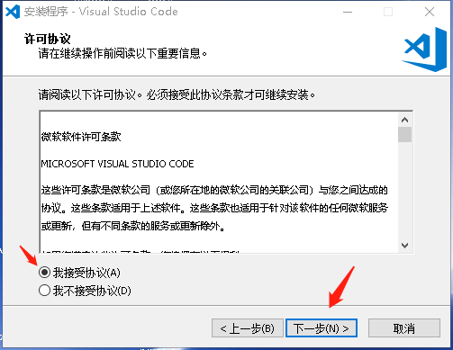
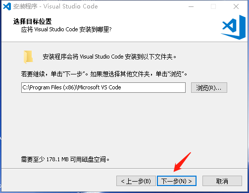
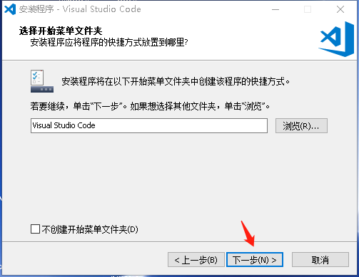
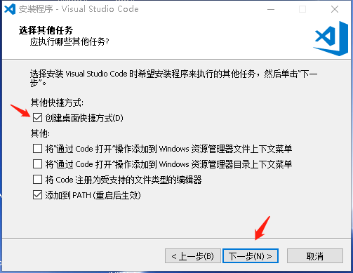
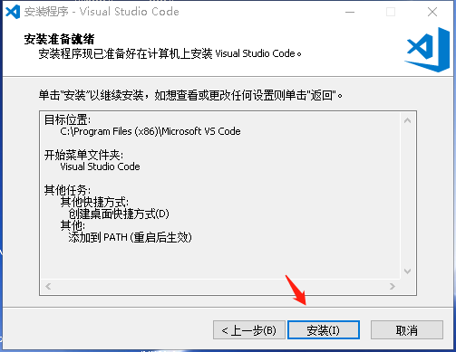
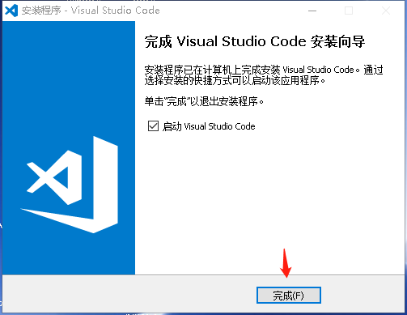
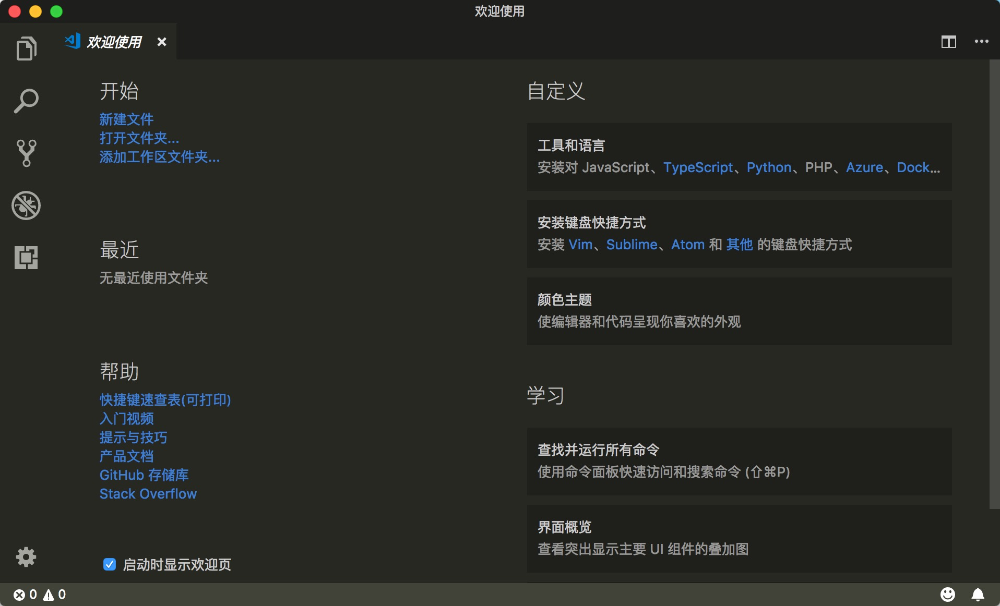
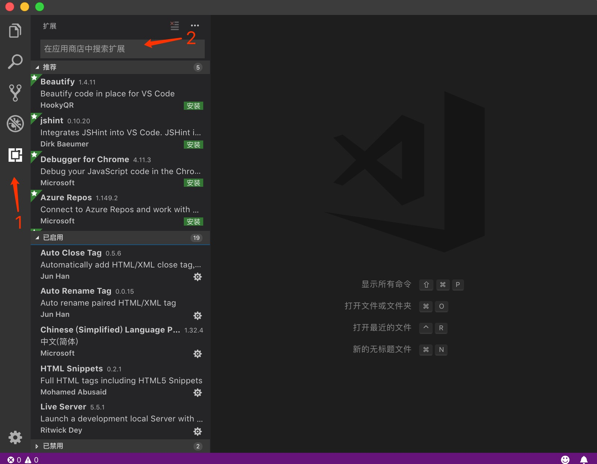

> VS Code 的全称是 Visual Studio Code，是一款开源的、免费的、跨平台的、高性能的、轻量级的代码编辑器。它在性能、语言支持、开源社区方面，都做得很不错。

# 一、下载

下载地址：<https://code.visualstudio.com/Download>

> 提示：根据电脑系统选择对应的版本进行下载

# 二、安装

双击下载好的安装包进行安装，以下针对不同系统进行讲解。

## 1. windows 

- stips 01：接受协议并点击下一步

- stips 02：选择安装盘符并点击下一步

- stips 03：选择开始菜单文件夹，直接点击下一步即可

- stips 04：勾选创建桌面快捷方式并点击下一步

- stips 05：点击安装

- stips 06：安装完成，点击完成启动VSCode

## 2. macOS 

> macOS 环境安装直接双击 .dmg 文件，将提示框中将VSCode拖进应用程序即可完成安装。

安装好后进入VSCode主界面，如下所示：

# 三、插件

## 1. 如何安装？

在编辑器中，点击最左侧栏目中第5项，在搜索框中搜索您想要装的插件并点击安装即可，插件安装之后需要重新启动编辑器才会生效。

## 2. 如何选择？

- 带 `snippets` 一般是代码提示类扩展；
- 带 `viewer` 一般是代码运行预览类扩展；
- 带 `support` 一般是代码语言支持；
- 带 `document` 一般是参考文档类扩展；
- 带 `Format` 一般是代码格式化整理扩展；

## 3. 常用插件？

1. GitLens【荐】

     git神器，可以查看提交历史、分支信息等数据；

2. Live Server【荐】

   实时编译，在.html 中使用快捷键 ctr/cmd + L + O 即可启动，或者点击VSCode底部的 “Go Live” 即可。

3. Bracket Pair Colorizer 2【荐】

   突出显示成对的括号

4. highlight-icemode【荐】

   选中相同的代码时，让高亮显示更加明显。VSCode 自带的高亮显示，实在是不够显眼。用插件支持一下吧。所用了这个插件之后，VS Code 自带的高亮就可以关掉了：

   在用户设置里添加 `"editor.selectionHighlight": false` 即可。

5. Vscode-icons

   vscode-icons 会根据文件的后缀名来显示不同的图标，让你更直观地知道每种文件是什么类型

6. Markdown Preview Github Styling【荐】

   以 GitHub 风格预览 Markdown 样式，十分简洁优雅

7. Settings Sync【荐】

   多台设备之间，同步 VS Code 配置。通过登录 GitHub 账号来使用这个同步工具。

8. vetur

   Vue 多功能集成插件，包括：语法高亮，智能提示，emmet，错误提示，格式化，自动补全，debugger。VS Code 官方钦定 Vue 插件，Vue 开发者必备。

9. ES7 React/Redux/GraphQL/React-Native snippets

   React/Redux/react-router 的语法智能提示。

10. Prettier

    Prettier 是一个代码格式化工具，只关注格式化，但不具备校验功能。在一个多人协同开发的团队中，统一的代码编写规范非常重要。一套规范可以让我们编写的代码达到一致的风格，提高代码的可读性和统一性。自然维护性也会有所提高。

11. ESLint

    日常开发中，建议用可以用 Prettier 做代码格式化，然后用 eslint 做校验。

12. JavaScript(ES6) code snippets

    ES6 语法智能提示，支持快速输入。

13. Image Preview

    图片预览。鼠标移动到图片 url 上的时候，会自动显示图片的预览和图片尺寸。

14. Auto Close Tag、Auto Rename Tag

    自动闭合标签、自动对标签重命名。

15. Better Components

    为注释添加更醒目、带分类的色彩。

16. CSS Peek

    增强 HTML 和 CSS 之间的关联，快速查看该元素上的 CSS 样式。

17. Vue CSS Peek

    CSS Peek 对 Vue 没有支持，该插件提供了对 Vue 文件的支持。

> HTML 

| 插件名                    | 描述                  |
| ---------------------- | ------------------- |
| HTML Snippets          | 支持HTML5标签提示         |
| HTML CSS support       | CSS自动补齐             |
| HTML Class Suggestions | 类名命名提示              |
| Auto Rename Tag        | 修改HTML标签时，自动修改匹配的标签 |
| Auto Close Tag         | 自动闭合HTML标签          |

> CSS

| 插件名                              | 描述                                     |
| -------------------------------- | -------------------------------------- |
| CSS Peek                         | 跟踪样式表中 CSS 类和 id 的样式，点击右键直接跳转到对应的css代码 |
| Color-Highlight | 高亮显示颜色 |
| Color Picker | 颜色选择器 |
| IntelliSense for CSS class names in HTML | CSS类名智能命名提示                    |

> JS

| 插件名                       | 描述                   |
| ------------------------- | -------------------- |
| JavaScript (ES6) snippets | 支持JavaScript  ES6 语法 |
| jQuery Code Snippets      | jq代码段提示              |
| JavaScript Snippet Pack   | ES5常用操作DOM的语法代码块     |

> 综合

| 插件名               | 描述                                       |
| ----------------- | ---------------------------------------- |
| Beautify          | 格式化HTML、CSS、SCSS、JS文件                    |
| Path Intellisense | 自动补全路劲                                   |
| Path Autocomplete | 自动补全路径                                   |
| vscode-icons      | 侧栏的图标，对于一个有视觉强迫症的人是必须要的                  |
| vscode-fileheade  | 顶部注释模板，可定义作者、时间等信息，并会自动更新最后修改时间，快捷键：`ctr + alt + i` |
| Color-Highlight   | 在编辑器中高亮显示颜色                              |
| Better Comments   | 编写更加人性化的注释                               |
| Live Server       | 实时编译，在.html 中使用快捷键 ctr/cmd + L + O 即可启动，或者点击VSCode底部的 “Go Live” 即可。 |

> 调试

| 插件名              | 描述                                                         |
| ------------------- | ------------------------------------------------------------ |
| Debugger for Chrome | js调试的插件，前端项目在Chrome中运行起来之后，可以直接在VSCode中打断点、查看输出、查看控制台，详细配置见插件说明。 |
| REST Client         | 接口测试工具，创建.http文件配置                              |

# 四、用户设置

**> 用户设置入口**

1. 快捷键：**Cmd+,**
2. 文件 -> 首选项 -> 设置

> 提示：
>
> 编辑器会拆分为两列，一个文件是**【默认设置】**，一个是**【用户设置】**
>
> 进行用户设置的时候，可通过默认设置找到需要用户自定义的设置项，然后复制粘贴到用户设置里面修改成用户自定义值并保存即可。

# 五、常用快捷键

## 1. 常用 `cmd+shift+?` 系列

| 快捷键          | 功能                |
| ------------ | ----------------- |
| cmd+shift+D  | 打开Debugger        |
| cmd+shift+K  | 删除光标所在的一整行        |
| cmd+shift+L  | 选择当前文件中所有你当前选中的词汇 |
| cmd+shift+F  | 打开全局搜索            |
| cmd+shift+M  | 打开你的问题面板          |
| cmd+shift+H  | 对当前文件的查询替换        |
| cmd+shift+S  | 文件另存为             |
| cmd+shift+T  | 打开最近关闭的那个文件       |
| cmd+shift+X  | 打开安装插件的入口         |
| cmd+shift+V  | 预览MarkDown        |
| cmd+shift+空格 | 参数提示              |
| cmd+shift+\  | 光标跳转到花括号闭合处       |

## 2. 常用的 `cmd+?` 系列

| 快捷键     | 功能            |
| ------- | ------------- |
| cmd+B   | 打开或者关闭侧边栏     |
| cmd+W   | 关闭当前窗口        |
| cmd+P   | 打开最近关闭的文件     |
| cmd+]/[ | 左右控制行缩进       |
| cmd+/   | 注释一行或取消当前行的注释 |
| cmd+F   | 查询在当前文件       |
| cmd+,   | 打开用户设置        |
| cmd+N   | 新建一个文件        |
| cmd+O   | 打开一个文件        |
| ctr+`   | 打开集成的终端       |

# 六、汉化

安装插件：`Chinese（Simplied） Lang`

