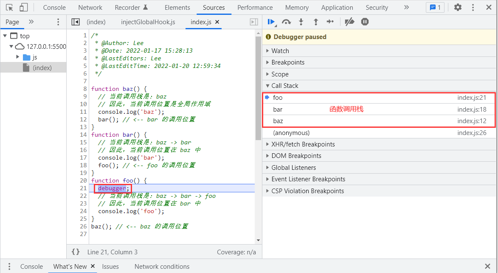

# 一、概述

`this` 关键字是 JavaScript 中最复杂的机制之一。它是一个很特别的关键字，被自动定义在所有函数的作用域中。即使是非常有经验的 JavaScript 开发者也很难说清它到底指向什么。

> **特别提示**：本文主要参考 《你不知道的JavaScript（上卷）》!

## 1. 为什么要用 this ❓

在开始之前呢，我们还是先来简单了解为什么会用到 `this` 或者说 `this` 到底存在的意义是什么？我们来看一组示例：

```javascript
function transform() {
  return this.name.toUpperCase();
}
function sayHelloWith() {
  var greeting = `Hello, ${transform.call(this)}!`;
  console.log(greeting);
}

var me = {
  name: 'Petter',
};
var you = {
  name: 'Henry',
};

console.log(transform.call(me));  // → PETTER
console.log(transform.call(you)); // → HENRY
sayHelloWith.call(me);  // → Hello, PETTER!
sayHelloWith.call(you); // → Hello, HENRY!
```

这段代码可以在不同的上下文对象（`me` 和 `you`）中重复使用函数 `transform()` 和 `sayHelloWith()`，不用针对每个对象编写不同版本的函数。如果不使用 `this`，那就需要给 `transform()` 和 `sayHelloWith()` 显式传入一个上下文对象（`context`）。

```javascript
function transform(context) {
  return context.name.toUpperCase();
}
function sayHelloWith(context) {
  var greeting = `Hello, ${transform(context)}!`;
  console.log(greeting);
}
var me = {
  name: 'Petter',
};
var you = {
  name: 'Henry',
};
console.log(transform(me));
sayHelloWith(you);
```

对比两段代码，不难发现，`this` 提供了一种 **更优雅** 的方式来隐式 “传递” 一个对象引用，因此可以将 **API** 设计得更加 **简洁** 并且 **易于复用。**

## 2. 打破误解

### 2.1. 指向自身

`this` 从字面意义上来讲表示自身，这也是大多数人（特别是初学者）会犯的一个错误，这个推断从英语的语法角度来说是说得通的。但不完全正确，下面的代码，我想要记录 `foo` 执行的次数：

```javascript
function foo(num) {
  console.log('foo: ' + num);
  // 记录 foo 被调用的次数
  console.log(this.count); // undefined → NaN
  this.count++;
}
foo.count = 0;
var i;
for (i = 0; i < 10; i++) {
  if (i > 5) {
    foo(i);
  }
}
// foo: 6
// foo: 7
// foo: 8
// foo: 9
// foo 被调用了多少次 ❓
console.log(foo.count); // 0 -- 什么？！
```

`console.log` 语句产生了 4 条输出，证明 `foo(..)` 确实被调用了 `4` 次，但是 `foo.count` 仍然是 `0。`显然从字面意思来理解 `this` 是错误的。

执行 `foo.count = 0` 时，的确向函数对象 `foo` 添加了一个属性 `count`。但是函数内部代码 `this.count` 中的 `this` 并不是指向那个函数对象，并且在函数内部访问 `this.count` 居然为 `NaN`。

要理解这个问题，首先你需要知道 `this` 的指向其实和调用栈有关系，`foo` 函数在 `for` 循环中被调用，在这里 `foo(i)` 实际上等价于 `window.foo(i)`，所以 `this` 其实指向的是 `window`，那就意味着我们一直在操作 `window.count` ，并没有操作 `foo.count`，同样的，正是由于在 `window` 对象上并没有 `count` 属性，它的值是 `undefined`，所以在执行 `this.count++` 时，结果为 `NaN`。

那如何解决这个问题呢？我们可以通过 `call` 方法强制让 `this` 指向 `foo` 函数：

```javascript
function foo(num) {
  console.log('foo: ' + num);
  // 记录 foo 被调用的次数
  this.count++;
}
foo.count = 0;
var i;
for (i = 0; i < 10; i++) {
  if (i > 5) {
    // 使用 call(..) 可以确保 this 指向函数对象 foo 本身
    foo.call(foo, i);
  }
}
// foo: 6
// foo: 7
// foo: 8
// foo: 9
// foo 被调用了多少次？
console.log(foo.count); // 4
```

### 2.2. 指向函数所在的作用域

第二种常见的误解是，`this` 指向函数的作用域。某种情况下它是正确的，但是在其他情况下它却是错误的。

需要明确的是，`this` 在任何情况下都不指向函数的词法作用域。在 JavaScript 内部，作用域确实和对象类似，可见的标识符都是它的属性。但是作用域对象无法通过 JavaScript 代码访问，它存在于 JavaScript 引擎内部。

思考一下下面的代码，它试图（但是没有成功）跨越边界，使用 `this` 来隐式引用函数的词法作用域：

```javascript
function foo() {
  var a = 2;
  // → 能调用成功（纯属意外），因为this在这里指向window，而bar定义在全局，所以可以访问
  // → 更优雅的写法是省略 this，直接调用 bar()
  this.bar(); 
}
function bar() {
  // → 企图通过 this 连接 foo 和 bar 的词法作用域
  // → 从而让 bar 在内部可以通过 this 访问 foo 里面的变量 a
  // → 显然这是不可能的，所以输出 undefined
  console.log(this.a); // → undefined
}
foo();
```

## 3. `this` 到底是什么❓

排除了一些错误理解之后，我们来看看 this 到底是一种什么样的机制。`this` 是在 **运行时** 进行绑定的，并不是在编写时绑定，它的上下文取决于函数调用时的各种条件。`this` 的绑定和函数声明的位置没有任何关系，只取决于函数的 **调用方式**（简单理解：谁调用，`this` 指向谁）。

当一个函数被调用时，会创建一个活动记录（有时候也称为 **执行上下文**）。这个记录会包含函数在哪里被调用（调用栈）、函数的调用方式、传入的参数等信息。`this` 就是这个记录的一个属性，会在函数执行的过程中用到。

# 二、调用位置

我们排除了一些对于 `this` 的错误理解并且明白了每个函数的 `this` 是在调用时被绑定的，完全取决于函数的调用位置。那什么是函数的调用位置呢？

调用位置就是函数在代码中被调用的位置（而不是声明的位置）。只有仔细分析调用位置才能回答这个问题：这个 `this` 到底引用的是什么？而寻找调用位置，最重要的是要分析 **调用栈**。我们关心的调用位置就在当前正在执行的函数的 **前一个** 调用中。下面我们来看看到底什么是调用栈和调用位置：

```javascript
function baz() {
  // 当前调用栈是：baz
  // 因此，当前调用位置是全局作用域
  console.log('baz');
  bar(); // <-- bar 的调用位置
}
function bar() {
  // 当前调用栈是：baz -> bar
  // 因此，当前调用位置在 baz 中
  console.log('bar');
  foo(); // <-- foo 的调用位置
}
function foo() {
  // 当前调用栈是：baz -> bar -> foo
  // 因此，当前调用位置在 bar 中
  console.log('foo');
}
baz(); // <-- baz 的调用位置
```

注意我们是如何（从调用栈中）分析出真正的调用位置的，因为它决定了 `this` 的绑定。你可以把调用栈想象成一个函数调用链，就像我们在前面代码段的注释中所写的一样。但是这种方法非常麻烦并且容易出错。另一个查看调用栈的方法是使用浏览器的调试工具。绝大多数现代桌面浏览器都内置了开发者工具，其中包含 `JavaScript` 调试器。就本例来说，你可以在工具中给 `foo()` 函数的第一行代码设置一个断点，或者直接在第一行代码之前插入一条 `debugger` 语句。运行代码时，调试器会在那个位置暂停，同时会展示当前位置的函数调用列表，这就是你的调用栈。因此，如果你想要分析 `this` 的绑定，使用开发者工具得到调用栈，然后找到栈中第二个元素，这就是真正的调用位置。如下图所示：



# 三、绑定原则

我们来看看在函数的执行过程中调用位置如何决定 `this` 的绑定对象。你必须找到调用位置，然后判断需要应用下面四条规则中的哪一条。我们首先会分别解释
这四条规则，然后解释多条规则都可用时它们的优先级如何。

## 1. 默认绑定

首先要介绍的是最常用的函数调用类型：独立函数调用。可以把这条规则看作是无法应用其他规则时的默认规则。思考一下下面的代码：

```javascript
function foo() {
  console.log(this.a);
}
var a = 2;

foo(); // → 2
```

上述代码中，我们定义了一个全局变量 `a`，该变量绑定在全局对象上，当我们调用 `foo()` 时，`this.a` 被解析成了全局变量 `a`，因为函数调用时应用了 `this` 的默认绑定，并且是在全局作用域下调用的，所以 `this` 指向了全局对象，访问 `this.a` 时输出 `2`。

> 提示：如果使用严格模式（`strict mode`），则不能将全局对象用于默认绑定，因此在严格模式下， `this` 会绑定到 `undefined`：

## 2. 隐式绑定

另一条需要考虑的规则是调用位置是否有上下文对象，或者说是否被某个对象拥有或者包含，不过这种说法可能会造成一些误导。思考下面的代码：

```javascript
function foo() {
  console.log(this.a);
}
var obj = {
  a: 2,
  foo: foo,
};
obj.foo(); // → 2
```

首先需要注意的是 `foo()` 的声明方式，及其之后是如何被当作引用属性添加到 `obj` 中的。但是无论是直接在 `obj` 中定义还是先定义再添加为引用属性，这个函数严格来说都不属于 `obj`  对象。然而，调用位置会使用 `obj` 上下文来引用函数，因此你可以说函数被调用时 `obj` 对象“拥有”或者“包含”它。

无论你如何称呼这个模式，当 `foo()` 被调用时，它的前面确实加上了对 `obj` 的引用。当函数引用有上下文对象时，隐式绑定规则会把函数调用中的 `this` 绑定到这个上下文对象。因为调用 `foo()` 时 `this` 被绑定到 `obj`，因此 `this.a` 和 `obj.a` 是一样的。

对象属性引用链中只有上一层或者说最后一层在调用位置中起作用。举例来说：

```javascript
function foo() {
  console.log(this.a);
}
var obj1 = {
  a: 3,
  foo: foo,
};
var obj2 = {
  a: 2,
  obj1,
};

obj2.obj1.foo(); // → 3
```

**隐式丢失**

一个最常见的 `this` 绑定问题就是被隐式绑定的函数会**丢失绑定对象**，也就是说它会**应用默认绑定**，从而把 `this` 绑定到全局对象或者 `undefined` 上，取决于是否是严格模式。思考下面的代码：

```javascript
function foo() {
  console.log(this.a);
}
var obj = {
  a: 2,
  foo: foo,
};
var bar = obj.foo; // 函数别名！
var a = 'hello, global'; // a 是全局对象的属性
bar(); // "hello, global"
```

虽然 `bar` 是 `obj.foo` 的一个引用，但是实际上，它引用的是 `foo` 函数本身，因此此时的`bar()` 其实是一个不带任何修饰的函数调用，因此应用了默认绑定。

一种更微妙、更常见并且更出乎意料的情况发生在传入回调函数时：

```javascript
function foo() {
  console.log(this.a);
}
function doFoo(fn) {
  // fn 其实引用的是 foo
  fn(); // <-- 调用位置！
}
var obj = {
  a: 2,
  foo: foo,
};
var a = 'hello, global'; // a 是全局对象的属性
doFoo(obj.foo); // "hello, global"
```

参数传递其实就是一种隐式赋值，因此我们传入函数时也会被隐式赋值，所以结果和上一个例子一样。

如果把函数传入语言内置的函数而不是传入你自己声明的函数，会发生什么呢？结果是一样的，没有区别：

```javascript
function foo() {
  console.log(this.a);
}
var obj = {
  a: 2,
  foo: foo,
};
var a = 'hello, global'; // a 是全局对象的属性
setTimeout(obj.foo, 100); // "hello, global"
```

`JavaScript`  环境中内置的 `setTimeout()` 函数实现和下面的伪代码类似：

```javascript
function setTimeout(fn, delay) {
  // 等待 delay 毫秒
  fn(); // <-- 调用位置！
}
```

## 3. 显示绑定

我们可以通过 `call()`、`apply()` 以及 `bind()` 方法显示绑定 `this`，比如：

```javascript
function foo() {
  console.log(this.a);
}

var obj1 = {
  a: 2,
};
var obj2 = {
  a: 3,
};
var obj3 = {
  a: 4,
};

foo.call(obj1); // → 2
foo.apply(obj2); // → 3
foo.bind(obj3)(); // → 4
```

## 4. new绑定

在讲解它之前我们首先需要澄清一个非常常见的关于 `JavaScript` 中函数和对象的误解，在传统的面向类的语言中，“构造函数”是类中的一些特殊方法，使用 `new` 初始化类时会调用类中的构造函数。通常的形式是这样的：

```javascript
something = new MyClass(..);
```

`JavaScript` 也有一个 `new` 操作符，使用方法看起来也和那些面向类的语言一样，绝大多数开发者都认为 `JavaScript` 中 `new` 的机制也和那些语言一样。然而，`JavaScript` 中 `new` 的机制实际上和面向类的语言完全不同。

首先我们重新定义一下 `JavaScript` 中的“构造函数”。在 `JavaScript` 中，构造函数只是一些使用 `new` 操作符时被调用的函数。它们并不会属于某个类，也不会实例化一个类。实际上，它们甚至都不能说是一种特殊的函数类型，它们只是被 `new` 操作符调用的普通函数而已。

举例来说，思考一下 `Number(..)` 作为构造函数时的行为，`ES5.1` 中这样描述它：<u>当 `Number` 在 `new` 表达式中被调用时，它是一个构造函数：它会初始化新创建的对象。</u>

所以，包括内置对象函数（比如 `Number(..)`）在内的所有函数都可以用 `new` 来调用，这种函数调用被称为**构造函数调用**。这里有一个重要但是非常细微的区
别：实际上并不存在所谓的“构造函数”，只有对于函数的“构造调用”。

使用 `new` 来调用函数，或者说发生构造函数调用时，会自动执行下面的操作。

1）创建（或者说构造）一个全新的对象。

2）这个新对象会被执行 `Prototype` 连接。

3）这个新对象会绑定到函数调用的 `this`。

4）如果函数没有返回其他对象，那么 `new` 表达式中的函数调用会自动返回这个新对象。

我们现在关心的是第 1 步、第 3 步、第 4 步，所以跳过第 2 步。思考下面的代码：

```javascript
function foo(a) {
  this.a = a;
}
var bar = new foo(2);
console.log(bar.a); // 2
```

使用 `new` 来调用 `foo(..)` 时，我们会构造一个新对象并把它绑定到 `foo(..)` 调用中的 `this`上。`new` 是最后一种可以影响函数调用时 `this` 绑定行为的方法，我们称之为 `new` 绑定。

# 四、优先级

优先级：**new 绑定**  > **显示绑定** > **隐式绑定** > **默认绑定**

现在我们可以根据优先级来判断函数在某个调用位置应用的是哪条规则。可以按照下面的顺序来进行判断：

- 1）函数是否在 `new` 中调用（**new 绑定**）？如果是的话 `this` 绑定的是新创建的对象。

  ```javascript
  var bar = new foo();
  ```

- 2）函数是否通过 `call`、`apply`（**显式绑定**）或者**硬绑定**（`bind`）调用？如果是的话，`this` 绑定的是指定的对象。

  ```javascript
  var bar = foo.call(obj);
  ```

- 3）函数是否在某个上下文对象中调用（**隐式绑定**）？如果是的话，`this` 绑定的是那个上下文对象。

  ```javascript
  var bar = obj.foo();
  ```

- 4）如果都不是的话，使用 **默认绑定**。如果在严格模式下，就绑定到 `undefined`，否则绑定到 全局对象。

  ```javascript
  var bar = foo();
  ```

就是这样。对于正常的函数调用来说，理解了这些知识你就可以明白 t`h`is 的绑定原理了。不过……凡事总有例外。

# 五、绑定例外

规则总有例外，这里也一样。在某些场景下 `this` 的绑定行为会出乎意料，你认为应当应用其他绑定规则时，实际上应用的可能是默认绑定规则。

## 1. 被忽略的 `this`

如果你把 `null` 或者 `undefined` 作为 `this` 的绑定对象传入 `call`、`apply` 或者 `bind`，这些值在调用时会被忽略，实际应用的是默认绑定规则：

```javascript
function foo() {
  console.log(this.a);
}
var a = 2;
foo.call(null); // 2
```

那么什么情况下你会传入 `null` 呢？

一种非常常见的做法是使用 `apply(..)` 来 “展开”一个数组，并当作参数传入一个函数。类似地，`bind(..)` 可以对参数进行柯里化（预先设置一些参数），这种方法有时非常有用：

```javascript
function foo(a, b) {
  console.log(`a:${a}, b:${b}`);
}
// → 把数组“展开”成参数
foo.apply(null, [2, 3]); // a:2, b:3

// → 使用 bind(..) 进行柯里化
var bar = foo.bind(null, 2);
bar(3); // a:2, b:3
```

这两种方法都需要传入一个参数当作 `this` 的绑定对象。如果函数并不关心 `this` 的话，你仍然需要传入一个占位值，这时 `null` 可能是一个不错的选择，就像代码所示的那样。

然而，总是使用 `null` 来忽略 `this` 绑定可能产生一些副作用。如果某个函数确实使用了 `this`（比如第三方库中的一个函数），那默认绑定规则会把 `this` 绑定到全局对象（在浏览器中这个对象是 `window`），这将导致不可预计的后果（比如修改全局对象）。显而易见，这种方式可能会导致许多难以分析和追踪的 `bug`。

**更安全的this**

一种 **更安全** 的做法是传入一个 **空对象**，把 `this` 绑定到这个空对象不会对你的程序产生任何副作用。在 `JavaScript` 中创建一个空对象最简单的方法就是 `Object.create(null)`。`Object.create(null)` 和 {} 很 像， 但 是 并 不 会 创 建 `Object.prototype` 这个委托，所以它比 `{}` “更空”：

```javascript
function foo(a, b) {
  console.log(`a:${a}, b:${b}`);
}

// → 把数组展开成参数
foo.apply(Object.create(null), [2, 3]); // a:2, b:3

// → 使用 bind(..) 进行柯里化
var bar = foo.bind(Object.create(null), 2);
bar(3); // a:2, b:3
```

## 2. 间接引用

另一个需要注意的是，你有可能（有意或者无意地）创建一个函数的 “间接引用”，在这种情况下，调用这个函数会应用默认绑定规则。间接引用最容易在赋值时发生：

```javascript
function foo() {
  console.log(this.a);
}
var a = 2;
var o = { a: 3, foo: foo };
var p = { a: 4 };
o.foo(); // 3
(p.foo = o.foo)(); // 2
```

赋值表达式 `p.foo = o.foo` 的返回值是目标函数的引用，因此调用位置是 `foo()` 而不是 `p.foo()` 或者 `o.foo()`。根据我们之前说过的，这里会应用默认绑定。

> 注意：对于默认绑定来说，决定 `this` 绑定对象的并不是调用位置是否处于严格模式，而是函数体是否处于严格模式。如果函数体处于严格模式，`this` 会被绑定到 `undefined`，否则 `this` 会被绑定到全局对象。

# 六、`this` 词法

我们之前介绍的四条规则已经可以包含所有正常的函数。但是 ES6 中介绍了一种无法使用这些规则的特殊函数类型：箭头函数。

箭头函数并不是使用 `function` 关键字定义的，而是使用被称为“胖箭头”的操作符 `=>` 定义的。箭头函数不使用 `this` 的四种标准规则，而是根据外层（函数或者全局）作用域来决定 `this`。

我们来看看箭头函数的词法作用域：

```javascript
function foo() {
  // 返回一个箭头函数
  return (a) => {
    // this 继承自 foo()
    console.log(this.a);
  };
}
var obj1 = {
  a: 2,
};
var obj2 = {
  a: 3,
};
var bar = foo.call(obj1);
bar.call(obj2); // 2, 不是 3 ！
```

`foo()` 内部创建的箭头函数会捕获调用时 `foo()` 的 `this`。由于 `foo()` 的 `this` 绑定到 `obj1`，`bar`（引用箭头函数）的 `this` 也会绑定到 `obj1`，箭头函数的绑定无法被修改。（`new` 也不行！）

箭头函数最常用于回调函数中，例如事件处理器或者定时器：

```javascript
function foo() {
  setTimeout(() => {
    // 这里的 this 在词法上继承自 foo()
    console.log(this.a);
  }, 100);
}
var obj = {
  a: 2,
};
foo.call(obj); // 2
```

箭头函数可以像 `bind(..)` 一样确保函数的 `this` 被绑定到指定对象，此外，其重要性还体现在它用更常见的词法作用域取代了传统的 `this` 机制。实际上，在 ES6 之前我们就已经在使用一种几乎和箭头函数完全一样的模式。

```javascript
function foo() {
  var self = this; // lexical capture of this
  setTimeout(function () {
    console.log(self.a);
  }, 100);
}
var obj = {
  a: 2,
};
foo.call(obj); // 2
```

虽然 `self = this` 和箭头函数看起来都可以取代 `bind(..)`，但是从本质上来说，它们想替代的是 `this` 机制。

如果你经常编写 `this` 风格的代码，但是绝大部分时候都会使用 `self = this` 或者箭头函数来否定 `this` 机制，那你或许应当：

1）只使用词法作用域并完全抛弃错误 `this` 风格的代码；

2）完全采用 `this` 风格，在必要时使用 `bind(..)`，尽量避免使用 `self = this` 和箭头函数。

当然，包含这两种代码风格的程序可以正常运行，但是在同一个函数或者同一个程序中混合使用这两种风格通常会使代码更难维护，并且可能也会更难编写。

# 七、总结

如果要判断一个运行中函数的 `this` 绑定，就需要找到这个函数的直接调用位置。找到之后就可以顺序应用下面这四条规则来判断 `this` 的绑定对象。

1）由 `new` 调用？绑定到新创建的对象。

2）由 `call` 或者 `apply`（或者 `bind`）调用？绑定到指定的对象。

3）由上下文对象调用？绑定到那个上下文对象。

4）默认：在严格模式下绑定到 `undefined`，否则绑定到全局对象。

一定要注意，有些调用可能在无意中使用默认绑定规则。如果想“更安全”地忽略 `this` 绑定，你可以使用一个 `DMZ` 对象，比如 `ø = Object.create(null)`，以保护全局对象。

ES6 中的箭头函数并不会使用四条标准的绑定规则，而是根据当前的词法作用域来决定 `this`，具体来说，箭头函数会继承外层函数调用的 `this` 绑定（无论 `this` 绑定到什么）。这其实和 `ES6` 之前代码中的 `self = this` 机制一样。