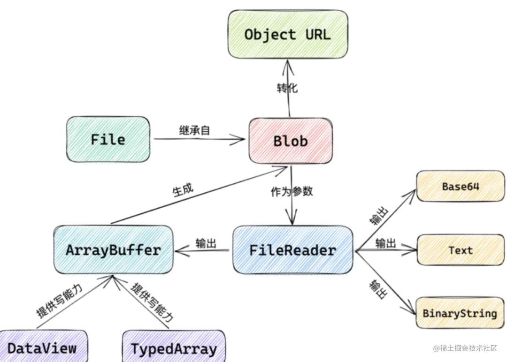
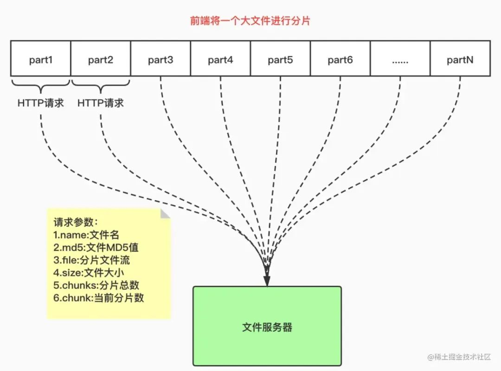

# 序

本文参考：

「1」前端之神·《前端文件流、切片下载和上传：优化文件传输效率与用户体验》·2023-07-14 09:26，原文链接 [点击前往 >>](https://mp.weixin.qq.com/s/Cfsc_DquX454yJPLPJZJhA)

# 概述



文件传输是常见需求，但对于大文件的下载和上传，传统的方式可能面临性能和用户体验问题。幸运的是，前端技术提供了高效解决方案：文件流操作和切片下载与上传。本文将详细探讨这些技术，帮助您理解其原理和实现方法，以优化文件传输效率和提升用户体验。

# 前端文件流操作

在前端开发中，文件流操作是指通过数据流的方式处理文件，对文件进行**读取**、**写入**和**展示**等操作。下面详细介绍了前端文件流操作的几个基本概念和技术。

## 数据流和文件处理的基本概念

数据流是指 **连续的数据序列**，可以从一个源传输到另一个目的地。在前端开发中，文件可以被看作数据流的一种形式，可以通过数据流的方式进行处理。文件处理涉及读取和写入文件的操作，包括读取文件的内容、写入数据到文件，以及对文件进行删除、重命名等操作。

## Blob 对象和 ArrayBuffer：处理二进制数据

在前端处理文件时，经常需要处理二进制数据。Blob（Binary Large Object）对象是用来表示二进制数据的一个接口，可以存储大量的二进制数据。Blob 对象可以通过构造函数进行创建，也可以通过其他 API 生成，例如通过 FormData 对象获取上传的文件。而 ArrayBuffer 是 JavaScript 中的一个对象类型，用于表示一个通用的、固定长度的二进制数据缓冲区。我们可以通过 ArrayBuffer 来操作和处理文件的二进制数据。

代码如下：

```html
<input type="file" />
```

```js
import React, { useState } from 'react';

export function App(props) {

  // - state 
  const [fileContent, setFileContent] = useState("");

  // - methods
  // 1. 读取文件内容到ArrayBuffer 
  const readFileToArrayBuffer = (file) => {
    return new Promise((resolve, reject) => {
      const reader = new FileReader();
      // 注册文件读取完成后的回调函数
      reader.onload = function (event) {
        const arrayBuffer = event.target.result;
        resolve(arrayBuffer);
      }
      // 读取文件内容到ArrayBuffer
      reader.readAsArrayBuffer(file);
    });
  }

  // 2. 将ArrayBuffer转为十六进制字符串
  const arrayBufferToHexString = (arrayBuffer) => {
    const uint8Array = new Uint8Array(arrayBuffer);
    let hexString = '';
    for (let i = 0; i < uint8Array.length; i++) {
      const hex = uint8Array[i].toString(16).padStart(2, '0');
      hexString += hex;
    }
    return hexString;
  }

  // - events 
  const onFileChange = (event) => {
    // 获取选中的文件
    const file = event.target.files[0];
    if (file) {
      readFileToArrayBuffer(file).then(arrayBuffer => {
        const hexString = arrayBufferToHexString(arrayBuffer);
        setFileContent(hexString);
      }).catch(error => {
        console.log("文件读取失败：", error);
      });
    } else {
      setFileContent("请选择一个文件");
    }
  }

  return (
    <div className='App'>
      <input type="file" onChange={onFileChange} />
      <h4>文件内容：</h4>
      <div style={{ "wordBreak": 'break-all' }}>{fileContent}</div>
    </div>
  );
}
```

上面代码里，当用户选择文件时，通过 `FileReader` 将文件内容读取为 `ArrayBuffer`，然后将 `ArrayBuffer` 转换为十六进制字符串，并将结果输出到控制台。

## 使用 FileReader 进行文件读取

`FileReader` 是前端浏览器提供的一个 API，用于读取文件内容。通过 FileReader，我们可以通过异步方式读取文件，并将文件内容转换为可用的数据形式，比如文本数据或二进制数据。FileReader 提供了一些读取文件的方法，例如 `readAsText()`、`readAsArrayBuffer()` 等，可以根据需要选择合适的方法来读取文件内容。

## 将文件流展示在前端页面中

一旦我们成功地读取了文件的内容，就可以将文件流展示在前端页面上。具体的展示方式取决于文件的类型。例如，对于文本文件，可以直接将其内容显示在页面的文本框或区域中；对于图片文件，可以使用 `` 标签展示图片；对于音视频文件，可以使用 `<video>` 或 `<audio>` 标签来播放。通过将文件流展示在前端页面上，我们可以实现在线预览和查看文件内容的功能。

好的，这一部分就基本介绍完毕，总结一下。前端文件操作流是处理 **大型文件** 的一种常见方式，他可以通过数据流的方式对文件进行操作。`Blob`对象 和 `ArrayBuffer`是处理二进制数据的重要工具。而`FileReader`则是读取文件内容的关键组件。通过这些技术，我们可以方便的在前端页面上进行操作或者文件展示。

# 文件切片下载

这一步就进入到我们今天文章主题了，先来主要的看下流程：

用户选择文件

上传完成

文件合并完成

上传中断

上传恢复

取消上传

开始

选择文件

切割文件为多个切片

上传切片

合并切片为完整文件

上传成功

保存上传进度

上传取消

## 传统文件下载的性能问题

文件切片下载是一种提升文件下载效率的技术，通过将大文件分割成多个小片段（切片），并使用多个并发请求同时下载这些切片，从而加快整体下载速度。

传统的文件下载方式对于大文件来说存在性能问题。当用户请求下载一个大文件时，服务器需要将整个文件发送给客户端。这会导致以下几个问题：

1. 较长的等待时间：大文件需要较长的时间来传输到客户端，用户需要等待很长时间才能开始使用文件。
2. 网络阻塞：由于下载过程中占用了网络带宽，其他用户可能会遇到下载速度慢的问题。
3. 断点续传困难：如果下载过程中出现网络故障或者用户中断下载，需要重新下载整个文件，无法继续之前的下载进度。

## 利用文件切片提升下载效率



文件切片下载通过将文件分割成多个小片段，每个片段大小通常在几百KB到几MB之间。然后客户端通过多个并发请求同时下载这些片段。这样做的好处是：

1. 快速启动：客户端可以快速开始下载，因为只需要下载第一个切片即可。
2. 并发下载：通过使用多个并发请求下载切片，可以充分利用带宽，并提高整体下载速度。
3. 断点续传：如果下载中断，客户端只需要重新下载中断的切片，而不需要重新下载整个文件。

**切片上传代码示例**

```react
const [selectedFile, setSelectedFile] = useState(null);
const [progress, setProgress] = useState(0);
// 处理文件选择事件
function handleFileChange(event) {
  setSelectedFile(event.target.files[0]);
}

// 处理文件上传事件
function handleFileUpload() {
  if (selectedFile) {
    // 计算切片数量和每个切片的大小
    const fileSize = selectedFile.size;
    const chunkSize = 1024 * 1024; // 设置切片大小为1MB
    const totalChunks = Math.ceil(fileSize / chunkSize);

    // 创建FormData对象，并添加文件信息
    const formData = new FormData();
    formData.append('file', selectedFile);
    formData.append('totalChunks', totalChunks);

    // 循环上传切片
    for (let chunkNumber = 0; chunkNumber < totalChunks; chunkNumber++) {
      const start = chunkNumber * chunkSize;
      const end = Math.min(start + chunkSize, fileSize);
      const chunk = selectedFile.slice(start, end);
      formData.append(`chunk-${chunkNumber}`, chunk, selectedFile.name);
    }

    // 发起文件上传请求
    axios
      .post('/upload', formData, {
        onUploadProgress: (progressEvent) => {
          const progress = Math.round(
            (progressEvent.loaded / progressEvent.total) * 100
          );
          setProgress(progress);
        },
      })
      .then((response) => {
        console.log('文件上传成功:', response.data);
      })
      .catch((error) => {
        console.error('文件上传失败:', error);
      });
  }
}
```

当涉及到切片上传和下载时，前端使用的技术通常是基于前端库或框架提供的文件处理功能，结合后端服务实现。

上面代码里我们提到了文件如何切片上传。

- 当用户选择文件后，通过 `handleFileChange` 函数处理文件选择事件，将选择的文件保存在 `selectedFile` 状态中。
- 当用户点击上传按钮时，通过 `handleFileUpload` 函数处理文件上传事件。
- 在 `handleFileUpload` 函数中，计算切片数量和每个切片的大小，并创建一个 `FormData` 对象用于存储文件信息和切片数据。

## 实现客户端切片下载的方案

实现客户端切片下载的基本方案如下：

1. 服务器端将大文件切割成多个切片，并为每个切片生成唯一的标识符。
2. 客户端发送请求获取切片列表，同时开始下载第一个切片。
3. 客户端在下载过程中，根据切片列表发起并发请求下载其他切片，并逐渐拼接合并下载的数据。
4. 当所有切片都下载完成后，客户端将下载的数据合并为完整的文件。

**代码示例：**

```react
function downloadFile() {
  // 发起文件下载请求
  fetch('/download', {
    method: 'GET',
    headers: {
      'Content-Type': 'application/json',
    },
  })
    .then(response => response.json())
    .then(data => {
      const totalSize = data.totalSize;
      const totalChunks = data.totalChunks;

      let downloadedChunks = 0;
      let chunks = [];

      // 下载每个切片
      for (let chunkNumber = 0; chunkNumber < totalChunks; chunkNumber++) {
        fetch(`/download/${chunkNumber}`, {
          method: 'GET',
        })
          .then(response => response.blob())
          .then(chunk => {
            downloadedChunks++;
            chunks.push(chunk);

            // 当所有切片都下载完成时
            if (downloadedChunks === totalChunks) {
              // 合并切片
              const mergedBlob = new Blob(chunks);

              // 创建对象 URL，生成下载链接
              const downloadUrl = window.URL.createObjectURL(mergedBlob);

              // 创建 <a> 元素并设置属性
              const link = document.createElement('a');
              link.href = downloadUrl;
              link.setAttribute('download', 'file.txt');

              // 模拟点击下载
              link.click();

              // 释放资源
              window.URL.revokeObjectURL(downloadUrl);
            }
          });
      }
    })
    .catch(error => {
      console.error('文件下载失败:', error);
    });
}
```

我们看下代码，首先使用`BLOB`对象创建一共对象URL，用于生成下载连接，然后创建`a`标签并且设置`href`的属性为刚刚创建的对象URL,继续设置`a`标签的`download`属性是文件名，方便点击的时候自动下载文件。

## 显示下载进度和完成状态

为了显示下载进度和完成状态，可以在客户端实现以下功能：

1. 显示进度条：客户端可以通过监听每个切片的下载进度来计算整体下载进度，并实时更新进度条的显示。
2. 显示完成状态：当所有切片都下载完成后，客户端可以显示下载完成的状态，例如显示一个完成的图标或者文本。

这里我们可以继续接着 **切片上传代码示例** 里的继续写。

**代码示例：**

```react
// 处理文件下载事件
function handleFileDownload() {
  axios.get('/download', {
    responseType: 'blob',
    onDownloadProgress: progressEvent => {
      const progress = Math.round((progressEvent.loaded / progressEvent.total) * 100);
      setProgress(progress);
    }
  })
    .then(response => {
      // 创建一个临时的URL对象用于下载
      const url = window.URL.createObjectURL(new Blob([response.data]));
      const link = document.createElement('a');
      link.href = url;
      link.setAttribute('download', 'file.txt');
      document.body.appendChild(link);
      link.click();
      document.body.removeChild(link);
    })
    .catch(error => {
      console.error('文件下载失败:', error);
    });
}


<button onClick={handleFileDownload}>下载文件</button>
<div>进度：{progress}%</div>
```

- 当用户点击下载按钮时，通过 `handleFileDownload` 函数处理文件下载事件。
- 在 `handleFileDownload` 函数中，使用 `axios` 库发起文件下载请求，并设置 `responseType: 'blob'` 表示返回二进制数据。
- 通过监听 `onDownloadProgress` 属性获取下载进度，并更新进度条的显示。
- 下载完成后，创建一个临时的 URL 对象用于下载，并通过动态创建 `<a>` 元素模拟点击下载。

# 大文件上传的问题与解决方案

## 传统的文件上传方式存在的问题

- 大文件上传耗时长，容易导致请求超时。
- 占用服务器和网络带宽资源，可能影响其他用户的访问速度。
- 如果上传中断，需要重新上传整个文件，效率低下。
- 难以实现上传进度的显示和控制。

## 前端文件切片上传的优势

- 将大文件分割为更小的文件切片，分多次上传，提高上传效率和稳定性。
- 提供上传进度的监控和展示，提高用户体验。
- 充分利用浏览器的并发上传能力，减轻服务器负担。
- 实现断点续传功能，避免重复上传已上传的部分。

## 实现前端切片上传的方法

- 使用 JavaScript 的 `File API` 获取文件对象，并使用 `Blob.prototype.slice()` 方法将文件切割为多个切片。
- 使用 `FormData` 对象将切片数据通过 AJAX 或 Fetch API 发送到服务器。
- 在后端服务器上接收切片并保存到临时存储中，等待后续合并。
- 在客户端通过监听上传进度事件，在进度条或提示中展示上传进度。

## 实现断点续传的技术：记录和恢复上传状态

- 在前端，可以使用 `localStorage` 或 `sessionStorage` 来存储已上传的切片信息，包括已上传的切片索引、切片大小等。
- 每次上传前，先检查本地存储中是否存在已上传的切片信息，若存在，则从断点处继续上传。
- 在后端，可以使用一个临时文件夹或数据库来记录已接收到的切片信息，包括已上传的切片索引、切片大小等。
- 在上传完成前，保存上传状态，以便在上传中断后能够恢复上传进度。

> 在实现大文件上传时要考虑服务器端的处理能力和存储空间，以及安全性问题。同时，为了保障断点续传的准确性，应该尽量避免并发上传相同文件的情况，可以采用文件唯一标识符或用户会话标识符进行区分。

## 优化用户体验：切片下载与上传的应用场景

## 后台管理系统中的文件下载和上传：

- 文件下载：在后台管理系统中，用户可能需要下载大型文件，如报表、日志文件、数据库备份等。通过将文件切片下载，可以提高下载速度和稳定性，同时允许用户中断下载并从中断处继续下载。
- 文件上传：后台管理系统中，用户可能需要上传大型文件，如数据导入、文件备份等。使用切片上传可以提高上传效率，分批上传文件切片，并显示上传进度，使用户能够了解上传的状态。

## 图片/视频上传和预览：

- 图片上传和预览：在图片上传场景中，用户可以选择多张图片进行上传。通过切片上传，可以加快图片上传速度，并实时显示上传进度。同时，在上传完成后，可以提供预览功能，让用户可以立即查看上传的图片。
- 视频上传和预览：对于较大的视频文件，切片上传可以确保上传过程可靠且高效。同时，可以实现上传进度的实时展示。上传完成后，通过切片下载技术，用户可以流畅地观看视频，无需等待整个文件下载完成。

## 云存储和云盘应用中的文件操作：

- 文件分块上传：云存储和云盘应用通常需要处理大量文件的上传。通过切片上传可以提高上传速度和稳定性，并允许用户中断并继续上传。
- 文件分块下载：当用户需要下载云存储或云盘中的大型文件时，可以使用切片下载技术，加快下载速度并提供中断恢复功能。
- 文件预览和在线编辑：通过将文件切片并进行预览，在线编辑，可以提供更好的用户体验。用户可以在不需完全下载文件的情况下，直接预览和编辑文件。