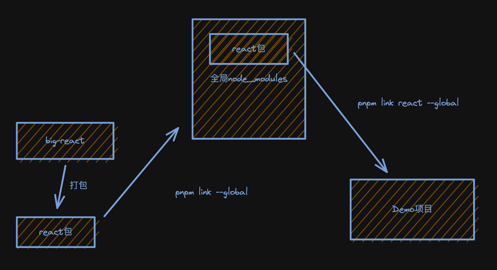

# 一、概述

MonoRepo 是一种将**多个项目**代码存储在**一个仓库** 里的软件开发策略（*简单理解就是：在一个代码仓库中，管理多个不同的项目*），与之相对的是另一种流行的代码管理方式 MultiRepo，即每个项目对应一个单独的仓库来分散管理。


- Multi-repo：每个库有自己独立的仓库，逻辑清晰，相对应的，协同管理会更繁琐。
- Mono-repo：可以很方便的协同管理不同独立的库的生命周期，相对应的，会有更高的操作复杂度。

> 推荐阅读：[现代前端工程为什么越来越离不开 Monorepo?](https://juejin.cn/post/6944877410827370504)

一个简单的monorepo的目录结构类似这样：

```
/projects
.
├── node_modules
├── packages
│   ├── pkg1
│   │   └── package.json
│   ├── pkg2
│   │   └── package.json
├── package.json
└── pnpm-workspace.yaml
```

## 1. 使用monorepo的优劣

monorepo 优势：

1. 便于管理多个互相依赖的项目
2. 便于团队共享知识库
3. 减少项目管理的成本

monorepo 劣势：

1. 版本管理混乱
2. 代码质量参差不齐，且互相影响
3. 技术栈升级困难
4. 难以进行权限管理

> 推荐阅读：[浅尝 Monorepo](https://blog.meathill.com/tech/some-basic-experience-about-monorepo.html)

## 2. 什么时候使用 monorepo？

1. 多个项目互相依赖
2. 功能、版本之间存在强关联
3. 项目中存在多个变异入口，且构建条件存在差异

**次要条件**：

1. 希望在团队中共享知识
2. 降低项目管理的成本

## 3. pnpm 最佳选择

monorepo 技术选型：[pnpm >>](https://pnpm.io/workspaces)

推荐使用 pnpm 管理 Monorepo，因为：

1. 速度快
2. 磁盘占用少
3. 项目依赖彼此独立、隔离
4. 有各种命令方便操作

# 二、实战

接下来，我们将一步一步手把手带你了解如何基于rollup+mono-repo搭建一个自己的工具库集。

## 1. 定义目录结构

① 新建仓库并初始化 *package.json*

```shell
$ mkdir lg-libs && cd lg-libs && pnpm init && code .
```

> 提示
>
> 1. `lg-libs` 为你的monorepo仓库，可自行命名。
> 2. 如果你没有安装 `pnpm`，可通过 npm 安装，指令为：`npm i -g pnpm`

② 指定项目运行的 node/pnpm 版本

为了减少因node或者pnpm版本差异而产生开发环境错误，我们在 package.json 文件中增加 `engines` 字段来限制版本：

```json
{
	"engines": {
		"node": ">=16",
		"pnpm": ">=7"
	}
}
```

④ 安全性设置

为了防止我们的根目录被当作包发布，我们需要在 package.json 加入如下设置：

```json
{
	"private": true
}
```

⑤ 初始化 `pnpm-workspace.yaml`：参考 [这里>>](https://pnpm.io/zh/pnpm-workspace_yaml)

```yaml
packages:
  # all packages in direct subdirs of packages/
  - 'packages/*'
```

> 提示：
>
> 1. 根目录新建 `pnpm-workspace.yaml` 文件，填充上面的内容。
> 2. 根目录新建 `packages` 目录，`packages` 目录下的每一个一级目录为你的一个js库。

[工作空间](https://pnpm.io/zh/workspaces)

## 2. 定义开发规范

### 代码规范检查与修复

代码规范：lint工具（**eslint**）

① 安装：`pnpm i -D -w eslint`

② 初始化配置文件：`npx eslint --init`

```shell
$ npx eslint --init
✔ How would you like to use ESLint? · [problems]
✔ What type of modules does your project use? · [esm]
✔ Which framework does your project use? · [none]
✔ Does your project use TypeScript? · No / [Yes]
✔ Where does your code run? · [browser]
✔ What format do you want your config file to be in? · [JSON]
The config that you've selected requires the following dependencies:

@typescript-eslint/eslint-plugin@latest @typescript-eslint/parser@latest
✔ Would you like to install them now? · No / [Yes]
✔ Which package manager do you want to use? · [pnpm]
Installing @typescript-eslint/eslint-plugin@latest, @typescript-eslint/parser@latest
 ERR_PNPM_ADDING_TO_ROOT  Running this command will add the dependency to the workspace root, which might not be what you want - if you really meant it, make it explicit by running this command again with the -w flag (or --workspace-root). If you don't want to see this warning anymore, you may set the ignore-workspace-root-check setting to true.
```

因为我们使用的是 monorepo，所以自动安装ts相关插件时我们需要输入 `-w`，指令如下：

```shell
$ pnpm i -D -w @typescript-eslint/eslint-plugin@latest @typescript-eslint/parser@latest
```

③ 修改 `.eslintrc.json` 配置如下：

```json
{
  "env": {
    "browser": true,
    "es2021": true,
    "node": true
  },
  "extends": [
    "eslint:recommended",
    "plugin:@typescript-eslint/recommended",
    "prettier",
    "plugin:prettier/recommended"
  ],
  "parser": "@typescript-eslint/parser",
  "parserOptions": {
    "ecmaVersion": "latest",
    "sourceType": "module"
  },
  "plugins": ["@typescript-eslint", "prettier"],
  "rules": {
    "prettier/prettier": "error",
    "no-case-declarations": "off",
    "no-constant-condition": "off",
    "@typescript-eslint/ban-ts-comment": "off"
  }
}
```

> **提示**：更多规则，参考 [这里 >>](https://eslint.cn/docs/rules/)

### 代码风格 prettier

① 安装：`pnpm i -D -w prettier`

② 新建 `.prettierrc.json` 配置文件，添加配置：

```json
{
 "printWidth": 80,
 "tabWidth": 2,
 "useTabs": true,
 "singleQuote": true,
 "semi": true,
 "trailingComma": "none",
 "bracketSpacing": true
}
```

③ 将 `prettier` 集成到 `eslint` 中，其中：

- `eslint-config-prettier`：覆盖 `ESLint` 本身的规则配置
- `eslint-plugin-prettier`：用 `Prettier` 来接管修复代码即 `eslint --fix`

```shell
$ pnpm i -D -w eslint-config-prettier eslint-plugin-prettier
```

④ 为 `lint` 增加对应的执行脚本：

```json
"lint": "eslint --ext .js,.ts,.jsx,.tsx --fix --quiet ./packages"
```

- `--ext`：指定处理的文件类型
- `--fix`：修复问题
- `--quiet`：不输出反馈

同时为了方便，我们可以安装 `prettier` 与 `eslint` 的 VSCode 插件，并在 `setting` 中设置为保存后自动执行。

*设置中搜索 “Editor:Default formatter”，将值设置为 “Prettier - Code formatter”*，

*同时搜索 “Editor:Format On Save”，勾选“在保存时格式化文件”*。

接下来，我们新建一个 `packages/test.js` 文件，并输入如下代码：

``` js
const a = 10
console.log(a)
```

点击保存，可以看到会自动为我们添加分好 “`;`”。

### commit 规范检查（husky）

① 初始化git仓库：

```shell
$ git init 
```

② 根目录新建 `.gitignore` 忽略文件：

```
/node_modules
/dist
```

> 提示：根据需要忽略对应的文件

③ 安装 [husky](https://www.npmjs.com/package/husky)，用于拦截 `commit` 命令

```shell
$ pnpm i -D -w husky 
```

④ 初始化`husky`：

```shell
$ npx husky install
```

⑤ 配置 commit 时对代码风格和规范进行检查

初始化完成之后，将刚才实现的格式化命令 `pnpm lint` 加入到 husky 的 `pre-commit` 钩子里：

```shell
$ npx husky add .husky/pre-commit "pnpm lint"
```

当我们执行完上述的脚本之后，可以在 `.husky` 目录下看到多了一个 `pre-commit` 的shell文件，当我们执行 `commit` 命令的时候，就会执行 `pnpm lint` 去进行代码风格和格式化的检查。

> TODO：pnpm lint 会对代码全量检查，当项目复杂后执行速度可能比较慢，届时可以考虑使用 [lint-staged](https://github.com/okonet/lint-staged)，实现只对暂存区代码进行检查

⑥ 配置 commit 时对提交信息是否规范进行检查

通过 [commitlint](https://github.com/conventional-changelog/commitlint) 对git提交信息进行检查，首先安装必要的库：

```shell
$ pnpm i -D -w commitlint @commitlint/cli @commitlint/config-conventional 
```

新建配置文件 `.commitlintrc.js`：

```js
module.exports = {
  extends: ["@commitlint/config-conventional"]
}; 
```

集成到 `husky` 中：

```shell
$ npx husky add .husky/commit-msg "npx --no-install commitlint -e $HUSKY_GIT_PARAMS"
```

📌 延伸：**`conventional`  规范集意义**

格式：

```
<type>: <subject> → 提交的类型: 摘要信息
```

常用的 `type` 值包括如下:

- feat：添加新功能
- fix：修复 Bug
- chore：一些不影响功能的更改
- docs：专指文档的修改
- perf：性能方面的优化
- refactor：代码重构
- test：添加一些测试代码等等

> 提交时的代码格式：*`git commit -m "feat: xxx"`* 
>
> 注意：`feat: ` 后面跟一个空格。

### 配置 `tsconfig.json`

```json
{
	"compileOnSave": true,
	"compilerOptions": {
		"target": "ESNext",
		"useDefineForClassFields": true,
		"module": "ESNext",
		"lib": ["ESNext", "DOM"],
		"moduleResolution": "Node",
		"strict": true,
		"sourceMap": true,
		"resolveJsonModule": true,
		"isolatedModules": true,
		"esModuleInterop": true,
		"noEmit": true,
		"noUnusedLocals": true,
		"noUnusedParameters": true,
		"noImplicitReturns": false,
		"skipLibCheck": true,
		"baseUrl": "./packages"
	}
}
```

## 3. 配置打包工具·rollup

比较不同打包工具的区别 [参考资料：Overview | Tooling.Report](https://bundlers.tooling.report/)我们要开发的项目的特点：

- 是库，而不是业务项目
- 希望工具尽可能简洁、打包产物可读性高
- 原生支持`ESM`

所以选择 `rollup`，安装：

```shell
$ pnpm i -D -w rollup
```

接着新建 rollup 配置目录：

```shell
$ mkdir -p scripts/rollup
```

所有rollup相关的配置都会放在rollup目录中。

接下来，我们暂时先提交一下代码：

```shell
$ git add . && git commit -m 'feat: 工程化配置初始化'
```

## 4. 新建库（lg-tools）

接下来我们在 packages 目录中新建 `lg-tools` 库。

```shell
$ mkdir -p packages/lg-tools && cd packages/lg-tools
$ pnpm init 
$ touch index.ts
```


# 三、常见问题

解决问题的基本问题：各司其职

1. pnpm 只负责生成依赖目录 `node_modules`
2. 脚手架负责在工作目录内构建开发环境、打包项目
3. lock 文件负责记录依赖版本号
4. `packagejson` 负责记录依赖和脚本


① 需要每个项目文件夹配置单独的入口文件吗❓

答：是的，需要。每个项目文件夹都是独立的项目。

② 怎么安装依赖❓

答：我建议在每个项目文件夹下面执行 `pnpm i `

③ 怎么引用依赖❓

答：该怎么引用就怎么引用

④ 怎么打包？怎么启动开发环境❓

答：对每个项目而言，跟以前一样。对整个项目，你可以自己写脚本。

⑤ 单个项目需要发布到 npm 么❓

答：不需要。对同一个 monorepo 下的项目，它们就相当于已经发布了。

⑥ 怎么处理端口 ❓

答：以前怎么处理，现在还是。workspace 并不会帮你处理端口。

# 四、实战


### `bable.config.js`

```
export default {
  presets: [
    [
      '@babel/preset-env',
      {
        useBuiltIns: 'usage',
        corejs: 3,
        modules: false,
      },
    ],
    '@babel/preset-typescript',
  ],
};
```

> **提示：** **`modules: false`** 可以阻止Babel在Rollup有机会做处理之前，将我们的模块转成 CommonJS ，导致 Rollup 的处理失败。

> 提示：根目录新建 `/scripts/roullup` 目录，用于存储和rollup相关的配置。

# 五、调试方式

### 1. [pnmp link](https://pnpm.io/zh/cli/link)



这种方式的优点：可以模拟实际项目引用 **库** 的情况

缺点：对于开发 **库** 来说，略显繁琐。对于开发过程，更期望的是热更新效果。

### 2. Vite

① 在根目录下创建 Vite 项目

```shell
$ pnpm create vite 
✔ Project name: … examples
✔ Select a framework: › React
✔ Select a variant: › TypeScript
```

# 六、Changesets

① 安装 @changesets/cli

```shell
$ pnpm i -D -w @changesets/cli
```

② 新建 .changeset/config.json 文件

```shell
$ pnpm changeset init
```

③ 创建变更集

使用 `changeset` 命令来创建一个变更集。变更集是一组关于要进行的更改的描述，例如新功能、修复、API 更改等。运行以下命令：

```shell
$ pnpm changeset
```

这将引导您创建一个新的变更集，并询问您关于更改的信息。

④ 发布变更集

一旦您在变更集中记录了一组更改，您可以使用以下命令来生成发布版本：

```shell
$ pnpm changeset version
```

这将根据变更集的内容自动生成适当的版本号，并更新每个包的版本号和依赖关系。

> 提示：默认是 major，如果不选择项，直接回车，则为 minor，同样如果不选择项，直接回车则为patch。

⑤ 发布到npm

最后，您可以运行以下命令来将变更应用到 npm 包并发布它们：

```shell
$ pnpm changeset publish --access public
```

这将执行一系列的操作，包括生成 Changelog、更新版本号、发布到 npm 等。

# 镜像

```markdown
# 官方:
npm config set registry https://registry.npmjs.org/
# 淘宝: 
npm config set registry https://registry.npmmirror.com
```


