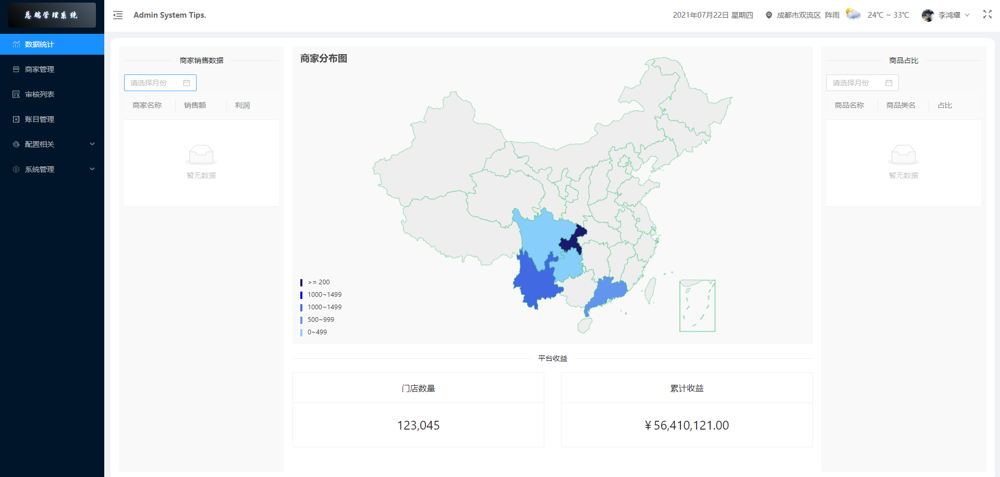
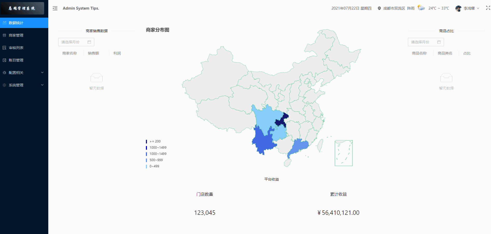
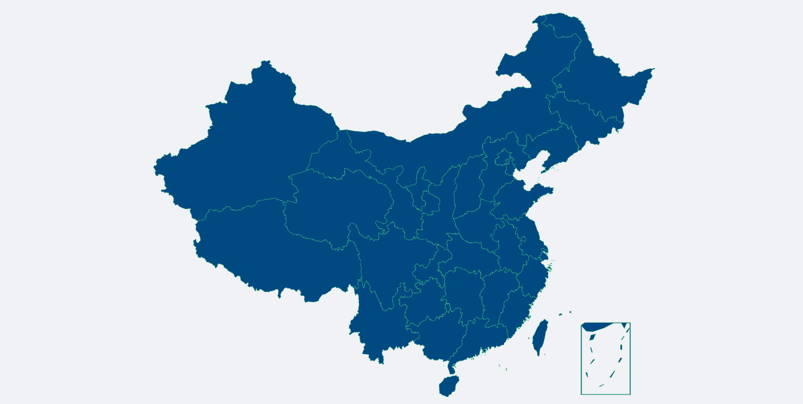

参考：https://www.w3cschool.cn/echarts_tutorial/echarts_tutorial-7pbk2gm8.html

# 前言

最近开发的项目中需要用到 `echarts-map` 展示地理区域数据的可视化，配合visualMap组件用于展示不同地区的商家分布密度等数据。这两天也有朋友在问有没有做过，今天刚好有时间写个简单的教程分享给大家。



截至本文发布，Echarts 最新版本为：`^5.1.2`，从5.0开始，官方已移除了 map-json 文件，所以我从4.9的版本那种克隆了一份下来，需要的小伙伴可以自行下载。

下载链接：https://github.com/LiHongyao/EchartsMapJson

ECharts 中提供了两种格式的地图数据，一种是可以直接 script 标签引入的 js 文件，引入后会自动注册地图名字和数据。还有一种是 JSON 文件，需要通过 AJAX 异步加载后手动注册。*（上述下载链接中两个格式的文件都有）*

由于我这个项目使用的前端框架是umijs（react）+ts，所以我使用的是json文件格式，直接导入即可使用。

# 目标

实现效果：



效果比较简单，就是简单的展示数据，点击中国地图某个省份，可以切换到对应省的地图。

# 准备

我的目录结构大致是这样的（这里只列出关键结构）：

```
.
├── src  # 源码文件
     ├── libs
     ├── pages
          ├── EchartsMap
               ├── index.tsx
```

首先我们将下载的map-json文件放入libs文件夹下，然后安装依赖：

```shell
$ yarn add echarts
```

接下来在 *EchartsMap/index.tsx* 文件中导入相关依赖。

```tsx
import React from 'react';
// 引入echarts
import * as echarts from 'echarts/lib/echarts';
// 引入图形
import 'echarts/lib/chart/map';
import 'echarts/lib/chart/effectScatter';
// 引入组件
import 'echarts/lib/component/tooltip';
import 'echarts/lib/component/title';
import 'echarts/lib/component/visualMap';
import 'echarts/lib/component/geo';
// 中国地图数据
import ChinaGeo from '../../libs/china.json';

const EchartsMap: React.FC = () => {
  return <div className="page"></div>;
};

export default EchartsMap;
```

准备映射文件：

在切换身份地图时，我们需要加载省份地图json数据，所以这里准备了一个映射表，大家可以直接使用。

```js
const kPROVINCES_OBJ = {
  shanghai: '上海',
  hebei: '河北',
  shanxi: '山西',
  neimenggu: '内蒙古',
  liaoning: '辽宁',
  jilin: '吉林',
  heilongjiang: '黑龙江',
  jiangsu: '江苏',
  zhejiang: '浙江',
  anhui: '安徽',
  fujian: '福建',
  jiangxi: '江西',
  shandong: '山东',
  henan: '河南',
  hubei: '河北',
  hunan: '湖南',
  guangdong: '广东',
  guangxi: '广西',
  hainan: '海南',
  sichuan: '四川',
  guizhou: '贵州',
  yunnan: '云南',
  xizang: '西藏',
  shanxi1: '陕西',
  gansu: '甘肃',
  qinghai: '青海',
  ningxia: '宁夏',
  xinjiang: '新疆',
  beijing: '北京',
  tianjin: '天津',
  chongqing: '重庆',
  xianggang: '香港',
  aomen: '澳门',
  taiwan: '台湾',
};
```

# 开始

首先我们创建一个容器，用于承载地图：

```tsx
const EchartsMap: React.FC = () => {
  // refs
  const mapRef = useRef<HTMLDivElement | null>(null);
  return (
    <div className="page">
      <div ref={mapRef} style={{ width: '100%', height: '100%' }} />
    </div>
  );
};

export default EchartsMap;
```

容器尺寸大家可以根据需要设置。

然后我们初始化地图，默认展示中国地图：

```tsx
useEffect(() => {
  if (mapRef.current) {
    const chart = echarts.init(mapRef.current);
    echarts.registerMap('china', ChinaGeo);
    chart.setOption({
      geo: {
        map: 'china',
        zoom: 1,
        roam: false,
        itemStyle: {
          color: '#004981', // 背景色
          borderColor: 'rgb(54,192,118)', // 边框颜色
        },
      },
    });
  }
}, []);
```

此时，一个中国地图就展示出来啦。



接下来，我们实现点击中国地图切换省份展示的效果，首先，我们封装两个方法：

```tsx
// 判断当前要加载的地图是不是省？
let isProvince = (name: string) => {
    return Object.values(kPROVINCES_OBJ).some((province) => {
   		return province === name;
    });
};
// 定义方法加载某个省的地图文件
let loadScriptMap = (name: string, callback: Function) => {
    // 获取映射表中的拼音
    let pinyinName = Object.keys(kPROVINCES_OBJ)[Object.values(kPROVINCES_OBJ).indexOf(name)];
    // 导入对应的省份地图文件
    let currentMap = require(`../../libs/province/${pinyinName}.json`);
    // 回调
    callback(name, currentMap);
};
```

然后给chart添加点击事件：

```tsx
chart.on('click', (ev: any) => {
  // 如果点击的是一个省，那就切换到这个省的地图
  if (isProvince(ev.name)) {
    // 从外部加载这个省的地图文件
    loadScriptMap(ev.name, (name: string, data: any) => {
      echarts.registerMap(name, data);
      chart.setOption({
        geo: {
          map: name,
        },
      });
    });
  } else {
    // 否则切换回中国地图
    echarts.registerMap('china', ChinaGeo);
    chart.setOption({
      geo: {
        map: 'china',
      },
    });
  }
});
```

到这一步，我们就实现了在中国地图上点击省份进入省地图，点击省地图进入中国地图的需求了。

有了地图之后，我们来展示数据吧，让我们的地图更加完善一些，修改初始化echarts时的配置项。

```tsx
chart.setOption({
  // 配置标题
  title: {
    text: '商家分布图',
    left: 'left',
  },
  // 提示
  tooltip: {
    triggerOn: 'mousemove',
    backgroundColor: '#fff',
    extraCssText: 'box-shadow: 0px 0px 10px 0px rgba(0,0,0,0.15);',
    padding: [12, 16, 12, 16],
    textStyle: {
      color: 'rgba(0,0,0,0.65)',
    },
    formatter: '{b} <br /> {a}：{c}',
  },
  // 分布密度
  visualMap: [
    {
      itemWidth: 4,
      min: 0,
      max: 10000,
      hoverLink: false,
      showLabel: true,
      pieces: [
        {
          min: 0,
          max: 499,
          color: '#87CEFA',
          label: '0~499',
        },
        {
          min: 500,
          max: 999,
          color: '#6495ED',
          label: '500~999',
        },
        {
          min: 1000,
          max: 1499,
          color: '#4169E1',
          label: '1000~1499',
        },
        {
          min: 1500,
          max: 1999,
          color: '#0000CD',
          label: '1000~1499',
        },
        {
          min: 2000,
          color: '#191970',
          label: '>= 200',
        },
      ],
    },
  ],
  // 地图配置
  geo: {
    map: 'china',
    zoom: 1.2,
    roam: false,
    itemStyle: {
      // color: '#004981', // 背景色
      borderColor: 'rgb(54,192,118)', // 边框颜色
    },
  },
  // 数据
  series: [
    {
      type: 'map',
      name: '商家数量',
      geoIndex: 0,
      data,
    },
  ],
});
```

> 其中，data为ajax请求之后的数据，格式为：`{name: string; value: number}`
