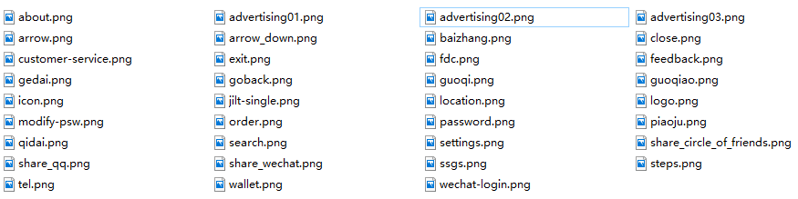
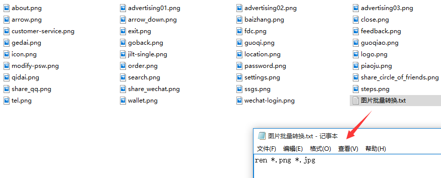
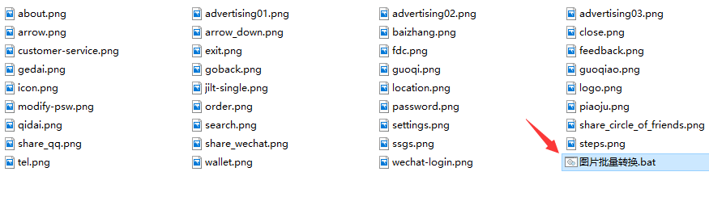
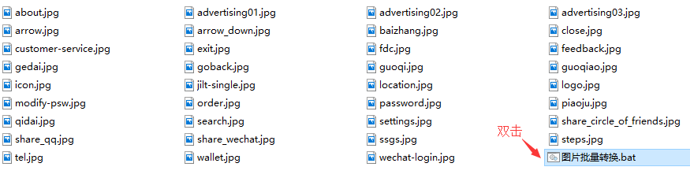

# 一、说明

有时我们需要将png格式批量转换为jpg格式，那应该怎么处理呢？如果你有10000张图片，总不可能一张一张的修改后缀吧？这里给大家安利一个批量转换图片格式的技巧。

# 二、步骤

1. 将需要转化的 png 格式的图片放在一个文件夹中，需要注意的是只能放 png 格式的图片：



2. 然后在该文件夹中新建一个记事本文件，可以将名称命名为 **图片批量转化**，然后在记事本中输入：

   ```
   ren *.png *.jpg
   ```

   并保存。这里需要注意，两个 ”*“号 之前必须要有空格。



3. 修改记事本后缀名修改为 “bat”：



4. 最后双击 “.bat” 文件就可以将 png 批量转换成 jpg 格式，如下所示：

