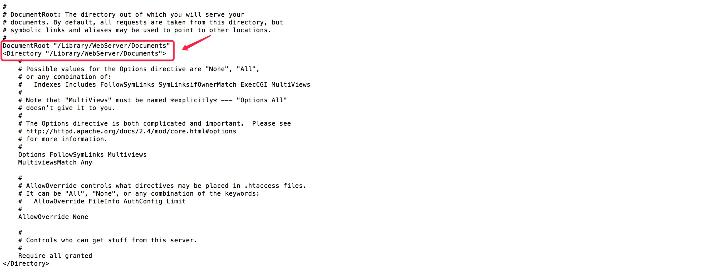

# # 概述

有的时候，我们需要在内网工作组中分享一些文件或是后台接口没有及时给出，你又想要模拟真实数据，直接在项目里创建plist也可以做到这种需求，但难免让工程变得冗余且看起来比较Low。这个时候就看出配置本地服务器的重要性了，不用时刻等着后台接口的更新，只需要根据接口文档自己模拟真实数据，即方便又显得高大上。

Mac自带了Apache环境/

# # 安装

```shell
$ brew install apache2
```

查看版本：

```shell
$ apachectl -v
Server version: Apache/2.4.34 (Unix)
Server built:   Jul 14 2018 08:30:56
```

系统版本：

```shell
$ sw_vers
ProductName:	Mac OS X
ProductVersion:	10.12.6
BuildVersion:	16G1408
```

# # 启动

```shell
$ apachectl start
```

浏览器地址栏输入： 127.0.0.1 或 ”http://localhost“ 提示 ”It works!“

当前访问的是Apache的默认目录，“/Library/WebServer/Documents/”你只需要将你的项目拖至该目录，即可访问。

Mac OS X 中默认有两个目录可以直接运行你的 Web 程序，一个是系统级的 Web 根目录，一个是用户级的根目录。

系统级的根目录是：/Library/WebServer/Documents/

用户级的根目录(也是站点目录)是：~/Sites

# # 站点

## 1. 创建站点目录

在用户目录下创建站点：

```shell
$ mkdir ~/Sites
```

编辑 username.conf 文件：

```shell
$ vi /etc/apache2/users/username.conf
```

> 注意：username 为你的用户名

按`i`进入编辑模式，写入如下内容：

```
<Directory "/Users/username/Sites/">
   Options Indexes MultiViews
   AllowOverride All
   Order allow,deny
   Allow from all
</Directory>
```

> 注意：username 为你的用户名

按 `ESC` 退出编辑模式，输入 `:wq` 保存退出。

设置访问权限：

```shell
$ sudo chown root:wheel /etc/apache2/users/你的用户名.conf
```

## 2. 配置 httpd.conf

进入apache2目录

```shell
$ cd /etc/apache2/
```

备份配置文件

```shell
$ cp httpd.conf httpd.conf.bak
```

> 提示：如果操作失误，可通过指令：`$ cp httpd.conf.bak httpd.conf`  还原。

编辑配置文件

```shell
$ vi httpd.conf
```

`shift + :` 进入搜索模式，输入 “/DocumentRoot”,



将里面的路径设置为访问路径：“/Users/你的用户名/Sites”

然后找到“Options FollowSymLinks Multiviews ”，添加一个单词 `Indexes`，如下所示：

```shell
Options Indexes FollowSymLinks Multiviews
```

然后找到如下信息，将前面的注释 `#` 全部去掉：

```
LoadModule php5_module libexec/apache2/libphp5.so
LoadModule authz_core_module libexec/apache2/mod_authz_core.so
LoadModule authz_host_module libexec/apache2/mod_authz_host.so
LoadModule userdir_module libexec/apache2/mod_userdir.so
Include /private/etc/apache2/extra/httpd-userdir.conf
```

找到如下信息：

```
<Directory />
    AllowOverride none
    Require all denied
</Directory>
```

将其修改为：

```
<Directory />
    AllowOverride none
    Require all granted
</Directory>
```

修改/etc/apache2/extra/httpd-userdir.conf

```shell
$ vi /etc/apache2/extra/httpd-userdir.conf
```

找到 “Include /private/etc/apache2/users/*.conf” 将其前面的`#`去掉。

最后切换工作目录：

```shell
$ cd /etc
```

拷贝 “php.ini”

```shell
R sudo cp php.ini.default php.ini
```

重启服务：

```shell
$ apachectl restart
AH00557: httpd: apr_sockaddr_info_get() failed for lihongyaodeMacBook-Pro.local
AH00558: httpd: Could not reliably determine the server's fully qualified domain name, using 127.0.0.1. Set the 'ServerName' directive globally to suppress this message
```

> 提示：如果出现以上警告，无需理会。

输入：http://localhost/~username/ 访问

# # 异常

## 1. Swap file ".httpd.conf.swp" already exists!

解决方案，终端输入：

```shell
$ rm -rf .httpd.conf.swp 
```