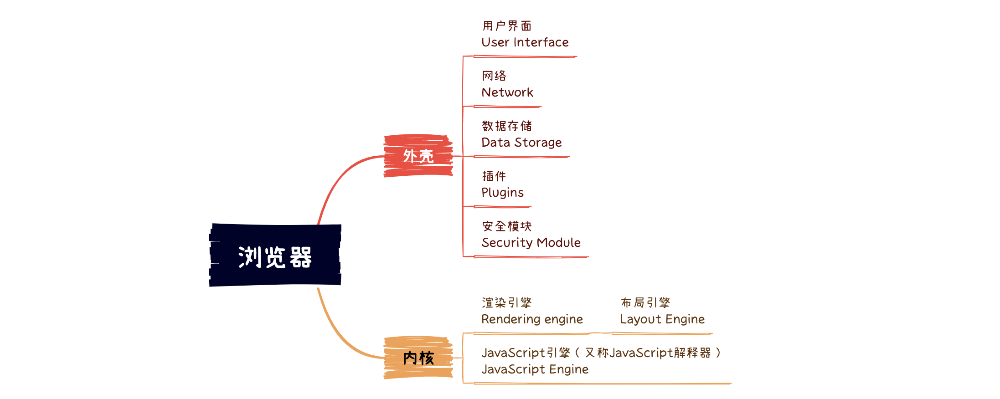
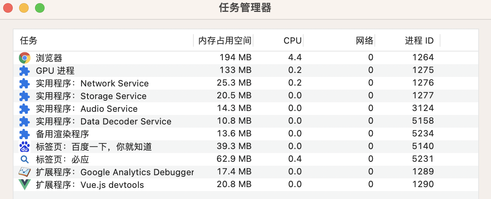

参考：https://developer.aliyun.com/article/900670

#　一、概述

开始之前，我们先来简单聊聊浏览器的组成：

- **用户界面**：包括地址栏，前进/后退/刷新/书签菜单等等。
- **网络**：用来完成 <u>网络调用</u> 或 <u>资源下载</u> 的模块。
- **UI 后端**：UI后端提供绘图和窗口原语，包括：用户界面控件集合、字体集合。
- **浏览器引擎**：可在用户界面和渲染引擎之间<u>传送指令</u>或在客户端本地缓存中<u>读写数据</u>等，是浏览器中各个部分之间相互<u>通信的核心</u>。
- **数据持久层**：浏览器在硬盘中保存 cookie、localStorage等各种数据，可通过浏览器引擎提供的API进行调用。
- **渲染引擎**：用来 <u>绘制</u> 请求的内容。（*我们常说的浏览器内核主要指的就是渲染引擎*）
- **JS 引擎**：用来 <u>解析执行</u> JavaScript <u>代码</u>。（*如 V8 引擎、JavaScriptCore*）

*提示：与大多数浏览器不同的是，谷歌（Chrome）浏览器的每个标签页都分别对应一个呈现引擎实例。每个标签页都是一个独立的进程。*

# 二、浏览器架构

## 1. 进程与线程

Chrome 打开一个页面会启动4个进程：浏览器主进程、GPU进程、网络进程和渲染进程。

一个进程就是一个程序的运行实例，启动一个程序的时候，操作系统会为该程序创建一块内存，用来存放代码、运行中的数据和一个执行任务的主线程，这样一个运行环境叫进程。

线程是依附于进程的，而进程中使用多线程并行处理能提升运算效率。

进程和线程之间的关系有以下 4 个特点：

（1）进程中的任意一线程执行出错，都会导致整个进程的崩溃。

（2）线程之间共享进程中的数据。

（3）当一个进程关闭之后，操作系统会回收进程所占用的内存。

（4）进程之间的内容相互隔离。

## 2. 进程架构

最新的 Chrome 浏览器包括：1 个浏览器（Browser）主进程、1 个 GPU 进程、1 个网络（NetWork）进程、多个渲染进程和多个插件进程，如下图所示：

# 三、渲染进程 📌

**浏览器的渲染进程是多线程的**，那么接下来看看它都包含了哪些线程（列举一些主要常驻线程）：

*提示：页面的渲染，JS的执行，事件的循环，都在这个进程内进行。*

## 1. GUI渲染线程

处理HTML、CSS 及渲染页面：

- 负责渲染浏览器界面，解析HTML，CSS，构建DOM树和CSS规则树，布局和绘制等。

- 当界面需要重绘或重排（*很多时候我们也称之为回流*）时，该线程就会执行。

## 2. JS 引擎线程

解析、执行JS代码：

- 负责处理 Javascript 脚本程序，解析 Javascript 脚本，运行代码。（*例如V8引擎*）

- JS 引擎一直等待着任务队列中任务的到来，然后加以处理，渲染进程中无论什么时候都只有一个JS引擎线程在运行JS程序。

## 3. 事件触发线程

处理JS事件：

- 事件触发线程归属于浏览器而不是JS引擎（*JS引擎自己都忙不过来，需要浏览器另开线程协助*），用来控制事件循环（*event-loop*）。

> 事件循环（*event-loop*）：
>
> 当JS引擎执行代码块（*如事件绑定*）时，会将事件函数添加到事件触发线程中，当对应的事件符合触发条件被触发时，事件触发线程就会把事件函数添加到待处理队列的队尾，等待JS引擎的处理。
>
> 流程：js引擎线程 → 事件触发线程 → 任务队列/事件队列 → js引擎线程

## 4. 定时器触发线程

- 所谓定时器触发线程即 `setInterval` 和 `setTimeout` 所在的线程。

- 浏览器定时计数器并不是由 JavaScript 引擎计数的，而是通过单独线程来计时的（*计时完毕后，将其添加到任务队列（事件队列）中，等待JS引擎空闲后执行*）

- `setTimeout` 和 `setInterval` 的运行机制是，将指定的代码移出本次执行，等到下一轮事件循环时，再检查是否到了指定时间。如果到了，就执行对应的代码；如果未到，就等到再下一轮事件循环时重新判断。这意味着，`setTimeout` 指定的代码，必须等到本次执行的所有代码都执行完，才会执行。

> 注意：W3C在HTML标准中规定，规定要求 `setTimeout` 中低于 4ms 的时间间隔算为 4ms。

## 5. 异步http请求线程

- 在XMLHttpRequest连接后通过浏览器新开一个线程请求。

- 当检测到状态变更时，如果设置有回调函数，异步线程就***\*产生状态变更事件\****，将这个回调再放入任务队列（事件队列）中。再由JavaScript引擎执行。

> **注意 ⚠️**：
>
> 1）由于JS引擎是单线程关系，所以这些任务队列（事件队列）中待处理的事件都得排队等待JS引擎处理（*当JS引擎空闲时才会去执行*），所以对于定时器之类的定时有可能就不准确。
>
> 2）**GUI渲染线程与JS引擎线程是互斥的**，当JS引擎执行时GUI线程会被挂起（*相当于被冻结了*），GUI更新会被保存在**任务队列**中等到JS引擎空闲时立即被执行。所以如果JS执行的时间过长，这样就会造成页面的渲染不连贯，导致页面渲染加载阻塞。

# 四、网络协议

## 1. TCP 协议

在衡量 Web 页面性能时有一个重要的指标FP（**F**irst **P**aint），它是指从页面加载到首次开始绘制的时长。而影响 FP 指标的一个重要因素就是网络加载速度。

互联网，实际上是一套理念和协议组成的体系架构。互联网中的数据是通过数据包来传输的。

- IP：把数据包送达目的主机
- UDP：把数据包送达应用程序
- TCP：把数据完整地送达应用程序

## 2. HTTP 协议

HTTP 是一种允许浏览器向服务器获取资源的协议，是 Web 的基础。

**📌 浏览器端发起 HTTP 请求流程**：

（1）构建请求，构建好后，浏览器准备发起网络请求

（2）查找缓存，当浏览器发现请求的资源已经在浏览器缓存中存有副本，它会拦截请求，返回该资源的副本，并直接结束请求。

（3）准备 IP 地址和端口，HTTP 的内容是通过 TCP 来传输的，第一步就是先建立TCP连接，而请求 DNS（DNS数据缓存服务） 可返回域名对应的 IP。

（4）等待 TCP 队列，同一个域名同时最多只能建立 6 个 TCP 连接，如果同时有 10 个请求发生，那么其中 4 个会进入等待状态。

（5）建立 TCP 连接，快乐地和服务器握手。

（6）发送 HTTP 请求，和服务器进行通信，向服务器发送请求行，包括请求方法、请求 URI（**U**niform **R**esource **I**dentifier）和 HTTP 版本协议。

**📌 服务器端处理 HTTP 请求流程：**

（1）返回请求，一旦服务器处理结束，便可以返回响应行，包括协议版本和状态码。

（2）断开连接，如果浏览器或者服务器在其头信息中加入了：*Connection:Keep-Alive*，那么 TCP 连接在发送后将仍然保持打开状态。

（3）重定向，当两个 URL 不一样时，会涉及一个重定向操作

为什么很多站点第二次打开速度会很快？因为 DNS 缓存和页面资源缓存这两块数据是会被浏览器缓存的。

登录状态是如何保持的？浏览器页面状态是通过使用 Cookie 来实现的。如果服务器端发送的响应头内有 Set-Cookie 的字段，那么浏览器就会将该字段的内容保存到本地。

下面是张详细的“HTTP 请求示意图”，用来展现浏览器中的 HTTP 请求所经历的各个阶段。

浏览器中的 HTTP 请求从发起到结束一共经历了八个阶段：构建请求、查找缓存、准备 IP 和端口、等待 TCP 队列、建立 TCP 连接、发起 HTTP 请求、服务器处理请求、服务器返回请求和断开连接。

# 五、导航流程

在浏览器里，从输入 URL 到页面展示，这中间发生了什么？其中涉及到了网络、操作系统、Web 等一系列的知识，如下图所示。

整个流程大致描述如下：

1. 首先，浏览器进程接收到用户输入的 URL 请求，浏览器进程便将该 URL 转发给网络进程。

2. 然后，在网络进程中发起真正的 URL 请求。

3. 接着，网络进程接收到了响应头数据，便解析响应头数据，并将数据转发给浏览器进程。

4. 浏览器进程接收到网络进程的响应头数据之后，发送  “**提交文档** ” 消息到渲染进程；

5. 渲染进程接收到 “**提交文档**” 的消息之后，会和网络进程建立传输数据的 “管道”，开始准备接收 HTML 数据；

6. 等文档数据传输完成之后，渲染进程会返回 “**确认提交**” 的消息给浏览器进程；*这是告诉浏览器进程：“已经准备好接收和解析页面数据了”。*

7. 浏览器进程接收到渲染进程 “**确认提交**” 的消息之后，便开始移除之前旧的文档，然后更新浏览器进程中的页面状态。

*提示：这其中，用户发出 URL 请求到页面开始解析的这个过程，就叫做导航。*

## 1. 用户输入

当用户在地址栏中输入一个查询关键字时，地址栏会判断输入的关键字是搜索内容，还是请求的 URL。

如果输入的是关键字， 会使用默认配置的搜索引擎来查询，如果是请求的URL，则会进入URL请求流程。

当用户输入关键字并键入回车之后，这意味着当前页面即将要被替换成新的页面，不过在这个流程继续之前，浏览器还给了当前页面一次执行 *`beforeunload`* 事件的机会。

*`beforeunload`* 事件允许页面在退出之前执行一些数据清理操作，还可以询问用户是否要离开当前页面，比如当前页面可能有未提交完成的表单等情况，因此用户可以通过 *`beforeunload`* 事件来取消导航，让浏览器不再执行任何后续工作。

## 2. URL 请求过程

浏览器进程会通过进程间通信（IPC）把 URL 请求发送至网络进程，网络进程接收到 URL 请求后，会在这里发起真正的 URL 请求流程。

*（参考上面的HTTP请求流程）*

## 3. 准备渲染进程

Chrome 会为每个页面分配一个渲染进程，也就是说，每打开一个新页面就会配套创建一个新的渲染进程。

但如果属于同一站点，即根域名和协议都相同，那么新页面会复用父页面的渲染进程。

官方把这个默认策略叫：process-per-site-instance。

## 4. 提交文档

提交文档，就是指浏览器进程将网络进程接收到的 HTML 数据提交给渲染进程，具体流程是这样的：

（1）首先当浏览器进程接收到网络进程的响应头数据之后，便向渲染进程发起 “提交文档” 的消息；

（2）渲染进程接收到 “提交文档” 的消息后，会和网络进程建立传输数据的 “管道”；

（3）等文档数据传输完成之后，渲染进程会返回 “确认提交” 的消息给浏览器进程；

（4）浏览器进程在收到 “确认提交” 的消息后，会更新浏览器界面状态，包括了安全状态、地址栏的 URL、前进后退的历史状态，并更新 Web 页面。

## 5. 渲染阶段

一旦文档被提交，渲染进程便开始页面解析和子资源加载。

一旦页面生成完成，渲染进程会发送一个消息给浏览器进程，浏览器接收到消息后，会停止标签图标上的加载动画。

# 六、渲染流程

按照渲染的时间顺序，流水线可分为如下几个子阶段：构建 DOM 树、样式计算、布局阶段、分层、绘制、分块、光栅化和合成。

客户端在接收服务器传输过来的文件之后，便由浏览器的引擎开始解析文件并在屏幕中渲染出来，其步骤主要如下：

（1）构建DOM树：渲染进程将 HTML 内容转换为能够读懂的 DOM 树结构。

（2）样式计算：渲染引擎将 CSS 样式表转化为浏览器可以理解的 styleSheets，计算出 DOM 节点的样式。

（3）布局阶段：创建布局树，并计算元素的布局信息。

（4）分层：对布局树进行分层，并生成分层树。

（5）绘制：为每个图层生成绘制列表，并将其提交到合成线程。

（6）分块-光栅化：合成线程将图层分成图块，并在光栅化线程池中将图块转换成位图。

（7）合成：合成线程发送绘制图块命令 DrawQuad 给浏览器进程。

（8）显示：浏览器进程根据 DrawQuad 消息生成页面，并显示到显示器上。

*提示：渲染引擎会通过合成线程直接去处理变换，这些变换并没有涉及到主线程，这样就大大提升了渲染的效率。这也是 CSS 动画比 JavaScript 动画高效的原因。*

# 七、重排与重绘

> **📌 重排：更新元素的几何属性**

从上图可以看出，如果你通过 JavaScript 或者 CSS 修改元素的几何位置属性，例如改变元素的宽度、高度等，那么浏览器会触发重新布局，解析之后的一系列子阶段，这个过程就叫重排。

无疑，重排需要更新完整的渲染流水线，所以开销也是最大的。

> **📌 重绘：更新元素的绘制属性**

从图中可以看出，如果修改了元素的背景颜色，那么布局阶段将不会被执行，因为并没有引起几何位置的变换，所以就直接进入了绘制阶段，然后执行之后的一系列子阶段，这个过程就叫重绘。

相较于重排操作，重绘省去了布局和分层阶段，所以执行效率会比重排操作要高一些。

> 提示：回流的成本要比重绘高得多，所以在实际开发过程中，我们应尽量避免回流的发生，因为DOM树里的每个结点都会有reflow方法，一个结点的reflow很有可能导致子结点，甚至父点以及同级结点的reflow。

# 八、扩展

**1. load 事件与 DOMContentLoaded 事件的先后?**

上面提到，渲染完毕后会触发 load 事件，那么你能分清楚load 事件与 DOMContentLoaded 事件的先后么？

(1) Load 事件触发代表页面中的 DOM，CSS，JS，图片已经全部加载完毕。

(2) DOMContentLoaded 事件触发代表初始的 HTML 被完全加载和解析，不需要等待 CSS，JS，图片加载

所以，顺序是：DOMContentLoaded → load

**2. CSS加载是否会阻塞dom树渲染？**

这里说的是头部通过 `<link />` 标签引入 CSS 的情况

首先，我们都知道：**CSS 是由单独的下载线程异步下载的。**

然后再说下几个现象：

①　CSS加载不会阻塞DOM树解析（异步加载时DOM照常构建）

②　但会阻塞 render树渲染（渲染时需等css加载完毕，因为render树需要CSS信息）

这可能也是浏览器的一种优化机制。因为你加载css的时候，可能会修改下面DOM节点的样式，如果css加载不阻塞render树渲染的话，那么当css加载完之后，render树可能又得重新重绘或者回流了，这就造成了一些没有必要的损耗。所以干脆就先把DOM树的结构先解析完，把可以做的工作做完，然后等你css加载完之后，在根据最终的样式来渲染render树，这种做法性能方面确实会比较好一点。

**3. 一个网页执行的完整过程**

结合浏览器的各进程线程，总结下一个网页执行的完整过程，及其步骤：

(1) 浏览器主进程发起请求，下载网页

(2) 浏览器主进程把网页传给渲染进程

(3) 渲染进程进行处理

  - 使用GUI线程处理和解析HTML+CSS

  - 在解析html时遇到了js时的处理：如果在解析html时遇到了js，那么就是使用js引擎线程进行解析执行

    并且js引擎线程和gui线程是互斥的。具体执行过程如下：

    a . EventLoop事件循环

    b . 宏任务和微任务

    c . load事件与DOMContentLoaded

（4）GPU线程绘制

（5）主进程进行显示

**4. HTML → DOM**

HTML 首先经过Tokenniser标记化，通过词法分析将输入的html内容解析成多个标记，根据识别后的标记进行DOM树构造，在DOM树构造过程中会创建document对象，然后以document为根节点的DOM树不断进行修改，向其中添加各种元素。HTML代码中往往会引入一些额外的资源，比如css、脚本及图片等，当遇到脚本时，就会停止HTML解析进而去解析脚本和执行（因为脚本可能会修改HTML结构,导致之前的解析没有意义，所以会停止解析）。

# 九、总结

1. 进程和线程的基本概念

2. 浏览器是多进程的，主要含有的进程有哪些【大致4个】？

3. 浏览器多进程的优势？

4. 渲染进程里可以干什么？

5. 渲染进程主要有哪些线程【5个】，其作用分别是什么？

6. GUI渲染线程与JS引擎线程的关系？

7. 浏览器主进程 和 浏览器内核进程 的通信

8. load事件与DOMContentLoaded事件的区别？

9. css加载是否会阻塞dom树渲染？渲染树呢？

10. 宏任务和微任务

11. 什么叫Event loop(事件循环)

12. 结合浏览器的各进程线程，总结下一个网页执行的完整过程，及其步骤

