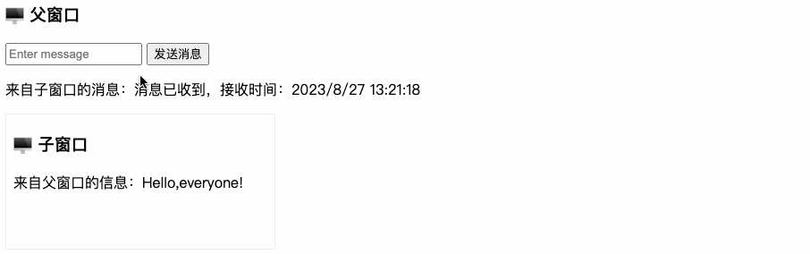

# 一、前言

最近入职新公司，一到岗大佬就让我拉git仓库（一看有4个，吓我一跳），由于历史原因，之前有两个项目是独立的，后面开发新项目需要整合集成之前的两个项目，再加上其中有个功能是ppt制作的页面，客户端和后台管理系统都需要访问它，为了方便，ppt相关的逻辑也单独抽离成一个项目了，因此，集成采用的方案就是iframe嵌套，既然使用iframe，那必然就会涉及到通信以及一些权限的问题，比如token如何传递？主窗口和子窗口之间如何交互？当子窗口需要浏览器授权时又当如何处理？等等等....

本篇文章主要总结在项目开发中遇到的有关iframe的问题，不定期更新完善。

# 二、前置知识

在开始之前，我们需要了解一些前置知识。

## 1. 同源策略

浏览器的同源策略（**S**ame-**O**rigin **P**olicy，**SOP**）是一种安全机制，用于保护用户的隐私和安全，防止恶意网站通过脚本等方式访问其他域名下的数据。同源策略要求网页的源*（即协议、域名和端口）*必须完全一致，才允许在不同页面之间共享数据。这个机制有助于防止跨站点脚本攻击（Cross-Site Scripting，XSS）和跨站点请求伪造（**C**ross-**S**ite **R**equest **F**orgery，**CSRF**）等安全问题。

同源策略的基本规则如下：

1. 协议：页面间的协议必须相同。例如，一个使用 HTTP 的页面不能直接访问使用 HTTPS 的页面中的数据。

2. 域名：页面间的域名必须相同，意味着子域名不同也被认为不同源。例如：`example.com` 和 `sub.example.com` 是不同的源。

3. 端口：如果指定了端口号，页面间的端口号必须相同。例如，使用 80 端口和使用 8080 端口的页面被视为不同源。

需要注意的是，同源策略由浏览器执行，而非服务器实施。这意味着即使服务器上的资源被配置为允许跨域访问，浏览器仍会根据同源策略限制页面中的脚本和请求。

为了在同源策略的限制下实现跨域访问，常见的方法包括：

1. JSONP（**JSON** with **P**adding）：通过在页面中插入`<script>`标签获取其他域上的数据，充分利用浏览器对`<script>`标签跨域访问的特性。
2. 跨域资源共享（CORS）：务器可以通过在响应头中添加特定的CORS头来明确指示哪些源可以访问资源。浏览器根据这些头部来决定是否允许访问。
3. 代理：在同一域名下创建一个代理服务器，用于转发对其他域的请求。通过访问同一域名下的代理，可以绕过同源策略的限制。
4. HTML5的postMessage API：用于在不同窗口（如iframe和弹出窗口）之间安全地传递消息，适用于特定的场景。

> 本文主要讨论基于`postMessage API`在不同窗口间实现通信。

## 2. Web通信

Web通信（Web messaging）是一种安全的数据分享机制，用于在不同文档的浏览上下文间交流。通过这种机制，不同窗口、标签页、iframe或不同域名下的网页可以安全地传递消息和数据，以实现更丰富的交互体验。这种机制确保了DOM不会受到恶意跨域脚本的威胁。

在谈论Web通信时，实际上谈论的是两个略有不同的系统：

- **跨文档通信（cross-document messaging）** —— *适用于当前项目需求*

  跨文档通信指的是在同一页面内的不同文档（如不同的iframe或弹出窗口）之间进行通信。由于同源策略的限制，跨文档通信需要采用特定的方法。

  在国内，更常见的跨文档通信方式是使用HTML5中的 `window.postMessage()`

- **通道通信（channel messaging）**

  通道通信是通过 `MessageChannel` 接口实现的一种通信方式。它允许在不同上下文之间建立双向通信通道，用于传递消息和数据。

> 随着 Server-Sent 事件以及[WebSocket](https://developer.mozilla.org/zh-CN/docs/Web/API/WebSocket)，跨文档通信和通道通信成为HTML5通信接口的有益组成部分。

## 3. 通信事件

在探讨Web通信时，需要先了解 **message** 事件对象。这是因为无论是跨文档通信、通道通信、服务器发送事件还是网络套接字，都涉及到处理 `message` 事件。因此，理解 `message` 事件对象对于有效处理通信是很重要的。

`message` 事件的定义可以参考[这里 >>](https://developer.mozilla.org/zh-CN/docs/Web/API/MessageEvent)，该事件包含以下五个只读属性：

1. `data`：包含在 `MessageEvent` 中的数据，可以是任何数据类型。如果未指定，则默认为null，由发送方的原始脚本提供。
2. `origin`：表示消息发送源，包含域名和端口，如：http://domain.example:80，如果未指定，则默认为空字符串。
3. `lastEventId`：表示事件的唯一ID。如果未指定，则默认为空字符串。
4. `source`：表示消息发送对象，可以是`WindowProxy`、[`MessagePort`](https://developer.mozilla.org/zh-CN/docs/Web/API/MessagePort)或[`ServiceWorker`](https://developer.mozilla.org/zh-CN/docs/Web/API/ServiceWorker)对象。如果未设置，则默认为null。
5. `ports`：一个包含[`MessagePort`](https://developer.mozilla.org/zh-CN/docs/Web/API/MessagePort)对象的数组，表示正在通过消息通道传输的与消息关联的端口。

> 提示：
>
> - 在跨文档通信和通道通信中，`lastEventId`的值通常为空字符串；`lastEventId`在服务器发送事件中使用。如果发送的消息没有`ports`，那么`ports`属性的值将是一个长度为0的数组。
> - `MessageEvent` 继承自DOM事件接口，并共享其属性。然而，通信事件不冒泡，不能取消，也没有默认行为。

# 三、通信方式

## 1. Query参数

在指定iframe.src属性时，可以在子页面的URL中添加Query参数，例如：

```html
https://examples.com?id=1
```

在子页面中，可以通过 `location.search` 读取：

```js
location.search → ?id=1
```

## 2. 锚点（Hash）

在指定iframe.src属性时，可以在子页面的URL中添加锚点，例如：

```html
https://examples.com#1
```

在子页面中，可以通过 `location.hash` 读取：

```js
location.hash → #1
```

## 3. postMessage *

### 3.1. APIs

#### 发送数据

发送数据的核心js代码如下：

```javascript
otherWindow.postMessage(message, targetOrigin, [transfer]);
```

- `otherWindow`：表示其他窗口的引用，例如`<iframe>`的**`contentWindow`**属性、通过[window.open](https://developer.mozilla.org/en-US/docs/Web/API/Window/open)打开的窗口对象，或者通过命名或数字索引的[window.frames](https://developer.mozilla.org/en-US/docs/Web/API/Window/frames)。
- `message`：要发送到其他窗口的数据。
- `targetOrigin`：通过窗口的`origin`属性指定哪些窗口可以接收到消息事件。值可以是字符串"\*"（表示无限制）或一个URI。在发送消息时，如果目标窗口的协议、主机名或端口号的任何一项不匹配 `targetOrigin` 提供的值，消息将不会被发送。只有三者完全匹配，消息才会被发送。这个机制用于控制消息可以发送到哪些窗口。例如，当使用postMessage传送密码时，`targetOrigin` 参数尤为重要，必须确保其值与预期接收方的 `origin` 属性完全一致，以防止密码被恶意第三方截获。**如果确切知道消息应发送到哪个窗口，请始终提供确切的`targetOrigin`，而不是"*"。不提供确切目标将导致数据泄漏到任何对数据感兴趣的恶意站点。**
- `transfer`（可选）：一系列与消息同时传递的**Transferable**对象，这些对象的所有权将转移给消息的接收方，而发送方将不再拥有所有权。

> 提示：兼容性 → 参考 [这里（CanIUse） >>](https://caniuse.com/?search=postmessage)

#### 接收数据

```js
window.addEventListener("message", receiveMessage, false) ;
function receiveMessage(event) {
     var origin= event.origin;
     console.log(event);
}
```

### 3.2. 示例

在进行跨文档消息发送之前，我们需要先创建新的iframe或新的窗口以创建新的Web浏览上下文。

```shell
$ mkdir project-1 project-2 && touch project-1/index.html project-2/index.html
```

**`project-1/index.html`**

```html
<!DOCTYPE html>
<html lang="zh-CN">

<head>
  <meta charset="UTF-8">
  <meta name="viewport" content="width=device-width, initial-scale=1.0">
  <title>Project 1</title>
</head>

<body>
  <header style="margin-bottom: 16px;">
    <h3>🖥 父窗口</h3>
    <input type="text" style="height: 19px;" placeholder="Enter message" />
    <button type="button" class="send">发送消息</button>
    <p>来自子窗口的消息：<span id="message"></span></p>
  </header>

  <iframe style="border: 1px solid #eee;" src="http://localhost:5501/index.html"></iframe>

  <script>

    const ifr = document.querySelector("iframe");
    const sendBtn = document.querySelector("button.send");
    const msgInput = document.querySelector("input")
    const msgSpan = document.querySelector("#message");

    // 1. 发送消息给子窗口
    sendBtn.addEventListener("click", function () {
      const postData = msgInput.value;
      ifr.contentWindow.postMessage(postData, '*');
    }, false);
    // 2. 接收子窗口发送的消息
    window.addEventListener('message', function (message) {
      msgSpan.textContent = message.data;
    }, false);

  </script>
</body>

</html>
```

**`project-2/index.html`**

```html
<!DOCTYPE html>
<html lang="zh-CN">

<head>
  <meta charset="UTF-8">
  <meta name="viewport" content="width=device-width, initial-scale=1.0">
  <title>Project 2</title>
</head>

<body>
  <h3>🖥 子窗口</h3>
  <p>来自父窗口的信息：<span id="message"></span></p>
  <script>

    const eleMessage = document.querySelector("#message");
    window.addEventListener("message", function (message) {
      // -- 接收父窗口发送的消息
      eleMessage.textContent = message.data;
      // -- 发送消息给父窗口
      const dateString = new Date().toLocaleString();
      const postData = `消息已收到，接收时间：${dateString}`;
      message.source.postMessage(postData, "*");
    }, false);


  </script>
</body>

</html>
```

运行之后的访问路径：

- project-1：http://localhost:5500/index.html
- project-2：http://localhost:5501/index.html

演示效果：



# 四、疑难杂症

## 1. 父窗口修改子窗口样式

需要考虑到跨域限制（Same-Origin Policy）

同源策略限制了一个网页只能访问来源相同（协议、域名和端口相同）的资源，以防止恶意网页窃取信息。

因此，如果你想在父窗口修改子窗口的样式，需要考虑同源和非同源的情况。

> **同源**

如果父窗口和子窗口同源，你可以通过以下步骤在父窗口中修改子窗口的样式。

1. 获取 `<iframe>` 元素：在父窗口 的 js 代码中，首先获取嵌套子窗口 的 `<iframe>` 元素。
2. 访问 `<iframe>` 内部文档：通过`iframe`元素的`contentWindow`属性，可以访问内部窗口对象，然后通过`document`属性可以获取内部文档对象。
3. 修改样式：一旦获取了内部文档对象，你可以像操作主窗口中的DOM元素一样操作子窗口中的文档节点。

以下是一个简单示例代码，展示如何在父窗口中修改嵌套在`<iframe>`中的网页的背景颜色：

```js
const ifr = document.getElementById('myIframe');
const ifrDocument = iframe.contentWindow.document;
const targetElement = iframeDocument.querySelector('.target-element');
if (targetElement) {
    targetElement.style.backgroundColor = 'orange';
}
```

> **跨域**

如果父窗口和子窗口不在同一个源下，浏览器的安全机制将阻止这种操作。在跨域情况下，你可能需要与目标网页 B 合作，在网页 B 中提供一些接口或方式来允许网页 A 修改样式。通常可以基于 postMessage 实现双向通信通知修改样式。

## 2. 权限相关

当我们在子窗口中需要获取浏览器权限时（比如全屏、访问摄像头/麦克风等等），可以添加 **`allow`** 属性。

`<iframe>` 元素的 allow 属性用于指定哪些功能和权限应该允许在嵌入的 iframe 中使用。这些属性可以用于增强安全性和控制嵌入内容的行为。以下是一些常见的 allow 属性及其描述：

- `allowcamera`：允许 iframe 使用设备的摄像头。*（常用）*
- `allowmicrophone`：允许 iframe 使用设备的麦克风。*（常用）*

- `allowfullscreen`：允许在 iframe 中启用全屏模式。如果未设置此属性，嵌入的内容可能无法进入全屏模式。*（常用）*
- `allowpaymentrequest`：允许 iframe 使用 Payment Request API，以便进行付款处理。*（常用）*
- `allowautoplay`：允许嵌入的音频或视频自动播放，即使自动播放被浏览器禁用。*（常用）*
- `allowvr`：允许 iframe 使用虚拟现实（VR）设备和功能，以便在 VR 环境中查看内容。
- `allowgeolocation`：允许 iframe 访问设备的地理位置信息。
- `allowencryptedmedia`：允许 iframe 使用加密媒体功能，如播放受 DRM 保护的内容。
- `allowpointerlock`：允许 iframe 请求鼠标指针锁定，以控制鼠标输入。
- `allowscripts`：允许 iframe 中执行脚本，通常与 `sandbox` 属性结合使用以提供更精细的脚本控制。

https://sites.google.com/a/chromium.org/dev/Home/chromium-security/deprecating-permissions-in-cross-origin-iframes

## 3. 事件穿透

→ [`pointer-events`](https://developer.mozilla.org/zh-CN/docs/Web/CSS/pointer-events)

# 五、参考文献

1. [MDN.window.postMessage](https://developer.mozilla.org/zh-CN/docs/Web/API/Window/postMessage)
2. [张鑫旭.HTML5 postMessage iframe跨域web通信简介](https://www.zhangxinxu.com/wordpress/2012/02/html5-web-messaging-cross-document-messaging-channel-messaging/)
