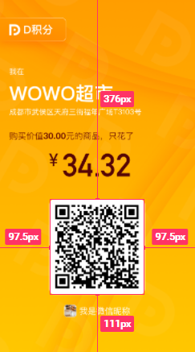

# 概述

在开发中，偶尔会有绘制海报的需求，再得贴个二维码什么的。

本篇文章将给大家分享下前端如何通过canvas来绘制海报。

绘制海报在我看来就是组合信息，首先你要对 [canvas](https://developer.mozilla.org/zh-CN/docs/Web/API/Canvas_API) 有所了解，如果不会，建议先去看看文档。海报绘制的内容通常包括如下信息：

- 海报封面
- 用户信息
- 二维码

如下所示：


通常后台会返回海报封面图、用户信息以及二维码跳转链接给你，这里你要做的事情就两个：

1. 将二维码跳转链接生成二维码
2. canvas 绘制海报

那开始行动吧。

# 方案

在绘制过程中，如果引用的是在线图片资源可能会遇到图片跨域问题，并且需要注意的是，`canvas.toDataURL()` 方法对于在线图片或者说svg等资源的支持度是不友好的。海报的绘制我并没有铺满整个屏幕，这样可能会导致图片被拉伸，我们应该拿到封面图之后获取封面图的尺寸然后根据比例绘制，所以一般绘制海报的思路大致是这样的：

1. 请求分享相关数据
2. 将图片资源转成base64
3. 跳转链接通过 Qrcode.js 生成二维码
4. 计算海报元素尺寸位置信息
5. 创建画布绘制
6. 将画布导出并渲染

# 核心

## 图片转base64

刚刚有提到，canvas对在线资源的支持并不是特别友好，这里主要体现在当我们需要通过 `canvas.toDataURL()` 导出图片的时候会出现问题，canvas认为这会污染画布，所以通常来说，我会将在线图片转成base64，这里封装了转base64的方法，可直接使用，如下所示：

```js
function base64(url) {
	return new Promise((resolve, reject) => {
		let xhr = new XMLHttpRequest();
		xhr.open('GET', url, true);
		xhr.responseType = 'blob';
		xhr.onload = function() {
			if (this.status === 200) {
				let blob = this.response
				let fileReader = new FileReader()
				fileReader.onloadend = function(e) {
					let result = e.target.result;
					resolve(result);
				}
				fileReader.readAsDataURL(blob)
			}
		}
		xhr.onerror = function() {
			reject();
		}
		xhr.send();
	})
}
```
## 生成二维码

二维码生成这里给大家分享两种方法：

### 链接生成

链接生成我一般用在直接将跳转链接生成二维码并展示的情况，语法形式特别简单，如下所示：

```js
const qrcodeSrc = 'http://qr.liantu.com/api.php?text=' + encodeURIComponent(url)
```

其中url为扫描二维码跳转的链接。

### Qrcode.js

[qrcode 传送门 >>](https://www.npmjs.com/package/qrcode)

**1. 安装**

```shell
$ npm install --save qrcode
$ yarn add --save qrcode
```

**2. 导入**

```js
import QRCode from 'qrcode'
```

**3. 使用**

```js
QRCode.toDataURL(h5Url).then(qrCodeSrc => {
    const qrCodeImg = new Image();
    qrCodeImg.src = qrCodeSrc;
    qrCodeImg.onload = function() {
        // 将二维码绘制在海报上
    }
}).catch(err => {
    console.log(err)
})
```

## 比例计算

canvas绘制海报时最令我头疼的就是尺寸的计算啦，不过要是你掌握了一定的规律之后就很好实现了，刚刚我也有讲到，通常我在绘制海报的时候并不会让海报铺满整个屏幕，而是根据海报原图的尺寸信息结合设计图的比例关系进行绘制，避免拉伸，适应宽度即可。

所以你需要获取海报封面图的尺寸，并将其设置成canvas的尺寸，如下所示：
```js
// 创建canvas
const oCanvas = document.createElement('canvas');
const context = oCanvas.getContext('2d');
// 将海报转成base64
this.base64(posterUrl).then(posterSrc => {
    const posterImg = new Image();
    posterImg.setAttribute('crossOrigin', 'anonymous');
    posterImg.src = posterSrc;
    posterImg.onload = () => {
        // 获取图片尺寸
        const w = posterImg.width;
        const h = posterImg.height
        // 根据图片尺寸设置canvas尺寸
        oCanvas.width  = w;
        oCanvas.height = h; 
        // 绘制
        context.drawImage(posterImg, 0, 0, w, h);
    }
})
```
一般来讲，封面是最好画的，铺满canvas即可，不用做任何处理，头疼的主要是子元素的绘制。
首先我们需要计算原图与设计图的比例：

```js
const ratio = w / 375
```
其中，`w` 为获取到的海报宽度，`375` 为设计稿的宽度，一般都为375px，根据实际情况定。计算出比例之后，其他元素就比较好处理啦，如下图：




设计稿宽度为 `375px`，二维码的尺寸为 `180x180`，二维码距离屏幕左上角的位置分别是 `97.5px/376px`，得到这些信息之后我们就可以根据比例去绘制二维码啦，如下所示：

```js
QRCode.toDataURL(h5Url).then(qrCodeSrc => {
	const qrCodeImg = new Image();
	qrCodeImg.src = qrCodeSrc;
	qrCodeImg.onload = () => {
      // 比例 = 图片元素宽度/设计图宽度
      const ratio = w / 375;
      // 间距 = 设计图上的间距 * 比例
      const spacingX = 97.5 * ratio;
      const spacingY = 376 * ratio;
      // 尺寸 = 设计图上的尺寸 * 比例
      const qrSize = 180 * ratio;
      // 绘制
      context.drawImage(qrCodeImg, spacingX, spacingY, qrSize, qrSize);
	}
}).catch(err => {
	console.log(err)
})
```
只要掌握了根据比例计算位置尺寸的技巧，绘制海报变得如此简单，这里大家可以举一反三。海报的其他部分也根据此方式来绘制。


# 实现

参照如下代码：

```js
const drawPoster = (share: ShareProps) => {
  console.log(share);
  // create the canvas element
  const canvas = document.createElement('canvas');
  const context = canvas.getContext('2d');
  if (!context) return;
  // convert to base64
  const posterImgUrl =
    'https://qn.d-dou.com/dpoint/images/Lark20210702-101407.png';
  Promise.all([Tools.base64(posterImgUrl), Tools.base64(share.avatar)]).then(
    r => {
      const posterSrc: any = r[0];
      const avatarSrc: any = r[1];
      // loading poster
      const posterImg = new Image();
      posterImg.src = posterSrc;
      posterImg.onload = () => {
        // get poster size
        const w = posterImg.width;
        const h = posterImg.height;
        // set canvas size
        canvas.width = w;
        canvas.height = h;
        // calc ratioX = imgW / design width (375)
        // calc ratioY = imgH / design height(667)
        const rx = w / 375;
        const ry = h / 667;
        // draw poster
        context?.drawImage(posterImg, 0, 0, w, h);
        // draw qrcode
        QRCode.toDataURL(share.shareUrl).then((qrCodeSrc: string) => {
          const qrCodeImg = new Image();
          qrCodeImg.src = qrCodeSrc;
          qrCodeImg.onload = () => {
            const qrSize = 180 * rx;
            // calc position
            const x = 98 * rx;
            const y = 376 * ry;
            context?.drawImage(qrCodeImg, x, y, qrSize, qrSize);

            // draw text 1
            context.font = `${14 * rx}px 苹方-简 常规体`;
            context.fillStyle = '#fff';
            context.textBaseline = 'top';
            context.fillText('我在', 22 * rx, 129 * ry);
            // draw text 2
            context.font = `${36 * rx}px 苹方-简 常规体`;
            context.fillText(share.merName, 22 * rx, 159 * ry);
            // draw text 3
            context.font = `${14 * rx}px 苹方-简 常规体`;
            context.fillText(share.address, 22 * rx, 205 * ry);
            // draw text 4
            context.fillStyle = '#000';
            context.font = `${16 * rx}px 苹方-简 常规体`;
            context.fillText(
              `购买价值${share.originalPrice}元得商品，只花了`,
              22 * rx,
              249 * ry,
            );
            // draw text 5
            context.font = `${33 * rx}px 苹方-简 常规体`;
            context.fillText('¥', 98 * rx, 286 * ry);
            // draw text 6
            context.font = `${60 * rx}px 苹方-简 常规体`;
            context.fillText(share.finalPrice.toString(), 123 * rx, 282 * ry);

            // draw avatar
            const avatarImg = new Image();
            avatarImg.src = avatarSrc;
            avatarImg.onload = () => {
              const avatarSize = 23 * rx;
              context?.drawImage(
                avatarImg,
                126 * rx,
                575 * ry,
                avatarSize,
                avatarSize,
              );
              // draw text 6
              context.fillStyle = '#fff';
              context.font = `${16 * rx}px serif`;
              context.fillText(share.nickName, 160 * rx, 579 * ry);
              // create url
              setPosterImg(canvas.toDataURL());
            };
          };
        });
      };
    },
  );
};

```
> 提示：在绘制文本时，记住设置基准线 `context.textBaseline = 'top';`

