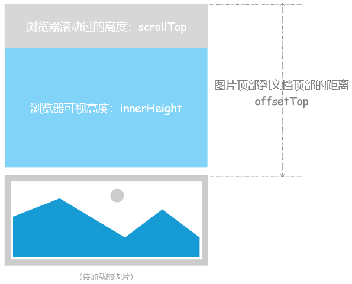
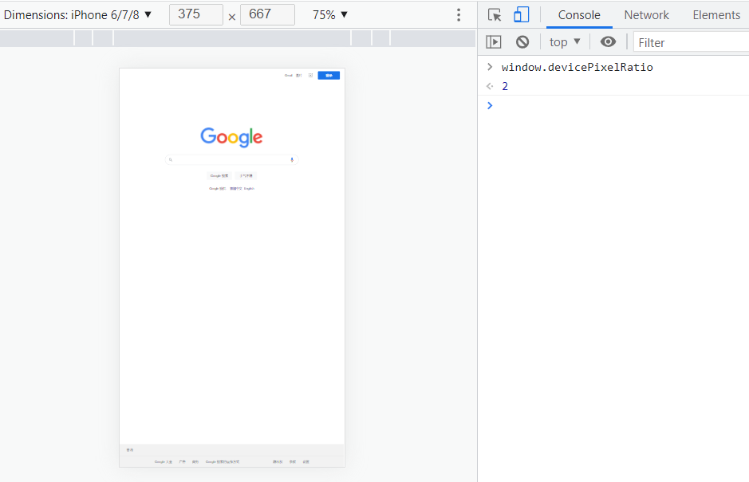
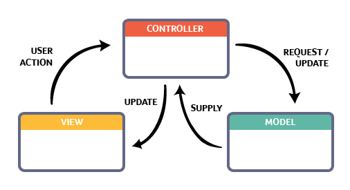
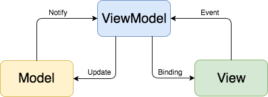
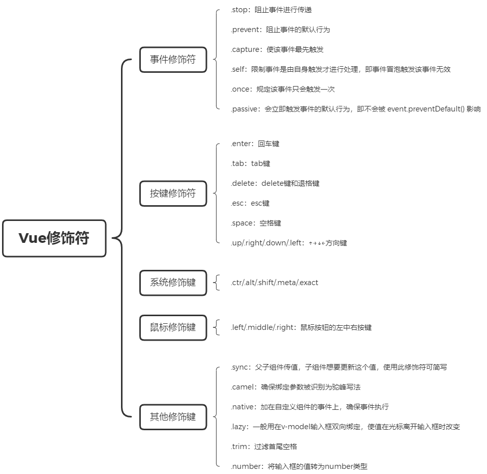

# 面试题集锦

## @Web

### **001：前端性能优化**

前端性能评级工具： [PageSpeed >>](https://developers.google.com/speed/pagespeed/insights/)  / YSlow

```markdown
# CSS:
- 合并、压缩CSS，尽量减少http请求；
- 将css文件防止在页面最上面（head标签对内）；
- 移除不用的CSS;
- 避免使用CSS表达式；
- 选择器优化嵌套，避免层级过深；
- 充分利用CSS继承属性或者抽象提取公共样式，减少代码量；
- 属性值为0时不加单位；
- 属性值小于1的小数时省略小数点前面的0；
- 使用CSS Sprites将多张图片拼接成一张图片，通过CSS background 属性来访问图片内容；

# JavaScript
- 防抖、节流；
- 长列表渲染；
- 图片懒加载（src）
- 避免使用闭包，如果使用闭包时，在函数结尾手动删除不需要的局部变量，尤其在缓存dom节点的情况下；
- DOM操作优化：
  * 批量添加DOM可先 createElement 创建并添加节点，最后一次性加入DOM;
  * 批量绑定事件，使用 事件委托 实现，利用事件冒泡特性；
  * 使用innerHTML 替代 appendChild；
  * 处理样式尽量操作class，而不是直接操作 style 属性，减少重排（Reflow）；
  
# 网络
- 减少HTTP 请求数量；
- 利用浏览器缓存，公共依赖包单独打包/单文件在一起，避免重复请求；
- 减少cookie大小，尽量使用 localStorage 代替；
- CDN托管静态文件；
- 开启Gzip压缩；
```

### 002：浏览器内核

主要分为 `渲染引擎` 和 `JS引擎` 两部分，其中：

- 渲染引擎：负责取得网页的内容（`HTML`、`XML`、图像等等）、整理讯息（例如加入`CSS`等），以及计算网页的显示方式，然后会输出至显示器或打印机。浏览器的内核的不同对于网页的语法解释会有不同，所以渲染的效果也不相同。所有网页浏览器、电子邮件客户端以及其它需要编辑、显示网络内容的应用程序都需要内核。
- JS引擎：解析和执行`javascript`来实现网页的动态效果。

> 提示：最开始渲染引擎和`JS`引擎并没有区分的很明确，后来JS引擎越来越独立，内核就倾向于只指渲染引擎

### 003：常见浏览器内核

- Trident：IE
- Gecko：Firefox
- Webkit：Safari
- Blink：Chrome/Opera/Edge

## @HTML

### 001：`src` 和 `href` 的区别？

`src` 和 `href` 都是 **用来引用外部的资源**，它们的区别如下：

- `src`：表示对资源的引用，它指向的内容会嵌入到当前标签所在的位置。`src` 会将其指向的资源下载并应⽤到⽂档内，如请求 `js` 脚本。当浏览器解析到该元素时，会暂停其他资源的下载和处理，直到将该资源加载、编译、执⾏完毕，所以⼀般 `js` 脚本会放在页面底部。
- `href`：表示超文本引用，它指向一些网络资源，建立和当前元素或本文档的链接关系。当浏览器识别到它他指向的⽂件时，就会并⾏下载资源，不会停⽌对当前⽂档的处理。 常用在 `a`、`link` 等标签上。 

### 002：对HTML语义化的理解？

语义化是指根据内容的结构化（内容语义化），选择合适的标签（代码语义化）。通俗来讲就是用正确的标签做正确的事情。

语义化的优点如下：

- 对机器友好，带有语义的文字表现力丰富，更适合搜索引擎的爬虫爬取有效信息，有利于SEO。除此之外，语义类还支持读屏软件，根据文章可以自动生成目录；
- 对开发者友好，使用语义类标签增强了可读性，结构更加清晰，开发者能清晰的看出网页的结构，便于团队的开发与维护。

常见的语义化标签：

```html
<header></header>  头部
<nav></nav>  导航栏
<section></section>  区块（有语义化的div）
<main></main>  主要区域
<article></article>  主要内容
<aside></aside>  侧边栏
<footer></footer>  底部
```

### 003：DOCTYPE（⽂档类型） 的作⽤？

`DOCTYPE` 是 HTML5 中一种标准通用标记语言的 **文档类型声明**，它的目的是告诉浏览器（解析器）应该以什么样（`html`或`xhtml`）的文档类型定义来解析文档，不同的渲染模式会影响浏览器对 `CSS` 代码甚⾄ `JavaScript` 脚本的解析。它必须声明在 `HTML`⽂ 档的第⼀⾏。

浏览器渲染页面的两种模式（可通过 `document.compatMode` 获取）：

- `CSS1Compat`：**标准模式**（`Strick mode`），默认模式，浏览器使用W3C的标准解析渲染页面。在标准模式中，浏览器以其支持的最高标准呈现页面。 
- `BackCompat`：**怪异模式(混杂模式)**(`Quick mode)`，浏览器使用自己的怪异模式解析渲染页面。在怪异模式中，页面以一种比较宽松的向后兼容的方式显示。

### 004：script  标签中 `defer` 和 `async` 的区别？

如果没有 `defer` 或 `async` 属性，浏览器会立即加载并执行相应的脚本。它不会等待后续加载的文档元素，读取到就会开始加载和执行，这样就阻塞了后续文档的加载。

`defer` 和 `async` 属性都是去 **异步加载** 外部的 `JS` 脚本文件，它们都不会阻塞页面的解析，其区别如下：

- **执行顺序：** 
  - 多个带 `async` 属性的标签，不能保证加载的顺序；
  - 多个带 `defer` 属性的标签，按照加载顺序执行；
- **脚本是否并行执行：**
  - `async` 属性，表示后续文档的加载和执行与 `js` 脚本的加载和执行是并行进行的，即异步执行；
  - `defer` 属性，加载后续文档的过程和`js` 脚本的加载（此时仅加载不执行）是并行进行的（异步），`js`脚本需要等到文档所有元素解析完成之后才执行，`DOMContentLoaded` 事件触发执行之前。

### 005：常⽤的 meta 标签有哪些？

`meta` 标签由 `name` 和 `content` 属性定义，**用来描述网页文档的属性**，比如网页的作者，网页描述，关键词等，除了HTTP标准固定了一些 `name` 作为大家使用的共识，开发者还可以自定义 `name`。

常用的meta标签：

1）`charset`，用来描述HTML文档的编码类型：

```html
<meta charset="UTF-8" >
```

2）`keywords`，页面关键词：

```html
<meta name="keywords" content="关键词" />
```

3）`description`，页面描述：

```html
<meta name="description" content="页面描述内容" />
```

4）`refresh`，页面重定向和刷新：

```html
<meta http-equiv="refresh" content="0;url=" />
```

5）`viewport`，适配移动端，可以控制视口的大小和比例：

```html
<meta name="viewport" content="width=device-width, initial-scale=1.0, user-scalable=0, viewport-fit=cover" />
```

6）搜索引擎索引方式：

```html
<meta name="robots" content="index,follow" />
```

### 006：HTML5有哪些更新？

（1）新增语义化标签：`nav`、`header`、`footer`、`aside`、`section`、`article`

（2）音频、视频标签：`audio`、`video`

（3）数据存储：`localStorage`、`sessionStorage`

（4）`canvas`（画布）、`Geolocation`（地理定位）、`websocket`（通信协议） 

（5）`input` 标签新增属性：`placeholder`、`autocomplete`、`autofocus`、`required`

（6）`history API`：`go`、`forward`、`back`、`pushstate`

### 007：渐进增强和优雅降级之间的区别？

- **渐进增强**：主要是针对低版本的浏览器进行页面重构，保证基本的功能情况下，再针对高级浏览器进行效果、交互等方面的改进和追加功能，以达到更好的用户体验。
- **优雅降级**：一开始就构建完整的功能，然后再针对低版本的浏览器进行兼容。

二者的区别：

- 优雅降级是从复杂的现状开始的，并试图减少用户体验的供给；而渐进增强是从一个非常基础的，能够起作用的版本开始的，并在此基础上不断扩充，以适应未来环境的需要；
- 降级（功能衰竭）意味着往回看，而渐进增强则意味着往前看，同时保证其根基处于安全地带。

> **优雅降级** 观点认为应该针对那些最高级、最完善的浏览器来设计网站。而将那些被认为“过时”或有功能缺失的浏览器下的测试工作安排在开发周期的最后阶段，并把测试对象限定为主流浏览器（如 IE、Mozilla 等）的前一个版本。 在这种设计范例下，旧版的浏览器被认为仅能提供“简陋却无妨 (poor, but passable)” 的浏览体验。可以做一些小的调整来适应某个特定的浏览器。但由于它们并非我们所关注的焦点，因此除了修复较大的错误之外，其它的差异将被直接忽略。

> **渐进增强** 观点则认为应关注于内容本身。内容是建立网站的诱因，有的网站展示它，有的则收集它，有的寻求，有的操作，还有的网站甚至会包含以上的种种，但相同点是它们全都涉及到内容。这使得“渐进增强”成为一种更为合理的设计范例。这也是它立即被 Yahoo 所采纳并用以构建其“分级式浏览器支持 (Graded Browser Support)”策略的原因所在。

### 008：说一下 HTML5 drag API?

（1）被拖放元素：

- `dragstart`：在开始拖放被拖放元素时触发。

- `darg`：在正在拖放被拖放元素时触发。
- `dragend`：在整个拖放操作结束时触发。

（2）目标元素：

- `dragenter`：在被拖放元素进入某元素时触发。

- `dragover`：在被拖放在某元素内移动时触发。
- `dragleave`：在被拖放元素移出目标元素是触发。
- `drop`：在目标元素完全接受被拖放元素时触发。

### 009：浏览器乱码的原因是什么？如何解决？

**乱码原因**：编码不一致导致（网页源代码是 `GBK` 编码，而内容是 `UTF-8`，这样浏览器打开就会出现乱码）;

**解决办法**：使用（IDE，编辑器）编辑网页内容；如果编码不一致，转码；

### 010：head 标签有什么作用，其中什么标签必不可少？

标签用于定义文档的头部，它是所有头部元素的容器。 标签中的元素可以引用脚本、指示浏览器在哪里找到样式表、提供元信息等。 文档的头部描述了文档的各种属性和信息，包括文档的标题、在 Web 中的位置以及和其他文档的关系等。绝大多数文档头部包含的数据都不会真正作为内容显示给读者。

下面这些标签可用在 head 部分：`<base>`, `<link>`, `<meta>`, `<script>`, `<style>`, `<title>`。

其中 `<title>` 定义文档的标题，它是 head 部分中 **唯一必需** 的元素。

### 011：Canvas 和 SVG 的区别

**（1）SVG：** SVG（**S**calable **V**ector **G**raphics，可缩放矢量图形）是基于可扩展标记语言XML描述的2D图形的语言，SVG基于XML就意味着SVG DOM中的每个元素都是可用的，可以为某个元素附加 `Javascript` 事件处理器。在 SVG 中，每个被绘制的图形均被视为对象。如果 SVG 对象的属性发生变化，那么浏览器能够自动重现图形。

其特点如下：

- 不依赖分辨率；
- 支持事件处理器；
- 最适合带有大型渲染区域的应用程序（比如谷歌地图）；
- 复杂度高会减慢渲染速度（任何过度使用 DOM 的应用都不快）；
- 不适合游戏应用；

**（2）Canvas：** Canvas 是画布，通过 `Javascript` 来绘制2D图形，是逐像素进行渲染的。其位置发生改变，就会重新进行绘制。

其特点如下：

- 依赖分辨率；
- 不支持事件处理器；
- 文本渲染能力弱；
- 能够以 `.png` 或 `.jpg` 格式保存结果图像；
- 最适合图像密集型的游戏，其中的许多对象会被频繁重绘；

### 012：label 的作用是什么？如何使用？

`label` 标签用来定义表单控件的关系：当用户选择 `label` 标签时，浏览器会自动将焦点转到和 `label` 标签相关的表单控件上。

```html
<!-- 使用方法1： -->
<label for="mobile">Account:</label>
<input type="text" id="account"/>

<!-- 使用方法2： -->
<label>Password:<input type="text"/></label>
```

### 013：浏览器是如何对 HTML5 的离线储存资源进行管理和加载的？

- **在线的情况下**，浏览器发现 `html` 头部有 `manifest` 属性，它会请求 `manifest` 文件，如果是第一次访问页面 ，那么浏览器就会根据 `manifest` 文件的内容下载相应的资源并且进行离线存储。如果已经访问过页面并且资源已经进行离线存储了，那么浏览器就会使用离线的资源加载页面，然后浏览器会对比新的 `manifest` 文件与旧的 `manifest` 文件，如果文件没有发生改变，就不做任何操作，如果文件改变了，就会重新下载文件中的资源并进行离线存储。

- **离线的情况下**，浏览器会直接使用离线存储的资源。

## @CSS

### 001：CSS选择器及其优先级

| 选择器         | 格式                   | 优先级权重 |
| -------------- | ---------------------- | ---------- |
| `id` 选择器    | `#id`                  | 100        |
| 类选择器       | `#classname`           | 10         |
| 属性选择器     | `input[type='button']` | 10         |
| 伪类选择器     | `li:last-child`        | 10         |
| 标签选择器     | `div`                  | 1          |
| 伪元素选择器   | `li:after`             | 1          |
| 相邻兄弟选择器 | `h1 + p`               | 0          |
| 子选择器       | `ul > li`              | 0          |
| 后代选择器     | `li a`                 | 0          |
| 通配符选择器   | `*`                    | 0          |

对于选择器的 **优先级**：

- 标签选择器、伪元素选择器：`1`

- 类选择器、伪类选择器、属性选择器：`10`
- `id` 选择器：`100`
- 内联样式：`1000`

**注意事项：**

- `!important` 声明的样式的优先级最高；
- 如果优先级相同，则最后出现的样式生效；
- 继承得到的样式的优先级最低；
- 通用选择器（`*`）、子选择器（`>`）和相邻同胞选择器（`+`）并不在这四个等级中，所以它们的权值都为 `0` ；
- 样式表的来源不同时，优先级顺序为：内联样式 > 内部样式 > 外部样式 > 浏览器用户自定义样式 > 浏览器默认样式。

### 002：CSS 中可继承与不可继承属性有哪些？

**（1）继承属性**

- <u>字体</u> 系列属性：`font-family`、`font-weight`、`font-size`、`font-style`
- <u>文本</u> 系列属性：`text-indent`、`text-align`、`line-height`、`word-spacing`、`letter-spacing`、`text-transform`、`color`
- 元素可见性：`visibility`
- 列表布局属性：`list-style-type`、`ist-style-image` 等
- 光标属性：`cursor`

**（2）非继承属性**

- `display`
- 文本属性：`vertical-align`、`text-decoration`、`text-shadow`、`white-space`
- 盒子模型相关属性
- 背景属性
- 定位属性
- 轮廓样式属性
- ...

### 003：`inline`、`inline-block` 和 `block` 的区别？

- `inline`：元素不会独占一行，设置 `width`、`height` 属性无效。但可以设置水平方向的 `margin` 和 `padding` 属性，不能设置垂直方向的 `padding` 和`margin`；

- `inline-block`：将对象设置为 `inline` 对象，但对象的内容作为 `block` 对象呈现，之后的内联对象会被排列在同一行内

- `block`：独占一行，可以设置 `width`、`height`、`margin` 和 `padding` 属性；

### 004：隐藏元素的方法有哪些？

- `display: none`：渲染树不会包含该渲染对象，因此该元素不会在页面中占据位置，也不会响应绑定的监听事件
- `visibility: hidden`：元素在页面中仍占据空间，但是不会响应绑定的监听事件。
- `opacity: 0`：将元素的透明度设置为 0，以此来实现元素的隐藏。元素在页面中仍然占据空间，并且能够响应元素绑定的监听事件。
- `position: absolute`：通过使用绝对定位将元素移除可视区域内，以此来实现元素的隐藏。
- `z-index: 负值`：使其他元素遮盖住该元素，以此来实现隐藏。
- `clip/clip-path`：使用元素裁剪的方法来实现元素的隐藏，这种方法下，元素仍在页面中占据位置，但是不会响应绑定的监听事件。
- `transform: scale(0, 0)`：将元素缩放为 0，来实现元素的隐藏。这种方法下，元素仍在页面中占据位置，但是不会响应绑定的监听事件。

### 005：`link` 和 `@import` 的区别？

两者都是外部引用CSS的方式，它们的区别如下：

- `link` 是 HTML 标签，除了加载CSS外，还可以定义RSS等其他事务；`@import` 属于CSS 范畴，只能加载 CSS。
- `link` 引用CSS时，在页面载入时同时加载；`@import` 需要页面网页完全载入以后加载。
- `link` 是 HTML标签，无兼容问题；`@import` 是在CSS2.1提出的，低版本的浏览器不支持。
- `link` 支持使用 `JavaScript` 控制DOM去改变样式；而 `@import` 不支持。

### 006：`transition` 和 `animation` 的区别？

- `transition` 是 **过度属性**，强调过度，它的实现需要触发一个事件（比如鼠标移动上去，焦点，点击等）才执行动画。它类似于flash的补间动画，设置一个开始关键帧，一个结束关键帧。
- `animation` 是 **动画属性**，它的实现不需要触发事件，设定好时间之后可以自己执行，且可以循环一个动画。它也类似于flash的补间动画，但是它可以设置多个关键帧（用 `@keyframe` 定义）完成动画。

### 007：`display:none` 与 `visibility:hidden` 的区别？

（1）在渲染树中

- `display:none` 会脱离文档流，渲染时不会占据任何空间；
- `visibility:hidden` 不会脱离文档流，渲染的元素还会占据相应的空间，只是内容不可见。

（2）是否是继承属性

- `display:none` 是非继承属性，子孙节点会随着父节点从渲染树消失，通过修改子孙节点的属性也无法显示；
- `visibility:hidden` 是继承属性，子孙节点消失是由于继承了 `hidden`，通过设置 `visibility:visible` 可以让子孙节点显示；

（3）修改常规文档流中元素的 `display` 通常会造成文档的重排，但是修改 `visibility` 属性只会造成本元素的重绘；

（4）如果使用读屏器，设置为 `display:none` 的内容不会被读取，设置为 `visibility:hidden` 的内容会被读取。

### 008：伪元素和伪类的区别和作用？

- **伪元素**：在内容元素的前后插入额外的元素或样式，但是这些元素实际上并不在文档中生成。它们只在外部显示可见，但不会在文档的源代码中找到它们，因此，称为 “伪” 元素。例如：`::before`、`::after`、`::first-line`、`::first-letter`
- **伪类**：将 <u>特殊的效果</u> 添加到 <u>特定选择器</u>上。它是已有元素上添加类别的，不会产生新的元素。例如：`:hover`、`:first-child`

> **总结**： 伪类是通过在元素选择器上加⼊伪类改变元素状态，⽽伪元素通过对元素的操作进⾏对元素的改变。

### 009：谈谈你对 requestAnimationframe 的理解？

实现动画效果的方法比较多，`Javascript` 中可以通过定时器来实现，CSS3 中可以使用 `transition` 和 `animation` 来实现，HTML5 中的 `canvas` 也可以实现。除此之外，HTML5 提供一个专门用于请求动画的API，那就是 `requestAnimationFrame`，顾名思义就是 **请求动画帧**。

MDN对该方法的描述：

> `window.requestAnimationFrame()` 告诉浏览器——你希望执行一个动画，并且要求浏览器在下次重绘之前调用指定的回调函数更新动画。该方法需要传入一个回调函数作为参数，该回调函数会在浏览器下一次重绘之前执行。

**语法形式：**

```javascript
window.requestAnimationFrame(callback);
```

- `callback`：**下一次重绘之前更新动画帧所调用的函数**（即上面所说的回调函数）。该回调函数会被传入`DOMHighResTimeStamp` 参数，它表示`requestAnimationFrame()`  开始去执行回调函数的时刻。该方法属于 **宏任务**，所以会在执行完微任务之后再去执行。

**取消动画：**

```javascript
cancelAnimationFrame(animationID);
```

- `animationID`：动画 `id`，该 `id` 来自于 `requestAnimationFrame` 的返回值。

**优势：**

- **CPU节能**：使用 `SetTinterval` 实现的动画，当页面被隐藏或最小化时，`SetTinterval` 仍然在后台执行动画任务，由于此时页面处于不可见或不可用状态，刷新动画是没有意义的，完全是浪费CPU资源。而 `RequestAnimationFrame` 则完全不同，当页面处理未激活的状态下，该页面的屏幕刷新任务也会被系统暂停，因此跟着系统走的 `RequestAnimationFrame` 也会停止渲染，当页面被激活时，动画就从上次停留的地方继续执行，有效节省了CPU开销。
- **函数节流**：在高频率事件( resize, scroll 等)中，为了防止在一个刷新间隔内发生多次函数执行，RequestAnimationFrame可保证每个刷新间隔内，函数只被执行一次，这样既能保证流畅性，也能更好的节省函数执行的开销，一个刷新间隔内函数执行多次时没有意义的，因为多数显示器每16.7ms刷新一次，多次绘制并不会在屏幕上体现出来。
- **减少DOM操作**：`requestAnimationFrame` 会把每一帧中的所有DOM操作集中起来，在一次重绘或回流中就完成，并且重绘或回流的时间间隔紧紧跟随浏览器的刷新频率，一般来说，这个频率为每秒60帧。

**定时器执行动画的缺点**：它通过设定间隔时间来不断改变图像位置，达到动画效果。但是容易出现卡顿、抖动的现象；原因是：

- 定时器任务被放入异步队列，只有当主线程任务执行完后才会执行队列中的任务，因此实际执行时间总是比设定时间要晚；
- 定时器的固定时间间隔不一定与屏幕刷新间隔时间相同，会引起丢帧。

### 010：谈谈你对盒模型的理解？

CSS3 中的盒模型有两种：标准盒子模型、IE盒子模型。

盒模型都是由四个部分组成的，分别是：`margin`、`padding`、`border` 和 `content`。

标准盒模型和IE盒模型的区别在于设置 `width` 和 `height` 时，所对应的范围不同：

- 标准盒模型的 `width` 和 `height` 属性的范围只包含了`content`
- IE盒模型的 `width` 和 `height` 属性的范围包含了 `border`、`padding` 和 `content`。

可以通过修改元素的 `box-sizing` 属性来改变元素的盒模型：

- `box-sizeing: content-box` 表示标准盒模型（默认值）
- `box-sizeing: border-box` 表示IE盒模型（怪异盒模型）

### 011：li 与 li 之间有看不见的空白间隔是什么原因引起的？如何解决？

浏览器会把 `inline` 内联元素间的空白字符（空格、换行、Tab等）渲染成一个空格。为了美观，通常是一个`<li>`放在一行，这导致`<li>`换行后产生换行字符，它变成一个空格，占用了一个字符的宽度。

**解决办法：**

（1）为 `<li>` 设置 `float:left`。不足：有些容器是不能设置浮动，如左右切换的焦点图等。

（2）将所有 `<li>` 写在同一行。不足：代码不美观。

（3）将 `<ul>` 内的字符尺寸直接设为 0，即 `font-size:0`。不足：`<ul>`中的其他字符尺寸也被设为 0，需要额外重新设定其他字符尺寸，且在 `Safari` 浏览器依然会出现空白间隔。

（4）消除 `<ul>` 的字符间隔 `letter-spacing:-8px`，不足：这也设置了`<li>`内的字符间隔，因此需要将`<li>`内的字符间隔设为默认 `letter-spacing:normal`。

### 012：对 CSS Sprites 的理解？

`CSS Sprites`（精灵图），将一个页面涉及到的所有图片都包含到一张大图中去，然后利用CSS的 `background-image`，`background-repeat`，`background-position` 属性的组合进行背景定位。

**优点：**

- 利用 `CSS Sprites` 能很好地减少网页的http请求，从而大大提高了页面的性能，这是 `CSS Sprites` 最大的优点；
- `CSS Sprites` 能减少图片的字节，把3张图片合并成1张图片的字节总是小于这3张图片的字节总和。

**缺点：**

- 在图片合并时，要把多张图片有序的、合理的合并成一张图片，还要留好足够的空间，防止板块内出现不必要的背景。在宽屏及高分辨率下的自适应页面，如果背景不够宽，很容易出现背景断裂；
- `CSS Sprites` 在开发的时候相对来说有点麻烦，需要借助 `photoshop` 或其他工具来对每个背景单元测量其准确的位置。
- 维护方面：`CSS Sprites` 在维护的时候比较麻烦，页面背景有少许改动时，就要改这张合并的图片，无需改的地方尽量不要动，这样避免改动更多的 `CSS`，如果在原来的地方放不下，又只能（最好）往下加图片，这样图片的字节就增加了，还要改动 `CSS`。

### 013：CSS 优化和提高性能的方法有哪些？

（1）合并、压缩（GZIP）

（2）选择器优化嵌套，尽量避免层级过深

（3）避免使用通配符 `*` 、后代选择器（CSS选择器是从右到左进行匹配的）、CSS 表达式

（4）巧妙使用 CSS 继承机制

（5）拆分公共样式

（6）cssSprite

（7）避免使用 `@import`，建议使用 `link`

（8）如果使用了 `id` 选择器，就不需再加其他规则，因为 `id` 是唯一的

（9）属性值为0时，不加单位；属性值为浮动小数 `0.xx` 时，省略小数点前的 `0`

（10）去除无用的样式及空规则；

（11）慎重使用高性能属性：浮动、定位

（12）尽量减少页面重排、重绘

（13）标准化各种浏览器前缀：带浏览器前缀的在前。标准属性在后。

### 014：单行、多行文本溢出隐藏

- 单行文本溢出

  ```css
  overflow: hidden; /* 溢出隐藏 */
  text-overflow: ellipsis;  /* 溢出用省略号显示 */ 
  white-space: nowrap;  /* 规定段落中的文本不进行换行 */    
  ```

- 多行文本溢出

  ```css
  overflow: hidden; /* 溢出隐藏 */           
  text-overflow: ellipsis; /* 溢出用省略号显示 */    
  display:-webkit-box; /* 作为弹性伸缩盒子模型显示 */    
  -webkit-box-orient:vertical; /* 设置伸缩盒子的子元素排列方式：从上到下垂直排列 */ 
  -webkit-line-clamp:3; /* 显示的行数 */
  ```

### 015：如何判断元素是否到达可视区域？

以图片显示为例：



- `window.innerHeight` 是浏览器可视区的高度；

- `document.body.scrollTop || document.documentElement.scrollTop` 是浏览器滚动的过的距离；
- `imgs.offsetTop` 是元素顶部距离文档顶部的高度（包括滚动条的距离）；
- 内容达到显示区域的：`img.offsetTop < window.innerHeight + document.body.scrollTop;`

### 016：px、em、rem 的区别及使用场景

**三者的区别：**

- `px` 是固定的像素，一旦设置了就无法因为适应页面大小而改变。
- `em` 和 `rem` 相对于`px` 更具有灵活性，他们是相对长度单位，其长度不是固定的，更适用于响应式布局。
- `em` 是相对于其父元素来设置字体大小，这样就会存在一个问题，进行任何元素设置，都有可能需要知道他父元素的大小。而 `rem` 是相对于根元素，这样就意味着，只需要在根元素确定一个参考值。

**使用场景：**

- 对于只需要适配少部分移动设备，且分辨率对页面影响不大的，使用 `px` 即可 。
- 对于需要适配各种移动设备，使用 `rem`，例如需要适配 iPhone 和 iPad 等分辨率差别比较挺大的设备。

### 017：响应式设计的概念及基本原理

**概念**：响应式网站设计（Responsive Web design）是一个网站能够兼容多个终端，而不是为每一个终端做一个特定的版本。

**原理**： 基本原理是通过媒体查询`（@media）`查询检测不同的设备屏幕尺寸做处理。

**兼容**：页面头部必须有 `meta` 声明的 `viewport`

```html
<meta name="viewport" content="width=device-width, initial-scale=1.0, user-scalable=0, viewport-fit=cover" />
```

### 018：为什么需要清除浮动？清除浮动的方式？

**浮动定义**：非IE浏览器下，容器不设高度且子元素浮动时，容器高度不能被内容撑开。 此时，内容会溢出到容器外面而影响布局。这种现象被称为浮动（溢出）。

**浮动的工作原理：**

- 浮动元素脱离文档流，不占据空间（引起“高度塌陷”现象）
- 浮动元素碰到包含它的边框或者其他浮动元素的边框停留

浮动元素可以左右移动，直到遇到另一个浮动元素或者遇到它外边缘的包含框。浮动框不属于文档流中的普通流，当元素浮动之后，不会影响块级元素的布局，只会影响内联元素布局。此时文档流中的普通流就会表现得该浮动框不存在一样的布局模式。当包含框的高度小于浮动框的时候，此时就会出现“高度塌陷”。

**浮动元素引起的问题？**

- 父元素的高度无法被撑开，影响与父元素同级的元素
- 与浮动元素同级的非浮动元素会跟随其后
- 若浮动的元素不是第一个元素，则该元素之前的元素也要浮动，否则会影响页面的显示结构

**清除浮动的方式如下：**

- 给父级div定义 `height` 属性；

- 最后一个浮动元素之后添加一个空的div标签，并添加 `clear:both` 样式；

- 包含浮动元素的父级标签添加 `overflow:hidden` 或者 `overflow:auto`；

- 使用 `:after` 伪元素。由于IE6-7不支持 `:after`，使用 `zoom:1` 触发 `hasLayout**`；

  ```css
  .clearfix:after{
      content: "";
      display: block; 
      height: 0;
      clear: both;
  }
  .clearfix{
      *zoom: 1;
  }
  ```

### 019：如何解决 1px 问题？

1px 问题指的是：在一些  `Retina屏幕` 的机型上，移动端页面的 1px 会变得很粗，呈现出不止 1px 的效果。原因很简单——CSS 中的 1px 并不能和移动设备上的 1px 划等号。它们之间的比例关系有一个专门的属性来描述：

```js
window.devicePixelRatio = 设备的物理像素 / CSS像素。
```

打开 Chrome 浏览器，启动移动端调试模式，在控制台去输出这个 `devicePixelRatio` 的值。这里选中 iPhone6/7/8 这系列的机型，输出的结果就是2：



这就意味着设置的 1px CSS 像素，在这个设备上实际会用 2 个物理像素单元来进行渲染，所以实际看到的一定会比 1px 粗一些。 **解决1px 问题的三种思路：**

#### 思路一：直接写 0.5px

```jsx
<div id="container" data-device={{window.devicePixelRatio}}></div>
```

```javascript
#container[data-device="2"] {
  border:0.5px solid #333
}
```

#### 思路二：伪元素先放大后缩小（*）

这个方法的可行性会更高，兼容性也更好。唯一的缺点是代码会变多。

思路：**先放大、后缩小**

在目标元素的后面追加一个 `::after` 伪元素，让这个元素布局为 `absolute` 之后、整个伸展开铺在目标元素上，然后把它的宽和高都设置为目标元素的两倍，`border` 值设为 `1px`。接着借助 CSS 动画特效中的放缩能力，把整个伪元素缩小为原来的 `50%`。此时，伪元素的宽高刚好可以和原有的目标元素对齐，而 `border` 也缩小为了 `1px` 的二分之一，间接地实现了 `0.5px` 的效果。

代码如下：

```css
#container[data-device='2'] {
  position: relative;
}
#container[data-device='2']::after {
  content: '';
  position: absolute;
  top: 0;
  left: 0;
  width: 200%;
  height: 200%;
  transform: scale(0.5);
  transform-origin: left top;
  box-sizing: border-box;
  border: 1px solid #333;
}
```

#### 思路三：viewport 缩放

这个思路就是对 meta 标签里几个关键属性下手：

```html
<meta name="viewport" content="initial-scale=0.5, maximum-scale=0.5, minimum-scale=0.5, user-scalable=no">
```

这里针对像素比为2的页面，把整个页面缩放为了原来的1/2大小。这样，本来占用2个物理像素的 1px 样式，现在占用的就是标准的一个物理像素。根据像素比的不同，这个缩放比例可以被计算为不同的值，用 js 代码实现如下：

```javascript
const scale = 1 / window.devicePixelRatio;
// 这里 metaEl 指的是 meta 标签对应的 Dom
const value = `width=device-width,user-scalable=no,initial-scale=${scale},maximum-scale=${scale},minimum-scale=${scale}`;
metaEl.setAttribute('content', value);
```

这样解决了，但这样做的副作用也很大，整个页面被缩放了。这时 1px 已经被处理成物理像素大小，这样的大小在手机上显示边框很合适。但是，一些原本不需要被缩小的内容，比如文字、图片等，也被无差别缩小掉了。

### 020：如何设置小于12px的字体？

在谷歌下css设置字体大小为12px及以下时，显示都是一样大小，都是默认12px。

**解决办法：**

- 使用Webkit的内核的 `-webkit-text-size-adjust:none` 的私有CSS属性来解决（高版本不兼容）;
- 使用 CSS3 中的 `transform:scale(.xx)` 解决；
- 使用图片：如果是内容固定不变情况下，使用将小于12px文字内容切出做图片，这样不影响兼容也不影响美观。

### 021：对 sticky 定位的理解？

`sticky` 英文字面意思是粘贴，所以可以把它称之为粘性定位。语法：`position: sticky;`  基于用户的 **滚动位置** 来定位。

粘性定位的元素是依赖于用户的滚动，在 `position:relative` 与 `position:fixed` 定位之间切换。它的行为就像 `position:relative;` 而当页面滚动超出目标区域时，它的表现就像 `position:fixed;`，它会固定在目标位置。元素定位表现为在跨越特定阈值前为相对定位，之后为固定定位。这个特定阈值指的是 `top`, `right`, `bottom` 或 `left` 之一，换言之，指定 `top`, `right`, `bottom` 或 `left` 四个阈值其中之一，才可使粘性定位生效。否则其行为与相对定位相同。

### 022：absolute 与 fixed 共同点与不同点？

**共同点：**

- 隐式改变行内元素的呈现方式，将 `display` 置为 `inline-block` 
- 使元素脱离普通文档流，不再占据文档物理空间
- 覆盖非定位文档元素

**不同点：**

- `abuselute` 与 `fixed` 的根元素不同，`abuselute` 的根元素可以设置，`fixed` 根元素是浏览器。
- 在有滚动条的页面中，`absolute` 会跟着父元素进行移动，`fixed` 固定在页面的具体位置。

## @JavaScript

### 001： JavaScript 有哪些数据类型及其区别是什么？

JavaScript 共有八种数据类型，分别是 `Undefined`、`Null`、`Boolean`、`Number`、`String`、`Object`、`Symbol`、`BigInt`。

这些数据可以分为原始数据类型和引用数据类型：

- 栈：原始数据类型（`Undefined`、`Null`、`Boolean`、`Number`、`String`）
- 堆：引用数据类型（对象、数组和函数）

两种类型的区别在于 **存储位置的不同**：

- 原始数据类型为存储在栈（stack）中的 **简单数据段**，占据空间小、大小固定，属于被频繁使用数据；

- 引用数据类型为存储在堆（heap）中的 **对象**，占据空间大、大小不固定。如果存储在栈中，将会影响程序运行的性能；引用数据类型在栈中存储了指针，该指针指向堆中该实体的起始地址。当解释器寻找引用值时，会首先检索其在栈中的地址，取得地址后从堆中获得实体。

### 002：数据类型检测的方式有哪些？

- `typeof`
- `instanceof`（只能判断引用数据类型）
- `constructor `
- `Object.prototype.toString.call()`

### 003：判断数组的方式有哪些？

- `Object.prototype.toString.call()`
- 通过原型链做判断：`obj.__proto__ === Array.prototype;`
- `Array.isArrray(obj);`
- `obj instanceof Array`
- `Array.prototype.isPrototypeOf(obj)`

### 004：`null` 和 `undefined` 的区别？

二者都是基本数据类型，这两个基本数据类型分别都只有一个值，就是 `undefined` 和 `null`。

- `undefined` 表示 **未定义**，一般变量声明了但还没有定义的时候会返回 `undefined`
- `null` 表示 **空对象**，主要用于赋值给一些可能会返回对象的变量，作为初始化。

### 005：`intanceof`  操作符的实现原理及实现

`instanceof` 运算符用于判断构造函数的 `prototype` 属性是否出现在对象的原型链中的任何位置。

```javascript
function myInstance(target, fn) {
  // 获取对象的原型
  var proto = Object.getPrototypeOf(target);
  // 获取构造函数的 prototype 对象
  var prototype = fn.prototype;
  while (true) {
    if (!proto) return false;
    if (proto === prototype) return true;
    // 如果没有找到，就继续从其原型上找，Object.getPrototypeOf方法用来获取指定对象的原型
    proto = Object.getPrototypeOf(proto);
  }
}
```

### 006：为什么 0.1+0.2 ! == 0.3，如何让其相等 ？

计算机是通过二进制的方式存储数据的，在 JavaScript 中只有一种数字类型：`Number`，它的实现遵循 IEEE 754 标准，使用 **64位固定长度** 来表示，也就是标准的`double` **双精度浮点数**。在二进制科学表示法中，双精度浮点数的小数部分最多只能保留 **52** 位，再加上前面的 1，其实就是保留53位有效数字，剩余的需要舍去，遵从“0舍1入”的原则。

### 007：如何安全的使用 `undefined` 值？

因为 `undefined` 是一个标识符，所以可以被当作变量来使用和赋值，但是这样会影响 `undefined` 的正常判断，我们可以通过 `void 0` 来获得 `undefined`。

### 008：`typeof NaN` 的结果是什么？

`NaN` 是特殊 **值**，表示 “不是一个数字”，用于指出数字类型中的错误情况，`NaN` 不等于自身，其类型为 `number` 类型。

### 009：== 操作符的强制类型转换规则？

对于 `==` 来说，如果对比双方的类型**不一样**，就会进行**类型转换**。假如对比 `x` 和 `y` 是否相同，就会进行如下判断流程：

1）首先会判断两者类型是否相同，相同的话就比较两者的大小；

2）类型不相同的话，就会进行类型转换；

3）会先判断是否在对比 `null` 和 `undefined`，是的话就会返回 `true`；

4）判断两者类型是否为 `string` 和 `number`，是的话就会将字符串转换为 `number`；

### 010：`Object.is()` 与比较操作符 `===`，`==` 的区别？

- 使用双等号（==）进行相等判断时，如果两边的类型不一致，则会进行强制类型转化后再进行比较。
- 使用三等号（===）进行相等判断时，如果两边的类型不一致时，不会做强制类型准换，直接返回 `false`。
- 使用 `Object.is` 来进行相等判断时，一般情况下和三等号的判断相同，它处理了一些特殊的情况，比如 `-0` 和 `+0` 不再相等，两个 `NaN` 是相等的。

### 011：什么是 JavaScript 中的包装类型？

在 JavaScript 中，基本类型是没有属性和方法的，但是为了便于操作基本类型的值，在调用基本类型的属性或方法时 JavaScript 会在后台隐式地将基本类型的值转换为对象。

### 012： object.assign 和扩展运算符是深拷贝还是浅拷贝，两者区别

两者都是 **浅拷贝**，区别是：

1）`Object.assign()` 方法接收的第一个参数作为目标对象，后面的所有参数作为源对象。然后把所有的源对象合并到目标对象中。修改一个对象会触发 ES6 setter。

2）扩展操作符（`...`）使用它时，数组或对象中的每一个值都会被拷贝到一个新的数组或对象中。它不复制继承的属性或类的属性，但是它会复制ES6的 symbols 属性。

### 013：let、const、var的区别？

1）**块级作用域**：块作用域由 `{ }` 包括，`let` 和 `const` 具有块级作用域，`var` 不存在块级作用域。块级作用域解决了ES5中的两个问题：

- 内层变量可能覆盖外层变量
- 用来计数的循环变量泄露为全局变量

2）**变量提升**：`var` 存在变量提升，`let` 和 `const` 不存在变量提升，即在变量只能在声明之后使用，否在会报错。

3）**添加全局属性**：浏览器的全局对象是 `window`，Node的全局对象是 `global`。`var` 声明的变量为全局变量，并且会将该变量添加为全局对象的属性，但是 `let` 和 `const` 不会。

4）**重复声明**：`var` 声明变量时，可以重复声明变量，后声明的同名变量会覆盖之前声明的变量。`const` 和 `let` 不允许重复声明变量。

5）**暂时性死区**：在使用 `let`、`const` 命令声明变量之前，该变量都是不可用的。这在语法上，称为 **暂时性死区**。使用 `var` 声明的变量不存在暂时性死区。

6）**初始值设置**：在变量声明时，`var` 和 `let` 可以不用设置初始值。而 `const` 声明变量必须设置初始值。

7）**指针指向**：`let` 和 `const` 都是ES6新增的用于创建变量的语法。 `let` 创建的变量是可以更改指针指向（可以重新赋值）。但 `const` 声明的变量是不允许改变指针的指向。

| 区别               | `var` | `let` | `const` |
| ------------------ | ----- | ----- | ------- |
| 是否有块级作用域   | ×     | √     | √       |
| 是否存在变量提升   | √     | ×     | ×       |
| 是否添加全局属性   | √     | ×     | ×       |
| 是否允许重复声明   | √     | ×     | ×       |
| 是否存在暂时性死区 | ×     | √     | √       |
| 是否必须设置初始值 | ×     | ×     | √       |
| 能否改变指针指向   | √     | √     | ×       |

### 014：箭头函数和普通函数的区别？

1）箭头函数比普通函数更加简洁；

2）箭头函数不会创建自己 `this`；

3）箭头函数继承来的 `this`  指向永远不会改变；

4）`call`、`bind`、`apply` 方法不能改变中的 `this` 指向；

5）箭头函数不能作为构造函数使用；

6）箭头函数没有自己的 `arguments`；

7）箭头函数没有 `prototype`；

8）箭头函数不能作为 `Generator`  函数，不能使用 `yeild` 关键字；

### 015：Proxy 可以实现什么功能？

`Proxy` 可以对目标对象的读取、函数调用等操作进行拦截，然后进行操作处理。在 Vue3.0 中通过 `Proxy` 来替换原本的 `Object.defineProperty` 来实现数据响应式。

### 016：对 rest 参数的理解？

扩展运算符（`...`）被用在函数形参上时，**它还可以把一个分离的参数序列整合成一个数组**，常用于 **获取函数的多余参数，或处理函数参数个数不确定的情况**。

### 018：new 操作符的实现原理？

1）首先创建了一个新的空对象，即（`{}`）；

2）设置原型，将对象的原型设置为构造函数的 `prototype` 对象。

3）让函数的 `this` 指向这个对象，执行构造函数的代码（为这个新对象添加属性）

4）判断函数的返回值类型，如果是值类型，返回创建的对象。如果是引用类型，就返回这个引用类型的对象。

```javascript
function objectFactory() {
  let newObject = null;
  let constructor = Array.prototype.shift.call(arguments);
  let result = null;
  // 判断参数是否是一个函数
  if (typeof constructor !== 'function') {
    console.error('type error');
    return;
  }
  // 新建一个空对象，对象的原型为构造函数的 prototype 对象
  newObject = Object.create(constructor.prototype);
  // 将 this 指向新建对象，并执行函数
  result = constructor.apply(newObject, arguments);
  // 判断返回对象
  let flag = result && (typeof result === 'object' || typeof result === 'function');
  // 判断返回结果
  return flag ? result : newObject;
}
// 使用方法
// objectFactory(构造函数, 初始化参数);
```

### 019：谈谈你对JSON的理解？

JSON 是一种基于文本的轻量级的数据交换格式。它可以被任何的编程语言读取和作为数据格式来传递。

在项目开发中，使用 JSON 作为前后端数据交换的方式。在前端通过将一个符合 JSON 格式的数据结构序列化为 JSON 字符串，然后将它传递到后端，后端通过 JSON 格式的字符串解析后生成对应的数据结构，以此来实现前后端数据的一个传递。

### 020：如何将一个类数组转换成真正的数组？

- `Array.prototype.slice.call(arguments)`
- `Array.from(arguments)`
- `[...arguments]`

### 021：谈谈你对Ajax的理解？

AJAX指的是通过 JavaScript 的 异步通信，从服务器获取 XML 文档从中提取数据，再更新当前网页的对应部分，而不用刷新整个网页。创建AJAX请求的步骤如下：

```javascript
// 1. 创建请求对象
let xhr = new XMLHttpRequest();
// 2. 配置请求
xhr.open('POST', '/server', true);
// -> 设置请求头
xhr.setRequestHeader('Content-Type', 'application/json');
// -> 设置响应类型
xhr.responseType = 'json';
// 3. 发送请求
xhr.send(
  JSON.stringify({
    username: 'admin',
    password: '123',
  })
);
// 4. 监听请求
xhr.onload = function () {
  if (xhr.readyState == 4 && (xhr.status == 200 || xhr.status == 304)) {
    console.log(xhr.response);
  } else {
    console.log('err');
  }
};
```

`readyState` 主要有5个状态：

- `0`：UNSENT，代理被创建，但尚未调用 `open()` 方法。
- `1`：OPENED，`open()` 方法已经被调用。
- `2`：HEADERS_RECEIVED，`send()` 方法已经被调用，并且头部和状态已经可获得。
- `3`：LOADING，响应体部分正在被接收。
- `4`：DONE，请求操作已经完成。这意味着数据传输已经彻底完成或失败。

### 022：use strict 是什么意思 ? 使用它区别是什么？

严格模式，这种模式使得 Javascript 在更严格的条件下运行。设立严格模式的目的如下：

- 消除 Javascript 语法的不合理、不严谨之处，减少怪异行为;
- 消除代码运行的不安全之处，保证代码运行的安全；
- 提高编译器效率，增加运行速度；
- 为未来新版本的 Javascript 做好铺垫。

区别：

- 禁止使用 `with` 语句。
- 禁止 `this` 关键字指向全局对象。
- 对象不能有重名的属性。

### 023：`for-in` 和 `for-of` 的区别？

`for…of` 是ES6新增的遍历方式，允许遍历一个含有 **iterator** 接口的数据结构（数组、对象等）并且返回各项的值，和ES3中的 `for…in` 的区别如下：

- `for…of` 遍历获取的是对象的**键值**，`for…in` 获取的是对象的**键名**；

- `for… in` 会遍历对象的整个原型链，性能非常差不推荐使用，而 `for … of` 只遍历当前对象不会遍历原型链；

- 对于数组的遍历，`for…in` 会返回数组中所有可枚举的属性(包括原型链上可枚举的属性)，`for…of` 只返回数组的下标对应的属性值；

**总结**： `for...in` 循环主要是为了遍历对象而生，不适用于遍历数组；`for...of` 循环可以用来遍历数组、类数组对象，字符串、Set、Map 以及 Generator 对象。

### 024：`forEach` 和 `map` 方法有什么区别？

二者都是用来遍历数组的，区别如下：

- `forEach()` 方法会针对每一个元素执行提供的函数，对数据的操作会改变原数组，该方法没有返回值。
- `map()` 方法不会改变原数组的值，返回一个新数组，新数组中的值为原数组调用函数处理之后的值；

### 025：谈谈你对原型、原型链的理解？

1）原型：在 `JavaScript` 中是使用 **构造函数** 来新建一个对象的，每一个构造函数的内部都有一个 `prototype` 属性指向一个对象，这个对象 **包含** 了由该构造函数所创建的所有**实例所共享的属性和方法**。在实例对象的内部包含一个 **指针**，这个指针指向构造函数的 `prototype` 属性对应的值，在 ES5 中这个指针被称为对象的 **原型**。我们可以通过 `__proto__` 来访问这个属性，但是最好不要使用，因为它不是规范中规定的。我们可以通过 `Object.getPrototypeOf()` 方法来获取对象的原型。

2）原型链：当访问一个对象的属性时，如果这个对象内部不存在这个属性，那么它就会去它的原型对象里找这个属性，这个原型对象又会有自己的原型，于是就这样一直找下去，也就是**原型链**的概念。原型链的尽头一般来说都是 `Object.prototype` 所以这就是新建的对象为什么能够使用 `toString()` 等方法的原因。

**特点**： `JavaScript` 对象是通过引用来传递的，创建的每个新对象实体中并没有一份属于自己的原型副本。当修改原型时，与之相关的对象也会继承这一改变。

### 026：如何获取非原型链上的属性？

核心方法：`hasOwnProperty`

```javascript
function iterate(obj) {
  var res = [];
  for (var key in obj) {
    if (obj.hasOwnProperty(key)) {
      res.push(key + ': ' + obj[key]);
    }
  }
  return res;
}
```

### 027：对闭包的理解？

**闭包是指有权访问另一个函数作用域中变量的函数**，创建闭包的最常见的方式就是在一个函数内创建另一个函数，创建的函数可以访问到当前函数的局部变量。

闭包有两个常用的用途：

- 闭包的第一个用途是使我们在函数外部能够访问到函数内部的变量。通过使用闭包，可以通过在外部调用闭包函数，从而在外部访问到函数内部的变量，可以使用这种方法来创建私有变量。

- 闭包的另一个用途是使已经运行结束的函数上下文中的变量对象继续留在内存中，因为闭包函数保留了这个变量对象的引用，所以这个变量对象不会被回收。

### 028：对作用域、作用域链的理解？

**作用域**：全局作用域（函数外）、函数作用域（函数内）、块级作用域（`{}`）

**作用域链**：在当前作用域中查找所需变量，如果在自己作用域找不到该变量就去父级作用域查找，依次向上级作用域查找，直到访问到window对象就被终止，这一层层的关系就是作用域链。

作用域链的作用是 **保证对执行环境有权访问的所有变量和函数的有序访问，通过作用域链，可以访问到外层环境的变量和函数。**

### 029：对执行上下文的理解？

#### 1）执行上下文类型

- 全局执行上下文：任何不在函数内部的都是全局执行上下文，它首先会创建一个全局的window对象，并且设置this的值等于这个全局对象，一个程序中只有一个全局执行上下文。
- 函数执行上下文：当一个函数被调用时，就会为该函数创建一个新的执行上下文，函数的上下文可以有任意多个。
- `eval` 函数执行上下文：执行在 `eval` 函数中的代码会有属于他自己的执行上下文，不推荐。

#### 2）执行上下文栈

- `JavaScript` 引擎使用 **执行上下文栈** 来管理执行上下文;
- 当 `JavaScript` 执行代码时，首先遇到全局代码，会创建一个全局执行上下文并且压入执行栈中，每当遇到一个函数调用，就会为该函数创建一个新的执行上下文并压入栈顶，引擎会执行位于执行上下文栈顶的函数，当函数执行完成之后，执行上下文从栈中弹出，继续执行下一个上下文。当所有的代码都执行完毕之后，从栈中弹出全局执行上下文。

#### 3）创建执行上下文

创建执行上下文有两个阶段：**创建阶段** 和 **执行阶段**

- **创建阶段**：
  - `this` 绑定
    - 在全局执行上下文中，this指向全局对象（`window` 对象）
    - 在函数执行上下文中，`this` 指向取决于函数如何调用。如果它被一个引用对象调用，那么 `this` 会被设置成那个对象，否则 `this` 的值被设置为全局对象或者 `undefined`
  - 创建词法环境组件
  - 创建变量环境组件
- **执行阶段**：此阶段会完成对变量的分配，最后执行完代码。

> **简单来说执行上下文就是指：**
>
> 在执行一段 `JavaScript` 代码之前，需要先解析代码。解析的时候会先创建一个全局执行上下文环境，先把代码中即将执行的变量、函数声明都拿出来，变量先赋值为 `undefined`，函数先声明好可使用。这一步执行完了，才开始正式的执行程序。
>
> 在一个函数执行之前，也会创建一个函数执行上下文环境，跟全局执行上下文类似，不过函数执行上下文会多出 this、arguments和函数的参数。
>
> - 全局上下文：变量定义，函数声明
> - 函数上下文：变量定义，函数声明，`this`，`arguments`

### 030：谈谈你对 `this` 对象的理解？

`this` 是执行上下文中的一个属性，它指向最后一次调用这个方法的对象。在实际开发中，`this` 的指向可以通以下几种模式来盘：

1）函数是否在 `new` 中调用（**new 绑定**）？如果是的话 `this` 绑定的是新创建的对象；

2）函数是否通过 `call`、`apply`（**显式绑定**）或者 **硬绑定**（`bind`）调用？如果是的话，`this` 绑定的是指定的对象。

3）函数是否在某个上下文对象中调用（**隐式绑定**）？如果是的话，`this` 绑定的是那个上下文对象。

4）如果都不是的话，使用 **默认绑定**。如果在严格模式下，就绑定到 `undefined`，否则绑定到 全局对象。

### 031：`call()`、`bind()`、`apply()` 区别？

三者都可以修改 `this` 指向，并且第1个参数都指定了函数体内 `this` 对象的指向，区别在于：

| #            | `call`             | `apply`        | `bind`                   |
| ------------ | ------------------ | -------------- | ------------------------ |
| 是否执行函数 | 是                 | 是             | 否                       |
| 返回值       | 执行函数返回值     | 执行函数返回值 | 绑定 `this` 之后的新函数 |
| 参数传递形式 | 逗号隔开，依次传入 | 数组           | 逗号隔开，依次传入       |

### 032：手写 `call()`、`bind()`、`apply()` 函数

#### 1）`call` 函数实现步骤

- 判断调用对象是否为函数（即使定义在函数原型上，但也可能存在 `call`/`apply` 方式等调用的情况）
- 判断上下文是否存在，不存在则默认指向 `window`
- 处理参数/因为第1个参数是指定的 `this`,所以只截取第1个之后的参数
- 将函数作为上下文对象的一个属性
- 使用上下文对象来调用这个方法，并保存返回结果。
- 删除刚才新增的属性。
- 返回结果。

```javascript
Function.prototype.__call = function (context) {
  // 1. 判断调用对象是否为函数（即使定义在函数原型上，但也可能存在call/apply方式等调用的情况）
  if (typeof this !== 'function') {
    throw new TypeError('error');
  }
  // 2. 判断上下文是否存在，不存在则默认指向window
  context = context || window;
  // 3. 处理参数/因为第1个参数是指定的this,所以只截取第1个之后的参数
  var args = [...arguments].slice(1);
  // 4. 将函数作为上下文对象的一个属性
  context.fn = this;
  // 5. 使用上下文对象来调用这个方法，并保存返回结果。
  var result = context.fn(...args);
  // 6. 删除刚才新增的属性
  delete context.fn;
  // 7. 返回结果
  return result;
};
```

#### 2）`apply` 函数实现步骤

- 判断调用对象是否为函数（即使定义在函数原型上，但也可能存在 `call`/`apply` 方式等调用的情况）
- 判断上下文是否存在，不存在则默认指向 `window`
- 将函数作为上下文对象的一个属性
- 判断参数值是否传入
- 使用上下文对象来调用这个方法，并保存返回结果。
- 删除刚才新增的属性。
- 返回结果。

```javascript
Function.prototype.__apply = function (context) {
  // 1. 判断调用对象是否为函数
  if (typeof this !== 'function') {
    throw new TypeError('error');
  }
  // 2. 判断上下文是否存在，不存在则默认指向window
  context = context || window;
  // 3. 将函数作为上下文对象的一个属性
  context.fn = this;
  // 4. 调用方法 & 处理参数
  var result;
  if (arguments[1]) {
    result = context.fn(...arguments[1]);
  } else {
    result = context.fn();
  }
  // 5. 将属性删除
  delete context.fn;
  // 6. 返回结果
  return result;
};
```

#### 3）`bind` 函数实现步骤

- 判断调用对象是否为函数（即使定义在函数原型上，但也可能存在 `call`/`apply` 方式等调用的情况）
- 保存当前函数的引用，获取其余传入参数值。
- 创建一个函数返回
- 函数内部使用 `apply` 来绑定函数调用，需要判断函数作为构造函数的情况，这个时候需要传入当前函数的 `this` 给 `apply` 调用，其余情况都传入指定的上下文对象。

```javascript
Function.prototype.__bind = function (context) {
  // 1. 判断调用对象是否为函数
  if (typeof this !== 'function') {
    throw new TypeError('error');
  }
  // 2. 获取参数 & 调用函数
  var args = [...arguments].slice(1), fn = this;
  // 3. 返回新函数
  return function Fn() {
    // 根据调用方式，传入不同绑定值
    return fn.apply(this instanceof Fn ? this : context, args.concat(...arguments));
  };
};
```

### 033：异步编程的实现方式？

`JavaScript` 中的异步机制可以分为以下几种：

1）**回调函数** 的方式，使用回调函数的方式有一个缺点是，多个回调函数嵌套的时候会造成回调函数地狱，上下两层的回调函数间的代码耦合度太高，不利于代码的可维护。

2）**Promise** 的方式，使用 Promise 的方式可以将嵌套的回调函数作为链式调用。但是使用这种方法，有时会造成多个 then 的链式调用，可能会造成代码的语义不够明确。

3）**generator** 的方式，它可以在函数的执行过程中，将函数的执行权转移出去，在函数外部还可以将执行权转移回来。当遇到异步函数执行的时候，将函数执行权转移出去，当异步函数执行完毕时再将执行权给转移回来。因此在 generator 内部对于异步操作的方式，可以以同步的顺序来书写。使用这种方式需要考虑的问题是何时将函数的控制权转移回来，因此需要有一个自动执行 generator 的机制，比如说 co 模块等方式来实现 generator 的自动执行。

4）**async 函数** 的方式，async 函数是 generator 和 promise 实现的一个自动执行的语法糖，它内部自带执行器，当函数内部执行到一个 await 语句的时候，如果语句返回一个 promise 对象，那么函数将会等待 promise 对象的状态变为 resolve 后再继续向下执行。因此可以将异步逻辑，转化为同步的顺序来书写，并且这个函数可以自动执行。

### 034：对 Promise 的理解？

`Promise` 是异步编程的一种解决方案，它是一个对象，可以获取异步操作的消息，它的出现，避免了回调地狱。

所谓Promise，简单说就是一个容器，里面保存着某个未来才会结束的事件（通常是一个异步操作）的结果。

1）Promise 的实例有 **三个状态**:

- Pending（进行中）
- Resolved（已完成）
- Rejected（已拒绝）

> 当把一件事情交给 promise 时，它的状态就是 Pending，任务完成了状态就变成了 Resolved、没有完成失败了就变成了 Rejected。

2）Promise 的实例有 **两个过程**：

- `pending` →  `fulfilled` : Resolved（已完成）
- `pending` →  `rejected`：Rejected（已拒绝）

> 注意：一旦从进行状态变成为其他状态就永远不能更改状态了。

### 035：Promise 解决了什么问题？

回调地域

### 036：Promise.all 和Promise.race 的区别的使用场景？

- `Promise.all`：将多个 Promise 包装成一个新的 Promise 实例，成功时返回一个结果数组，失败时返回最先被 reject 的值。
- `Promise.race`：赛跑，谁最先执行完，就返回哪个结果。

### 037：对 async / await 的理解？

`async` / `await` 是`Generator` 的语法糖，它能实现的效果都能用 `then` 链来实现，它是为优化 `then` 链而开发出来的。

从字面上来看，`async` 是“异步”的简写，`await` 则为等待，所以很好理解 `async` 用于申明一个 `function` 是异步的，而 `await` 用于等待一个异步方法执行完成。

`async`  函数返回的是一个 Promise 对象，所以在最外层不能用 `await` 获取其返回值的情况下，当然应该用原来的方式：`then()` 链来处理这个 Promise 对象。

### 038：async/await 如何捕获异常?

`try...catch()`

```javascript
async function fn() {
  try {
    const r = await Promise.reject('Error');
  } catch (error) {
    console.log(error);
  }
}
```

### 039：并发与并行的区别？

- **并发**是宏观概念，我分别有任务 A 和任务 B，在一段时间内通过任务间的切换完成了这两个任务，这种情况就可以称之为并发。
- **并行**是微观概念，假设 CPU 中存在两个核心，那么我就可以同时完成任务 A、B。同时完成多个任务的情况就可以称之为并行。

### 040：对象创建的方式有哪些？

- **原始模式**：通过字面量创建，单一对象快捷方便，批量创建对象时，代码过于冗余，脱离对象原型。

- **工厂模式**：工厂模式的主要工作原理是用 **函数** 来 **封装** 创建对象的 **细节**，从而通过调用函数来达到 **复用** 的目的。缺陷在于 **脱离对象原型**，没有建立起对象和类型间的关系。

- **构造函数模式**：构造函数通过 `new` 命令调用。执行构造函数首先会创建一个对象，然后将对象的原型指向构造函数的 `prototype` 属性，然后将执行上下文中的 `this` 指向这个对象，最后再执行整个函数，如果返回值不是对象，则返回新建的对象。因为 `this` 的值指向了新建的对象，因此可以使用 `this` 给对象赋值。构造函数模式相对于工厂模式的优点是，所创建的对象和构造函数建立起了联系，因此可以通过原型来识别对象的类型。但是构造函数存在一个缺点就是，造成了不必要的函数对象的创建，因为在 js 中函数也是一个对象，因此如果对象属性中如果包含函数的话，那么每次都会新建一个函数对象，浪费了不必要的内存空间，因为函数是所有的实例都可以通用的。

- **原型模式**：因为每一个函数都有一个 `prototype` 属性，这个属性是一个对象，它包含了通过构造函数创建的所有实例都能共享的属性和方法。因此可以使用原型对象来添加公用属性和方法，从而实现代码的复用。这种方式相对于构造函数模式来说，解决了函数对象的复用问题。但是这种模式也存在一些问题，一个是没有办法通过传入参数来初始化值，另一个是如果存在一个引用类型如 `Array` 这样的值，那么所有的实例将共享一个对象，一个实例对引用类型值的改变会影响所有的实例。
- **混合（构造 + 原型）**：这是创建自定义类型的最常见方式。因为构造函数模式和原型模式分开使用都存在一些问题，因此可以组合使用这两种模式，通过构造函数来初始化对象的属性，通过原型对象来实现函数方法的复用。这种方法很好的解决了两种模式单独使用时的缺点，但是有一点不足的就是，因为使用了两种不同的模式，所以对于代码的封装性不够好。

### 041：对象继承的方式有哪些？

对象继承主要有以下几种形式：

- **原型链继承**：将父类的实例作为子类的原型               
  - 优点：
    - 父类方法可以复用
  
  - 缺陷：
    - 父类的引用属性会被所有子类实例共享
    - 子类构建实例时不能向父类传递参数
- **借用构造函数继承**：将父类构造函数的内容复制给了子类的构造函数（`apply`）
  - 优点：
    - 父类的引用属性不会被共享
    - 子类构建实例时可以向父类传递参数
  - 缺陷：
    - 父类的方法不能复用，子类实例的方法每次都是单独创建的
- **组合继承**：原型链继承（方法） + 借用构造函数继承（属性）
  - 优点：
    - 父类的方法可以被复用
    - 父类的引用属性不会被共享
    - 子类构建实例时可以向父类传递参数
  - 缺陷：
    - 资源浪费（调用两次构造函数）
- **原型式继承**：实现的原理是，向函数中传入一个对象，然后返回一个以这个对象为原型的对象。这种继承的思路主要不是为了实现创造一种新的类型，只是对某个对象实现一种简单继承，ES5 中定义的 `Object.create()` 方法就是原型式继承的实现。缺点与原型链方式相同。
- **寄生式继承**：使用原型式继承获得一个目标对象的浅复制，然后增强这个浅复制的能力（拓展属性方法） 。

  - 优点：
    - 简单对象实现继承
  - 缺陷：
    - 无法实函数复用
- **寄生组合继承**：所谓寄生组合式继承，即通过 **借用构造函数来继承属性**，通过**原型链的混成形式来继承方法**。寄生组合式继承的基本思想是为了解决组合继承的缺点，组合继承调用了两次父构造函数，生成了两个实例属性，只不过实例上的覆盖了原型上的属性。用了寄生式继承的方法，将子类原型指向父类原型，一般是`Object.create()` 与 `Object.setPrototype()`
- **ES6 Extends**

### 042：浏览器的垃圾回收机制

[参考这里 >>](https://gitee.com/lihongyao/V8#%E4%B8%83%E5%9E%83%E5%9C%BE%E5%9B%9E%E6%94%B6%E6%9C%BA%E5%88%B6)

### 043：JavaScript 实现对上传图片的压缩？

思路就是 File + Canvas 的 drawImage

将用户上传的 File 对象，读写到画布（canvas）上，利用 Canvas 的 API 进行压缩，完成压缩之后再转成 File（Blob） 对象，上传到远程图片服务器；不过有时候我们也需要将一个 base64 字符串压缩之后再变为 base64 字符串传入到远程数据库或者再转成 File（Blob） 对象。

1. **谈一谈 JavaScript 的异步？**

   setTimeout、MutationObserver、postMessage、Promise、async、await、generator

2. **浏览器和 nodejs 事件循环？**

3. **手写节流与防抖** 

   ➦ 防抖函数

   ```js
   function debounce(callback, delay = 500) {
     let timer = null;
     return function (...args) {
       if (timer) {
         clearTimeout(timer); // 清除定时器
       }
       timer = setTimeout(() => {
         callback.apply(this, args);
         clearTimeout(timer);
       }, delay);
     };
   }
   ```

   ➦ 节流函数

   ```js
   function throttle(callback, delay = 500) {
     // 设置一个开关
     let on = true;
     return function () {
       if (!on) return; // 如果开关已经关掉了就不用往下了
       on = false;
       setTimeout(() => {
         callback.apply(this, arguments);
         on = true; // 执行完才打开开关
       }, delay);
     };
   }
   ```

   

5. **严格模式**

   this 的 undefined，禁止 with，arguments 不允许更改，给只读对象赋值抛异常，变量需要先声明，call，apply 第一个参数不会被转换...

6. **数据类型转换**

   ```js
   const result = 100 + true + 21.2 + null + undefined + "Tencent" + [] + null + 9 + false;
   ```

   问：result的值是什么？

7. **Js基本数据类型有哪些？**

   - 原始数据类型：Number，String，Boolean，BigInt，Symbols，Null，Undefined

   - 对象数据类型：Object，Function，Date，Array，Maps，Sets，JSON

8. **Ajax如何使用？**

   
   
9. **如何判断一个数据是NaN？**

   - 利用 `NaN` 是唯一一个不等于自身的特点

     ```js
     function _isNaN(val) {
       if (val !== val) {
         return true;
       }
       return false;
     }
     ```

   - 利用 ES6 中提供的 `Object.is()` 方法

     ```js
     var a = "string";
     var b = 2;
     var c = a/b;  // NaN
     
     Object.is(a, NaN);	// false
     Object.is(b, NaN);	// false
     Object.is(c, NaN);	// true
     ```

   - 使用 `isNaN` （并不推荐）

     ```js
     function _isNaN(val) {
       if (typeof val === "number" && isNaN(val)) {
         return true;
       }
       return false;
     }
     ```

     > 提示：`isNaN()` 的参数如果不是 Number 类型，则会先把参数进行一次 Number 转换，所以如果直接使用，当传入字符串时，也会返回 true，即 `isNaN('str'); // true` 。

## @浏览器，HTTP相关

- http是什么？有什么特点

- HTTP协议和HTTPS区别
- 请简述ajax的执行过程 以及常见的HTTP状态码
- Get和post不同
- 请输出三种减少页面加载时间的方式
- 重绘和回流是什么
- 你如何对网站的文件和资源进行优化？

## @VUE

### 001：什么是 Vue 生命周期？

Vue 实例从创建到销毁的过程就是生命周期。

[生命周期图示 >>](https://v3.cn.vuejs.org/guide/instance.html#%E7%94%9F%E5%91%BD%E5%91%A8%E6%9C%9F%E5%9B%BE%E7%A4%BA)

[生命周期钩子 >>](https://v3.cn.vuejs.org/api/options-lifecycle-hooks.html)


> **1. Vue的优点？Vue的缺点？**

优点：渐进式，组件化，轻量级，虚拟dom，响应式，单页面路由，数据与视图分开。

缺点：单页面不利于seo，不支持IE8以下，首屏加载时间长。

> **2. 为什么说Vue是一个渐进式框架？**

渐进式：通俗点讲就是，你想用啥你就用啥，咱也不强求你。你想用component就用，不用也行，你想用vuex就用，不用也可以。

> **3. Vue跟React的异同点？**

相同点：

- 都使用了虚拟dom
- 组件化开发
- 都是单向数据流（父子组件之间，不建议子修改父传下来的数据）
- 都支持服务端渲染

不同点：

- React的JSX，Vue的template
- 数据变化，React手动(setState)，Vue自动(初始化已响应式处理，Object.defineProperty/3.x proxy)
- React单向绑定，Vue双向绑定
- React的Redux，Vue的Vuex

> **4. MVVM是什么？和MVC有何区别呢？**

MVC

- Model(模型)：负责从数据库中取数据
- View(视图)：负责展示数据的地方
- Controller(控制器)：用户交互的地方，例如点击事件等等
- 思想：Controller将Model的数据展示在View上



MVVM

- VM：也就是View-Model，做了两件事达到了数据的双向绑定 一是将【模型】转化成【视图】，即将后端传递的数据转化成所看到的页面。实现的方式是：数据绑定。二是将【视图】转化成【模型】，即将所看到的页面转化成后端的数据。实现的方式是：DOM 事件监听。
- 思想：实现了 View 和 Model 的自动同步，也就是当 Model 的属性改变时，我们不用再自己手动操作 Dom 元素，来改变 View 的显示，而是改变属性后该属性对应 View 层显示会自动改变（对应Vue数据驱动的思想）



区别：

整体看来，MVVM 比 MVC 精简很多，不仅简化了业务与界面的依赖，还解决了数据频繁更新的问题，不用再用选择器操作 DOM 元素。因为在 MVVM 中，View 不知道 Model 的存在，Model 和 ViewModel 也观察不到 View，这种低耦合模式提高代码的可重用性。

Vue是不是MVVM框架？

Vue是MVVM框架，但是不是严格符合MVVM，因为MVVM规定Model和View不能直接通信，而Vue的`ref`可以做到这点


> **5. Vue和jQuery的区别在哪？为什么放弃jQuery用Vue？**

- jQuery是直接操作DOM，Vue不直接操作DOM，Vue的数据与视图是分开的，Vue只需要操作数据即可
- jQuery的操作DOM行为是频繁的，而Vue利用虚拟DOM的技术，大大提高了更新DOM时的性能
- Vue中不倡导直接操作DOM，开发者只需要把大部分精力放在数据层面上
- Vue集成的一些库，大大提高开发效率，比如Vuex，Router等


> **6. 为什么data是个函数并且返回一个对象呢？**

`data`之所以只一个函数，是因为一个组件可能会多处调用，而每一次调用就会执行`data函数`并返回新的数据对象，这样，可以避免多处调用之间的`数据污染`。


> **7. 使用过哪些Vue的修饰符呢？**



> **8. 组件之间的传值方式有哪些？**

- 父组件传值给子组件，子组件使用`props`进行接收
- 子组件传值给父组件，子组件使用`$emit+事件`对父组件进行传值
- 组件中可以使用`$parent`和`$children`获取到父组件实例和子组件实例，进而获取数据
- 使用`$attrs`和`$listeners`，在对一些组件进行二次封装时可以方便传值，例如A->B->C
- 使用`$refs`获取组件实例，进而获取数据
- 使用`Vuex`进行状态管理
- 使用`eventBus`进行跨组件触发事件，进而传递数据
- 使用`provide`和`inject`，官方建议我们不要用这个，我在看`ElementUI`源码时发现大量使用
- 使用浏览器本地缓存，例如`localStorage`

> **9.  路由有哪些模式呢？又有什么不同呢？**

- hash模式：通过 `#号` 后面的内容的更改，触发 `hashchange` 事件，实现路由切换。
- history模式：通过 `pushState` 和 `replaceState` 切换url，触发 `popstate` 事件，实现路由切换，需要后端配合（nginx-try_files )。

> **10. 如何设置动态class，动态style？**

- 动态class对象：`<div :class="{ 'is-active': true, 'red': isRed }"></div>`
- 动态class数组：`<div :class="['is-active', isRed ? 'red' : '' ]"></div>`
- 动态style对象：`<div :style="{ color: textColor, fontSize: '18px' }"></div>`
- 动态style数组：`<div :style="[{ color: textColor, fontSize: '18px' }, { fontWeight: '300' }]"></div>`

> **11. v-if和v-show有何区别？**

- 1.`v-if`是通过控制dom元素的删除和生成来实现显隐，每一次显隐都会使组件重新跑一遍生命周期，因为显隐决定了组件的生成和销毁
- 2.`v-show`是通过控制dom元素的css样式来实现显隐，不会销毁
- 3.频繁或者大数量显隐使用`v-show`，否则使用`v-if`

## @REACT

- fetch VS ajax VS axios
- React事件处理—修改this指向
- 请简述你对react的理解
- react组件之间的数据传递
- Vue与react区别
- 请简述虚拟dom与diff算法
- 调用 setState 之后发生了什么？
- react 生命周期函数
- 为什么虚拟 dom 会提高性能?(必考)
- State与props区别
- shouldComponentUpdate 是做什么的
- react diff 原理
- 何为受控组件
- 调用 super(props) 的目的是什么
- React 中构建组件的方式

## @小程序

- 小程序的优势
- 小程序的页面构成
- 小程序的生命周期
- 小程序如何请求数据
- 如何提高小程序的首屏加载时间
- 请简述你经常使用的小程序的组件
- wxss与css的区别请简述
- 怎么优化小程序
- 小程序如何显示用户头像与用户名
- 请谈谈小程序的双向绑定和vue的异同？

## @工程化

1. **介绍一下Tree shaking 及其工作原理**

   [参考 >>](https://segmentfault.com/a/1190000038962700)

   Tree shaking 是一种通过<u>清除多余代码方式来优化项目打包体积</u>的技术，专业术语叫 Dead code elimination

   - `ES6 Module`引入进行静态分析，故而编译的时候正确判断到底加载了那些模块
   - 静态分析程序流，判断那些模块和变量未被使用或者引用，进而删除对应代码

2. **你对 vite 熟悉，和 webpack 区别**

   webpack会先打包，然后启动开发服务器，请求服务器时直接给予打包结果。 而vite是直接启动开发服务器，请求哪个模块再对该模块进行实时编译。 由于现代浏览器本身就支持ES Module，会自动向依赖的Module发出请求。vite充分利用这一点，将开发环境下的模块文件，就作为浏览器要执行的文件，而不是像webpack那样进行打包合并。 由于vite在启动的时候不需要打包，也就意味着不需要分析模块的依赖、不需要编译，因此启动速度非常快。当浏览器请求某个模块时，再根据需要对模块内容进行编译。这种按需动态编译的方式，极大的缩减了编译时间，项目越复杂、模块越多，vite的优势越明显。 在HMR方面，当改动了一个模块后，仅需让浏览器重新请求该模块即可，不像webpack那样需要把该模块的相关依赖模块全部编译一次，效率更高。 当需要打包到生产环境时，vite使用传统的rollup进行打包，因此，vite的主要优势在开发阶段。另外，由于vite利用的是ES Module，因此在代码中不可以使用CommonJS 

3. 

## @TypeScript

[参考 >>](https://mp.weixin.qq.com/s/QeMr1La-1kqUaxGj8JmxHA)

1. **ts类型中的 `?`、`<>`意思是什么？**

   - `?`：可选类型，strictNullChecks（严格空值）模式下，`obj?:?number` 表示接收的类型为 `number | null`
   - `<>`：泛型

2. **什么是 duck typing?**

   是动态语言中的一种类型推断风格风格，在这种风格中，一个对象有效的语义，不是由继承自特定的类或实现特定的接口，而是由"当前方法和属性的集合"决定。在鸭子类型中，关注点在于对象的行为，能作什么；而不是关注对象所属的类型。

3. **constructor之前的变量定义是什么？**

   是属性

   ```markdown
   property
   constructor
   method
   ```

4. **declare是什么？**

   declare 是ts中用于写定义文件的关键字，declare可以定义全局变量，全局函数，全局命名空间，class等

5. **ts中unknown, void, null和undefined，never区别是什么？**

   - null、undefined就是js中的意思；
   - any：任意类型，谨慎使用，避免使typescript变成anyscript ；
   - unknown：与any类似，但是比any更加安全；
   - void：通常用于返回值为空的函数；
   - never：never occur 从来不会发生的类型，例如永远不会有结果的，抛出异常或者死循环；

6. **ts中的泛型约束是什么？**

   使用泛型之后，能处理的类型就扩大了无限大，有点失控，所以产生了一个约束的概念。我们可以通过`extends`关键字进行约束。

7. **数组类型的两种定义方式**

   - Array后面加一个<>，<>内声明元素类型
   - 类型[]

   ```typescript
   let arr1: Array<string>;
   let arr2: string[];
   ```

8. **ts中的类型断言**

   TypeScript允许我们覆盖推断和分析出的视图类型为我们想要的任意方式，这种机制叫做类型断言（Type Assertion），类型断言会告诉编译器你比它更加知道具体是哪种类型，编译器不用再二次推断了。类型断言往往是发生在编译器编译期间，用于提示编译器如何分析我们的代码。

9. **泛型函数与泛型接口**

   **➦ 泛型函数**

   输入与输出一致

   ```js
   function log<T>(value: T): T {
     return value;
   }
   ```

   **➦ 泛型接口**

   ```typescript
   interface Log<T> {
     (value: T): T
   }
   ```

10. **如何理解 `as const`（const assertions/const断言）？**

    - 为了解决let赋值问题的，将一个mutable的变量改为readonly。
    - 避免将类型推断为联合类型。
    
11. **declare global是什么意思？**

    是为了在全局命名空间做声明，比如为对象增加一个未定义的属性。

    ```typescript
    declare global {
      interface Window {
        _html: any;
      }
    }
    ```

    > 提示：注意global作用域只能用于导出模块或者外部的模块声明

12. **typescript中的 `&` 是什么意思?**

    交叉类型

13. **interface与type的区别是什么？**

    - interface可以继承（比如用extends），type不可以
    - interface可以实现有多个合并声明，type不可以

