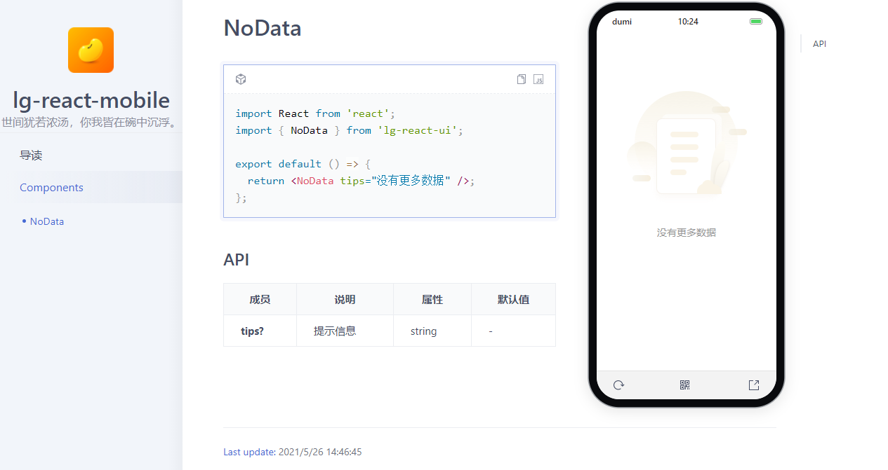

# 一、前言

目前我所在的公司，我平时除了做一些业务功能之外，还得负责开发和维护公共模块、脚手架等工作。之前封装的公共组件都是放置在 components 文件目录下，当某个项目需要的时候直接拷贝过去，这样着实不便。为了避免重复造轮子，保持组件风格上的统一，便于统一维护和管理，提高小组开发效率，所以决定基于udmi + father-build 搭建一个react组件库。

**为何选择dumi + father-build？**

- dumi 是蚂蚁金服插件化的企业级前端框架，专门为组件开发场景而生的文档工具。与father的文档打包相比，构建编译速度更快，更友好。
- father-build属于father（集文档与组件打包一体的库）的一部分。专注于组件打包。

点击前往 [dumi 官方文档 >>](https://d.umijs.org/zh-CN/guide)

# 二、环境准备

> 提示：[node](https://nodejs.org/en/) 版本必须是 10.13 或以上

```shell
$ mkdir lg-react-ui & cd lg-react-ui
$ yarn create @umijs/dumi-lib
$ yarn
$ yarn start
```

**文档目录介绍**

```markdown
- docs # 组件库文档目录
- src # 组件库源码目录
- .umirc.ts # dumi 配置文件
- .fatherrc.ts # father-build的配置文件，用于组件库打包
```

# 三、编写组件 & 引用文档

## 1. 配置官网logo

```js
// umirc.ts
import { defineConfig } from 'dumi';

const BASE_URI = 'http://localhost:8000';
export default defineConfig({
  title: 'lg-react-mobile',
  description: '世间犹若浓汤，你我皆在碗中沉浮。',
  mode: 'doc', // site: 站点模式（导航头 + 左侧菜单 + 右侧内容）。 doc：文档
  favicon: BASE_URI + '/images/favicon.ico',
  logo: BASE_URI + '/images/icon_logo.png',
  outputPath: 'docs-dist',
 
  // more config: https://d.umijs.org/config
});
```

> 提示：资源需要放在 `public` 目录下面。例如 `public/images/xxx.png`，不然会访问不了。

## 2. 移动端环境

直接安装 `dumi-theme-mobile` 至 `devDependencies` 即可：

```shell
$ yarn add dumi-theme-mobile -D
```

## 3. 编写组件

```tsx
// -- ./src/components/NoData/index.tsx
import React, { memo } from 'react';
import './index.less';

interface IProps {
  tips?: string;
}

const NoData: React.FC<IProps> = ({ tips }) => {
  return (
    <div className="lg-no-data">
      
      <div className="lg-no-data__tips">{tips}</div>
    </div>
  );
};

export default memo(NoData);
```

```less
// -- ./src/components/NoData/index.less
.lg-no-data {
  padding-top: 80px;
  text-align: center;
  &__img {
    width: 171px;
  }
  &__tips {
    color: #999999;
    font-size: 14px;
    line-height: 20px;
    margin-top: 21px;
  }
}
```
```js
//  -- ./src/index.ts
export { default as NoData } from './components/NoData';
```

## 4. 编写文档

```markdown
// -- ./src/components/NoData/index.md
# NoData

​```tsx
import React from 'react';
import { NoData } from 'lg-react-ui';

export default () => {
  return <NoData tips="没有更多数据" />;
};
​```

## API
| 成员 | 说明 | 属性 | 默认值 |
| ---- | ---- | ---- | ------ |
| **tips?** | 提示信息 | string | - |
```

## 5. 运行查看

```shell
$ yarn start
```

> 至此本地的开发环境就已经完成啦，你可以一边开发一边调试




# 四、全量加载 & 按需加载

我们知道，很多组件库是将组件统一打包，通过以下方式引入。默认情况下`father-build`也是这样的。

```tsx
import { componentName } from 'lg-react-ui';
```

常见的库（例如antd）是通过配置babel插件实现按需引入。而我希望我的组件库可以不通过配置插件，即可实现按需引入。

```jsx
import componentName from 'lg-react-ui/componentName';
```

**实现按需加载**

**# .fatherrc.ts**

作为 `father-build` 的配置文件，用于配置组件库被如何编译和编译产物的类型。一般设置 `esm: 'rollup'` 就够用了。但它缺点是会打包在一起，无法实现按需引入。因此我采用 `esm: 'babel'`。

```js
export default {
  target: 'browser',
  esm: 'babel',
  lessInBabelMode: true, // babel 模式下做 less 编译
  entry: ['src/NoData/index.tsx'],
  autoprefixer: {
    browsers: ['ie>9', 'Safari >= 6'],
  },
  pkgs: [
    // 组件依赖构建顺序， 例如 a组件依赖于b组件，那么需要先编译 b,在编译a,则 这里可以控制组件编译顺序
  ],
};
```

**# tsconfig.json**

其他属性没什么好说的，` "declaration": true`是必须配置的，生成`typescript`项目中`.d.ts`后缀的文件。

```json
{
  "compileOnSave": true,
  "compilerOptions": {
    "target": "es6",
    "module": "esnext",
    "lib": [
      "es2018",
      "dom"
    ],
    "rootDir": "./",
    "outDir": "es",
    "moduleResolution": "node",
    "importHelpers": true,
    "jsx": "react",
    "esModuleInterop": true,
    "sourceMap": true,
    "baseUrl": "./",
    "strict": true,
    "declaration": true,
    "allowJs": true,
    "forceConsistentCasingInFileNames": true,
    "noImplicitReturns": true,
    "noImplicitThis": true,
    "noImplicitAny": true,
    "strictNullChecks": false,
    "suppressImplicitAnyIndexErrors": true,
    "noUnusedLocals": true,
    "experimentalDecorators": true,
    "skipLibCheck": true,
    "paths": {
      "@/*": ["src/*"],
      "@@/*": ["src/.umi/*" ],
      "@@@/*": ["docs/*"]
    },
    "allowSyntheticDefaultImports": true,
    "typeRoots": [
      "typings",
      "node_modules/@types"
    ]
  },
  "include": [
    "src/**/*",
    "dosc/**/*"
  ],
  "exclude": [
    "node_modules",
    "lib",
    "es",
    "dist",
    "typings",
    "**/__test__",
    "test"
  ]
}
```

# 五、打包 & 发布

运行`npm run build`命令，本地打包后，将组件一个个拆分了的，为我们按需引入做好了铺垫。

运行`npm run release`，将其发布到npm上，便可以通过npm进行安装，在项目中进行使用。发布至npm需注意`version: 1.0.0`每一次不能相同。

# 六、GitHub Page

至此，我希望的组件库编写已经完成，既可以全量引入，也可以按需引入。那么如何让别人能够看到我们的组件库呢。这里我使用`github pages`。

首先在github创建一个仓库：`<用户名>.github.io`


