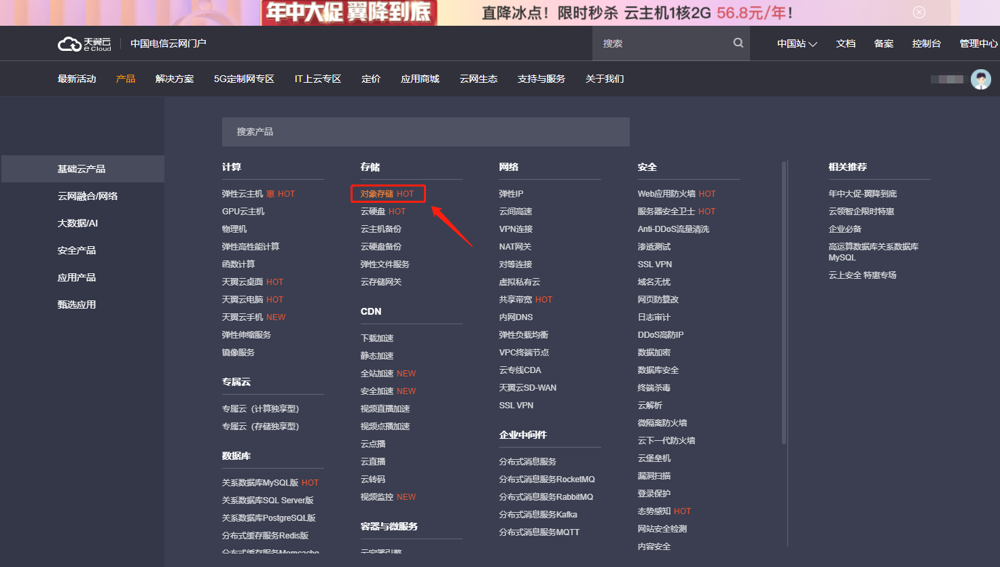
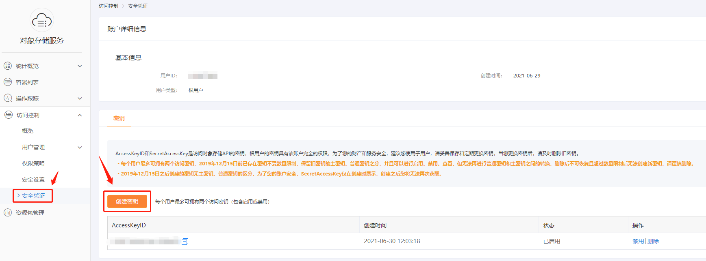
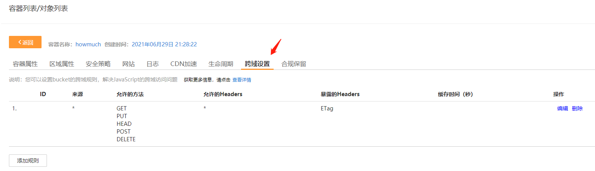

- [产品介绍 >>](https://www.ctyun.cn/h5/product2/product/10020000)

- [OOS 开发文档 >>](http://oos-cn.ctyunapi.cn/docs/oos/sdk/js/OOS%20JS%20SDK%E5%BC%80%E5%8F%91%E8%80%85%E6%8C%87%E5%8D%97-V6.pdf)

# 一、概述

最近接了一个项目，对象存储用天翼云CT-OOS，之前从未涉猎过，大多都是使用阿里云或者腾讯云。今天把使用过程做一个记录，便于后期使用时能够快速应用上去。

# 二、开通配置

1. 点击进入 [天翼云官网 >>](https://www.ctyun.cn/)，产品栏选择 `对象存储`。

   

2. 依次选择 “对象存储（经典版）” -> "经典I型【推荐】" -> 立即开通（*因为发文的时候已经开通过了，所以我这里不做具体演示。*）

3. 进入控制台 -> 创建容器 -> 根据提示操作即可

4. 创建一个用于访问的安全凭证，入口：访问控制 -> 安全凭证 -> 创建密钥

   

5. 设置CROS，在容器列表中，点击属性，选择跨域设置，添加规则如下：

   

   

# 三、前端实现

## 1. 下载OOS-SDK

[点击前往下载 @OOS JS SDK 6.0 >>](https://www.ctyun.cn/h5/help2/10000101/10001740)

文档中内置SDK文件和开发者指南，根据需要下载。下载完之后导入本地使用。

> 小锦囊：为了方便在线引用，你可以把下载下来的SDK文件直接手动上传至OOS容器内，然后直接在模板文件中通过 `<script />` 标签引入即可。

## 2. 代码示例 

1. **全局保存必要信息，便于访问：**

   ```js
   var accessKeyId = 'Your accessKeyId';
   var secretAccessKey = 'Your secretAccessKey';
   var endpoint = 'oos-sccd.ctyunapi.cn';
   var Bucket = 'appName';
   ```

   > 温馨提示：
   >
   > - [Endpoint 参考列表 >> ](https://www.ctyun.cn/h5/help2/10000101/10474062)

2. **创建OSS Client 对象**

   ```js
   const client = new window.OOS.S3({
       accessKeyId,
       secretAccessKey,
       endpoint,
       signatureVersion: 'v4', /** 固定值 */
       apiVersion: '2006-03-01',  /** 固定值 */
       s3ForcePathStyle: true,  /** 固定值 */
   });
   ```

   > 温馨提示：
   >
   > - react 开发者可在 `useEffect` 钩子函数中创建 `client` 实例并保存在 state 中便于直接访问；
   > - vue 开发者可在 `onMounted` 生命周期函数中创建 `client` 实例并保存在 state 中便于直接访问；

3. **执行上传动作**

   ```tsx
   const uploadImage = (files: FileList | null) => {
       message.loading('上传中...');
       if (files && files[0] && client) {
         const file = files[0];
         // filename
         const filePath = Tools.getFilePath(file, 'admin/user_avatar');
         client.putObject(
           {
             Bucket, // 容器名称
             Key: filePath, // 存储路径
             Body: file, // 文件对象
           },
           function (err: any, data: any) {
             if (err) {
                 console.log(err)
             } else {
               // 拼接访问链接
               const url = `https://${endpoint}/${Bucket}/${filePath}`;
               console.log(url);
             }
           },
         );
       }
     };
   ```

   > 温馨提示：
   >
   > - `Tools.getFilePath` 是我封装的 `lg-tools` 库里面的一个方法，该方法的作用就是根据一定的规则生成存储路径。