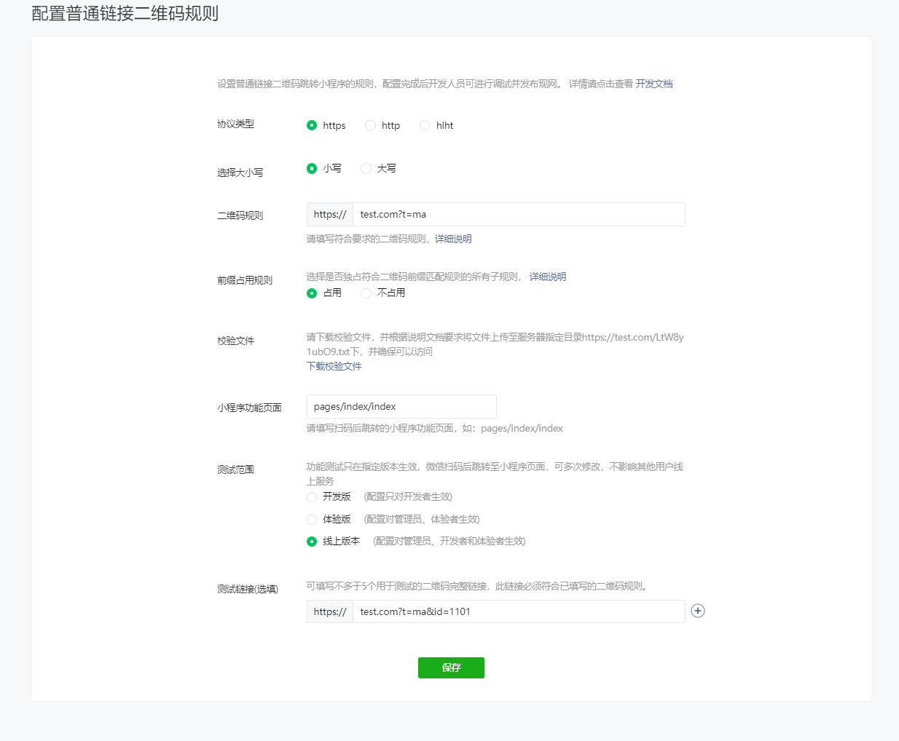

# 前言

最近开发的项目中，遇到一个特殊需求，就是在微信公众号H5中跳转至微信小程序，支付宝生活号（H5）中跳转至支付宝小程序。

# 微信公众号跳转至微信小程序

## #1. URL Scheme

微信官方支持使用 URL Scheme 的形式跳转小程序，其格式为：

```
weixin://dl/business/?t=*TICKET*'
```

在iOS系统中，系统直接可以识别这种格式 ，但是Android默认不支持，因此一般的做法是统一通过H5页面中转。

URL Scheme 的生成可参考  [这里 >>](https://developers.weixin.qq.com/miniprogram/dev/api-backend/open-api/url-scheme/urlscheme.generate.html) 

**① 首先要获取access_token**

https://api.weixin.qq.com/cgi-bin/token?grant_type=client_credential&appid=APPID&secret=APPSECRET

> 注：GET请求，替换你自己的小程序 **APPID** 和 **APPSECRET**。

**② URL Scheme通过调用如下接口**

https://api.weixin.qq.com/wxa/generatescheme?access_token=ACCESS_TOKEN

> 注：POST请求，需要替换步骤①中获得的access_token

请求示例：

```json
{
    "jump_wxa":
    {
        "path": "/pages/publishHomework/publishHomework",
        "query": ""
    },
    "is_expire":true,
    "expire_time":1606737600
}
```

返回：

```json
{
 "errcode": 0,
 "errmsg": "ok",
 "openlink": Scheme,
}
```

据 [官方文档·获取·URL Scheme·调用上限 >>](https://developers.weixin.qq.com/miniprogram/dev/framework/open-ability/url-scheme.html) 介绍，此举存在时效和个数上的限制，无法满足目前的业务需求（我们的业务体量比较大！）

因此，我们可以使用微信 **JS-SDK** 提供的 [开放标签 >>](https://developers.weixin.qq.com/doc/offiaccount/OA_Web_Apps/Wechat_Open_Tag.html) 来实现。

## #2. 开放标签

[微信开放标签 >>](https://developers.weixin.qq.com/doc/offiaccount/OA_Web_Apps/Wechat_Open_Tag.html)是微信公众平台面向网页开发者提供的扩展标签集合。通过使用微信开放标签，网页开发者可安全便捷地使用微信或系统的能力，为微信用户提供更优质的网页体验。

**① 系统要求：**

- 微信版本要求为：7.0.12及以上
- 系统版本要求为：iOS 10.3及以上、Android 5.0及以上

**② 开放对象**

- **已认证的服务号**，服务号绑定“JS接口安全域名”下的网页可使用此标签跳转任意合法合规的小程序。
- 已认证的非个人主体的小程序，使用小程序云开发的[静态网站托管](https://developers.weixin.qq.com/miniprogram/dev/wxcloud/guide/staticstorage/introduction.html)绑定的域名下的网页，可以使用此标签跳转任意合法合规的小程序。

**③ 开放标签列表**

- \<wx-open-launch-weapp>：跳转小程序

- \<wx-open-launch-app>：跳转APP

- \<wx-open-subscribe>

- \<wx-open-audio>

**④ 使用步骤**

\1. 登录 [微信公众平台](https://mp.weixin.qq.com/) 进入“公众号设置”的“功能设置”里填写“JS接口安全域名”。

\2. 在需要调用JS接口的页面引入如下JS文件：http://res.wx.qq.com/open/js/jweixin-1.6.0.js （支持https）

\3. 通过config接口注入权限验证配置并申请所需开放标签（提示：下面代码为项目截图）

```js
let url = '';
if (Validator.ios()) {
  url = Cookie.get('PREVIOUS_URL');
} else {
  url = window.location.href;
}
Api.wechat.getJsApiTicket<GD.BaseResponse<IResponse>>(url).then(res => {
  if (res && res.code === 0) {
    const { appId, timestamp, nonceStr, signature } = res.data;
    window.wx.config({
      debug: true,
      appId,
      timestamp,
      nonceStr,
      signature,
      jsApiList: ['openLocation'], // 必填，需要使用的JS接口列表，这里随便填一个即可
      openTagList: ['wx-open-launch-weapp'], // 可选，需要使用的开放标签列表，例如['wx-open-launch-weapp']
    });
    window.wx.ready(() => {
        console.log('注册config成功');
        var btn = document.getElementById('launch-btn');
        btn?.addEventListener('launch', function(e) {
            console.log('success');
        });
        btn?.addEventListener('error', function(e: any) {
            console.log('fail', e.detail);
        });
    });
    window.wx.error((err: any) => {
      console.log(err);
    });
  }
});
```

\5. 模板部分

```html
<div className="wechat-web-container">
  <p>点击以下按钮打开 “小程序示例”！</p>
  {/* @ts-ignore */}
  <wx-open-launch-weapp
    id="launch-btn"
    username="gh_b5a544da7daa"
    path="pages/index/index.html"
  >
    <script type="text/wxtag-template">
      <button
        style={{
          width: '200px',
          height: '45px',
          textAlign: 'center',
          fontSize: '17px',
          display: 'block',
          margin: '0 auto',
          padding: '8px 24px',
          border: 'none',
          borderRadius: '4px',
          backgroundColor: '#07c160',
          color: '#FFF',
        }}
      >
        打开小程序
      </button>
    </script>
    {/* @ts-ignore */}
  </wx-open-launch-weapp>
</div>
```

```less
.wechat-web-container {
  display: flex;
  flex-direction: column;
  justify-content: center;
  align-items: center;
  height: 100vh;
}
```

> 注意：
>
> - **公众号必须是 <u>认证过的服务号</u>**
> - **<u>真机上测试</u>**

## #3. 扫普通链接二维码配置

我们可以直接在公众平台控制台配置二维码地址

**① 登录公众平台 **

[入口链接 >>](https://mp.weixin.qq.com/)

依次点击菜单栏开发 ->  开发管理 -> 开发设置 -> 【扫普通链接二维码打开小程序】 -> 【添加】-> 【根据要求配置】




**解读：**

- 二维码规则指链接前缀，只要扫描二维码前缀匹配即可跳转至小程序。
- 开发者需将校验文件至于对应链接服务器。
- 测试连接可以通过query形式进行参数传递，如 id=1101。
- 此模式是直接打开小程序，没有中间页的过度，非常的丝滑。

**扩展：**

有时我们会看到对于一个二维码，微信扫描跳转微信小程序，支付宝扫描跳转支付宝小程序，其实这个实现方式也非常简单，支付宝支持同样的扫描普通链接二维码配置，我们只需要将微信和支付宝的二维码规则设置成一样的就可以了。

> 提示：必须先发布代码后再配置二维码规则。

# 支付宝生活号（H5）跳转至支付宝小程序

## #1. 扫普通链接二维码配置

我们可以直接在支付宝开放平台控制台配置二维码地址

**① 登录开放平台 **

[入口链接 >>](https://openhome.alipay.com/platform/home.htm)

依次点击菜单栏【我的应用 > 小程序】 ->  【管理 > 码管理】 -> 【关联普通二维码】 -> 【添加】

配置和微信类似。

> 提示：必须先发布代码后再配置二维码规则。
