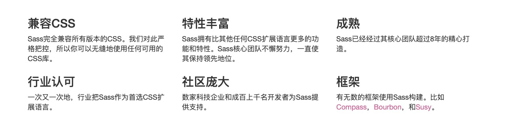

- <https://www.sass.hk/>

# # 概述

世界上最成熟、最稳定、最强大的专业级CSS扩展语言！



# # 安装

<https://www.sass.hk/install/>

```shell
$ ruby -v
ruby 2.3.7p456 (2018-03-28 revision 63024) [universal.x86_64-darwin18]
```

**\> 替换源**

因为国内网络的问题导致`gem`源间歇性中断因此我们需要更换`gem`源。

```shell
# 1.删除原gem源
$ gem sources --remove https://rubygems.org/

# 2.添加国内淘宝源
$ gem sources --add https://gems.ruby-china.com/ 

# 3.打印是否替换成功
$ gem sources -l
*** CURRENT SOURCES ***

https://gems.ruby-china.com/
```

**\> 安装less、compass**

`Ruby`自带一个叫做`RubyGems`的系统，用来安装基于`Ruby`的软件。我们可以使用这个系统来 轻松地安装`Sass`和`Compass`。要安装最新版本的`Sass`和`Compass`，你需要输入下面的命令：

```shell
$ gem install sass
$ gem install compass
```

> 提示：如mac安装遇到权限问题需加 `sudo gem install sass`

查看sass版本，确保安装成功

```shell
$ sass -v
Sass 3.4.25 (Selective Steve)
```

其他指令

```shell
# 更新sass
$ gem update sass

# 查看sass帮助
$ sass -h
```

# # 编译

## 1. cli

> 提示：首先创建目录 "./dist/static/css"

**\> 单文件转换**

```shell
$ sass  --sourcemap=none --style compressed ./src/sass/index.scss ./dist/static/css/index.css 
```

**\> 单文件监听命令 **

```shell
$ sass --watch --sourcemap=none --style compressed ./src/sass/index.scss:./dist/static/css/index.css
```

**\> 监听目录 **

```shell
$ sass --watch --sourcemap=none --style compressed ./src/sass/:./dist/static/css
```

—style

- nested：未编译显示
- expanded：编译显示
- compact：编译横向显示
- compressed：编译压缩

## 2. vscode

安装VS插件 `Easy Sass`。

配置扩展：

```json
// 自定义输出路径
"easysass.targetDir": "./dist/static/css",
// 配置编译格式
"easysass.formats": [
  {
    // 编译样式：nested、expanded、compact、compressed
    "format": "compressed",
    // 扩展名
    "extension": ".min.css"
  }
]
```


## 3、Koala 编译

如果希望用第三方自动编译器可以试试一个叫做“Koala”（考拉）的CSS预处理语言的自动化编译客户端软件，非常的方便好用支持LESS、SASS等多种语言。

官网下载地址：http://koala-app.com/index-zh.html

# # 语法

<https://www.sass.hk/docs/>

<https://www.sass.hk/guide/>


