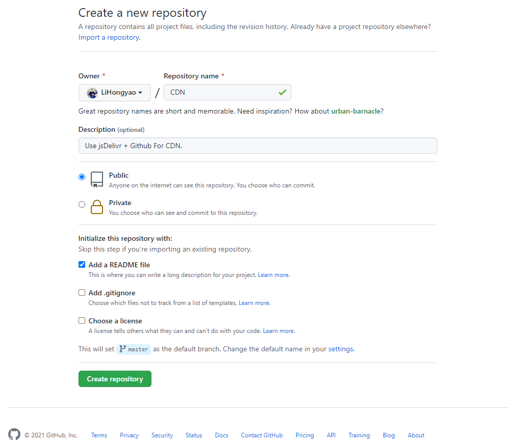
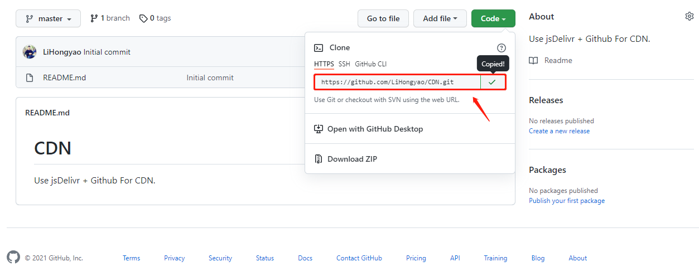
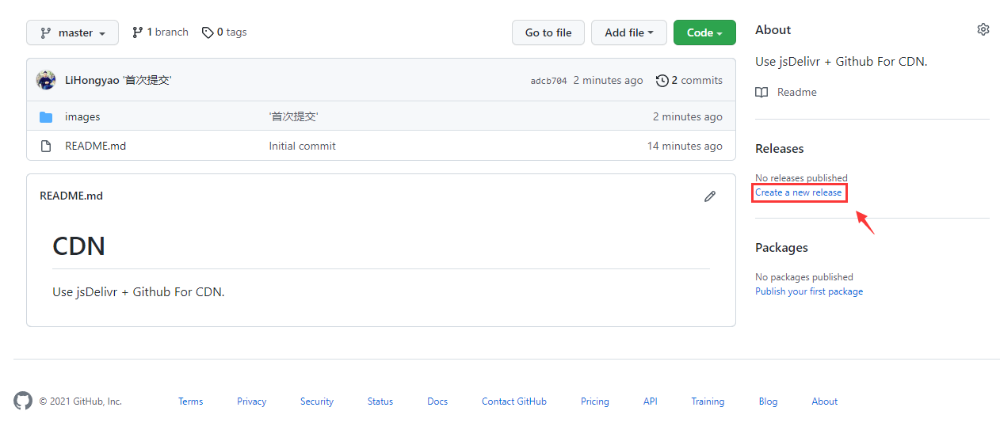
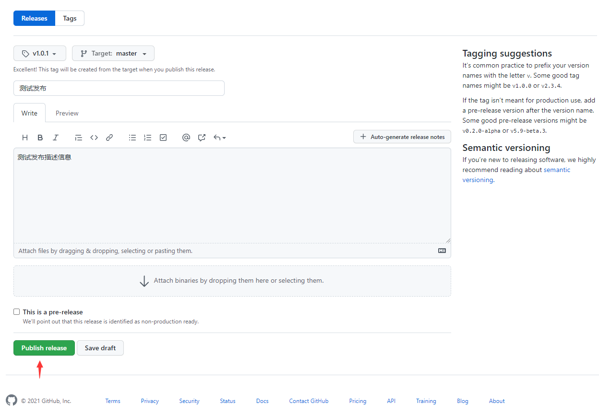

> `CDN`（Content Delivery Network，内容分发网络）是构建在网络之上的内容分发网络，依靠部署在各地的边缘服务器，通过中心平台的负载均衡、内容分发、调度等功能模块，使用户就近获取所需内容，降低网络拥塞，提高用户访问响应速度和命中率。CDN的关键技术主要有内容存储和分发技术。——百度百科

放在 Github 的资源在国内加载速度比较慢，因此需要使用 CDN 加速来优化网站打开速度，[jsDelivr](https://www.jsdelivr.com/) + [Github](https://github.com/) 便是免费且好用的CDN，非常适合博客网站使用。

# 一、新建Git仓库

在 Github 新建一个名为 CDN 的仓库，如下所示：



# 二、克隆Github仓库到本地

点击 Code，一键复制仓库地址



在本地目录右键 Git Bash Here，执行以下命令：

```shell
$ git clone 一键复制的仓库地址
```

# 三、上传资源

复制需要上传的资源到本地git仓库（注：jsDelivr不支持加载超过20M的资源），在本地git仓库目录下右键 Git Bash Here，执行以下命令：

```shell
$ git status             
$ git add .              
$ git commit -m '提交信息' 
$ git push            
```

# 四、发布仓库

点击 release 发布：



填写发布信息：



# 五、通过jsDelivr引用资源

访问语法：

```
https://cdn.jsdelivr.net/gh/用户名/仓库名@发布的版本号/文件路径
```

例如：

```
https://cdn.jsdelivr.net/gh/lihongyao/cdn/images/logo.png
https://cdn.jsdelivr.net/gh/lihongyao/cdn@1.0.0/js/request.js
```

注意：版本号不是必需的，是为了区分新旧资源，如果不使用版本号，将会直接引用最新资源，除此之外还可以使用某个范围内的版本，查看所有资源等，具体使用方法如下：

```
// 加载任何Github发布、提交或分支
https://cdn.jsdelivr.net/gh/user/repo@version/file

// 加载 jQuery v3.2.1
https://cdn.jsdelivr.net/gh/jquery/jquery@3.2.1/dist/jquery.min.js

// 使用版本范围而不是特定版本
https://cdn.jsdelivr.net/gh/jquery/jquery@3.2/dist/jquery.min.js   https://cdn.jsdelivr.net/gh/jquery/jquery@3/dist/jquery.min.js
 
// 完全省略该版本以获取最新版本
https://cdn.jsdelivr.net/gh/jquery/jquery/dist/jquery.min.js
 
// 将“.min”添加到任何JS/CSS文件中以获取缩小版本，如果不存在，将为会自动生成
https://cdn.jsdelivr.net/gh/jquery/jquery@3.2.1/src/core.min.js
 
// 在末尾添加 / 以获取资源目录列表
https://cdn.jsdelivr.net/gh/jquery/jquery/
```

