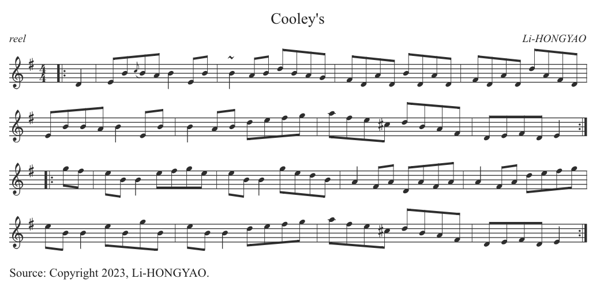

# 前言

最近公司项目有个需求：前端渲染五线谱并实现诸如修改音符、歌词、人声/伴奏同步播放等功能，调研了诸多方案，如 [abcjs](https://www.abcjs.net/)、[opensheetmusicdisplay](https://opensheetmusicdisplay.org/) 以及 [VexFlow](https://www.vexflow.com/)，综合考虑，最终选择 abcjs 实现。

# 前置知识 — 乐理 & 五线谱

推荐阅读：

1. [B站最通俗易懂的乐理课程 >>](https://www.bilibili.com/video/BV1Hg411w7n2/?spm_id_from=333.999.0.0&vd_source=b539518f043998f08c722489225f1c3c)
2. [五线谱最全知识及符号 >>](https://mp.weixin.qq.com/s?__biz=MzU5ODU2NjMwNA==&mid=2247489102&idx=2&sn=35b66d5e1c64d81876e0a741b8b3a9fa&chksm=fe436281c934eb97f1f27f41a210466f2fb768a7a52d0ffb15625d66008abfa5b8a9c5091a5a&scene=27) 

# abcjs❗️

- 官网：https://www.abcjs.net/
- 文档：https://paulrosen.github.io/abcjs/
- 演示：https://editor.drawthedots.com/
- 配置：https://configurator.abcjs.net/
- 示例：https://paulrosen.github.io/abcjs/examples/toc.html

## 概述

abcjs 是一个用于在网页上渲染和播放ABC乐谱的js库，这个库可以让我们轻松的将乐谱集成到我们的页面中。ABC是一种简单的文本表示乐谱的格式，它包括了音符、节拍、调性等信息。

以下是 `abcjs` 的一些主要特点和用途：

1. **渲染ABC格式的乐谱**：`abcjs` 可以将ABC代码渲染成可视化的乐谱，使用户能够在网页上直观地看到谱面。

2. **播放音乐**：`abcjs` 提供了播放音乐的功能，用户可以通过网页直接听到通过ABC代码表示的音乐。

3. **自定义样式**：用户可以通过 `abcjs` 的配置选项来自定义渲染后的谱面的样式，以适应不同的网页设计需求。

4. **支持丰富的ABC语法**： `abcjs` 支持 ABC 标准中的许多语法元素，使得用户能够表达出丰富的音乐信息。

5. **跨浏览器兼容性**： `abcjs` 被设计成具有良好的跨浏览器兼容性，可以在各种现代的Web浏览器中使用。

> 提示：
>
> 1. 支持 IE9+，Safari 5.1+ 以及所有现代浏览器
> 2. 合成音频部分在IE上无法工作，但在支持 **`AudioContext.resume`** 和 **`Promises`** 的任何系统上都可以工作
> 3. 官方提供了一个示例生成页面，可以根据需求定制并查看源码以便集成到项目中，[点击前往>>](https://paulrosen.github.io/abcjs/overview/example-generator.html)
> 4. ABC符号的标准文档可以在 [这里](https://abcnotation.com/wiki/abc:standard) 查阅
> 5. 关于 abcjs 的常见问题解答，可参考 [这里](https://paulrosen.github.io/abcjs/overview/faq.html)

## 安装

```shell
$ pnpm add abcjs
```

```tsx
import abcjs from "abcjs";
import 'abcjs/abcjs-audio.css';
```

> 注意：本文示例引用版本为 `v6.3.0`，由于 abcjs 每个版本的API调用都有所差异，不能保证向后兼容，因此如果你深入了解并编写依赖于它的代码，你需要在每次升级 abcjs 时重新测试。查看所有版本的更新日志参考 [这里 >>](https://github.com/paulrosen/abcjs/blob/main/RELEASE.md)

## 渲染

### renderAbc

绘制标准音乐符号的主要入口是 `ABCJS.renderAbc()`

语法形式：

```js
const visualObjs = abcjs.renderAbc(target: Selector, code: string, visualOptions?: AbcVisualParams)
```

语法解读：

- **`target`**：容器选择器。
- **`code`**：一个标准的ABC字符串（*关于ABC记谱法的更多信息，参考 [这里 >>](https://abcnotation.com/examples)*）。
- **`visualOptions`**：配置参数
- **`visualObjs`**：返回值是一个对象数组，每个对象代表一个曲调。

> **简单使用**

```tsx
import abcjs from 'abcjs';
import 'abcjs/abcjs-audio.css';
import React, { useEffect } from 'react';

const Test: React.FC = () => {
  const code = 'X:1\nK:D\nDD AA|BBA2|\n';
  useEffect(() => {
    abcjs.renderAbc('paper', code);
  }, []);
  return (
    <div className="page">
      <div id="paper"></div>
    </div>
  );
};
export default Test;
```

#### visualParams

@See https://paulrosen.github.io/abcjs/visual/render-abc-options.html

- `accentAbove`：布尔值，指定重音符号是否显示在音符上方

- `add_classes`：布尔值，表示是否为渲染的元素添加类名便于操作。 *更多信息，参考 [这里 >>](https://configurator.abcjs.net/classes)*
- `afterParsing`：在解析 ABC 音乐符号后调用
- `ariaLabel`：设置生成的 SVG 元素的 ARIA 标签，帮助屏幕阅读器用户理解内容
- `clickListener`：点击事件的 **回调函数**
- `dragColor`：拖拽颜色，用于指定拖拽元素的颜色
- `dragging`：布尔值，表示是否启用拖拽功能
- `expandToWidest`：使得曲谱每行自动伸缩适配至最大尺寸（也就是不管每行有多少音符使其宽度保持一致）
- `foregroundColor`：前景色，用于指定渲染元素的前景色
- `format`：指定格式化属性及其值
- `header_only`：表示是否仅显示标题
- `initialClef`：是否显示初始谱号
- `jazzchords`：是否使用爵士和弦符号
- `lineBreaks`：每行的音符数量，控制换行
- `lineThickness`：行厚度，用于指定谱线的厚度 ，0.3 最佳
- `minPadding`：乐谱与容器之间的最小内边距
- `oneSvgPerLine`：是否每行生成一个独立的 SVG
- `paddingbottom`：底部填充
- `paddingleft`：左侧填充
- `paddingright`：右侧填充
- `paddingtop`：顶部填充
- `print`：是否为打印优化
- `responsive`：响应式设计配置
- `scale`：乐谱的缩放比例
- `scrollHorizontal`：是否启用水平滚动
- `selectionColor`：选中音符时的颜色
- `selectTypes`：可拖动的元素类型
- `showDebug`：调试信息，如网格或框
- `staffwidth`：乐谱宽度（*它不会改变布局的位置，只会改变元素之间的间距*）
- `tablature`：指定的谱表数组
- `wrap`：指定换行配置
- ...

#### visualObjs

@See https://paulrosen.github.io/abcjs/visual/render-abc-result.html#visualobjs

调用 `renderAbc()` 函数的返回值是一个对象（TuneObject）数组，这些对象包含了许多关于被渲染的曲调的信息。如果你不对音乐进行更多的处理，可能不需要这个。这是需要传递给 `TimingCallbacks` 对象和 `CreateSynth` 对象的内容。

由于返回值是一个数组，但在许多情况下你知道只传递了一个曲调，因此，你通常会这样做：

```js
const visualObj = abcjs.renderAbc('paper', 'X:1\nK:D\nDD AA|BBA2|\n')[0]
```

`visualObj` 包含一些曲调数据和方法

##### data

- `formatting`：乐谱的格式化信息。
- `engraver`：（可选）用于排版乐谱的控制器，通过 `engraver.selectables`  可获取所有音符。
- `lines`：包含乐谱每行音符信息的数组。
- `media`：与乐谱相关的媒体信息。
- `metaText`：乐谱的元数据文本信息。
- `metaTextInfo`：乐谱元数据的信息（位置）。
- `version`：乐谱版本信息。

##### Methods

- `getTotalTime()`

  总时间，在调用 `setUpAudio` 之前返回 undefined

- `getTotalBeats()`

  总拍数，在调用 `setUpAudio` 之前返回 undefined。

- `getBarLength()`

  小节长度，全音符为1，例如，4/4 拍返回1，3/4 拍返回0.75，6/8 拍返回0.75。

- `getBeatLength()`

  拍子长度，全音符为1，例如，在4/4拍子中，返回0.25，在6/8拍子中，返回0.375，因为一拍等于三个八分音符。
  
- `getBeatsPerMeasure()`
  
  每小节的拍数，例如，在4/4拍子中，返回4，在6/8拍子中，返回2，因为一拍等于三个八分音符。
  
- `getBpm()`
  
  BPM 信息，即每分钟有多少拍，BPM 主要用于控制速度，数值越大，速度越快，默认速度180。

- `getMeterFraction()`

  拍号信息，如 3/4 拍返回 {num: 3, den: 4}

- `getPickupLength()`

  获取小节开始的节奏长度

- `getKeySignature()`

  获取调号信息

- `getElementFromChar(charIndex)`

  根据字符位置获取对应的音符对象

- `millisecondsPerMeasure()`

  根据 BPM 获取每小节的毫秒数

- `setUpAudio()`

  设置音频选项

### 添加类名

@See https://paulrosen.github.io/abcjs/visual/classes.html

在渲染曲谱时，如果配置 `{ add_classes: true }`，那么在曲谱中的所有元素将会被添加对应的类名。如果你想查看各类名在曲谱中的位置，可以参考 [这里 >>](https://paulrosen.github.io/abcjs/visual/classes.html#found-classes)。

> 提示：当你在 **Found Classes** 选择对应的类名时，可以往上滑至 **Test Tune** 查看其在曲谱中对应的位置。

了解了对应的类名，你可以通过 CSS 方便的控制元素的样式。

如果你想把所有的颜色都换成另一种颜色，你可以这样做：

```css
svg {
  fill: orange;
  stroke: orange;
}
```

如果你想控制的更细腻，比如，只调整标题的样式，可以结合类名设置：

```less
svg .abcjs-title {
  fill: orange;
  stroke: orange;
}
```

### 监听点击

@See https://paulrosen.github.io/abcjs/visual/click-listener.html

如果您想获取有关用户点击的信息，可以设置回调函数，如下所示：

```tsx
abcjs.renderAbc('paper', code, {
  add_classes: true,
  clickListener: (
    abcElem: abcjs.AbcElem,
    tuneNumber: number,
    classes: string,
    analysis: abcjs.ClickListenerAnalysis,
    drag: abcjs.ClickListenerDrag,
  ) => {},
});
```

参数解读：

- `abcElem`：表示被点击的 ABC 元素，可能是音符、休止符、调号等

- `tuneNumber`：表示被点击的乐谱的编号或索引，如果在页面上有多个乐谱同时渲染，可以通过该参数确定是哪个乐谱被点击了。

- `classes`：表示被点击元素的类名或样式信息*（注：这需要使用参数 `{ add_classes: true }` ）*

- `analysis`：表示点击事件的分析结果，可能包含有关被点击元素的更多信息

- `drag`：表示点击事件的拖动信息，包含有关拖动操作的信息，例如拖动的起始位置、目标位置以及拖拽元素下标位置等

### 选择并拖拽音符

@See https://paulrosen.github.io/abcjs/visual/dragging.html

@See https://paulrosen.github.io/abcjs/examples/dragging.html

#### Dragging

使用选项：

```tsx
{
  /** 启用拖拽 */
  dragging: true,
  /** 元素拖拽时的颜色 */
  dragColor: '#4169E1',
  /** 元素选中时的颜色 */
  selectionColor: '#FFD700',
  /** 支持拖拽的元素类型 */
  selectTypes: ['note'],
  /** 监听函数 */
  clickListener: (
    abcElem: abcjs.AbcElem,
    tuneNumber: number,
    classes: string,
    analysis: abcjs.ClickListenerAnalysis,
    drag: abcjs.ClickListenerDrag
  ) => {}
}
```

当用户点击某个元素时，如果该元素可拖动，则可以在视觉上移动它。当用户完成移动元素后，将调用点击事件监听器。虽然用户可以在界面上移动元素，但底层的音乐数据并不会因此而改变。因此，点击事件监听器函数应该修改 ABC 字符串并重新渲染乐谱，以反映用户的操作。

点击事件监听器函数的第五个参数是拖拽的结果，它是一个如下所示的对象：

```ts
{
  step: number,
  setSelection: function,
  index: number, 
  max: number,
}
```

其中：

- `step`：拖拽的步长或增量。在拖拽过程中，该值表示拖拽的相对位移量，即每次移动的距离。
- `max`：拖拽的最大值。这个属性指定了拖拽操作允许的最大值或范围。拖拽过程中，元素的位置不会超过这个最大值。
- `index`：拖拽元素的索引。这个属性用于标识正在被拖拽的元素在乐谱中的位置或索引。
- `setSelection`：这是一个函数，接受一个索引参数，用于设置拖拽的选择。在拖拽过程中，可以通过调用这个函数来设置拖拽的目标位置。

### 指法谱

@See https://paulrosen.github.io/abcjs/visual/tablature.html

> 提示：因为项目中没有用到指法谱相关的东西，所以有兴趣的同学可以点击上方的链接查看官方文档的描述。

### 代码示例

```tsx
import abcjs from 'abcjs';
import 'abcjs/abcjs-audio.css';
import React, { useEffect } from 'react';

const abcString = `
X: 1
T: Cooley's
M: 4/4
L: 1/8
R: reel
K: Emin
C: Li-HONGYAO
S: Copyright 2023, Li-HONGYAO.
|:D2|EB{c}BA B2 EB|~B2 AB dBAG|FDAD BDAD|FDAD dAFD|
EBBA B2 EB|B2 AB defg|afe^c dBAF|DEFD E2:|
|:gf|eB B2 efge|eB B2 gedB|A2 FA DAFA|A2 FA defg|
eB B2 eBgB|eB B2 defg|afe^c dBAF|DEFD E2:|
`;

const Test: React.FC = () => {
  const visualOptions: abcjs.AbcVisualParams = {
    /** 是否添加类名，你可以基于类名进行样式设置、移动或隐藏元素 */
    add_classes: true,
    /** 启用拖拽 */
    dragging: true,
    /** 元素拖拽时的颜色 */
    dragColor: '#4169E1',
    /** 元素选中时的颜色 */
    selectionColor: '#FFD700',
    /** 曲谱前景色 */
    foregroundColor: '#333333',
    /** 是否仅在第一行显示谱号 */
    initialClef: false,
    /** 调整曲谱线条粗细 */
    lineThickness: 0.3,
    /** 设置曲谱元素左侧间距（如果音符之间的间距太近，可以设置大一点） */
    minPadding: 10,
    /** 是否应将每个谱表系统渲染到不同的SVG中，这样可以更轻松地使用CSS进行控制，并且可以实现清晰的分页。 */
    oneSvgPerLine: true,
    /** 使SVG的大小适合字母大小的区域 */
    print: true,
    /** 是否仅渲染头部信息 */
    header_only: false,
    /** 在遇到警告之前，只解析曲调 */
    stop_on_warning: true,
    /** 缩放比例 */
    scale: 1,
    /** 布局宽度 */
    staffwidth: 1000,

    /** 回调函数：点击音符时触发 */
    clickListener: (
      abcElem: abcjs.AbcElem,
      tuneNumber: number,
      classes: string,
      analysis: abcjs.ClickListenerAnalysis,
      drag: abcjs.ClickListenerDrag,
    ) => {
      console.log(abcElem, tuneNumber, classes, analysis, drag);
    },
  };

  useEffect(() => {
    // -- 渲染曲谱
    const visualObj = abcjs.renderAbc('paper', abcString, visualOptions)[0];
    console.log(visualObj);
  }, []);
  return (
    <div className="page">
      <div id="paper"></div>
    </div>
  );
};

export default Test;

```

渲染效果：



## 合成音效

@See https://paulrosen.github.io/abcjs/audio/synthesized-sound.html

曲谱渲染完成之后，你可能希望播放曲谱里面的音符，abcjs 为我们提供了多种实现方式，以便适应我们的需求，在实际应用中，你也可能会搭配几种方式一起使用以实现复杂的需求场景，接下来我将会逐一介绍。

浏览器兼容性和要求：

1. 此功能在支持AudioContext、AudioContext.resume和Promises的任何浏览器中都可用，不包括IE。
2. 需要联网加载 "音色库"（sound fonts），当然也可以将其下载到本地或自定义播放。默认的声音字体来自 [这个](https://github.com/paulrosen/midi-js-soundfonts) gitHub 仓库。

这里有两个示例，仅供参考：

1. [Basic Synth](https://raw.githubusercontent.com/paulrosen/abcjs/main/examples/basic-synth.html)：基础示例，了解制作声音的最简单方法
2. [Full Syhtn](https://raw.githubusercontent.com/paulrosen/abcjs/main/examples/full-synth.html)：这是一个包含音频控件的示例

> 提示：由于合成音效的使用方式各不相同，包括是否展示乐谱的视觉表示、是否显示用户可见的音频控制按钮，以及是否需要各种定时回调，因此存在多个不同的入口点。

### CreateSynth

创建一个音频合成器，用于合成音效，返回的对象提供了控制音频播放的方法。你可以通过这个对象来配置和控制音频的生成和播放。

使用步骤：

1. 调用 `CreateSynth()` 创建实例
2. 调用 `init()` 方法加载所需音符
3. 调用 `prime()` 方法创建音频播放缓冲区
4. 对音频进行操作：如播放、暂停、停止等

> 提示：这个API主要用于无视图控件的音频播放，缺陷是无法设置 CusorControl  监听音频事件，不过可结合 timingCallbacks 弥补这个缺陷。

#### API

```tsx
const synth: abcjs.MidiBuffer = new abcjs.synth.CreateSynth();
```

```ts
interface MidiBuffer {
  /** 初始化 MIDI 缓冲区，并返回一个 Promise，表示初始化过程的状态 */
  init(params?: MidiBufferOptions): Promise<MidiBufferPromise>;
  /** 准备 MIDI 缓冲区，返回一个 Promise，表示准备过程的状态和持续时间 */
  prime(): Promise<{ status: string; duration: number }>;
  /** 开始播放 MIDI 缓冲区中的音频 */
  start(): void;
  /** 暂停播放当前的音频，并返回当前播放位置 */
  pause(): number;
  /** 继续播放之前暂停的音频 */
  resume(): void;
  /** 跳转到指定位置开始播放，可以选择使用时间单位或百分比进行跳转 */
  seek(position: number, units?: ProgressUnit): void;
  /** 停止播放当前的音频，并返回当前播放位置 */
  stop(): number;
  /** 载音频缓冲区中的音频数据，并返回音频数据的引用 */
  download(): string; // returns audio buffer in wav format as a reference to a blob
  /** 返回当前 MIDI 缓冲区是否正在运行（播放）的状态 */
  getIsRunning(): boolean;
  /** 获取音频缓冲区的实际音频数据，如果未初始化或无音频数据，则返回 undefined */
  getAudioBuffer(): AudioBuffer | undefined;
}
```

##### init(params?: MidiBufferOptions)

CreateSynth 后，必须首先调用 `init` 方法， 该方法将加载所有所需的音符，并在它们加载完成时返回一个 Promise，这可能需要一定的时间才能完成，不过，由于音符被缓存，第二次使用相似音符的曲谱创建 `CreateSynth` 时，将花费更少的时间。

> 提示：当用户在页面上进行手势之前，不能调用这个方法，因为该方法会引用一个 `AudioContext`。

MidiBufferOptions 配置下如下：

- `audioContext`：音频上下文，用于创建和处理音频 *（可选）*。
- `visualObj`：可视化对象，表示要渲染的乐谱，renderAbc 返回的结果*（可选）*。
- `sequence`：指定音频序列，表示要播放的音频序列*（可选）*。
- `millisecondsPerMeasure`：指定每小节的毫秒数*（可选）*。
- `options`：指定合成器的选项参数，控制音频合成器的行为*（可选）*。
  - `soundFontUrl`：声音字体公共URL
    - https://paulrosen.github.io/midi-js-soundfonts/abcjs/
    - http://gleitz.github.io/midi-js-soundfonts/FluidR3_GM 参考 [这里 >>](https://github.com/paulrosen/midi-js-soundfonts)
  - ...

> 提示：更多配置项，参考 [这里>>](https://paulrosen.github.io/abcjs/audio/synthesized-sound.html#init-synthoptions)

##### prime()

创建实际的缓冲区 - 由于现在所有音符都已预加载，因此它不需要网络连接。

```tsx
synth.init(...).then(() => {
    synth.prime().then((response) => {
		console.log(response.status)
        ...
    });
});
```

> 提示：`response.status` 通常为“running”。但在iOS上，有时可能是“suspended”或“interrupted”，开发时需注意判断。

#### 代码示例

```tsx
import abcjs from 'abcjs';
import 'abcjs/abcjs-audio.css';
import React, { useEffect, useRef } from 'react';

const abcString = `
X:1
T:Little Star
M:4/4
L:1/4
K:C
C C G G | A A G2 | F F E E | D D C2 | 
G G F F | E E D2 | G G F F | E E D2 | 
C C G G | A A G2 | F F E E | D D C2 |]
`;

const Test: React.FC = () => {
  // -- 相关引用
  const ref_visualObj = useRef<abcjs.TuneObject>();
  const ref_synth = useRef<abcjs.MidiBuffer>();

  // -- 渲染参数
  const visualOptions: abcjs.AbcVisualParams = { add_classes: true };

  useEffect(() => {
    // -- 渲染五线谱
    const visualObj = abcjs.renderAbc('paper', abcString, visualOptions)[0];
    // -- 创建音频合成控制器
    const synth: abcjs.MidiBuffer = new abcjs.synth.CreateSynth();
    synth
      .init({
        audioContext: abcjs.synth.activeAudioContext(),
        visualObj,
        options: { soundFontUrl: 'http://gleitz.github.io/midi-js-soundfonts/FluidR3_GM' }
      })
      .then(results => {
        console.log(results);
        synth.prime().then(response => {
          console.log(response.status);
        });
      })
      .catch(error => {
        console.log(error);
      });
    // -- 赋值引用
    ref_visualObj.current = visualObj;
    ref_synth.current = synth;
  }, []);

  return (
    <div className="page">
      <div id="paper" />
      <button
        onClick={async () => {
          const isRunning = ref_synth.current?.getIsRunning();
          isRunning && ref_synth.current?.stop();
          ref_synth.current?.start();
        }}
      >
        播放
      </button>
      <button onClick={() => ref_synth.current?.pause()}>暂停</button>
      <button onClick={() => ref_synth.current?.resume()}>恢复</button>
      <button onClick={() => console.log(ref_synth.current?.download())}>下载</button>
    </div>
  );
};

export default Test;
```

### SynthController

创建一个音频合成控制器对象（可视化小部件，你可以理解成在 \<audio> 标签上加了一个 controls 属性），允许用户控制播放，包括播放和停止按钮、进度条等。

构造函数可以在任何时候调用，包括在很多内容都尚未初始化之前：

```tsx
const synthControl = new abcjs.synth.SynthController();
```

```ts
interface SynthObjectController {
  /** 禁用或启用合成器对象 */
  disable(isDisabled: boolean): void
  /** 设置乐谱并加载到合成器中 */
  setTune(visualObj: TuneObject, userAction: boolean, audioParams?: SynthOptions): Promise<SynthInitResponse>
  /** 加载乐谱到合成器中 */
  load(selector: Selector, cursorControl?: CursorControl | null, visualOptions?: SynthVisualOptions): void
  /** 开始播放音乐 */
  play(): void
  /** 暂停播放音乐 */
  pause(): void
  /** 切换循环播放模式 */
  toggleLoop(): void
  /** 重新开始播放音乐 */
  restart(): void
  /** 设置播放进度，参数 ev 表示播放进度值 */
  setProgress(ev: number): void
  /** 设置播放速度，参数 percent 表示变速的百分比。返回一个 Promise，表示设置播放速度的状态 */
  setWarp(percent: number): Promise<void>
  /** 下载音乐文件，参数 fName 是要保存的文件名 */
  download(fName: string): void
  /** 获取音频缓冲区，返回合成音乐的音频缓冲区数据，如果不存在则返回 undefined */
  getAudioBuffer(): AudioBuffer | undefined
}
```

#### API

##### load(selector, cursorControl, visualOptions)

在DOM加载后，应该调用此函数来初始化可视化小部件（如播放、暂停按钮）。

- `selector`：要加载控件的选择器，可以是一个 CSS 选择器字符串，也可以是一个 DOM 元素
- `cursorControl`：光标控制选项 *（可选）*
- `visualOptions`：用于控制音频控件显示的配置项 *（可选）*

> 提示：虽然可以多次调用此函数，但通常只在初始化期间调用一次。

##### setTune(visualObj, userAction, audioParams)

该方法通常在每当有新的乐谱准备好加载到播放器中时被调用。这个方法允许你在播放器中加载新的乐谱，并根据需要配置播放器的行为

更多细节，参考[这里 >>](https://paulrosen.github.io/abcjs/audio/synthesized-sound.html#settune-visualobj-useraction-audioparams)

#### 代码示例

```tsx
import abcjs from 'abcjs';
import 'abcjs/abcjs-audio.css';
import React, { useEffect, useRef } from 'react';

const abcString = `
X: 1
T: Cooley's
M: 4/4
L: 1/8
R: reel
K: Emin
|:D2|EB{c}BA B2 EB|~B2 AB dBAG|FDAD BDAD|FDAD dAFD|
EBBA B2 EB|B2 AB defg|afe^c dBAF|DEFD E2:|
|:gf|eB B2 efge|eB B2 gedB|A2 FA DAFA|A2 FA defg|
eB B2 eBgB|eB B2 defg|afe^c dBAF|DEFD E2:|
`;

const Test: React.FC = () => {
  // -- 相关引用
  const ref_visualObj = useRef<abcjs.TuneObject>();
  const ref_synthControl = useRef<abcjs.SynthObjectController>();

  // -- 渲染谱子参数
  const visualParams: abcjs.AbcVisualParams = { add_classes: true };

  // -- 合成音频参数
  const cursorControl: abcjs.CursorControl = {};
  const visualOptions: abcjs.SynthVisualOptions = {
    displayLoop: true,
    displayRestart: true,
    displayPlay: true,
    displayProgress: true,
    displayWarp: true
  };
  const audioParams: abcjs.SynthOptions = {};

  // -- 合成音频
  const syntheticSound = () => {
    if (abcjs.synth.supportsAudio() && ref_visualObj.current) {
      // -- 创建SynthController
      ref_synthControl.current = new abcjs.synth.SynthController();
      // -- 加载视觉控件
      ref_synthControl.current.load('#audio', cursorControl, visualOptions);
      // -- 将曲谱加载到播放器
      ref_synthControl.current
        .setTune(ref_visualObj.current, false, audioParams)
        .then(() => console.log('Audio loading successful ~'))
        .catch(error => console.warn('Audio loading failure:', error));
    } else {
      const audioEl = document.querySelector('#audio')!;
      audioEl.innerHTML = 'Audio is not supported in this browser.';
    }
  };

  useEffect(() => {
    // -- 渲染五线谱
    ref_visualObj.current = abcjs.renderAbc('paper', abcString, visualParams)[0];
    syntheticSound();
  }, []);

  return (
    <div className="page">
      <div id="paper"></div>
      <div id="audio" style={{ maxWidth: 800 }}></div>
    </div>
  );
};

export default Test;
```

### getMidiFile

@See https://paulrosen.github.io/abcjs/audio/synthesized-sound.html#getmidifile-source-options

获取MIDI格式的音频文件（不用于音频播放的缓冲）。MIDI文件是一种标准的数字音乐文件格式，它包含了音符、乐器信息等，可以在各种音乐软件中播放和编辑。这个函数允许你从ABC音乐谱面中生成MIDI文件，以便进一步处理。

```ts
const midi = abcjs.synth.getMidiFile(source: string | TuneObject, options?: MidiFileOptions): MidiFile
```

参数解读：

- `source`：abc 字符串或者调用 renderAbc 的返回值（TuneObject）

- `options`

  - `midiOutputType`：输出类型，可选值 `encoded` `binary` `link`

    > 注意：**以下是仅在类型为 `link` 时使用的可选参数**

  - `downloadClass`

  - `preTextDownload`：出现在链接前的文本

  - `downloadLabel`：超链接文本

  - `postTextDownload`：出现在链接后的文本

  - `fileName`：文件名

> 提示：关于 getMidiFile 的示例，请参考 [这里](https://paulrosen.github.io/abcjs/audio/synthesized-sound.html#examples-1)

### playEvent(...)

@See https://paulrosen.github.io/abcjs/audio/synthesized-sound.html#playevent-pitches-gracenotes-millisecondspermeasure

将播放传递的单个事件，事件必须具有与由点击监听器返回的事件相同的格式。

```tsx
function playEvent(pitches: MidiPitches, graceNotes: MidiGracePitches | undefined, milliSecondsPerMeasure: number, soundFontUrl? : string, debugCallback?: (message: string) => void): Promise<void>
```

- `pitches`：音高信息数组，每个音高对象包含属性如下：
  - `pitch`：音高的整数值，其中中央C为60
  - `durationInMeasures`：音符的时长。例如，在4/4拍中的四分之一音符的 `durationInMeasures` 为 0.25
  - `volume`：音符的音量，范围从0到127
  - `instrument`：MIDI规范中的乐器编号
- `graceNotes`：装饰音符，与上面的格式相同，只是这些音符在主音符之前短时间内播放。而且，如果数组中有多个音符，则音符将按顺序播放
- `millisecondsPerMeasure`： 用于将 `durationInMeasures` 值转换为实际时间

代码示例：点击曲谱上的某个音符时，播放音符

```tsx
import abcjs from 'abcjs';
import 'abcjs/abcjs-audio.css';
import React, { useEffect, useRef } from 'react';
const abcString = `
X: 1
T: Cooley's
M: 4/4
L: 1/8
R: reel
K: Emin
|:D2|EB{c}BA B2 EB|~B2 AB dBAG|FDAD BDAD|FDAD dAFD|
EBBA B2 EB|B2 AB defg|afe^c dBAF|DEFD E2:|
|:gf|eB B2 efge|eB B2 gedB|A2 FA DAFA|A2 FA defg|
eB B2 eBgB|eB B2 defg|afe^c dBAF|DEFD E2:|
`;

const Test: React.FC = () => {
  // -- 相关引用
  const ref_visualObj = useRef<abcjs.TuneObject>();

  useEffect(() => {
    // -- 渲染曲谱
    ref_visualObj.current = abcjs.renderAbc('paper', abcString, {
      add_classes: true,
      clickListener: (abcElem: abcjs.AbcElem) => {
        if (abcElem.midiPitches && ref_visualObj.current) {
          // 点击播放选中的音符
          abcjs.synth.playEvent(
            abcElem.midiPitches,
            abcElem.midiGraceNotePitches,
            ref_visualObj.current.millisecondsPerMeasure(),
          );
        }
      },
    })[0];
    // -- 合成音频
    ref_visualObj.current.setUpAudio({});
  }, []);
  return (
    <div className="page">
      <div id="paper"></div>
    </div>
  );
};

export default Test;
```

### activeAudioContext()

获取当前正在被使用的 AudioContext 对象：

```tsx
const ac = ABCJS.synth.activeAudioContext();
```

### instrumentIndexToName

将标准MIDI音高索引转换为名称的数组

```tsx
console.log(abcjs.synth.instrumentIndexToName)
```

### pitchToNoteName

将标准MIDI音高索引转换为名称的数组

```tsx
console.log(ABCJS.synth.pitchToNoteName);
```

## TimingCallbacks

@See https://paulrosen.github.io/abcjs/animation/timing-callbacks.html

在 ABCJS 中，`timingCallbacks` 是与动画和时序相关的一个重要的概念。它是用于控制和处理ABC音乐谱面中的动画和时序事件的回调函数集合。这些回调函数可以在播放音乐的过程中的不同时间点触发，从而允许你在这些时间点执行自定义的操作。

1. 自定义动画效果：
   - 通过 `timingCallbacks`，你可以在音乐播放的不同阶段执行自定义的动画效果。例如，你可以在每个小节开始时或每个音符播放时触发回调来实现动画效果，让界面更生动。
2. 同步用户界面元素：
   - 如果你的应用程序中包含与音乐相关的用户界面元素，`timingCallbacks` 允许你在音乐播放的特定时刻进行同步。这可以用于在特定的音符或小节之间更新界面状态。
3. 触发其他操作：
   - 你可以使用 `timingCallbacks` 在音乐播放期间触发其他操作，例如更新进度条、显示当前播放位置等。这有助于将音乐播放与用户界面的其他部分进行协调。
4. 定制化交互：
   - 如果你想在音乐播放期间根据用户的交互作出响应，`timingCallbacks` 提供了一个机制，让你能够捕获播放的不同时刻并触发相应的操作。

### 创建实例

```ts
const timingCallbacks = new abcjs.TimingCallbacks(visualObj, params);
```

参数解读：

- `visualObj`：renderAbc 返回值（tuneObject）
- `params`：
  - `qpm`：每分钟多少拍，决定了播放速度，默认值为 abc 字符串中的 `Q`
  - `extraMeasuresAtBeginning`：在乐谱开头添加的额外小节数。这可以用于在开始播放前插入一些音符（如休止符）
  - `lineEndAnticipation`：行尾的预期时间，即在行尾结束时提前停顿的时间量。
  - `beatSubdivisions`：每个拍子的细分数。这决定了每个拍子被分成的小节数。例如，如果为4，每个拍子将被分成四个小节。
  - `beatCallback`：每个拍子开始时的回调函数。
  - `eventCallback`：用于处理特定事件的触发回调函数。
  - `lineEndCallback`：在每行结束时的回调函数。

### 常用方法

- `start(position, units)`：启动触发回调的计时器。在调用 `pause` 之后，这个函数被用于启动和恢复。
- `pause()`：暂停，之后调用 `start()` 将从它停止的地方恢复。
- `stop()`：停止，下一次调用 `start` 将从头开始。
- `reset()`：重置，将计时器移回到开始位置，这样动画就会重新开始。可以在动画运行或暂停时调用。
- `setProgress(position, units)`：改变动画的位置。
- `replaceTarget(visualObj)`：如果底层音乐动态变化，这将替换当前对象，而无需破坏对象并重新开始。

### 代码示例

```tsx
import abcjs from 'abcjs';
import 'abcjs/abcjs-audio.css';
import React, { useEffect, useRef } from 'react';

const abcString = `
X: 1
T: Cooley's
M: 4/4
L: 1/8
R: reel
K: Emin
|:D2|EB{c}BA B2 EB|~B2 AB dBAG|FDAD BDAD|FDAD dAFD|
EBBA B2 EB|B2 AB defg|afe^c dBAF|DEFD E2:|
|:gf|eB B2 efge|eB B2 gedB|A2 FA DAFA|A2 FA defg|
eB B2 eBgB|eB B2 defg|afe^c dBAF|DEFD E2:|
`;

const Test: React.FC = () => {
  // -- 相关引用
  const ref_visualObj = useRef<abcjs.TuneObject>();
  const ref_timingCallbacks = useRef<abcjs.TimingCallbacks>();

  const visualParams: abcjs.AbcVisualParams = { add_classes: true };
  const animationOptions: abcjs.AnimationOptions = {
    beatCallback(event) {
      console.log('beatCallback > ', event);
    },
    eventCallback(event: any) {
      console.log('eventCallback > ', event);
      return 'continue';
    },
    lineEndCallback(event) {
      console.log('lineEndCallback > ', event);
    },
  };

  useEffect(() => {
    // -- 渲染五线谱
    const visualObj = abcjs.renderAbc('paper', abcString, visualParams)[0];
    // -- 创建TimingCallbacks
    const timingCallbacks = new abcjs.TimingCallbacks(
      visualObj,
      animationOptions,
    );
    // -- 赋值引用
    ref_visualObj.current = visualObj;
    ref_timingCallbacks.current = timingCallbacks;
  }, []);

  return (
    <div className="page">
      <div id="paper"></div>
      <div id="audio"></div>
      <br />
      <button onClick={() => ref_timingCallbacks.current?.start()}>开始</button>
      <button onClick={() => ref_timingCallbacks.current?.pause()}>暂停</button>
      <button onClick={() => ref_timingCallbacks.current?.start()}>恢复</button>
      <button onClick={() => ref_timingCallbacks.current?.stop}>停止</button>
    </div>
  );
};

export default Test;
```

## Cursor

@See https://paulrosen.github.io/abcjs/audio/synthesized-sound.html#cursorcontrol-object

当我们在播放音频时，可能需要实时标注当前播放音符的位置（展示游标），此时我们可以在合成音频时传入一个对象（abcjs.CursorControl），它可以监听音频在播放过程中的所有事件，如：

1. 当一个音符被播放时
2. 当一个节拍到达时
3. 当音乐线接近尾声时
4. 当一个小节开始时
5. 当音乐停止时

这个对象大概长这样：

```tsx
const cursorControl: abcjs.CursorControl = {
  onReady() {},
  onStart() {},
  onFinished() {},
  onBeat(beatNumber: number, totalBeats: number, totalTime: number) {},
  onEvent(event: abcjs.NoteTimingEvent) {},
};
```

### 代码示例

再此之前，我们先封装一个游标类，便于调用。这个类主要是用于控制视图显示的，不要和上文的 CursorControl 混为一谈。

> `CursorControl.ts`

```ts
import abcjs from 'abcjs';
export default class CursorControl {
  /** svg.abcjs-cursor */
  private cursor: SVGLineElement | null;
  /** 曲谱选择器，用于定位svg 元素，与renderAbc调用使用的选择器相同 */
  private rootSelector: string;

  /**
   * 构造实例
   * @param rootSelector
   */
  constructor(rootSelector: string) {
    this.cursor = null;
    this.rootSelector = rootSelector;
    this.init();
  }

  /**
   * 初始化 svg.abcjs-cursor
   */
  public init() {
    const svg = document.querySelector(this.rootSelector + ' svg');
    this.cursor = document.createElementNS(
      'http://www.w3.org/2000/svg',
      'line',
    );
    this.cursor.setAttribute('class', 'abcjs-cursor');
    this.cursor.setAttributeNS(null, 'x1', '0');
    this.cursor.setAttributeNS(null, 'y1', '0');
    this.cursor.setAttributeNS(null, 'x2', '0');
    this.cursor.setAttributeNS(null, 'y2', '0');
    this.cursor.setAttributeNS(null, 'stroke-width', '2');
    svg?.appendChild(this.cursor);
  }

  /**
   * 取消之前选中结点的状态
   */
  public removeSelection() {
    const selector = this.rootSelector + ' .abcjs-highlight';
    const lastSelection = document.querySelectorAll(selector);
    for (let i = 0; i < lastSelection.length; i++) {
      lastSelection[i].classList.remove('abcjs-highlight');
    }
  }

  /**
   * 当播放到每一个音符或休止符时回调
   * 用于更新游标位置
   * @param ev
   * @returns
   */
  public onEvent(ev: abcjs.NoteTimingEvent) {
    // this was the second part of a tie across a measure line. Just ignore it.
    if (ev.measureStart && ev.left === null) return;

    this.removeSelection();

    // Select the currently selected notes.
    for (let i = 0; i < ev.elements!.length; i++) {
      const note = ev.elements![i];
      for (let j = 0; j < note.length; j++) {
        note[j].classList.add('abcjs-highlight');
      }
    }

    // 更新游标位置
    if (this.cursor) {
      const { left = 0, top = 0, height = 0, width = 0 } = ev;
      this.cursor.setAttribute('x1', String(left + width / 2));
      this.cursor.setAttribute('x2', String(left + width / 2));
      this.cursor.setAttribute('y1', String(top));
      this.cursor.setAttribute('y2', String(top + height));
    }
  }

  /**
   * 音频播放结束时，复位游标位置
   */
  public onFinished() {
    this.removeSelection();

    if (this.cursor) {
      this.cursor.setAttributeNS(null, 'x1', '0');
      this.cursor.setAttributeNS(null, 'y1', '0');
      this.cursor.setAttributeNS(null, 'x2', '0');
      this.cursor.setAttributeNS(null, 'y2', '0');
    }
  }
}
```

> `index.less`

```less
.abcjs-highlight {
  fill: #0a9ecc;
}
.abcjs-cursor {
  stroke: red;
}

```

#### eg：TimingCallbacks 

```tsx
import CursorControl from '@/conponents/@likg/Musics/shared/CursorControl';
import abcjs from 'abcjs';
import 'abcjs/abcjs-audio.css';
import React, { useEffect, useRef } from 'react';
import './index.scss';

const abcString = `
X: 1
T: Cooley's
M: 4/4
L: 1/8
R: reel
K: Emin
C: Li-HONGYAO
S: Copyright 2023, Li-HONGYAO.
|:D2|EB{c}BA B2 EB|~B2 AB dBAG|FDAD BDAD|FDAD dAFD|
EBBA B2 EB|B2 AB defg|afe^c dBAF|DEFD E2:|
|:gf|eB B2 efge|eB B2 gedB|A2 FA DAFA|A2 FA defg|
eB B2 eBgB|eB B2 defg|afe^c dBAF|DEFD E2:|
`;

const Test: React.FC = () => {
  // -- 相关引用
  const ref_timingCallbacks = useRef<abcjs.TimingCallbacks>();
  const ref_cursor = useRef<CursorControl | null>(null);

  // -- TimingCallbacks 配置参数
  const animationOptions: abcjs.AnimationOptions = {
    /** 监听回调 */
    eventCallback: (event: abcjs.NoteTimingEvent | null) => {
      if (event) {
        ref_cursor.current?.onEvent(event);
      } else {
        ref_cursor.current?.onFinished();
        ref_timingCallbacks.current?.stop();
      }
      return 'continue';
    },
  };

  useEffect(() => {
    // -- 渲染曲谱
    const visualObj = abcjs.renderAbc('paper', abcString, { add_classes: true })[0];
    // -- 构建 TimingCallbacks
    ref_timingCallbacks.current = new abcjs.TimingCallbacks(
      visualObj,
      animationOptions,
    );
    // -- 创建游标
    ref_cursor.current = new CursorControl('#paper');
  }, []);
  return (
    <div className="page">
      <div id="paper"></div>
      <button onClick={() => ref_timingCallbacks.current?.start(0)}>开始</button>
      <button onClick={() => ref_timingCallbacks.current?.pause()}>暂停</button>
      <button onClick={() => ref_timingCallbacks.current?.start()}>恢复</button>
      <button
        onClick={() => {
          ref_cursor.current?.onFinished();
          ref_timingCallbacks.current?.stop();
        }}
      >
        停止
      </button>
    </div>
  );
};

export default Test;
```

#### eg：SynthController

```tsx
import CursorControl from '@/conponents/@likg/Musics/shared/CursorControl';
import abcjs from 'abcjs';
import 'abcjs/abcjs-audio.css';
import React, { useEffect, useRef } from 'react';
const abcString = `
X: 1
T: Cooley's
M: 4/4
L: 1/8
R: reel
K: Emin
C: Li-HONGYAO
S: Copyright 2023, Li-HONGYAO.
|:D2|EB{c}BA B2 EB|~B2 AB dBAG|FDAD BDAD|FDAD dAFD|
EBBA B2 EB|B2 AB defg|afe^c dBAF|DEFD E2:|
|:gf|eB B2 efge|eB B2 gedB|A2 FA DAFA|A2 FA defg|
eB B2 eBgB|eB B2 defg|afe^c dBAF|DEFD E2:|
`;

const Test: React.FC = () => {
  // -- 相关索引
  const ref_visualObj = useRef<abcjs.TuneObject>();
  const ref_cursor = useRef<CursorControl | null>(null);

  // -- 音频控制器视图参数
  const visualOptions: abcjs.SynthVisualOptions = {
    displayLoop: false,
    displayRestart: true,
    displayPlay: true,
    displayProgress: true,
    displayWarp: true,
  };
  // -- 控制游标
  const cursorControl: abcjs.CursorControl = {
    onFinished() {
      ref_cursor.current?.onFinished();
    },
    onEvent(event: abcjs.NoteTimingEvent) {
      ref_cursor.current?.onEvent(event);
    },
  };

  // -- 合成音频
  const syntheticSound = () => {
    if (abcjs.synth.supportsAudio() && ref_visualObj.current) {
      // --创建SynthController;
      const synthControl = new abcjs.synth.SynthController();
      // -- 加载视觉控件
      synthControl.load('#audio', cursorControl, visualOptions);
      // -- 将曲谱加载到播放器
      synthControl
        .setTune(ref_visualObj.current, false)
        .then(() => console.log('Audio load success.'))
        .catch((error) => console.warn('Audio load fail:', error));
      // -- 创建游标
      ref_cursor.current = new CursorControl('#paper');
    } else {
      const audioEl = document.querySelector('#audio')!;
      audioEl.innerHTML = 'Audio is not supported in this browser.';
    }
  };

  useEffect(() => {
    // -- 渲染五线谱
    ref_visualObj.current = abcjs.renderAbc('paper', abcString, {
      add_classes: true,
    })[0];
  }, []);
  return (
    <div className="page">
      <div id="paper"></div>
      <div id="audio"></div>
      <br />
      <button onClick={syntheticSound}>合成音频</button>
    </div>
  );
};

export default Test;

```

# 案例

## 业务需求

1. 基于 abcstring 绘制五线谱
2. 后端通过算法返回伴奏+合成人声的音频链接
3. 点击播放时，通过游标标注播放的音符位置
4. 点击某个音符时，播放该音符

## 实现思路

1. 绘制五线谱：`abcjs.renderAbc()` 。
2. 绘制游标：由于五线谱是基于 SVG 绘制的，当五线谱绘制完成之后，可通过 `document.createElementNS` 绘制游标，初始位置放在 (0, 0) 即可。
3. 为保证伴奏、合成人声以及游标的同步，首先需确保三者的持续时间是一致的，然后通过 `<audio>` 标签赋值音频链接，并监听 `oncanplaythrough` 事件，点击播放时，判断两个链接是否都已预加载完成，当预加载完成时，同步播放即可。
4. 要实现游标的同步，可通过 `abcjs.TimingCallbacks` 实现，同时监听 `eventCallback` 回调，在该回调函数中，可实时获取当前播放的音符坐标信息，然后基于音符坐标信息动态计算游标位置。
5. 音频在播放、暂停、恢复以及停止操作时，需同步调用 `audio`、`abcjs.TimingCallbacks` 相应的API。

## 代码示例

```tsx
import CursorControl from '@/conponents/@likg/Musics/shared/CursorControl';
import abcjs from 'abcjs';
import 'abcjs/abcjs-audio.css';
import React, { useEffect, useRef } from 'react';

const abcString = `
X: 1
T: Cooley's
M: 4/4
L: 1/8
R: reel
K: Emin
S: Copyright 2023, Li-HONGYAO.
|:D2|EB{c}BA B2 EB|~B2 AB dBAG|FDAD BDAD|FDAD dAFD|
EBBA B2 EB|B2 AB defg|afe^c dBAF|DEFD E2:|
|:gf|eB B2 efge|eB B2 gedB|A2 FA DAFA|A2 FA defg|
eB B2 eBgB|eB B2 defg|afe^c dBAF|DEFD E2:|
`;

const mp3Url1 =
  'https://xingzhe-web.s3.cn-northwest-1.amazonaws.com.cn/ai-poet-compose/324b4dbf-0c79-4c3b-baef-9d2af23c2aea.wav';
const mp3Url2 =
  'https://xingzhe-web-test.s3.cn-northwest-1.amazonaws.com.cn/ai_music_classroom/media/file/铃儿响叮当 1141251 100bpm.wav';

const Test: React.FC = () => {

  // -- 是否允许播放人声
  const canPlayVoice = useRef(false);
  // -- 是否允许播放伴奏
  const canPlayAccompaniment = useRef(false);

  // -- 相关引用
  const ref_code = useRef(abcString);
  const ref_voice = useRef<HTMLAudioElement>(null);
  const ref_accompaniment = useRef<HTMLAudioElement>(null);
  const ref_timingCallbacks = useRef<abcjs.TimingCallbacks>();
  const ref_visualObj = useRef<abcjs.TuneObject>();
  const ref_cursor = useRef<CursorControl>();

  /**
   * 渲染五线谱
   * @param code
   */
  const renderAbc = (code: string) => {
    const visualOptions: abcjs.AbcVisualParams = {
      add_classes: true,
      selectionColor: 'red',
      clickListener(abcElem: abcjs.AbcElem) {
        // -- 获取点击的字符
        const { startChar, endChar } = abcElem;
        const char = ref_code.current.slice(startChar, endChar);
        const replacement = prompt('请输入新的音符：', char);
        // -- 将点击字符替换成其他字符
        const modifiedStr =
          ref_code.current.slice(0, startChar) + replacement + ref_code.current.slice(endChar);
        // -- 渲染五线谱
        const visualObj = renderAbc(modifiedStr);
        // -- 构建TimingCallbacks，用于同步游标
        ref_timingCallbacks.current = createTimingCallbacks(visualObj);
        ref_code.current = modifiedStr;
        console.log(modifiedStr);
      }
    };
    const visualObj = abcjs.renderAbc('paper', code, visualOptions)[0];
    ref_visualObj.current = visualObj;
    return visualObj;
  };
  /**
   * 构建TimingCallbacks，用于同步游标
   * @param visualObj
   */
  const createTimingCallbacks = (visualObj: abcjs.TuneObject) => {
    return new abcjs.TimingCallbacks(visualObj, {
      eventCallback: (event: abcjs.NoteTimingEvent | null) => {
        if (event) {
          ref_cursor.current?.onEvent(event);
        } else {
          ref_cursor.current?.onFinished();
          ref_timingCallbacks.current?.stop();
        }
        return 'continue';
      }
    });
  };

  const downloadMidi = () => {
    const midi = abcjs.synth.getMidiFile(abcString, {
      midiOutputType: 'encoded'
    });
    const a = document.createElement('a');
    a.setAttribute('href', midi);
    a.click();
  };

  /**
   * 兼容是否允许播放
   * 为保证伴奏和人声同步播放，必须保证两者同时预加载完成
   */
  useEffect(() => {
    if (ref_voice.current && ref_accompaniment.current) {
      ref_voice.current.oncanplaythrough = () => {
        console.log('人声ok');
        canPlayVoice.current = true;
      };
      ref_accompaniment.current.oncanplaythrough = () => {
        console.log('伴奏ok');
        canPlayAccompaniment.current = true;
      };
    }
  }, []);

  useEffect(() => {
    // -- 渲染五线谱
    const visualObj = renderAbc(abcString);
    // -- 构建TimingCallbacks，用于同步游标
    ref_timingCallbacks.current = createTimingCallbacks(visualObj);
    // -- 创建游标
    ref_cursor.current = new CursorControl('#paper');
  }, []);
  
  return (
    <div className="page">
      <div id="paper"></div>
      <div id="audio" style={{ width: 770 }}></div>
      <button
        onClick={() => {
          if (canPlayVoice.current && canPlayAccompaniment.current) {
            ref_voice.current?.play();
            ref_accompaniment.current?.play();
            ref_timingCallbacks.current?.start(0);
          }
        }}
      >
        播放
      </button>
      <button
        onClick={() => {
          ref_voice.current?.pause();
          ref_accompaniment.current?.pause();
          ref_timingCallbacks.current?.pause();
        }}
      >
        暂停
      </button>
      <button
        onClick={() => {
          ref_voice.current?.play();
          ref_accompaniment.current?.play();
          ref_timingCallbacks.current?.start();
        }}
      >
        恢复
      </button>
      <button
        onClick={() => {
          ref_voice.current?.pause();
          ref_accompaniment.current?.pause();
          ref_voice.current!.currentTime = 0;
          ref_accompaniment.current!.currentTime = 0;
          ref_timingCallbacks.current?.stop();
          ref_cursor.current?.onFinished();
        }}
      >
        停止
      </button>
      <button onClick={downloadMidi}>下载midi</button>
      <audio ref={ref_voice} src={mp3Url1} />
      <audio ref={ref_accompaniment} src={mp3Url2} />
    </div>
  );
};
export default Test;

```


​    
