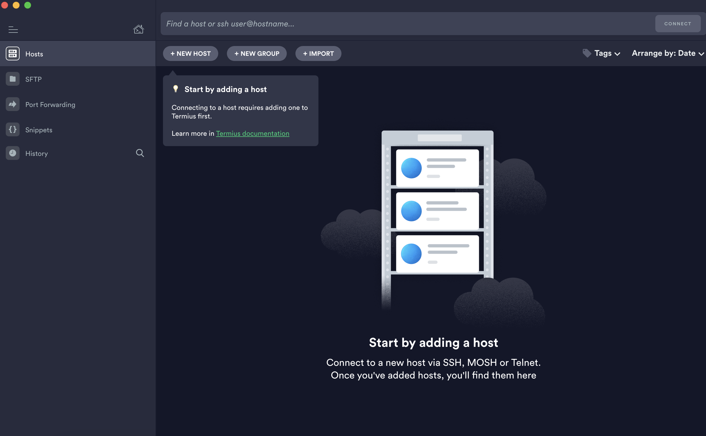
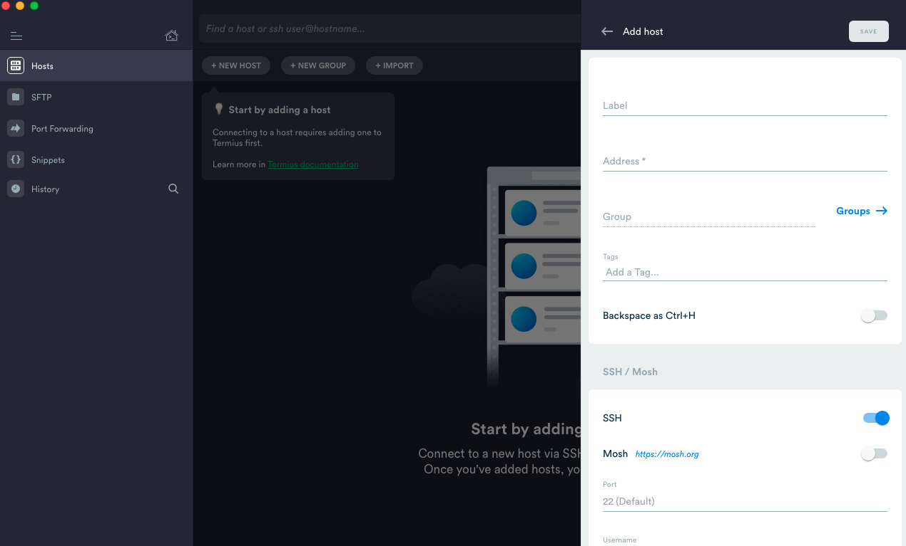
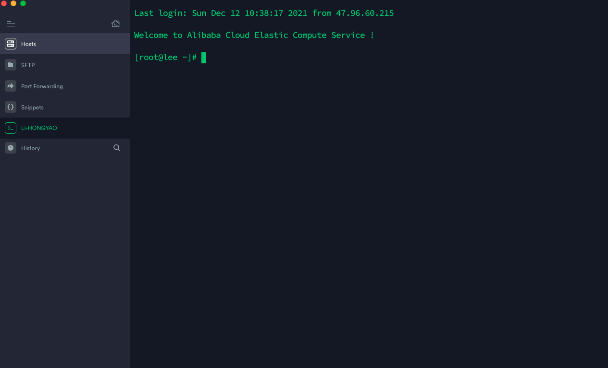
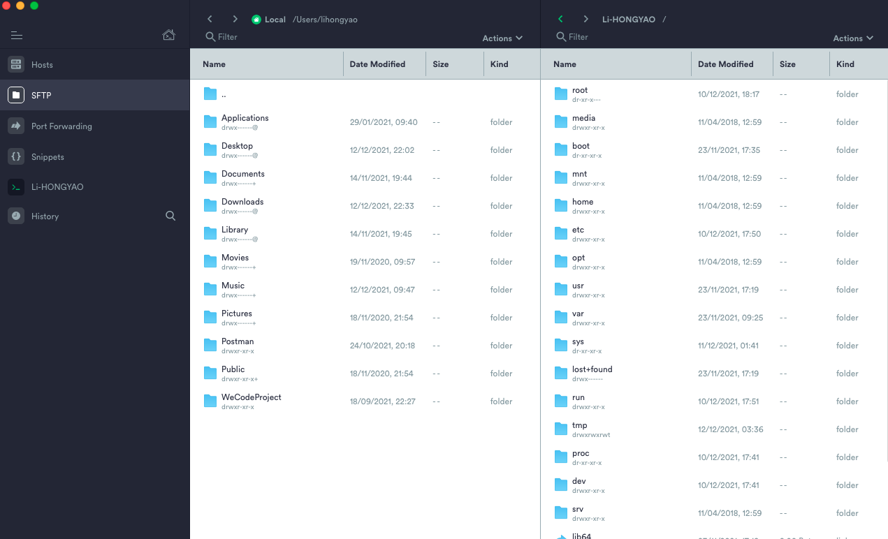

 

# 一、前期准备

参考 [新手上云指南 >>](https://help.aliyun.com/product/47310.html)

- 注册账号
- 个人实名认证

# 二、ECS服务器

## 1. 购买ECS服务器

点击 [前往云服务ECS >>](https://cn.aliyun.com/product/ecs)，点击 `立即购买`。

接下来主要给大家简单简介购买环节中改如何选择，仅供参考：


**① 基础配置**

- 付费模式：`包年包月`；

  > 包年包月：7x24小时流量稳定时选择；
  >
  > 按量付费：用多少是多少，一般用于流量在某个期间突增的情况，比如上线一个抢红包活动什么的；

- 地域及可用区：`西南1（成都）`；

- 实例规格：`2vCPU / 4GiB` ；

  > 一般个人用 **2核4G** 应该够了，根据需要来，然后在结果列表中选一个价格合适的就可以了；

- 突发性能实例：无需打开（单独收费）

- 镜像：`CentOS@^7.9 64位` 

- 存储：`ESSD云盘 40Gib`

- 快照服务：根据需要（单独收费）


**② 网络和安全组**

- 网络：默认即可；

- 公网IP：

  > 带宽计费模式：`按使用流量`
  >
  > 带宽峰值： `5M`（根据需要）

- 安全组：勾选 `80 443 22 ICMP` 即可；
- 其他默认即可；


**③ 系统配置**

根据需要选择就是了，登录凭据可以选择 `自定义密码`。

其他项默认即可，当然你可以编辑： 实例名称 / 描述 / 主机名。


**④ 分组设置 （跳过）**


**⑥ 确认订单**

- 仔细检查一下所选配置 / 在这里你也可以修改之前配置；
- 选择购买时长（是否自动续费根据个人情况来定）；
- 勾选服务协议，确认下单即可；

## 2. 控制台

登录阿里云账号 -> 进入云服务器 ECS 控制台 -> 左侧菜单栏选择实例与镜像/实例

可以查看关于实例的信息和操作； 

## 3. 连接服务器

### 3.1. windows

```shell
$ yum -y install nginx lrzsz
```

-  lrzsz：传文件用勒
-  nginx：web容器

### 3.2. macOS

推荐使用 termius

**① 点击下方链接下载安装包**

链接: https://pan.baidu.com/s/1pcGyQlOIYM6k1dvDIVgnBg 提取码: 8mts

**② 安装 -> 打开软件 -> 进入首页**



**③ 配置主机**

配置主机 点击左侧的 `Hosts`，然后再点击右下角的`NEW HOST`



配置项：

- Label：给当前配置取个名称
- Address：主机地址（公网ip）
- Port：主机端口（SSH默认22）
- Username：用于登录主机的用户名（一般为root）
- Password：用于登录主机的密码

> 提示：其他没有提到的可以不用配置

到此，基本的配置我们就完成了，接下来在Hosts页的主机列表中双击我们刚刚建好的那一项就可以登录我们的主机了，看到如下信息证明我们配置成功了：



**④ 文件操作**

点击左侧菜单栏 `SFTP` -> 进入文件操作栏



## 4. 常用操作

nginx h5：/usr/shar e/nginx/html

| 指令          | 描述                   |
| ------------- | ---------------------- |
| `whereis xxx` | 查看某个软件的安装位置 |
| `pwd xxx`     | 查看某个文件的位置     |
| `cat xxx`     | 查看某个文件的内容     |

更多命令，[参考这里 >>](https://gitee.com/lihongyao/Blogs/blob/master/004.%20macOS%EF%BC%9A%E5%B8%B8%E7%94%A8%E7%BB%88%E7%AB%AF%E6%8C%87%E4%BB%A4.md)

# 三、域名

1）前往 [万网 >>](https://wanwang.aliyun.com/?spm=5176.19720258.J_8058803260.29.32c42c4abOLIcl) 查询 & 购买 域名；

2）前往 [ICP 备案 >>](https://beian.aliyun.com/?spm=a2cmq.17629970.J_8058803260.4.f0d079fec57kO7)，点击右下角 `我要备案` 然后根据提示进行即可；

> 提示：备案需购买至少3个月的ECS服务器才让你备（万恶的捆绑销售呀）

# 四、部署Node环境

## 1. 安装Node

1）前往 [清华大学开源软件镜像站 >>](https://mirrors.tuna.tsinghua.edu.cn/)，搜索 `nodejs-release`，找到你要安装的版本，并根据系统 / 位数选择对应的压缩包，鼠标右键 `复制链接地址`。

2）切换到服务器，输入如下指令进行下载

```shell
$ curl -O https://mirrors.tuna.tsinghua.edu.cn/nodejs-release/v16.9.1/node-v16.9.1-linux-x64.tar.gz
```

3）解压下载文件

```shell
$ tar xvzf node-v16.9.1-linux-x64.tar.gz  
```

4）安装二进制文件

```shell
$ cp -af node-v16.9.1-linux-x64 /usr/local/node && ln -s /usr/local/node/bin/* /usr/bin
$ cd node-v16.9.1-linux-x64
$ cp -af bin/* /usr/bin/
$ cp -af lib/* /usr/lib/
```

5）验证

```shell
[root@lee node-v16.9.1-linux-x64]# which node
/usr/bin/node
[root@lee node-v16.9.1-linux-x64]# node -v
v16.9.1
```

6）删除不必要的文件

## 2. 安装项目

1）将 `node` 项目压缩之后传到服务器指定目录，比如我这里的项目名称是：`app-service.zip`

2）解压项目

```shell
$ tar xvzf app-service.zip
```

3）进入项目 / 安装依赖

```shell
$ cd app-service
$ npm install
```

4）执行项目

```shell
$ npm run dev
```

> 注意：

当你在执行项目时可能会出现 “/usr/codes/api-service/app-service/node_modules/.bin/egg-bin: Permission denied” 提示，此时需要给它一个权限：

```shell
$ chmod -x /usr/codes/api-service/app-service/node_modules/.bin/egg-bin
```

然后重新执行即可。

## 3. 配置nginx代理

1）编辑nginx配置文件

```shell
$ vi /etc/nginx/nginx.conf
```

2）在 `server` 中添加代理

```
location / {
	proxy_pass http://127.0.0.1:7001;
}
```

3）按 `ESC` 输入 `：wq` 保存退出，最后重启nginx即可通过官网ip访问接口了：

```shell
$ nginx -s reload
```

## 4. 安装pm2管理node项目

[pm2 >>](https://pm2.keymetrics.io/) 是一个带有负载均衡的Node应用的进程管理器, 它能够管理Node应用，还能够对应用的运行状态进行监控。

1）全局安裝 `PM2`

```shell
$ npm install -g pm2
```

2） 启动项目

```shell
$ pm2 start app.js
```

