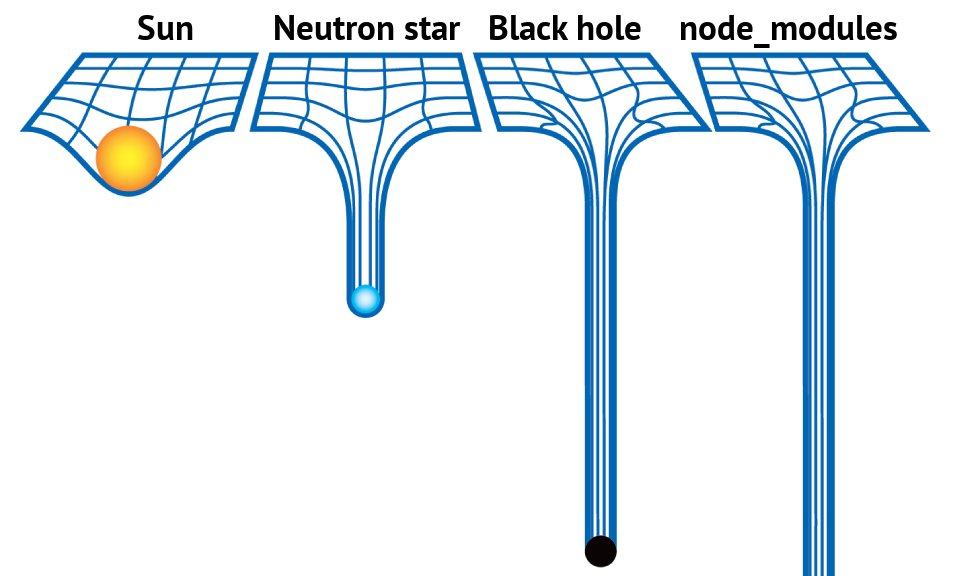
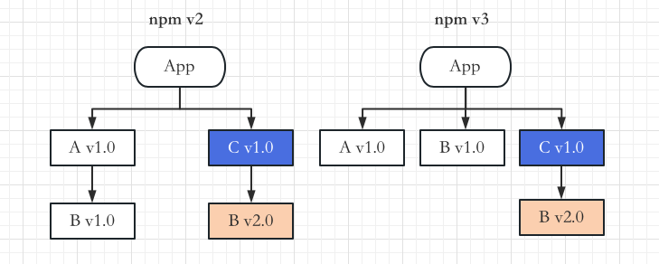
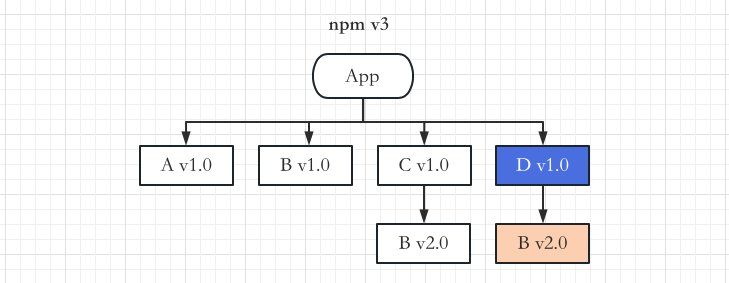
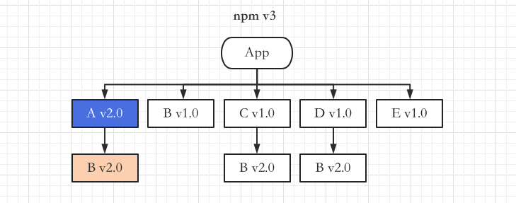
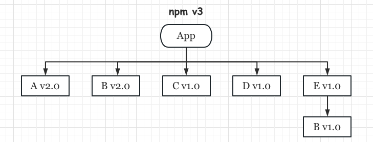
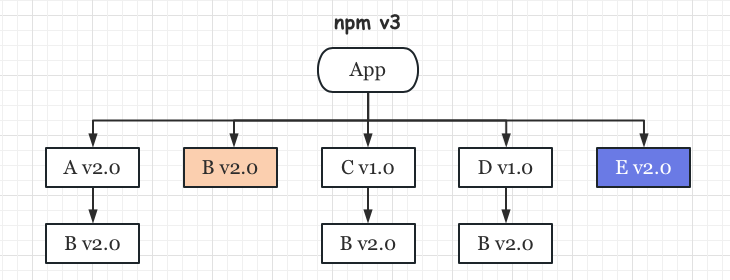
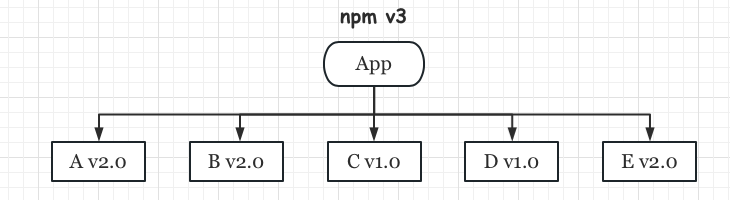
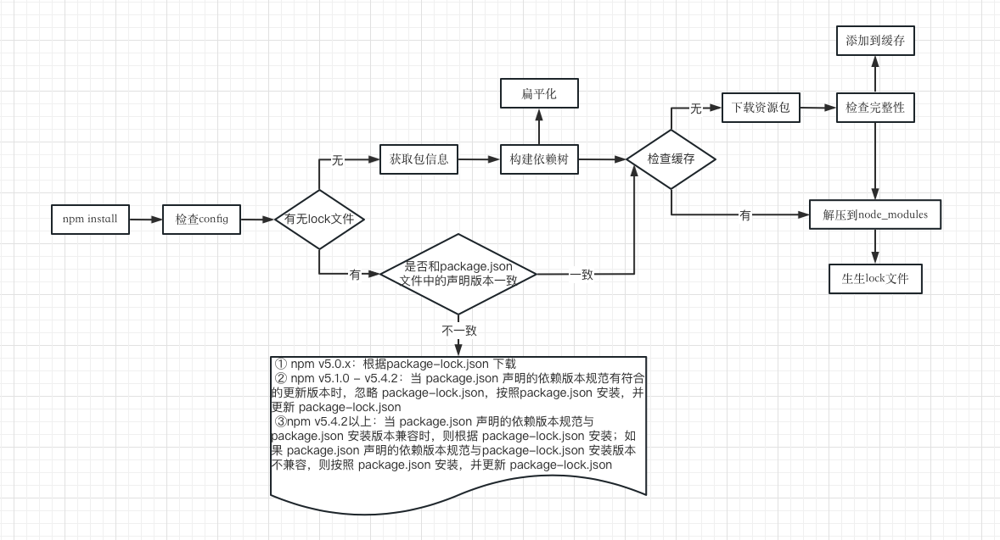
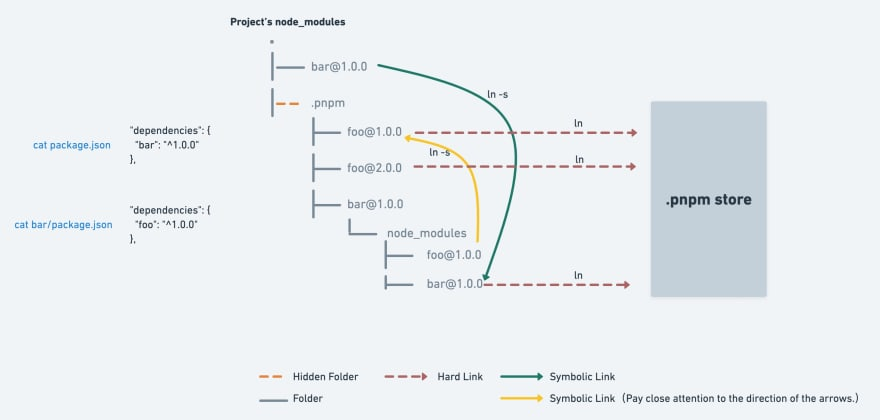

# 一、契子

之前在的面试过程中，有被问到 **npm、yarn、pnpm的实现机制及其区别**，今天刚好有时间，梳理相关的知识脉络，与君共享。

# 二、概述

作为一名前端开发者，我们总是会接触到 `xxx install`，包管理工具在日常开发中是必不可少的。在开始之前，让我们一起回顾一下包管理工具的发展历程，了解其发展脉络，感受历史红尘。


> 图片摘自：[JavaScript package manager history >>](https://time.graphics/line/602344)

> 绘图工具：[time.graphics >>](https://time.graphics/)

2010年之前，当我们需要引用一个三方库时，比如 [jQuery](https://jquery.com/)，我们做的最多的事情就是先在百度搜索jQuery进入其官网，然后下载指定版本的压缩包到本地并解压到项目中一个叫 **/libs** 的目录中，这样我们就可以引入使用它了，当然，想要更方便的话也可以直接将 CDN 链接粘贴到 HTML 中。

可能有的小伙伴会问，这样搞我们如何去进行模块化管理？版本号管理？依赖升级呢？不存在的！在当时，前端其实并没有那么复杂，这种模式勉强来说也不是不能用。

2009 年，Node.js 诞生，npm（**N**ode.js **P**ackage **M**anager）的雏形也正在酝酿。

2010年1月，npm 第一个正式版本发布

2015年5月，npm发布v3.x 版本

2016年1月，pnpm 提交诞生并发布第一个版本

2016年，yarn第一个正式版本（*0.x*）发布

# 三、正文

## 1. npm

2020年1月，npm第一个版本发布，很多人认为 npm 是 **N**ode **P**ackage **M**anager（*Node包管理工具*）的缩写，其实并不是，而且 npm 也根本不是任何短语的缩写。

> Npm 官方辟谣（原文）：
>
> #### Is "npm" an acronym for "Node Package Manager"?
>
> Contrary to popular belief, **`npm`** **is not** in fact an acronym for "Node Package Manager"; It is a recursive bacronymic abbreviation for **"npm is not an acronym"** (if the project was named "ninaa", then it would be an acronym). The precursor to **`npm`** was actually a bash utility named **"pm"**, which was the shortform name of **"pkgmakeinst"** - a bash function that installed various things on various platforms. If **`npm`** were to ever have been considered an acronym, it would be as "node pm" or, potentially "new pm".
>
> 摘自npm自述，原文地址：https://www.npmjs.com/package/npm

它的前身其实是名为 pm（pkgmakeinst） 的 bash 工具，它可以在各种平台上安装各种东西。

硬要说缩写的话，也应该是 node pm 或者 new pm。仅仅只是因为现在npm和nodeJS捆绑在一起，因此绝大多数的小伙伴会潜意识的认为npm就是  **N**ode **P**ackage **M**anager 的缩写。

> -  npm 从最早期到v7.3.0之间的博客文字参考 [npm Blog Archive](https://blog.npmjs.org/)，之后的版本可以到 github 对应的版本 [Changelog](https://docs.npmjs.com/cli/v8/using-npm/changelog) 上查找。
> - [How npm Works](https://npm.github.io/how-npm-works-docs/index.html) 讲解了npm v1/v2/v3的工作方式。

### 发展历程

2009年Node.js诞生，npm的雏形也在酝酿。

1. 2011年5月：发布 [v1.0](https://nodejs.org/es/blog/npm/npm-1-0-released)
2. 2014年9月：发布 [v2.0](https://blog.npmjs.org/post/98131109725/npm-2-0-0.html)
3. 2015年6月：发布 [v3.0](https://github.com/npm/npm/releases/tag/v3.0.0)

### 安装依赖树解析

早期的npm设计非常简单，采用 **嵌套的 node_modules 结构**，在安装依赖时需要将依赖放到项目的 node_modules 目录下，如果某个项目直接依赖模块 A，还间接依赖模块 B，则模块 B 会被下载到模块 A 的 node_modules 目录下，循环往复，最终形成一颗巨大的依赖树。

这样的 node_modules 目录虽然结构简单明了、符合预期，但对大型项目并不友好，比如其中可能有很多重复的依赖包，势必会造成空间浪费，node_modules 动辄上百兆， 最终会堪比黑洞，很快就能把磁盘占满。而且依赖嵌套的深度也会十分可怕，形成 **依赖地狱**。



> 提示：图片摘自 [https://github.com/tj/node-prune](https://github.com/tj/node-prune)

如何理解 **依赖地狱** 呢？

- 项目依赖树的层级非常深，不利于调试和排查问题
- 依赖树的不同分支里可能存在同版本的依赖。比如项目直接依赖模块 A 和模块 B，同时又都间接依赖相同版本的模块 C，那么模块 C 会重复出现在模块 A 和模块 B 的 node_modules 目录下。

这种重复安装问题浪费了较多的空间资源，也使得安装过程过慢，甚至会因为目录层级太深导致文件路径太长，最终导致在 Windows 系统下删除 node_modules 目录失败。因此在 npm v3 之后 node_modules 改成了 **扁平结构**（简单理解就是：将 **子依赖提升**来实现扁平化结构，尽量将子依赖项安装在它们的主依赖模块所在的目录中），这个过程需要构建完整的依赖关系树，因此会花费一定时间，这也是导致 npm 安装速度较慢的主要原因之一。

按照上面的例子（项目直接依赖模块 A v1.0，模块 A v1.0 还以来模块 B v1.0），我们得到如下所示的不同版本npm的安装结构图：


当项目中新添加了模块 C v1.0 依赖，而它又依赖另一个版本的模块 B v2.0 时，若版本要求不一致导致冲突，即模块 B v2.0 没办法放在项目平铺目录下的 node_modules 中，此时，npm v3 会将模块 C v1.0 依赖的模块 B v2.0 安装在模块 C v1.0 的 node_modules 目录下。此时，不同版本的 npm 的安装结构对比如下所示。



思考：为什么还有嵌套呢？

因为一个包是可能有多个版本的，提升只能提升一个，所以后面再遇到相同包的不同版本时，还是会用嵌套的方式，因此，浪费磁盘空间的问题没有得到彻底的解决，同时还增加了依赖包的 **不确定性**，比如模块 B v1.0 和 模块 B v2.0 到底提升哪一个是不确定的，这取决于安装顺序，这种不确定性为项目的依赖问题解决带来了极大的困难。

接下来，在npm v3 中，加入项目还需要依赖一个模块 D v1.0，而模块 D v1.0 也依赖模块 B v2.0，此时我们会得到如下所示的安装结构图：



这里我想请你思考一个问题：为什么是模块 B v1.0 出现在项目顶层 node_modules 目录中，而不是模块 B v2.0 出现在顶层 node_modules 目录中呢?

其实这 **取决于模块** A v1.0 和模块 C v1.0 **的安装顺序**。因为模块 A v1.0 先安装，所以模块 A v1.0 的依赖模块 B v1.0 会率先被安装在顶层 node_modules 目录下，接着模块 C v1.0 和模块 D v1.0依 依次被安装，模块 C v1.0 和模块 D v1.0 的依赖模块 B v2.0 就不得不被安装在模块 C v1.0 和模块 D v1.0 的 node_modules 目录下了。**因此，模块的安装顺序可能影响 node_modules 下的文件结构**。

假设这时项目中又添加了一个模块 E v1.0 ，它依赖模块 B v1.0 ，安装模块 E v1.0 之后，我们会得到如下所示的结构。


此时，在对应的 package.json 文件中，以来模块的顺序如下：

```json
{
	A: "1.0",
  C: "1.0",
  D: "1.0",
  E: "1.0"
}
```

如果我们想将 模块 A v1.0 的版本更新为 v2.0，并让模块 A v2.0 依赖模块 B v2.0，npm v3 会怎么处理呢？整个过程应该是这样的。

1. 删除模块 A v1.0
2. 安装模块 A v2.0
3. 留下模块 B v1.0，因为模块 E v1.0 还在依赖它
4. 将模块 B v2.0 安装在模块 A v2.0 下，因为顶层已经有模块 B v1.0 了。

更新后，安装结构图如下所示：



此时，模块 B v2.0 分别出现在了 模块 A v2.0、模块C v1.0、模块 D v1.0 下 —— 它重复存在了。

通过这一系列操作，我们可以发现，npm 包的 安装顺序对于依赖树的影响很大。模块安装顺序可能影响 node_modules 目录下的文件数量。

对于上述情况，一个更理想的安装结构应该如下所示：



回到刚刚的步骤，假设模块 E v2.0 发布了，并其它也依赖模块 B v2.0，npm v3 进行更新时会怎么做呢？

1. 删除模块 E v1.0

2. 安装模块 E v2.0

3. 删除模块 B v1.0

4. 安装模块 B v2.0 到顶层 node_modules 目录下，因为现在顶层没有任何版本的 模块 B 了


此时我们可以得到如下所示的安装结构：




明显可以看到，结构中出现了较多重复的模块 B v2.0。我们可以删除 node_modules 目录，重新安装，利用 npm 的依赖解析能力，得到一个更清爽的结构。

实际上，更优雅的方式是使用 npm dedupe 命令，更新后的安装结构图如下：



### 幽灵依赖

扁平化的结构，在一定程度上解决了嵌套过深、体积过大的问题，但又引发了新的问题，那就是 **幽灵依赖**。

也就是你明明没有声明在 dependencies 里的依赖，但在代码里却可以 require 进来，这个也很容易理解，因为都铺平了嘛，那依赖的依赖也是可以找到的，但是这样是有隐患的，因为没有显式依赖，万一有一天别的包不依赖这个包了，那你的代码也就不能跑了，因为你依赖这个包，但是现在不会被安装了，这就是幽灵依赖的问题。

### 尝试

为了验证结果，我们可以去尝试使用 npm v2/v3 版本，当然，首先我们需要使用 [nvm](https://github.com/nvm-sh/nvm)（**N**ode **V**ersion **M**anager 即 Node版本管理工具）把将node切换到指定版本

1. npm2.x：切换node版本至 v4.9.1 即可
2. npm3.x：切换node版本至 v6.11.1 即可

> 提示：
>
> - 上面关于node版本，只是大概版本，并不是说 npm 2.x 是在 node v4.9.1 时发布，只是说在这个node版本下你可以使用npm 2.x。
> - 您也可以用 [`n`](https://github.com/tj/n) 管理您的 node版本。

> 提示：

```shell
$ nvm install v4.9.1
$ nvm use v4.9.1
Now using node v4.9.1 (npm v2.15.11)
$ node -v && npm -v
v4.9.1
2.15.11
```

现在我们构建一个项目，安装依赖看效果：

```shell
$ cd Desktop && mkdir pkgtest && cd pkgtest && nvm use v4.9.1
$ npm init -y 
$ npm i mod-a@1.0.0 mod-c@1.0.0 mod-d@1.0.0
$ code .
```

> CLI：*cd Desktop && mkdir pkgtest && cd pkgtest && nvm use v4.9.1 && npm init -y && npm i mod-a@1.0.0 mod-c@1.0.0 mod-d@1.0.0 && code .*

我们通过 `tree` 指令查看一下 `node_modules` 的目录结构。

### 安装机制



## 2. yarn

yarn 是一个由 Facebook、Google、Exponent 和 Tilde 联合构建的心得 JavaScrip 包管理器。2016 年 6 月 ，yarn 正式在 github 上提交代码，初始版本为 [0.2.0](https://github.com/yarnpkg/yarn/tree/0.2.0) ，当时名字叫 **`kpm(fbkpm)`**。同年10月，Facebook在官网上发布了这篇文章：[Yarn: A new package manager for JavaScript](https://engineering.fb.com/2016/10/11/web/yarn-a-new-package-manager-for-javascript/) 

yarn 存在的意义主要是为了解决npm在 **一致性**、**安全性**、**离线安装** 和 **性能** 方面的问题，那yarn是如何解决的呢？

1. 一致性：增加lockfiles（*yarn.lock*），记录所有被安装依赖的版本号，安装时将优先参考 lock 文件提供的版本。
2. 离线安装：每次从网络下载一个依赖包时，yarn都会将其放在本地的全局缓存中，下次下载会优先在全局缓存目录中查找，如果有，将其 Copy 到当前目录下.
3. 性能问题：并行安装，无论是 npm 还是 yarn，在安装时都会执行一系列任务。npm 是按照队列执行每一个 package，当前的package 安装完成后，再去执行下一个package，而 yarn 是同步执行所有的任务。
4. **扁平化的目录结构**：节省磁盘空间

yarn 一发布，就受到了广泛的关注，当天，npm 官方博客发表了一篇 [Hello, Yarn!](https://blog.npmjs.org/post/151660845210/hello-yarn) 的文章。恭喜了 yarn 的开源，并对 yarn 团队及 facebook 为社区及整个 npm 生态做出的贡献给予了很高的评价，后续的 npm v5 也吸纳了 yarn 优秀的 lock 和缓存机制。

至此，包管理机制的大楼看似已经建成，但依旧有两朵乌云飘荡在上空：

1. 多项目之间的复用问题
2. 隐式依赖

那社区有没有解决这俩问题的思路呢？当然有，这不是 pnpm 就出来了嘛。那 pnpm 是怎么解决这俩问题的呢？继续看下文。

## 3. pnpm

pnpm（**P**erformant **npm**， **高性能** 的npm） —— 快速的，节省磁盘空间的包管理工具（摘自 [官网](https://pnpm.io/zh/)）。

它结合 **软硬链接** 与新的依赖组织方式，大大提升了包管理的效率，也同时解决了 “**幽灵依赖**” 的问题。

### 软硬链接

软链接和硬链接都是用于在文件系统中创建文件或目录之间的关联关系的概念，但它们之间有一些重要的区别：

1. **软链接（Symbolic Link）**：

   - 软链接是一个指向另一个文件或目录的引用，类似于一个**快捷方式**。
   - 它创建一个新的文件或目录项，该项包含指向原始文件或目录的路径信息。
   - 软链接可以跨文件系统、跨磁盘分区，甚至可以链接到不存在的目标。
   - 如果原始文件或目录被删除或移动，软链接将成为死链接（broken link），不再有效。
   - 软链接可以链接到文件或目录。

   软连接语法：

   ```
   ln -s [目标文件或目录] [链接名称]
   ```

   ```shell
   $ echo 'Hello, world!' > a.txt
   $ ln -s a.txt b.txt
   $ ls -li <link_names>
   ```

2. **硬链接（Hard Link）**：

   - 硬链接是多个文件目录项指向相同的物理数据块的情况。
   - 它们实际上是同一个文件的多个别名，**不占用额外的磁盘空间**。
   - 硬链接只能在同一文件系统中创建，因为它们依赖于文件系统的 inode 结构。
   - 如果删除原始文件，硬链接仍然有效，因为它们指向的是相同的数据块。
   - 硬链接只能链接到文件，不能链接到目录。

   硬链接语法：

   ```
   ln [目标文件] [链接名称]
   ```

   ```shell
   $ echo 'Hello, world!' > a.rtf
   $ ln a.rtf b.rtf
   $ ls -li <link_names>
   ```

### 优势

参考阅读：[Why should we use pnpm?](https://www.kochan.io/nodejs/why-should-we-use-pnpm.html)

请看下面这张图：



> 图片来源：[What is pnpm? Is it really so fast and space-efficient?](https://dev.to/stackblitz/what-is-pnpm-and-is-it-really-so-fast-and-space-efficient-29la)

1. 依赖会被存储在 **内容可寻址** 的存储中（*.pnpm-store*），相同版本的包只会存储一份，如果你用到了某依赖项的不同版本，只会将不同版本间有差异的文件添加到仓库。 例如，如果某个包有100个文件，而它的新版本只改变了其中1个文件。那么 `pnpm update` 时只会向存储中心额外添加1个新文件，而不会因为仅仅一个文件的改变复制整个新版本包的内容。

   📌 pnpm-store目录： *node_modules/.modules.yaml → storeDir*

2. `nodule_modules/.pnpm` 目录下以扁平结构管理每个版本包的源码内容，以硬链接的方式指向 pnpm-store 中的文件地址。

3. `node_modules` 下安装的包为树形结构，符合node就近查找规则，以软连接方式将内容指向 `node_modules/.pnpm` 中的包。

所以，每个包的寻找都要经过三层结构：

`node_modules/package-a` → 软连接 → `node_modules/.pnpm/package-a@1.0.0/node_modules/package-a` → 硬链接 → `~/.pnpm-store/v3/files/00/xxxxxx`

经过这三层寻址带来了什么好处呢？为什么是三层，而不是两层或者四层呢？

> **依赖文件三层寻址的目的**

**第一层**

第一层寻找依赖是 `nodejs` 或 `webpack` 等运行环境或打包工具进行的，他们在 `node_modules` 文件夹中遵循 **就近原则** 寻找依赖，所以第一层依赖文件势必要写在最外层的 `node_modules` 下，一方面遵循依赖寻找路径，另一方面没有将依赖都拎到上级目录，也没有将依赖打平，目的就是还原最语义化的 `package.json` 定义：即定义了什么包就能依赖什么包（解决幽灵依赖的问题），每个包的子依赖也从该包内寻找（解决了多版本管理的问题），同时也使 `node_modules` 拥有一个稳定的结构，即该目录组织算法仅与 `package.json` 定义有关，而与包安装顺序无关。

如果止步于此，这就是 `npm@2.x` 的包管理方案，但正因为 `npm@2.x` 包管理方案最没有歧义，所以第一层沿用了该方案的设计。

**第二层**

从第二层开始，就要解决 `npm@2.x` 设计带来的问题了，主要是包复用的问题。所以第二层的 `node_modules/package-a` > `node_modules/.pnpm/package-a@1.0.0/node_modules/package-a` 寻址利用**软链接**解决了代码重复引用的问题。相比 `npm@3` 将包打平的设计，软链接可以保持包结构的稳定，同时用文件指针解决重复占用硬盘空间的问题。

若止步于此，也已经解决了一个项目内的包管理问题，但项目不止一个，多个项目对于同一个包的多份拷贝还是太浪费，因此要进行第三步映射。

**第三层**

第三层映射 `node_modules/.pnpm/package-a@1.0.0/node_modules/package-a` >  `~/.pnpm-store/v3/files/00/xxxxxx`（硬链接），可以看到，此时已经脱离当前项目路径，指向一个全局统一管理路径了，这正是跨项目复用的必然选择，然而 `pnpm` 更进一步，没有将包的源码直接存储在 pnpm-store，而是将其拆分为一个个文件块，请继续往下看。

> **pnpm-store的组织方式**

pnpm 在第三层寻址时采用了硬链接方式，在安装依赖时，pnpm并没有将包的源码直接存储在 pnpm-store，即这个硬链接目标文件并不是普通的 npm 包源码，而是一个哈希文件，这种文件组织方式叫做 content-addressable（**基于内容的寻址**）。

简单来说，基于内容的寻址比基于文件名寻址的好处是，即便包版本升级了，也仅需存储改动 Diff，而不需要存储新版本的完整文件内容，在版本管理上进一步节约了存储空间。

pnpm-store 的组织方式大概是这样的：

```
~/.pnpm-store
- v3
  - files
    - 00
      - 0a3f1b430ea60805078...
      - 0aa8630182276efd8b6...
      ..
    - 01
```

也就是采用文件内容寻址，而非文件位置寻址的存储方式。之所以能采用这种存储方式，是因为 NPM 包一经发布内容就不会再改变，因此适合内容寻址这种内容固定的场景，同时内容寻址也忽略了包的结构关系，当一个新包下载下来解压后，遇到相同文件 Hash 值时就可以抛弃，仅存储 Hash 值不存在的文件，这样就自然实现了开头说的，`pnpm` 对于同一个包不同的版本也仅存储其增量改动的能力。

> **结论**

1. 安装快速，是npm的两倍
   - pnpm：依赖解析 → 根据依赖计算 node_modules 目录结构 → 链接依赖项（如果已经安装，直接链接）
   - 传统安装过程：依赖解析 → 获取依赖包 → 将所有依赖项写入 node_modules
2. 节省磁盘空间：基于软硬链接实现
3. 解决幽灵依赖问题：非扁平的目录结构
4. 支持 monorepos

## 4. 总结

1. npm2/3 是通过嵌套的方式管理 node_modules 的，会有同样的依赖复制多次的问题。
2. npm3+ 和 yarn 是通过扁平化的方式来管理 node_modules 的，解决了嵌套方式的部分问题，但是引入了幽灵依赖的问题，并且同名的包只会提升一个版本的，其余的版本依然会复制多次。
3. pnpm 则是用了另一种方式，不再是复制了，而是从全局 store 硬连接到 node_modules/.pnpm，然后之间通过软链接来组织依赖关系，这样不但节省磁盘空间，也没有幽灵依赖问题，安装速度还快，从机制上来说完胜 npm 和 yarn。

> 附件：[npm-compare：npm/yarn/pnpm >>](https://npm-compare.com/pnpm,npm,yarn/#timeRange=THREE_YEARS)

# 四、🤔 tyarn/cnpm/npx ❓

# 五、参考

「1」阿汤哥的鼎.[现代包管理器的进化史](https://zhuanlan.zhihu.com/p/496454042).知乎.2022-04-11

「2」wxsm.[Node.js 包管理器发展史](https://wxsm.space/2021/npm-history/).2021-11-08

「3」zxg_神说要有光.[pnpm 是凭什么对 npm 和 yarn 降维打击的](https://juejin.cn/post/7127295203177676837).稀土掘金.2022-08-02

「4」reahink.[JavaScript 包管理器简史（npm/yarn/pnpm）](https://zhuanlan.zhihu.com/p/451025256).知乎.2022-10-18

「5」Leecason.[深入浅出 npm & yarn & pnpm 包管理机制](https://zhuanlan.zhihu.com/p/526257537).知乎.2022-06-09

「6」印章.[前端包管理进化简史](https://zhuanlan.zhihu.com/p/589515346).知乎.2023-05-25

「7」虎妞先生.[众生皆苦，我选 pnpm](https://xie.infoq.cn/article/64995cac95acef13c5eb62bc9).InfoQ.2023-02-10

「8」黄子毅.[精读《pnpm》](https://cloud.tencent.com/developer/article/2170866).腾讯云/开发者社区.2022-11-21

「9」侯策.前端架构师·基础建设与架构设计思想.电子工业出版社.中国工信出版集团

