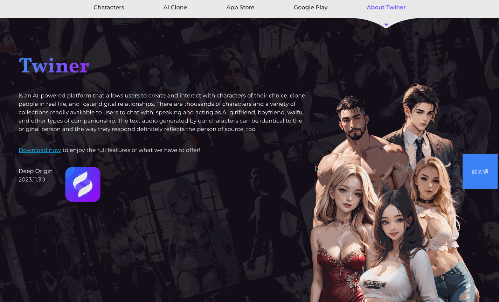
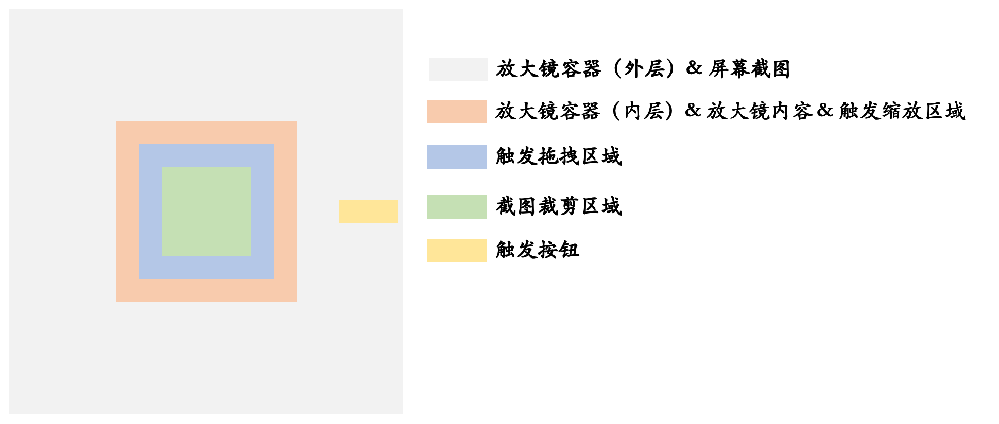

# 概述



最近接到任务，需实现【网页】放大镜的效果，百度搜索 【js 放大镜】关键字，千篇一律的都是一些仿淘宝/京东等电商网站中查看规格大图的效果实现，根本无法满足我的需求，于是自己花了点时间调研实现，这里主要做一个记录，并分享给大家。

# 需求描述

开始之前，我们还是简单梳理一下需求：

1. 屏幕右下角放置操作按钮，用于启用或禁用放大镜。
2. 启用放大镜时：
   - 页面禁止交互（如滚动）
   - 放大镜默认展示在屏幕正中间
   - 放大镜支持调整尺寸（四个方向，即上、右、下、左）
   - 放大镜支持拖拽以展示不同的内容
   - 放大镜的内容直接呈现在放大镜元素中

需求看似简单，但实际上需要注意的点特别多，这里首先抛出几个问题供大家思考：

1. 启用放大镜时，如何截取屏幕当前可视区域的内容，并将其作为放大镜的图片源数据？
2. 由于网页是相对于屏幕左上角开始布局的，放大镜可以很好的处理向右和向下的尺寸调整，那如果是向左或者向上呢？
3. 拖拽放大镜时，如何处理边界？
4. ....

# 思路

1. 为了便于复用，将放大镜逻辑封装成类，样式单独抽离，后续使用时直接引入相应的脚本和样式即可。

2. 在屏幕放置悬浮按钮，用于激活放大镜（做成开关效果），当用户点击悬浮按钮，挂载放大镜，再次点击，卸载放大镜。

   挂载放大镜时：

   - 禁止滚动：可设置 `body` 标签的 `overflow` 属性为 `hidden`。
   - 禁止交互：显示透明遮罩层。
   - 截取屏幕：通过 [html2canvas](https://html2canvas.hertzen.com/) 截取当前可视区域的内容作为放大镜的源数据。
   - 创建元素：基于浏览器的 DOM API 创建放大镜相关的必要元素（后文讲解）。

   卸载放大镜时：

   - 设置 `body` 标签的 `overflow` 属性为 `auto`，使其支持滚动。
   - 移除遮罩
   - 移除事件监听

3. 处理放大镜的拖拽和缩放，可基于 `mousedown` `mousemove` `mouseup`  事件，计算尺寸和坐标实现。

4. ...

> 更多细节，请参考具体实现。

# 实现

> 提示：
>
> 1. 本文主要讲解网页放大镜的实现，页面内容及全局样式不会在本文中讲解，各位看官可根据实际需求布局你的页面。
> 2. 为了更好的理解，本文主要使用原生 `HTML` `CSS` `JavaScript` 实现。

## 准备工作

首先请按如下目录解构创建项目：

```ini
.
├── libs 
│   ├── magnifier.css # 放大镜相关样式     
│   └── magnifier.js  # 放大镜核心逻辑      
├── index.css  # 全局样式
├── index.html # 布局
└── index.js   # 脚本
```

## 布局元素



首先分析实现放大镜功能所需的必要元素：

- 触发按钮（triggerButton）：悬浮（固定定位）在屏幕右侧，控制放大镜的挂载和卸载。
- 放大镜容器·外层（container）：遮罩，悬浮铺满屏幕可视区域，结合页面 `overflow` 属性可禁止用户交互。
- 屏幕截图（screenshots）：源数据，使用 canvas 存储，便于裁剪，悬浮铺满屏幕可视区域，设置 `opacity` 为 `0`。
- 放大镜容器·内层 / 触发缩放区域（magnifier）：控制放大镜容器大小和位置，同时用户鼠标在此区域按下，激活缩放状态。
- 触发拖拽区域（dragBox）：当用户鼠标在此区域按下，激活拖拽状态。
- 放大镜内容（scaleImg）：放大镜呈现内容
- 截图裁剪区域（cropBox）：放大镜的内容主要根据此区域的内容呈现

> 提示：
>
> 1. 可能大家会有疑问，为什么不把放大镜的内容作为 `magnifier` 的背景图呈现，而是单独使用 `scaleImg` 来显示呢？这是因为在实现的过程中，使用背景图呈现在更新放大镜内容时会比较卡，其次作为背景图会使得内容变得模糊，当然如果大家有什么更好的方案，也可以在评论区留言。
> 2. 关于 `cropBox`，它的作用主要是用于收集屏幕内容作为放大镜呈现内容。
> 3. 上述必要元素中，除了 触发按钮 之外的其他元素，都是在挂载放大镜时基于 **DOM API** 动态创建的。

这些元素的层级关系如下：

```html
div.triggerButton
div.container
	- canvas.screenshots
  - div.magnifier
			- div.dragBox
			- img.scaleImg
  - div.cropBox
```

相关初始代码如下：

> `magnifier.js`

```js
class Magnifier {
  // -- 构造函数
  constructor() {}
  // -- 挂载
  mount = () => {};
  // -- 销毁
  destory = () => {};
}
```

> `magnifier.css`

```css
/* 外层容器·遮罩层 */
.magnifier {
  width: 100%;
  height: 100%;

  position: fixed;
  top: 0;
  left: 0;

  z-index: 10000;
}

/* 屏幕截图 */
.magnifier__screenshots {
  width: 100%;
  height: 100%;

  position: absolute;
  top: 0;
  left: 0;

  /* 作为放大镜源数据，无需呈现给用户 */
  opacity: 0;
  z-index: -1;
}

/* 裁剪区域 */
.magnifier__cropBox {
  width: 100px;
  height: 100px;
  box-sizing: border-box;
  border: 1px dashed red;
  /** 由于裁剪区域在拖拽区域之上，为了不影响拖拽事件，需设置此属性用于事件穿透 */
  pointer-events: none;

  position: absolute;
  top: 0;
  left: 0;
}

/* 放大镜 & 缩放区域 */
.magnifier__magnifier {
  box-sizing: border-box;
  border: 2px dashed #7b68ee;
  /* 拖拽区域在此元素内部，这里是让拖拽元素在内部居中 */
  display: flex;
  justify-content: center;
  align-items: center;

  cursor: crosshair;

  position: absolute;
  top: 0;
  left: 0;
}

/* 拖拽元素 */
.magnifier__dragBox {
  box-sizing: border-box;
  border: 1px dashed green;
  cursor: move;
}

/* 放大镜呈现内容 */
.magnifier__scaleImg {
  pointer-events: none;
  width: 100%;
  height: 100%;
  position: absolute;
  top: 0;
  left: 0;
  z-index: -1;
}
```

> `index.html`

```html
<!DOCTYPE html>
<html lang="zh-CN">
  <head>
    <meta charset="UTF-8" />
    <meta name="viewport" content="width=device-width, initial-scale=1.0" />
    <title>网页放大镜</title>
    <link rel="stylesheet" href="./libs/magnifier.css" />
    <link rel="stylesheet" href="./index.css" />
  </head>
  <body>
    <!-- 页面内容（根据需要自行设置） -->
    <script src="./libs/magnifier.js"></script>
    <script src="./index.js"></script>
  </body>
</html>
```

> 提示：没体现的代码可以先不管，后续会慢慢完善。


## 触发按钮

> `index.html`

首先在页面中添加悬浮按钮标签：

```html
<!-- 放大镜 -->
<div class="triggerButton">放大镜</div>
```

> `index.css`

接着在全局样式文件中设置按钮样式：

```css
.triggerButton {
  cursor: pointer;
  background: #4169E1;
  color: #fff;
  padding: 8px 12px;
  position: fixed;
  right: 24px;
  top: 50%;
  z-index: 1;
}
```

> `index.js`

最后在脚本文件中设置按钮点击事件，用于控制放大镜的挂载和卸载：

```js
// -- 触发按钮
const triggerButton = document.querySelector(".triggerButton");
// -- 创建放大镜实例
const magnifier = new Magnifier();
// -- 标识放大镜激活状态
let isActive = false;
triggerButton.onclick = function () {
  // 切换状态
  isActive = !isActive;
  if (isActive) {
    // 挂载放大镜
    magnifier.mount();
  } else {
    // 移除放大镜
    magnifier.destroy();
  }
};
```

接下来，我们的关注点将放在 `Magnifier` 类的实现上。

## 挂载 / 卸载

首先在构造函数中，定义实现放大镜所需的属性：

```js
constructor() {
  // -- 类名前缀
  this.prefixCls = "magnifier";
  // -- 放大镜初始尺寸
  this.initialSize = { width: 200, height: 200 };
  // -- 放大镜最小尺寸
  this.minSize = { width: 100, height: 100 };
  // -- 放大镜最大尺寸
  this.maxSize = { width: 500, height: 500 };
  // -- 四周触发拖拽缩放的间距
  this.resizeSpacing = 20;
  // -- 缩放比例
  this.scaleRatio = 2;

  // -- 标识当前是否激活缩放状态
  this.isResizing = false;
  // -- 标识是否从放大镜左侧/上放激活缩放状态
  this.isResizeTopLeft = false;
  // -- 标识当前是否激活拖拽状态
  this.isDragging = false;
  // -- 记录拖拽时的坐标
  this.originalPoint = { x: 0, y: 0 };
  // -- 记录拖拽的尺寸
  this.originalSize = { width: 0, height: 0 };
  // -- 标识原始偏移位置
  this.originalOffset = { x: 0, y: 0 };

  // -- 容器元素
  this.container = null;
  // -- 屏幕截图
  this.screenshots = null;
  // -- 放大镜
  this.magnifier = null;
  // -- 拖拽区域
  this.dragBox = null;
  // -- 放大镜呈现内容
  this.scaleImg = null;
  // -- 截图裁剪区域
  this.cropBox = null;
}
```

挂载函数：

```js
mount = () => {
  // -- 移除容器（避免重复调用挂载函数）
  this.container && this.destroy();
  // -- 禁止页面滚动
  document.body.style.overflow = "hidden";
  // -- 创建必要元素
  this._createElement();
  // -- 计算放大镜初始位置（屏幕正中间）
  this._calcMagnifierPosition();
  // -- 计算裁剪区域初始位置（屏幕正中间）
  this._calcCropBoxPosition();
  // -- 获取屏幕截图
  this._getScreenshots();
  // -- 绑定事件（触发开始拖拽/缩放）
  // ...
};
```

> 提示：绑定事件部分的代码后续再填充。

解析 `_createElement()`：

```js
_createElement = () => {
  // 1. 创建外层容器（遮罩层）
  const container = document.createElement("div");
  container.setAttribute("data-html2canvas-ignore", "true");
  container.classList.add(this.prefixCls);
  this.container = container;
  // 2. 创建裁剪元素
  const cropBox = document.createElement("div");
  cropBox.style.width = this.initialSize.width / this.scaleRatio + "px";
  cropBox.style.height = this.initialSize.height / this.scaleRatio + "px";
  cropBox.classList.add(this.prefixCls + "__cropBox");
  this.cropBox = cropBox;
  // 3. 创建放大镜元素 & 缩放区域元素
  const magnifier = document.createElement("div");
  magnifier.style.width = this.initialSize.width + "px";
  magnifier.style.height = this.initialSize.height + "px";
  magnifier.classList.add(this.prefixCls + "__magnifier");
  this.magnifier = magnifier;
  // 4. 创建拖拽区域元素
  const dragBox = document.createElement("div");
  dragBox.classList.add(this.prefixCls + "__dragBox");
  dragBox.style.width = "calc(100% - " + this.resizeSpacing * 2 + "px)";
  dragBox.style.height = "calc(100% - " + this.resizeSpacing * 2 + "px)";
  this.dragBox = dragBox;
  // 5. 创建放大图片
  const scaleImg = document.createElement("img");
  scaleImg.classList.add(this.prefixCls + "__scaleImg");
  this.scaleImg = scaleImg;
  // 6. 挂载元素
  magnifier.appendChild(scaleImg);
  magnifier.appendChild(dragBox);
  container.appendChild(magnifier);
  container.appendChild(cropBox);
  document.body.appendChild(container);
};
```

> 提示：
>
> 1. `container` 容器新增 `data-html2canvas-ignore` 属性是为了防止 `html2canvas` 截取屏幕时把放大镜的内容给截取进去了。
> 2. `cropBox` 裁剪区域元素的尺寸根据设置的放大镜比例缩小。
> 3. `dragBox` 拖拽区域元素的尺寸根据 `magnifier` 和 设置的 `resizeSpacing` 属性动态计算。

解析 `_calcMagnifierPosition`：计算放大镜初始位置（屏幕正中间）

```js
_calcMagnifierPosition = () => {
  if (!this.magnifier) return;
  const rect = this.magnifier.getBoundingClientRect();
  const x = (window.innerWidth - rect.width) / 2;
  const y = (window.innerHeight - rect.height) / 2;
  this.magnifier.style.left = x + "px";
  this.magnifier.style.top = y + "px";
};
```

解析 `_calcCropBoxPosition()`：计算裁剪区域初始位置（屏幕正中间）

```js
_calcCropBoxPosition = () => {
  if (!this.cropBox) return;
  const rect = this.cropBox.getBoundingClientRect();
  const x = (window.innerWidth - rect.width) / 2;
  const y = (window.innerHeight - rect.height) / 2;
  this.cropBox.style.left = x + "px";
  this.cropBox.style.top = y + "px";
};
```

解析 `_getScreenshots()`：获取屏幕截图

```js
_getScreenshots = () => {
  // -- 基于 html2canvas 截取屏幕
  html2canvas(document.body, {
    // 是否允许跨源图像污染画布
    allowTaint: true,
    // 背景颜色
    backgroundColor: "#FFF",
    // 加载图片的超时时间
    imageTimeout: 60 * 1000,
    // 渲染比例，默认为浏览器设备像素比
    scale: this.scaleRatio,
    // 是否尝试使用 CORS 从服务器加载图像
    useCORS: true,
    // 裁剪画布 x 坐标
    x: document.documentElement.scrollLeft,
    // 裁剪画布 y 坐标
    y: document.documentElement.scrollTop,
    // canvas 的宽度
    width: window.innerWidth,
    // canvas 的高度
    height: window.innerHeight,
  }).then((canvas) => {
    canvas.classList.add(this.prefixCls + "__screenshots");
    this.screenshots = canvas;
    this.container?.appendChild(this.screenshots);
  });
};
```

卸载函数

```js
destroy = () => {
  // -- 恢复视窗
  document.body.style.overflow = "auto";
  // -- 移除事件
  // ...
  
  // -- 移除容器
  this.container?.remove();

  // -- 恢复初始值
  // -- 缩放相关
  this.isResizing = false;
  this.isResizeTopLeft = false;
  this.originalPoint = { x: 0, y: 0 };
  this.originalSize = { width: 0, height: 0 };

  // -- 拖拽相关
  this.isDragging = false;
  this.originalOffset = { x: 0, y: 0 };

  // -- 置空元素
  this.container = null;
  this.magnifier = null;
  this.dragBox = null;
  this.cropBox = null;
  this.scaleImg = null;
  this.screenshots = null;
};
```

> 提示：移除事件部分的代码后续再填充。

## 拖拽移动放大镜

拖拽移动放大镜主要通过监听 `mousedown` `mousemove` `mouseup` `mouseleave` 事件实现，可拖拽区域为当前浏览器的可视区域，也就是遮罩层区域。

> 提示：代码中写有详细注释，这里不再叙述实现细节。

🏷️ 开始拖拽

1. 激活拖拽状态  `isDragging`
2. 监听 `mousemove` 事件，触发【拖拽中】事件函数
3. 监听 `mouseup` `mouseleave` 事件，【拖拽结束】事件函数

```js
_onDragStart = (event) => {
  // -- 阻止事件冒泡
  event.stopPropagation();
  // -- 异常处理
  if (!this.container) return;
  // -- 激活拖拽状态
  this.isDragging = true;
  // -- 监听鼠标事件
  this.container.addEventListener("mousemove", this._onDragging);
  this.container.addEventListener("mouseup", this._onDragEnd);
  this.container.addEventListener("mouseleave", this._onDragEnd);
};
```

🏷️ 拖拽中

1. 更新放大镜的位置
2. 更新裁剪区域的位置

```js
_onDragging = (event) => {
  // -- 阻止事件冒泡
  event.stopPropagation();
  // -- 异常处理
  if (!this.magnifier || !this.cropBox || !this.screenshots || !this.scaleImg)
    return;
  // -- 如果没有激活拖拽状态，不做任何处理
  if (!this.isDragging) return;
  // -- (放大镜）获取当前移动位置
  const { width: magnifierW, height: magnifierH } =
    this.magnifier.getBoundingClientRect();
  let magnifierOffsetX = event.clientX - magnifierW / 2;
  let magnifierOffsetY = event.clientY - magnifierH / 2;
  // -- (放大镜）获取可移动的最大位置
  const magnifierMaxOffsetX = window.innerWidth - magnifierW;
  const magnifierMaxOffsetY = window.innerHeight - magnifierH;
  // -- (放大镜）处理边界（水平/垂直）
  if (magnifierOffsetX < 0) {
    magnifierOffsetX = 0;
  } else if (magnifierOffsetX > magnifierMaxOffsetX) {
    magnifierOffsetX = magnifierMaxOffsetX;
  }
  if (magnifierOffsetY < 0) {
    magnifierOffsetY = 0;
  } else if (magnifierOffsetY > magnifierMaxOffsetY) {
    magnifierOffsetY = magnifierMaxOffsetY;
  }
  // -- (放大镜）更新放大镜的位置
  this.magnifier.style.left = magnifierOffsetX + "px";
  this.magnifier.style.top = magnifierOffsetY + "px";

  // -- (裁剪区域)获取当前移动位置
  const { width: cropBoxW, height: cropBoxH } =
    this.cropBox.getBoundingClientRect();
  let cropBoxOffsetX = event.clientX - cropBoxW / 2;
  let cropBoxOffsetY = event.clientY - cropBoxH / 2;
  // -- (裁剪区域)获取可移动的最大位置
  const cropBoxMaxOffsetX = window.innerWidth - cropBoxW;
  const cropBoxMaxOffsetY = window.innerHeight - cropBoxH;
  // -- (裁剪区域)处理边界（水平/垂直）
  if (cropBoxOffsetX < 0) {
    cropBoxOffsetX = 0;
  } else if (cropBoxOffsetX > cropBoxMaxOffsetX) {
    cropBoxOffsetX = cropBoxMaxOffsetX;
  }
  if (cropBoxOffsetY < 0) {
    cropBoxOffsetY = 0;
  } else if (cropBoxOffsetY > cropBoxMaxOffsetY) {
    cropBoxOffsetY = cropBoxMaxOffsetY;
  }
  // -- (裁剪区域)
  this.cropBox.style.left = cropBoxOffsetX + "px";
  this.cropBox.style.top = cropBoxOffsetY + "px";
};
```

🏷️ 拖拽结束

1. 更新拖拽状态
2. 移除 `mousemove` `mouseup` `mouseleave` 事件

```js
_onDragEnd = (event) => {
  event.stopPropagation();
  this.isDragging = false;
  this.container.removeEventListener("mousemove", this._onDragging);
  this.container.removeEventListener("mouseup", this._onDragEnd);
  this.container.removeEventListener("mouseleave", this._onDragEnd);
};
```

🏷️ 在挂载时，监听 `mousedown` 事件，触发开始拖拽

```js
mount = () => {
  this.dragBox.addEventListener("mousedown", this._onDragStart);
};
```

🏷️ 在挂载时，移除 `mousedown` 事件

```js
destroy = () => {
  this.dragBox.removeEventListener("mousedown", this._onDragStart);
};
```

> 提示：此时您可以查看页面效果，尝试拖拽放大镜，观察放大镜内层容器、拖拽区域以及裁剪区域的位置变化。

## 拖拽缩放放大镜

拖拽缩放放大镜同样也是通过监听 `mousedown` `mousemove` `mouseup` `mouseleave` 事件实现，缩放需设置边界值，也就是我们之前定义 定义的放大镜最大尺寸（`maxSize`）和最小尺寸（`minSize`）。

🏷️ 开始缩放

1. 激活缩放状态  `isResizing`
2. 记录鼠标按下时的位置，用于在拖拽过程中计算拖拽的距离
3. 记录放大镜的原始尺寸，用于在拖拽过程中计算放大镜的目标尺寸
4. 记录鼠标按下时放大镜距离屏幕左上角的位置，用于在向上/向左拖拽时更新放大镜的位置
5. 判断是否触发向上/向左缩放（因为视图相对于屏幕左上角布局，向左或向上缩放时，除了更新尺寸外，还需动态调整放大镜的位置）
6. 监听 `mousemove` 事件，触发【缩放中】事件函数
7. 监听 `mouseup` `mouseleave` 事件，【缩放结束】事件函数

```js
_onResizeStart = (event) => {
  if (!this.magnifier) return;
  // -- 阻止事件冒泡
  event.stopPropagation();
  // -- 激活缩放
  this.isResizing = true;
  // -- 记录鼠标按下时的位置，用于在拖拽过程中计算拖拽的距离
  this.originalPoint = { x: event.clientX, y: event.clientY };
  // -- 记录放大镜的原始尺寸，用于在拖拽过程中计算放大镜的目标尺寸
  const rect = this.magnifier.getBoundingClientRect();
  this.originalSize = { width: rect.width, height: rect.height };

  // 记录鼠标按下时放大镜距离屏幕左上角的位置，用于在向上/向左拖拽时更新放大镜的位置
  this.originalOffset = {
    x: event.clientX - rect.left,
    y: event.clientY - rect.top,
  };

  // 判断是否触发向上/向左缩放（因为视图相对于屏幕左上角布局，向左或向上缩放时，除了更新尺寸外，还需动态调整放大镜的位置）
  if (
    this.originalOffset.x <= this.resizeSpacing ||
    this.originalOffset.y <= this.resizeSpacing
  ) {
    this.isResizeTopLeft = true;
  } else {
    this.isResizeTopLeft = false;
  }

  this.container?.addEventListener("mousemove", this._onResizing);
  this.container?.addEventListener("mouseup", this._onReszieEnd);
  this.container?.addEventListener("mouseleave", this._onReszieEnd);
}
```

🏷️ 缩放中

1. 获取鼠标相对于原点拖拽的距离
2. 计算目标尺寸
3. 边界值处理（判断当前放大镜是否缩放到最大/小尺寸）
4. 如果是从顶部/左侧缩放，则需动态更新放大镜在屏幕的位置
5. 更新放大镜尺寸
6. 更新裁剪区域的尺寸和位置

```js
_onResizing = (event) => {
  if (!this.magnifier || !this.cropBox || !this.screenshots || !this.scaleImg)
    return;
  // -- 阻止事件冒泡
  event.stopPropagation();
  // -- 如果没有激活缩放状态，不做任何处理
  if (!this.isResizing) return;
  // -- 获取鼠标相对于原点拖拽的距离
  const deltaX = event.clientX - this.originalPoint.x;
  const deltaY = event.clientY - this.originalPoint.y;
  // -- 计算目标尺寸
  let targetWidth = 0;
  let targetHeight = 0;
  if (this.isResizeTopLeft) {
    targetWidth = this.originalSize.width - deltaX;
    targetHeight = this.originalSize.height - deltaY;
  } else {
    targetWidth = this.originalSize.width + deltaX;
    targetHeight = this.originalSize.height + deltaY;
  }
  // -- 边界值处理（判断当前放大镜是否缩放到最大/小尺寸）
  if (
    targetWidth < this.minSize.width ||
    targetHeight < this.minSize.height
  ) {
    this._onReszieEnd();
    return;
  }
  if (
    targetWidth > this.maxSize.width ||
    targetHeight > this.maxSize.height
  ) {
    this._onReszieEnd();
    return;
  }
  // -- 如果是从顶部/左侧缩放，则需动态更新放大镜在屏幕的位置
  if (this.isResizeTopLeft) {
    let x = event.clientX - this.originalOffset.x;
    let y = event.clientY - this.originalOffset.y;
    this.magnifier.style.left = x + "px";
    this.magnifier.style.top = y + "px";
  }
  // -- 更新放大镜尺寸
  this.magnifier.style.width = targetWidth + "px";
  this.magnifier.style.height = targetHeight + "px";

  // -- 更新裁剪区域的尺寸和位置
  const cropBoxW = targetWidth / this.scaleRatio;
  const cropBoxH = targetHeight / this.scaleRatio;

  this.cropBox.style.width = cropBoxW + "px";
  this.cropBox.style.height = cropBoxH + "px";

  const { top, left, width, height } = this.magnifier.getBoundingClientRect();

  const cropBoxOffsetX = left + (width - cropBoxW) / 2;
  const cropBoxOffsetY = top + (height - cropBoxH) / 2;
  
  this.cropBox.style.left = cropBoxOffsetX + "px";
  this.cropBox.style.top = cropBoxOffsetY + "px";
}
```

🏷️ 缩放结束

1. 更新缩放状态
2. 移除 `mousemove` `mouseup` `mouseleave` 事件

```js
_onReszieEnd = () => {
  this.isResizing = false;
  this.container.removeEventListener("mousemove", this._onResizing);
  this.container.removeEventListener("mouseup", this._onReszieEnd);
  this.container.removeEventListener("mouseleave", this._onReszieEnd);
};
```

🏷️ 在挂载时，监听 `mousedown` 事件，触发开始缩放

```js
mount = () => {
  this.magnifier.addEventListener("mousedown", this._onResizeStart);
};
```

🏷️ 在挂载时，移除 `mousedown` 事件

```js
destroy = () => {
  this.magnifier.removeEventListener("mousedown", this._onResizeStart);
};
```

> 提示：此时，放大镜功能基本上已完成，只差最后一步，及将内容呈现在放大镜上。

## 呈现放大镜内容

当我们在挂载放大镜时，已经基于 html2canvas 存储屏幕快照作为源数据，接下来只需要在初始化、拖拽中和缩放中实时更新放大镜的内容即可，为了方便调用，我们将其抽离成函数，如下所示：

```js
_updateScaleImg = () => {
  // -- 异常处理
  if (!this.cropBox || !this.screenshots || !this.scaleImg) return;
  // -- 获取裁剪区域的盒子信息
  const {
    width: cropBoxW,
    height: cropBoxH,
    left: cropBoxOffsetX,
    top: cropBoxOffsetY,
  } = this.cropBox.getBoundingClientRect();
  // -- 根据裁剪区域的盒子信息 + 缩放比例 计算裁剪放大镜呈现内容的尺寸和位置信息
  const croppedW = cropBoxW * this.scaleRatio;
  const croppedH = cropBoxH * this.scaleRatio;
  const croppedOffsetX = cropBoxOffsetX * this.scaleRatio;
  const croppedOffsetY = cropBoxOffsetY * this.scaleRatio;

  // -- 创建 canvas，用于实现裁剪功能
  const croppedCanvas = document.createElement("canvas");
  croppedCanvas.width = croppedW;
  croppedCanvas.height = croppedH;
  const croppedCtx = croppedCanvas.getContext("2d");
  if (!croppedCtx) return;
  croppedCtx.imageSmoothingEnabled = false;
  // -- 基于屏幕快照（源数据）裁剪
  croppedCtx.drawImage(
    this.screenshots,
    croppedOffsetX,
    croppedOffsetY,
    croppedW,
    croppedH,
    0,
    0,
    croppedW,
    croppedH
  );
  // -- 将裁剪后的内容转换成链接
  const url = croppedCanvas.toDataURL("image/jpeg");
  // -- 更新放大镜呈现内容
  this.scaleImg.src = url;
}
```

① 在获取屏幕快照时调用

```js
_getScreenshots = () => {
  html2canvas(document.body, { ... }).then((canvas) => {
    ...
    this._updateScaleImg();
  });
};
```

② 在拖拽放大镜时调用

```js
_onDragging = (event) => {
  ...
  this._updateScaleImg();
}
```

③ 在缩放放大镜时调用

```js
_onReszieEnd = () => {
  ...
  this._updateScaleImg();
}
```

# 尾言

到这里，关于 js 实现网页放大镜的效果就介绍完啦！完整代码请移步至 [这里 >>](https://gitee.com/lihongyao/jsDemos/tree/master/%E7%BD%91%E9%A1%B5%E6%94%BE%E5%A4%A7%E9%95%9C)

为了方便各位在生产环境使用，我封装了网页放大镜的js 库：[@likg/magnifier >>](https://www.npmjs.com/package/@likg/magnifier)

当然，我认为在代码实现上还是会有很多缺陷和值得优化的地方，欢迎各位小伙伴留言评论一起探讨。

> 温馨提示：原创不易，转载请注明出处。
