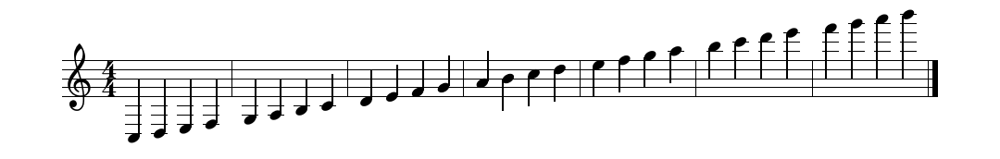
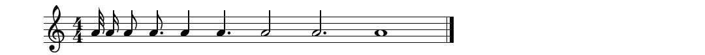
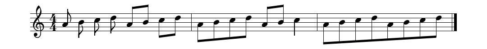
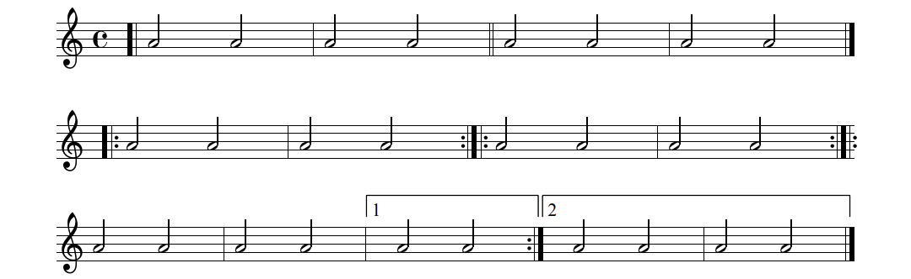
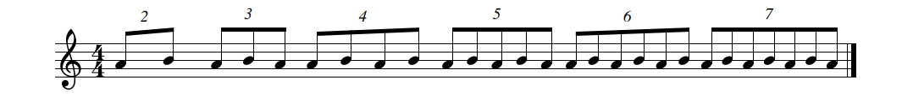
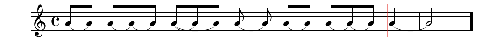
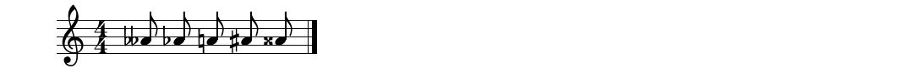
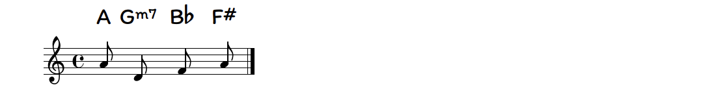
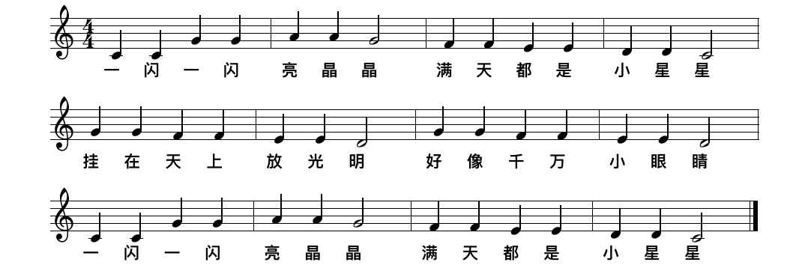

# 概述

ABC记谱法是 19 世纪出现的一种记谱法，以A到G的字母记录音高，再配以其他符号用来记录变化音、音长等，由克里斯·瓦尔莎发明。后来由于计算机使用 ASCII 字符集又要处理音乐，ABC记谱法再度受重视，并成为一部分音乐软件的信息存储法。

- https://abcnotation.com/examples#Notes
- https://editor.drawthedots.com/

# 基本信息

- `X`：乐谱序号，通常为 1

- `T`：歌曲名称

- `M`：拍号信息

  - `2/4`：以四分音符为 1 拍，每小节 2 拍

  - `3/4`：以四分音符为 1 拍，每小节 3 拍
  - `4/4`：以四分音符为 1 拍，每小节 4 拍
  - `6/8`：以八分音符为 1 拍，每小节 6 拍
  - ...

- `L`：基准音符

  - `1/4`：abc 记谱基准为四分音符
  - `1/8`：abc 记谱基准为八分音符

  > 提示：在 abcjs 库中，默认是以八音符作为基准音符的

- `Q`：速度，每分钟多少拍

- `K`：调性 Major - Minor 

- `C`：曲谱作者（可选）*

- `R`：节奏/曲风，示例值 rell 是一种传统的舞曲形式 *（可选）*

- `S`：版权信息 *（可选）*

- `N`：笔记（不显示在曲谱上）

# 音高表示

@See https://abcnotation.com/examples#notes-pitches



```
X:1
T:Notes / pitches
M:4/4
L:1/4
K:C treble
C, D, E, F, | G, A, B, C | D E F G | A B c d | e f g a | b c' d' e' | f' g' a' b' |]
```

CDEFGAB分别代表C调的1234567

| 简谱        | 1    | 2    | 3    | 4    | 5    | 6    | 7    | 0    |
| :---------- | ---- | ---- | ---- | ---- | ---- | ---- | ---- | ---- |
| ABC（低音） | C,   | D,   | E,   | F,   | G,   | A,   | B,   |      |
| ABC（正常） | C    | D    | E    | F    | G    | A    | B    | z    |
| ABC（高音） | c    | d    | e    | f    | g    | a    | b    |      |
| ABC（高音） | c'   | d'   | e'   | f'   | g'   | a'   | b'   |      |

观察上述表格，可以发现：

1. 高音用 **小写字母** 表示，再高音则在音高后面加一个英文单引号（`'`）表示，再再高音就加两个单引号（`''`），依此类推。
2. 同理，低音在音高后面加一个英文逗号（`,`），再低音加两个英文逗号（`,,`），依此类推。
3. 休止符：`z`

# 时值表示

@See https://abcnotation.com/examples#note-lengths



```
X:1
T:Note lengths
M:4/4
L:1/4
K:C treble
A/8 A/4 A/2 A3/4 A A3/2 A2 A3 A4 |]
```

ABC记谱法所有音符的时间，都是 **以基准音符作为参考**的（L）。

假设基准音符为 1/4（以四分音符作为基准），一般的，单独的字母A，B，z代表4分音符（z即为4分休止符）。

- `A/8`：32 分音符
- `A/4`：16 分音符
- `A/2`：8 分音符
- `A3/4`：8分附点
- `A`：4 分音符
- `A3/2`：4 分附点
- `A2`：2 分音符
- `A3`：2 分附点
- `A4`：全音符
- ... 依此类推

# 音符组合

@Se'e https://abcnotation.com/examples#bar-lines



```
X:1
T:Beams
M:4/4
L:1/8
K:C treble
A B c d AB cd | ABcd ABc2 | ABcdABcd |]
```

在五线谱中，多个**带符尾**的音符（8/16/32分音符）应该连在一起，如果需要分开，则使用 **空格** 隔开。

# 小节线

@Se'e https://abcnotation.com/examples#bar-lines



```
X:1
T:Bar lines
M:C
K:C
[| A4 A4 | A4 A4 || A4 A4 | A4 A4 |]
|: A4 A4 | A4 A4 :: A4 A4 | A4 A4 ::
A4 A4 | A4 A4 |1 A4 A4 :|2 A4 A4 | A4 A4 |]
```

- `|`：小节线
- `||`：段落结束线（不需要）
- `[| A |]`：曲谱开始/结束线（*开始线一般不会用到*）
- `|: A :|`：反复记号开始/结束线，如果某一处刚好存在反复记号的开始线合结束线，可缩写为 `::`

# 连音符

@See https://abcnotation.com/examples#tuplets



```
X:1
T:Tuplets
M:4/4
L:1/8
K:C treble
(2AB (3ABA (4ABAB (5ABABA (6ABABAB (7ABABABA|]
```

连音记号使用 **左圆括号 + 数字** 表示， 如 `(3`  表示3连音，后面3 个音符会被标识成三连音。

# 连音线 & 连音记号

@See https://abcnotation.com/examples#ties-and-slurs



```
X:1
T:Ties and slurs
M:C
K:C
(AA) (A(A)A) ((AA)A) (A|A) A-A A-A-A A2-|A4|]
```

- `()`：转音
- `-`：延音线

# 变音记号

@See https://abcnotation.com/examples#accidentals



```
X:1
T:Accidentals
M:4/4
K:C
__A _A =A ^A ^^A |]
```

- `^`：升号   `^^`：重升号
- `_`：降号   `__`：重降号
- `=`：还原号

# 和弦标记

@See https://abcnotation.com/examples#chord-symbols



```
X:1
T:Chord symbols
M:C
K:C
"A"A "Gm7"D "Bb"F "F#"A |]
```

和弦标记语法形式如下：

```
"和弦名称"音符
```

如 Gm7和弦 表示为: `"Gm7"D`

# 歌词

@See https://abcnotation.com/examples#lyrics



```
X:1
T:小星星
M:4/4
L:1/4
K:C
C C G G | A A G2 | F F E E | D D C2 | 
w:一 闪 一 闪 亮 晶 晶 满 天 都 是 小 星 星
G G F F | E E D2 | G G F F | E E D2 | 
w:挂 在 天 上 放 光 明 好 像 千 万 小 眼 睛
C C G G | A A G2 | F F E E | D D C2 |]
w:一 闪 一 闪 亮 晶 晶 满 天 都 是 小 星 星
```

- `w`：定义歌词
- `_`：跳过一个（或多个）音符，即包括空白音节
- `Blank space`：空格，分割单词

> 提示：如果需要有多行歌词，直接在 `w:` 定义处的下方，再新增一行歌词定义即可。

# 曲谱交互（插入节奏型）

## 灵活基准

- x/4：以四分音符为基准
- x/8：以八分音符为基准

| 音符/节拍      | 2/4           | 3/4           | 4/4           | 6/8    |
| -------------- | ------------- | ------------- | ------------- | ------ |
| 全休止符       | `z2`          | `z3`          | `z4`          | `z6`   |
| 二分休止符     | `z2`          | `z2`          | `z2`          | `z4`   |
| 四分休止符     | `z`           | `z`           | `z`           | `z2`   |
| 八分休止符     | `z/2`         | `z/2`         | `z/2`         | `z`    |
| 十六分休止符   | `z/4`         | `z/4`         | `z/4`         | `z/2`  |
|                |               |               |               |        |
| 全音符         | 🚫             | 🚫             | `A4`          | 🚫      |
| 二分附点音符   | 🚫             | `A3`          | `A3`          | `A6`   |
| 二分音符       | `A2`          | `A2`          | `A2`          | `A4`   |
| 四分附点音符   | `A3/2`        | `A3/2`        | `A3/2`        | `A3`   |
| 四分音符       | `A`           | `A`           | `A`           | `A2`   |
| 八分附点音符   | `A3/4`        | `A3/4`        | `A3/4`        | `A3/2` |
| 八分音符       | `A/2`         | `A/2`         | `A/2`         | `A`    |
| 十六分音符     | `A/4`         | `A/4`         | `A/4`         | `A/2`  |
|                |               |               |               |        |
| 前八后十六     | `A/2A/4A/4`   | `A/2A/4A/4`   | `A/2A/4A/4`   | 🚫      |
| 前十六后八     | `A/4A/4A/2`   | `A/4A/4A/2`   | `A/4A/4A/2`   | 🚫      |
| 前后十六中八   | `A/4A/2A/4`   | `A/4A/2A/4`   | `A/4A/2A/4`   | 🚫      |
| 八分音符三连音 | `(3A/2A/2A/2` | `(3A/2A/2A/2` | `(3A/2A/2A/2` | 🚫      |

## 统一基准

为了方便计算，统一以 **16 分音符** 为基准：

| 音符/节拍      | 2/4        | 3/4        | 4/4        | 6/8   |
| -------------- | ---------- | ---------- | ---------- | ----- |
| 全休止符       | `z8`       | `z12`      | `z16`      | `z12` |
| 二分休止符     | `z8`       | `z8`       | `z8`       | `z8`  |
| 四分休止符     | `z4`       | `z4`       | `z4`       | `z4`  |
| 八分休止符     | `z2`       | `z2`       | `z2`       | `z2`  |
| 十六分休止符   | `z`        | `z`        | `z`        | `z`   |
|                |            |            |            |       |
| 全音符         | 🚫          | 🚫          | `A16`      | 🚫     |
| 二分附点音符   | 🚫          | `A12`      | `A12`      | `A12` |
| 二分音符       | `A8`       | `A8`       | `A8`       | `A8`  |
| 四分附点音符   | `A6`       | `A6`       | `A6`       | `A6`  |
| 四分音符       | `A4`       | `A4`       | `A4`       | `A4`  |
| 八分附点音符   | `A3`       | `A3`       | `A3`       | `A3`  |
| 八分音符       | `A2`       | `A2`       | `A2`       | `A2`  |
| 十六分音符     | `A`        | `A`        | `A`        | `A`   |
|                |            |            |            |       |
| 前八后十六     | `A2AA`     | `A2AA`     | `A2AA`     | 🚫     |
| 前十六后八     | `AAA2`     | `AAA2`     | `AAA2`     | 🚫     |
| 前后十六中八   | `AA2A`     | `AA2A`     | `AA2A`     | 🚫     |
| 八分音符三连音 | `(3A2A2A2` | `(3A2A2A2` | `(3A2A2A2` | 🚫     |

## 示例

```
X:1
T:Little Star
M:4/4
K:C
L:1/16
C4 C4 G4 G4 | A4 A4 G8 | F4 F4 E4 E4 | D4 D4 C8 |
w:一 闪 一 闪 亮 晶 晶 满 天 都 是 小 星 星
G4 G4 F4 F4 | E4 E4 D8 | G4 G4 F4 F4 | E4 E4 D8 |
w:挂 在 天 上 放 光 明 好 像 千 万 小 眼 睛
C4 C4 G4 G4 | A4 A4 G8 | F4 F4 E4 E4 | D4 D4 C8 |]
w:一 闪 一 闪 亮 晶 晶 满 天 都 是 小 星 星
```


