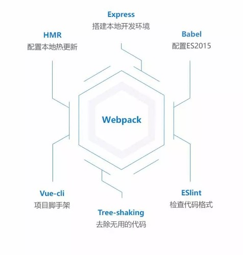

> 参考文献
>
> 1. <https://webpack.github.io/>
> 2. <https://webpack.docschina.org/>

# 一、概述


webpack 是一个打包工具，打包静态资源。当 webpack 处理应用程序时，它会递归地构建一个[依赖关系图(dependency graph)](https://webpack.docschina.org/concepts/dependency-graph/)，其中包含应用程序需要的每个[模块](https://webpack.docschina.org/concepts/modules/)，然后将所有这些模块打包成一个或多个 bundle。

从图中我们可以看出，*Webpack* 可以将多种静态资源 js、css、less 转换成一个静态文件，减少了页面的请求。

## 1. 什么是webpack？

> WebPack可以看做是**模块打包机**：它做的事情是，分析你的项目结构，找到JavaScript模块以及其它的一些浏览器不能直接运行的拓展语言（Sass，TypeScript等），并将其转换和打包为合适的格式供浏览器使用。在3.0出现后，Webpack还肩负起了优化项目的责任。

这段话有三个重点：

- 打包：可以把多个Javascript文件打包成一个文件，减少服务器压力和下载带宽。
- 转换：把拓展语言转换成为普通的JavaScript，让浏览器顺利运行。
- 优化：前端变的越来越复杂后，性能也会遇到问题，而WebPack也开始肩负起了优化和提升性能的责任。

## 2. 为什么需要webpack？

Webpack 是现代前端技术的基石，常规的开发方式，比如 jQuery、HTML、CSS 静态网页开发已经落后了。现在是MVVM的时代，数据驱动视图，Webpack 将现代js开发中的各种新型有用的技术，集合打包。通过下图理解webpack生态圈：




## 3. 模块化

模块化是一种处理复杂系统分解为更好的可管理模块的方式，简单来说就是解耦。通常一个文件就是一个模块，有自己的作用域，只向外暴露特定的变量和函数。

其优势为：简化开发、按需加载、便于管理、可复用。

目前流行的js模块化规范有CommonJS、AMD、CMD以及ES6的模块系统

### 3.1. [commonJS 规范](http://www.commonjs.org/specs/modules/1.0/) *

CommonJS就是一个JavaScript模块化的规范，是用在服务器端的node的模块规范，前端的webpack也是对CommonJS原生支持的。

> a. 特点：

- 模块输出的是一个值的拷贝， 模块是运行时加载，同步加载
- CommonJS 模块的顶层 `this` 指向当前模块

> b. API：

- require：加载所要依赖的其他模块
- module.exports 或者exports：对外暴露的接口

> c. 示例：新建两个模块 A.js、B.js

```javascript
// A.js
// writing one:
let a = 10, b = 20;
module.exports = { a, b };

// writing two:
module.exports.a = 10;
module.exports.b = 20;

// writing three:
exports.a = 10;
exports.b = 20;

// 三种写法结果是一样，对外暴露的接口的结果是一致的
```

```javascript
// B.js
const A = require("./A");
A  // {a:10, b:20}
```

注意：

1. exports 与module.exports 的区别：exports 是对 module.exports 的引用，不能直接给exports 赋值，直接赋值无效，结果是一个空对象，module.exports 可以直接赋值。

2. 一个文件不能写多个module.exports ，如果写多个，对外暴露的接口是最后一个module.exports。

3. 模块如果没有指定使用module.exports 或者exports 对外暴露接口时，在其他文件就引用该模块，得到的是一个空对象。

### 3.2. ES6 *

ES6 在语言标准的层面上，实现了模块功能，而且非常简单，ES6到来，完全可以取代 CommonJS 和AMD规范，成为浏览器和服务器通用的模块解决方案。

> a. 特点：

- ES6 模块之中，顶层的`this`指向`undefined`，即不应该在顶层代码使用`this`。
- 自动采用严格模式"use strict"。须遵循严格模式的要求
- ES6 模块export、import命令可以出现在模块的任何位置，但是必须处于模块顶层。如果处于块级作用域内，就会报错
- ES6 模块输出的是值的引用

> b. API

[import](https://developer.mozilla.org/zh-CN/docs/Web/JavaScript/Reference/Statements/import)：加载所要依赖的其他模块

[export](https://developer.mozilla.org/zh-CN/docs/Web/JavaScript/Reference/Statements/export)：对外暴露的接口

> 示例

```js
// 1. 导出单个属性
export const a = 10;
export const b = 20;
import {a, b} from "./path"
// 2. 导出属性列表
const a = 10, b = 20;
export {a, b}
import {a, b} from "./path"
// 3. 重命名导出
export {a as x, b as y }
import {x, y} from "./path"
// 4. 默认导出
export default { min:10, max:20 }
import 变量 from "./path"
```

### 3.3. [AMD](https://juejin.im/post/5aaa37c8f265da23945f365c#heading-1)

### 3.4. [CMD](https://juejin.im/post/5aaa37c8f265da23945f365c#heading-2)

# 二、初探 

## 1. 准备

创建项目并在项目根目录中通过 `npm` 或 `yarn` 生成 *package.json* 配置文件。

```shell
# NPM
$ npm init --yes
# YARN
$ yarn init --yes
```

## 2. 安装

安装 `webpack` 及其命令行工具 `cli`：

```shell
# NPM
$ npm install webpack webpack-cli --save-dev 
# YARN
$ yarn add webpack webpack-cli --save-dev  
# 查看版本
$ ./node_modules/.bin/webpack --version
4.41.2
```

> 提示：官方建议使用局部安装，局部安装可以使用最新的技术栈，JavaScript 是弱语言,有局部变量和全局变量,其实全局安装与局部安装的性质与函数的全局变量与局部变量有点类似。

## 3. 创建项目结构

接下来创建如下项目结构：

```
.
├── dist
    └── index.html
├── node_modules
├── package.json
└── src
    └── js
    	├── main.js
   		├── util.js
```

>  提示：
>
>  1. src是源码文件，dist是我们编译打包好的文件；一个用于**开发环境**，一个用于**生产环境**。
>  2. node_modules 为 yarn 或 npm 安装依赖时自动生成的文件。

## 4. 编辑项目文件

-> index.html

```html
<!DOCTYPE html>
<html lang="zh-CN">
<head>
    <meta charset="UTF-8">
    <meta name="viewport" content="width=device-width, initial-scale=1.0">
    <meta http-equiv="X-UA-Compatible" content="ie=edge">
    <title>hello-webpack</title>
</head>
<body>
		<h1 id="title"></h1>
    <!-- 引入webpack打包后生成的文件 -->
    <script src="./static/js/main-bundle.js"></script>
</body>
</html>
```
-> util.js

```javascript
class Util {
    constructor() {}
    static setTitle(id, title) {
        let el = document.getElementById(id);
        el.textContent = title;
    }
}

module.exports  = {
    Util
}
```
-> main.js
```javascript
import { Util } from "./util";
Util.setTitle("title", "Hello, webpack!");
```

## 5. 创建配置文件 

在 <ins>项目根目录下</ins> 创建 “webpack.config.js ” 文件，配置如下：

```javascript
// 1. 引入模块
const path = require('path');
// 2. 导出配置
module.exports = {
    // 配置基础路径为当前目录（默认为配置文件所在的当前目录）
    context: path.resolve(__dirname, './'),
    // 打包模式 development | production
    mode: 'development',
    // 入口 string | array | object
    entry: {
        main: './src/js/index.js'
    },
    // 出口
    output: {
        // 输出目录/绝对路径
        path: path.resolve(__dirname, './dist/'),
        // 输出文件名
        filename: 'static/js/[name]-bundle.js'
    },
    // 加载器
    module: {
        rules: []
    },
    // 开发服务
    devServer: {}
};
```

## 6. 编译打包

```shell
$ ./node_modules/.bin/webpack 
Hash: d4ae017766cd1f28cc94
Version: webpack 4.41.2
Time: 72ms
Built at: 2019-12-13 21:49:31
                   Asset      Size  Chunks             Chunk Names
static/js/main-bundle.js  4.59 KiB    main  [emitted]  main
Entrypoint main = static/js/main-bundle.js
[./src/js/index.js] 72 bytes {main} [built]
[./src/js/util.js] 123 bytes {main} [built]
```

执行打包任务之后，会在 “./dist/static/js” 目录下生产一个  ”main-bundle.js“ 文件，运行 ”index.html“ 可以看到 ”Hello, webpack!“ 说明打包成功。

> 提示：你可以尝试不同的打包模式观察二者的区别。

## 7. 开发环境

[webpack-dev-server](https://www.npmjs.com/package/webpack-dev-server) 为你提供了一个简单的 web server，并且具有 live reloading（实时重新加载） 功能。安装方式如下：

```shell
$ npm i webpack-dev-server -D 
OR
$ yarn add webpack-dev-server -D
```

devServer常用配置项如下，更多配置可参考 [这里](https://webpack.docschina.org/configuration/dev-server) 。

| 配置选项           | 功能描述                                                     |
| ------------------ | ------------------------------------------------------------ |
| contentBase        | 默认webpack-dev-server会为根文件夹提供本地服务器，如果想为另外一个目录下的文件提供本地服务器，应该在这里设置其所在目录（本例设置到“dist"目录） |
| port               | 设置默认监听端口，如果省略，默认为”8080“                     |
| inline             | 自动刷新页面                                                 |
| historyApiFallback | 处理404                                                      |
| host               | 设置服务器主机号，在开发阶段，一般设置为：localhost          |
| proxy              | 设置代理                                                     |

devServer 配置如下：

```javascript
devServer: {
    contentBase:path.resolve(__dirname,"./dist/"),
    host: "localhost",
    port: 8090,
    open: true,
    inline: true,
    hot: true // 热替换
}
```

在 “package.json” 中添加如下命令，可以开启本地服务器：

```javascript
{
	"scripts": {
    	"dev": "./node_modules/.bin/webpack-dev-server"
	}
}
```

在终端中输入`npm run dev` 或 `yarn eun dev `即可在本地的 `8090` 端口查看结果。

> 注意：
>
> 1、webpack-dev-server 在编译之后不会写入到任何输出文件。而是将 bundle 文件保留在内存中，然后将它们 serve 到 server 中，就好像它们是挂载在 server 根路径上的真实文件一样。如果你的页面希望在其他不同路径中找到 bundle 文件，则可以通过 dev server 配置中的 [`publicPath`](https://webpack.docschina.org/configuration/dev-server/#devserver-publicpath-) 选项进行修改。
>
> 2、如果你自定义了配置文件，如 “webpack.dev.config.js”，那么在执行devServer的时候，也要指定相应的配置文件，如：webpack-dev-server --config webpack.dev.config.js。
>
> 3、在开发阶段，我们可以通过设置 “output” 中的 “publicPath” 字段访问静态资源，以刚刚配置devServer为例，我们可以在“output”出口设置中添加如下字段：*publicPath: "http://localhost:8090/"*，此时，你静态资源的访问路径将会变成：publicPath + 静态资源地址，待项目上线之后，再将publicPath设置为线上地址即可。

## 8. 扩展知识

### 8.1. * 指定配置文件编译

在实际开发过程中，你可能会创建不同的config.js文件来满足不同的开发需求，比如你在开发阶段，通常会创建一个 “webpack.dev.config.js” 文件，那么你在执行编译指令的时候需要指向该配置文件，如下所示：

```shell
$ ./node_modules/.bin/webpack --config ./build/webpack.dev.config.js
Hash: 86801f3c9bf5c3223d39
Version: webpack 4.30.0
Time: 94ms
Built at: 2019-09-04 00:23:21
                   Asset      Size  Chunks             Chunk Names
static/js/main-bundle.js  4.65 KiB    main  [emitted]  main
Entrypoint main = static/js/main-bundle.js
[./src/js/main.js] 73 bytes {main} [built]
[./src/js/util.js] 186 bytes {main} [built]
```

> 提示：假设配置文件的路径是：*./build/webpack.dev.config.js*，那你需要在配置文件中做如下修改：
>
> ```js
> module.exports = {
>     context: path.resolve(__dirname, "../"),
>     output: {   
>         path: path.resolve(__dirname, "../dist/"),
>     }
> };
> ```

### 8.2. * 编译参数配置

webpack 自身提供了一些参数来优化编译任务，以下简单列出了一些参数：

| 参数                    | 描述                   |
| ----------------------- | ---------------------- |
| --config                | 指定配置文件           |
| --watch, -w             | 监听变动并自动打包     |
| -p                      | 压缩混淆脚本           |
| --progress              | 显示进度条             |
| --display-reasons       | 显示添加打包模块的原因 |
| --display-error-details | 出错时错误的详情       |

> 提示：想了解webpack更多参数，可在终端输入 `./node_modules/.bin/webpack -h`  查看

这里以监听为例，执行编译的时候带上 -w 参数，如下所示：

```shell
$ ./node_modules/.bin/webpack --config ./build/webpack.dev.config.js  -w
```

当你对文件做了任何修改都会进行自动编译，如果你想要取消监听状态，可使用快捷键：`CTR/CMD+C`

### 8.3. * 简化指令

可以发现，如果执行编译任务，特别是在参数比较多的情况，是比较麻烦的，我们可以在 npm 的 ”package.json“ 文件中进行添加一个脚本指令的字段，如下所示：

```json
"scripts": {
  "build":"./node_modules/.bin/webpack --progress --display-modules --display-reasons --display-error-details --watch"
},
```

在 ”package.json“ 文件中配置添加完脚本配置之后，我们可直接通过如下令执行打包任务，如下所示:

```shell
$ npm run build
OR
$ yarn run build
```

至此，你已经初步了解了webpack的基本使用及webpack模块化思想。

## 9. 构建过程

- 初始化：启动构建，读取与合并配置参数，加载 [Plugin](https://www.webpackjs.com/api/plugins/)，实例化 [Compiler](https://www.webpackjs.com/api/compiler-hooks/)。

- 编译：从 [Entry](https://webpack.docschina.org/concepts/#入口-entry-) 发出，针对每个 [Module](https://webpack.docschina.org/concepts/modules/#src/components/Sidebar/Sidebar.jsx) 串行调用对应的 [Loader](https://webpack.docschina.org/concepts/loaders/#src/components/Sidebar/Sidebar.jsx) 去翻译文件内容，再找到该 [Module](https://webpack.docschina.org/concepts/modules/#src/components/Sidebar/Sidebar.jsx) 依赖的 [Module](https://webpack.docschina.org/concepts/modules/#src/components/Sidebar/Sidebar.jsx)，递归地进行编译处理。

- 输出：对编译后的 Module 组合成 [Chunk](https://zhuanlan.zhihu.com/p/21318102)，把 [Chunk](https://zhuanlan.zhihu.com/p/21318102) 转换成文件，输出到本地。

# 三、核心

## 1. Entry

`Entry`：入口起点(entry point)，指示 webpack 应该使用哪个模块，来作为构建其内部依赖图的开始。进入入口起点后，webpack 会找出有哪些模块和库是入口起点（直接和间接）依赖的。

入口文件常用的配置形式如下：

```js
module.exports {
    entry: {
        "main": "./src/js/main.js",
        "news": "./src/js/news.js"  
    }
}
```

> 提示：在多页面项目中设置出口时，通过`[name]` 即可获取文件名，其中文件名就是入口设置中的 `key` 项。

## 2. Output

`Output`：该属性告诉 webpack 在哪里输出它所创建的 bundles，以及如何命名这些文件。你可以通过在配置中指定一个 output 字段，来配置这些处理过程。

出口文件常用的配置形式如下：

```javascript
module.exports {
	output: {
      // 输出目录
  		path: path.resolve(__dirname, "./dist/"),
  		// 输出文件名
  		filename: "static/js/[name]-bundle.js",
  		// 处理静态资源路径
  		// 静态资源最终访问路径 = output.publicPath + 资源loader或插件等配置路径
  		// 这里假设开启devServer服务
  		publicPath: "http://localhost:8080/"
    }
}
```

- `[name]`：模块名称，也就是在指定入口时的 `key` 值。
- `[hash]`：打包后文件的 hash 值，md5，保证文件唯一性。
- `[chunkhash]`：模块自身的hash值。

## 3. Loader

webpack 只能理解 JavaScript 和 JSON 文件。**loader** 让 webpack 能够去处理其他类型的文件，并将它们转换为有效 [模块](https://webpack.docschina.org/concepts/modules)，以供应用程序使用，以及被添加到依赖图中。Loader 需要单独安装并且需要在 “webpack.config.js” 中的 `module` 关键字下进行配置，Loader 的配置包括以下几方面：

- `test`：用于匹配处理文件的扩展名的表达式，这个选项是必须进行配置的；
- `use`：loader名称，就是你要使用模块的名称，这个选项也必须进行配置，否则报错；
- `include/exclude`：手动添加必须处理的文件（文件夹）或屏蔽不需要处理的文件（文件夹）（可选）；

### 3.1. [babel-loader](https://www.npmjs.com/package/babel-loader)

**> 概述：**

通常用于将ES6转换为ES5的语法。

**> 安装：**

```shell
$ npm i -D babel-loader @babel/core @babel/preset-env
or
$ yarn add -D babel-loader @babel/core @babel/preset-env
```

**> 配置：**

```javascript
module: {
    rules: [
        // es6 -> es5
        {
            test: /\.js$/,
            exclude: /node_modules/,
            use: {
                loader: "babel-loader",
                options: {
                    presets: ["@babel/preset-env"]
                }
            }
        }
    ]
}
```

### 3.2. 样式相关

**\> 概述：**

- [css-loader](https://www.npmjs.com/package/css-loader)：使你能够使用类似 `import` 和 `url()`  的方法实现  `require()` 的功能。

- [style-loader](https://www.npmjs.com/package/style-loader)：将所有计算后的样式加入页面中

- [less-loader](https://www.npmjs.com/package/less-loader)：编译LESS

- [sass-loader](https://www.npmjs.com/package/sass-loader)：编译SASS

- [postcss-loader](https://www.npmjs.com/package/postcss-loader)：添加浏览器前缀（该loader还有其他额外的功能）

**> 安装：**

```shell
$ npm i css-loader style-loader less less-loader postcss-loader autoprefixer -D
$ yarn add css-loader style-loader less less-loader postcss-loader autoprefixer -D
```

**\> 配置：**

自动添加前缀（autoprefixer）指定兼容版本需在 “package.json”中的“browserslist”字段中配置即可：

```json
"browserslist": [
  "last 2 version"
]
```

```js
{
    test: /\.less$/,
    exclude: /node_modules/,
    use: ["style-loader", "css-loader", {
        loader: "postcss-loader",
        options: {
            ident: "postcss",
            plugins: [require("autoprefixer")]
        }
    }, "less-loader"]
}
```

> 注意：引用顺序为从右到左，样式引入使用 commonJS规范引入。如果需要分离CSS文件，可使用插件 [mini-css-extract-plugin](https://www.npmjs.com/package/mini-css-extract-plugin)，webpack v4.0之前使用[extract-text-webpack-plugin](https://www.npmjs.com/package/extract-text-webpack-plugin) 。

### 3.3. [file-loader](https://www.npmjs.com/package/file-loader)、[url-loader](https://www.npmjs.com/package/url-loader)

**> 概述：**

- file-loader：解决引用路径的问题，拿background样式用url引入背景图来说，我们都知道，webpack最终会将各个模块打包成一个文件，因此我们样式中的url路径是相对入口html页面的，而不是相对于原始css文件所在的路径的。这就会导致图片引入失败。这个问题是用file-loader解决的，file-loader可以解析项目中的url引入（不仅限于css），根据我们的配置，将图片拷贝到相应的路径，再根据我们的配置，修改打包后文件引用路径，使之指向正确的文件。
- url-loader：如果图片较多，会发很多http请求，会降低页面性能。这个问题可以通过url-loader解决。url-loader会将引入的图片编码，生成dataURl。相当于把图片数据翻译成一串字符。再把这串字符打包到文件中，最终只需要引入这个文件就能访问图片了。当然，如果图片较大，编码会消耗性能。因此url-loader提供了一个limit参数，小于limit字节的文件会被转为DataURl，大于limit的还会使用file-loader进行copy。

**> 安装：**

```shell
$ npm i -D file-loader url-loader
or
$ yarn add -D file-loader url-loader
```

**> 配置：**

> url-loader 配置：

```javascript
{
      test: /\.(png|jpg|jpeg|gif)$/,
      exclude: /node_modules/,
      use: {
          loader: "url-loader",
          options: {
              limit: "1024",
              name: "[name].[ext]",
              outputPath: "static/images/"
          }
      }
}
```

为什么只使用url-loader?

有的小伙伴会发现我们并没有在webpack.config.js中使用file-loader，但是依然打包成功了。我们需要了解file-loader和url-loader的关系。url-loader和file-loader是什么关系呢？简答地说，url-loader封装了file-loader。url-loader不依赖于file-loader，即使用url-loader时，只需要安装url-loader即可，不需要安装file-loader，因为url-loader内置了file-loader。通过上面的介绍，我们可以看到，url-loader工作分两种情况：

1.文件大小**小于**limit参数，url-loader将会把文件转为DataURL（Base64格式）；

2.文件大小**大于**limit，url-loader会调用file-loader进行处理，参数也会直接传给file-loader。

也就是说，其实我们只安装一个url-loader就可以了。但是为了以后的操作方便，我们这里就顺便安装上file-loader。

> file-loader配置：

使用file-loader输出图片

```javascript
{
    test: /\.(png|jpg|jpeg|gif)$/,
    exclude: /node_modules/,
    use: {
        loader: "file-loader",
        options: {
            // 指定输出文件名字
            name: "[name]-[hash:6].[ext]",
            // 指定输出文件路径（相对于出口路径）
            outputPath:"static/images/",
            // 指定图片引用路径前缀
            publicPath: "../images/"
        }
    }
}
```

### 3.4. [html-loader](https://www.npmjs.com/package/html-loader)

**>  概述：**

webpack处理资源无往不利，但有个问题总是很苦恼，html中直接使用img标签src加载图片的话，因为没有被依赖，图片将不会被打包。这两个loader都可以解决这个问题，图片会被打包，而且路径也处理妥当。额外提供html的include子页面功能。

**> 安装：**

```shell
# NPM
$ npm i -D html-loader
# YARN
$ yarn add -D html-loader
```

> 提示：任选一个安装

**> 配置：

```javascript
{
    test: /\.html/,
    exclude: /node_modules/,
    loader: 'html-loader'
}
```

## 4. Plugins

插件（Plugins）是用来拓展Webpack功能的，它们会在整个构建过程中生效，执行相关的任务。
Loaders和Plugins常常被弄混，但是他们其实是完全不同的东西，可以这么来说，loaders是在打包构建过程中用来处理源文件的，一次处理一个，插件并不直接操作单个文件，它直接对整个构建过程起作用。

Webpack有很多内置插件，同时也有很多第三方插件，可以让我们完成更加丰富的功能。

使用插件步骤：

- 安装插件
- 导入插件
- 在 plugins 数组中创建插件实例

### 4.1. [webpack-bundle-analyzer](https://www.npmjs.com/package/webpack-bundle-analyzer)

**\> 概述**

该插件是将打包后的内容用canvas以图形的方式展示出来，借助这个工具，我们可以知道每个chunk由哪些模块组成，非常方便好用

**\> 安装**

```shell
# NPM 
$ npm install --save-dev webpack-bundle-analyzer
# Yarn 
$ yarn add -D webpack-bundle-analyzer
```

**\> 配置**

```js
new BundleAnalyzerPlugin()
```

### 4.2. [Html-Webpack-Plugin](https://www.npmjs.com/package/html-webpack-plugin)

**> 概述**

HtmlWebpackPlugin 简化了HTML文件的创建，以便为你的webpack包提供服务，它可以自动为你生成项目中的html文件。 这对于在文件名中包含哈希的webpack bundle尤其有用，其主要作用如下：

- 为html文件中引入的外部资源如 script、link 动态添加每次compile后的hash，防止引用缓存的外部文件问题。
- 可以生成创建html入口文件，比如单页面可以生成一个html文件入口，配置多个 html-webpack-plugin 可以生成多个页面入口

插件的基本作用就是生成html文件，其原理主要是将 webpack中 entry 配置的相关入口thunk  和  extract-text-webpack-plugin 抽取的css**样式插入到该插件提供的** template 或者 templateContent 配置项指定的内容基础上生成一个html文件，具体插入方式是将样式link插入到head元素中，script插入到head或者body中。

**> 安装**

```shell
# NPM
$ npm i html-webpack-plugin  -D
# YARN
$ yarn add html-webpack-plugin -D
```

**> 配置**

```javascript
new HtmlWebpackPlugin({
    // 模板文件
    template: "./src/index.html",
    // 标题
    title: "主页",
    // 文件名(相对于output.path)，可通过文件名设置目录，如 static/pages/detail.html
    filename: "index.html",
    // 静态资源位置
    inject: "body",
    // 是否hash
    hash: false,
    // 指定输出文件所依赖的入口文件（*.js）的[name]
    chunks: ["main"],
    // 控制压缩
    minify: {
        collapseWhitespace: false,
        removeComments: true,
        removeAttributeQuotes: true,
        removeEmptyAttributes: true
    }
});
```

> 提示：
>
> 1. filename配置的html文件目录是相对于webpackConfig.output.path路径而言的，不是相对于当前项目目录结构的。
> 2. 指定生成的html文件内容中的 `link` 和 `script` 路径是相对于生成目录下的，写路径的时候请写生成目录下的相对路径。
> 3. 使用模板标题，需要在模板文件的头部标题标签中添加 *<%= htmlWebpackPlugin.options.title %>*

### 4.3. [clean-webpack-plugin](https://www.npmjs.com/package/clean-webpack-plugin)

**> 说明**

清除每次打包后的缓存文件，确保每次都是最新的

**> 安装**

```shell
# NPM
$ npm install clean-webpack-plugin -D
# YARN
$ yarn add  clean-webpack-plugin -D
```

**> 配置**

```javascript
const { CleanWebpackPlugin } = require('clean-webpack-plugin');
 
const webpackConfig = {
    plugins: [
        new CleanWebpackPlugin(),
    ],
};
```

> 注意：
>
> - 名字中的 `C` 字母必须大写。
> - 应该把CleanWebpackPlugin放在plugin配置项的最后一个，因为 webpack 配置是倒序的（最后配置的最先执行）。以保证每次正式打包前，先清空原来遗留的打包文件。

### 4.4. [BannerPlugin](https://webpack.docschina.org/plugins/banner-plugin)

**> 说明**

添加版权声明

**> 安装**

无需安装，该插件为 webpack 内置插件，直接使用即可。

**> 配置 **

```js
const webpack = require('webpack');
module.exports = {
    plugins: [
        new webpack.BannerPlugin("版权所有，翻版必究！")
    ]
};
```


### 4.5. [mini-css-extract-plugin](https://github.com/webpack-contrib/mini-css-extract-plugin)

**> 概述：**

通过webpack 打包的样式被嵌入到了 bundle.js 文件中，如果你想要将其抽离出来，我们可以使用该插件。

**> 安装：**

```shell
# NPM
$ npm install -D mini-css-extract-plugin
# YARN
$ yarn add -D mini-css-extract-plugin
```

**> 配置：**

```javascript
// module
{
    test: /\.less$/,
    exclude: /node_modules/,
    use: [
        // "style-loader",
        // =>使用插件中的LOADER代替STYLE方式
        {
            loader: MiniCssExtractPlugin.loader,
            options: {
                reloadAll: true
            }
        },
        "css-loader",
        {
            loader: "postcss-loader",
            options: {
                ident: "postcss",
                plugins: [require("autoprefixer")]
            }
        },
        "less-loader"]
}
// plugins
new MiniCssExtractPlugin({
    filename: 'static/css/[name].css'
})
```

> 提示：
>
> - 输出路径相对于 output.path 设置
> - webpack v4.0之前使用 [extract-text-webpack-plugin](https://www.npmjs.com/package/extract-text-webpack-plugin)

### 4.6. [purifycss-webpack](https://www.npmjs.com/package/purifycss-webpack)

**> 概述：**

消除未使用的CSS

**> 安装：**

```shell
# NPM
$ npm i -D purifycss-webpack purify-css
# YARN
$ yarn add -D purifycss-webpack purify-css
```

**> 配置：**

```javascript
const glob = require('glob');
const PurifyCSSPlugin = require('purifycss-webpack');

// plugins
new PurifyCSSPlugin({
    // Give paths to parse for rules. These should be absolute!
    paths: glob.sync(path.join(__dirname, "./src/**/*.html")),
}),
```

这里配置了一个paths，主要是需找html模板，purifycss根据这个配置会遍历你的文件，查找哪些css被使用了。

配置好上边的代码，我们可以故意在css文件里写一些用不到的属性，然后用webpack打包，你会发现没用的CSS已经自动给你删除掉了。在工作中记得一定要配置这个plugins，因为这决定你代码的质量，非常有用。

### 4.7. [optimize-css-assets-webpack-plugin](https://www.npmjs.com/package/optimize-css-assets-webpack-plugin)

**\> 概述：**

压缩CSS

**\> 安装：**

```shell
$ npm install -D optimize-css-assets-webpack-plugin 
$ yarn add -D optimize-css-assets-webpack-plugin 
```

**\> 配置：**

```javascript
const OptimizeCSSAssetsPlugin = require('optimize-css-assets-webpack-plugin');

new OptimizeCSSAssetsPlugin ({
    // 默认是全部的CSS都压缩，该字段可以指定某些要处理的文件
    assetNameRegExp: /\.(sa|sc|c|le)ss$/g, 
    // 指定一个优化css的处理器，默认cssnano
    cssProcessor: require('cssnano'),
    cssProcessorPluginOptions: {
    preset: [  'default', {
        discardComments: { removeAll: true}, //对注释的处理
        normalizeUnicode: false // 建议false,否则在使用unicode-range的时候会产生乱码
    }]
    },
    canPrint: true  // 是否打印编译过程中的日志
})
```

### 4.8. [copy-webpack-plugin](https://www.npmjs.com/package/copy-webpack-plugin)

**> 概述：**

工作中会有一些已经存在但在项目中没有引用的图片资源或者其他静态资源（比如设计图、开发文档），这些静态资源有可能是文档，也有可能是一些额外的图片。项目组长会要求你打包时保留这些静态资源，直接打包到指定文件夹。其实打包这些资源只需要用到copy-webpack-plugin。

**\> 安装：**

```shell
# NPM
$ npm i -D copy-webpack-plugin
# YARN
$ yarn add -D copy-webpack-plugin
```

**\> 配置：**

```js
const CopyPlugin = require("copy-webpack-plugin");

new CopyPlugin([
    {
        from: "./src/README.md",
        to: "./"
    }
])
```

- from：要打包的静态资源目录地址
- to：要打包到的文件夹路径，跟随output配置中的目录。

# 四、延伸

## 1. 热替换

要实现热替换，还需调用插件。在热替换（HMR）机制里，不是重载整个页面，HMR程序会只加载被更新的那一部分模块，然后将其注入到运行中的APP中。

```js
new webpack.HotModuleReplacementPlugin()
```

## 2. context

上下文，基础目录，**绝对路径**，用于从配置中解析入口起点和 loader，入口起点会相对于此目录查找。默认为当前目录，即配置文件所在的目录，所以一般当自定义配置文件之后，我们需要设置该属性，比如配置文件放在在 ”./build“ 目录中，则上下文配置如下：

```js
context: path.resolve(__dirname, "../");
```

## 3. 处理静态资源路径

以处理图片为例，首先安装Loader

```shell
$ npm i -D url-loader html-loader
$ yarn add -D url-loader html-loader
```

- file-loader：处理图片
- html-loader：处理\引入的图片

然后对两个loader进行配置：

```js
// 处理HTML
{
    test: /\.html$/,
    use: "html-loader"
},
// 处理图片
{
    test: /\.(jpg|jpeg|jpg|svg|png|gig)$/,
    exclude: /node_modules/,
    use: {
        loader: "url-loader",
        options: {
            limit: 4096,
            name: "[name]-[hash:6].[ext]",
            outputPath: "static/images/",
            // 启用commonJS规范  
            esModule: false
        }
    }
},
```

最后在webpack.config.js文件的output选项中设置publicPath，主要作用就是处理静态文件路径的。

```javascript
output: {
    filename: "js/bundle.js",
    path: path.resolve(__dirname, "./dist"),
    publicPath: "http://localhost:8080/"
},
```

注意，这里的IP和端口，是你本机的ip或者是你devServer配置的IP和端口。

配置完成后，你再使用webpack命令进行打包，你会发现原来的相对路径改为了绝对路径，这样来讲速度更快。

## 4. 资源映射

```javascript
module.exports = {
	devtool: 'eval-source-map'
}
```

总结：调试在开发中也是必不可少的，但是一定要记得在上线前一定要修改webpack配置，在打出上线包。

## 5. 引用三方库

### 5.1. 直接引入

```js
import $ from 'jquery';
```

### 5.2. 全局引入

```js
new webpack.ProvidePlugin({
	$:"jquery", // npm
  jQuery: "jQuery"
})
```

## 6. watch的正确使用方法

在初级开发阶段，使用webpack-dev-server就可以充当服务器和完成打包任务，但是随着你项目的进一步完成，可能需要前后台联调或者两个前端合并代码时，就需要一个公共的服务器了。这时候我们每次保存后手动打包显然效率太低，我们希望的场景是代码发生变化后，只要保存，webpack自动为我们进行打包。这个工具就是watch，这节课我们把wacht完全学会，你会发现在开发中更加的得心应手。

**\> watch的配置**

很多小伙伴认为–watch直接使用就可以，并没有什么需要讲的。其实这只是初级的用法，但是在学习一种技术时，我们必须要做到了解全部，也就是常说的知其然知其所以然。我们看下面的配置代码，我在代码中已经做出了解释。

```javascript
watchOptions:{
    // 检测修改的时间，以毫秒为单位
    poll:1000, 
    // 防止重复保存而发生重复编译错误。这里设置的500是半秒内重复保存，不进行打包操作
    aggregateTimeout:500, 
    // 不监听的目录
    ignored:/node_modules/, 
}
```

上边的每一行配置我都作了说明，有时候你在没配置的情况下，直接用webpack –watch是不起作用的，这时候你需要进行配置这些选项。

配置好后，我们就可以痛快的使用watch了，在大型项目中，这大大加快了我们的开发效率，不用反复的手动打包了。

## 7. 解析

有时候我们不想路径暴露出去，可以使用取别名的形式：

```javascript
moudle.exports = {
  resolve: {
        // 创建别名
        alias: {
            "main-less": path.resolve(__dirname, './src/less/main.less'),
            "font-icon": "font-awesome/css/font-awesome.css"
        }
    }
}
```

这样在需要引入对应插件的时候，直接使用即可：

```js
require("normalize-css");
require("font-icon");
```

## 6. 抽离公共文件

当一部分代码需要反复被用到，反复请求浪费资源，将公共代码 抽离，需要时读取缓存即可

```js
output: {
  ...
  chunkFilename: "[name].chunk.js"
}
optimization: {
    splitChunks: {
        cacheGroups: {// 缓存组，缓存公共代码
            // 首先：打包node_modules中的文件
            vendor: {
                test: /node_modules/,
                name: "vendor",
                minSize: 0, 
                minChunks: 1,
                chunks: "all",
                priority: 1 
            },
            // 其次: 打包业务中公共代码
            common: {
                name: "common",
                chunks: "all",  
                minSize: 0,      
                minChunks: 2,   
                priority:0
            }
        }
    }
}
```

# 五、注意

- 一旦修改了webpack的配置文件，必须重启服务或重新build。否则失效。
- 如果自定义配置文件，切记在执行打包时一定要指定配置文件路径

# 六、配置代码

```js
// 1. 引入模块
const path = require('path');
const webpack = require('webpack');
const glob = require('glob');
const PurifyCSSPlugin = require('purifycss-webpack'); // CSS Tree-Shacking
const OptimizeCssAssetsPlugin = require('optimize-css-assets-webpack-plugin'); // 压缩css
const HtmlWebpackPlugin = require("html-webpack-plugin"); // 处理Html
const MiniCssExtractPlugin = require('mini-css-extract-plugin'); // 抽离文件
const { CleanWebpackPlugin } = require('clean-webpack-plugin'); // 清除文件


// 2. 导出配置
module.exports = {
    // 资源映射
    devtool: 'eval-source-map',
    // 配置基础路径为当前目录（默认为配置文件所在的当前目录）
    context: path.resolve(__dirname, './'),
    // 打包模式 development | production
    mode: 'development',
    // 入口 string | array | object
    entry: {
        main: './src/js/index.js'
    },
    // 出口
    output: {
        // 输出目录/绝对路径
        path: path.resolve(__dirname, 'dist'),
        // 输出文件名
        filename: 'static/js/[name].bundle.js',
        // =>配置引用前缀（所有资源前加这个地址）
        publicPath: 'http://127.0.0.1:8090/'
        // chunkFilename: "static/common/[name].chunk.js"
    },
    // 加载器
    module: {
        rules: [
            // 处理less
            {
                test: /\.less$/,
                exclude: /node_modules/,
                use: [
                    // "style-loader",
                    // =>使用插件中的LOADER代替STYLE方式
                    {
                        loader: MiniCssExtractPlugin.loader,
                        options: {
                            reloadAll: true
                        }
                    },
                    "css-loader",
                    {
                        loader: "postcss-loader",
                        options: {
                            ident: "postcss",
                            plugins: [require("autoprefixer")]
                        }
                    },
                    "less-loader"
                ]
            },
            // 处理js
            {
                test: /\.js$/,
                exclude: /node_modules/,
                use: {
                    loader: "babel-loader",
                    options: {
                        presets: ["@babel/preset-env"]
                    }
                }
            },
            // 处理HTML
            {
                test: /\.html$/,
                use: "html-loader"
            },
            // 处理图片
            {
                test: /\.(jpg|jpeg|jpg|svg|png)$/,
                exclude: /node_modules/,
                use: {
                    loader: "url-loader",
                    options: {
                        limit: 4096,
                        name: "[name]-[hash:6].[ext]",
                        outputPath: "static/images/",
                        esModule: false
                    }
                }
            },
            // 处理字体

        ]
    },
    // 插件
    plugins: [
        // 热更新
        new webpack.HotModuleReplacementPlugin(),
        // 打包横幅
        new webpack.BannerPlugin("版权所有，翻版必究！"),
        // 压缩样式
        new OptimizeCssAssetsPlugin({
            // 默认是全部的CSS都压缩，该字段可以指定某些要处理的文件
            assetNameRegExp: /\.(sa|sc|c|le)ss$/g,
            // 指定一个优化css的处理器，默认cssnano
            cssProcessor: require('cssnano'),
            cssProcessorPluginOptions: {
                preset: ['default', {
                    discardComments: { removeAll: true }, //对注释的处理
                    normalizeUnicode: false // 建议false,否则在使用unicode-range的时候会产生乱码
                }]
            },
            canPrint: true  // 是否打印编译过程中的日志
        }),
        // 清除未使用的CSS
        new PurifyCSSPlugin({
            // Give paths to parse for rules. These should be absolute!
            paths: glob.sync(path.join(__dirname, "./src/**/*.html")),
        }),
        // 抽离样式文件
        new MiniCssExtractPlugin({
            filename: 'static/css/[name].css'
        }),
        // HTML
        new HtmlWebpackPlugin({
            // 模板文件
            template: "./src/index.html",
            // 文件名(相对于output.path)，可通过文件名设置目录，如 static/pages/detail.html
            filename: "index.html",
            // 静态资源位置
            inject: "body",
            // 是否hash
            hash: false,
            // 指定输出文件所依赖的入口文件（*.js）的[name]
            chunks: ["main"],
            // 控制压缩
            minify: {
                collapseWhitespace: false,
                removeComments: true,
                removeAttributeQuotes: true,
                removeEmptyAttributes: true
            }
        }),
        // 清除文件
        new CleanWebpackPlugin()
    ],
    // 开发服务
    devServer: {
        contentBase: path.resolve(__dirname, "dist"),
        host: "127.0.0.1",
        port: 8090,
        open: true,
        inline: true,
        hot: true // 热替换
    }
};


```


