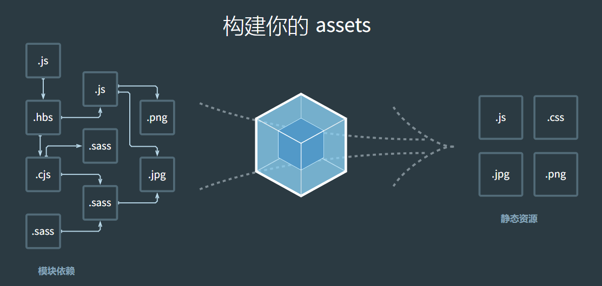

> 参考文献
>
> 1. [webpack 中文指南](https://doc.webpack-china.org/)
> 2. [webpack 多页应用架构专题系列](http://array_huang.coding.me/webpack-book/)
> 3. [webpack github.io](http://webpack.github.io/)
> 4. [详解Webpack2的那些路径](http://www.cnblogs.com/libin-1/p/6592114.html)
> 5. [Webpack4.x 学习过程](https://segmentfault.com/a/1190000014852019)

# # 前言

当前使用版本：v4.12.0

[Webpack 3.X - 4.X 升级记录](http://blog.csdn.net/qq_16559905/article/details/79404173)

# # 概述




Webpack 是一个前端资源打包工具。它将根据模块的依赖关系进行静态分析，然后将这些模块按照指定的规则生成对应的静态资源。

从图中我们可以看出，Webpack 可以将多种静态资源 js、css、less 转换成一个静态文件，减少了页面的请求。

## 1. 为什么需要webpack？

现在的前端网页功能丰富，特别是SPA（single page web application 单页应用）技术流行后，JavaScript的复杂度增加和需要一大堆依赖包，还需要解决SCSS，Less……新增样式的扩展写法的编译工作。所以现代化的前端已经完全依赖于WebPack的辅助了。

现在最流行的三个前端框架，可以说和webpack已经紧密相连，框架官方都推出了和自身框架依赖的webpack构建工具。

- React.js     + WebPack
- Vue.js        + WebPack
- AngluarJS + WebPack

从此可以看出，无论你前端走那条线，你都要有很强的Webpack知识，才能祝你成为这个框架领域的大牛。

## 2. 什么是webpack？

> WebPack可以看做是**模块打包机**：它做的事情是，分析你的项目结构，找到JavaScript模块以及其它的一些浏览器不能直接运行的拓展语言（Sass，TypeScript等），并将其转换和打包为合适的格式供浏览器使用。在3.0出现后，Webpack还肩负起了优化项目的责任。

这段话有三个重点：

- 打包：可以把多个Javascript文件打包成一个文件，减少服务器压力和下载带宽。
- 转换：把拓展语言转换成为普通的JavaScript，让浏览器顺利运行。
- 优化：前端变的越来越复杂后，性能也会遇到问题，而WebPack也开始肩负起了优化和提升性能的责任。


## 3. 模块化

[本节参考链接](https://www.mtons.com/content/7393)

随着网站内容越来越复杂，浏览器和用户的交互越来越细腻，网站再也不是简单的内容呈现，更像是一个复杂的客户端软件，其中html/css/js代码越来越多，逻辑越来越复杂，越来越不便于管理，为了解决这个问题，才出现了模块化的概念，也就是说模块化更多的是工程方面的产出，为了应对更复杂的网站开发。

模块化是一种处理复杂系统分解为更好的可管理模块的方式。简单来说就是解耦，简化开发，一个模块就是实现特定功能的文件，可以更方便地使用别人的代码，想要什么功能，就加载什么模块。模块开发需要遵循一定的规范。

模块化，让我们可以把复杂的程序细化为小的文件;类似于TypeScript这种在JavaScript基础上拓展的开发语言：使我们能够实现目前版本的JavaScript不能直接使用的特性，并且之后还能转换为JavaScript文件使浏览器可以识别；

这些改进确实大大的提高了我们的开发效率，但是利用它们开发的文件往往需要进行额外的处理才能让浏览器识别，而手动处理又是非常繁琐的，这就为WebPack类的工具的出现提供了需求。

### \> 模块化有哪些优点？

✦ 可以兼容多模块风格，无痛迁移老项目。
✦ 一切皆模块，js/css/图片/字体都是模块。
✦ 静态解析，按需打包，动态加载。

### \> 模块化规范

**commonJS 规范**

CommonJS就是一个JavaScript模块化的规范，是用在服务器端的node的模块规范，前端的webpack也是对CommonJS原生支持的。

> a. 特点：

- 模块输出的是一个值的拷贝， 模块是运行时加载，同步加载
- CommonJS 模块的顶层 `this` 指向当前模块

> b. API：

- require : 加载所要依赖的其他模块
- module.exports 或者exports :对外暴露的接口

> c. 示例：新建两个模块 A.js、B.js

```javascript
// A.js
// writing one:
module.exports = {
    a:1
  	b:2
}

// writing two:
module.exports.a = 1;
module.exports.b = 2;

// writing three:
exports.a = 1;
exports.b = 2;

// 三种写法结果是一样，对外暴露的接口的结果是一致的
```

```javascript
// B.js
console.log(require('./B.js')); {a:1, b:2}
```

注意：

-> exports 与module.exports 的区别：exports 是对 module.exports 的引用，不能直接给exports 赋值，直接赋值无效，结果是一个空对象，module.exports 可以直接赋值。

-> 一个文件不能写多个module.exports ，如果写多个，对外暴露的接口是最后一个module.exports。

->模块如果没有指定使用module.exports 或者exports 对外暴露接口时，在其他文件就引用该模块，得到的是一个空对象。

**AMD 规范**

AMD 即 Asynchronous  Module  Definition，中文名是“异步模块定义”的意思。它是一个在浏览器端模块化开发的规范，AMD 是 RequireJS 在推广过程中对模块定义的规范化产出，所以AMD规范的实现，就是的require.js了

> a. 特点：

异步加载，不阻塞页面的加载，能并行加载多个模块，但是不能按需加载，必须提前加载所需依赖。

> b. API：

```javascript
// 1.定义声明模块，参数id 模块id标识(可选)，参数二是一个数组（可选），依赖其他模块，最后是回调函数
define(id?,[]?,callbakc)
// 2.加载模块，参数一，是数组，指定加载的模块，参数二回调函数，模块加载完成后执行
require([module],callback)
```

还有一个配置属性API：

```javascript
require.config({

	baseUrl: // 基本路径

	paths： // 对象，对外加载的模块名称  ： 键值关系，键：自定义模块名称，值 ：文件名或者文件路径(不要写文件后缀.js),可以是字符串，数组（如果第一个加载失败，会加载第二个）

	shim： // 对象，配置非AMD 模式的文件，每个模块要定义（1）exports：值（指在js文件暴露出来的全局变量，如：window.a）（2）deps： 数组，表明该模块的依赖性
})
```

注意：paths 的设置加载优化与shim 中配置(AMD模式优先非AMD模式)

> c. 示例：加载不同情况的(非AMD 模式，AMD 模式)的例子

示例1：加载AMD模式模块

```html
<!-- 首先，引入requiresJS -->
<!-- requirejs.html -->
<!DOCTYPE html>
<html>
    <head>
        <meta charset="UTF-8">
        <title></title>
        <!--data-main ：
			设置data-main属性,设置加载主文件路径,默认设置该目录为根目录 
			如：../js/index.js ,默认把 ../js 作为模块文件的根模块 -->
        <script src="../js/require.js" data-main="../js/index.js"  defer async="async" type="text/javascript"></script>
    </head>
</html>
```

```javascript
// Math.js
// 定义了AMD 模式的模块,并且引入了jquery 模块 （这里的jquery属于AMD模式）
define(['jquery'],function(_){
    // define(['moudel1','moudel2'],callback())
    // 如果一个模块不依赖其他模块,直接使用define()函数写，
    // 如果一个模块依赖其他模块,define()第一个参数是数组
    // 回调函数的参数对应第一个参数数组的值，按顺序
    console.log(_);//ƒ (a,b){return new m.fn.init(a,b)}
　　return { 
        add:function(x,y){
            return x+y;
        },
    }
})
```

```javascript
// index.js (主入口)
// 配置好加载路径
require.config({
    baseUrl:"../js",
    paths:{    
        "index":"index", // 主入口文件 index: 
　　　　　"jquery":"jquery.min",// jquery 库，符合AMD模式(1.7 版本以上符合AMD)
        "maths":"Math", //自定义AMD 模式的模块
    }
})

// 加载maths.js
require(["maths"],function(_math){
    console.log( _math); // {add: ƒ }
})
```

示例2：加载非AMD 模式的模块，依赖非AMD模块 ，第三方插件（如jquery .lazyload 插件）

这里用到了shim属性配置(加载非AMD 模式)

```javascript
// index.js (主入口)
// 配置好加载路径
require.config({
    baseUrl:"../js",
    paths:{    
        "index":"index", // 主入口文件 index: 
        "jquery":"jquery.min",//jquery 库(1.7 版本以上符合AMD)
        "jquery.lazyload": [ // 非AMD 模式 依赖jquery 库的第三方插件
    　      　"http://apps.bdimg.com/libs/jquery-lazyload/1.9.5/jquery.lazyload.min",
　　　　　     "jquery.lazyload"
　　　　　　],
  　　　　 //这里加载了百度静态资源cdn和本地的资源(如果第一个加载失败，会加载本地)}，
    },
    shim:{
        "jquery.lazyload":{ 
            deps:["jquery"] //配置 jquery 依赖
        }
    }
});
// 加载jquery 和jquery.lazyload
require(["jquery","jquery.lazyload"],function($){
    $("img.lazy").lazyload({effect: "fadeIn"});
})
```

示例3：加载非AMD 模式 (闭包形式)的模块，有依赖（非AMD模式）,自定义（与示例2，差不多）

指定了config 配置的 shim 中exports属性，有返回值

```javascript
// util.js,
// 非闭包，暴露了两个全局变量 utils ,obj
var utils = {};  
var obj   = {};
utils.add = function(v1,v2){  
    return v1+v2;  
}; 
obj.reduce = function(x,y){
    return x-y;
}
// test1.js
// 非AMD 模式的 (闭包形式)，一般插件写法，使用wondow 对外暴露了objTest 变量
(function(window,$,obj,utils){
    console.log($);//ƒ (a,b){return new m.fn.init(a,b)}
    console.log(utils);//{add: ƒ}
    console.log(obj);//{reduce: ƒ}
    window.objTest = {};//window等于对外暴露接口
    
})(window,jQuery,obj,utils)//  只能写接口$或者 jQuery(不能写AMD 的模块名称jquery,会报错undefined)

// index.js (主入口)
// 配置好加载路径
 require.config({
    baseUrl:"../js",
    paths:{    
        "index":"index", // 主入口文件 index: 
        "jquery":"jquery.min",//jquery 库(1.7 版本以上符合AMD)
    },
　　shim:{
   　　 "test1":{// 非AMD 模式的(闭包形式)
            deps:["util"],//设置依赖util:实际是,加载 了 "../js/util.js" 依赖该js 中的所有全局变量
            exports:"objTest" , //在test1.js 文件中，使用了window.objTest 对外暴露了接口
        },
    　　"util":{ // 非AMD 模式  (非闭包)
            deps:["jquery"],//设置依赖
        }
    }
})
// 加载 test1.js
require(["test1"],function(_){
    console.log(_);//返回的是一个对象 {},因为在配置中设置了exports
    console.log("load finshing...")
});
```

```javascript
//加载 util.js
require(["util"],function(_){
    console.log(_);//返回的是一个undefind,没有配置exports
    console.log("load finshing...")
});
```

分析示例3：在 test1.js 中，闭包函数，一共传了四个值，分别是  window,jQuery,obj,utils ,

window 就不用说了，jQuery 从哪里传来呢？index.js 主文件中的shim 中test1 模块的依赖只有util （等于加载了util.js 文件，依赖了该文件中的所有全局变量，obj 和utils）; 回归jQuery 从哪里加载进来，别忘paths 的配置加载优先shim 配置，所以先加载了paths 中的jquery 模块，即使jquery 也是支持AMD ，但是也是暴露了window.jQuery 全局变量，所以后于jquery 模块的加载，无论是AMD 还是非AMD 都可以得到该全局变量jQuery

注意 ：非AMD 模块中依赖AMD 模块，是不可以直接在deps属性中设置AMD的模块名作为依赖，这样是直接报错的

**CMD 规范**

CMD规范是阿里的玉伯提出来的，实现js库为sea.js。 它和requirejs非常类似，即一个js文件就是一个模块，但是CMD的加载方式更加优秀，是通过按需加载的方式，而不是必须在模块开始就加载所有的依赖。

玉伯说过能够亲眼看到seajs死掉也是一种幸福(说明了什么，你懂的)

```javascript
seajs.config({
    // 设置别名，方便调用
    alias: { 'jquery': ' http://apps.bdimg.com/libs/jquery/2.1.4/jquery.min.js' }
});

define(function(require, exports, module) {
    // 引用jQuery模块
    var $ = require('jquery');
});

// 加载多个模块，在加载完成时，执行回调
seajs.use(['./a', './b'], function(a, b) {
    a.doSomething();
    b.doSomething();
});
```

**ES6 的module规范**

ES6 在语言标准的层面上，实现了模块功能，而且非常简单，ES6到来,完全可以取代 CommonJS 和AMD规范，成为浏览器和服务器通用的模块解决方案。由vue,Angular  React这些mvvm 模式的框架发展，让前端的编程变得模块化，组件化。

> a. 特点：

- ES6 模块之中，顶层的`this`指向`undefined`，即不应该在顶层代码使用`this`。
- 自动采用严格模式"use strict"。须遵循严格模式的要求

- ES6 模块的设计思想是尽量的静态化，编译时加载或者静态加载，编译时输出接口
- ES6 模块export、import命令可以出现在模块的任何位置，但是必须处于模块顶层。如果处于块级作用域内，就会报错
- ES6 模块输出的是值的引用

> b. API

**export**：用于规定模块的对外接口，

**import**：用于输入其他模块提供的功能。

> c. 补充

**export 命令**

`export` 命令除了输出变量，还可以输出函数或类（class），不同的数据类型 

```javascript
// export.js
// 变量
export var m = 1;

// 函数
export function fn(x, y) {
  return x * y;
};

// 类class
export class class1{}

// export输出的变量就是本来的名字，但是可以使用as关键字重命名
function v1() { ... }
function v2() { ... }
export {
  v1 as streamV1,
  v2 as streamV2,
  v2 as streamV3
};
```

**import 命令**

使用`export`命令定义了模块的对外接口以后，其他 JS 文件就可以通过`import`命令加载这个模块。

```javascript
// main.js
// 静态加载,只加载export.js 文件中三个变量，其他不加载
import {m, fn, streamV1} from './export.js';

// import命令要使用as关键字，将输入的变量重命名。
import {fn as fn1} from './export.js';

// 整体加载模块
improt * as all from './export.js'
```

**export default 命令**

本质上，`export default`就是输出一个叫做`default`的变量或方法

```javascript
// export-default.js
export default function foo() {
    console.log('foo');
}

// 或者写成

function foo() {
    console.log('foo');
}
//foo函数的函数名foo，在模块外部是无效的。加载的时候，视同匿名函数加载
export default foo;


// import-default.js
import  myfoo from './export-default.js';
```

比较一下默认输出和正常输出

```javascript
// 第一组
export default function crc32() { // 输出
  // ...
}

import crc32 from 'crc32'; // 输入

// 第二组
export function crc32() { // 输出
  // ...
};

import {crc32} from 'crc32'; // 输入
```

分析：上面代码的两组写法，

第一组是使用`export default`时，对应的`import`语句不需要使用大括号；

第二组是不使用`export default`时，对应的`import`语句需要使用大括号。

 以下的写法是有效的:

```javascript
// modules.js
function add(x, y) {
    return x * y;
  }
export {add as default};
// 等同于
// export default add;

// app.js
import { default as foo } from 'modules';
// 等同于
// import foo from 'modules';
```

浏览器加载规则：

 1、浏览器加载 ES6 模块，也使用`<script>`标签，但是要加入`type="module"`属性。

浏览器对于带有`type="module"`的`<script>`，都是异步加载，不会造成堵塞浏览器.

```html
<script type="module" src="./foo.js"></script>
```

2、ES6 模块也允许内嵌在网页中，语法行为与加载外部脚本完全一致。

```html
<script type="module">
  import utils from "./utils.js";
  // other code
</script>
```

# # 安装

## 1. 前提条件

下载最新版的 [nodeJS](http://nodejs.cn/download/)

```shell
$ node -v
v10.1.0
```

## 2. 全局安装

```shell
$ npm i -g webpack webpack-cli
```

> 提示：webpack-cli 为webpack的命令行工具，如果使用webpack 4+ 版本，则需要添加该依赖。

查看版本：

```shell
$ webpack -v
4.1.1
```

如果你这时**安装失败**了（出现了报错信息），一般有三种可能：

- 检查你node的版本号，如果版本号过低，升级为最新版本。
- 网络问题，可以考虑使用cnpm来安装（这个是淘宝实时更新的镜像）,具体可以登录cnpm的官方网站学习<http://npm.taobao.org/>。
- 权限问题，在Liux、Mac安装是需要sudo权限，如果你是Windows系统，主要使用以管理员方式安装。

> **注意：**全局安装是可以的，但是webpack官方是不推荐的。这会将您项目中的 webpack 锁定到指定版本，并且在使用不同的 webpack 版本的项目中，可能会导致构建失败。

# # 初探 webpack

## 1. 创建项目文件

这里，我们主要以一个小示例帮助大家理解webpack打包的过程及其原理。

首先创建一个空的项目（ “webpack-test” ），打开终端，`cd` 到项目中。

```shell
$ mkdir webpack-test
$ cd webpack-test
```

## 2. 创建 package.json 文件

执行如下指令：

```shell
$ npm init -y
```

“package.json” 文件内容如下：

```javascript
{
  "name": "webpack-test",
  "version": "1.0.0",
  "description": "webpack demo",
  "main": "index.js",
  "scripts": {
    "test": "echo \"Error: no test specified\" && exit 1"
  },
  "keywords": [],
  "author": "Hongyao Li",
  "license": "ISC",
  "devDependencies": {
    "webpack": "^4.8.3",
    "webpack-cli": "^2.1.3"
  }
}
```

## 3. 本地安装webpack

```shell
$ npm i -D webpack webpack-cli
```

> 提示：
>
> -D ，--save-dev 缩写，保存到package.json中，dev是在开发时使用这个包，而生产环境中不使用。

## 4. 建立基本项目结构

```
.
├── dist
    └── index.html
├── node_modules
├── package.json
└── src
    └── js
    	├── main.js
   		├── tools.js
```

>  提示：
>
>  1. src是源码文件，dist是我们编译打包好的文件；一个用于**开发环境**，一个用于**生产环境**。
>  2. node_modules 为 npm 安装依赖自动生成的文件。

## 5. 编辑项目文件

-> index.html

```html
<!DOCTYPE html>
<html lang="zh-Hans">
<head>
    <meta charset="UTF-8">
    <meta name="viewport" content="width=device-width, initial-scale=1.0">
    <meta http-equiv="X-UA-Compatible" content="ie=edge">
    <title>webpack-test</title>
</head>
<body>
    
    <h1 id="title"></h1>
    <!-- 引入main-bundle.js文件/该文件为webpack编译生成的文件 -->
    <script src="./static/js/main-bundle.js"></script>
</body>
</html>
```
-> tools.js
```javascript
function Tool() {}

Tool.prototype.setTitle = function (id, str) {
    document.getElementById(id).textContent = str;
};
// 导出模块
module.exports = Tool;
```
-> main.js
```javascript
// 导入模块
import Tool from "./tools";

// 创建模块实例
var tool = new Tool();
// 调用模块方法
tool.setTitle("title", "Hello, webpack!");
```

## 6. 创建 webpack.config.js 文件

webpack.config.js 就是Webpack的配置文件，这个文件需要自己在**项目根目录下**手动建立。建立好后我们对其进行配置，先看下面的代码（ webpack.config.js 的基本结构），这是一个没有内容的标准webpack配置模版。

```javascript
module.exports={
    // context 是 webpack 编译时的基础目录，入口起点（entry）会相对于此目录查找
    // 若不配置，默认值为当前目录(配置文件所在目录)
    context: path.resolve(__dirname, "./"),
    // 生成映射文件(便于调试)
    // 一般设置值为：inline-source-map
    devtool: "source-map",
    // 开发模式[生产模式(压缩)，开发模式(未压缩)](必须设置)
  	mode: "/[production, development]/",
    // 入口文件的配置项，可以是单一入口，也可以是多入口。
    entry:{},
    // 出口文件的配置项，在webpack2.X版本后，支持多出口配置。
    output:{},
    // 模块：例如解读CSS,图片如何转换，压缩
    module:{},
    // 插件，用于生产模版和各项功能，根据你的需要配置不同功能的插件
    plugins:[],
    // 配置webpack开发服务功能
    devServer:{}
}
```

接下来我们对 “webpack.config.js” 文件进行简单配置：

```javascript
// 引入webpack
const webpack = require("webpack");
// 引入node 路径
const path    = require("path");

module.exports = {
    // 配置基础路径为当前目录（默认为配置文件所在的当前目录）
    context: path.resolve(__dirname, './'),
    // 配置入口文件
    entry: {
        "main": "./src/js/main.js"
    },
    // 配置出口文件
    output: {
        // 所有输出文件的目标路径，必须是绝对路径（使用 Node.js 的 path 模块）
        path: path.resolve(__dirname, "./dist/"),
        // 输出文件名
        filename: "static/js/[name]-bundle.js"
    }
};
```

## 7. 编译

在 webpack v4.0 之后执行打包任务需指定打包模式：

- `--mode development`：开发模式（不压缩打包后的文件）
- `--mode production`：产品模式（压缩打包后的文件）

如果不指定打包模式，将会输出如下警告：

```shell
WARNING in configuration
The 'mode' option has not been set. Set 'mode' option to 'development' or 'production' to enable defaults for this environment. 
```

当然，webpack也允许你直接在配置文件中进行配置，如下所示：

```javascript
module.exports = {
  mode: 'development'
};
```

配置文件配置完成之后，直接打开终端在当前项目目录下执行 “webpack + 打包模式” 指令即可完成编译：

```shell
$ webpack --mode development
Hash: 53a9b836ce498bab2624
Version: webpack 4.8.3
Time: 81ms
Built at: 2018-05-19 13:15:28
                   Asset      Size  Chunks             Chunk Names
static/js/main-bundle.js  3.73 KiB    main  [emitted]  main
Entrypoint main = static/js/main-bundle.js
[./src/js/main.js] 124 bytes {main} [built]
[./src/js/tools.js] 160 bytes {main} [built]
```

执行打包任务之后，会在 “./dist/static/js” 目录下生产一个  ”main-bundle.js“ 文件，运行 ”index.html“ 可以看到 ”Hello, webpack!“ 说明打包成功。

> 提示：你可以尝试不同的打包模式观察二者的区别。

## 8. 补充

### 8.1. * 指定配置文件编译

在实际开发过程中，你可能会创建不同的config.js文件来满足不同的开发需求，比如你在开发阶段，通常会创建一个 “webpack.dev.config.js” 文件，那么你在执行编译指令的时候需要指向该配置文件，如下所示：

```shell
$ webpack --config webpack.dev.config.js 
Hash: 53a9b836ce498bab2624
Version: webpack 4.8.3
Time: 80ms
Built at: 2018-05-19 13:25:16
                   Asset      Size  Chunks             Chunk Names
static/js/main-bundle.js  3.73 KiB    main  [emitted]  main
Entrypoint main = static/js/main-bundle.js
[./src/js/main.js] 124 bytes {main} [built]
```

### 8.2. * 编译参数配置

webpack 自身提供了一些参数来优化编译任务，以下简单列出了一些参数：

| 参数                      | 描述                |
| ----------------------- | ----------------- |
| -w \| --watch           | 观察文件系统的变化         |
| -p                      | 对打包后的文件进行压缩（产品模式） |
| --colors                | 开启控制台颜色           |
| --progress              | 显示打包进度            |
| --display-modules       | 显示打包模块            |
| --display-reasons       | 显示添加打包模块的原因       |
| --display-error-details | 出错时错误的详情          |

> 提示：想了解webpack更多参数，可在终端输入 `webpack --help`  查看

这里以监听为例，执行编译的时候带上 -w 参数，如下所示：

```shell
$ webpack --config webpack.dev.config.js  -w
```

当你对文件做了任何修改都会进行自动编译

如果你想要取消监听状态，可使用快捷键：CTR/CMD+C

### 8.3. * 使用NPM简化编译指令

可以发现，如果执行编译任务，特别是在参数比较多的情况，是比较麻烦的，我们可以在 npm 的 ”package.json“ 文件中进行添加一个脚本指令的字段，如下所示：

```json
"scripts": {
    "build": "webpack --config webpack.dev.config.js  -w"
}
```

在 ”package.json“ 文件中配置添加完脚本配置之后，我们可直接通过 ”npm run dev“ 指令执行打包任务，如下所示:

```shell
$ npm run build
npm WARN npm npm does not support Node.js v10.1.0
npm WARN npm You should probably upgrade to a newer version of node as we
npm WARN npm can't make any promises that npm will work with this version.
npm WARN npm Supported releases of Node.js are the latest release of 4, 6, 7, 8, 9.
npm WARN npm You can find the latest version at https://nodejs.org/

> webpack-test@1.0.0 dev /Users/LiHongyao/Desktop/webpack-test
> webpack --config webpack.dev.config.js  --mode development -w


Webpack is watching the files…

Hash: 3a68fb00fe43523ef730
Version: webpack 4.8.3
Time: 91ms
Built at: 2018-05-19 13:35:12
                   Asset      Size  Chunks             Chunk Names
static/js/main-bundle.js  3.74 KiB    main  [emitted]  main
Entrypoint main = static/js/main-bundle.js
[./src/js/main.js] 127 bytes {main} [built]
[./src/js/tools.js] 160 bytes {main} [built]
```

可以发现，通过这种方式执行打包任务更加方便。

至此，你已经初步了解了webpack的基本使用及webpack模块化思想。

# # 核心

## 1. Entry

`Entry`：入口起点(entry point)指示 webpack 应该使用哪个模块，来作为构建其内部依赖图的开始。进入入口起点后，webpack 会找出有哪些模块和库是入口起点（直接和间接）依赖的。

入口文件常用的配置形式如下：

```js
module.exports {
    entry: {
        "main": "./src/js/main.js",
        "news": "./src/pages/news.html"  
    }
}
```

> 提示：入口文件配置也可以用字符串或数组，一般都会使用对象设置，在多页面项目中设置出口时，通过`[name]` 即可获取文件名，其中文件名就是入口设置中的 `key` 项。

## 2. Output

`Output`：该属性告诉 webpack 在哪里输出它所创建的 bundles，以及如何命名这些文件。你可以通过在配置中指定一个 output 字段，来配置这些处理过程。

出口文件常用的配置形式如下：

```javascript
module.exports {
	// 输出目录
  	path: path.resolve(__dirname, "./dist/"),
  	// 输出文件名
  	filename: "static/js/[name]-bundle.js",
  	// 处理静态资源路径
  	// 静态资源最终访问路径 = output.publicPath + 资源loader或插件等配置路径
  	// 这里假设开启devServer服务
  	publicPath: "http://localhost:8080/"
}
```

- `[name]`：模块名称，也就是在指定入口时的 `key` 值。
- `[hash]`：打包后文件的 hash 值，md5，保证文件唯一性。
- `[chunkhash]`：模块自身的hash值。

## 3. Loader

Webpack 本身只能处理 JavaScript 模块，如果要处理其他类型的文件，就需要使用 loader 进行转换。Loader 需要单独安装并且需要在 “webpack.config.js” 中的 `module` 关键字下进行配置，Loader 的配置包括以下几方面：

- `test`：用于匹配处理文件的扩展名的表达式，这个选项是必须进行配置的；
- `use`：loader名称，就是你要使用模块的名称，这个选项也必须进行配置，否则报错；
- `include/exclude`：手动添加必须处理的文件（文件夹）或屏蔽不需要处理的文件（文件夹）（可选）；

### 3.1. [babel-loader](https://www.npmjs.com/package/babel-loader)

[Babel](https://babeljs.cn/) 是一个 JavaScript 编译器。

**> 概述：**

通常用于将ES6转换为ES5的语法。

**> 安装：**

```shell
$ npm i -D babel-cli babel-core babel-env babel-loader
```

**> 配置：**

```javascript
module: {
    rules: [
        {
            test: /\.js$/,
            exclude:/node_modules/,
            use: {
                loader: "babel-loader",
                options: {
                    presets: ["env"]
                }
            }
        }
    ]
}
```

### 3.2. [css-loader](https://www.npmjs.com/package/css-loader)、[style-loader](https://www.npmjs.com/package/style-loader)

**> 概述：**

webpack提供两个loader处理样式表，比如你在某个.js文件中通过如下方法引入某个样式，webpack 是不能处理的：

```js
import "../css/index.css";
```

css-loader 和 style-loader，二者处理的任务不同：

- css-loader：使你能够使用类似 “import” 和 “url()”  的方法实现 “require()” 的功能。

- style-loader：将所有计算后的样式加入页面中。

**> 安装：**

```shell
$ npm i -D css-loader style-loader
```

**> 配置：**

```javascript
module: {
    rules: [
        {
            test: /\.css$/,
            exclude: /node_modules/,
            use: ['style-loader', 'css-loader']
        }
    ]
}
```

> 注意：引用顺序为从右到左，上面配置表示先使用 *css-loader* 是webpack能够处理 import 的样式表，然后通过 *style-loader* 将处理后的样式呈现在页面中。

### 3.3. [less-loader](https://www.npmjs.com/package/less-loader)、[sass-loader](https://www.npmjs.com/package/sass-loader)

**> 概述：**

编译 *Less*/*SASS* 文件，这里以 *less-loader* 为例。

**> 安装：**

```shell
$ npm i -D less-loader less
```

**> 配置：**

```javascript
module: {
    rules: [
        {
            test: /\.less$/,
            exclude: /node_modules/,
            use: ['style-loader', 'css-loader', 'less-loader']
        }
    ]
}
```

> 如果需要分离CSS文件，可使用插件 [extract-text-webpack-plugin](https://www.npmjs.com/package/extract-text-webpack-plugin) 。

### 3.4. [postcss-loader](https://www.npmjs.com/package/postcss-loader)

**> 概述：**

CSS3已经成了前端的必会技能，你一定会为是否需要添加前缀而头疼。以前我在课程中讲过一个can i use的网站，可以查询这些，但是每次都查实在是编码效率太低了。这里我们就学习一下如何通过 *postcss-loader* 给CSS3属性自动添加前缀。

PostCSS是一个CSS的处理平台，它可以帮助你的CSS实现更多的功能，但是今天我们就通过其中的一个加前缀的功能，初步了解一下PostCSS。

**> 安装：**

```shell
$ npm i -D postcss-loader autoprefixer
```

**> 创建 postcss.config.js 文件：**

创建 “postcss.config.js” 文件，并进行相应配置（建议放置在项目根目录下）

```javascript
// postcss.config.js
module.exports = {
    plugins: [
        require("autoprefixer")({
            browsers: ["last 2 versions"]
        })
    ]
};
```

**> 配置：**

```javascript
module: {
    rules: [
        {
            test: /\.(css|less)$/,
            exclude: /node_modules/,
            use: ExtractTextWebpackPlugin.extract({
                fallback: "style-loader",
                use: [{
                    loader: "css-loader",
                    options: {
                        // 压缩CSS
                        minimize: true
                    }
                }, "postcss-loader", "less-loader"]
            })
        },
    ]
}
```

至此，建议你先去学习 *《服务和热更新*》 章节。

### 3.5. [file-loader](https://www.npmjs.com/package/file-loader)、[url-loader](https://www.npmjs.com/package/url-loader)

**> 概述：**

- file-loader：解决引用路径的问题，拿background样式用url引入背景图来说，我们都知道，webpack最终会将各个模块打包成一个文件，因此我们样式中的url路径是相对入口html页面的，而不是相对于原始css文件所在的路径的。这就会导致图片引入失败。这个问题是用file-loader解决的，file-loader可以解析项目中的url引入（不仅限于css），根据我们的配置，将图片拷贝到相应的路径，再根据我们的配置，修改打包后文件引用路径，使之指向正确的文件。
- url-loader：如果图片较多，会发很多http请求，会降低页面性能。这个问题可以通过url-loader解决。url-loader会将引入的图片编码，生成dataURl。相当于把图片数据翻译成一串字符。再把这串字符打包到文件中，最终只需要引入这个文件就能访问图片了。当然，如果图片较大，编码会消耗性能。因此url-loader提供了一个limit参数，小于limit字节的文件会被转为DataURl，大于limit的还会使用file-loader进行copy。

**> 安装：**

```shell
$ npm i -D file-loader url-loader
```

**> 配置：**

> url-loader 配置：

```javascript
{
      test: /\.(png|jpg|jpeg|gif)$/,
      exclude: /node_modules/,
      use: {
          loader: "url-loader",
          options: {
              limit: "1024",
              name: "[name].[ext]",
              outputPath: "static/images/"
          }
      }
}
```

为什么只使用url-loader?

有的小伙伴会发现我们并没有在webpack.config.js中使用file-loader，但是依然打包成功了。我们需要了解file-loader和url-loader的关系。url-loader和file-loader是什么关系呢？简答地说，url-loader封装了file-loader。url-loader不依赖于file-loader，即使用url-loader时，只需要安装url-loader即可，不需要安装file-loader，因为url-loader内置了file-loader。通过上面的介绍，我们可以看到，url-loader工作分两种情况：

1.文件大小**小于**limit参数，url-loader将会把文件转为DataURL（Base64格式）；

2.文件大小**大于**limit，url-loader会调用file-loader进行处理，参数也会直接传给file-loader。

也就是说，其实我们只安装一个url-loader就可以了。但是为了以后的操作方便，我们这里就顺便安装上file-loader。

> file-loader配置：

使用file-loader输出图片

```javascript
{
    test: /\.(png|jpe|jpeg|gif)$/,
    exclude: /node_modules/,
    use: {
        loader: "file-loader",
        options: {
            // 指定输出文件名字
            name: "[name]-[hash:6].[ext]",
            // 指定输出文件路径（相对于出口路径）
            outputPath:"static/images/",
            // 指定图片引用路径前缀
            publicPath: "../images/"
        }
    }
}
```

### 3.6. [html-withimg-loader](https://www.npmjs.com/package/html-withimg-loader) 、[html-loader](https://www.npmjs.com/package/html-loader)

**>  概述：**

webpack处理资源无往不利，但有个问题总是很苦恼，html中直接使用img标签src加载图片的话，因为没有被依赖，图片将不会被打包。这两个loader都可以解决这个问题，图片会被打包，而且路径也处理妥当。额外提供html的include子页面功能。

**> 安装：**

```shell
$ npm i -D html-withimg-loader
$ npm i -D html-loader
```

> 提示：任选一个安装

**> 配置：**

> html-withimg-loader

```javascript
{
    test: /\.html/,
    loader: 'html-withimg-loader'
}
```

> html-loader

```javascript
{
    test: /\.html/,
    loader: 'html-loader'
}
```

## 4. Plugins

插件（Plugins）是用来拓展Webpack功能的，它们会在整个构建过程中生效，执行相关的任务。
Loaders和Plugins常常被弄混，但是他们其实是完全不同的东西，可以这么来说，loaders是在打包构建过程中用来处理源文件的，一次处理一个，插件并不直接操作单个文件，它直接对整个构建过程起作用。

Webpack有很多内置插件，同时也有很多第三方插件，可以让我们完成更加丰富的功能。

要使用某个插件，我们需要通过 NPM 安装它，然后要做的就是在webpack配置中的plugins关键字部分添加该插件的一个实例（plugins是一个数组）。

### 4.1. [Html-Webpack-Plugin](https://github.com/ampedandwired/html-webpack-plugin)

**> 概述**

HtmlWebpackPlugin 简化了HTML文件的创建，以便为你的webpack包提供服务，它可以自动为你生成项目中的html文件。 这对于在文件名中包含哈希的webpack bundle尤其有用，其主要作用如下：

- 为html文件中引入的外部资源如 script、link动态添加每次compile后的hash，防止引用缓存的外部文件问题
- 可以生成创建html入口文件，比如单页面可以生成一个html文件入口，配置**N**个 html-webpack-plugin 可以生成**N**个页面入口

插件的基本作用就是生成html文件，其原理主要是将 webpack中 entry 配置的相关入口thunk  和  extract-text-webpack-plugin 抽取的css样式插入到该插件提供的 template 或者 templateContent 配置项指定的内容基础上生成一个html文件，具体插入方式是将样式link插入到head元素中，script插入到head或者body中。

**> 安装**

```shell
$ npm i -D html-webpack-plugin 
```

**> 配置**

```javascript
// 引入模块
const htmlWebpackPlugin = require("html-webpack-plugin");
module.exports={
	plugins: [
            new htmlWebpackPlugin({
              // 需要引用的原模版文件
              template: "./src/index.html",
              // 设置JS文件插入的位置，可选：“true/body”，“head”
              inject: true,
              // 指定输出文件所依赖的入口文件（*.js）的[name]，
              // 这里的值是由“entry”（入口）属性内定义的
              chunks: ["main"],
              // 输出的子目录及完整文件名
              filename: "index.html"
          });
    ]
};
```

**> 配置项**

- **filename**：输出的子目录及完整文件名。

  > 提示：
  >
  > 1. filename配置的html文件目录是相对于webpackConfig.output.path路径而言的，不是相对于当前项目目录结构的。
  > 2. 指定生成的html文件内容中的 `link` 和 `script` 路径是相对于生成目录下的，写路径的时候请写生成目录下的相对路径。


- **template**：需要引用的原模版文件

- **inject**：向 template 中注入静态资源，不同的配置值注入的位置不经相同。

  1. `true` 或者 `body`：所有JS资源插入到body元素的底部
  2. `head`：所有JS资源插入到head元素中
  3. `false`： 所有静态资源CSS和JS都不会注入到模板文件中

- **favicon**：添加特定favicon路径到输出的html文档中，这个同`title`配置项，需要在模板中动态获取其路径值

- **hash**：`true`|`false`，是否为所有注入的静态资源添加webpack每次编译产生的唯一hash值，添加hash形式如下所示：

  ```html
  <script type="text/javascript" src="js/main.js?80b0228e65c37b046d14"></script>
  ```

- **chunks**：指定输出文件所依赖的入口文件（*.js）的[name]，这里的值是由“entry”（入口）属性内定义的

- **excludeChunks**：这个与`chunks` 配置项正好相反，用来配置不允许注入的thunk。


- **minify**：压缩html配置

  ```javascript
  // 压缩
  minify: {
      // 删除注释
      removeComments: true,
      // 删除空格
      collapseWhitespace: true
  }
  ```

  提示：可在 [此处](https://github.com/kangax/html-minifier#options-quick-reference) 查看关于 minify 的更多配置信息

**> 综合示例**

目录结构：

```javascript
.
├── node_modules
├── package.json
└── src
    ├── js
        ├── index.js
        ├── tools.js
        ├── news.js
    ├── pages
    	├── tools.html
		├── news.html
    ├── index.html
```

配置文件：

```javascript
// 引入模块
const path = require('path');
const htmlWebpackPlugin = require("html-webpack-plugin");

module.exports={
  	mode: "development",
 	context: path.resolve(__dirname, "./"),
    entry: {
        "main" : "./src/js/index.js",
      	"tools": "./src/js/tools.js"
        "news" : "./src/js/news.js"
    },
    output:{
        path:path.resolve(__dirname, './dist/'),
        filename:'static/js/[name]-bundle.js'
    },
    plugins: [
        new htmlWebpackPlugin({
            template: "./src/index.html",
            filename: "index.html",
            inject: "true"
            chunks: ["main"]
        }),
        new htmlWebpackPlugin({
            template: "./src/pages/news.html",
            filename: "static/pages/news.html",
            inject: "true"
            excludeChunks: ["news"]
        }),
      	new htmlWebpackPlugin({
            template: "./src/pages/tools.html",
            filename: "static/pages/tools.html",
            inject: "true"
            excludeChunks: ["tools"]
        }),
    ]
};
```

执行打包任务，./dist 文件目录如下：

```
.
├── ./dist
    ├── index.html
    ├── static
    	├── pages
    		├── news.html
    		├── tools.html
    	├── js
    		├── main-bundle.js
    		├── tools-bundle.js
    		├── news-bundle.js
```

[](http://www.cnblogs.com/wonyun/p/6030090.html)

### 4.2. [clean-webpack-plugin](https://www.npmjs.com/package/clean-webpack-plugin)

**> 说明**

清除文件

**> 安装**

```shell
$ npm i -D clean-webpack-plugin 
```

**> 配置**

```javascript
const CleanWebpackPlugin = require("clean-webpack-plugin");

module.exports={
    plugins: [
        new cleanWebpackPlugin([
            "./dist"
        ])
    ]
};
```

执行打包任务，“dist” 目录下之前生成的文件已被删除。

### 4.3. [BannerPlugin](https://webpack.js.org/plugins/banner-plugin/)

**> 说明**

添加版权声明

**> 安装**

无需安装，该插件为 webpack 内置插件，直接使用即可。

**> 配置 **

```javascript
const webpack = require('webpack');
module.exports = {
    ...
    plugins: [
        new webpack.BannerPlugin("版权所有，翻版必究！")
    ]
};
```


### 4.4. [extract-text-webpack-plugin](https://www.npmjs.com/package/extract-text-webpack-plugin)

**> 概述：**

通过webpack 打包的样式被嵌入到了 bundle.js 文件中，如果你想要将其抽离出来，我们可以使用该插件。

**> 安装：**

```shell
$ npm i -D extract-text-webpack-plugin@next
```

> 提示：在webpack 4.x 中需指定@next版本，即beta版本。

**> 配置：**

```javascript
// 引入插件
const ExtractTextPlugin = require('extract-text-webpack-plugin');

module.exports = {
    module: {
        rules: [
            {
                test: /\.(css|less)$/,
                use: ExtractTextPlugin.extract({
                    fallback: 'style-loader',
                    use: ['css-loader', 'less-loader']
                })
            }
        ]
    },
    plugins: [
        // 创建插件实例/并指定输出路径
        new ExtractTextPlugin('static/css/[name].css')
    ]
};
```

### 4.5. uglifyjs-webpack-plugin

该插件主要用于压缩js，虽然uglifyjs是插件，但是webpack版本里默认已经集成，不需要再次安装。我们直接在 ”webpack.config.js“ 中引入即可：

```javascript
const uglify = require('uglifyjs-webpack-plugin');
```

然后再 plugins 项里进行配置：

```javascript
plugins: [
  new uglify()
]
```

这时候在终端中使用webpack进行打包，你会发现JS代码已经被压缩了。

### 4.6. [purifycss-webpack](https://www.npmjs.com/package/purifycss-webpack)

**> 概述：**

消除未使用的CSS。该插件必须配合  ”extract-text-webpack-plugin“ 插件使用，否则无效。

**> 安装：**

```shell
$ npm i -D purifycss-webpack purify-css
```

**> 配置：**

```javascript
// 因为我们需要同步检查html模板，所以我们需要引入node的glob对象使用
const glob = require("glob");
// 引入purifycss-webpack
const purifyCSSPlugin = require("purifycss-webpack");
```

配置

```javascript
new purifyCSSPlugin({
    paths: glob.sync(path.join(__dirname, "./src/*.html"))
})
```

这里配置了一个paths，主要是需找html模板，purifycss根据这个配置会遍历你的文件，查找哪些css被使用了。

配置好上边的代码，我们可以故意在css文件里写一些用不到的属性，然后用webpack打包，你会发现没用的CSS已经自动给你删除掉了。在工作中记得一定要配置这个plugins，因为这决定你代码的质量，非常有用。

# # 服务和热更新

## 1. 服务

想不想让你的浏览器监听你的代码的修改，并自动刷新显示修改后的结果，其实Webpack提供一个可选的本地开发服务器，这个本地服务器基于node.js构建，可以实现你想要的这些功能，不过它是一个单独的组件 **webpack-dev-server** ，在webpack中进行配置之前需要单独安装它作为项目依赖：

```shell
$ npm i -D  webpack-dev-server
```

devServer作为webpack配置选项中的一项，以下是它的一些配置选项，更多配置可参考 [这里](https://webpack.js.org/configuration/dev-server/) 。

| 配置选项               | 功能描述                                     |
| ------------------ | ---------------------------------------- |
| contentBase        | 默认webpack-dev-server会为根文件夹提供本地服务器，如果想为另外一个目录下的文件提供本地服务器，应该在这里设置其所在目录（本例设置到“dist"目录） |
| port               | 设置默认监听端口，如果省略，默认为”8080“                  |
| inline             | 设置为`true`，当源文件改变时会自动刷新页面                 |
| historyApiFallback | 在开发单页应用时非常有用，它依赖于HTML5 history API，如果设置为`true`，所有的跳转将指向index.html |
| host               | 设置服务器主机号，在开发阶段，一般设置为：localhost           |

把这些命令加到webpack的配置文件中，现在的配置文件 “webpack.config.js” 如下所示：

```javascript
module.exports = {
    devServer:{
        // 设置服务器访问的基本目录
        contentBase:path.resolve(__dirname,'./dist'), //最好设置成绝对路径
        // 设置服务器的ip地址,可以是localhost
        host:'localhost',
        // 设置端口
        port:8090,
        // 设置自动拉起浏览器
        open:true,
      	// 这个配置属性是用来应对返回404页面时定向到特定页面用的
        // 你可以先在./dist根目录下创建404.html，并写入404相应提示内容
        // 然后在浏览器地址栏输入不存在的地址，如：http://localhost:8090/girl.html
        // 此时会定位到404.html
        historyApiFallback: {
            rewrites:[
                {from: /./, to: './404.html'}
            ]
        }, 
    }
};
```

在 “package.json” 中的 `scripts` 对象中添加如下命令，用以开启本地服务器：

```javascript
{
	"scripts": {
    	"dev": "webpack-dev-server"
	},
}
```

在终端中输入`npm run devServer` 即可在本地的 `8090` 端口查看结果。

> 注意：
>
> 1、webpack-dev-server 输出的文件只存在于内存中,不输出真实的文件
>
> 2、如果你自定义了配置文件，如 “webpack.dev.config.js”，那么在执行devServer的时候，也要指定响应的配置文件，如：webpack-dev-server -- config webpack.dev.config.js。
>
> 3、在开发阶段，我们可以通过设置 “output” 中的 “publicPath” 字段访问静态资源，以刚刚配置devServer为例，我们可以在“output”出口设置中添加如下字段：*publicPath: "http://localhost:8090/"*，此时，你静态资源的访问路径将会变成：publicPath + 静态资源地址，待项目上线之后，再将publicPath设置为线上地址即可。

## 2. 自动刷新与模块热替换

webpack-dev-server 的自动刷新和模块热替换机制是紧紧联系在一起的。

**从外部角度看——自动刷新**

当我们对业务代码做了一些修改然后保存后（command+s），页面会自动刷新，我们所做的修改会直接同步到页面上，而不需要我们刷新页面，或重新开启服务。（The webpack-dev-server supports multiple modes to automatically refresh the page）

**从内部角度看——模块热替换**

在热替换（HMR）机制里，不是重载整个页面，HMR程序会只加载被更新的那一部分模块，然后将其注入到运行中的APP中（In Hot Module Replacement, the bundle is notified that a change happened. Rather than a full page reload, a Hot Module Replacement runtime could then load the updated modules and inject them into a running app.）

模块热替换(HMR - Hot Module Replacement)功能会在应用程序运行过程中替换、添加或删除[模块](https://www.webpackjs.com/concepts/modules/)，而无需重新加载整个页面。主要是通过以下几种方式，来显著加快开发速度：

- 保留在完全重新加载页面时丢失的应用程序状态。
- 只更新变更内容，以节省宝贵的开发时间。
- 调整样式更加快速 - 几乎相当于在浏览器调试器中更改样式。

**> 配置**

webpack-dev-server实现自动刷新和模块热替换机制配置如下

你还需要一个插件配置 webpack.HotModuleReplacementPlugin() 

```javascript
module.exports = {
    devServer:{
        // 设置服务器访问的基本目录
        contentBase:path.resolve(__dirname,'./dist'), //最好设置成绝对路径
        // 设置服务器的ip地址,可以是localhost
        host:'localhost',
        // 设置端口
        port:8090,
        // 设置自动拉起浏览器
        open:true,
      	// 这个配置属性是用来应对返回404页面时定向到特定页面用的
        // 你可以先在./dist根目录下创建404.html，并写入404相应提示内容
        // 然后在浏览器地址栏输入不存在的地址，如：http://localhost:8090/girl.html
        // 此时会定位到404.html
        historyApiFallback: {
            rewrites:[
                {from: /./, to: './404.html'}
            ]
        }, 
       // 自动刷新
        inline: true,
        // 模块热替换
        hot: true
    },
    plugins: [
      new webpack.HotModuleReplacementPlugin()
    ]
};
```

执行：npm run dev

打开页面：

```javascript
[HMR] Waiting for update signal from WDS...
Hello, webpack!
Hello!
[WDS] Hot Module Replacement enabled.
```

如果有上面两行 “[HMR] \[WDS]”  输出则表明你已经配置成功。

# # 实战技巧

## 1. 处理静态资源路径

利用extract-text-webpack-plugin插件很轻松的就把CSS文件分离了出来，但是CSS路径并不正确，很多小伙伴就在这里搞个几天还是没有头绪，网上也给出了很多的解决方案，我觉的最好的解决方案是使用publicPath解决，我也一直在用。

**publicPath：**是在webpack.config.js文件的output选项中，主要作用就是处理静态文件路径的。

配置如下：

```javascript
output: {
    filename: "js/bundle.js",
    path: path.resolve(__dirname, "./dist"),
    publicPath: "http://localhost:8080/"
},
```

注意，这里的IP和端口，是你本机的ip或者是你devServer配置的IP和端口。

配置完成后，你再使用webpack命令进行打包，你会发现原来的相对路径改为了绝对路径，这样来讲速度更快。

## 2. 打包后如何调试

作为一个程序员每天的大部分工作就是调试自己写的程序，那我们使用了webpack后，所以代码都打包到了一起，给调试带来了麻烦，但是webpack已经为我们充分考虑好了这点，它支持生产Source Maps来方便我们的调试。

在使用webpack时只要通过简单的devtool配置，webapck就会自动给我们生产source maps 文件，map文件是一种对应编译文件和源文件的方法，让我们调试起来更简单。

在配置devtool时，webpack给我们提供了四种选项。

- source-map：在一个单独文件中产生一个完整且功能完全的文件。这个文件具有最好的source map,但是它会减慢打包速度；
- cheap-module-source-map：在一个单独的文件中产生一个不带列映射的map，不带列映射提高了打包速度，但是也使得浏览器开发者工具只能对应到具体的行，不能对应到具体的列（符号）,会对调试造成不便。
- eval-source-map：使用eval打包源文件模块，在同一个文件中生产干净的完整版的sourcemap，但是对打包后输出的JS文件的执行具有性能和安全的隐患。在开发阶段这是一个非常好的选项，在生产阶段则一定要不开启这个选项。
- cheap-module-eval-source-map：这是在打包文件时最快的生产source map的方法，生产的 Source map 会和打包后的JavaScript文件同行显示，没有影射列，和eval-source-map选项具有相似的缺点。

四种打包模式，由上到下打包速度越来越快，不过同时也具有越来越多的负面作用，较快的打包速度的后果就是对执行和调试有一定的影响。

个人意见是，如果大型项目可以使用source-map，如果是中小型项目使用eval-source-map就完全可以应对，需要强调说明的是，source map只适用于开发阶段，上线前记得修改这些调试设置。

简单配置：

```javascript
module.exports = {
	devtool: 'eval-source-map'
}
```

总结：调试在开发中也是必不可少的，但是一定要记得在上线前一定要修改webpack配置，在打出上线包。

## 3. webpack 模块化配置

现在的前端开发随着ES6的普及已经大面积使用模块化进行开发了，那在webpack.config.js配置文件中，如何进行模块化开发？例如把开发环境的写到一个模块中，把生产环境写到一个模块中。接下来我们学习一下webpack模块化配置的技巧。

### 3.1.1. JavaScript 中的模块化实现

```javascript
// User.js
// 创建对象
let user = {
    username: "Admin",
    password: "123"
}
// 导出模块
module.exports = user;
```

上面的代码是一个最简单的模块化写法，我们声明了一个user对象，并且把这个对象用module.exports导出。然后我们在入口文件中用import进行引入，并进行使用。

```javascript
// main.js
// 导入模块
import user from "./User";

console.log(user.username);
console.log(user.password);
```

这就是JavaScript中的模块化设计。

在导出模块时，我们还可以通过另一种写法，如下所示：

```javascript
exports.info = user;
```

但在引入模块使用的时候，我们需这样使用：

```javascript
import user from "./User"
console.log(user.info.username);
console.log(user.info.password);
```

### 3.1.2. webpack 中的模块化实现

在webpack构建项目的时候，通常我们更倾向于创建某个独立的配置文件，这样便于我们后期维护，比如我在构建项目时的目录如下：

```
.
├── build
	├── webpack.dev.config.js     // 配置编译文件
	├── webpack.entry.config.js   // 配置入口文件
	├── webpack.output.config.js  // 配置出口文件
	├── webpack.loader.config.js  // 配置加载器文件
	├── webpack.plugin.config.js  // 配置插件文件
├── node_modules
├── package.json
├── src
    ├── styles
        ├── index.less
        ├── details.less
    ├── images
    ├── js
    	├── main.js
   		├── details.js
   	├── pages	
   		├── details.html
   	├── index.html
```

其中各文件内容大致如下，这里只是列出了部分文件代码，主要目的还是帮助各位理解webpack中模块化设计技巧以及一些注意点。

#### -> webpack.entry.config.js

```javascript
exports.config = {
    "main"   : "./src/js/main.js",
    "details": "./src/js/details.js"
};
```

#### -> webpack.output.config.js

```javascript
const path = require("path");
exports.config = {
    // 指定输出路径
    // 因为配置文件在build目录下，所以这里加上了“../”
    path: path.resolve(__dirname, "../dist/"),
    // 配置带文件目录的文件名
    filename: "static/js/[name]-bundle-[hash:4].js",
    // 设置静态资源路径，这里设置为devServer本地服务器地址
    publicPath: "http://localhost:8090/"
};
```

#### -> webpack.loader.config.js

```javascript
const ExtractTextWebpackPlugin = require("extract-text-webpack-plugin");

exports.config = [
    // 1. Babel
    {
        test: /\.js$/,
        exclude: /node_modules/,
        use: {
            loader: "babel-loader",
            options: {
                presets: ["env"]
            }
        }
    },
    // 2. 处理CSS
    {
        test: /\.(css|less)$/,
        exclude: /node_modules/,
        use: ExtractTextWebpackPlugin.extract({
            fallback: "style-loader",
            use: [{
                loader: "css-loader",
                options: {
                    // 压缩CSS
                    minimize: true
                }
            }, "postcss-loader", "less-loader"]
        })
    },
    // 3. 处理图片
    {
        test: /\.(png|jpg|jpeg|gif)$/,
        exclude: /node_modules/,
        use: {
            loader: "url-loader",
            options: {
                limit: "1024",
                name: "[name].[ext]",
                outputPath: "static/images/",
            }
        }
    },
    // 处理html中的图片
    {
        test: /\.html/,
        loader: 'html-loader'
    }
]
```

#### -> webpack.plugin.config.js

```javascript
const webpack = require("webpack");
const WebpackHtmlPlugin = require("html-webpack-plugin");
const ExtractTextWebpackPlugin = require("extract-text-webpack-plugin");

exports.config = [
    // 1. 分离CSS
    new ExtractTextWebpackPlugin("static/css/[name].css"),
    // 2. 热更新
    new webpack.HotModuleReplacementPlugin(),
    // 3. 页面处理
    new WebpackHtmlPlugin({
        // 需要引用的原模版文件
        template: "./src/index.html",
        // 设置JS文件插入的位置，可选：“true/body”，“head”
        inject: true,
        // 指定输出文件所依赖的入口文件（*.js）的[name]，这里的值是由“entry”（入口）属性内定义的
        chunks: ["main"],
        // 输出的子目录及完整文件名
        filename: "index.html"
    }),
    new WebpackHtmlPlugin({
        template: './src/pages/details.html',
        inject: true,
        chunks: ["details"],
        filename: "static/pages/details.html"
    })
]
```

#### -> webpack.dev.config.js

```javascript
const path         = require("path");
const entryConfig  = require("./webpack.entry.config");
const outputConfig = require("./webpack.output.config");
const pluginConfig = require("./webpack.plugin.config");
const loaderConfig = require("./webpack.loader.config");

module.exports = {
    // 配置开发模式
    mode: "production",
    // 配置映射文件
    // devtool: "inline-source-map",
    // 配置基础目录
    // 因为配置文件放置于build目录下
    // 这里将编译基础目录设置为项目根目录
    context: path.resolve(__dirname, "../"),
    // 配置入口
    entry: entryConfig.config,
    // 配置出口
    output: outputConfig.config,
    // 配置加载器
    module: {
        rules: loaderConfig.config
    },
    // 配置插件
    plugins: pluginConfig.config,
    // 配置本地服务
    devServer:{
        // 设置服务器访问的基本目录
        contentBase:path.resolve(__dirname,'./dist'), //最好设置成绝对路径
        // 设置服务器的ip地址,可以是localhost
        host:'localhost',
        // 设置端口
        port:8090,
        // 设置自动拉起浏览器
        open:true,
        // 自动刷新
        inline: true,
        // 模块热替换
        hot: true
    },
};
```

#### -> package.json

```javascript
{
  "scripts": {
    "build": "webpack --config build/webpack.dev.config.js",
    "dev": "webpack-dev-server --config build/webpack.dev.config.js"
  },
}
```

## 4. 优雅打包第三方类库

在工作中引用第三方的框架是必不可少的，比如引入JQuery或者Vue，但是很多小伙伴一遇到引入第三方的类库时就不知道如何操作了。这一小节就学习一下如何优雅并正确的用webpack引入第三方库。我们讲两种打包的方法，小伙伴们可以根据自己的喜好选择，个人认为两种都是比较不错的。

### 2.1. 直接引入

**> 安装jQuery**

```shell
$ npm i -S jquery
```

安装时需要注意的时Jquery最终要在生产环境中使用，所以我们这里要使用**–S**进行安装。

**> 修改entry.js文件**

安装好后，还需要引入到我们的main.js中，这里直接使用import进行引入就可以。

```javascript
import $ from 'jquery';
```

这里引入是不需要我们写相对路径的，因为jquery的包是在node_modules里的，只要写一个包名jquery，系统会自动为我们查找的。

引入好后我们就可以在main.js里使用jquery，我们可以加入下面的代码，然后进行测试。

```javascript
$("body").text("Hello, webpack!");
```

可以看到上面是标准的jquery代码，你可以执行打包任务进行测试，现在代码顺利运行了，这说明我们引用的JQuery库成功了。需要说的是你不仅可以在入口中进行引入，你还可以在任何你需要的js中引入，webpack并不会重复打包，它只给我们打包一次。

### 2.2. Plugins 引入

如果你觉的上面的方法和webpack没什么关系，只是普通的引入，webpack只是负责了一下打包，这样并没有全局感。那再学习一种在webapck.config.js中配置的方法，这种不需要你在入口文件中引入，而是webpack给你作了全局引入。这个插件就是 **ProvidePlugin**。

ProvidePlugin是一个webpack自带的插件，Provide的意思就是装备、提供。因为ProvidePlugin是webpack自带的插件，所以要先再webpack.config.js中引入webpack。

```javascript
const webpack = require('webpack');
```

在webpack.config.js里引入必须使用require，否则会报错的，这点小伙伴们一定要注意。

引入成功后配置我们的plugins模块，代码如下。

```javascript
plugins:[
    new webpack.ProvidePlugin({
        $:"jquery"
    })
],
```

配置好后，就可以在你的入口文件中使用了，而不用再次引入了。这是一种全局的引入，在实际工作中也可以很好的规范项目所使用的第三方库。

**总结：**每一个项目都可能引入第三方类库，而像Vue和Angular这样的成熟框架都推出了自己的webpack框架，比如**vue-cli**。但是很多情况还是需要我们手动更改这些配置好的webpack来适用于我们的公司项目，所以这节课的知识也是在工作中经常使用的，希望小伙伴们一定要重视并进行练习。

## 5. watch的正确使用方法

在初级开发阶段，使用webpack-dev-server就可以充当服务器和完成打包任务，但是随着你项目的进一步完成，可能需要前后台联调或者两个前端合并代码时，就需要一个公共的服务器了。这时候我们每次保存后手动打包显然效率太低，我们希望的场景是代码发生变化后，只要保存，webpack自动为我们进行打包。这个工具就是watch，这节课我们把wacht完全学会，你会发现在开发中更加的得心应手。

**\> watch的配置**

很多小伙伴认为–watch直接使用就可以，并没有什么需要讲的。其实这只是初级的用法，但是在学习一种技术时，我们必须要做到了解全部，也就是常说的知其然知其所以然。我们看下面的配置代码，我在代码中已经做出了解释。

```javascript
watchOptions:{
    // 检测修改的时间，以毫秒为单位
    poll:1000, 
    // 防止重复保存而发生重复编译错误。这里设置的500是半秒内重复保存，不进行打包操作
    aggregateTimeout:500, 
    // 不监听的目录
    ignored:/node_modules/, 
}
```

上边的每一行配置我都作了说明，有时候你在没配置的情况下，直接用webpack –watch是不起作用的，这时候你需要进行配置这些选项。

配置好后，我们就可以痛快的使用watch了，在大型项目中，这大大加快了我们的开发效率，不用反复的手动打包了。

## 6. webpack 优化黑技能

作为一个程序员，无论是写什么程序都要有一颗不断优化的心。webpack在优化这条路上，也为我们作了很多配置，这节课我们就看看工作中常用的webpack优化黑技能。

### 6.1. ProvidePlugin 和 import

在前面章节中学习了如何引入第三方类库，并引入了jquery，在引用JQuery时我们用了两种方法，第一种是import，第二种是使用ProvidePlugin插件。那两种引入方法有什么区别那?

- import引入方法：引用后不管你在代码中使不使用该类库，都会把该类库打包起来，这样有时就会让代码产生冗余。
- ProvidePlugin引入方法：引用后只有在类库使用时，才按需进行打包，所以建议在工作使用插件的方式进行引入。

### 6.2. 抽离JQuery

上边的方法只是优化的第一步，工作中你会发现，不适用的类库几乎我们也不会引入，所以上边只是一个必要操作的第一步。那往往把第三方类库抽离出来，才是最好的解决方法。

1. 修改入口文件

抽离的第一步是修改入口文件，把我们的JQuery也加入到入口文件中，看下面的代码。

```javascript
// webpack.config.js
 entry:{
        entry:'./src/js/entry.js',
        jquery:'jquery'
 },
```

2. 引入插件

我们需要引入optimize优化插件，插件里边是需要配置的，具体配置项看下面的代码。

```javascript
new webpack.optimize.splitChunks({
    // name对应入口文件中的名字，我们起的是jQuery
    name:'jquery',
    // 把文件打包到哪里，是一个路径
    filename:"dist/js/jquery.min.js",
    // 最小打包的文件模块数，这里直接写2就好
    minChunks:2
}),
```

**minChunks**一般都是固定配置，但是不写是不行的，你会打包失败。

**filename**是可以省略的，这是直接打包到了打包根目录下，我们这里直接打包到了dist文件夹下边。

配置完成后，我们可以先删掉以前打包的dist目录，然后用webpack再次打包，你会发现jquery被抽离了出来，并且我们的entry.js文件变的很小。

## 7. 静态资源集中输出

工作中会有一些已经存在但在项目中没有引用的图片资源或者其他静态资源（比如设计图、开发文档），这些静态资源有可能是文档，也有可能是一些额外的图片。项目组长会要求你打包时保留这些静态资源，直接打包到指定文件夹。其实打包这些资源只需要用到copy-webpack-plugin。

copy-webpack-plugin 就是专门为我们作静态资源转移的插件，不过它不同上两节使用的插件，它是需要安装的。

1. 安装

```shell
$ npm i -D copy-webpack-plugin
```

2. 引入

```javascript
const copyWebpackPlugin= require("copy-webpack-plugin");
```

3. 配置

```javascript
new copyWebpackPlugin([
    {
        from: path.resolve(__dirname, "./src/json"),
        to: "./json"
    }
])
```

- from：要打包的静态资源目录地址，这里的__dirname是指项目目录下，是node的一种语法，可以直接定位到本机的项目目录中。
- to：要打包到的文件夹路径，跟随output配置中的目录。所以不需要再自己加__dirname。

配置好后，我们就可以使用webpack 进行打包了，你会发现图片按照我们的配置打包了过去。

## 8. 解析 -> 创建别名

有时候我们不想路径暴露出去，可以使用取别名的形式：

```javascript
moudle.exports = {
  resolve: {
        // 创建别名
        alias: {
            'main-less': 'path.resolve(__dirname, './src/less/main.less')',
            'font-icon': 'font-awesome/css/font-awesome.css'
        }
    }
}
```

这样在需要引入对应插件的时候，直接使用即可：

```js
require("normalize-css");
require("font-icon");
```


