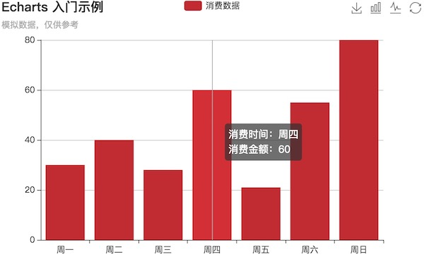

# # 简介

[echarts](http://echarts.baidu.com/index.html) ，缩写来自于Enterprise Charts，商业级数据图表。

# # 下载

[点击前往下载页面](http://echarts.baidu.com/download.html)

echarts 提供了不同打包的下载，可根据开发者功能和体积上的需求进行相应的下载。

# # 引用

echarts 引入方式比较简单，只需要像普通的 JavaScript 库一样用 script 标签引入即可。

```html
<!DOCTYPE html>
<html lang="zh-Hans">
<head>
    <meta charset="UTF-8">
    <meta name="viewport" content="width=device-width, initial-scale=1.0">
    <meta http-equiv="X-UA-Compatible" content="ie=edge">
    <title>Plugins - Echarts 示例</title>
    <!-- 引入样式 -->
    <link rel="stylesheet" href="./css/index.css">
</head>
<body>

    <!-- 为 Echarts 准备一个具备大小的容器 -->
    <div id="app-01" style="width: 600px; height: 400px;"></div>
    
    <!-- 引入插件 -->
    <script src="./plugins/jquery-3.3.1.min.js"></script>
    <script src="./plugins/echarts.min.js"></script>
    <!-- 引入脚本 -->
    <script src="./js/index.js"></script>
</body>
</html>
```

然后就可以通过 echarts.init() 方法初始化一个 echarts 实例并通过 setOption 方法生成一个简单的柱状图，完整代码如下：

```javascript
$(function(){
    // 构造echarts实例
    let myCharts = echarts.init($("#app-01")[0]);
    // 配置图标
    myCharts.setOption({
        title: {
            text: "Echarts 入门示例",
            subtext: "模拟数据，仅供参考"
        },
        tooltip: {
            trigger: "axis",
            formatter: "消费时间：{b}<br/>消费金额：{c}"
        },
        legend: {
            data: ["消费数据"]
        },
        xAxis: {
            data: ["周一", "周二", "周三", "周四", "周五", "周六", "周日"]
        },
        yAxis: {},
        series: [
            {
                name: "消费数据",
                type: "bar",
                data: [30, 40, 28, 60, 21, 55, 80]
            }
        ]
    });
});
```

这样你的第一个图标就产生了：



# # 配置

echarts 使用主要围绕 echarts.setOption() 方法使用，具体配置项可参考[官网配置](http://echarts.baidu.com/option.html#title)，这里主要列举一些常用的配置项。

## 1. title 

**> 标题相关设置项**

- title.text & title.subtext：设置主标题 & 子标题。
- title.link & title.sublink：设置主标题链接 & 子标题链接。
- title.textStyle & title.subtextStyle：设置主标题样式 & 子标题样式，值为对象，样式名使用驼峰命名。
- title.top/right/left/bottom：相对于容器的位置，类似于绝对定位。
- title.backgroundColor：设置背景颜色。
- title.border…：设置边框相关属性。
- title.shadow…：设置阴影相关属性。

## 2. legend

**> 图例相关设置项**

- legend.type：图例类型，可设值为“plain（普通图例）”和“scroll（滚动图例）”。
- legend.top/right/left/bottom：相对于容器的位置，类似于绝对定位。
- legend.orient：设置图例布局朝向，可设值为：“horizontal” 、“vertical”。
- legend.formatter：格式化图例文本，如 “formatter: 'TYPE {name}'”，其中 name为图例名称。
- legend.selectedMode：图例选择的模式，控制是否可以通过点击图例改变系列的显示状态。默认开启图例选择，可以设成 “false” 关闭。除此之外也可以设成 “single” 或者 “multiple” 使用单选或者多选模式。
- legend.inactiveColor：设置关闭时的颜色。
- legend.selected：图例选中状态，如“{selected:{"系列1":true, "系列2":false}”，表示“系列1”选中，“系列2”未选中。
- legend.data：图例的数据数组。数组项通常为一个字符串，每一项代表一个系列的 “name”（如果是[饼图](http://echarts.baidu.com/option.html#series-pie)，也可以是饼图单个数据的 “name”）。图例组件会自动根据对应系列的图形标记（symbol）来绘制自己的颜色和标记，特殊字符串 `''`（空字符串）或者 `'\n'`（换行字符串）用于图例的换行。如果 `data` 没有被指定，会自动从当前系列中获取。多数系列会取自 [series.name](http://echarts.baidu.com/option.html#series.name) 或者 [series.encode](http://echarts.baidu.com/option.html#series.encode) 的 `seriesName` 所指定的维度。如 [饼图](http://echarts.baidu.com/option.html#series-pie) and [漏斗图](http://echarts.baidu.com/option.html#series-funnel) 等会取自 series.data 中的 name。如果要设置单独一项的样式，也可以把该项写成配置项对象。此时必须使用 `name` 属性对应表示系列的 `name`。
- data.icon：设置图例样式，如果设置“circle”，则强制样式为圆。

## 3. xAxis

直角坐标系 grid 中的 x 轴，一般情况下单个 grid 组件最多只能放上下两个 x 轴，多于两个 x 轴需要通过配置 [offset](http://echarts.baidu.com/option.html#xAxis.offset) 属性防止同个位置多个 x 轴的重叠。

- xAxis.position：x 轴的位置，可选 “top” 或 “bottom”，默认在下方。
- xAxis.offset：X 轴相对于默认位置的偏移，在相同的 “position” 上有多个 X 轴的时候有用。
- xAxis.type：坐标轴类型。可选：
  - value：数值轴，适用于连续数据。
  - category：类目轴，适用于离散的类目数据，为该类型时必须通过 [data](http://echarts.baidu.com/option.html#xAxis.data) 设置类目数据。
  - time：时间轴，适用于连续的时序数据，与数值轴相比时间轴带有时间的格式化，在刻度计算上也有所不同，例如会根据跨度的范围来决定使用月，星期，日还是小时范围的刻度。
  - log：对数轴。适用于对数数据。
- xAxis.name：坐标轴名称
- xAxis.nameLocation：坐标轴名称显示位置，可选“start”、“middle/center”、“end”。
- xAxis.nametextStyle: 坐标轴名称的文字样式。

## 4. yAxis

## 5. tooltip

**> 提示框组件**

提示框组件可以设置在多种地方：

- 可以设置在全局，即 [tooltip](http://echarts.baidu.com/option.html#tooltip)
- 可以设置在坐标系中，即 [grid.tooltip](http://echarts.baidu.com/option.html#grid.tooltip)、[polar.tooltip](http://echarts.baidu.com/option.html#polar.tooltip)、[single.tooltip](http://echarts.baidu.com/option.html#single.tooltip)
- 可以设置在系列中，即 [series.tooltip](http://echarts.baidu.com/option.html#series.tooltip)
- 可以设置在系列的每个数据项中，即 [series.data.tooltip](http://echarts.baidu.com/option.html#series.data.tooltip)

常用配置项如下：

- tooltip.trigger：触发类型。

  可选：

  - `'item'`

    数据项图形触发，主要在散点图，饼图等无类目轴的图表中使用。

  - `'axis'`

    坐标轴触发，主要在柱状图，折线图等会使用类目轴的图表中使用。

  - `'none'` 

    什么都不触发

- tooltip.triggerOn：提示框触发的条件可选：

  - `'mousemove'`

    鼠标移动时触发。

  - `'click'`

    鼠标点击时触发。

  - `'mousemove|click'`

    同时鼠标移动和点击时触发。

  - `'none'`

    不在 `'mousemove'` 或 `'click'` 时触发，用户可以通过 [action.tooltip.showTip](http://echarts.baidu.com/api.html#action.tooltip.showTip) 和 [action.tooltip.hideTip](http://echarts.baidu.com/api.html#action.tooltip.hideTip) 来手动触发和隐藏。也可以通过 [axisPointer.handle](http://echarts.baidu.com/option.html#xAxis.axisPointer.handle) 来触发或隐藏。

- tooltip.formatter：提示框浮层内容格式器，支持字符串模板和回调函数两种形式。

  **> 1. 字符串模板**

  模板变量有 `{a}`, `{b}`，`{c}`，`{d}`，`{e}`，分别表示系列名，数据名，数据值等。 在 [trigger](http://echarts.baidu.com/option.html#tooltip.trigger) 为 `'axis'` 的时候，会有多个系列的数据，此时可以通过 `{a0}`, `{a1}`, `{a2}` 这种后面加索引的方式表示系列的索引。 不同图表类型下的 `{a}`，`{b}`，`{c}`，`{d}` 含义不一样。 其中变量`{a}`, `{b}`, `{c}`, `{d}`在不同图表类型下代表数据含义为：

  - 折线（区域）图、柱状（条形）图、K线图 : `{a}`（系列名称），`{b}`（类目值），`{c}`（数值）, `{d}`（无）
  - 散点图（气泡）图 : `{a}`（系列名称），`{b}`（数据名称），`{c}`（数值数组）, `{d}`（无）
  - 地图 : `{a}`（系列名称），`{b}`（区域名称），`{c}`（合并数值）, `{d}`（无）
  - 饼图、仪表盘、漏斗图: `{a}`（系列名称），`{b}`（数据项名称），`{c}`（数值）, `{d}`（百分比）

  更多其它图表模板变量的含义可以见相应的图表的 label.formatter 配置项。

  更多配置请参考[官网](http://echarts.baidu.com/option.html#tooltip.formatter)

- tooltip.textStyle：提示框文本样式。


## 6. toolbox

工具栏。内置有[导出图片](http://echarts.baidu.com/option.html#toolbox.feature.saveAsImage)，[数据视图](http://echarts.baidu.com/option.html#toolbox.feature.dataView)，[动态类型切换](http://echarts.baidu.com/option.html#toolbox.feature.magicType)，[数据区域缩放](http://echarts.baidu.com/option.html#toolbox.feature.dataZoom)，[重置](http://echarts.baidu.com/option.html#toolbox.feature.reset)五个工具。

- toolbox.orient：设置工具栏朝向，可设值为：“horizontal” 、“vertical”。
- toolbox./right/left/bottom：相对于容器的位置，类似于绝对定位。
- toolbox.feature.saveAsImage：保存为图片
- toolbox.feature.restore：配置项还原
- toolbox.feature.dataZoom：数据区域缩放。目前只支持直角坐标系的缩放。
- toolbox.feature.magicType.type：数据图类型集合，动态类型切换。
- ​


