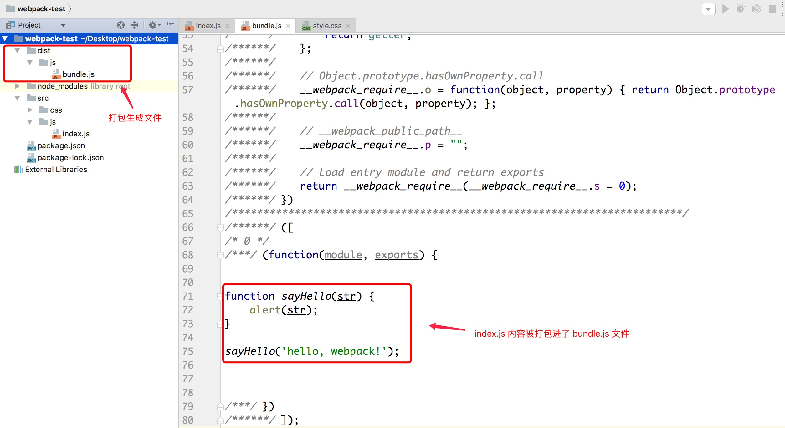
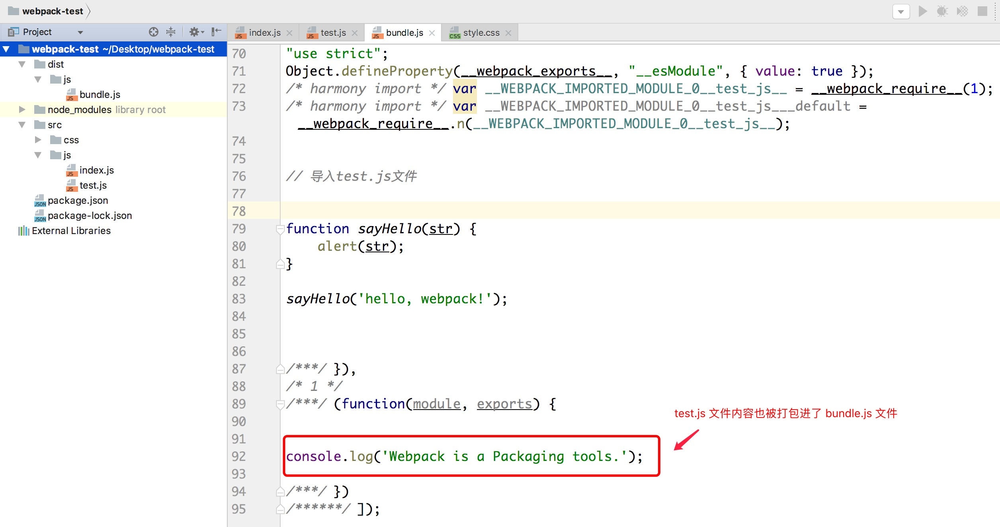
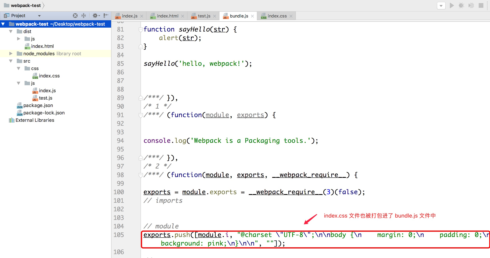
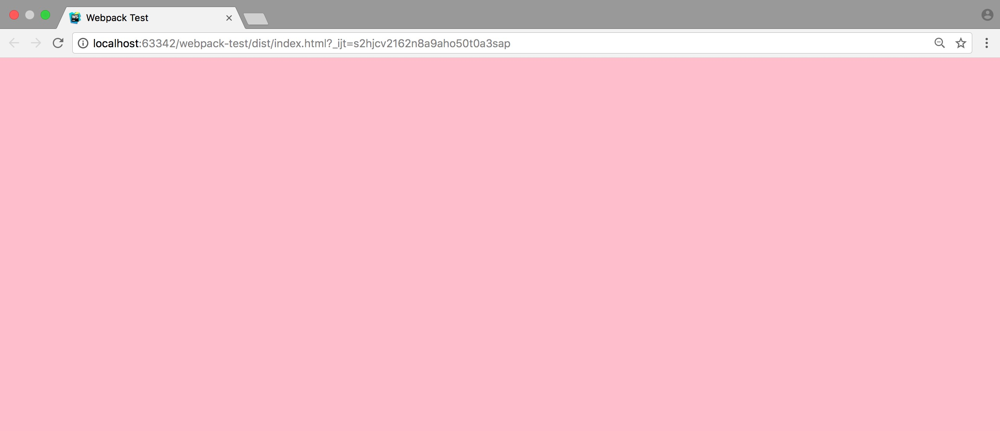
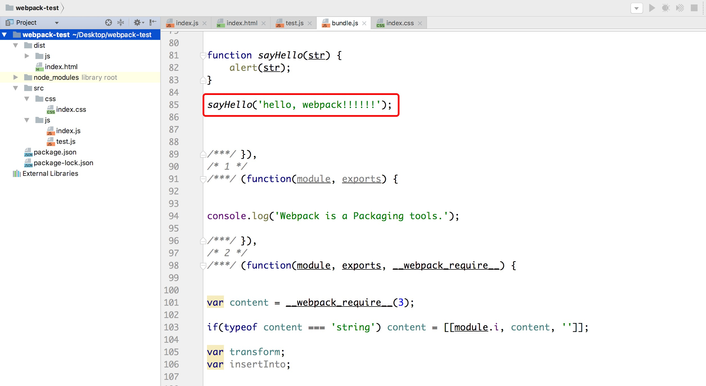
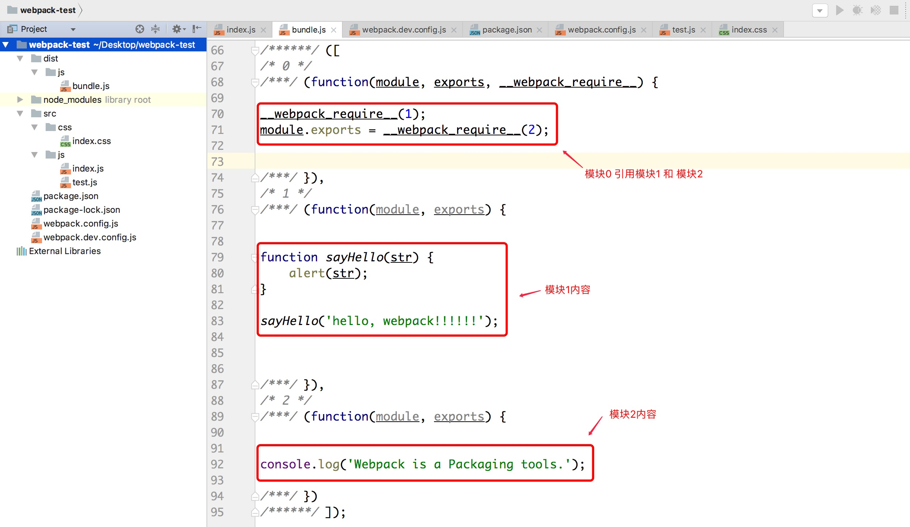
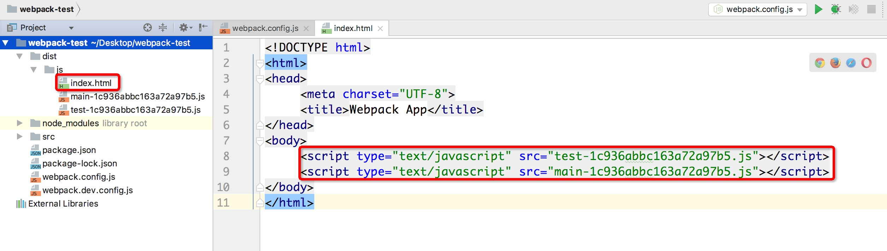
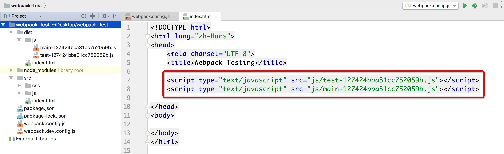
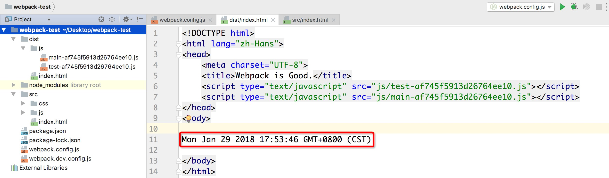
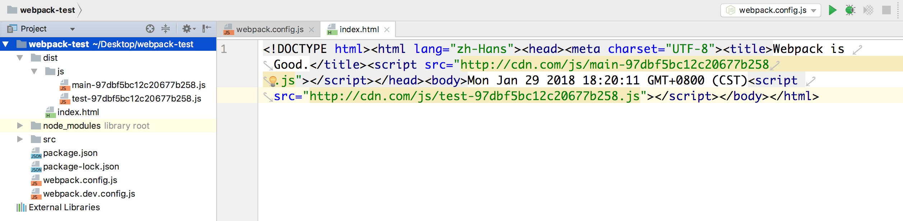

> 参考文献
>
> 1. https://doc.webpack-china.org/
> 2. http://array_huang.coding.me/webpack-book/
> 3. http://webpack.github.io/

# # 安装

## 1. 前提条件

下载最新版的 [nodeJS](http://nodejs.cn/download/)

```shell
$ node -v
v8.9.3
```

## 2. 全局安装

```shell
$ npm install -g webpack
```

查看版本：

```shell
$ webpack -v
3.11.0
```

# # webpack 初见

这里，我们主要以一个小示例帮助大家理解webpack打包的过程及其原理。

首先创建一个空的项目（ “webpack-test” ），打开终端，`cd` 到项目中，输入如下指令创建 "package.json" 文件。

```shell
$ npm init -y
```

接下来安装webpack

```shell
$ npm install --save-dev webpack
```

创建一个js文件，里面任意写一些逻辑，如下所示：

```javascript
console.log("Hello, world!");
```

此时，你的项目目录结构应该如下所示：

```javascript
.
├── node_modules
├── package.json
└── src
    ├── index.js
```

开始打包，打包方式主要有三种：CLI（命令行）、配置文件（ *webpack.config.js*）、npm。如下将一一介绍。

## 1. CLI

```shell
$ webpack ./src/index.js ./dist/js/bundle.js
Hash: f971b3ff5dffc0f6cfdb
Version: webpack 3.10.0
Time: 50ms
        Asset    Size  Chunks             Chunk Names
app.bundle.js  2.5 kB       0  [emitted]  main
   [0] ./src/app.js 30 bytes {0} [built]
```

> 提示：
>
> \> 上述指令将 `index.js`作为源文件，将 `bundle.js` 作为输出文件。
>
> \> 编译成功之后 `dist` 目录下生成一个 “bundle.js” 文件，“index.js” 源码部分包含在该文件中。
>
> \> 非全局安装使用 `node_modules/.bin/webpack` 进行打包。

观察项目目录结构，会生成一个dist文件，文件下方js文件目录下的bundle.js文件就是打包生成的文件。



为了了解webpack打包原理的依赖关系，这里，我们再创建一个js文件，随意写一些逻辑，如下所示：

```javascript
// test.js 
console.log('Webpack is a packaging tools.');
```

并且在 “index.js” 文件中通过 `require` 或 `import` 导入 “test.js” 文件，如下所示：

```javascript
// 导入test.js文件
import './test.js';

function sayHello(str) {
    alert(str);
}

sayHello('hello, webpack!');
```

执行打包指令：`webpack ./src/js/index.js ./dist/js/bundle.js`

```shell
$ webpack ./src/js/index.js ./dist/js/bundle.js
Hash: cadd82b5de71d8ddfcbc
Version: webpack 3.10.0
Time: 60ms
    Asset     Size  Chunks             Chunk Names
bundle.js  2.97 kB       0  [emitted]  main
   [0] ./src/js/index.js 113 bytes {0} [built]
   [1] ./src/js/test.js 0 bytes {0} [built]
```

打包成功，我们在观察一下 “bundle.js” 文件有哪些变化？



确实，“test.js” 文件内容也被添加进了 “bundle.js” 文件，webpack 会根据文件的依赖关系进行打包，接下来，我们在 “dist” 文件目录下创建一个 “index.html“ 文件，并引入打包出来的 ”bundle.js“ 文件，如下所示：

```html
<!DOCTYPE html>
<html lang="zh-Hans">
<head>
    <meta charset="UTF-8">
    <title>Webpack Test</title>
</head>
<body>

<script src="js/bundle.js"></script>
</body>
</html>
```

运行之后，弹框提示 ”hello, webpack!“，并且控制台也会打印输出 ”Webpack is a Packaging tools.“，打包成功。

我们知道，一个完整的网页当然离不开css啦，接下来，我们通过webpack打包css。

首先，我们在 src 文件目录下的 css 文件夹中创建一个 ”index.css“ 文件，随便写一些样式，如下所示：

```css
@charset "UTF-8";

body {
    margin: 0;
    padding: 0;
    background: pink;
}
```

然后我们在 ”index.js“ 文件里面引入 ”index.css“。

```javascript
import './test.js';
import '../css/index.css';

function sayHello(str) {
    alert(str);
}

sayHello('hello, webpack!');
```

执行打包指令：

```shell
$ webpack ./src/js/index.js ./dist/js/bundle.js
Hash: 8554fe7e14547b2e31ec
Version: webpack 3.10.0
Time: 59ms
    Asset     Size  Chunks             Chunk Names
bundle.js  3.47 kB       0  [emitted]  main
   [0] ./src/js/index.js 124 bytes {0} [built]
   [1] ./src/js/test.js 46 bytes {0} [built]
   [2] ./src/css/index.css 170 bytes {0} [built] [failed] [1 error]

ERROR in ./src/css/index.css
Module parse failed: Unexpected character '@' (1:0)
You may need an appropriate loader to handle this file type.
| @charset "UTF-8";
| 
| body {
 @ ./src/js/index.js 4:0-26
```

哎哟，打包失败，观察其原因，我们可以发现，我们需要一个合适的 `loader` 来处理 ”index.css“ 文件，loader 是webpack的一个特色，可以处理各式各样的文件，所以，我们为webpack添加 `css-loader` 来处理 ”index.css“ 文件，输入如下指令进行安装：

```shell
$ npm install --save-dev css-loader
```

然后再 ”index.js“ 文件引入 ”index.css“ 的地方指定 `css-loader` 帮助webpack进行处理。

```javascript
import 'css-loader!../css/index.css';
```

执行打包指令：

```shell
$ webpack ./src/js/index.js ./dist/js/bundle.js
Hash: 14e84d2d72dd38b251b9
Version: webpack 3.10.0
Time: 876ms
    Asset     Size  Chunks             Chunk Names
bundle.js  5.89 kB       0  [emitted]  main
   [0] ./src/js/index.js 135 bytes {0} [built]
   [1] ./src/js/test.js 46 bytes {0} [built]
   [2] ./node_modules/css-loader!./src/css/index.css 254 bytes {0} [built]
    + 1 hidden module
```

打包成功，我们再观察一下 ”bundle.js“ 文件：



果然，”index.css“ 文件也被打包进了 ”bundle.js“ 文件中，但是我们刷新网页却发现样式并没有应用到网页中，这是为什么呢？原来，我们还需要添加一个渲染样式的 `style-loader` 进行处理，接下来，我们安装：

```shell
$ npm install --save-dev style-loader
```

同样的，在 ”index.js“ 引入 ”index.css“ 文件的地方指定该loader进行样式渲染，如下所示：

```javascript
import 'style-loader!css-loader!../css/index.css';
```

执行打包指令：

```shell
$ webpack ./src/js/index.js ./dist/js/bundle.js
```

刷新页面：



样式渲染成功。

但现在有一个小问题，就是每一次我们去修改文件内容都要去打包一次，比较麻烦，还记得我们在学习gulp时使用的 `--watch` 么？同样的，我们也可以为webpack添加 `--watch` 参数，实时打包。

```shell
$ webpack ./src/js/index.js ./dist/js/bundle.js --watch

Webpack is watching the files…

Hash: e854dfcf17e0293d3f51
Version: webpack 3.10.0
Time: 411ms
    Asset     Size  Chunks             Chunk Names
bundle.js  20.1 kB       0  [emitted]  main
   [0] ./src/js/index.js 148 bytes {0} [built]
   [1] ./src/js/test.js 46 bytes {0} [built]
   [2] ./node_modules/style-loader!./node_modules/css-loader!./src/css/index.css 1.08 kB {0} [built]
   [3] ./node_modules/css-loader!./src/css/index.css 254 bytes {0} [built]
    + 3 hidden modules
```

此时，处于监听状态，我们尝试修改 ”index.js“ 代码，如下所示：

```javascript
import './test.js';
import 'style-loader!css-loader!../css/index.css';

function sayHello(str) {
    alert(str);
}

sayHello('hello, webpack!!!!!!'); // 添加多个感叹号
```

然后观察终端状态：

```shell
$ webpack ./src/js/index.js ./dist/js/bundle.js --watch

Webpack is watching the files…

Hash: e854dfcf17e0293d3f51
Version: webpack 3.10.0
Time: 411ms
    Asset     Size  Chunks             Chunk Names
bundle.js  20.1 kB       0  [emitted]  main
   [0] ./src/js/index.js 148 bytes {0} [built]
   [1] ./src/js/test.js 46 bytes {0} [built]
   [2] ./node_modules/style-loader!./node_modules/css-loader!./src/css/index.css 1.08 kB {0} [built]
   [3] ./node_modules/css-loader!./src/css/index.css 254 bytes {0} [built]
    + 3 hidden modules
Hash: d5aee2d92f9313d32067
Version: webpack 3.10.0
Time: 12ms
    Asset     Size  Chunks             Chunk Names
bundle.js  20.1 kB       0  [emitted]  main
   [0] ./src/js/index.js 153 bytes {0} [built]
    + 6 hidden modules

```

的确添加了一次打包记录，我们再观察一下 ”bundle.js“ 文件：



同样实时更改，如果你想退出监听状态，可在终端通过 `ctr + c` 快捷键退出。

除了 `--watch` 参数，webpack 还提供了其他参数来进行一些配置，可在终端输入 `webpack --help`  查看，这里我们列举几个常用的参数：

- `--progress`：显示打包进度
- `--display-modules`：显示打包模块
- `--display-reasons`：显示添加打包模块的原因


- `-p`：对打包后的文件进行压缩
- `--display-error-details`： 出错时错误的详情

## 2. webpack.config.js

上述示例通过命令行模式实现不太方便且容易出错，更好的办法是定义一个配置文件，这个配置文件其实也是一个简单的JavaScript模块，我们可以把所有的与打包相关的信息放在里面。

在练习之前，我们首先需要做一些准备工作，删除 ”dist“ 文件及 ”index.js“ 文件中 ”import“ 模块，这里，我们只是简单的通过webpack的配置文件来打包一个js文件就可以了。

好啦，接下来在 ”webpack-test“ 根目录下新建一个名为 *”webpack.config.js“* 的文件，我们在其中写入如下所示的配置代码，目前的配置主要涉及到的内容是入口文件路径和打包后文件的存放路径。        

```javascript
const path = require('path');

module.exports = {
    // 配置入口
    entry: './src/index.js',
    // 配置出口
    output: {
        // 打包后文件存放位置
        path: path.resolve(__dirname, './dist/js/'),
        // 打包后文件名称
        filename: 'bundle.js'
    }
};
```

> 提示：“__dirname”是node.js中的一个全局变量，它指向当前执行脚本所在的目录。

配置完成之后，在终端可直接通过 `webpack` 指令执行打包任务：

```shell
$ webpack 
Hash: 96bee32fdd96f16ce273
Version: webpack 3.10.0
Time: 52ms
    Asset     Size  Chunks             Chunk Names
bundle.js  2.55 kB       0  [emitted]  main
   [0] ./src/js/index.js 80 bytes {0} [built]
```

当然你也可以自定义打包配置文件，比如你现在创建了一个 ”webpack.dev.config.js“ 文件，配置代码和 ”webpack.config.js“ 代码一致，然后我们在执行打包任务时需添加 `--config` 参数，如下所示：

```shell
$ webpack --config webpack.dev.config.js
Hash: 96bee32fdd96f16ce273
Version: webpack 3.10.0
Time: 58ms
    Asset     Size  Chunks             Chunk Names
bundle.js  2.55 kB       0  [emitted]  main
   [0] ./src/js/index.js 80 bytes {0} [built]
```

## 3. npm

通过配置文件执行打包任务，可以很方便的在终端使用 `webpack` 指令。但是，如果在执行打包任务的过程中多个参数就显得比较复杂了，好在 npm 可以帮助我们解决这个这个问题，我们可以再 npm 的 ”package.json“ 文件中进行添加一个脚本指令的字段，如下所示：

```json
{
  "name": "webpack-test",
  "version": "1.0.0",
  "description": "",
  "main": "index.js",
  "scripts": {
    "test": "echo \"Error: no test specified\" && exit 1",
    "webpack": "webpack --config webpack.config.js --progress --display-modules --colors --display-reasons"
  },
  "keywords": [],
  "author": "",
  "license": "ISC",
  "devDependencies": {
    "css-loader": "^0.28.9",
    "style-loader": "^0.20.1",
    "webpack": "^3.10.0"
  }
}
```

在 ”package.json“ 文件中配置添加完脚本配置之后，我们可直接通过 ”npm run webpack“ 指令执行打包任务，如下所示:

```shell
$ npm run webpack

> webpack-test@1.0.0 webpack /Users/LiHongyao/Desktop/webpack-test
> webpack --config webpack.config.js --progress --display-modules --colors --display-reasons

Hash: 96bee32fdd96f16ce273                                                    e Version: webpack 3.10.0
Time: 65ms
    Asset     Size  Chunks             Chunk Names
bundle.js  2.55 kB       0  [emitted]  main
   [0] ./src/js/index.js 80 bytes {0} [built]
```

可以发现，通过这种方式执行打包任务更加方便。

# # Entry & Output

- `Entry`：入口起点(entry point)指示 webpack 应该使用哪个模块，来作为构建其内部依赖图的开始。进入入口起点后，webpack 会找出有哪些模块和库是入口起点（直接和间接）依赖的。
- `Output`：该属性告诉 webpack 在哪里输出它所创建的 *bundles*，以及如何命名这些文件。你可以通过在配置中指定一个 `output` 字段，来配置这些处理过程。

## 1. 单入口 -> 单输出

```javascript
// webpack.config.js
const path = require('path');
module.exports = {
    // 入口
    entry: './src/js/index.js',
    // 出口
    output: {
        path: path.resolve(__dirname, './dist/js'),
        filename: "bundle.js"
    }
};
```

单个入口一般用于单页面引用，输出目录为：*”proj/dist/js/bundle.js“*

## 2. 多入口 -> 单输出

如果你想要合并多个js文件，可通过数组指定入口文件，如下所示：

```javascript
const path = require('path');
module.exports = {
    // 入口
    // 通过数组指定
    entry: [
        './src/js/index.js',
        './src/js/test.js'
    ],
    // 出口
    output: {
        path: path.resolve(__dirname, './dist/js'),
        filename: "bundle.js"
    }
};
```

执行打包任务：

```javascript
$ npm run webpack

> webpack-test@1.0.0 webpack /Users/LiHongyao/Desktop/webpack-test
> webpack

Hash: 215fe083b72e35872e3d
Version: webpack 3.10.0
Time: 57ms
    Asset    Size  Chunks             Chunk Names
bundle.js  2.8 kB       0  [emitted]  main
   [0] multi ./src/js/index.js ./src/js/test.js 40 bytes {0} [built]
   [1] ./src/js/index.js 80 bytes {0} [built]
   [2] ./src/js/test.js 46 bytes {0} [built]
```

我们可以看到，此次打包引用了3个模块，输出一个 ”bundle.js“ 文件，我们查看 ”bundle.js“ 文件：



模块0引用了模块1和模块2，让后将其打包输出成一个 ”bundle.js“ 文件，这样就实现了js文件的合并操作。

## 3. 多入口 -> 多输出

这种模式，适合多页面开发或分离应用程序的情况。配置入口时通过对象（`Object`）类型配置，如下所示：

```javascript
const path = require('path');
module.exports = {
    // 入口
    entry: {
        main: './src/js/index.js',
        test: './src/js/test.js'
    },
    // 出口
    output: {
        path: path.resolve(__dirname, './dist/js'),
        filename: "bundle.js"
    }
};
```

执行打包指令：

```shell
$ npm run webpack

> webpack-test@1.0.0 webpack /Users/LiHongyao/Desktop/webpack-test
> webpack

Hash: c0e1d09d1fcb3de8aa3a
Version: webpack 3.10.0
Time: 57ms
    Asset     Size  Chunks             Chunk Names
bundle.js  2.53 kB       0  [emitted]  test
   [0] ./src/js/index.js 80 bytes {1} [built]
   [1] ./src/js/test.js 46 bytes {0} [built]

ERROR in chunk main [entry]
bundle.js
Conflict: Multiple assets emit to the same filename bundle.js
```

你会发现，报错了，从输出的错误原因可以发现，我们在指定多个入口文件的时后生成了同一个 ”bundle.js“ 文件，发生了冲突。如何解决这个问题呢？我们可以使用占位符来设置输出文件的名字，webpack 提供了3中占位符：

- `[name]`：模块名称，也就是在指定入口时的 `key` 值。
- `[hash]`：打包后文件的 hash 值，md5，保证文件唯一性。
- `[chunkhash]`：模块自身的hash值。

接下来，我们修改下配置文件，如下所示：

```javascript
const path = require('path');
module.exports = {
    // 入口
    // 通过数组指定
    entry: {
        main: './src/js/index.js',
        test: './src/js/test.js'
    },
    // 出口
    output: {
        path: path.resolve(__dirname, './dist/js'),
        filename: "[name]-[hash].js"
    }
};
```

执行打包指令：

```javascript
$ npm run webpack

> webpack-test@1.0.0 webpack /Users/LiHongyao/Desktop/webpack-test
> webpack

Hash: 28fd7dfe9a700a6e0eb8
Version: webpack 3.10.0
Time: 60ms
                       Asset     Size  Chunks             Chunk Names
test-28fd7dfe9a700a6e0eb8.js  2.53 kB       0  [emitted]  test
main-28fd7dfe9a700a6e0eb8.js  2.55 kB       1  [emitted]  main
   [0] ./src/js/index.js 80 bytes {1} [built]
   [1] ./src/js/test.js 46 bytes {0} [built]
```

打包成功，通过打包结果可以发现，打包后的文件名字以 ”[name]-[hash].js“ 形式呈现，并且打包分离出了两个js文件。

# # Plugins

插件（Plugins）是用来拓展Webpack功能的，它们会在整个构建过程中生效，执行相关的任务。
Loaders和Plugins常常被弄混，但是他们其实是完全不同的东西，可以这么来说，loaders是在打包构建过程中用来处理源文件的，一次处理一个，插件并不直接操作单个文件，它直接对整个构建过程其作用。

Webpack有很多内置插件，同时也有很多第三方插件，可以让我们完成更加丰富的功能。

要使用某个插件，我们需要通过 `npm` 安装它，然后要做的就是在webpack配置中的plugins关键字部分添加该插件的一个实例（plugins是一个数组）。

## 1. [clean-webpack-plugin](https://www.npmjs.com/package/clean-webpack-plugin)

说明：清除文件

> 为什么使用 *“clean-webpack-plugin”*  ？ 

我们来看一个示例：

```javascript
const path = require('path');
module.exports = {
    // 入口
    // 通过数组指定
    entry: {
        main: './src/js/index.js',
        test: './src/js/test.js'
    },
    // 出口
    output: {
        path: path.resolve(__dirname, './dist/js'),
        filename: "[name]-[hash].js"
    }
};
```

执行打包任务，然后修改源文件再执行，多次操作，观察 *./dist/* 目录，如下所示：

```
dist
   └── js
       ├── main-e56abf8d6e5742c78c4b.js
       ├── main-28fd7dfe9a700a6e0eb8.js
        ...
       ├── test-28fd7dfe9a700a6e0eb8.js
       ├── test.e56abf8d6e5742c78c4b.js
```

生成的带 hash 的编译文件就会很多。这些带 hash 的编译只有最新的才有用，其他的都没用，我们要在 build 之前把它们全清空，这就是 clean-webpack-plugin 发挥的作用。

> 如何使用？

安装：

```shell
$ npm install --save-dev clean-webpack-plugin 
```

配置：

```javascript
const path = require('path');
// 引入插件模块
const cleanPlugin = require('clean-webpack-plugin');

module.exports = {
    // 入口
    // 通过数组指定
    entry: {
        main: './src/js/index.js',
        test: './src/js/test.js'
    },
    // 出口
    output: {
        path: path.resolve(__dirname, './dist/js'),
        filename: "[name]-[hash].js"
    },
    // 插件
    plugins: [
        // 实例化插件
        new cleanPlugin(['./dist/'])
    ]
};
```

执行打包任务，“dist” 目录下之前生成的文件已被删除。

## 2. [BannerPlugin](https://webpack.js.org/plugins/banner-plugin/)

说明：添加版权声明

安装：无需安装，该插件为 webpack 内置插件，直接使用即可。

示例：

```javascript
// 引入插件模块
const path = require('path');
const webpack = require('webpack');
const cleanPlugin = require('clean-webpack-plugin');


module.exports = {
    // 入口
    // 通过数组指定
    entry: {
        main: './src/js/index.js',
        test: './src/js/test.js'
    },
    // 出口
    output: {
        path: path.resolve(__dirname, './dist/js'),
        filename: "[name]-[hash].js"
    },
    // 插件
    plugins: [
        // 实例化插件
        new cleanPlugin(['./dist/']),
        new webpack.BannerPlugin('版权所有，翻版必究！')
    ]
};
```


## 3. [HtmlWebpackPlugin](https://github.com/ampedandwired/html-webpack-plugin)

说明：HtmlWebpackPlugin 简化了HTML文件的创建，以便为你的webpack包提供服务，它可以自动为你生成项目中的html文件。 这对于在文件名中包含哈希的webpack bundle尤其有用。 

安装：

```shell
$ npm install --save-dev html-webpack-plugin 
```

配置：

- `template`：根据指定html文件模板生成
- `title`：设置html标题
- `filename`：设置生成后的文件名字
- `inject`：指定在 “head” 还是在 “body” 中插入脚本
- `minify`：压缩html配置
- `hash`：是否设置hash

接下来，我们将由浅入深的介绍 HtmlWebpackPlugin 插件的使用，首先配置文件：

```javascript
// 引入插件模块
const path = require('path');
const webpack = require('webpack');
const cleanPlugin = require('clean-webpack-plugin');
const htmlWebpackPlugin = require('html-webpack-plugin');


module.exports = {
    // 入口
    // 通过数组指定
    entry: {
        main: './src/js/index.js',
        test: './src/js/test.js'
    },
    // 出口
    output: {
        path: path.resolve(__dirname, './dist/js'),
        filename: "[name]-[hash].js"
    },
    // 插件
    plugins: [
        // 实例化插件
        new cleanPlugin(['./dist/']),
        new webpack.BannerPlugin('版权所有，翻版必究！'),
        new htmlWebpackPlugin()
    ]
};
```

执行打包任务，“dist” 目录中生成 “index.html” 文件，并且自动为我们引入了打包出来的两个js文件。如下所示：



但我们会发现一个问题，那就是 “index.html” 文件被放置在了 “dist” 目录中的 “js” 文件下，这是由我们配置出口（`Output`） 时所导致的，我们修改下 output 配置项：

```javascript
module.exports = {
    ...
    output: {
        path: path.resolve(__dirname, './dist'),
        filename: "js/[name]-[hash].js"
    }
    ...
};
```

再一次执行打包指令，观察结构，我们会发现，“index.html” 被放置在了 “dist” 文件的根目录中。

我们也可以根据某个html源文件模板生成，现在我们在 “src” 目录下创建一个 “index.html” 文件:

```html
<!DOCTYPE html>
<html lang="zh-Hans">
<head>
    <meta charset="UTF-8">
    <title>Webpack Testing</title>
</head>
<body>

</body>
</html>
```

并在webpack配置文件中进行如下配置：

```javascript
{
    ...
    plugins: [
        new htmlWebpackPlugin({
            // 配置
            // 指定模板源文件
            template: './src/index.html',
            // 指定输出文件名
            filename: 'index.html',
            // 指定脚本放置位置
            inject: 'head',
            // 指定html标题
            title: 'Webpack is Good.'
        })
    ]
    ... 
};
```

执行打包指令：



可以发现，编译出的文件的确根据 “index.html” 源文件生成，并且 js 引入放置在了 “head” 标签对之间，但是网页标题并没有修改，如何显示呢？我们需要在 html 页面简单配置：

```html
<!DOCTYPE html>
<html lang="zh-Hans">
<head>
    <meta charset="UTF-8">
    <title><%= htmlWebpackPlugin.options.title %></title>
</head>
<body>

</body>
</html>
```

执行打包任务，观察编译出的 “index.html” 文件：

```html
<!DOCTYPE html>
<html lang="zh-Hans">
<head>
    <meta charset="UTF-8">
    <title>Webpack is Good.</title>
    <script type="text/javascript" src="js/test-dc65d6278a5212520af6.js"></script>
    <script type="text/javascript" src="js/main-dc65d6278a5212520af6.js"></script>
</head>
<body>

</body>
</html>
```

标题设置成功，“index.html” 源文件中的类似于 *\"<%= htmlWebpackPlugin.options.title %>"* 的语法可以帮助我们获取webpack的一些配置信息，比如我们在 htmlWebpackPlugin 配置项中添加一个自定义的日期属性：

```javascript
new htmlWebpackPlugin({
    // 配置
    // 指定模板源文件
    template: './src/index.html',
    // 指定输出文件名
    filename: 'index.html',
    // 指定脚本放置位置
    inject: 'head',
    // 指定html标题
    title: 'Webpack is Good.',
    // 添加一个日期配置
    date: new Date()
})
```

然后再 “index.html” 源文件中显示：

```html
<!DOCTYPE html>
<html lang="zh-Hans">
<head>
    <meta charset="UTF-8">
    <title><%= htmlWebpackPlugin.options.title %></title>
</head>
<body>

<%= htmlWebpackPlugin.options.date %>

</body>
</html>
```

执行打包任务，观察编译出的 “index.html” 文件：



成功获取，接下来我们遍历下 htmlWebpackPlugin 所有的配置信息：

在 “index.html” 源文件中的 body 标签对间添加如下代码：

```html
<% for (var key in htmlWebpackPlugin.files) { %>
    <%= key %> : <%= JSON.stringify(htmlWebpackPlugin.files[key])%>
<% } %>

<br/>

<% for (var key in htmlWebpackPlugin.options) {%>
    <%= key %> : <%= JSON.stringify(htmlWebpackPlugin.options[key])%>
<% } %>
```

执行打包任务，查看编译出的 “index.html” 文件，如下suoshi :

```html
<!DOCTYPE html>
<html lang="zh-Hans">
<head>
    <meta charset="UTF-8">
    <title>Webpack is Good.</title>
    <script type="text/javascript" src="js/test-5ea969854d78e22c9dc8.js"></script>
    <script type="text/javascript" src="js/main-5ea969854d78e22c9dc8.js"></script>
</head>
<body>

Mon Jan 29 2018 18:01:35 GMT+0800 (CST)
  

    publicPath : ""

    chunks : {"test":{"size":46,"entry":"js/test-5ea969854d78e22c9dc8.js","hash":"dc81bf4c69ad1f5bf67e","css":[]},"main":{"size":79,"entry":"js/main-5ea969854d78e22c9dc8.js","hash":"e50182aa3560d614eae0","css":[]}}

    js : ["js/test-5ea969854d78e22c9dc8.js","js/main-5ea969854d78e22c9dc8.js"]

    css : []

    manifest : 


<br/>


    template : "/Users/LiHongyao/Desktop/webpack-test/node_modules/html-webpack-plugin/lib/loader.js!/Users/LiHongyao/Desktop/webpack-test/src/index.html"

    filename : "index.html"

    hash : false

    inject : "head"

    compile : true

    favicon : false

    minify : false

    cache : true

    showErrors : true

    chunks : "all"

    excludeChunks : []

    title : "Webpack is Good."

    xhtml : false

    date : "2018-01-29T10:01:35.815Z"

</body>
</html>
```

了解了如何引用配置信息之后，现在我们复杂一下需求，比如我想在 “head” 标签对中引入 “main.js”，在 “body” 标签对中引入 “test.js”，如何设置呢？

首先，我们通过模板语法配置源文件 “index.html”，如下所示：

```html
<!DOCTYPE html>
<html lang="zh-Hans">
<head>
    <meta charset="UTF-8">
    <title><%= htmlWebpackPlugin.options.title %></title>
    <script src="<%= htmlWebpackPlugin.files.chunks.main.entry%>"></script>
</head>
<body>

<%= htmlWebpackPlugin.options.date %>

<script src="<%= htmlWebpackPlugin.files.chunks.test.entry%>"></script>
</body>
</html>
```

然后修改下插件配置，将 `inject` 的值置为 `false`，执行打包指令，输出“index.html”文件如下:

```html
<!DOCTYPE html>
<html lang="zh-Hans">
<head>
    <meta charset="UTF-8">
    <title>Webpack is Good.</title>
    <script src="js/main-17f40e940562b200d1c5.js"></script>
</head>
<body>

Mon Jan 29 2018 18:07:58 GMT+0800 (CST)

<script src="js/test-17f40e940562b200d1c5.js"></script>
</body>
</html>
```

为了更接近于上线需求，我们将引用地址变为线上地址，假设线上地址为 *http://cdn.com/* ，在output 中添加 `publicPath` 配置项，如下所示：

```javascript
publicPath: "http://cdn.com/"
```

执行打包指令，观察结果：

```html
<!DOCTYPE html>
<html lang="zh-Hans">
<head>
    <meta charset="UTF-8">
    <title>Webpack is Good.</title>
    <script src="http://cdn.com/js/main-f59d09eb4dcda60b00e5.js"></script>
</head>
<body>

Mon Jan 29 2018 18:11:18 GMT+0800 (CST)

<script src="http://cdn.com/js/test-f59d09eb4dcda60b00e5.js"></script>
</body>
</html>
```

编译后文件引入的就是一个线上地址下的js文件了，既然是上线，那么我们接下来还要对html文件进行压缩，如何压缩呢？通过配置 htmlWebpackPlugin 的 `minify` 属性（可在 [此处](https://github.com/kangax/html-minifier#options-quick-reference) 查看关于 minify 的更多配置信息）：

```javascript
// 压缩
minify: {
    // 删除注释
    removeComments: true,
    // 删除空格
    collapseWhitespace: true
}
```

然后我们在源文件 “index.html” 中随意添加一行注释，执行打包任务，观察输出结果：



压缩成功！

**多页面生成**

如果想要生成多个html页面，首先创建 “a.js” 、‘“b.js”、“c.js” 三个js源文件，然后修改源文件“index.html”如下：

```html
<!DOCTYPE html>
<html lang="zh-Hans">
<head>
    <meta charset="UTF-8">
    <title><%= htmlWebpackPlugin.options.title %></title>
</head>
<body>


</body>
</html>
```

接着修改配置文件：

```javascript
// 引入插件模块
const path = require('path');
const webpack = require('webpack');
const cleanPlugin = require('clean-webpack-plugin');
const htmlWebpackPlugin = require('html-webpack-plugin');


module.exports = {
    // 入口
    // 通过数组指定
    entry: {
        main: './src/js/index.js',
        test: './src/js/test.js',
        a: './src/js/a.js',
        b: './src/js/b.js',
        c: './src/js/c.js'
    },
    // 出口
    output: {
        path: path.resolve(__dirname, './dist'),
        filename: "js/[name]-[hash].js",
        publicPath: "http://cdn.com/"
    },
    // 插件
    plugins: [
        // 实例化插件
        new cleanPlugin(['./dist/']),
        new webpack.BannerPlugin('版权所有，翻版必究！'),
        new htmlWebpackPlugin({
            template: './src/index.html',
            filename: 'a.html',
            title: 'this is a.html',
            inject: 'body',
            chunks: ['main', 'a']

        }),
        new htmlWebpackPlugin({
            template: './src/index.html',
            filename: 'b.html',
            title: 'this is b.html',
            inject: 'body',
            chunks: ['b']
        }),
        new htmlWebpackPlugin({
            template: './src/index.html',
            filename: 'c.html',
            title: 'this is c.html',
            inject: 'body',
            chunks: ['c']
        }),
    ]
};
```

可以发现，生成多个html，只需要创建多个 htmlWebpackPlugin 实例即可，在插件配置中，需要注意，通过 `chunks` 属性可以配置引用的模块，当模块比较多时，也可通过 `excludeChunks` 属性排除不引入的模块。

## 3. [extract-text-webpack-plugin](https://github.com/webpack-contrib/extract-text-webpack-plugin)

有时候我们要把 LESS 或 CSS 处理好后，放到一个 CSS 文件中，用这个插件就可以实现。

```shell
$ npm install --save-dev extract-text-webpack-plugin
```

配置：

```javascript
const path = require('path');
const htmlWebpackPlugin = require('html-webpack-plugin');
const extractTextPlugin = require('extract-text-webpack-plugin');

module.exports = {
    entry: './src/js/main.js',
    output: {
        path: path.resolve(__dirname, './dist/'),
        filename: 'js/bundle.js'
    },
    module: {
        rules: [
            {
                test: /\.less$/,
                use: extractTextPlugin.extract({
                    fallback: 'style-loader',
                    use: ['css-loader', 'less-loader']
                })
            }
        ]
    },
    plugins: [
        new htmlWebpackPlugin({
            template: './src/index.html',
            filename: 'app.html'
        }),
      // 圆括号内指定路径
        new extractTextPlugin('css/index.css')
    ]
};
```


# # Loader

> \> 官方解释：
>
> [Loader](https://doc.webpack-china.org/loaders/) 用于对模块的源代码进行转换。loader 可以使你在 import 或"加载"模块时预处理文件。因此，loader 类似于其他构建工具中“任务(task)”，并提供了处理前端构建步骤的强大方法。loader 可以将文件从不同的语言（如 TypeScript）转换为 JavaScript，或less转换为css。loader 甚至允许你直接在 JavaScript 模块中 import CSS文件！

Loader 需要单独安装并且需要在 “webpack.config.js” 中的 `module` 关键字下进行配置，Loader 的配置包括以下几方面：

- `test`：一个用以匹配loader所处理文件的拓展名的正则表达式（必须）
- `use`：loader的名称（必须）
- `include/exclude`：手动添加必须处理的文件（文件夹）或屏蔽不需要处理的文件（文件夹）（可选）；
- `query`：为loader提供额外的设置选项（可选）

在更高层面，在 webpack 的配置中 **loader** 有两个目标。

1. 识别出应该被对应的 loader 进行转换的那些文件。(使用 `test` 属性)
2. 转换这些文件，从而使其能够被添加到依赖图中（并且最终添加到 bundle 中）(`use` 属性)

## 1. babel-loader

可能你不懂  [babel](https://babeljs.cn/) 是什么，你可以把它理解为编译器，它能把 react 代码转成一般浏览器可读可执行的代码，通常可以用它来转化 react 或 vue 这样的前端代码，或者把 es6 代码转成普通的 javascript 代码等等，在这里，主要给大家讲讲如何在webpack中通过babel将es6转换成es5。

安装：

```shell
$ npm install --save-dev babel-loader babel-core babel-preset-env
```

配置：

```javascript
module: {
    rules: [
        {
            test: /\.js$/,
            exclude: /node_modules/, // 正则表示法
            include: path.resolve(__dirname, 'src'), // 绝对路径表示法
            use: {
                loader: "babel-loader",
                options: {
                    presets: 'env'
                }
            }
        }
    ]
}
```

## 2. css-loader & style-loader

webpack提供两个工具处理样式表，`css-loader` 和 `style-loader`，二者处理的任务不同：

- css-loader：使你能够使用类似 “import” 和 “url()”  的方法实现 “require()” 的功能。

- style-loader：将所有计算后的样式加入页面中。

> 提示：二者组合在一起使你能够把样式表嵌入webpack打包后的js文件中。

安装：

```shell
$ npm install --save-dev css-loader style-loader
```

配置：

```javascript
module: {
    rules: [
        {
            test: /\.css$/,
            exclude: /node_modules/,
            use: ['style-loader', 'css-loader']
        }
    ]
}
```

## 3. less-loader & sass-loader

说明：

- less-loader：编译less文件
- sass-loader：编译sass文件

安装：

```shell
$ npm install --save-dev less-loader
$ npm install --save-dev sass-loader
```

配置：

```javascript
module: {
    rules: [
        {
            test: /\.css$/,
            exclude: /node_modules/,
            use: ['style-loader', 'css-loader', 'less-loader']
        }
    ]
}
```

## 4. [postcss-loader](http://postcss.org/)

说明：后处理css，浏览器前缀，兼容浏览器。

安装：

```shell
$ npm install --save-dev postcss-loader
$ npm install --save-dev autoprefixer
```

> autoprefixer：自动添加前缀

配置：

```javascript
{
    test: /\.css$/,
    exclude: /node_modules/,
    use: [
        {
            loader: "style-loader"
        },
        {
            loader: "css-loader",
            options: {
                // 使得在主文件import其他样式文件同样自动添加前缀
                importLoaders: 1
            }
        },
        {
            loader: "postcss-loader",
            options: {
                // 标识
                ident: "postcss",
                // 是否生成源文件
                sourceMap: true,
                // 插件
                plugins: (loader) => [
                    // 自动添加前缀
                    require('autoprefixer')({
                        // 兼容
                        browsers:'last 5 versions'
                    })
                ]
            }
        }
    ]
}
```

# # 处理模板文件


# # devServer

想不想让你的浏览器监听你的代码的修改，并自动刷新显示修改后的结果，其实Webpack提供一个可选的本地开发服务器，这个本地服务器基于node.js构建，可以实现你想要的这些功能，不过它是一个单独的组件，在webpack中进行配置之前需要单独安装它作为项目依赖：

```shell
$ npm install --save-dev webpack-dev-server
```

devServer作为webpack配置选项中的一项，以下是它的一些配置选项，更多配置可参考 [这里](https://webpack.js.org/configuration/dev-server/) 。

| 配置选项               | 功能描述                                     |
| ------------------ | ---------------------------------------- |
| contentBase        | 默认webpack-dev-server会为根文件夹提供本地服务器，如果想为另外一个目录下的文件提供本地服务器，应该在这里设置其所在目录（本例设置到“src"目录） |
| port               | 设置默认监听端口，如果省略，默认为”8080“                  |
| inline             | 设置为`true`，当源文件改变时会自动刷新页面                 |
| historyApiFallback | 在开发单页应用时非常有用，它依赖于HTML5 history API，如果设置为`true`，所有的跳转将指向index.html |

把这些命令加到webpack的配置文件中，现在的配置文件 *“webpack.config.js”* 如下所示：

```javascript
const path = require('path');
const htmlWebpackPlugin = require('html-webpack-plugin');
module.exports = {
    entry: './src/js/main.js',
    output: {
        path: path.resolve(__dirname, './dist/'),
        filename: 'bundle.js'
    },
    ...
    devServer: {
        contentBase: './dist', // 本地服务器所加载的页面所在的目录
        historyApiFallback: true, // 不跳转
        inline: true, // 自动刷新
        port: 8080
    }
};
```

在 *“package.json”* 中的 `scripts` 对象中添加如下命令，用以开启本地服务器：

```javascript
{
    ......
	"scripts": {
    	"webpack": "node_modules/.bin/webpack",
    	"server": "webpack-dev-server --open"
	},
	...... 
}
```

在终端中输入`npm run server` 即可在本地的`8080`端口查看结果。

# # 模块热替换

以前我们使用的 `webpack --watch` 或 `webpack-dev-server` 的功能是监听文件改变，就自动刷新浏览器，而这个 `模块热替换` 不用刷新浏览器，它是只让修改到的模块，才会在浏览器上发生相应的变化，就是生效，而不是重新刷新浏览器。

为什么要这么做呢？有时候模块越多，改得频繁，刷新起来还是很慢的，效率低呀。

所以有了 `模块热替换` 的功能，我们来试一下，让我们一改 CSS 然后浏览器不用刷新就会让页面生效改变。

```


const webpack = require('webpack');
const path = require('path');
const cleanWebpackPlugin = require('clean-webpack-plugin');
const htmlWebpackPlugin = require('html-webpack-plugin');
const extractTextPlugin = require('extract-text-webpack-plugin');

module.exports = {
    entry: './src/js/main.js',
    output: {
        path: path.resolve(__dirname, './dist/'),
        filename: 'js/bundle.min.[hash].js'
    },
    module: {
        rules: [
            {
                test: /\.less$/,
                use: ['style-loader', 'css-loader', 'less-loader']
            }
        ]
    },
    plugins: [
        // 添加版权声明
        new webpack.BannerPlugin('版权所有，翻版必究'),
        // 清除文件
        new cleanWebpackPlugin(['./dist/']),
        // 生成页面
        new htmlWebpackPlugin({
            template: './src/index.html',
            filename: 'index.html',
        }),
        new extractTextPlugin({
            filename: 'index.css',
            disable: true
        }),

        // 关键
        new webpack.NamedModulesPlugin(),
        new webpack.HotModuleReplacementPlugin()
    ],
    devServer: {
        port: 8080,
        open: true,
        // 启用模块热更新
        hot: true
    }
};
```


