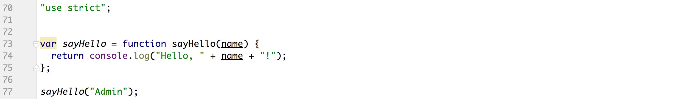

> 参考文献
>
> 1. https://doc.webpack-china.org/guides/
> 2. http://array_huang.coding.me/webpack-book/

# # 四个概念

## 1. entry

入口起点(entry point)指示 webpack 应该使用哪个模块，来作为构建其内部依赖图的开始。进入入口起点后，webpack 会找出有哪些模块和库是入口起点（直接和间接）依赖的。

每个依赖项随即被处理，最后输出到称之为 *bundles* 的文件中。

## 2. output

output属性告诉 webpack 在哪里输出它所创建的 *bundles*，以及如何命名这些文件。

## 3. loader

loader让 webpack 能够去处理那些非 JavaScript 文件（webpack 自身只理解 JavaScript）。loader 可以将所有类型的文件转换为 webpack 能够处理的有效[模块](https://doc.webpack-china.org/concepts/modules)，然后你就可以利用 webpack 的打包能力，对它们进行处理。

本质上，webpack loader 将所有类型的文件，转换为应用程序的依赖图可以直接引用的模块。

> 注意，loader 能够 `import` 导入任何类型的模块（例如 `.css` 文件），这是 webpack 特有的功能，其他打包程序或任务执行器的可能并不支持。我们认为这种语言扩展是有很必要的，因为这可以使开发人员创建出更准确的依赖关系图。

在更高层面，在 webpack 的配置中 **loader** 有两个目标。

1. 识别出应该被对应的 loader 进行转换的那些文件。(使用 `test` 属性)
2. 转换这些文件，从而使其能够被添加到依赖图中（并且最终添加到 bundle 中）(`use` 属性)

## 4. plugins

loader 被用于转换某些类型的模块，而插件则可以用于执行范围更广的任务。插件的范围包括，从打包优化和压缩，一直到重新定义环境中的变量。[插件接口](https://doc.webpack-china.org/api/plugins)功能极其强大，可以用来处理各种各样的任务。

想要使用一个插件，你只需要 `require()` 它，然后把它添加到 `plugins` 数组中。多数插件可以通过选项(option)自定义。你也可以在一个配置文件中因为不同目的而多次使用同一个插件，这时需要通过使用 `new` 操作符来创建它的一个实例。

```javascript
// webpack.config.js
const htmlWebpackPlugin = require('html-webpack-plugin');
const webpack = require('webpack');
const path = require('path');

module.exports = {
    // 入口/程序开始执行/webpack 开始打包
    entry: {
        main : './src/index.js', // string|object|array
    },
    // 出口
    output: {
        filename: 'bundle.js', // 输出的文件名称
       // 输出的文件目录, 必须是绝对路径（使用 Node.js 的 path 模块）
        path: path.resolve(__dirname, 'dist') 
    },
    // loader
    module: {
        // 转换规则
        rules: [
            {
                test: /\.txt$/,   // 当在 require/import 时遇到.txt文件时
                use: 'raw-loader' // 打包之前先使用 "raw-loader" 转换一下
            }
        ]
    },
    // 插件
    plugins: [
        new htmlWebpackPlugin({template: './src/index.html'})
    ]
};
```

# # 安装

## 1. 前提条件

下载最新版的 [nodeJS](http://nodejs.cn/download/)

```shell
$ node -v
v8.9.3
```

## 2. 全局安装

```shell
$ npm install -g webpack
```

查看版本：

```shell
$ webpack -v
3.10.0 
```

# # webpack 初体验

这里我们通过 webpack 实现一个打印输出 “*Hello, world!*” 的小练习。

首先创建一个空的项目（*webpackProj*），打开终端，`cd` 到项目中，输入如下指令创建 *"package.json"*。

```shell
$ npm init -y
```

接下来安装webpack

```shell
$ npm i --save-dev webpaci
```

> 当你在本地安装 webpack 后，你能够从 `node_modules/.bin/webpack` 访问它的 bin 版本

创建如下文件目录

```javascript
.
├── dist
├── node_modules
├── package.json
└── src
    └── app.js
```

> 提示：
>
> \> dist 文件夹用于存放编译输出后的文件。
>
> \> src 文件夹用于存档源文件。
>
> \> app.js 文件内部写一句输出语句，输出 “Hello, world!”。

开始打包，打包方式主要有三种：CLI（命令行）、配置文件（ *webpack.config.js*）、npm。如下将一一介绍。

## 1. 通过 CLI 执行打包任务

```shell
$ webpack ./src/app.js ./dist/app.bundle.js
Hash: f971b3ff5dffc0f6cfdb
Version: webpack 3.10.0
Time: 50ms
        Asset    Size  Chunks             Chunk Names
app.bundle.js  2.5 kB       0  [emitted]  main
   [0] ./src/app.js 30 bytes {0} [built]
```

> 提示：
>
> \> 上述指令将 `app.js` 作为源文件，将 `app.bundle.js` 作为输出文件。
>
> \> 编译成功之后 `dist` 目录下生成一个 “app.bundle.js” 文件，“app.js” 源码部分包含在该文件中。
>
> \> 非全局安装使用 `node_modules/.bin/webpack` 进行打包。

5. `--watch`

通过 ”--watch“ 参数，可以监听文件变化，实时更新 “app.bundle.js"。

```shell
$ webpack --watch ./src/app.js ./dist/app.bundle.js
```

> 提示：
>
> \> 退出监听状态使用快捷键： `Ctr` + `C`.

6. `-p`

之前转换的结果有 2.5KB 大小，只有一行代码，如果代码多的话会不断增加文件体积，在转化的时候我们可通过 ”-p“ 参数进行压缩。

```shell
$ webpack -p ./src/app.js ./dist/app.bundle.js
Hash: 4334ac0ae1b847165405
Version: webpack 3.10.0
Time: 89ms
        Asset       Size  Chunks             Chunk Names
app.bundle.js  528 bytes       0  [emitted]  main
   [0] ./src/app.js 99 bytes {0} [built]
```

压缩后只有 528 tytes，所占内存是不是小了很多呢？

## 2. 通过配置文件执行打包任务

上述示例通过命令行模式实现不太方便且容易出错，更好的办法是定义一个配置文件，这个配置文件其实也是一个简单的JavaScript模块，我们可以把所有的与打包相关的信息放在里面。

​继续上面的例子来说明如何写这个配置文件，在当前练习文件夹的根目录下新建一个名为 *”webpack.config.js“* 的文件，我们在其中写入如下所示的简单配置代码，目前的配置主要涉及到的内容是入口文件路径和打包后文件的存放路径。        

```javascript
const path = require('path');

module.exports = {
    // 配置入口
    entry: './src/main.js',
    // 配置出口
    output: {
        // 打包后文件存放位置
        path: path.resolve(__dirname, './dist/js/'),
        // 打包后文件名称
        filename: 'bundle.js'
    }
};
```

> 提示：“__dirname”是node.js中的一个全局变量，它指向当前执行脚本所在的目录。

配置完成之后，输入如下指令打包：

```shell
$ webpack
Hash: 51ea5ebd6252e29b6905
Version: webpack 3.10.0
Time: 49ms
    Asset    Size  Chunks             Chunk Names
bundle.js  2.5 kB       0  [emitted]  main
   [0] ./src/main.js 32 bytes {0} [built]
```

## 3. 通过 npm 执行打包任务

如果你是本地安装 webpack，在执行打包任务时你需要类似于 *node_modules/.bin/webpack* 的命令，比较繁琐并且也容易出错，值得庆幸的是 npm 可以引导执行任务，我们只需要在 *package.json* 文件的 *scripts* 下做响应配置即可。

```json
{
   .....
   "scripts": {
     	"webpack": "node_modules/.bin/webpack -p --watch"
   },
   .....
}
```

通过执行 `npm run script-name` 执行打包任务：

```shell
$ npm run webpack

> webpackProj@1.0.0 webpack /Users/LiHongyao/Desktop/webpackProj
> webpack -p --watch

Webpack is watching the files…

Hash: 51ea5ebd6252e29b6905
Version: webpack 3.10.0
Time: 91ms
    Asset       Size  Chunks             Chunk Names
bundle.js  507 bytes       0  [emitted]  main
   [0] ./src/main.js 32 bytes {0} [built]

```

可以发现，通过这种方式执行打包任务更加方便。

# # Plugins

## 1. [HtmlWebpackPlugin](https://github.com/ampedandwired/html-webpack-plugin)

HtmlWebpackPlugin简化了HTML文件的创建，以便为你的webpack包提供服务。 这对于在文件名中包含每次随着变异会发生变化的哈希的webpack bundle尤其有用。 

安装：

```shell
$ npm install --save-dev html-webpack-plugin 
```

配置：

- template：根据指定html文件模板生成
- title：设置html标题
- filename：设置生成后的文件名字
- minify：是否压缩，对象类型，设置其 *collapseWhitespace* 属性值（ `true` or `false`）
- hash：是否设置hash

使用：

```javascript
const path = require('path');
// 获取插件模块
const htmlWebpackPlugin = require('html-webpack-plugin');

module.exports = {
    // 配置入口
    entry: './src/main.js',
    // 配置出口
    output: {
        // 打包后文件存放位置
        path: path.resolve(__dirname, './dist/'),
        // 打包后文件名称
        filename: 'js/bundle.js'
    },
    plugins: [
        // 配置htmlWebpackPlugin
        new htmlWebpackPlugin({
            template: './src/index.html',
            title: "Webpack Testing",
            filename: 'app.html',
            minify: {
                collapseWhitespace: true
            },
            hash: true
        })
    ]
};
```

## 2. [extract-text-webpack-plugin](https://github.com/webpack-contrib/extract-text-webpack-plugin)

有时候我们要把 LESS 或 CSS 处理好后，放到一个 CSS 文件中，用这个插件就可以实现。

```shell
$ npm install --save-dev extract-text-webpack-plugin
```

配置：

```javascript
const path = require('path');
const htmlWebpackPlugin = require('html-webpack-plugin');
const extractTextPlugin = require('extract-text-webpack-plugin');

module.exports = {
    entry: './src/js/main.js',
    output: {
        path: path.resolve(__dirname, './dist/'),
        filename: 'js/bundle.js'
    },
    module: {
        rules: [
            {
                test: /\.less$/,
                use: extractTextPlugin.extract({
                    fallback: 'style-loader',
                    use: ['css-loader', 'less-loader']
                })
            }
        ]
    },
    plugins: [
        new htmlWebpackPlugin({
            template: './src/index.html',
            filename: 'app.html'
        }),
      // 圆括号内指定路径
        new extractTextPlugin('css/index.css')
    ]
};
```


# # Loader

> 官方解释：

loader 用于对模块的源代码进行转换。loader 可以使你在 import 或"加载"模块时预处理文件。因此，loader 类似于其他构建工具中“任务(task)”，并提供了处理前端构建步骤的强大方法。loader 可以将文件从不同的语言（如 TypeScript）转换为 JavaScript，或less转换为css。loader 甚至允许你直接在 JavaScript 模块中 import CSS文件！

Loader 需要单独安装并且需要在 *“webpack.config.js”* 中的 `module` 关键字下进行配置，Loaders的配置包括以下几方面：

- `test`：一个用以匹配loader所处理文件的拓展名的正则表达式（必须）
- `loader`：loader的名称（必须）
- `include/exclude`：手动添加必须处理的文件（文件夹）或屏蔽不需要处理的文件（文件夹）（可选）；
- `query`：为loader提供额外的设置选项（可选）

## 1. babel-loader

可能你不懂  babel 是什么，你可以把它理解为编译器，它能把 react 代码转成一般浏览器可读可执行的代码，通常可以用它来转化 react 或 vue 这样的前端代码，或者把 es6 代码转成普通的 javascript 代码等等，在这里，主要给大家讲讲如何在webpack中通过babel将es6转换成es5。

当然你首先需要安装 `babel-loader` 及其所需的依赖，如下所示：

```shell
$ npm install --save-dev babel-loader babel-core babel-preset-env
```

创建 `.babelrc` 文件：

```json
{
	"presets":["env"]
}
```

接下来在 *”webpack.config.js“* 文件中进行配置：

```javascript
const path = require('path');
module.exports = {
    entry: './src/js/main.js',
    output: {
        path: path.resolve(__dirname, './dist/'),
        filename: 'bundle.js'
    },
    module: {
        rules: [
            {
                test: /\.js$/,
                loader: ['babel-loader'],
                exclude: /node_modules/
            }
        ]
    }
};
```

然后在  *”./src/js/main.js“*  文件中随便写一些ES6语法的脚本，如下所示：

```javascript
let sayHello = (name) => console.log(`Hello, ${name}!`);
sayHello(`Admin`);
```

执行指令：`npm run webpack`

查看 *bundle.js* 文件：



ok，转换成功。

## 2. css-loader & style-loader

webpack提供两个工具处理样式表，`css-loader` 和 `style-loader`，二者处理的任务不同：

- css-loader：使你能够使用类似 @import 和 url(…) 的方法实现 require() 的功能。

- style-loader：将所有计算后的样式加入页面中。

二者组合在一起使你能够把样式表嵌入webpack打包后的JS文件中。

首先你需要创建一个css文件，随意写一些样式：

```css
/* src/style/css/index.css */
@charset "UTF-8";

body {
    background: pink;
}
```

我们这里例子中用到的 webpack 只有单一的入口，其它的模块需要通过 `import`, `require`, `url` 等与入口文件建立其关联，为了让webpack能找到”index.css“文件，我们把它导入”main.js “中，如下

```javascript
/* src/js/index.js */
import('../style/css/index.css');


let sayHello = (name) => console.log(`Hello, ${name}!`);
sayHello(`Admin`);
```

安装：

```shell
$ npm install --save-dev css-loader style-loader
```

配置：

```javascript
const path = require('path');
const htmlWebpackPlugin = require('html-webpack-plugin');

module.exports = {
    entry: './src/js/main.js',
    output: {
        path: path.resolve(__dirname, './dist/'),
        filename: 'bundle.js'
    },
    module: {
        rules: [
            {
                test: /\.js$/,
                loader: ['babel-loader'],
                exclude: /node_modules/
            },
            {
                test: /\.css$/,
                // 注意loader顺序，先执行style-loader，再执行css-loader
                loader: ['style-loader', 'css-loader'],
                exclude: /node_modules/
            }
        ]
    },
    plugins: [
        new htmlWebpackPlugin({
            template: './src/index.html',
            filename: 'index.html'
        })
    ]
};
```

检查 *bundle.js* 文件：


编译出的 *bundle.js* 文件是有包含 CSS 的内容的。

你也可以运行 *index.html* 文件，样式应用成功。

## 3. less-loader

说明：编译less

安装：

```shell
$ npm install --save-dev less-loader
```


```javascript
const path = require('path');
const htmlWebpackPlugin = require('html-webpack-plugin');

module.exports = {
    entry: './src/js/main.js',
    output: {
        path: path.resolve(__dirname, './dist/'),
        filename: 'bundle.js'
    },
    module: {
        rules: [
            {
                test: /\.js$/,
                loader: ['babel-loader'],
                exclude: /node_modules/
            },
            {
                test: /\.css$/,
                // 注意loader顺序，先执行style-loader，再执行css-loader
                loader: ['style-loader', 'css-loader', 'less-loader'],
                exclude: /node_modules/
            }
        ]
    },
    plugins: [
        new htmlWebpackPlugin({
            template: './src/index.html',
            filename: 'index.html'
        })
    ]
};
```


