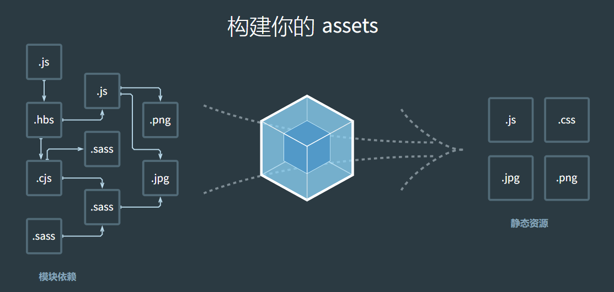

> 参考文献
>
> 1. https://doc.webpack-china.org/
> 2. http://array_huang.coding.me/webpack-book/
> 3. http://webpack.github.io/
> 4. http://jspang.com/2017/09/16/webpack3-2/

# # 前言

webpack 最新版本为：v4.1.0

# # 简介




Webpack 是一个前端资源加载/打包工具。它将根据模块的依赖关系进行静态分析，然后将这些模块按照指定的规则生成对应的静态资源。

从图中我们可以看出，Webpack 可以将多种静态资源 js、css、less 转换成一个静态文件，减少了页面的请求。

接下来我们简单为大家介绍 Webpack 的安装与使用。

## 1. 前端为什么需要webpack？

现在的前端网页功能丰富，特别是SPA（single page web application 单页应用）技术流行后，JavaScript的复杂度增加和需要一大堆依赖包，还需要解决SCSS，Less……新增样式的扩展写法的编译工作。所以现代化的前端已经完全依赖于WebPack的辅助了。

现在最流行的三个前端框架，可以说和webpack已经紧密相连，框架官方都推出了和自身框架依赖的webpack构建工具。

- React.js + WebPack
- Vue.js + WebPack
- AngluarJS + WebPack

从此可以看出，无论你前端走那条线，你都要有很强的Webpack知识，才能祝你成为这个框架领域的大牛。

## 2. 什么是webpack？

> WebPack可以看做是**模块打包机**：它做的事情是，分析你的项目结构，找到JavaScript模块以及其它的一些浏览器不能直接运行的拓展语言（Sass，TypeScript等），并将其转换和打包为合适的格式供浏览器使用。在3.0出现后，Webpack还肩负起了优化项目的责任。

这段话有三个重点：

- 打包：可以把多个Javascript文件打包成一个文件，减少服务器压力和下载带宽。
- 转换：把拓展语言转换成为普通的JavaScript，让浏览器顺利运行。
- 优化：前端变的越来越复杂后，性能也会遇到问题，而WebPack也开始肩负起了优化和提升性能的责任。

# # 安装

## 1. 前提条件

下载最新版的 [nodeJS](http://nodejs.cn/download/)

```shell
$ node -v
v8.9.3
```

## 2. 全局安装

```shell
$ npm i -g webpack@3
```

查看版本：

```shell
$ webpack -v
3.11.0
```

如果你这时**安装失败**了（出现了报错信息），一般有三种可能：

- 检查你node的版本号，如果版本号过低，升级为最新版本。
- 网络问题，可以考虑使用cnpm来安装（这个是淘宝实时更新的镜像）,具体可以登录cnpm的官方网站学习<http://npm.taobao.org/>。
- 权限问题，在Liux、Mac安装是需要权限，如果你是Windows系统，主要要使用以管理员方式安装。

> **注意：**全局安装是可以的，但是webpack官方是不推荐的。这会将您项目中的 webpack 锁定到指定版本，并且在使用不同的 webpack 版本的项目中，可能会导致构建失败。

# # webpack 起步

这里，我们主要以一个小示例帮助大家理解webpack打包的过程及其原理。

首先创建一个空的项目（ “webpack-test” ），打开终端，`cd` 到项目中，并创建 "package.json" 文件。

```shell
$ mkdir webpack-test
$ cd webpack-test
$ npm init -y
```

接下来本地安装webpack

```shell
$ npm i -D webpack
```

> 提示：
>
> -D ，--save-dev 缩写，保存到package.json中，dev是在开发时使用这个包，而生产环境中不使用。

**开发环境 & 生产环境：**

- 开发环境：在开发时需要的环境，这里指在开发时需要依赖的包。
- 生产环境：程序开发完成，开始运行后的环境，这里指要使项目运行，所需要的依赖包。

建立基本项目结构：

```
.
├── dist
    └── index.html
├── node_modules
├── package.json
└── src
    └── js
        └── entry.js
```

- src文件夹：用来存放我们编写的javascript代码，可以简单的理解为用JavaScript编写的模块。
- dist文件夹：用来存放供浏览器读取的文件，这个是webpack打包成的文件。

你可以理解成src是源码文件，dist是我们编译打包好的文件；一个用于**开发环境**，一个用于**生产环境**。

接下来我们编写文件内容：

```html
<!--index.html-->
<!doctype html>
<html lang="zh-Hans">
<head>
    <meta charset="UTF-8">
    <meta name="viewport"
          content="width=device-width, user-scalable=no, initial-scale=1.0, maximum-scale=1.0, minimum-scale=1.0">
    <meta http-equiv="X-UA-Compatible" content="ie=edge">
    <title>webpack - testing</title>
</head>
<body>


<div id="test"></div>

<script src="./js/bundle.js"></script>

</body>
</html>
```

```javascript
// entry.js
document.getElementById("test").textContent = "Hello, webpack!";
```

开始打包，打包方式主要有三种：CLI（命令行）、配置文件（ “webpack.config.js” ）、npm。

## 1. CLI

Webpack其实是可以在终端（命令行）中使用的，基本使用方法如下：

```javascript
webpack {entry file} {destination for bundled file}
```

- **{entery file}: 入**口文件的路径，本文中就是src/entery.js的路径；
- **{destination for bundled file}:** 填写打包后存放的路径。
- **注意：**在命令行中是不需要写{ }的。

```shell
$ webpack ./src/js/index.js ./dist/js/bundle.js
Hash: 69a31b0a7104d1300b7e
Version: webpack 3.11.0
Time: 52ms
   Asset     Size  Chunks             Chunk Names
index.js  2.51 kB       0  [emitted]  main
   [0] ./src/js/index.js 36 bytes {0} [built]
```

命令执行成功后，会在dist目录下出现**bundle.js文件**，这时我们就可以在浏览器中预览结果了，网页中显示出了“Hello， webpack！” 的信息。

webpack 执行打包任务时还可以配置参数，如下所示：

- `-w`：监听
- `-p`：对打包后的文件进行压缩
- `--colors`：颜色


- `--progress`：显示打包进度
- `--display-modules`：显示打包模块
- `--display-reasons`：显示添加打包模块的原因


- `--display-error-details`： 出错时错误的详情

> 提示：可在终端输入 `webpack --help`  查看

## 2. webpack.config.js

上述示例通过命令行模式实现不太方便且容易出错，更好的办法是定义一个配置文件，这个配置文件其实也是一个简单的JavaScript模块，我们可以把所有的与打包相关的信息放在里面。

webpack.config.js 就是Webpack的配置文件，这个文件需要自己在项目根目录下手动建立。建立好后我们对其进行配置，先看下面的代码（ webpack.config.js 的基本结构），这是一个没有内容的标准webpack配置模版。

```javascript
module.exports={
    // 入口文件的配置项，可以是单一入口，也可以是多入口。
    entry:{},
    // 出口文件的配置项，在webpack2.X版本后，支持多出口配置。
    output:{},
    // 模块：例如解读CSS,图片如何转换，压缩
    module:{},
    // 插件，用于生产模版和各项功能，根据你的需要配置不同功能的插件
    plugins:[],
    // 配置webpack开发服务功能
    devServer:{}
}
```

好啦，接下来在 ”webpack-test“ 根目录下新建一个名为 *”webpack.config.js“* 的文件，我们在其中写入如下所示的配置代码，目前的配置主要涉及到的内容是入口文件路径和打包后文件的存放路径。        

```javascript
// 引入模块
const path = require('path');

module.exports={
    //入口文件的配置项
    entry: {
        entry:'./src/js/entry.js'
    },
    //出口文件的配置项
    output:{
        //输出的路径，用了Node语法
        path:path.resolve(__dirname,'dist'),
        //输出的文件名称
        filename:'js/bundle.js'
    }
};
```

> 提示：**path.resolve(__dirname, ’dist’)** 就是获取项目的 **绝对路径**。

配置完成之后，在终端可直接通过 `webpack` 指令执行打包任务：

```shell
$ webpack 
Hash: b1d8521600c4e38f3c01
Version: webpack 3.11.0
Time: 52ms
       Asset     Size  Chunks             Chunk Names
js/bundle.js  2.54 kB       0  [emitted]  entry
   [0] ./src/js/entry.js 71 bytes {0} [built]
```

当然你也可以自定义打包配置文件，比如你现在创建了一个 ”webpack.dev.config.js“ 文件，配置代码和 ”webpack.config.js“ 代码一致，然后我们在执行打包任务时需添加 `--config` 参数，如下所示：

```shell
$ webpack --config webpack.dev.config.js
Hash: b1d8521600c4e38f3c01
Version: webpack 3.11.0
Time: 52ms
       Asset     Size  Chunks             Chunk Names
js/bundle.js  2.54 kB       0  [emitted]  entry
   [0] ./src/js/entry.js 71 bytes {0} [built]
```

> 提示：在实际开发中我们都是通过配置文件进行打包的，所以必须要掌握好。

## 3. npm

通过配置文件执行打包任务，可以很方便的在终端使用 `webpack` 指令。但是，如果在执行打包任务的过程中多个参数就显得比较复杂了，好在 npm 可以帮助我们解决这个这个问题，我们可以再 npm 的 ”package.json“ 文件中进行添加一个脚本指令的字段，如下所示：

```json
{
  ...
  "scripts": {
    "webpack": "webpack --progress --display-modules --colors --display-reasons"
  }
  ....
}
```

在 ”package.json“ 文件中配置添加完脚本配置之后，我们可直接通过 ”npm run webpack“ 指令执行打包任务，如下所示:

```shell
$ npm run webpack

> webpack-test@1.0.0 webpack /Users/LiHongyao/Desktop/webpack-test
> webpack --config webpack.config.js --progress --display-modules --colors --display-reasons

Hash: 96bee32fdd96f16ce273                                                    e Version: webpack 3.10.0
Time: 65ms
    Asset     Size  Chunks             Chunk Names
bundle.js  2.55 kB       0  [emitted]  main
   [0] ./src/js/index.js 80 bytes {0} [built]
```

可以发现，通过这种方式执行打包任务更加方便。

# # 核心

## 1. Entry And Output

- `Entry`：入口起点(entry point)指示 webpack 应该使用哪个模块，来作为构建其内部依赖图的开始。进入入口起点后，webpack 会找出有哪些模块和库是入口起点（直接和间接）依赖的。
- `Output`：该属性告诉 webpack 在哪里输出它所创建的 bundles，以及如何命名这些文件。你可以通过在配置中指定一个 output 字段，来配置这些处理过程。

### 1.1.  单入口 -> 单输出

```javascript
const path = require('path');
module.exports = {
    // 入口
    entry: './src/js/entry.js',
    // 出口
    output: {
        path: path.resolve(__dirname, './dist'),
        filename: "js/bundle.js"
    }
};
```

单个入口一般用于单页面引用，输出目录为：”./dist/js/bundle.js“

### 1.2. 多入口 -> 单输出

如果你想要合并多个js文件，可通过数组指定入口文件，如下所示：

```javascript
const path = require('path');
module.exports = {
    // 入口
    // 通过数组指定
    entry: [
        './src/js/entry1.js',
        './src/js/entry2.js'
    ],
    // 出口
    output: {
        path: path.resolve(__dirname, './dist'),
        filename: "js/bundle.js"
    }
};
```

### 1.3. 多入口 -> 多输出

这种模式，适合多页面开发或分离应用程序的情况。配置入口时通过对象（`Object`）类型配置，如下所示：

```javascript
const path = require('path');
module.exports = {
    // 入口
    entry: {
        main: './src/js/entry1.js',
        test: './src/js/entry2.js'
    },
    // 出口
    output: {
        path: path.resolve(__dirname, './dist'),
        filename: "js/[name]-[hash:6].js"
    }
};
```

- `[name]`：模块名称，也就是在指定入口时的 `key` 值。
- `[hash]`：打包后文件的 hash 值，md5，保证文件唯一性。
- `[chunkhash]`：模块自身的hash值。

## 2. Plugins

插件（Plugins）是用来拓展Webpack功能的，它们会在整个构建过程中生效，执行相关的任务。
Loaders和Plugins常常被弄混，但是他们其实是完全不同的东西，可以这么来说，loaders是在打包构建过程中用来处理源文件的，一次处理一个，插件并不直接操作单个文件，它直接对整个构建过程其作用。

Webpack有很多内置插件，同时也有很多第三方插件，可以让我们完成更加丰富的功能。

要使用某个插件，我们需要通过 `npm` 安装它，然后要做的就是在webpack配置中的plugins关键字部分添加该插件的一个实例（plugins是一个数组）。

### 2.1. [clean-webpack-plugin](https://www.npmjs.com/package/clean-webpack-plugin)

说明：清除文件

> 为什么使用 “clean-webpack-plugin”？ 

我们来看一个示例：

```javascript
const path = require('path');
module.exports = {
    // 入口
    // 通过数组指定
    entry: {
        main: './src/js/index.js',
        test: './src/js/test.js'
    },
    // 出口
    output: {
        path: path.resolve(__dirname, './dist'),
        filename: "js/[name]-[hash].js"
    }
};
```

执行打包任务，然后修改源文件再执行，多次操作，观察 *./dist/* 目录，如下所示：

```
dist
   └── js
       ├── main-e56abf8d6e5742c78c4b.js
       ├── main-28fd7dfe9a700a6e0eb8.js
        ...
       ├── test-28fd7dfe9a700a6e0eb8.js
       ├── test.e56abf8d6e5742c78c4b.js
```

生成的带 hash 的编译文件就会很多。这些带 hash 的编译只有最新的才有用，其他的都没用，我们要在 build 之前把它们全清空，这就是 clean-webpack-plugin 发挥的作用。

> 如何使用？

安装：

```shell
$ npm install --save-dev clean-webpack-plugin 
```

配置：

```javascript
const path = require('path');
// 引入插件模块
const cleanPlugin = require('clean-webpack-plugin');

module.exports = {
    // 入口
    // 通过数组指定
    entry: {
        main: './src/js/index.js',
        test: './src/js/test.js'
    },
    // 出口
    output: {
        path: path.resolve(__dirname, './dist/js'),
        filename: "[name]-[hash].js"
    },
    // 插件
    plugins: [
        // 实例化插件
        new cleanPlugin(['./dist/'])
    ]
};
```

执行打包任务，“dist” 目录下之前生成的文件已被删除。

### 2.2. [BannerPlugin](https://webpack.js.org/plugins/banner-plugin/)

说明：添加版权声明

安装：无需安装，该插件为 webpack 内置插件，直接使用即可。

示例：

```javascript
// 引入插件模块
const path = require('path');
const webpack = require('webpack');
const cleanPlugin = require('clean-webpack-plugin');


module.exports = {
    // 入口
    // 通过数组指定
    entry: {
        main: './src/js/index.js',
        test: './src/js/test.js'
    },
    // 出口
    output: {
        path: path.resolve(__dirname, './dist/js'),
        filename: "[name]-[hash].js"
    },
    // 插件
    plugins: [
        // 实例化插件
        new cleanPlugin(['./dist/']),
        new webpack.BannerPlugin('版权所有，翻版必究！')
    ]
};
```


### 2.3. [HtmlWebpackPlugin](https://github.com/ampedandwired/html-webpack-plugin)

说明：HtmlWebpackPlugin 简化了HTML文件的创建，以便为你的webpack包提供服务，它可以自动为你生成项目中的html文件。 这对于在文件名中包含哈希的webpack bundle尤其有用。 

安装：

```shell
$ npm install --save-dev html-webpack-plugin 
```

配置：

- `template`：根据指定html文件模板生成
- `title`：设置html标题
- `filename`：设置生成后的文件名字
- `inject`：指定在 “head” 还是在 “body” 中插入脚本
- `minify`：压缩html配置
- `hash`：是否设置hash

接下来，我们将由浅入深的介绍 HtmlWebpackPlugin 插件的使用，首先配置文件：

```javascript
// 引入插件模块
const path = require('path');
const webpack = require('webpack');
const cleanPlugin = require('clean-webpack-plugin');
const htmlWebpackPlugin = require('html-webpack-plugin');


module.exports = {
    // 入口
    // 通过数组指定
    entry: {
        main: './src/js/index.js',
        test: './src/js/test.js'
    },
    // 出口
    output: {
        path: path.resolve(__dirname, './dist/js'),
        filename: "[name]-[hash].js"
    },
    // 插件
    plugins: [
        // 实例化插件
        new cleanPlugin(['./dist/']),
        new webpack.BannerPlugin('版权所有，翻版必究！'),
        new htmlWebpackPlugin()
    ]
};
```

执行打包任务，“dist” 目录中生成 “index.html” 文件，并且自动为我们引入了打包出来的两个js文件。如下所示：


但我们会发现一个问题，那就是 “index.html” 文件被放置在了 “dist” 目录中的 “js” 文件下，这是由我们配置出口（`Output`） 时所导致的，我们修改下 output 配置项：

```javascript
module.exports = {
    ...
    output: {
        path: path.resolve(__dirname, './dist'),
        filename: "js/[name]-[hash].js"
    }
    ...
};
```

再一次执行打包指令，观察结构，我们会发现，“index.html” 被放置在了 “dist” 文件的根目录中。

我们也可以根据某个html源文件模板生成，现在我们在 “src” 目录下创建一个 “index.html” 文件:

```html
<!DOCTYPE html>
<html lang="zh-Hans">
<head>
    <meta charset="UTF-8">
    <title>Webpack Testing</title>
</head>
<body>

</body>
</html>
```

并在webpack配置文件中进行如下配置：

```javascript
{
    ...
    plugins: [
        new htmlWebpackPlugin({
            // 配置
            // 指定模板源文件
            template: './src/index.html',
            // 指定输出文件名
            filename: 'index.html',
            // 指定脚本放置位置
            inject: 'head',
            // 指定html标题
            title: 'Webpack is Good.'
        })
    ]
    ... 
};
```

执行打包指令：


可以发现，编译出的文件的确根据 “index.html” 源文件生成，并且 js 引入放置在了 “head” 标签对之间，但是网页标题并没有修改，如何显示呢？我们需要在 html 页面简单配置：

```html
<!DOCTYPE html>
<html lang="zh-Hans">
<head>
    <meta charset="UTF-8">
    <title><%= htmlWebpackPlugin.options.title %></title>
</head>
<body>

</body>
</html>
```

执行打包任务，观察编译出的 “index.html” 文件：

```html
<!DOCTYPE html>
<html lang="zh-Hans">
<head>
    <meta charset="UTF-8">
    <title>Webpack is Good.</title>
    <script type="text/javascript" src="js/test-dc65d6278a5212520af6.js"></script>
    <script type="text/javascript" src="js/main-dc65d6278a5212520af6.js"></script>
</head>
<body>

</body>
</html>
```

标题设置成功，“index.html” 源文件中的类似于 *\"<%= htmlWebpackPlugin.options.title %>"* 的语法可以帮助我们获取webpack的一些配置信息，比如我们在 htmlWebpackPlugin 配置项中添加一个自定义的日期属性：

```javascript
new htmlWebpackPlugin({
    // 配置
    // 指定模板源文件
    template: './src/index.html',
    // 指定输出文件名
    filename: 'index.html',
    // 指定脚本放置位置
    inject: 'head',
    // 指定html标题
    title: 'Webpack is Good.',
    // 添加一个日期配置
    date: new Date()
})
```

然后再 “index.html” 源文件中显示：

```html
<!DOCTYPE html>
<html lang="zh-Hans">
<head>
    <meta charset="UTF-8">
    <title><%= htmlWebpackPlugin.options.title %></title>
</head>
<body>

<%= htmlWebpackPlugin.options.date %>

</body>
</html>
```

执行打包任务，观察编译出的 “index.html” 文件：


成功获取，接下来我们遍历下 htmlWebpackPlugin 所有的配置信息：

在 “index.html” 源文件中的 body 标签对间添加如下代码：

```html
<% for (var key in htmlWebpackPlugin.files) { %>
    <%= key %> : <%= JSON.stringify(htmlWebpackPlugin.files[key])%>
<% } %>

<br/>

<% for (var key in htmlWebpackPlugin.options) {%>
    <%= key %> : <%= JSON.stringify(htmlWebpackPlugin.options[key])%>
<% } %>
```

执行打包任务，查看编译出的 “index.html” 文件，如下suoshi :

```html
<!DOCTYPE html>
<html lang="zh-Hans">
<head>
    <meta charset="UTF-8">
    <title>Webpack is Good.</title>
    <script type="text/javascript" src="js/test-5ea969854d78e22c9dc8.js"></script>
    <script type="text/javascript" src="js/main-5ea969854d78e22c9dc8.js"></script>
</head>
<body>

Mon Jan 29 2018 18:01:35 GMT+0800 (CST)
  

    publicPath : ""

    chunks : {"test":{"size":46,"entry":"js/test-5ea969854d78e22c9dc8.js","hash":"dc81bf4c69ad1f5bf67e","css":[]},"main":{"size":79,"entry":"js/main-5ea969854d78e22c9dc8.js","hash":"e50182aa3560d614eae0","css":[]}}

    js : ["js/test-5ea969854d78e22c9dc8.js","js/main-5ea969854d78e22c9dc8.js"]

    css : []

    manifest : 


<br/>


    template : "/Users/LiHongyao/Desktop/webpack-test/node_modules/html-webpack-plugin/lib/loader.js!/Users/LiHongyao/Desktop/webpack-test/src/index.html"

    filename : "index.html"

    hash : false

    inject : "head"

    compile : true

    favicon : false

    minify : false

    cache : true

    showErrors : true

    chunks : "all"

    excludeChunks : []

    title : "Webpack is Good."

    xhtml : false

    date : "2018-01-29T10:01:35.815Z"

</body>
</html>
```

了解了如何引用配置信息之后，现在我们复杂一下需求，比如我想在 “head” 标签对中引入 “main.js”，在 “body” 标签对中引入 “test.js”，如何设置呢？

首先，我们通过模板语法配置源文件 “index.html”，如下所示：

```html
<!DOCTYPE html>
<html lang="zh-Hans">
<head>
    <meta charset="UTF-8">
    <title><%= htmlWebpackPlugin.options.title %></title>
    <script src="<%= htmlWebpackPlugin.files.chunks.main.entry%>"></script>
</head>
<body>

<%= htmlWebpackPlugin.options.date %>

<script src="<%= htmlWebpackPlugin.files.chunks.test.entry%>"></script>
</body>
</html>
```

然后修改下插件配置，将 `inject` 的值置为 `false`，执行打包指令，输出“index.html”文件如下:

```html
<!DOCTYPE html>
<html lang="zh-Hans">
<head>
    <meta charset="UTF-8">
    <title>Webpack is Good.</title>
    <script src="js/main-17f40e940562b200d1c5.js"></script>
</head>
<body>

Mon Jan 29 2018 18:07:58 GMT+0800 (CST)

<script src="js/test-17f40e940562b200d1c5.js"></script>
</body>
</html>
```

为了更接近于上线需求，我们将引用地址变为线上地址，假设线上地址为 *http://cdn.com/* ，在output 中添加 `publicPath` 配置项，如下所示：

```javascript
publicPath: "http://cdn.com/"
```

执行打包指令，观察结果：

```html
<!DOCTYPE html>
<html lang="zh-Hans">
<head>
    <meta charset="UTF-8">
    <title>Webpack is Good.</title>
    <script src="http://cdn.com/js/main-f59d09eb4dcda60b00e5.js"></script>
</head>
<body>

Mon Jan 29 2018 18:11:18 GMT+0800 (CST)

<script src="http://cdn.com/js/test-f59d09eb4dcda60b00e5.js"></script>
</body>
</html>
```

编译后文件引入的就是一个线上地址下的js文件了，既然是上线，那么我们接下来还要对html文件进行压缩，如何压缩呢？通过配置 htmlWebpackPlugin 的 `minify` 属性（可在 [此处](https://github.com/kangax/html-minifier#options-quick-reference) 查看关于 minify 的更多配置信息）：

```javascript
// 压缩
minify: {
    // 删除注释
    removeComments: true,
    // 删除空格
    collapseWhitespace: true
}
```

然后我们在源文件 “index.html” 中随意添加一行注释，执行打包任务，观察输出结果：


压缩成功！

**多页面生成**

如果想要生成多个html页面，首先创建 “a.js” 、‘“b.js”、“c.js” 三个js源文件，然后修改源文件“index.html”如下：

```html
<!DOCTYPE html>
<html lang="zh-Hans">
<head>
    <meta charset="UTF-8">
    <title><%= htmlWebpackPlugin.options.title %></title>
</head>
<body>


</body>
</html>
```

接着修改配置文件：

```javascript
// 引入插件模块
const path = require('path');
const webpack = require('webpack');
const cleanPlugin = require('clean-webpack-plugin');
const htmlWebpackPlugin = require('html-webpack-plugin');


module.exports = {
    // 入口
    // 通过数组指定
    entry: {
        main: './src/js/index.js',
        test: './src/js/test.js',
        a: './src/js/a.js',
        b: './src/js/b.js',
        c: './src/js/c.js'
    },
    // 出口
    output: {
        path: path.resolve(__dirname, './dist'),
        filename: "js/[name]-[hash].js",
        publicPath: "http://cdn.com/"
    },
    // 插件
    plugins: [
        // 实例化插件
        new cleanPlugin(['./dist/']),
        new webpack.BannerPlugin('版权所有，翻版必究！'),
        new htmlWebpackPlugin({
            template: './src/index.html',
            filename: 'a.html',
            title: 'this is a.html',
            inject: 'body',
            chunks: ['main', 'a']

        }),
        new htmlWebpackPlugin({
            template: './src/index.html',
            filename: 'b.html',
            title: 'this is b.html',
            inject: 'body',
            chunks: ['b']
        }),
        new htmlWebpackPlugin({
            template: './src/index.html',
            filename: 'c.html',
            title: 'this is c.html',
            inject: 'body',
            chunks: ['c']
        }),
    ]
};
```

可以发现，生成多个html，只需要创建多个 htmlWebpackPlugin 实例即可，在插件配置中，需要注意，通过 `chunks` 属性可以配置引用的模块，当模块比较多时，也可通过 `excludeChunks` 属性排除不引入的模块。

### 2.4. [extract-text-webpack-plugin](https://github.com/webpack-contrib/extract-text-webpack-plugin)

有时候我们要把 LESS 或 CSS 处理好后，放到一个 CSS 文件中，用这个插件就可以实现。

```shell
$ npm i -D extract-text-webpack-plugin@next
```

配置：

```javascript
const path = require('path');
const htmlWebpackPlugin = require('html-webpack-plugin');
const extractTextPlugin = require('extract-text-webpack-plugin');

module.exports = {
    entry: './src/js/main.js',
    output: {
        path: path.resolve(__dirname, './dist/'),
        filename: 'js/bundle.js'
    },
    module: {
        rules: [
            {
                test: /\.less$/,
                use: extractTextPlugin.extract({
                    fallback: 'style-loader',
                    use: ['css-loader', 'less-loader']
                })
            }
        ]
    },
    plugins: [
        new htmlWebpackPlugin({
            template: './src/index.html',
            filename: 'app.html'
        }),
      // 圆括号内指定路径
        new extractTextPlugin('css/index.css')
    ]
};
```

### 2.5. uglifyjs-webpack-plugin

该插件主要用于压缩js，虽然uglifyjs是插件，但是webpack版本里默认已经集成，不需要再次安装。我们直接在 ”webpack.config.js“ 中引入即可：

```javascript
const uglify = require('uglifyjs-webpack-plugin');
```

然后再 plugins 项里进行配置：

```javascript
plugins: [
  new uglify()
]
```

这时候在终端中使用webpack进行打包，你会发现JS代码已经被压缩了。

## 3. Loader

Webpack 本身只能处理 JavaScript 模块，如果要处理其他类型的文件，就需要使用 loader 进行转换。

简单的举几个Loaders使用例子：

- 可以把LESS文件的写法转换成CSS，而不再使用其他转换工具。
- 可以把ES6或者ES7的代码，转换成大多浏览器兼容的JS代码。
- 可以把React中的JSX转换成JavaScript代码。

注意：Loader 需要单独安装并且需要在 “webpack.config.js” 中的 `module` 关键字下进行配置，Loader 的配置包括以下几方面：

- `test`：用于匹配处理文件的扩展名的表达式，这个选项是必须进行配置的；
- `use`：loader名称，就是你要使用模块的名称，这个选项也必须进行配置，否则报错；
- `include/exclude`：手动添加必须处理的文件（文件夹）或屏蔽不需要处理的文件（文件夹）（可选）；
- `query`：为loader提供额外的设置选项（可选）；

### 3.1. babel-loader

可能你不懂  [babel](https://babeljs.cn/) 是什么，你可以把它理解为编译器，它能把 react 代码转成一般浏览器可读可执行的代码，通常可以用它来转化 react 或 vue 这样的前端代码，或者把 es6 代码转成普通的 javascript 代码等等，在这里，主要给大家讲讲如何在webpack中通过babel将es6转换成es5。

安装：

```shell
$ npm install --save-dev babel-loader babel-core babel-preset-env
```

配置：

```javascript
module: {
    rules: [
        {
            test: /\.js$/,
            exclude: /node_modules/, // 正则表示法
            include: path.resolve(__dirname, 'src'), // 绝对路径表示法
            use: {
                loader: "babel-loader",
                options: {
                    presets: 'env'
                }
            }
        }
    ]
}
```

### 3.2. css-loader、style-loader

webpack提供两个loader处理样式表，`css-loader` 和 `style-loader`，二者处理的任务不同：

- css-loader：使你能够使用类似 “import” 和 “url()”  的方法实现 “require()” 的功能。

- style-loader：将所有计算后的样式加入页面中。

> 安装

```shell
$ npm i -D css-loader style-loader
```

> 配置

首先在 entrt.js 文件中引入css

```javascript
import css from "../css/entry.css";
```

然后在配置文件中添加如下内容：

```javascript
module: {
    rules: [
        {
            test: /\.css$/,
            exclude: /node_modules/,
            use: ['style-loader', 'css-loader']
        }
    ]
}
```

### 3.3. less-loader、sass-loader

说明：

- less-loader：编译less文件
- sass-loader：编译sass文件

安装：

```shell
$ npm i -D less-loader less
```

配置：

```javascript
module: {
    rules: [
        {
            test: /\.css$/,
            exclude: /node_modules/,
            use: ['style-loader', 'css-loader', 'less-loader']
        }
    ]
}
```

### 3.4. [postcss-loader](http://postcss.org/)

说明：后处理css，浏览器前缀，兼容浏览器。

安装：

```shell
$ npm i -D postcss-loader autoprefixer
```

> autoprefixer：自动添加前缀

配置：

```javascript
{
    test: /\.css$/,
    exclude: /node_modules/,
    use: [
        {
            loader: "style-loader"
        },
        {
            loader: "css-loader",
            options: {
                // 使得在主文件import其他样式文件同样自动添加前缀
                importLoaders: 1
            }
        },
        {
            loader: "postcss-loader",
            options: {
                // 标识
                ident: "postcss",
                // 是否生成源文件
                sourceMap: true,
                // 插件
                plugins: (loader) => [
                    // 自动添加前缀
                    require('autoprefixer')({
                        // 兼容
                        browsers:'last 5 versions'
                    })
                ]
            }
        }
    ]
}
```

### 3.5. file-loader、url-loader

我们以css中设置图片为例，首先在网上下载任意图片，然后在 src 目录下创建 img 文件夹并将图片放入其中。

在 index.html 文件中增加一个放置div的标签（需要注意的是这里修改的是src下的 index.html文件，不是dist下的，这点新手很容易弄混，要格外注意），代码如下。

```html
<!doctype html>
<html lang="zh-Hans">
<head>
    <meta charset="UTF-8">
    <meta name="viewport"
          content="width=device-width, user-scalable=no, initial-scale=1.0, maximum-scale=1.0, minimum-scale=1.0">
    <meta http-equiv="X-UA-Compatible" content="ie=edge">
    <title>webpack-test</title>
</head>
<body>

<div class="box"></div>

</body>
</html>
```

编写css文件，把你用的图片作为背景显示。

```css
.box {
    background: url("../img/goods_13.jpg");
    width: 220px;
    height: 220px;
}
```

编写完成后，我们可以试着用webpack去打包一下。你会发现终端中是报错的，具体错误可以看下图。

```shell
ERROR in ./src/img/goods_13.jpg
Module parse failed: Unexpected character '�' (1:0)
You may need an appropriate loader to handle this file type.
(Source code omitted for this binary file)
 @ ./node_modules/css-loader!./src/css/entry.css 7:73-103
 @ ./src/css/entry.css
 @ ./src/js/entry.js
```

上面的错误是由于缺少loader的解析，此时我们就需要使用 file-loader 和 url-loader 了。

首先我们先安装 loader：

```shell
$ npm i -D file-loader url-loader
```

安装好后我们需要对两个loader进行基本的了解，学习尽量做到知其然知其所以然。

**file-loader：**解决引用路径的问题，拿background样式用url引入背景图来说，我们都知道，webpack最终会将各个模块打包成一个文件，因此我们样式中的url路径是相对入口html页面的，而不是相对于原始css文件所在的路径的。这就会导致图片引入失败。这个问题是用file-loader解决的，file-loader可以解析项目中的url引入（不仅限于css），根据我们的配置，将图片拷贝到相应的路径，再根据我们的配置，修改打包后文件引用路径，使之指向正确的文件。

**url-loader：**如果图片较多，会发很多http请求，会降低页面性能。这个问题可以通过url-loader解决。url-loader会将引入的图片编码，生成dataURl。相当于把图片数据翻译成一串字符。再把这串字符打包到文件中，最终只需要引入这个文件就能访问图片了。当然，如果图片较大，编码会消耗性能。因此url-loader提供了一个limit参数，小于limit字节的文件会被转为DataURl，大于limit的还会使用file-loader进行copy。

配置url-loader：

我们安装好后，就可以使用这个loader了，记得在loader使用时不需要用require引入，在plugins才需要使用require引入。

```javascript
module: {
    rules: [
        {
            test: /\.css$/,
            exclude: /node_modules/,
            use: ["style-loader", "css-loader"]
        },
        {
            test: /\.(png|jpg|gif|svg)/,
            use: [
                {
                    loader: "url-loader",
                    options: {
                        limit: 500000
                    }
                }
            ]
        }
    ]
},
```

- test:/\.(png|jpg|gif)/是匹配图片文件后缀名称。
- use：是指定使用的loader和loader的配置参数。
- limit：是把小于500000B的文件打成Base64的格式，写入JS。

**为什么只使用了url-loader?**

有的小伙伴会发现我们并没有在webpack.config.js中使用file-loader，但是依然打包成功了。我们需要了解file-loader和url-loader的关系。url-loader和file-loader是什么关系呢？简答地说，url-loader封装了file-loader。url-loader不依赖于file-loader，即使用url-loader时，只需要安装url-loader即可，不需要安装file-loader，因为url-loader内置了file-loader。通过上面的介绍，我们可以看到，url-loader工作分两种情况：

1.文件大小**小于**limit参数，url-loader将会把文件转为DataURL（Base64格式）；

2.文件大小**大于**limit，url-loader会调用file-loader进行处理，参数也会直接传给file-loader。

也就是说，其实我们只安装一个url-loader就可以了。但是为了以后的操作方便，我们这里就顺便安装上file-loader。

使用file-loader输出图片：

```javascript
module: {
    rules: [
        {
            test: /\.(png|jpg|gif|svg)/,
            use: [
                {
                    loader: "file-loader",
                    options: {
                        // 指定输出文件名字
                        name: "[name]-[hash:6].[ext]",
                        // 指定输出文件路径（相对于出口路径）
                        outputPath:"img/"
                    }
                }
            ]
        }
    ]
},
```

# # 服务和热更新

## 1. 服务

webpack-dev-server输出的文件只存在于内存中,不输出真实的文件

想不想让你的浏览器监听你的代码的修改，并自动刷新显示修改后的结果，其实Webpack提供一个可选的本地开发服务器，这个本地服务器基于node.js构建，可以实现你想要的这些功能，不过它是一个单独的组件，在webpack中进行配置之前需要单独安装它作为项目依赖：

```shell
$ npm install --save-dev webpack-dev-server
```

devServer作为webpack配置选项中的一项，以下是它的一些配置选项，更多配置可参考 [这里](https://webpack.js.org/configuration/dev-server/) 。

| 配置选项               | 功能描述                                     |
| ------------------ | ---------------------------------------- |
| contentBase        | 默认webpack-dev-server会为根文件夹提供本地服务器，如果想为另外一个目录下的文件提供本地服务器，应该在这里设置其所在目录（本例设置到“src"目录） |
| port               | 设置默认监听端口，如果省略，默认为”8080“                  |
| inline             | 设置为`true`，当源文件改变时会自动刷新页面                 |
| historyApiFallback | 在开发单页应用时非常有用，它依赖于HTML5 history API，如果设置为`true`，所有的跳转将指向index.html |
| host               | 设置服务器主机号                                 |

把这些命令加到webpack的配置文件中，现在的配置文件 “webpack.config.js” 如下所示：

```javascript
const path = require("path");

module.exports = {
    entry: "./src/js/entry.js",
    output: {
        filename: "bundle.js",
        path: path.resolve(__dirname, "./dist")
    },
    devServer: {
        // 本地服务器所加载的页面所在的目录
        contentBase: path.resolve(__dirname, "./dist"),
        // 设置端口号
        port: 8081,
        // 设置服务器主机号，通过http://0.0.0.0:8081/亦可访问
        host: "0.0.0.0",
        // 这个配置属性是用来应对返回404页面时定向到特定页面用的
        // 你可以先在./dist根目录下创建404.html，并写入404相应提示内容
        // 然后在浏览器地址栏输入不存在的地址，如：http://0.0.0.0:8081/gg
        // 此时会定位到404.html
        historyApiFallback: {
            rewrites:[
                {from: /./, to: './404.html'}
            ]
        }, 
    }
};
```

在 “package.json” 中的 `scripts` 对象中添加如下命令，用以开启本地服务器：

```javascript
{
    ......
	"scripts": {
    	"webpack": "node_modules/.bin/webpack",
    	"server": "webpack-dev-server --mode development|production --open"
	},
	...... 
}
```

在终端中输入`npm run server` 即可在本地的 `8081` 端口查看结果。

## 2. 自动刷新与模块热替换

webpack-dev-server的自动刷新和模块热替换机制是紧紧联系在一起的。

**从外部角度看——自动刷新**

当我们对业务代码做了一些修改然后保存后（command+s），页面会自动刷新，我们所做的修改会直接同步到页面上，而不需要我们刷新页面，或重新开启服务。（The webpack-dev-server supports multiple modes to automatically refresh the page）

**从内部角度看——模块热替换**

在热替换（HMR）机制里，不是重载整个页面，HMR程序会只加载被更新的那一部分模块，然后将其注入到运行中的APP中（In Hot Module Replacement, the bundle is notified that a change happened. Rather than a full page reload, a Hot Module Replacement runtime could then load the updated modules and inject them into a running app.）

**配置**

webpack-dev-server实现自动刷新和模块热替换机制配置如下（

你还需要一个插件配置webpack.HotModuleReplacementPlugin()

 ）：

```javascript
const path = require("path");
const webpack = require("webpack");

module.exports = {
    entry: "./src/js/entry.js",
    output: {
        filename: "bundle.js",
        path: path.resolve(__dirname, "./dist")
    },
    devServer: {
        // 本地服务器所加载的页面所在的目录
        contentBase: path.resolve(__dirname, "./dist"),
        // 设置端口号
        port: 8081,
        // 设置服务器主机号，通过http://0.0.0.0:8081/亦可访问
        host: "0.0.0.0",
        // 这个配置属性是用来应对返回404页面时定向到特定页面用的
        // 你可以先在./dist根目录下创建404.html，并写入404相应提示内容
        // 然后在浏览器地址栏输入不存在的地址，如：http://0.0.0.0:8081/gg
        // 此时会定位到404.html
        historyApiFallback: {
            rewrites:[
                {from: /./, to: './404.html'}
            ]
        },
        // 自动刷新
        inline: true,
        // 模块热替换
        hot: true
    },
    plugins: [
        new webpack.HotModuleReplacementPlugin()
    ]
};
```

打开页面：

```javascript
[HMR] Waiting for update signal from WDS...
Hello, webpack!
Hello!
[WDS] Hot Module Replacement enabled.
```

如果有上面两行 “[HMR] \[WDS]”  输出则表明你已经配置成功。

# # 管理资源

```shell
npm i -D babel-loader babel babel-core css-loader style-loader  url-loader file-loader less-loader less 
```

## 1. 处理css

为了从 JavaScript 模块中 `import` 一个 CSS 文件，你需要在 [`module` 配置中](https://doc.webpack-china.org/configuration/module) 安装并添加 [style-loader](https://doc.webpack-china.org/loaders/style-loader)和 [css-loader](https://doc.webpack-china.org/loaders/css-loader)

```shell
$ npm i -D style-loader css-loader
```

创建一个 “index.css” 文件，写任意样式，然后在 “index.js” 文件中 import 该样式文件：

```javascript
import "../css/index.css";
```

接下来设置配置文件：

```javascript
// webpack.config.js

const path = require("path");

module.exports = {
    entry: "./src/js/entry.js",
    output: {
        filename: "js/bundle.js",
        path: path.resolve(__dirname, "./dist")
    },
    module: {
        rules: [
            {
                test: /\.css$/,
                use: ["style-loader", "css-loader"]
            }
        ]
    }
};
```

> webpack 根据正则表达式，来确定应该查找哪些文件，并将其提供给指定的 loader。在这种情况下，以 `.css` 结尾的全部文件，都将被提供给 `style-loader` 和 `css-loader`。

执行编译任务，运行 “.html” ，样式应用成功。

## 2. 处理图片

### 2.1. CSS 中的图片处理

关于css 中的图片处理，可参考 ”file-loader、url-loader“。

> CSS分离与图片路径处理

通过上节课的学习已经能把小图片打包成Base64格式，也对webpack对图片的打包有个基本了解。这节课主要学习两个知识：第一个是把CSS从JavasScript代码中分离出来，第二个是如何处理分离出来后CSS中的图片路径不对问题。

**> 分离CSS**

有些简单的交互页面中，你的JavasScript页面代码会非常少，而大部分代码都在CSS中，这时候项目组长会要求把CSS单独提取出来，方便以后更改。遇到这个需求你不要惊慌，已经有大神为我们准备好了对象的插件。

**extract-text-webpack-plugin**

这个插件就可以完美的解决我们提取CSS的需求，但是webpack官方其实并不建议这样作，他们认为CSS就应该打包到JavasScript当中以减少http的请求数。但现实中的需求往往不是我们前端能控制的，有些需求是我们不能控制的，分离CSS就是这样一个既合理由不合理的需求。

1. 安装：

```shell
$ npm i -D extract-text-webpack-plugin@next
```

2. 引用：

```javascript
const extractTextPlugin = require("extract-text-webpack-plugin");
```

3. 配置：

```javascript
plugins: [
   new extractTextPlugin("/css/index.css")
]
```

这里的 ”/css/index.css“ 是分离后的路径位置。这步配置完成后，还要修改原来我们的style-loader和css-loader。

4. 修改：

```javascript
module: {
    rules: [
        {
            test: /\.css$/,
            exclude: /node_modules/,
            use: extractTextPlugin({
                fallback: "style-loader",
                use: "css-loader"
            })
        },
        {
            test: /\.(png|jpg|gif|svg)/,
            use: [
                {
                    loader: "url-loader",
                    options: {
                        limit: 500000
                    }
                }
            ]
        }
    ]
}
```

作完上边这四部后，就可以使用webpack进行打包了。

**\> 处理路径不对问题 **

利用extract-text-webpack-plugin插件很轻松的就把CSS文件分离了出来，但是CSS路径并不正确，很多小伙伴就在这里搞个几天还是没有头绪，网上也给出了很多的解决方案，我觉的最好的解决方案是使用publicPath解决，我也一直在用。

**publicPath：**是在webpack.config.js文件的output选项中，主要作用就是处理静态文件路径的。

在处理前，我们在webpack.config.js 上方声明一个对象，叫website。

```javascript
let website = {
    publicPath: "http://192.168.199.207:8080/"
};
```

注意，这里的IP和端口，是你本机的ip或者是你devServer配置的IP和端口。

然后在output选项中引用这个对象的publicPath属性。

```javascript
output: {
    filename: "js/bundle.js",
    path: path.resolve(__dirname, "./dist"),
    publicPath: website.publicPath
},
```

配置完成后，你再使用webpack命令进行打包，你会发现原来的相对路径改为了绝对路径，这样来讲速度更快。

### 2.2. HTML 中的图片处理

在webpack中是不喜欢你使用标签\来引入图片的，但是我们作前端的人特别热衷于这种写法，国人也为此开发了一个：[html-withimg-loader](https://www.npmjs.com/package/html-withimg-loader)。他可以很好的处理我们在html 中引入图片的问题，解决的问题就是在hmtl文件中引入\标签的问题。因为是国人开发的，文档都是中文，所以学习起来还是比较简单的。

1. 安装：

```shell
$ npm i -D html-withimg-loader
```

2. 配置：

```javascript
{
    test: /\.(htm|html)$/i,
    use: ["html-withimg-loader"]
}
```

然后在终端中可以进行打包了。你会发现images被很好的打包了。并且路径也完全正确。

## 3. 处理less


