# # 概述

SVN 是 Subversion 的简称，是一个开放源代码的版本控制系统，相较于RCS、CVS，它采用了分支管理系统，说得简单一点 SVN 就是用于多个人共同开发同一个项目，共用资源的目的。

# # SVN 安装包介绍

**服务端**：SVN 服务端安装包是 VisualSVN-Server-3.9.0-x64.msi 

**客户端**：客户端软件主要包括下列3个文件：

- TortoiseSVN-1.10.0.28176-x64-svn-1.10.0.msi — SVN 客户端安装包
- LanguagePack_1.10.0.28176-x64-zh_CN.msi — SVN 客户端语言包
- AnkhSvn — SVN 针对Visual Studio Code 的插件

# # SVN 客户端配置

## 1. 下载/安装

进入[官网下载](http://subversion.apache.org/packages.html#windows)，点击 [TortoiseSVN](https://tortoisesvn.net/downloads/) 下载SVN小乌龟工具，如下所示：

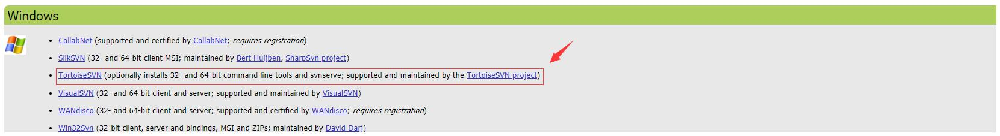

接下来根据系统位数选择下载程序，如下所示：

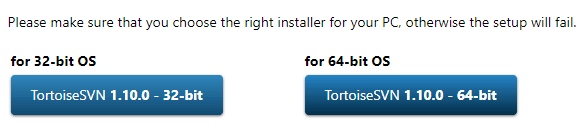

点击 .exe 文件进行安装：

stips 1：

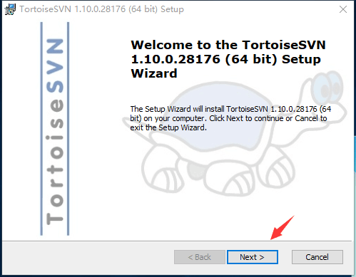

stips 2：

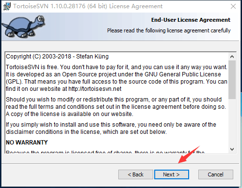

stips 3:

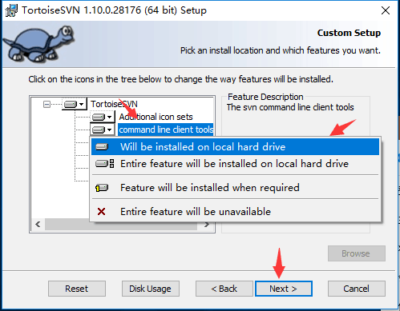

stips 4：

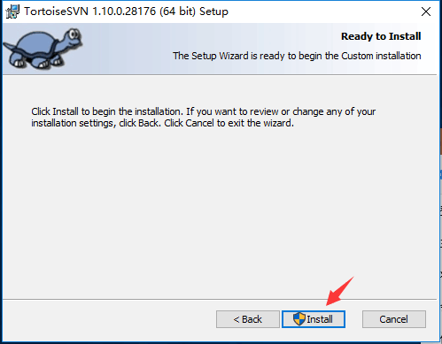

stips：

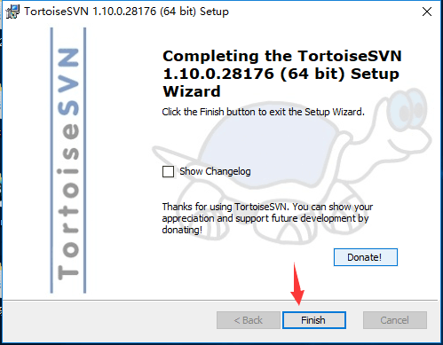

至此，TortoiseSVN 已经安装完成。此时安装的TortoiseSVN是英文版的，我们可以在 [这里](https://tortoisesvn.net/downloads.html) 下载语言包，下载完成之后需要进行安装，切记，语言包安装好后一定要勾选应用才能正常使用，如下图所示：

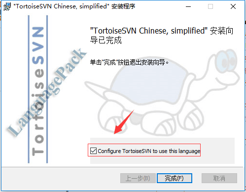

安装完成之后我们就可以看到一个 “svn checkout” 的界面操作了，如图：

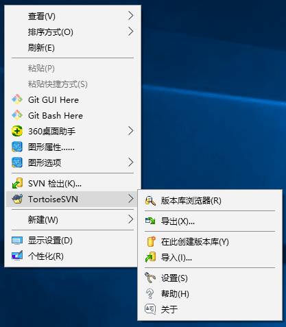

## 2. 配置

接下来，我们就需要配置源代码管理系统的服务器。我们需要找到公司配置的svn服务器 “url repository”，比如说有一个 “https://example.com” 的url版本库。我们只需要点击 “svn checkout（SVN 检出）”，然后会出现如下界面：

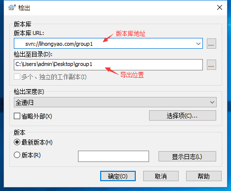

> 注意：检出目录要英文目录！

# # SVN 服务端配置

## 1. 下载安装

单击前往下载 SVN服务端安装包，如下图所示：

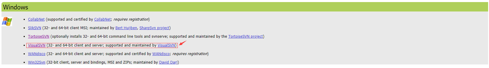

然后根据版本下载对应的安装包：

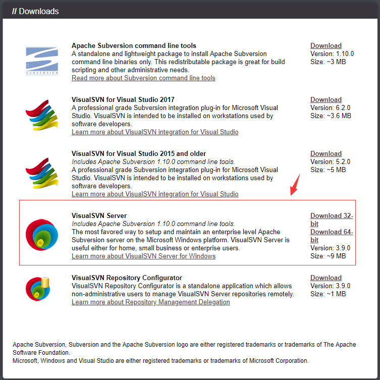

点击 .exe 文件进行安装：

stips 1：

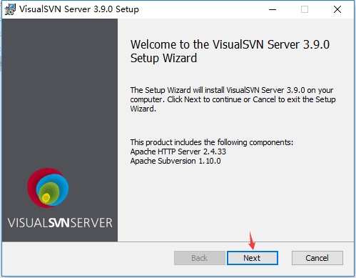

stips 2：

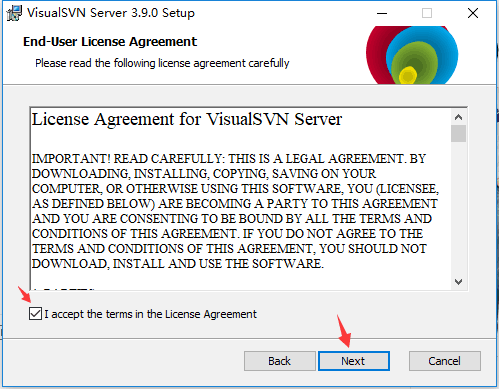

stips 3：默认选择即可，第一项是安装VisualSVN Server以及控制台，最后一项是自动加入环境变量，如下图所示：

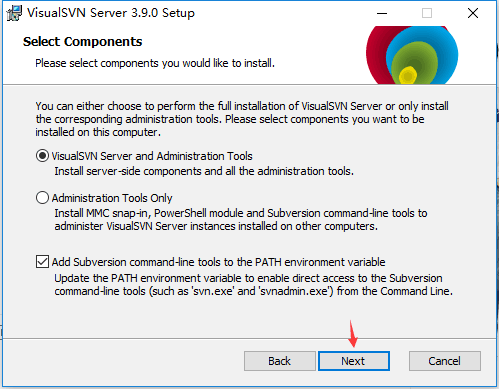

stips 4：选择标准安装（免费）

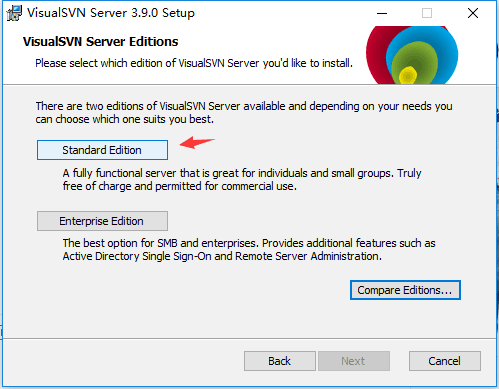

stips 5：确认文件安装目录，以及代码库的位置（你的代码想要保存的位置），一旦这个位置的代码库文件被删除，可就无力回天了，如下图所示：

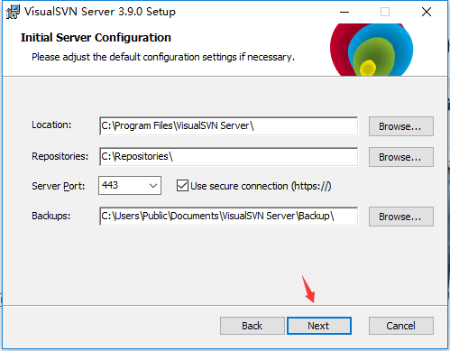

stips 6：安装即可

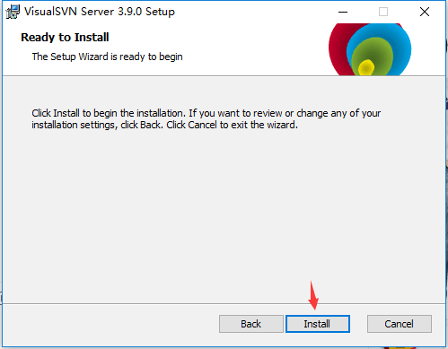

stips 7：确认，直接打开控制管理界面，如下图所示：

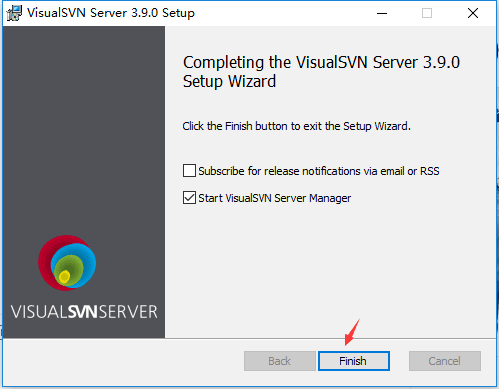

stips 8：安装结束，自动打开控制管理界面，如下图所示：

## 2. 配置

第一步：搭建SVN团队项目、在服务器上打开已安装的SVN服务端、新建一个项目文件夹、创建完成后右键项目复制项目URL地址，具体如下图：

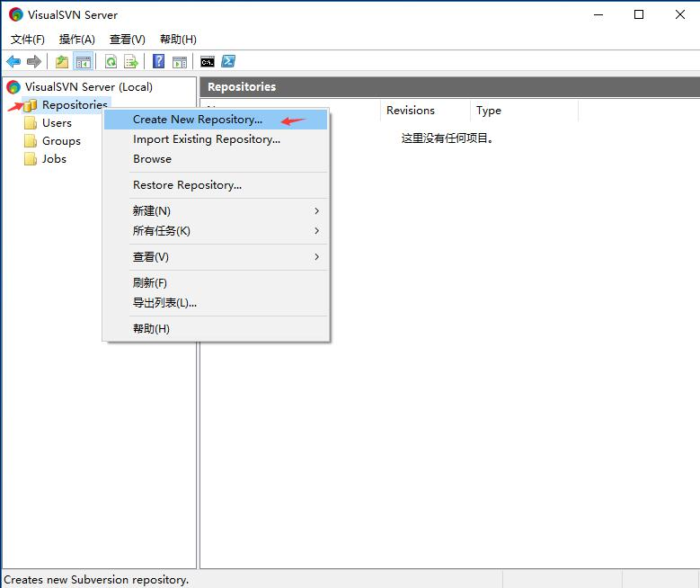

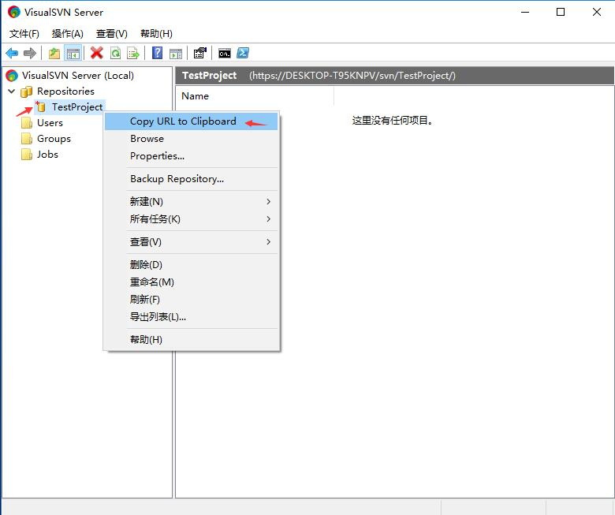

第二步：创建SVN 用户及设置密码，如下图：

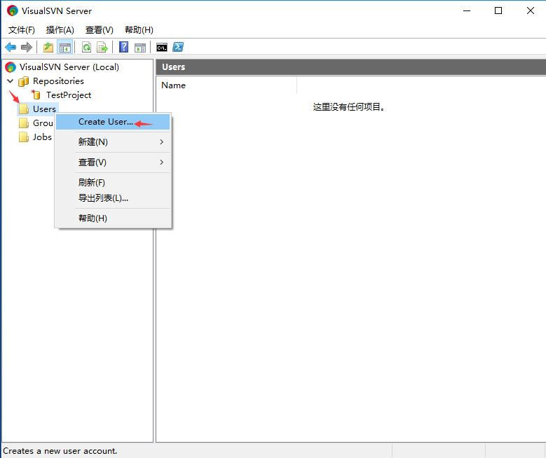

