# 一、概述

SVN 是 Subversion 的简称，是一个开放源代码的版本控制系统，相较于RCS、CVS，它采用了分支管理系统，说得简单一点 SVN 就是用于多个人共同开发同一个项目，共用资源的目的。

# 二、SVN 安装包介绍

**服务端**：SVN 服务端安装包是 VisualSVN-Server-3.9.0-x64.msi 

**客户端**：客户端软件主要包括下列3个文件：

- TortoiseSVN-1.10.0.28176-x64-svn-1.10.0.msi — SVN 客户端安装包
- LanguagePack_1.10.0.28176-x64-zh_CN.msi — SVN 客户端语言包
- AnkhSvn — SVN 针对Visual Studio Code 的插件

# 三、SVN 客户端

## 1. 下载/安装

进入[官网下载](http://subversion.apache.org/packages.html#windows)，点击 [TortoiseSVN](https://tortoisesvn.net/downloads/) 下载SVN小乌龟工具，如下所示：

接下来根据系统位数选择下载程序，如下所示：

点击 .exe 文件进行安装：

stips 1：

stips 2：

stips 3:

stips 4：

stips 5：

至此，**TortoiseSVN 已经安装完成**。

此时安装的TortoiseSVN是英文版的，我们可以在 [这里](https://tortoisesvn.net/downloads.html) 下载语言包，点击之后将页面往下滑，选择 “chinese, simplified”，根据位数下载：

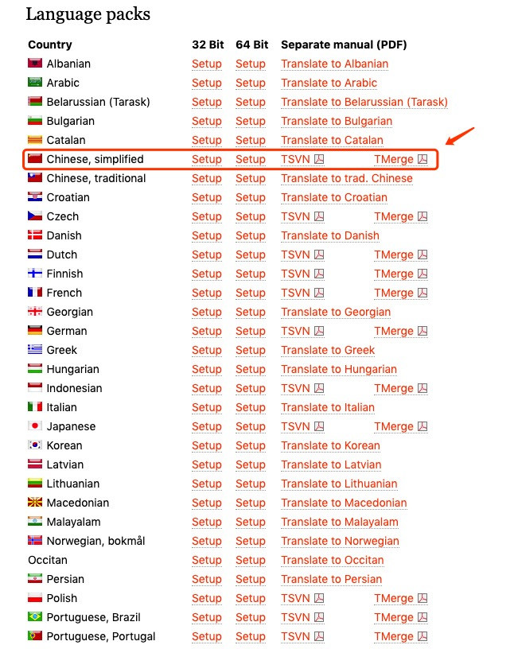

下载完成之后需要进行安装，切记，语言包安装好后一定要勾选应用才能正常使用，如下图所示：

安装完成之后我们就可以看到一个 “svn checkout” 的界面操作了，如图：

## 2. 配置

接下来，我们就需要配置源代码管理系统的服务器。我们需要找到公司配置的svn服务器 “url repository”，比如说有一个 “https://example.com” 的url版本库。我们只需要点击 “svn checkout（SVN 检出）”，然后会出现如下界面：

输入用户账号密码：

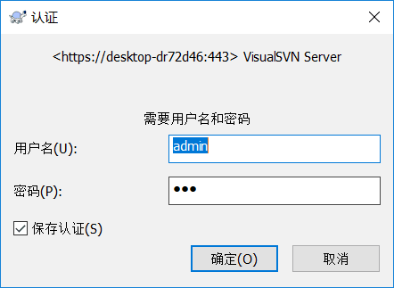

检出成功：

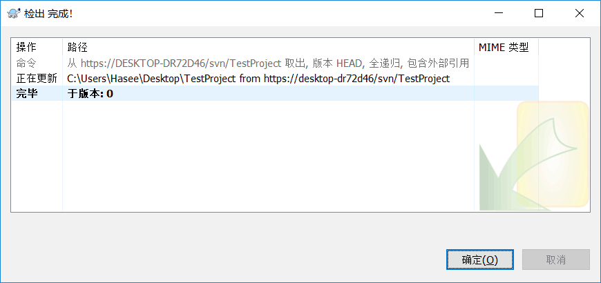

## 3. 使用

使用SVN版本控制，必须遵循4个原则：

- 新建文件前，获取最新的程序代码，新建文件后先提交文件，再进行详细开发或编辑。
- 尽量避免多人同时处理同一个文件（毕竟SVN不是那么优秀，无法只能将代码成功合并）。
- 项目成员提交程序前，必须获取最新的程序，编译且没有问题，再进行提交操作。
- 提交代码必须选择解决方案进行代码提交，请勿选择其中某项目进行提交。

## 4. 解决冲突

当你对文件做了修改之后，恰好你的组员也对相同文件做了修改，当你在提交的时候就会出现冲突，如下所示：

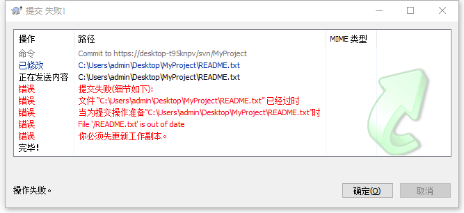

此时你应该先处理冲突才能继续提交，点击确定之后会出现如下页面，此时点击更新：

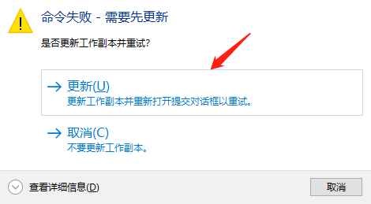

点击更新之后会弹框提示更新完成，并警告冲突状态：

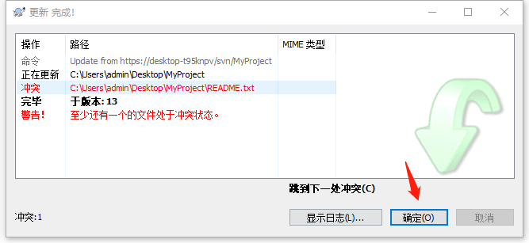

点击确定之后，会回到提交页面：

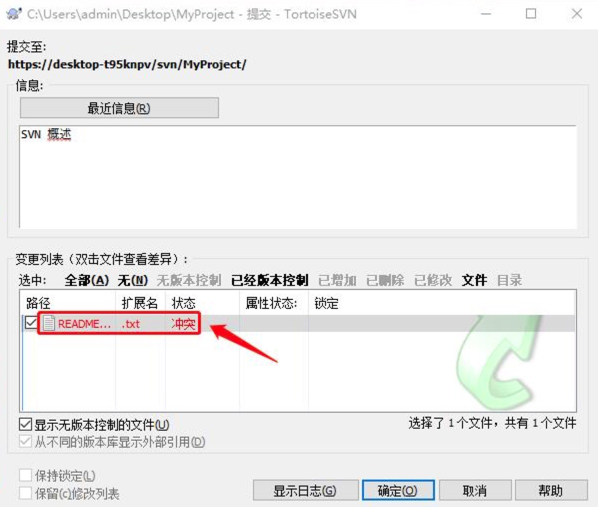

此时在变更列表中双击箭头所示冲突文件进行查看：

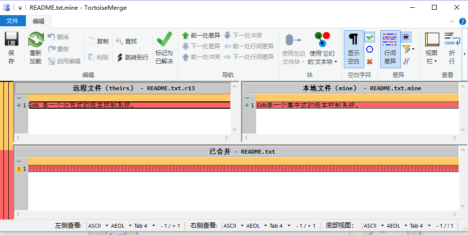

红色区域为冲突的地方，选择要保留的地方鼠标右键选择相应处理项即可：

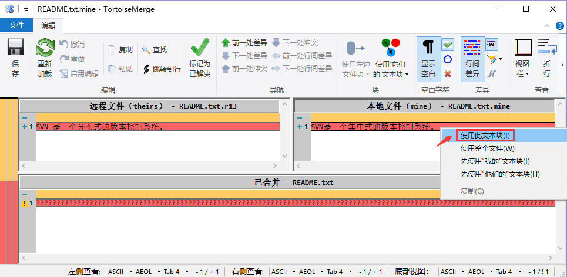

冲突处理完成之后会在已合并的框框中出现已合并之后的结果，此时Ctr+S保存文件出现如下提示框：

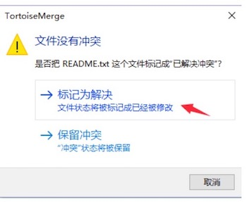

选择“标记为已解决”，然后回到提交页面再次点击确定按钮就可以完成提交：

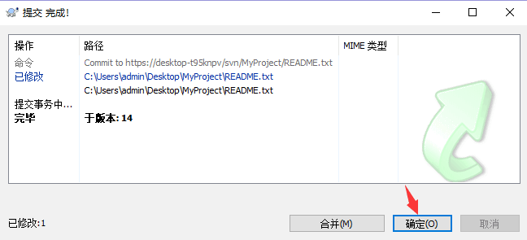

# 四、SVN 服务端

## 1. 下载安装

点击 [前往下载](http://subversion.apache.org/packages.html#windows) SVN服务端安装包，如下图所示：

然后根据版本下载对应的安装包：

点击 .exe 文件进行安装：

stips 1：

stips 2：

stips 3：默认选择即可，第一项是安装VisualSVN Server以及控制台，最后一项是自动加入环境变量，如下图所示：

stips 4：选择标准安装（免费）

stips 5：确认文件安装目录，以及代码库的位置（你的代码想要保存的位置），一旦这个位置的代码库文件被删除，可就无力回天了，如下图所示：

stips 6：安装即可

stips 7：确认，直接打开控制管理界面，如下图所示：

stips 8：安装结束，自动打开控制管理界面，如下图所示：

## 2. 配置

第一步：搭建SVN团队项目、在服务器上打开已安装的SVN服务端、新建一个项目文件夹、创建完成后右键项目复制项目URL地址，具体如下图：

第二步：创建SVN 用户及设置密码，如下图：

