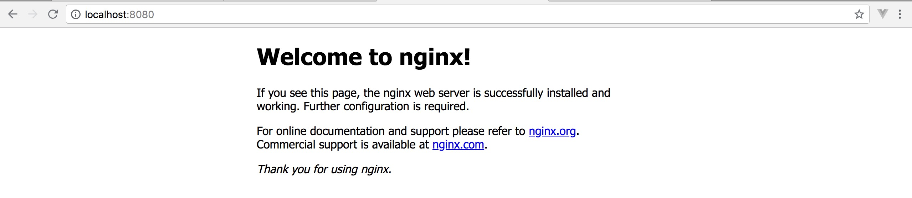
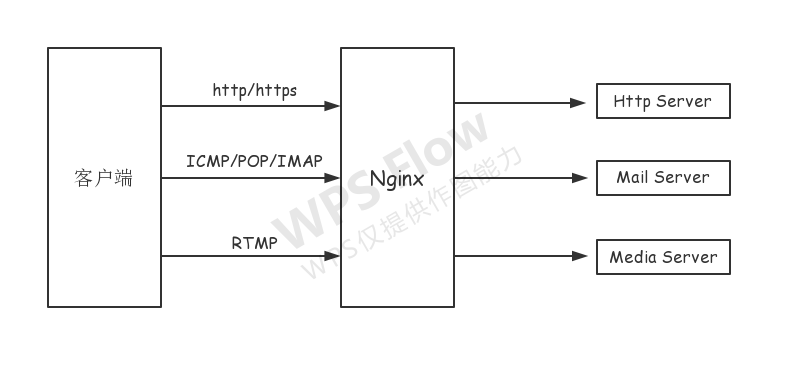

# 一、概述

Nginx是一款是由俄罗斯的程序设计师Igor Sysoev所开发高性能的 Web和 反向代理 服务器，也是一个 IMAP/POP3/SMTP 代理服务器。在高连接并发的情况下，Nginx是Apache服务器不错的替代品。

# 二、安装

## 1. macOS

```shell
$ brew install nginx
...
==> Pouring nginx-1.17.9.catalina.bottle.tar.gz
==> Caveats
Docroot is: /usr/local/var/www

The default port has been set in 【/usr/local/etc/nginx/nginx.conf】 to 8080 so that
nginx can run without sudo.

nginx will load all files in /usr/local/etc/nginx/servers/.

To have launchd start nginx now and restart at login:
  brew services start nginx
Or, if you don't want/need a background service you can just run:
  nginx
==> Summary
🍺  /usr/local/Cellar/nginx/1.17.9: 25 files, 2.1MB
...
$ nginx -v
nginx version: nginx/1.17.8
$ sudo nginx
```

浏览器输入：*localhost:8080* 如果出现如下页面，启动成功！



>  提示：8080是nginx自带的默认网站设置的端口

## 2. Windows

参考指南：http://nginx.org/en/docs/windows.html

# 三、配置文件

配置文件：/usr/local/etc/nginx/nginx.conf   & /usr/local/etc/nginx/nginx.conf.default

其中 ngin.conf.default 类似于备份文件，我们只需要配置 /usr/local/etc/nginx/nginx.conf 文件即可。

# 四、代理

什么是代理？比如我现在想吃一只炸鸡，但是我又不想自己出门去买，于是我就叫了个跑腿服务，让跑腿的去给我买，这里，跑腿的就成为了我的代理。

代理简单来说，就是如果我们想做什么，但又不想直接去做，那么这时候就找另外一个人帮我们去做。那么在这个例子里面，跑腿的就是专门做代理服务的。

Nginx 主要能够代理如下几种协议，其中用到的最多的就是做Http代理服务器。



## 1. 正向代理

举一个例子帮助大家理解正向代理，大家都知道，现在国内是访问不了 YouTube 的，那么怎么才能访问 YouTube 呢？我们又想，美国人不是能访问 YouTube 吗（这不废话，YouTube 就是美国的），如果我们电脑的对外公网 IP 地址能变成美国的 IP 地址，那不就可以访问 YouTube了？。VPN 就是这样产生的。我们在访问 YouTube 时，先连上 VPN 服务器将我们的 IP 地址变成美国的 IP 地址，然后就可以顺利的访问了。

这里的 VPN 就是做正向代理的。正向代理服务器位于客户端和服务器之间，为了向服务器获取数据，客户端要向代理服务器发送一个请求，并指定目标服务器，代理服务器将目标服务器返回的数据转交给客户端。这里客户端是要进行一些正向代理的设置的。

PS：VPN 通俗的讲就是一种中转服务，当我们电脑接入 VPN 后，我们对外 IP 地址就会变成 VPN 服务器的 公网 IP，我们请求或接受任何数据都会通过这个VPN 服务器然后传入到我们本机。这样做有什么好处呢？比如 VPN 游戏加速方面的原理，我们要玩网通区的 LOL，但是本机接入的是电信的宽带，玩网通区的会比较卡，这时候就利用 VPN 将电信网络变为网通网络，然后在玩网通区的LOL就不会卡了（注意：VPN 是不能增加带宽的，不要以为不卡了是因为网速提升了）。

## 2. 反向代理

反向代理和正向代理的区别就是：

- **正向代理代理客户端**：我们需要在客户端进行一些代理的设置
- **反向代理代理服务器：**作为客户端的我们是无法感知到服务器的真实存在的

反向代理，其实客户端对代理是无感知的，因为客户端不需要任何配置就可以访问，我们只需要将请求发送到反向代理服务器，由反向代理服务器去选择目标服务器获取数据后，再返回给客户端，此时反向代理服务器和目标服务器对外就是一个服务器，暴露的是代理服务器地址，隐藏了真实服务器IP地址。

# 五、Nginx 反向代理

示例：使用 nginx 反向代理 www.123.com 直接跳转到http://www.baidu.com。

## 1. 域名绑定

通过修改 hosts 文件，绑定域名，指令如下：

```shell
$ sudo vim /private/etc/hosts
```

按 `i` 进入编辑模式在最后一行添加如下代码：

```ini
127.0.0.1   www.123.com
```

按 `esc` 退出编辑模式，然后输入 `:wq!` 保存退出即可，到这里就完成了域名绑定，将“www.123.com” 映射到 “127.0.0.1”。

接下来我们需要在终端  ping 一下这个域名，如果访问的 ip 是 “127.0.0.1” 就说明域名映射成功，如下所示：

```shell
$ ping www.123.com
PING lihy.com (127.0.0.1): 56 data bytes
64 bytes from 127.0.0.1: icmp_seq=0 ttl=64 time=0.040 ms
64 bytes from 127.0.0.1: icmp_seq=1 ttl=64 time=0.061 ms
64 bytes from 127.0.0.1: icmp_seq=2 ttl=64 time=0.094 ms
64 bytes from 127.0.0.1: icmp_seq=3 ttl=64 time=0.108 ms
...
```

## 2. 转发

域名绑定成功之后，我们在浏览器输入 “http://www.123.com” 访问，出现“404 Not Found”，接下来我们在nginx 配置文件中修改代码如下：

```ini
server {
    listen 80;
    server_name www.123.com;
    location / {   
        # 把请求转发到百度
        proxy_pass  https://www.baidu.com;
    }
}
```

如上配置，我们监听80端口，访问域名为 www.123.com，不加端口号时默认为80端口，故访问该域名时会跳转到 https://www.baidu.com 路径上。

保存配置文件并重启nginx：

```shell
$ sudo nginx -s reload
```

回到浏览器，重新访问 “http://www.123.com"，即可看到百度页面。

如果要映射本地网站路径，修改如下：

```ini
server {
    listen 80;
    server_name www.123.com;
    location / {   
        #本地网站文件夹路径
        root   /Users/lihongyao/WebSites;
        #设置默认网页
        index  index.html index.htm;
    }
}
```

## 3. 代理服务器

客户端：http://127.0.0.1:5500

```js
fetch('/api/infos')
.then(response => response.json())
.then(data => {
    console.log(data);
})
```

服务端：http://127.0.0.1:3000

```js
// => 导入模块
const Koa = require('koa'); 
const router = require('./router');
const app = new Koa();

// => 处理路由
router.get('/api/infos', async (ctx) => {
	ctx.body = JSON.stringify({
		name: 'Muzili',
		tel: '17398888669'
	})
});
app.use(router.routes()).use(router.allowedMethods());

// => 监听
app.listen(3000, () => {
	console.log('server running at http://localhost:3000');
});
```

Nginx 配置文件

```ini
http {
    listen 80;
    server_name  www.123.com;
    server {
        location / {
            proxy_pass  http://127.0.0.1:5500;
            # 兼容websocket
            proxy_http_version 1.1;
            proxy_set_header Upgrade $http_upgrade;
            proxy_set_header Connection "upgrade";
        }
        location /api/ {
           proxy_pass http://localhost:3000;
        }
    }
}
```

# 六、负载均衡

Lvs 与 nginx 区别

# 七、二级目录部署

## 1. 部署多页项目

在部署项目过程中，一个域名下可能会部署多个项目，比如在根目录中有个 /test 项目，配置如下：

```ini
location /test {
    alias  /usr/local/etc/nginx/servers/test;
    index  index.html index.htm;
}
```

# 2. 部署React单页项目

**nginx 配置：**

```ini
location /pre-dtree-h5 {
  alias   /usr/local/etc/nginx/servers/pre-dtree-h5/;
  index  index.html index.htm;
  try_files $uri $uri/ /pre-dtree-h5/index.html;
}
```

**react 项目配置：**

首先在package.json中添加：`"homepage":"/pre-dtree-h5"`

然后在react路由中配置basename属性，如下所示：

```jsx
<Router basename="/pre-dtree-h5">
  <div className="App">
    {/* 路由配置 */}
    <Switch>
    	{renderRoutes(routes)}
    </Switch>
  </div>
</Router>
```

> 提示：`pre-dtree-h5` 为项目名称，你可以替换成你自己的。

# 八、异常处理

**# 48: Address already in use**

**\> 原因：**

80端口已被占用(可能因为未成功关闭一些服务,如nginx服务等)

**\> 解决：**

1. sudo nginx -s stop(或者:sudo nginx -s quit)，然后重新启动(sudo nginx)。
2. 如果是其他服务占用端口，则关闭其他服务，或者修改nginx配置文件中的端口。

# 九、常用指令

| 指令              | 描述               |
| ----------------- | ------------------ |
| `ngin`            | 启动               |
| `nginx -s quit`   | 退出               |
| `nginx -s reload` | 重载               |
| `nginx -t`        | 测试nginx.conf配置 |


 


