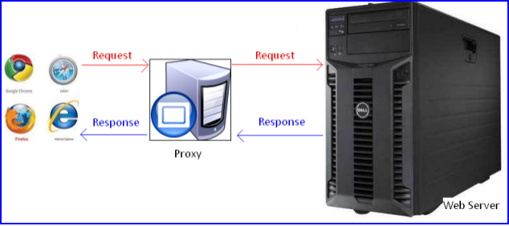
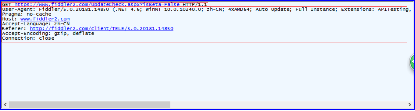
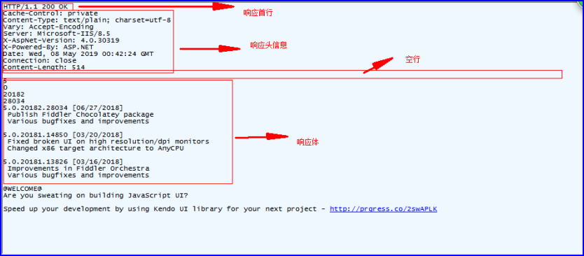

# 一、Http 概述

(1) HTTP是Hyper Text Transfer Protocol（超文本传输协议）的缩写。

(2) 它的发展是万维网协会（World Wide Web Consortium）和Internet工作小组IETF（Internet Engineering Task Force）合作的结果。

(3) HTTP协议是用于从WWW服务器传输超文本（网页）到本地浏览器的传送协议。它可以使浏览器更加高效，使网络传输减少。

(4) HTTP是一个应用层协议，由请求和响应构成，是一个标准的客户端服务器模型。

(5) HTTP是一个无状态的协议，同一个客户端的这次请求和上次请求是没有对应关系，对http服务器来说，它并不知道这两个请求来自同一个客户端。 为了解决这个问题， Web程序引入了Cookie/session/websocket等来解决。

(6) 默认HTTP的端口号为80，HTTPS（更安全的http协议）的端口号为443。

**-> 本质：**

HTTP就是一个通信规则，规定了客户端发送给服务器的内容格式，规定了客户端发送给服务器的内容格式。

其实我们要学习的就是这两个格式!客户端发给服务器的格式叫「请求报文格式」；服务器发给客户端的格式叫「响应报文格式」。

# 二、Http协议在TCP/IP协议栈中的位置

HTTP是一个基于TCP/IP通信协议来传递数据（HTML 文件, 图片文件, 查询结果等）。

HTTP协议通常承载于TCP协议之上，有时也承载于TLS或SSL协议层之上，这个时候，就成了我们常说的HTTPS。如下图所示：


# 三、Http 请求响应模型

HTTP协议永远都是客户端发起请求，服务器回送响应。见下图：


这样就限制了使用HTTP协议，无法实现在客户端没有发起请求的时候，服务器将消息推送给客户端。

# 四、Http 特点

- **无状态协议**：就是说每次HTTP请求都是独立的，任何两个请求之间没有什么必然的联系。但是在实际应用当中并不是完全这样的，引入了Cookie和Session机制来关联请求。
- **应用层协议**：由请求和响应构成，是一个标准的客户端服务器模型
- **多次HTTP请求**：在客户端请求网页时多数情况下并不是一次请求就能成功的，服务端首先是响应HTML页面，然后浏览器收到响应之后发现HTML页面还引用了其他的资源，例如，CSS，JS文件，图片等等，还会自动发送HTTP请求这些需要的资源。现在的HTTP版本支持管道机制，可以同时请求和响应多个请求，大大提高了效率。
- **基于TCP**：HTTP协议目的是规定客户端和服务端数据传输的格式和数据交互行为，并不负责数据传输的细节。底层是基于TCP实现的。现在使用的版本当中是默认持久连接的，也就是多次HTTP请求使用一个TCP连接。

# 五、Http 工作流程

## 1. 服务器 -- 客户端

一次HTTP操作称为一个事务，其工作过程可分为四步：

1. 首先客户端与服务器需要 `建立连接` 。只要单击某个超链接，HTTP的工作就开始啦。


2. 建立连接后，客户端发送一个 `请求` 给服务器，请求方式的格式为：统一资源标识符（URL）、协议版本号，后边是MIME信息包括请求修饰符、客户端信息和可能的内容。


3. 服务器接到请求后，给予相应的 `响应` 信息，其格式为一个状态行，包括信息的协议版本号、一个成功或错误的代码，后边是MIME信息包括服务器信息、实体信息和可能的内容。
4. 客户端接收服务器所返回的信息通过浏览器显示在用户的 `显示` 屏上，然后客户端与服务器断开连接。

> 建立连接 -> 客户端发送请求 -> 服务器响应请求 -> 渲染

如果在以上过程中的某一步出现错误，那么产生错误的信息将返回到客户端，由显示屏输出。对于用户来说，这些过程是由HTTP自己完成的，用户只要用鼠标点击，等待信息显示就可以了。

## 2. 服务器 -- 代理 -- 客户端

我们的请求有可能是经过了代理服务器，最后才到达Web服务器的。过程如下图所示：



## 3. 代理服务器的作用

代理服务器就是网络信息的中转站，有什么功能呢？

1. 提高访问速度， 大多数的代理服务器都有缓存功能。
2. 突破限制， 也就是FQ了
3. 隐藏身份。

# 六、URL详解

## 1. 说明

URL(Uniform Resource Locator) 地址用于描述一个网络上的资源，基本格式如下：

```
schema://host[:port#]/path/.../[?query-string][#anchor]
```

- schema：指定低层使用的协议(例如：http, https, ftp)
- host：HTTP服务器的IP地址或者域名
- port：Http服务器的默认端口是80，这种情况下端口号可以省略。如果使用了别的端口，必须指明
- path：访问资源的路径
- query-string：发送给Http服务器的数据
- anchor：锚

## 2. 示例

```js
"http://127.0.0.1:8081/weather?city=chengdu&date=2019-10-01#stuff"
```

- schema：http
- host：127.0.0.1
- port：8081
- path：/weather
- query-string：city=chengdu&date=2019-10-01
- anchor：stuff

# 七、Http 报文

有两种HTTP报文的类型，请求与响应，每种都有其特定的格式。

## 1. 请求报文（客户端发向服务端）

### 1.1. 说明

请求报文的格式如下：

```
请求行：请求方式 请求路径 协议和版本，例如：GET /index.html HTTP/1.1
请求头（消息报头）：请求头名称:请求头内容，即为key:value格式，例如：Host:localhost
空行：用来与请求体分隔开
请求体（请求正文）：GET没有请求体，只有POST有请求体。
```

浏览器发送给服务器的内容就这个格式的，如果不是这个格式服务器将无法解读。

### 1.2. 示例

**-> GET请求数据包**



**-> POST请求数据包**

多个了个空行和请求体


## 2. 响应报文（服务端发向客户端）

### 2.1. 说明

响应报文格式如下：

```
响应行（状态行）：响应协议和版本，状态码 状态消息 例如： HTTP/1.1 200 OK
响应头：响应头名称:响应头内容，即为key:value格式，例如：Connection:keep-alive
空行：用来与响应体分隔开
响应体（响应正文）：响应的内容
```

### 2.2. 示例

相应数据包




# 八、请求方法

根据HTTP标准，HTTP请求可以使用多种请求方法。

HTTP1.0定义了三种请求方法： GET, POST 和 HEAD方法。

HTTP1.1新增了五种请求方法：OPTIONS, PUT, DELETE, TRACE 和 CONNECT 方法。

| 方法    | 描述                                                         |
| ------- | ------------------------------------------------------------ |
| GET     | 请求指定的页面信息，并返回实体主体。                         |
| HEAD    | 类似于get请求，只不过返回的响应中没有具体的内容，用于获取报头 |
| POST    | 向指定资源提交数据进行处理请求（例如提交表单或者上传文件）。数据被包含在请求体中。POST请求可能会导致新的资源的建立和/或已有资源的修改。 |
| PUT     | 从客户端向服务器传送的数据取代指定的文档的内容。             |
| DELETE  | 请求服务器删除指定的页面。                                   |
| CONNECT | HTTP/1.1协议中预留给能够将连接改为管道方式的代理服务器。     |
| OPTIONS | 允许客户端查看服务器的性能。                                 |
| TRACE   | 回显服务器收到的请求，主要用于测试或诊断。                   |

# 九、状态码

## 1. 状态码是什么？

状态码用来告诉HTTP客户端，HTTP服务器是否产生了预期的Response.
HTTP/1.1中定义了5类状态码， HTTP状态码由三个十进制数字组成，第一个十进制数字定义了状态码的类型，后两个数字没有分类的作用。

当浏览者访问一个网页时，浏览者的浏览器会向网页所在服务器发出请求。当浏览器接收并显示网页前，此网页所在的服务器会返回一个包含HTTP状态码的信息头（server header）用以响应浏览器的请求。

## 2. 状态码类型

| 分类   | 分类描述                    |
| ---- | ----------------------- |
| 1xx | 提示信息\表示请求正在处理 |
| 2xx | 成功\表示请求正常处理完毕         |
| 3xx | 重定向\要完成请求必须进行更进一步的处理     |
| 4xx | 客户端错误\请求有语法错误或请求无法实现 |
| 5xx | 服务器端错误\服务器处理请求出错 |

## 3. 常见状态码

| 状态码      | 说明                                                         |
| ----------- | ------------------------------------------------------------ |
| 200         | **(请求成功)**浏览器会把响应体内容（通常是html）显示在浏览器中。 |
| 404         | (**客户端问题**)请求的资源没有找到，说明客户端错误的请求了不存在的资源。 |
| 500         | (**服务端问题**)请求资源找到了，但服务器内部发生了不可预期的错误。 |
| 301/302/303 | (**网站搬家了**，**跳转**)重定向                             |
| 304         | **(Not Modified)**代表上次的文档已经被缓存了,还可以继续使用. |

如果你不想使用本地缓存可以用Ctrl+F5 强制刷新页面，或者清除本地缓存。

## 4. 次一级常见状态码

204 **No content**：服务端返回的仅有状态行和响应头。不含响应主体


# 十一、content-type

Content-Type，内容类型，一般是指网页中存在的Content-Type，用于定义网络文件的类型和网页的编码，决定浏览器将以什么形式、什么编码读取这个文件，这就是经常看到一些Asp网页点击的结果却是下载到的一个文件或一张图片的原因。

5