# # 概述

## 1. GraphQL 是什么？

GraphQL是Facebook2015年开源的数据查询规范。现今的绝大多数Web Service都是RESTful的，也就是说，客户端和服务端的主要沟通模式还是靠客户端根据自己的需要向服务端的若干个*Endpoint (url)* 发起请求。

由于功能的日渐丰富，对Web Application的要求变得复杂，REST的一些问题逐渐暴露，人们开始思考如何应对这些问题。GraphQL便是具有代表性的一种。GraphQL这个名字，Graph + Query Language，就表明了它的设计初衷是想要用类似图的方式表示数据：即不像在REST中，数据被各个API 所分割，而是有关联和层次结构的被组织在一起。

直接地说：

**GraphQL是API查询语言，类似于数据库中的SQL。**

不同的是sql查询的是数据库，而GraphQL查询的是数据源，这个数据源可以是HTTP接口、数据库查询集合、静态json文件、另外一个api的数据源，特别的灵活。

## 2. 官网

- <http://graphql.cn/code/>
- http://graphql.cn/graphql-js/

## 3. 作用？

GraphQL作为RESTful的一种辅助工具，为解决restfulAPI的一些问题而诞生。

## 4. RESTful API 缺点

\1. 前端和后端对于接口的控制权是交叉冲突的，往往一方改动不算，前端改动一个字段，连带着后端也需要改动，反之亦是。

\2. 前端对于真正用到的字段是没有直观映像的，仅仅通过url地址，无法预测也无法回忆返回的字段数目和字段是否有效，接口返回50个字段，但却只用5个字段，造成字段冗余，扩展性差，单个RESTful接口返回数据越来越臃肿。

\3. API聚合问题，某个前端展现，实际需要调用多个独立的RESTful API才能获取到足够的数据。

\4. 前后端字段频繁改动，导致类型不一致，错误的数据类型可能会导致网站出错

\5. 尤其是在业务多变的场景中，很难在保证工程质量的同时快速满足业务需求

## 5. RESTful API 缺点案例

**-> 案例1**

比如获取用户信息 /users/:id ，最初可能只有id、昵称，但随着需求的变化，用户所包含的字段可能会越来越多，年龄、性别、头像、经验、等级，等等等等。而具体到某个前端页面，可能只需要其中一小部分数据，这样就会增加网络传输量，前端获取了大量不必要的数据。

**-> 案例2**

比如一个文章详情页，最初可能只需要文章内容，那么前端就调用 /articles/:aid 获取到文章内容来展现就行了。但随着需求的演进，产品可能会希望加上作者信息（昵称、头像等），这时前端又需要在获取文章详情后，根据其中的作者id字段继续获取作者相关的信息，/user/:uid。然后，需求又变化了，产品希望在加上这篇文章的评论，这时前端需要继续调用 /comment/:aid 来拉取评论列表。

**-> 案例2**

在App上遇到的问题。对于Web前端而言，由于ajax技术的存在，这种请求数据方式，也就开发上稍微麻烦些，并不会造成太大的问题；但对于App来说，渲染的方式不同，必须要拉取的全部的数据之后，才能绘制界面，就会导致这个界面必须要等到所有RESTful接口的返回数据都拿到，才能进行绘制。

# # GraphQL基本示例

## 1. 安装 

```shell
$ npm i -S express express-graphql graphql 
```

## 2. 服务端

```js
// 1. 变量
const express = require("express");
const graphqlHTTP = require("express-graphql");
const { buildSchema } = require("graphql");
const app = express();

// 2. 使用 GraphQL Schema Language 创建一个 schema
const schema = buildSchema(`
  type Query {
    hello: String
  }
`);
// 3. root 提供所有 API 入口端点相应的解析器函数
const root = {
  hello: () => {
    return 'Hello world!';
  },
};


// 4. 处理路由
app.use('/graphql', graphqlHTTP({
  schema: schema,
  rootValue: root,
  graphiql: true,
}));

// 5. 监听窗口
app.listen(4000, "0.0.0.0");

console.log('Running a GraphQL API server at localhost:4000/graphql'); 
```

## 3. 基本演示

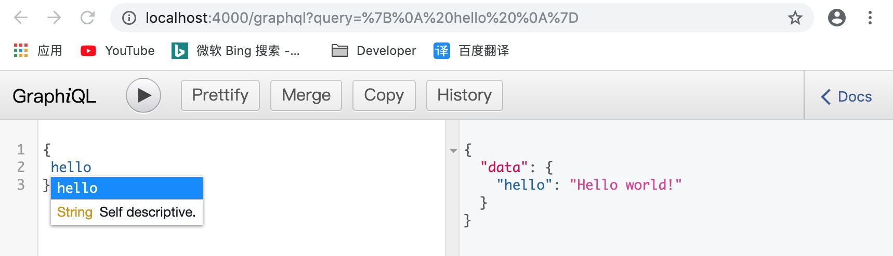

## 4. 前端访问

```js
fetch("http://localhost:4000/graphql", {
	method: "POST",
	headers: {
		"Content-Type": "application/json",
		"Accept": "application/json"
	},
	body: JSON.stringify({query: "{hello}"})
}).then(
  res => res.json()
).then(data => {
	console.log(data);
})
```

## 5. 运行结果

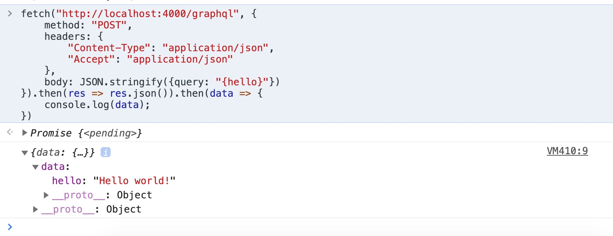

# # GraphQL 基本类型

## 1. 基本说明

大多数情况下，你所需要做的只是使用GraphQL schema language 指定你的 API 需要的类型，然后作为参数传给 buildSchema 函数。

GraphQL schema language 支持的标量类型有 `String`、`Int`、`Float`、`Boolean` 和 `ID`，因此你可以在传给 `buildSchema` 的 schema 中直接使用这些类型。

默认情况下，每个类型都是可以为空的 —— 意味着所有的标量类型都可以返回 `null`。使用感叹号可以标记一个类型不可为空，如 `String!` 表示非空字符串。

如果是列表类型，使用方括号将对应类型包起来，如 `[Int]` 就表示一个整数列表。

这些类型都直接映射 JavaScript，所以你可以直接返回原本包含这些类型的原生 JavaScript 对象。

## 2. 示例

下面是一个展示如何使用这些基本类型的示例：

```js
// 1. 变量
const express = require("express");
const graphqlHTTP = require("express-graphql");
const { buildSchema } = require("graphql");
const app = express();


// 2. 使用 GraphQL Schema Language 创建一个 schema
const schema = buildSchema(`
  type Query {
    message: String,
    nums: [Int],
    state: Boolean!
  }
`);
// 3. root 提供所有 API 入口端点相应的解析器函数
const root = {
    message: () => {
        return "Hello world!";
    },
    nums: () => {
        return [1, 2, 3, 4]
    },
    state: () => {
        return true;
    }
};


// 4. 处理路由
app.use('/graphql', graphqlHTTP({
    schema: schema,
    rootValue: root,
    graphiql: true,
}));

// 5. 监听窗口
app.listen(4000, "0.0.0.0");

console.log('Running a GraphQL API server at localhost:4000/graphql');
```

## 3. 请求

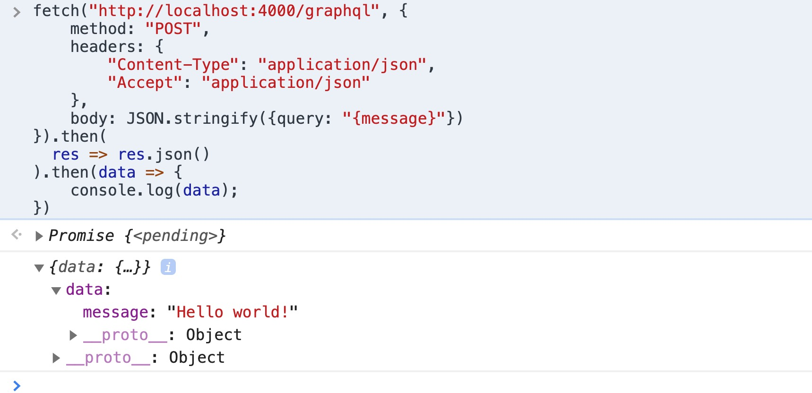

# # GraphQL 返回对象

如果要返回一个对象，那么我们先要定义一个我们要返回的对象类型才行。

## 1. 后端代码

```js
// 1. 变量
const express = require("express");
const graphqlHTTP = require("express-graphql");
const { buildSchema } = require("graphql");
const app = express();
// 2. 使用 GraphQL Schema Language 创建一个 schema
const schema = buildSchema(`
  type User {
      name: String!,
      gender: String
      age: Int,
      hobby: [String]
  },
  type Query {
      users: [User]
  }
`);
// 3. root 提供所有 API 入口端点相应的解析器函数
const root = {
    users: () => {
        return [
            {
                name: "木子李",
                gender: "男",
                age: 26,
                hobby: ["吉他", "烹饪", "旅行"]
            },
            {
                name: "玉梅儿",
                gender: "女",
                age: 21,
                hobby: ["遛狗", "美甲"]
            }
        ]
    }
};


// 4. 处理路由
app.use('/graphql', graphqlHTTP({
    schema: schema,
    rootValue: root,
    graphiql: true,
}));

// 5. 监听窗口
app.listen(4000, "0.0.0.0");

console.log('Running a GraphQL API server at localhost:4000/graphql');
```

## 2. 前端代码

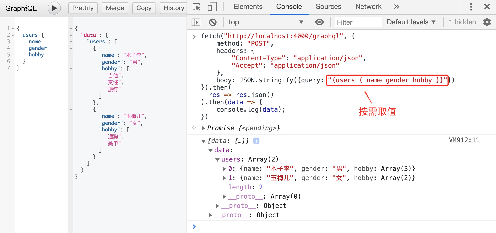

> 提示：在获取数据时，你想获取那些数据，就可以只传入那些相关的字段。

## 3. 返回Class实例

```js
// 1. 变量
const express = require("express");
const graphqlHTTP = require("express-graphql");
const { buildSchema } = require("graphql");
const app = express();
// 2. 使用 GraphQL Schema Language 创建一个 schema
const schema = buildSchema(`
  type User {
      name: String!,
      gender: String
      age: Int,
      hobby: [String]
  },
  type Query {
      users: [User]
  }
`);
// 3. 定义User类
class User {
    constructor(name, gender, age, hobby) {
        this.name = name;
        this.gender = gender;
        this.age = age;
        this.hobby = hobby;
    }
}
// 4. root 提供所有 API 入口端点相应的解析器函数
const root = {
    users: () => {
        return [
            new User("木子李", "男", 26, ["吉他", "烹饪", "旅行"]),
            new User("玉梅儿", "女", 21, ["遛狗", "美甲"])
        ]
    }
};


// 5. 处理路由
app.use('/graphql', graphqlHTTP({
    schema: schema,
    rootValue: root,
    graphiql: true,
}));

// 6. 监听窗口
app.listen(4000, "0.0.0.0");

console.log('Running a GraphQL API server at localhost:4000/graphql');

```

运行效果：


# # GraphQL 参数传递

就像REST API 一样，可以在GraphQL API 中，在前端发起请求时传入参数，在后端schema language 中定义参数，并自动进行类型检查。每一个参数必须有名字和数据类型。

## 1. 后端代码

```js
// 1. 变量
const express = require("express");
const graphqlHTTP = require("express-graphql");
const { buildSchema } = require("graphql");
const app = express();
// 2. 使用 GraphQL Schema Language 创建一个 schema
const schema = buildSchema(`
  type Query {
     login(username:String!, password:String!): String
  }
`);
// 3. root 提供所有 API 入口端点相应的解析器函数
const root = {
    login: ({username, password}) => { // 使用ES6语法解构参数
        if (username == "admin" && password == "123") {
            return "登录成功！";
        } else {
            return "登录失败！";
        }
    }
};
// 4. 处理路由
app.use('/graphql', graphqlHTTP({
    schema: schema,
    rootValue: root,
    graphiql: true,
}));

// 5. 监听窗口
app.listen(4000, "0.0.0.0");

console.log('Running a GraphQL API server at localhost:4000/graphql');

```

## 2. 前端代码

```js
fetch("http://localhost:4000/graphql", {
    method: "POST",
    headers: {
        "Content-Type": "application/json",
        "Accept": "application/json"
    },
    body: JSON.stringify({
        query: '{login(username:"admin",password:"123")}'
    })
}).then(
    res => res.json()
).then(data => {
    console.log(data);
})
```

运行效果：

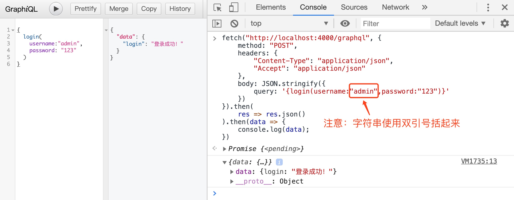

## 3. 修改前端代码

使用 \$usr和 $psw作为GraphQL 中的变量，我们无需在客户端对它们进行转义。通过基础类型和参数传递，你可以定义任意你"能够"在 REST API 中定义的内容。

```js
let usr = "admin", psw = "123";
let query = `query login($usr: String!, $psw: String!) {
  login(username: $usr, password: $psw)
}`;
fetch("/graphql", {
    method: "POST",
    headers: {
        "Content-Type": "application/json",
        "Accept": "application/json",
    },
    body: JSON.stringify({
        query,
        variables: { usr, psw },
    })
}).then(
	res => res.json()
).then(
	data => console.log(data)
);
```

效果延时：

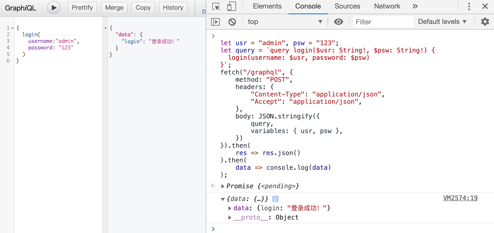

# # GraphQL 修改数据

在GraphQL 中，对于修改数据的入口端点不再是Query而是 Mutation。

## 1. 后端代码

```js
// 1. 变量
const express = require("express");
const graphqlHTTP = require("express-graphql");
const { buildSchema } = require("graphql");
const app = express();
// 2. 使用 GraphQL Schema Language 创建一个 schema
const schema = buildSchema(`
  type Mutation {
      setMessage(message:String!): String
  }
  type Query {
     message: String
  }
`);
// 3. root 提供所有 API 入口端点相应的解析器函数
let info = {};
const root = {
    setMessage: ({message}) => {
        info.message = message;
    },
    message: () => {
        return info.message;
    }
};
// 4. 处理路由
app.use("/graphql", graphqlHTTP({
    schema: schema,
    rootValue: root,
    graphiql: true,
}));

// 5. 监听窗口
app.listen(4000, "0.0.0.0");

console.log("Running a GraphQL API server at localhost:4000/graphql");
```

## 2. 前端代码-> 1

```js
let query = `mutation {
	setMessage(message:"Hello, GraphQL!")
}`;
fetch("/graphql", {
    method: "POST",
    headers: {
        "Content-Type": "application/json",
        "Accept": "application/json",
    },
    body: JSON.stringify({
        query
    })
}).then(
	res => res.json()
).then(
	data => console.log(data)
);
```

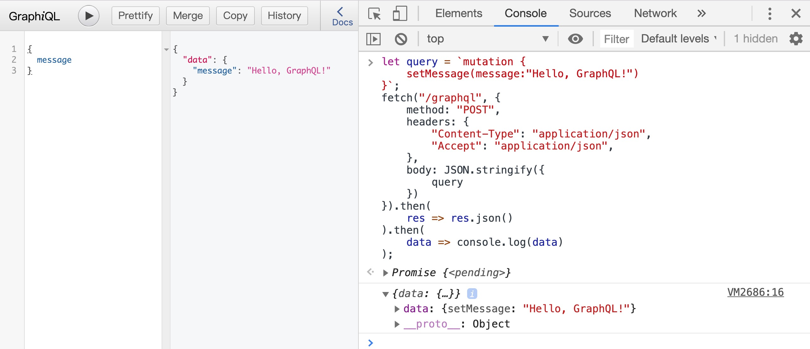

## 3. 前端代码-> 2

```js
let msg = "Hello, GraphQL!";
let query = `mutation setMessage($msg: String!) {
	setMessage(message:$msg)
}`
fetch("/graphql", {
    method: "POST",
    headers: {
        "Content-Type": "application/json",
        "Accept": "application/json",
    },
    body: JSON.stringify({
        query,
		variables: {msg}
    })
}).then(
	res => res.json()
).then(
	data => console.log(data)
);
```

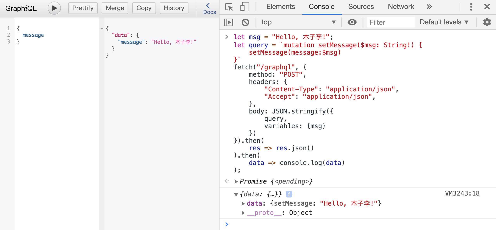

# # GraphQL 添加数据

添加数据也是使用mutation类型，如下

## 1. 后端代码

```js
// 1. 变量
const express = require("express");
const graphqlHTTP = require("express-graphql");
const { buildSchema } = require("graphql");
const app = express();
// 2. 使用 GraphQL Schema Language 创建一个 schema
const schema = buildSchema(`
  type User {
      name: String!,
      tel: String!,
      age: Int!
  }
  type Mutation {
      addUser(name:String!, tel:String!, age:Int!): [User]
  }
  type Query {
    getUsers:[User]
  }
`);
// 3. root 提供所有 API 入口端点相应的解析器函数
let users = [
    {name:"木子李", tel: "13798888669", age: 26},
    {name:"玉梅儿", tel: "19961391314", age: 21}
];
const root = {
    addUser: ({name, tel, age}) => {
        users.push({name, tel, age});
        return users;
    },
    getUsers: () => {
        return users;
    }
};
// 4. 处理路由
app.use("/graphql", graphqlHTTP({
    schema: schema,
    rootValue: root,
    graphiql: true,
}));

// 5. 监听窗口
app.listen(4000, "0.0.0.0");

console.log("Running a GraphQL API server at localhost:4000/graphql");
```

## 2. 前端代码

```js
let user = { name: "李鸿耀", tel: "15228885771", age: 26 };
let query = `
	mutation addUser($name:String!, $tel:String!, $age:Int!){
	addUser(name:$name, tel:$tel, age:$age) {name tel age}
}`;
fetch("/graphql", {
	method: "POST",
	headers: {
		"Content-Type":"application/json",
		"Accept": "application/json"
	},
	body: JSON.stringify({
		query,
		variables: {...user}
	})
}).then(res => res.json()).then(data => {
	console.log(data);
})
```


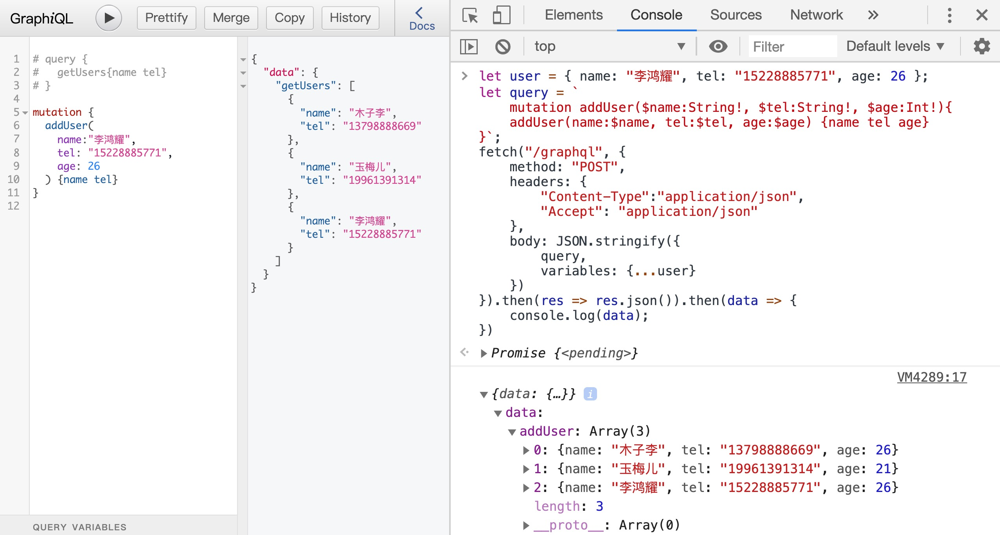

# # 定义输入类型

为了让前端直接传一个对象参数过来。

## 1. 概述

在有些时候前端会执行大批量的数据添加，比如对于一些ERP等系统，企业员工完善自己的信息时可能会填写许多的数据（姓名，年龄，性别，入职时间，地址，工作岗位...）这个时候，如果我们直接批量的往后端发，然后后端就需要在mutation中的相关方法中写许多的参数，这是非常不科学的。如下所示：

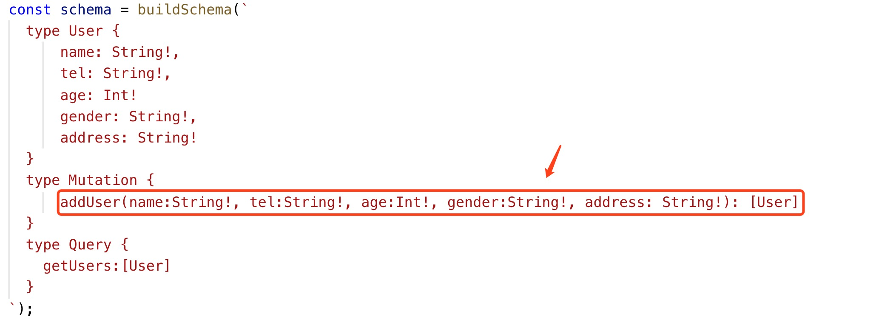

这时候我们就可以使用输入类型了，所谓的输入类型就是定义一个类型，然后把这一系列的数据当中其类型字段进行定义。（类似与es6的class）,定义了输入类型后，我们在后端就可以直接使用输入类型来代替所有参数，如下：


> 注意：输入类型的字段不能是其他对象类型，只能是基础标量类型、列表类型或者其他输入类型。

## 2. 后端代码

```js
// 1. 变量
const express = require("express");
const graphqlHTTP = require("express-graphql");
const { buildSchema } = require("graphql");
const app = express();
// 2. 使用 GraphQL Schema Language 创建一个 schema
const schema = buildSchema(`
  input UserInput {
      name: String!,
      tel: String!,
      age: Int!
      gender: String!,
      address: String!
  }
  type User {
      name: String!,
      tel: String!,
      age: Int!
      gender: String!,
      address: String!
  }
  type Mutation {
      addUser(user: UserInput): String
  }
  type Query {
    getUsers:[User]
  }
`);
// 3. root 提供所有 API 入口端点相应的解析器函数
let users = [
    { name: "木子李", tel: "13798888669", age: 26, gender: "男", address: "成都市" },
    { name: "玉梅儿", tel: "19961391314", age: 21, gender: "女", address: "广元市" }
];
const root = {
    addUser: ({ user }) => {
        users.push(user);
        return "添加成功";
    },
    getUsers: () => {
        return users;
    }
};
// 4. 处理路由
app.use("/graphql", graphqlHTTP({
    schema: schema,
    rootValue: root,
    graphiql: true,
}));

// 5. 监听窗口
app.listen(4000, "0.0.0.0");

console.log("Running a GraphQL API server at localhost:4000/graphql");
```

## 3. 前端代码

```js
let user = {
	name:"李鸿耀",
	tel:"15228885771",
    age:26,
    gender:"男",
    address:"成都市"
};
let query = `
	mutation addUser($user: UserInput){
	addUser(user: $user)
}`;
fetch("/graphql", {
	method: "POST",
	headers: {
		"Content-Type":"application/json",
		"Accept": "application/json"
	},
	body: JSON.stringify({
		query,
		variables: {user}
	})
}).then(res => res.json()).then(data => {
	console.log(data);
})
```

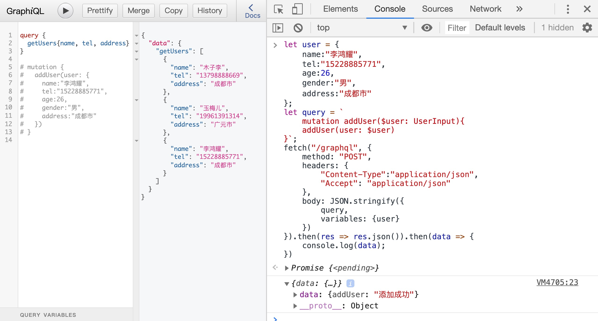

# # 获取 schema 细节

GraphQL是可自省的，也就是说你可以通过查询一个GraphQL知道它自己的schema细节。

## 1. 查询所有类型细节

查询__schema以列出所有该schema中定义的类型，并获取每一个的细节：

```js
query {
  __schema {
    types {
      name
      kind
      description
      fields {
        name
      }
    }
  }
}
```

## 2. 查询任意类型细节

查询__type以获取任意类型的细节：

```js
query {
  __type(name:"Query") {
      name
      kind
      description
      fields {
        name
      }
    }
}
```

> 提示：自省查询可能是你在GraphQL中唯一的GET请求。不管是query还是mutation，如果你要传递请求体，GraphQL请求方式都应该是POST

# # 组合查询

我们可以类似于REST那样发起多个同时发起多个请求

## 1. 后端代码（定义多个请求）

```js
// 1. 变量
const express = require("express");
const graphqlHTTP = require("express-graphql");
const { buildSchema } = require("graphql");
const app = express();
// 2. 使用 GraphQL Schema Language 创建一个 schema
const schema = buildSchema(`
  type Query {
    getAge: Int
    getJob: String,
    getAddr: String,
    getName: String,
  }
`);
// 3. root 提供所有 API 入口端点相应的解析器函数
const root = {
    getAge : () => 26,
    getJob : () => "前端开发工程师",
    getAddr: () => "四川省成都市高新区",
    getName: () => "李鸿耀"
};
// 4. 处理路由
app.use("/graphql", graphqlHTTP({
    schema: schema,
    rootValue: root,
    graphiql: true,
}));

// 5. 监听窗口
app.listen(4000, "0.0.0.0");

console.log("Running a GraphQL API server at localhost:4000/graphql");
```


## 2. 前端代码

```js
let query = `{
  getName
  getAge
  getJob
  getAddr
}`;
fetch("/graphql", {
	method: "POST",
	headers: {
		"Content-Type":"application/json",
		"Accept": "application/json"
	},
	body: JSON.stringify({
		query
	})
}).then(res => res.json()).then(data => {
	console.log(data);
})
```

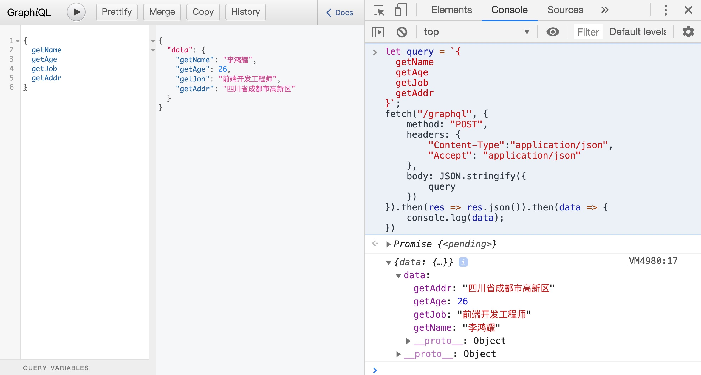

# # 查询别名

## 1. 背景

当后端返回的是一个对象数组时，每个对象中有很多字段，比如name,sex,age等，此时我可能想要得到其中由name组成的集合，由age组成的集合，如下：

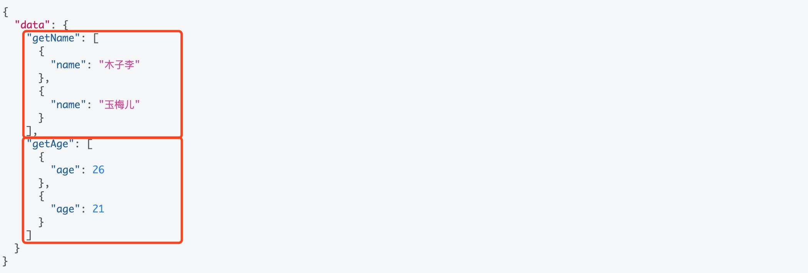

但正常情况下我们获取的是这样的，name与age是在一个对象中的：

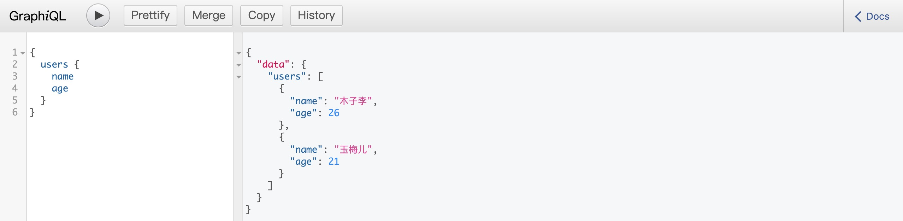

## 2. 后端代码

```js
// 1. 变量
const express = require("express");
const graphqlHTTP = require("express-graphql");
const { buildSchema } = require("graphql");
const app = express();
// 2. 使用 GraphQL Schema Language 创建一个 schema
const schema = buildSchema(`
  type User {
      name: String!,
      gender: String
      age: Int,
      hobby: [String]
  },
  type Query {
      users: [User]
  }
`);
// 3. 定义User类
class User {
    constructor(name, gender, age, hobby) {
        this.name = name;
        this.gender = gender;
        this.age = age;
        this.hobby = hobby;
    }
}
// 4. root 提供所有 API 入口端点相应的解析器函数
const root = {
    users: () => {
        return [
            new User("木子李", "男", 26, ["吉他", "烹饪", "旅行"]),
            new User("玉梅儿", "女", 21, ["遛狗", "美甲"])
        ]
    }
};


// 5. 处理路由
app.use('/graphql', graphqlHTTP({
    schema: schema,
    rootValue: root,
    graphiql: true,
}));

// 6. 监听窗口
app.listen(4000, "0.0.0.0");

console.log('Running a GraphQL API server at localhost:4000/graphql');
```

## 3. 前端代码

```js
let query = `{
  getName:users { name }
  getAge: users { age }
}`;
fetch("/graphql", {
	method: "POST",
	headers: {
		"Content-Type":"application/json",
		"Accept": "application/json"
	},
	body: JSON.stringify({
		query
	})
}).then(res => res.json()).then(data => {
	console.log(data);
})
```

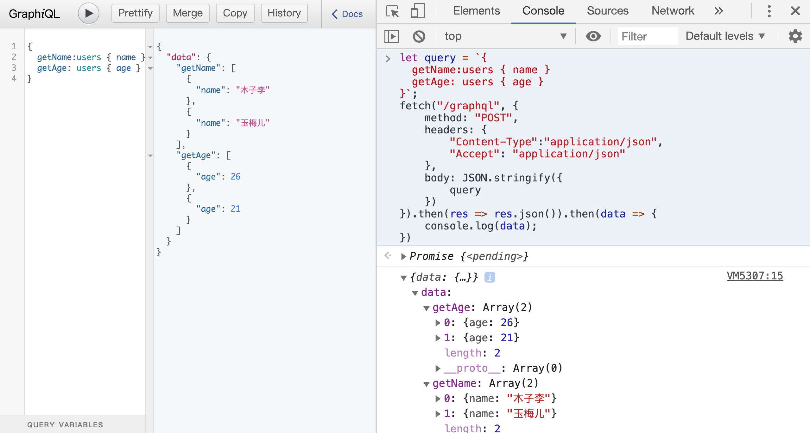

# # 嵌套查询

## 1. 基本说明

当我们返回的数据是一个对象数组，然后每个对象元素中有的属性的值又是对象数组，这时我们就可以使用嵌套查询了。如下所示：

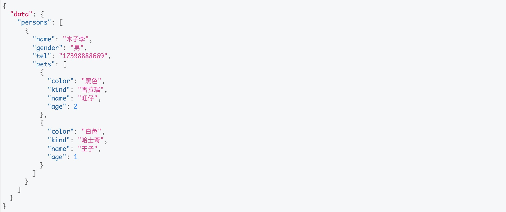

## 2. 后端代码

```js
// 1. 变量
const express = require("express");
const graphqlHTTP = require("express-graphql");
const { buildSchema } = require("graphql");
const app = express();
// 2. 使用 GraphQL Schema Language 创建一个 schema
const schema = buildSchema(`
  type Person {
      name: String,
      gender: String,
      tel: String,
      pets: [Pet]
  }
  type Pet {
      color: String,
      kind: String,
      name: String,
      age: Int
  }
  type Query {
      persons: [Person]
  }
`);
// 3. 定义类
class Person {
    constructor(name, gender, tel, pets) {
        this.name = name;
        this.gender = gender;
        this.tel = tel;
        this.pets = pets;
    }
}
class Pet {
    constructor(name, color, kind, age) {
        this.name = name;
        this.color = color;
        this.kind = kind;
        this.age = age;
    }
}
// 4. root 提供所有 API 入口端点相应的解析器函数
const root = {
    persons: () => {
        return [
            new Person("木子李", "男", "17398888669", [
                new Pet("旺仔", "黑色", "雪拉瑞", 2),
                new Pet("王子", "白色", "哈士奇", 1)
            ])
        ]
    }
};


// 5. 处理路由
app.use('/graphql', graphqlHTTP({
    schema: schema,
    rootValue: root,
    graphiql: true,
}));

// 6. 监听窗口
app.listen(4000, "0.0.0.0");

console.log('Running a GraphQL API server at localhost:4000/graphql');
```

## 3. 前端代码

```js
let query = `{
  persons { name gender tel pets { color kind name age } }
}`;
fetch("/graphql", {
	method: "POST",
	headers: {
		"Content-Type":"application/json",
		"Accept": "application/json"
	},
	body: JSON.stringify({
		query
	})
}).then(res => res.json()).then(data => {
	console.log(data);
})
```

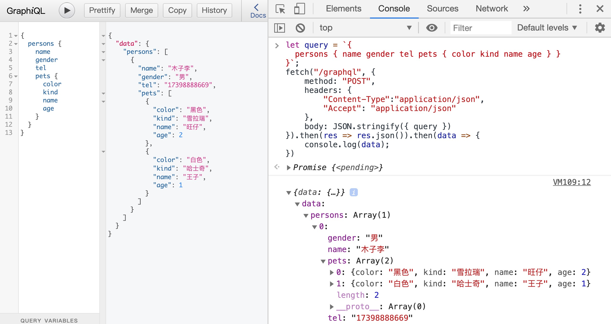

# # 分片查询

## 1. 说明

当我们返回的数据是一个对象或者对象数组时，我们必须在他的后面加上一个括号，里面给上需要的字段，每次查询都需要这样写，查询较多时就比较麻烦。

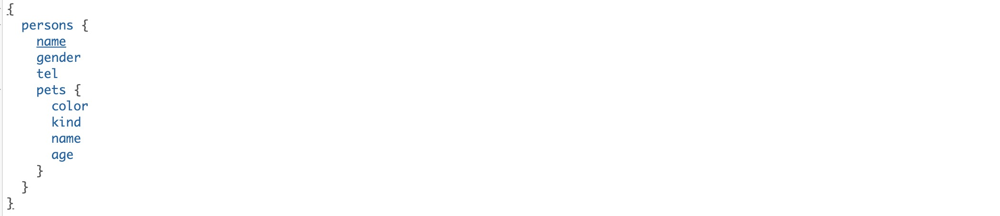

这时我们就可以采取分片查询了。如下：其中Person是我在后端定义的要返回的类型，我根据他分片了个per出来，下面我要查询相关字段时直接使用pert就可以了（这里使用了es6的扩展运算符）

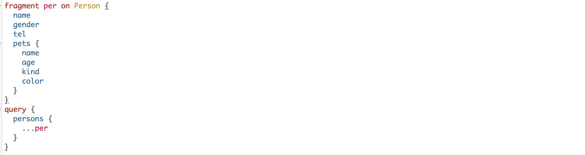

## 2. 后端代码

```js
// 1. 变量
const express = require("express");
const graphqlHTTP = require("express-graphql");
const { buildSchema } = require("graphql");
const app = express();
// 2. 使用 GraphQL Schema Language 创建一个 schema
const schema = buildSchema(`
  type Person {
      name: String,
      gender: String,
      tel: String,
      pets: [Pet]
  }
  type Pet {
      color: String,
      kind: String,
      name: String,
      age: Int
  }
  type Query {
      persons: [Person]
  }
`);
// 3. 定义类
class Person {
    constructor(name, gender, tel, pets) {
        this.name = name;
        this.gender = gender;
        this.tel = tel;
        this.pets = pets;
    }
}
class Pet {
    constructor(name, color, kind, age) {
        this.name = name;
        this.color = color;
        this.kind = kind;
        this.age = age;
    }
}
// 4. root 提供所有 API 入口端点相应的解析器函数
const root = {
    persons: () => {
        return [
            new Person("木子李", "男", "17398888669", [
                new Pet("旺仔", "黑色", "雪拉瑞", 2),
                new Pet("王子", "白色", "哈士奇", 1)
            ])
        ]
    }
};


// 5. 处理路由
app.use('/graphql', graphqlHTTP({
    schema: schema,
    rootValue: root,
    graphiql: true,
}));

// 6. 监听窗口
app.listen(4000, "0.0.0.0");

console.log('Running a GraphQL API server at localhost:4000/graphql');
```

## 3. 前端代码

```js
let query = `fragment per on Person {
  name
  gender
  tel
  pets { name age kind color }
}
query {
  persons {
    ...per
  }
}`;
fetch("/graphql", {
	method: "POST",
	headers: {
		"Content-Type":"application/json",
		"Accept": "application/json"
	},
	body: JSON.stringify({ query })
}).then(res => res.json()).then(data => {
	console.log(data);
})
```

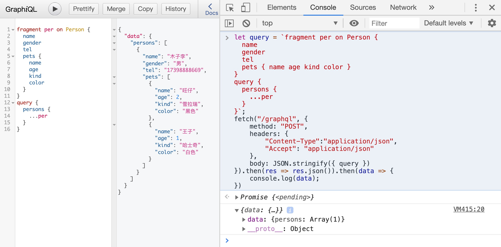

# # 自动生成的接口文档

在我们的页面中，我们可以获取查询的相关文档描述，就在最右边

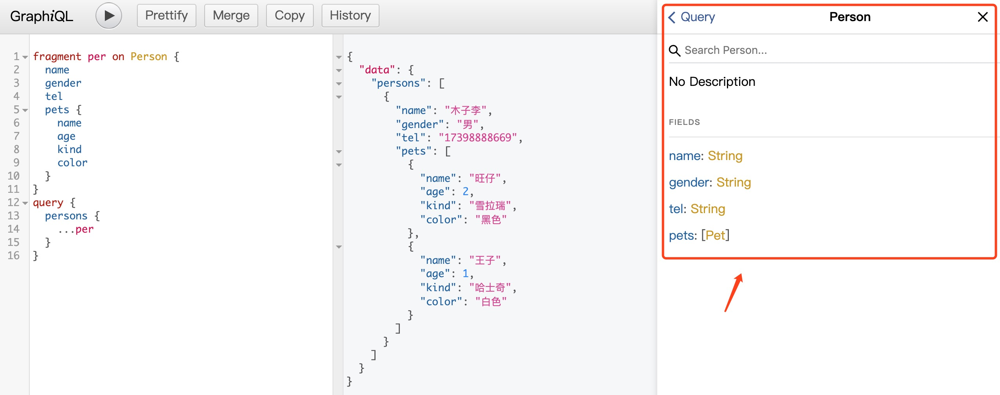

# # 完整流程：mysql -> nodeJS -> 前端

## 1. nodeJS 中的回调问题

我们已经知道nodeJS操作数据库是在回调函数中进行的，是无法直接返回操作结果。代码如下所示：

```js
// 1. 变量
const express = require("express");
const graphqlHTTP = require("express-graphql");
const { buildSchema } = require("graphql");
const app = express();
// 2. 使用 GraphQL Schema Language 创建一个 schema
const schema = buildSchema(`
  type Query {
      infos: String
  }
`);

// 4. root 提供所有 API 入口端点相应的解析器函数
const getConnection = require("./mysqlConnection");
const root = {
    infos: () => {
        const db = getConnection();
        db.connect();
        db.query("SELECT * FROM infos", (err, sqlRes) => {
            if (err) {
                console.log("[SELECT ERROR]: ", err.message);
                return;
            } 
            db.end();
            // 返回数据至前端
            return JSON.stringify(sqlRes);
        })
        db.end();
    }
};


// 5. 处理路由
app.use('/graphql', graphqlHTTP({
    schema: schema,
    rootValue: root,
    graphiql: true,
}));

// 6. 监听窗口
app.listen(4000, "0.0.0.0");

console.log('Running a GraphQL API server at localhost:4000/graphql');
```

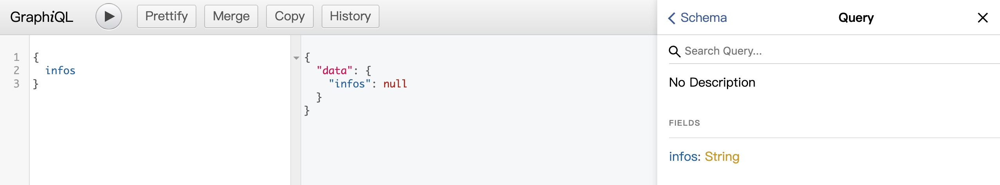

可以看到，在后台无法直接返回数据。前端返回结果为null。

## 2. 通过promise返回数据

### 2.1. 后端代码

数据库连接代码：mysqlConnection.js

```js
// 导入mysql模块
const mysql = require("mysql");
// 默认配置
const defaultOptions = {
    host: '127.0.0.1',
    port: '3306',
    user: 'root',
    password: '123',
    database: 'db_test'
}
// 获取connection对象
function getConnection(options = defaultOptions) {
    return mysql.createConnection(options);
}
// 导出getConnection
module.exports = getConnection;
```

构建graphql服务的文件：app.js

```js

const express = require("express");
const graphqlHTTP = require("express-graphql");
const { buildSchema } = require("graphql");
const app = express();
const getConnection = require("./mysqlConnection");

// 2. 使用 GraphQL Schema Language 创建一个 schema
const schema = buildSchema(`
  type Query {
      infos: String
  }
`);

// 4. root 提供所有 API 入口端点相应的解析器函数

const root = {
    infos: () => {
        // 直接返回promise
        return new Promise(function (resolve, reject) {
            const db = getConnection();
            db.connect();
            db.query("SELECT * FROM infos", (err, sqlRes) => {
                if (err) {
                    console.log("[SELECT ERROR]: ", err.message);
                    return;
                } else {
                    // 返回数据至前端
                    resolve(JSON.stringify(sqlRes));
                }
            });
            db.end();
        });

    }
};


// 5. 处理路由
app.use('/graphql', graphqlHTTP({
    schema: schema,
    rootValue: root,
    graphiql: true,
}));

// 6. 监听窗口
app.listen(4000, "0.0.0.0");

console.log('Running a GraphQL API server at localhost:4000/graphql');
```

### 2.2. 前端代码

```js
fetch("/graphql", {
	method: "POST",
	headers: {
		"Content-Type":"application/json",
		"Accept": "application/json"
	},
	body: JSON.stringify({query: "{infos}"})
}).then(res => res.json()).then(data => {
	console.log(JSON.parse(data.data.infos));
});
```


# # 在 GraphQL 下跨域

```js
// 设置跨域访问（设置在所有的请求前面即可）
app.all("*", function (req, res, next) {
    // 设置允许跨域的域名，*代表允许任意域名跨域
    res.header("Access-Control-Allow-Origin", "*");
    // 允许的header类型
    res.header("Access-Control-Allow-Headers", "content-type");
    // 跨域允许的请求方式 
    res.header("Access-Control-Allow-Methods", "DELETE,PUT,POST,GET,OPTIONS");
    if (req.method == 'OPTIONS')
        res.sendStatus(200); // 让options尝试请求快速结束
    else
        next();
});
```

# # 验证 Token

 我们可以在两个地方验证token

## 1. 跨域时验证

后端代码

```js
const express = require("express");
const graphqlHTTP = require("express-graphql");
const { buildSchema } = require("graphql");
const getConnection = require("./mysqlConnection");


//  使用 GraphQL Schema Language 创建一个 schema
const schema = buildSchema(`
    type Query {
        infos: String
    }
`);
//  root 提供所有 API 入口端点相应的解析器函数
const root = {
    infos: () => {
        //  直接返回promise
        return new Promise(function (resolve, reject) {
            const db = getConnection();
            db.connect();
            db.query("SELECT * FROM infos", (err, sqlRes) => {
                if (err) {
                    console.log("[SELECT ERROR]: ", err.message);
                    return;
                } else {
                    //  返回数据至前端
                    resolve(JSON.stringify(sqlRes));
                }
            });
            db.end();
        });
    },
};
const app = express();
const bodyParser = require("body-parser");
app.use(bodyParser.urlencoded({ extended: false }));
app.use(bodyParser.json());
// 设置跨域访问（设置在所有的请求前面即可）
app.all("*", function (req, res, next) {
    // 设置允许跨域的域名，*代表允许任意域名跨域
    res.header("Access-Control-Allow-Origin", "*");
    // 允许的header类型
    res.header("Access-Control-Allow-Headers", "content-type");
    // 跨域允许的请求方式 
    res.header("Access-Control-Allow-Methods", "DELETE,PUT,POST,GET,OPTIONS");
    if (req.method == "OPTIONS")
        res.sendStatus(200); // 让options尝试请求快速结束
    else {
        // 可以在这里实现token验证
        console.log("有请求进入了后端", req.body)
        const obj = req.body;
        if (obj.token != "123456") {
            res.send(JSON.stringify({ state: "token无效，请重新登录" }));
        } else {
            next(); // token通过进入下一个流程
        }
    }
});
app.use("/graphql", graphqlHTTP({
    schema: schema,
    rootValue: root,
    graphiql: true,
}));
app.listen(4000);
console.log("Running a GraphQL API server at http:// localhost:4000/graphql");
```
前端代码
```js
fetch("http://localhost:4000/graphql", {
	method: "POST",
	headers: {
		"Content-Type":"application/json",
		"Accept": "application/json"
	},
	body: JSON.stringify({query: "{ infos }", token: "1256"})
}).then(res => res.json()).then(data => {
	console.log(data);
}).catch(err => {
	console.log(err);
});
```

## 2. 中间件验证


