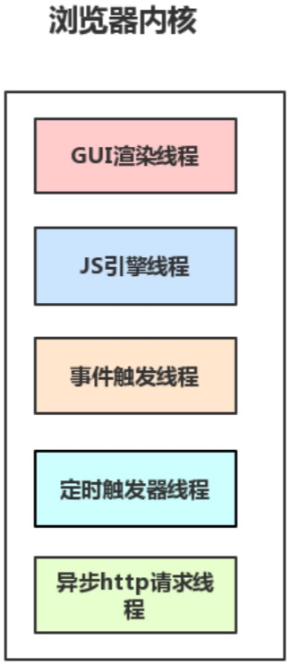
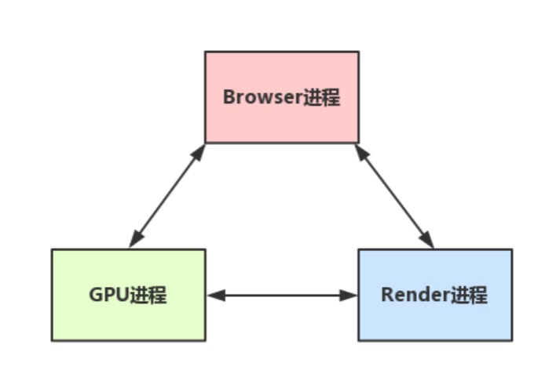

# 一、进程与线程

**\1. 基本说明**

- 进程是cpu资源分配的最小单位（系统会给它分配内存）

- 线程是cpu调度的最小单位（线程是建立在进程的基础上的一次程序运行单位，一个进程中可以有多个线程）

**\2. 进程示例**

- macOS用户可在活动监视器查看

- windows用户可在任务管理查看

> 提示：
>
> 1. 不同进程之间也可以通信，不过代价较大。
>
> 2. 一般所说的单线程与多线程，都是指在一个进程内的单和多。

# 二、浏览器是多进程的

## 1. 概述

浏览器是多进程的，浏览器之所以能够运行，是因为系统给它的进程分配了资源（cpu、内存），简单点理解，每打开一个Tab页，就相当于创建了一个或多个的浏览器进程。

> 注意：有时一个页面被打开，可能会开启相关的多个进程进行运行，打开多个页面有时又会被合并为一个进程，所以页面数和进程数并不是一一对应的。

## 2. 浏览器包含哪些进程？

**a. 浏览器的主进程**

只有一个，负责协调、主控各个其他进程。

**b. 第三方插件进程**

每种类型的插件对应一个进程，仅当使用该插件时才创建。

**c. GPU进程**

用于3D绘制等，最多一个。

**d. 浏览器渲染进程（渲染引擎/Renderer进程）**

其内部是多线程的，默认每个Tab页面一个渲染进程，互不影响。主要作用为页面渲染，脚本执行，事件处理等。浏览器内核分以下四大类：

- Trident：IE
- Gecko：Firefox
- Blink：Oprea、Google
- Webkit：Safari、Google

> 注意：很多时候我们所说的浏览器内核 其实就是 浏览器渲染进程。

## 3. 浏览器多进程优势？

相比于单进程浏览器，多进程有如下优点：

- 避免单个页面的问题到影响整个浏览器
- 避免第三方插件影响整个浏览器
- 多进程充分利用多核优势
- 方便使用沙盒模型隔离插件等进程，提高浏览器稳定性

当然，多进程意味着内存等资源消耗也会更大，有点空间换时间的意思。

# 三、渲染进程 *

## 1. 说明

重点来了，我们可以看到，上面提到了这么多的进程，那么，对于普通的前端操作来说，最重要的是什么呢？答案是 **<ins style="color:red;">渲染进程</ins>**。可以这样理解，页面的渲染，JS的执行，事件的循环，都在这个进程内进行。接下来重点分析这个进程。

## 2. 渲染进程分析

在前面我们已经知道，**浏览器的渲染进程是多线程的**，那么接下来看看它都包含了哪些线程（列举一些主要常驻线程）

### 2.1. GUI渲染线程

处理html，css，渲染页面

\1. 负责渲染浏览器界面，解析HTML，CSS，构建DOM树和CSS规则树，布局和绘制等。

\2. 当界面需要重绘（Repaint）或重排（reflow）时 (很多时候我们也称之为回流)，该线程就会执行。

### 2.2. JS 引擎线程

执行JS代码

\1. 也称为JS内核，负责处理Javascript脚本程序，解析Javascript脚本，运行代码。（例如V8引擎）

\2. JS引擎一直等待着任务队列中任务的到来，然后加以处理，一个Tab页（renderer/渲染进程）中无论什么时候都只有一个JS引擎线程在运行JS程序

### 2.3. 事件触发线程

处理JS事件

\1. 事件触发线程归属于浏览器而不是JS引擎，用来控制事件循环EventLoop（可以理解，JS引擎自己都忙不过来，需要浏览器另开线程协助）

> 事件循环（Event loop）的含义：
>
> 当JS引擎执行代码块如事件绑定时，会将事件函数添加到事件触发线程中，当对应的事件符合触发条件被触发时，事件触发线程就会把事件函数添加到待处理队列的队尾，等待JS引擎的处理
>
> 【js引擎线程-->事件触发线程--->任务队列（事件队列）--->js引擎线程】

### 2.4. 定时器触发线程

\1. 所谓定时器触发线程即 setInterval 和 setTimeout所在的线程

\2. 浏览器定时计数器并不是由JavaScript引擎计数的，而是通过单独线程来计时的（计时完毕后，将其添加到任务队列（事件队列）中，等待JS引擎空闲后执行）

\3. setTimeout和setInterval的运行机制是，将指定的代码移出本次执行，等到下一轮Event Loop时，再检查是否到了指定时间。如果到了，就执行对应的代码；如果不到，就等到再下一轮Event Loop时重新判断。这意味着，setTimeout指定的代码，必须等到本次执行的所有代码都执行完，才会执行。

> 注意：W3C在HTML标准中规定，规定要求setTimeout中低于4ms的时间间隔算为4ms。

### 2.5. 异步http请求线程

\1. 在XMLHttpRequest连接后通过浏览器新开一个线程请求

\2. 当检测到状态变更时，如果设置有回调函数，异步线程就***\*产生状态变更事件\****，将这个回调再放入任务队列（事件队列）中。再由JavaScript引擎执行。

## 3. 图例说明

## 4. 注意

- 由于JS引擎是单线程关系，所以这些任务队列（事件队列）中待处理的事件都得排队等待JS引擎处理（当JS引擎空闲时才会去执行），所以对于定时器之类的定时有可能就不准确。

- **GUI渲染线程与JS引擎线程是互斥的**，当JS引擎执行时GUI线程会被挂起（相当于被冻结了），GUI更新会被保存在**任务队列**中等到JS引擎空闲时立即被执行。所以如果JS执行的时间过长，这样就会造成页面的渲染不连贯，导致页面渲染加载阻塞。

# 四、浏览器主进程 和 浏览器内核进程的通信

(1) Browser主进程收到用户请求，首先需要获取页面内容（譬如通过网络下载资源）。

(2) Browser主进程将获取的内容传给浏览器渲染（Render）进程/内核进程。

(3) Render进行中的各线程相互配合后得到最终的渲染结果，然后传递给GPU进程。

(4) GPU进程接收到结果并将结果绘制出来，最后有通过Browser进程进行显示。

> 提示：各个进程间可能会相互的配合使用。

# 五、浏览器内核（Render进程）渲染的流程

客户端在接收服务器传输过来的文件之后，便由浏览器的引擎开始解析文件并在屏幕中渲染出来，其步骤主要如下：

(1) 处理HTML构建出DOM树；

(2) 处理CSS构建出CSSOM树；

(3) 将DOM树和CSSOM树合并成渲染树；

(4) 根据渲染树来布局，计算每个节点的位置；

(5) 调用 GPU 绘制，合成图层，显示在屏幕上

> 提示：
>
> - 第四步和第五步是最耗时的部分，这两步合起来，就是我们通常所说的渲染
> - 渲染完毕后就是load事件了，之后就是自己的JS逻辑处理了

# 六、回流与重绘

- 回流：在元素的内容、结构、位置或尺寸等发生变化时，需要重新计算它的样式和重构渲染树，这个过程叫做回流。

- 重绘：当元素仅发生外观上的改变（如背景色、边框颜色、文字颜色等）时，只需要应用新的样式而不需要修改其CSSOM树和DOM树，这个过程就叫做重绘。

> 提示：回流的成本要比重绘高得多，所以在实际开发过程中，我们应尽量避免回流的发生，因为DOM树里的每个结点都会有reflow方法，一个结点的reflow很有可能导致子结点，甚至父点以及同级结点的reflow。

# 七、延伸

**\1. load事件与DOMContentLoaded事件的先后?**

上面提到，渲染完毕后会触发load事件，那么你能分清楚load事件与DOMContentLoaded事件的先后么？

(1) Load 事件触发代表页面中的 DOM，CSS，JS，图片已经全部加载完毕。

(2) DOMContentLoaded 事件触发代表初始的 HTML 被完全加载和解析，不需要等待 CSS，JS，图片加载

所以，顺序是：DOMContentLoaded -> load

**\2. CSS加载是否会阻塞dom树渲染？**

这里说的是头部通过link标签引入css的情况

首先，我们都知道：***\*css是由单独的下载线程异步下载的。\****

然后再说下几个现象：

①　css加载不会阻塞DOM树解析（异步加载时DOM照常构建）

②　但会阻塞render树渲染（渲染时需等css加载完毕，因为render树需要css信息）

这可能也是浏览器的一种优化机制。

因为你加载css的时候，可能会修改下面DOM节点的样式，
如果css加载不阻塞render树渲染的话，那么当css加载完之后，
render树可能又得重新重绘或者回流了，这就造成了一些没有必要的损耗。
所以干脆就先把DOM树的结构先解析完，把可以做的工作做完，然后等你css加载完之后，
在根据最终的样式来渲染render树，这种做法性能方面确实会比较好一点。

**\3. 一个网页执行的完整过程**

结合浏览器的各进程线程，总结下一个网页执行的完整过程，及其步骤：

(1) Browser主进程发起请求，下载网页

(2) Browser主进程把网页传给渲染进程

(3) 渲染进程进行处理

  - 使用GUI线程处理和解析HTML+CSS

  - 在解析html时遇到了js时的处理：如果在解析html时遇到了js，那么就是使用js引擎线程进行解析执行

    并且js引擎线程和gui线程是互斥的。具体执行过程如下：

    \a . EventLoop事件循环

    \b . 宏任务和微任务

    \c . load事件与DOMContentLoaded

（4）GPU线程绘制

（5）主进程进行显示

# 八、总结

\1. 进程和线程的基本概念

\2. 浏览器是多进程的，主要含有的进程有哪些【大致4个】？

\3. 浏览器多进程的优势？

\4. 渲染进程里可以干什么？

\5. 渲染进程主要有哪些线程【5个】，其作用分别是什么？

\6. GUI渲染线程与JS引擎线程的关系？

\7. 浏览器主进程 和 浏览器内核进程 的通信

\8. load事件与DOMContentLoaded事件的区别？

\9. css加载是否会阻塞dom树渲染？渲染树呢？

\10. 宏任务和微任务

\11. 什么叫Event loop(事件循环)

\12. 结合浏览器的各进程线程，总结下一个网页执行的完整过程，及其步骤

